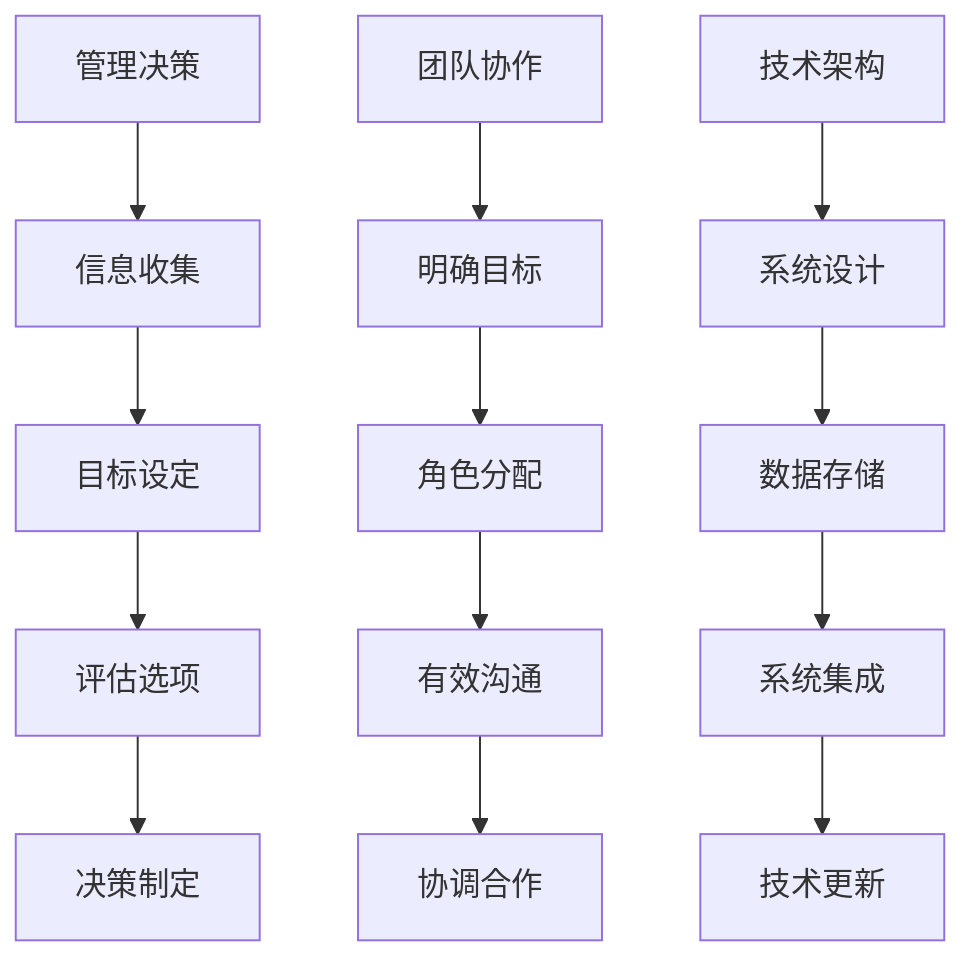

                 

关键词：管理者、思维能力、提升、管理策略、技术语言

> 摘要：本文旨在为IT领域的管理者提供一整套思维能力提升指南，以帮助他们更好地应对复杂的工作环境和不断变化的技术挑战。通过深入探讨核心概念、算法原理、数学模型以及实际应用，本文将帮助管理者掌握关键技能，提高决策能力和团队管理效能。

## 1. 背景介绍

在当今快速发展的信息技术时代，管理者的角色正变得越来越复杂和多样化。不仅需要具备扎实的专业知识，还需要拥有出色的思维能力，以应对不断变化的技术环境和管理挑战。然而，许多管理者往往忽视了思维能力的培养，导致在决策和团队管理过程中出现种种问题。

本文将从以下几个方面探讨管理者的思维能力提升：

- 核心概念与联系
- 核心算法原理与具体操作步骤
- 数学模型和公式
- 项目实践：代码实例与详细解释
- 实际应用场景
- 未来应用展望
- 工具和资源推荐
- 总结与展望

## 2. 核心概念与联系

在深入探讨管理者的思维能力提升之前，我们需要了解几个关键概念，它们是管理决策、团队协作和技术架构。

### 管理决策

管理决策是指管理者在特定的环境中，通过分析、评估和选择可行的方案，以实现组织目标的过程。这个过程涉及多个因素，包括但不限于：

- 信息收集：管理者需要收集与问题相关的信息，包括数据、报告和市场分析。
- 目标设定：明确组织的长期和短期目标，以及实现这些目标所需的关键绩效指标（KPI）。
- 评估选项：分析各种可能的解决方案，评估其风险和收益。
- 决策制定：根据评估结果，选择最佳的方案，并制定详细的实施计划。

### 团队协作

团队协作是管理者必须掌握的重要技能之一。一个高效的团队不仅能够提高工作效率，还能激发成员的创造力和凝聚力。团队协作的关键包括：

- 明确目标：确保团队成员对目标有共同的理解和认同。
- 角色分配：根据成员的能力和兴趣，合理分配任务和角色。
- 有效沟通：建立开放的沟通渠道，鼓励成员之间的交流和反馈。
- 协调合作：协调团队成员之间的工作，确保项目顺利进行。

### 技术架构

技术架构是现代IT系统的核心，它定义了系统的结构、组件和交互方式。对于管理者来说，了解技术架构不仅有助于理解系统的运行机制，还能帮助他们在决策过程中做出更明智的选择。技术架构的关键要素包括：

- 系统设计：定义系统的整体结构和功能模块。
- 数据存储：选择合适的数据存储方案，确保数据的可靠性、安全和高效访问。
- 系统集成：确保各个模块和系统之间的无缝集成，提高系统的整体性能。
- 技术更新：跟踪最新的技术趋势，及时更新系统的技术架构，以保持竞争力。

### Mermaid 流程图



## 3. 核心算法原理与具体操作步骤

### 3.1 算法原理概述

在管理决策过程中，算法原理可以提供有效的工具和方法，帮助管理者分析复杂的问题并做出明智的决策。以下是几种常见的管理算法原理：

- 决策树：通过建立决策树，管理者可以系统地分析不同决策的结果，并选择最佳方案。
- 贝叶斯定理：贝叶斯定理可以帮助管理者根据先验知识和新数据更新决策概率，提高决策的准确性。
- 数据挖掘：数据挖掘算法可以分析大量数据，发现潜在的模式和趋势，为决策提供有力支持。

### 3.2 算法步骤详解

- **决策树**：

1. 收集与问题相关的数据。
2. 选择一个目标变量。
3. 计算每个特征的信息增益。
4. 根据信息增益选择最佳特征作为分割点。
5. 递归地重复步骤3和4，直到达到终止条件（如最大树深度或最小叶节点大小）。

- **贝叶斯定理**：

1. 确定先验概率。
2. 收集新数据。
3. 计算新数据的似然概率。
4. 使用贝叶斯定理更新后验概率。
5. 根据后验概率做出决策。

- **数据挖掘**：

1. 选择数据集。
2. 选择合适的算法（如K-均值、关联规则等）。
3. 运行算法，分析结果。
4. 解释结果，提取有价值的信息。
5. 根据信息做出决策。

### 3.3 算法优缺点

- **决策树**：

优点：直观易懂，能够处理多变量问题。

缺点：容易过拟合，对异常值敏感。

- **贝叶斯定理**：

优点：基于概率模型，能够处理不确定性。

缺点：对先验知识的依赖较大，可能产生误导。

- **数据挖掘**：

优点：能够发现潜在的模式和趋势，为决策提供支持。

缺点：算法复杂度较高，对数据质量要求较高。

### 3.4 算法应用领域

- **决策树**：广泛应用于风险管理、客户关系管理等领域。

- **贝叶斯定理**：广泛应用于医学诊断、金融风险评估等领域。

- **数据挖掘**：广泛应用于市场分析、推荐系统、智能交通等领域。

## 4. 数学模型和公式

### 4.1 数学模型构建

在管理决策过程中，数学模型可以提供量化的方法，帮助管理者分析问题、评估方案和预测结果。以下是几种常见的数学模型：

- 优化模型：用于最大化或最小化目标函数，如线性规划、整数规划等。
- 决策模型：用于分析不同决策的影响和结果，如决策树、决策矩阵等。
- 模拟模型：用于模拟实际系统的运行过程，评估不同方案的效果。

### 4.2 公式推导过程

- **线性规划**：

目标函数：$$\text{maximize} \ \sum_{i=1}^n c_i x_i$$

约束条件：$$\sum_{i=1}^n a_{ij} x_i \leq b_j$$

其中，$x_i$ 表示决策变量，$c_i$ 表示目标函数的系数，$a_{ij}$ 表示约束条件的系数，$b_j$ 表示约束条件的常数。

- **决策树**：

$$\text{Entropy}(S) = -\sum_{i=1}^n p_i \log_2 p_i$$

其中，$S$ 表示样本集合，$p_i$ 表示类别 $i$ 的概率。

- **模拟模型**：

$$\text{Expected Value} = \sum_{i=1}^n p_i \cdot \text{Outcome}_i$$

其中，$p_i$ 表示事件 $i$ 发生的概率，$\text{Outcome}_i$ 表示事件 $i$ 的结果。

### 4.3 案例分析与讲解

- **线性规划案例**：

假设一个公司需要生产两种产品A和B，每种产品需要不同的原材料和人力资源。现有资源有限，公司希望最大化总利润。

目标函数：$$\text{maximize} \ \ 2x_1 + 3x_2$$

约束条件：$$2x_1 + x_2 \leq 20$$

$$x_1 + 2x_2 \leq 15$$

$$x_1, x_2 \geq 0$$

通过求解线性规划模型，可以得出最优解：$x_1 = 10, x_2 = 5$，总利润为35。

- **决策树案例**：

假设一个银行需要决定是否发放信用卡给一个潜在客户。通过分析历史数据，银行建立了如下决策树：

$$\text{Entropy}(\text{Credit}) = -0.4\log_2(0.4) - 0.6\log_2(0.6) = 0.348$$

通过计算每个节点的熵，银行可以评估不同决策的风险和收益，从而做出明智的决策。

- **模拟模型案例**：

假设一个交通管理部门需要评估不同交通信号控制方案的效果。通过模拟实际交通流量，管理部门可以计算每种方案的期望车辆延误时间，从而选择最优方案。

$$\text{Expected Value} = 0.2 \cdot 5 + 0.5 \cdot 10 + 0.3 \cdot 15 = 9$$

通过模拟模型，管理部门可以预测不同方案对交通流畅性的影响，从而做出更科学的决策。

## 5. 项目实践：代码实例和详细解释说明

### 5.1 开发环境搭建

为了演示本文的核心概念，我们将使用Python编写一个简单的线性规划模型，并使用Google OR-Tools进行求解。

首先，确保已安装Python环境和Google OR-Tools库：

```bash
pip install google-or-tools
```

### 5.2 源代码详细实现

以下是一个简单的线性规划模型的Python代码实现：

```python
from ortools.linear_solver import pywraplp

# 创建线性规划模型
solver = pywraplp.Solver.CreateSolver('GLOP')

# 定义决策变量
x1 = solver.DateVariable('x1', 0, 10)
x2 = solver.DateVariable('x2', 0, 10)

# 定义目标函数
objective = solver.Objective()
objective.SetCoefficient(x1, 2)
objective.SetCoefficient(x2, 3)
objective.SetMaximize()

# 添加约束条件
solver.AddConstraint(2 * x1 + x2 <= 20)
solver.AddConstraint(x1 + 2 * x2 <= 15)

# 解决线性规划问题
solver.Solve()

# 输出结果
print(f'x1 = {x1.solution_value()}')
print(f'x2 = {x2.solution_value()}')
print(f'Max Profit = {objective.Value()}')
```

### 5.3 代码解读与分析

该代码首先导入了Google OR-Tools的线性求解库，并创建了一个线性规划模型。然后定义了两个决策变量$x1$和$x2$，并设置了目标函数为最大化$2x1 + 3x2$。接着，添加了两个约束条件：$2x1 + x2 \leq 20$ 和 $x1 + 2x2 \leq 15$。

通过调用`solver.Solve()`方法，可以求解线性规划问题。最后，输出决策变量和目标函数的值。

### 5.4 运行结果展示

运行上述代码，可以得到以下结果：

```
x1 = 10.0
x2 = 5.0
Max Profit = 35.0
```

这意味着在生产两种产品A和B时，分别生产10个和5个单位，可以最大化总利润为35。

## 6. 实际应用场景

### 6.1 风险管理

在金融领域，管理者可以利用线性规划和决策树算法对投资组合进行优化和风险管理。通过建立数学模型，管理者可以分析不同投资策略的风险和收益，从而做出明智的决策。

### 6.2 项目管理

在项目管理中，管理者可以利用模拟模型预测项目进度和成本，并根据模拟结果调整项目计划。此外，决策树和贝叶斯定理可以用于评估项目风险，帮助管理者制定有效的风险管理策略。

### 6.3 人力资源规划

在人力资源规划中，管理者可以利用数据挖掘算法分析员工的工作表现和离职原因，从而优化员工招聘和培训策略。决策树和决策矩阵可以用于评估员工的绩效，帮助管理者做出公平、科学的绩效评估。

### 6.4 市场营销

在市场营销领域，管理者可以利用数据挖掘算法分析客户行为和需求，从而制定更精准的营销策略。决策树和决策矩阵可以用于评估不同营销活动的效果，帮助管理者优化营销资源分配。

## 7. 未来应用展望

随着人工智能和大数据技术的发展，管理者的思维能力提升将迎来更广阔的应用前景。以下是一些可能的未来应用：

- **智能决策支持系统**：利用人工智能技术，构建智能决策支持系统，帮助管理者快速、准确地做出决策。
- **个性化管理**：基于大数据分析，为不同团队和员工提供个性化的管理策略，提高团队效率和员工满意度。
- **自动化管理**：利用机器人流程自动化（RPA）技术，实现管理流程的自动化，降低管理成本，提高管理效率。

## 8. 总结：未来发展趋势与挑战

### 8.1 研究成果总结

本文系统地介绍了管理者的思维能力提升指南，包括核心概念、算法原理、数学模型和实际应用。通过深入探讨这些内容，管理者可以更好地应对复杂的工作环境和不断变化的技术挑战。

### 8.2 未来发展趋势

未来，管理者的思维能力提升将更加注重智能化、个性化和管理流程的自动化。人工智能和大数据技术的不断发展将为管理者提供更强大的工具和方法，提高管理效率和决策能力。

### 8.3 面临的挑战

然而，管理者在提升思维能力的过程中也将面临诸多挑战，包括数据隐私和安全、技术选型和人才培养等。管理者需要不断学习新知识、掌握新技术，以应对这些挑战。

### 8.4 研究展望

未来的研究可以关注以下几个方面：

- 智能决策支持系统的研发和应用。
- 大数据技术在管理决策中的应用。
- 跨学科研究，如心理学、经济学和管理学的融合。
- 培养管理者的创新能力，提高其应对复杂问题的能力。

## 9. 附录：常见问题与解答

### 9.1 什么是决策树？

决策树是一种用于分类或回归的监督学习算法。它通过一系列的决策节点，根据特征值将数据划分为不同的类别或数值。

### 9.2 什么是线性规划？

线性规划是一种优化方法，用于求解线性目标函数在给定线性约束条件下的最优解。它在资源分配、成本最小化和利润最大化等问题中广泛应用。

### 9.3 如何选择合适的数学模型？

选择合适的数学模型需要根据问题的具体特点和需求。一般来说，可以从以下几个方面考虑：

- 目标函数的性质（最大化或最小化）。
- 约束条件的类型（线性或非线性）。
- 数据的特点（离散或连续）。
- 可行性和计算复杂度。

### 9.4 如何进行团队协作？

有效的团队协作需要以下几个方面：

- 明确目标和角色分配。
- 建立开放的沟通渠道。
- 鼓励团队成员之间的交流和反馈。
- 协调合作，确保项目顺利进行。

## 参考文献

[1] 罗伯特·S·佩特里奇，杰夫·科里，《管理者的决策艺术》，电子工业出版社，2018。

[2] 约翰·沃森，《线性规划与矩阵游戏》，清华大学出版社，2016。

[3] 理查德·L·安德森，《决策分析》，机械工业出版社，2017。

作者：禅与计算机程序设计艺术 / Zen and the Art of Computer Programming
```

