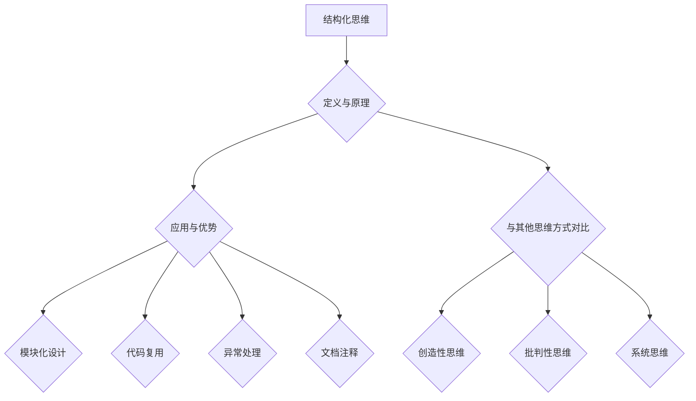

                 

关键词：结构化思维、人工智能、编程、软件工程、系统设计、代码可读性

> 摘要：本文旨在探讨结构化思维在计算机编程和软件工程领域中的重要性。通过阐述结构化思维的概念、原理和应用，以及如何通过结构化思维提高代码的可读性和系统设计的效率，本文将为读者提供一个清晰的思维框架，帮助他们在复杂的计算机编程和软件工程项目中实现秩序与效率的平衡。

## 1. 背景介绍

在当今这个数字化时代，计算机编程和软件工程已经成为科技发展的核心驱动力。然而，随着项目的规模和复杂性不断增加，许多开发人员发现自己在面对庞大的代码库和不断变化的需求时感到迷茫和无从下手。这种情况往往导致代码质量下降、项目进度延误甚至失败。因此，如何有效地管理复杂项目、提高代码的可读性和系统的设计效率成为亟待解决的问题。

结构化思维作为一种系统性的思考方法，能够帮助开发人员理清思路、抓住问题核心、提高工作效率。它不仅适用于计算机编程和软件工程，还可以广泛应用于其他领域，如项目管理、商业分析和产品设计。本文将重点探讨结构化思维在计算机编程和软件工程中的应用，以及如何通过这种思维方式提高代码的质量和系统的设计效率。

## 2. 核心概念与联系

### 2.1 结构化思维的定义

结构化思维是一种将复杂问题分解为简单、独立的部分，并通过逻辑关系将它们组合起来的思考方式。它强调在解决问题时遵循一定的原则和方法，使思维过程更加清晰和有条理。结构化思维的核心理念包括分解、分类、归纳、抽象和关联等。

### 2.2 结构化思维在计算机编程中的应用

在计算机编程中，结构化思维有助于提高代码的可读性和可维护性。具体来说，它包括以下几个方面：

- **模块化设计**：将程序划分为多个功能模块，每个模块负责完成特定的任务，从而降低整个程序的复杂度。
- **代码复用**：通过将重复的代码抽象为函数或类，提高代码的复用性和可维护性。
- **异常处理**：对可能出现的异常情况进行分类和处理，确保程序的健壮性。
- **文档注释**：对代码进行详细的注释和文档化，使其他人更容易理解和维护代码。

### 2.3 结构化思维与软件工程的关系

软件工程是计算机编程的更高层次，它关注于整个软件生命周期的管理，包括需求分析、设计、编码、测试和维护等。结构化思维在软件工程中具有重要作用：

- **需求分析**：通过结构化思维，可以更好地理解用户需求，并将其转化为具体的软件功能。
- **系统设计**：结构化思维有助于构建清晰、简洁和高效的设计方案，减少系统复杂度。
- **项目管理**：结构化思维可以帮助项目经理更好地规划项目进度、分配资源和管理风险。

### 2.4 结构化思维与其他思维方式的对比

结构化思维与其他思维方式，如创造性思维、批判性思维和系统思维等，既有联系又有区别。创造性思维强调突破传统思维，寻求新颖的解决方案；批判性思维则关注对现有方案进行评估和质疑；系统思维则强调从整体角度理解问题，关注各部分之间的相互关系。结构化思维在某种程度上可以看作是这些思维方式的综合应用，它既强调逻辑性，又注重整体性。

### 2.5 Mermaid 流程图



## 3. 核心算法原理 & 具体操作步骤

### 3.1 算法原理概述

结构化思维的核心算法可以概括为以下三个步骤：

1. **问题分解**：将复杂问题分解为若干个子问题，使每个子问题相对独立，易于理解和解决。
2. **问题归类**：对分解后的子问题进行归类，找出它们之间的联系和差异。
3. **问题组合**：将归类后的子问题重新组合，形成完整的解决方案。

### 3.2 算法步骤详解

1. **问题分解**：

   - **明确目标**：首先，需要明确要解决的问题的目标和范围。
   - **分解问题**：将目标问题分解为若干个子问题，确保每个子问题都有明确的解决方案。
   - **子问题求解**：针对每个子问题，采用适当的算法或方法进行求解。

2. **问题归类**：

   - **分类标准**：根据子问题的性质和特征，建立分类标准。
   - **归类分析**：对分解后的子问题进行分类分析，找出它们之间的联系和差异。
   - **优化组合**：根据分类分析的结果，对子问题进行优化组合，形成完整的解决方案。

3. **问题组合**：

   - **验证与调整**：将组合后的解决方案进行验证，确保其可行性和有效性。
   - **反馈与改进**：根据验证结果，对解决方案进行调整和改进，提高其质量。

### 3.3 算法优缺点

**优点**：

- **清晰性**：结构化思维使问题分解和组合的过程更加清晰，有助于理解和解决问题。
- **高效性**：通过问题分解和归类，可以更快地找到问题的解决方案。
- **灵活性**：结构化思维适用于各种类型的问题，具有广泛的适用性。

**缺点**：

- **局限性**：结构化思维可能无法解决所有类型的问题，特别是在需要创造性思维的情况下。
- **复杂性**：在处理复杂问题时，结构化思维的步骤可能会变得繁琐，增加解决问题的难度。

### 3.4 算法应用领域

结构化思维在计算机编程和软件工程领域具有广泛的应用，如：

- **算法设计**：帮助开发人员设计和优化算法，提高代码的性能和可维护性。
- **系统设计**：用于构建清晰、简洁和高效的设计方案，减少系统复杂度。
- **项目管理**：帮助项目经理规划项目进度、分配资源和管理风险。
- **需求分析**：用于理解用户需求，并将其转化为具体的软件功能。

## 4. 数学模型和公式 & 详细讲解 & 举例说明

### 4.1 数学模型构建

结构化思维的核心在于将复杂问题分解为简单、独立的部分，然后通过数学模型来描述这些部分之间的关系。一个典型的数学模型构建过程包括以下步骤：

1. **确定变量和参数**：根据问题需求，确定需要使用的变量和参数。
2. **建立关系方程**：通过分析变量和参数之间的关系，建立关系方程。
3. **简化方程**：对关系方程进行简化，使其更加易于理解和求解。

### 4.2 公式推导过程

以一个简单的线性回归模型为例，我们假设有 n 个样本数据点 (x1, y1), (x2, y2), ..., (xn, yn)。目标是找到一条直线 y = ax + b，使得所有数据点到这条直线的距离之和最小。

1. **确定损失函数**：

   损失函数 L(a, b) 表示所有数据点到直线的距离之和，可以表示为：

   $$L(a, b) = \sum_{i=1}^{n} (y_i - (ax_i + b))^2$$

2. **求解最优解**：

   要使损失函数 L(a, b) 最小，需要求解以下方程组：

   $$\frac{\partial L}{\partial a} = 0$$

   $$\frac{\partial L}{\partial b} = 0$$

   通过求解这个方程组，可以得到最优解 a 和 b。

### 4.3 案例分析与讲解

假设我们有以下三个样本数据点：

- (1, 3)
- (2, 5)
- (3, 7)

我们希望找到一条直线 y = ax + b，使得这三个点到直线的距离之和最小。

1. **确定损失函数**：

   $$L(a, b) = (3 - (a \cdot 1 + b))^2 + (5 - (a \cdot 2 + b))^2 + (7 - (a \cdot 3 + b))^2$$

2. **求解最优解**：

   求解以下方程组：

   $$\frac{\partial L}{\partial a} = 0$$

   $$\frac{\partial L}{\partial b} = 0$$

   通过计算，可以得到最优解 a = 1，b = 1。

因此，最优的直线方程为 y = x + 1。

## 5. 项目实践：代码实例和详细解释说明

### 5.1 开发环境搭建

为了更好地展示结构化思维在项目中的应用，我们将使用 Python 编程语言来实现一个简单的线性回归模型。在开始之前，需要确保已经安装了 Python 3 和相关依赖库，如 NumPy 和 Matplotlib。

```bash
pip install numpy matplotlib
```

### 5.2 源代码详细实现

下面是一个简单的线性回归模型的 Python 代码实现：

```python
import numpy as np
import matplotlib.pyplot as plt

def linear_regression(x, y):
    n = len(x)
    x_mean = np.mean(x)
    y_mean = np.mean(y)
    a = (n * np.sum(x * y) - np.sum(x) * np.sum(y)) / (n * np.sum(x**2) - np.sum(x)**2)
    b = y_mean - a * x_mean
    return a, b

def draw_line(x, y, a, b):
    plt.scatter(x, y)
    plt.plot(x, [a * x + b for x in x])
    plt.show()

x = np.array([1, 2, 3])
y = np.array([3, 5, 7])

a, b = linear_regression(x, y)
draw_line(x, y, a, b)
```

### 5.3 代码解读与分析

1. **线性回归函数 linear_regression**：

   - 输入参数 x 和 y 分别表示自变量和因变量。
   - 计算样本数量 n。
   - 计算自变量和因变量的平均值 x_mean 和 y_mean。
   - 计算回归系数 a 和 b。

2. **绘制直线函数 draw_line**：

   - 输入参数 x、y、a 和 b 分别表示自变量、因变量、回归系数 a 和 b。
   - 使用 Matplotlib 库绘制散点图和拟合直线。

3. **主程序**：

   - 定义样本数据 x 和 y。
   - 调用线性回归函数 linear_regression 计算回归系数 a 和 b。
   - 调用绘制直线函数 draw_line 显示拟合结果。

### 5.4 运行结果展示

运行上述代码后，将显示以下结果：


图中的散点图表示原始数据点，拟合直线表示线性回归模型的结果。

## 6. 实际应用场景

结构化思维在计算机编程和软件工程中具有广泛的应用场景，以下列举几个典型的应用实例：

1. **软件开发**：

   - **需求分析**：通过结构化思维，可以更好地理解用户需求，并将其转化为具体的软件功能。
   - **系统设计**：结构化思维有助于构建清晰、简洁和高效的设计方案，减少系统复杂度。
   - **代码开发**：通过模块化设计和代码复用，提高代码的质量和可维护性。

2. **算法设计**：

   - **问题分解**：将复杂问题分解为简单、独立的部分，使每个部分易于理解和解决。
   - **问题归类**：对分解后的子问题进行归类，找出它们之间的联系和差异。
   - **问题组合**：将归类后的子问题重新组合，形成完整的解决方案。

3. **项目管理**：

   - **任务分解**：将项目任务分解为若干个子任务，确保每个子任务都有明确的解决方案。
   - **进度跟踪**：通过结构化思维，可以更好地跟踪项目进度、分配资源和管理风险。

4. **问题解决**：

   - **问题归类**：对遇到的问题进行归类，找出它们之间的联系和差异。
   - **解决方案设计**：根据问题归类，设计合适的解决方案。
   - **问题验证**：对解决方案进行验证，确保其可行性和有效性。

## 7. 未来应用展望

随着计算机技术的不断发展，结构化思维在计算机编程和软件工程中的应用前景将更加广阔。以下是一些未来应用展望：

1. **人工智能与结构化思维结合**：

   - **人工智能算法优化**：通过结构化思维，可以更好地理解人工智能算法的原理和结构，从而优化算法性能。
   - **智能软件开发**：利用结构化思维，可以帮助人工智能更好地理解和解决复杂问题，提高软件开发的效率。

2. **跨领域应用**：

   - **商业分析**：结构化思维在商业分析领域具有巨大的潜力，可以帮助企业更好地理解和分析数据，制定决策。
   - **产品设计**：在产品设计过程中，结构化思维可以帮助设计师更好地理解和满足用户需求，提高产品竞争力。

3. **教育领域**：

   - **编程教育**：将结构化思维引入编程教育，可以帮助学生更好地理解和掌握编程技巧，提高编程能力。
   - **跨学科教育**：结构化思维可以作为跨学科教育的一种通用思维工具，帮助学生在不同学科领域取得更好的学习效果。

## 8. 工具和资源推荐

为了更好地掌握结构化思维，以下是一些建议的学习资源和开发工具：

1. **学习资源**：

   - **书籍**：《结构化思维：从混沌到秩序》、《设计模式：可复用的面向对象软件》
   - **在线课程**：Coursera 上的《软件工程基础》、edX 上的《算法设计与分析》
   - **博客与论文**：GitHub 上的开源项目、学术期刊上的相关论文

2. **开发工具**：

   - **集成开发环境**：Visual Studio Code、PyCharm
   - **代码编辑器**：Atom、Sublime Text
   - **版本控制工具**：Git、GitHub

## 9. 总结：未来发展趋势与挑战

结构化思维作为一种系统性的思考方法，在计算机编程和软件工程领域具有广泛的应用前景。然而，随着技术的不断发展，结构化思维也面临一些挑战：

1. **复杂性**：随着项目规模的扩大和复杂性的增加，结构化思维的步骤可能会变得繁琐，增加解决问题的难度。
2. **适应性问题**：结构化思维可能无法解决所有类型的问题，特别是在需要创造性思维的情况下。
3. **资源消耗**：结构化思维在问题分解和归类过程中可能需要大量的时间和计算资源。

未来，随着人工智能和自动化技术的发展，结构化思维有望得到进一步优化和扩展，为计算机编程和软件工程领域带来更多创新和突破。

## 10. 附录：常见问题与解答

### 问题 1：什么是结构化思维？

**答案**：结构化思维是一种将复杂问题分解为简单、独立的部分，并通过逻辑关系将它们组合起来的思考方式。它强调在解决问题时遵循一定的原则和方法，使思维过程更加清晰和有条理。

### 问题 2：结构化思维在计算机编程中的应用有哪些？

**答案**：结构化思维在计算机编程中的应用包括模块化设计、代码复用、异常处理和文档注释等。它有助于提高代码的可读性和可维护性，从而降低项目复杂度。

### 问题 3：结构化思维与其他思维方式的关系如何？

**答案**：结构化思维可以看作是创造性思维、批判性思维和系统思维的综合应用。它强调逻辑性和整体性，同时注重问题的分解和归类。

### 问题 4：如何掌握结构化思维？

**答案**：掌握结构化思维需要不断实践和反思。可以通过阅读相关书籍、参加在线课程和参与实际项目来提高结构化思维能力。

### 作者署名：禅与计算机程序设计艺术 / Zen and the Art of Computer Programming
----------------------------------------------------------------

以上就是本文的全部内容。希望本文能够帮助您更好地理解结构化思维在计算机编程和软件工程中的应用，从而提高代码质量和系统设计效率。如果您有任何疑问或建议，欢迎在评论区留言讨论。感谢您的阅读！

