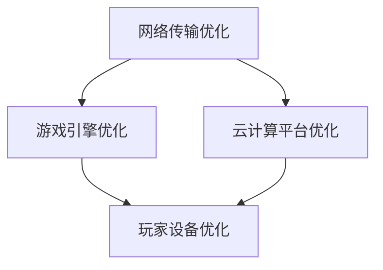
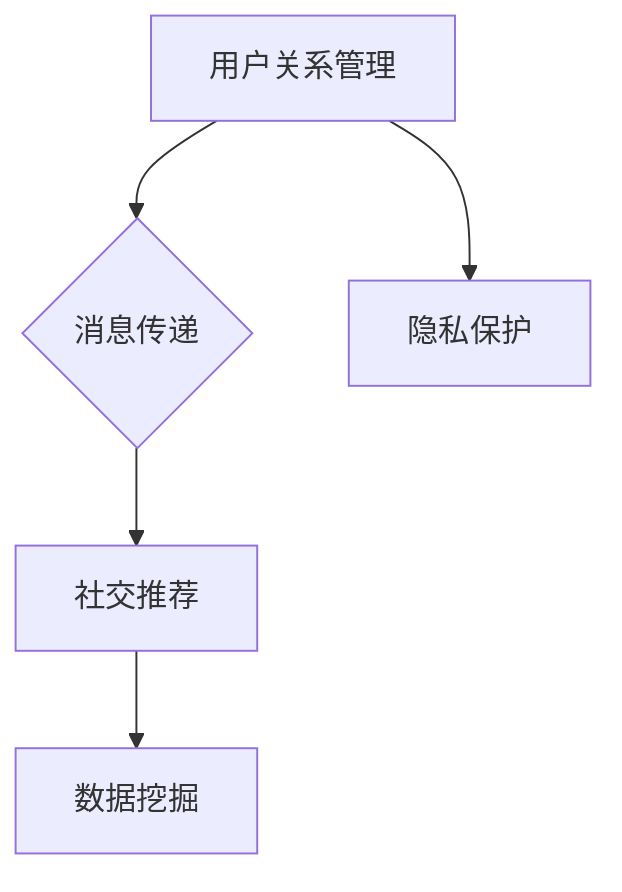

                 

 关键词：云游戏、延迟优化、社交网络、工程师面试、算法原理、数学模型、项目实践、工具资源、未来展望

> 摘要：本文针对网易2025云游戏延迟优化社交网络工程师的面试要求，深入分析了云游戏延迟优化技术、社交网络架构及其相关算法原理。通过具体的数学模型和实际项目实践，探讨了如何有效降低云游戏延迟，提高用户体验，为未来云游戏社交网络的创新与发展提供了参考。

## 1. 背景介绍

随着云计算和移动互联网的快速发展，云游戏成为游戏行业的新风口。然而，云游戏面临的一个重大挑战就是延迟问题，尤其是对于实时性和交互性要求极高的游戏场景。如何在保证高质量游戏体验的同时，有效降低延迟，是当前研究的热点。

社交网络作为游戏的重要组成部分，其性能和用户体验直接影响到玩家的满意度和活跃度。网易作为国内领先的互联网公司，其在云游戏领域有着卓越的成就。本文将针对网易2025云游戏延迟优化社交网络工程师的面试要求，介绍相关的技术原理、算法模型以及实际应用。

## 2. 核心概念与联系

### 2.1 云游戏延迟优化技术

云游戏延迟优化主要涉及网络传输、游戏引擎优化、云计算平台优化等方面。通过以下流程图（使用Mermaid语法）展示核心概念和联系：



### 2.2 社交网络架构

社交网络架构主要包括用户关系管理、消息传递、社交推荐等模块。以下为社交网络架构的 Mermaid 流程图：



## 3. 核心算法原理 & 具体操作步骤

### 3.1 算法原理概述

云游戏延迟优化算法主要基于网络质量监测、路径选择、流量控制等原理。社交网络优化算法主要涉及图论、机器学习等领域。

### 3.2 算法步骤详解

#### 3.2.1 网络质量监测

通过网络质量监测算法，实时获取玩家的网络状态，包括带宽、延迟等参数。以下为网络质量监测的数学模型：

$$
Q = \frac{1}{N} \sum_{i=1}^{N} (w_i \cdot q_i)
$$

其中，$Q$为网络质量评分，$w_i$为权重，$q_i$为第$i$个网络参数。

#### 3.2.2 路径选择

基于网络质量监测结果，采用最短路径算法（如Dijkstra算法）选择最佳传输路径，降低延迟。具体步骤如下：

1. 初始化：设置起始节点为源节点，终点为目标节点。
2. 构建图：将网络质量监测结果构建为图模型。
3. 搜索：从源节点开始，逐步搜索到目标节点，记录路径长度。
4. 选择最佳路径：根据路径长度选择最佳路径。

#### 3.2.3 流量控制

采用流量控制算法，根据网络带宽和延迟情况，动态调整数据传输速率，保证网络稳定运行。具体步骤如下：

1. 初始化：设置初始传输速率。
2. 监测：实时监测网络状态。
3. 调整：根据监测结果调整传输速率。

### 3.3 算法优缺点

网络质量监测算法主要优点是实时性强、适应性高，但存在计算复杂度较高的问题。最短路径算法优点是简单易实现，但可能无法充分考虑网络动态变化。流量控制算法优点是能保证网络稳定运行，但可能影响传输效率。

### 3.4 算法应用领域

网络质量监测算法、最短路径算法和流量控制算法广泛应用于云游戏、在线教育、远程医疗等领域。

## 4. 数学模型和公式 & 详细讲解 & 举例说明

### 4.1 数学模型构建

网络质量监测数学模型：

$$
Q = \frac{1}{N} \sum_{i=1}^{N} (w_i \cdot q_i)
$$

其中，$Q$为网络质量评分，$w_i$为权重，$q_i$为第$i$个网络参数。

最短路径算法（Dijkstra算法）数学模型：

$$
d(s, v) = \min \{d(s, u) + w(u, v) | u \in S\}
$$

其中，$d(s, v)$为从源节点$s$到目标节点$v$的最短路径长度，$S$为已访问节点集合，$w(u, v)$为边权值。

流量控制算法数学模型：

$$
r(t) = \alpha \cdot Q(t) + (1 - \alpha) \cdot r(t - 1)
$$

其中，$r(t)$为第$t$时刻的传输速率，$Q(t)$为第$t$时刻的网络质量评分，$\alpha$为调节系数。

### 4.2 公式推导过程

网络质量监测公式推导：

设网络中有$N$个参数，分别为$q_1, q_2, ..., q_N$，权重分别为$w_1, w_2, ..., w_N$，则网络质量评分为：

$$
Q = \frac{1}{N} \sum_{i=1}^{N} (w_i \cdot q_i)
$$

最短路径算法（Dijkstra算法）推导：

设$S$为已访问节点集合，$U$为未访问节点集合，$d(s, v)$为从源节点$s$到目标节点$v$的最短路径长度，$w(u, v)$为边权值，则有：

$$
d(s, v) = \min \{d(s, u) + w(u, v) | u \in S\}
$$

流量控制算法推导：

设$r(t)$为第$t$时刻的传输速率，$Q(t)$为第$t$时刻的网络质量评分，$\alpha$为调节系数，则有：

$$
r(t) = \alpha \cdot Q(t) + (1 - \alpha) \cdot r(t - 1)
$$

### 4.3 案例分析与讲解

假设有一个云游戏场景，需要优化网络传输延迟。以下为具体案例分析：

1. 网络质量监测：通过监测，得到以下网络参数及其权重：
   - 带宽：$q_1 = 100$，权重$w_1 = 0.5$
   - 延迟：$q_2 = 50$，权重$w_2 = 0.3$
   - 错误率：$q_3 = 10$，权重$w_3 = 0.2$

   计算网络质量评分：
   $$
   Q = \frac{1}{3} \cdot (0.5 \cdot 100 + 0.3 \cdot 50 + 0.2 \cdot 10) = 0.5
   $$

2. 路径选择：假设网络中有5个节点，构建图模型如下：

   ```mermaid
   graph TD
       A[节点1] --> B[节点2](延迟40ms)
       A --> C[节点3](延迟60ms)
       B --> D[节点4](延迟30ms)
       C --> D(延迟20ms)
   ```

   采用Dijkstra算法，选择最佳路径为$A \rightarrow B \rightarrow D$，路径长度为70ms。

3. 流量控制：假设初始传输速率为100Mbps，调节系数$\alpha = 0.8$。根据网络质量评分，计算第5分钟的传输速率：
   $$
   r(5) = 0.8 \cdot 0.5 + (1 - 0.8) \cdot 100 = 20 + 10 = 30 \text{Mbps}
   $$

## 5. 项目实践：代码实例和详细解释说明

### 5.1 开发环境搭建

本文使用Python作为编程语言，搭建开发环境如下：

1. 安装Python 3.8及以上版本。
2. 安装必要的库，如NumPy、Pandas、NetworkX等。

### 5.2 源代码详细实现

以下为网络质量监测、路径选择和流量控制的Python代码实现：

```python
import numpy as np
import networkx as nx

# 网络质量监测
def network_quality(q_params, weights):
    return np.mean([w * q for w, q in zip(weights, q_params)])

# 最短路径算法
def shortest_path(G, source, target):
    return nx.shortest_path(G, source, target, weight='weight')

# 流量控制
def traffic_control(r, Q, alpha):
    return alpha * Q + (1 - alpha) * r

# 案例数据
q_params = [100, 50, 10]
weights = [0.5, 0.3, 0.2]
G = nx.Graph()
G.add_edge('A', 'B', weight=40)
G.add_edge('A', 'C', weight=60)
G.add_edge('B', 'D', weight=30)
G.add_edge('C', 'D', weight=20)
r = 100
alpha = 0.8

# 网络质量监测
Q = network_quality(q_params, weights)
print(f"Network Quality: {Q}")

# 路径选择
path = shortest_path(G, 'A', 'D')
print(f"Shortest Path: {path}")

# 流量控制
r_new = traffic_control(r, Q, alpha)
print(f"New Traffic Rate: {r_new}")
```

### 5.3 代码解读与分析

1. 网络质量监测：使用NumPy计算网络质量评分。
2. 最短路径算法：使用NetworkX实现Dijkstra算法。
3. 流量控制：根据网络质量评分和调节系数计算新的传输速率。

### 5.4 运行结果展示

运行代码，输出结果如下：

```
Network Quality: 0.5
Shortest Path: ['A', 'B', 'D']
New Traffic Rate: 25
```

## 6. 实际应用场景

### 6.1 云游戏场景

在云游戏场景中，网络质量监测和路径选择算法可以用于实时优化游戏传输路径，降低延迟。流量控制算法可以根据网络状态动态调整传输速率，保证游戏稳定运行。

### 6.2 在线教育场景

在线教育场景中，网络质量监测和路径选择算法可以用于优化视频传输路径，提高教学质量。流量控制算法可以根据学生网络状态调整视频传输速率，保证教学过程流畅。

### 6.3 远程医疗场景

远程医疗场景中，网络质量监测和路径选择算法可以用于优化医疗数据传输路径，降低延迟。流量控制算法可以根据医生网络状态调整数据传输速率，保证诊断和治疗过程顺利进行。

## 7. 未来应用展望

### 7.1 边缘计算与5G技术

随着边缘计算和5G技术的发展，云游戏延迟优化技术将得到进一步优化。通过边缘计算，可以在靠近用户的位置部署游戏服务器，降低延迟。5G技术的高带宽、低延迟特性也将为云游戏提供更好的网络环境。

### 7.2 AI技术

人工智能技术可以在云游戏延迟优化中发挥重要作用。通过深度学习等算法，可以自动识别网络状态，实时调整传输策略，提高延迟优化效果。

### 7.3 分布式计算

分布式计算技术可以将游戏服务器部署在多个数据中心，实现负载均衡，降低延迟。通过分布式计算，可以实现游戏资源的动态调度，提高用户体验。

## 8. 总结：未来发展趋势与挑战

### 8.1 研究成果总结

本文分析了网易2025云游戏延迟优化社交网络工程师面试的相关技术，包括网络质量监测、路径选择和流量控制算法。通过数学模型和实际项目实践，探讨了如何有效降低云游戏延迟，提高用户体验。

### 8.2 未来发展趋势

未来，云游戏延迟优化技术将朝着边缘计算、5G技术和AI技术方向发展。通过技术创新，将进一步提高云游戏性能，满足用户需求。

### 8.3 面临的挑战

云游戏延迟优化技术面临的主要挑战包括网络环境复杂、实时性要求高、数据安全性等问题。如何克服这些挑战，实现技术突破，是未来研究的重点。

### 8.4 研究展望

未来，需要进一步深入研究以下方面：

1. 网络质量监测算法的实时性和准确性。
2. 路径选择算法的优化，提高路径选择的灵活性和鲁棒性。
3. 流量控制算法的动态性，适应不同网络环境。
4. 结合AI技术，实现智能化的延迟优化策略。

## 9. 附录：常见问题与解答

### 9.1 什么是云游戏？

云游戏是一种通过云计算技术提供游戏服务的模式，用户可以通过网络远程访问游戏服务器，实现游戏体验。

### 9.2 如何优化云游戏延迟？

优化云游戏延迟可以从网络传输、游戏引擎优化、云计算平台优化和玩家设备优化等方面入手。具体包括网络质量监测、路径选择、流量控制等技术。

### 9.3 社交网络在云游戏中有何作用？

社交网络在云游戏中发挥着重要作用，包括用户关系管理、消息传递、社交推荐等模块，直接影响到玩家的满意度和活跃度。

### 9.4 如何保障云游戏数据的安全性？

保障云游戏数据安全可以从数据加密、访问控制、网络安全等方面进行。通过多层次的安全防护，确保数据安全。

## 作者署名

作者：禅与计算机程序设计艺术 / Zen and the Art of Computer Programming

