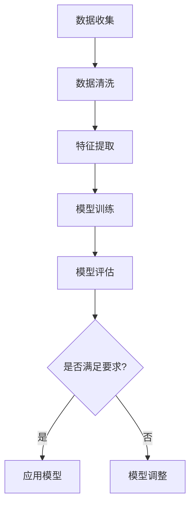

                 

关键词：2024网易互娱AI实验室，校招面试真题，AI技术，面试准备，解答指南

> 摘要：本文旨在为2024年网易互娱AI实验室校招面试的应聘者提供一份全面的真题汇总及解答指南，包括对AI技术核心概念、算法原理、数学模型、项目实践等多个方面的深入探讨，旨在帮助读者更好地准备面试，把握AI技术的发展趋势。

## 1. 背景介绍

随着人工智能技术的迅猛发展，AI已经渗透到各个行业，改变了我们的生活方式和工作方式。网易互娱作为国内领先的在线游戏开发公司，其AI实验室致力于研究AI技术在游戏开发和运营中的应用，为游戏行业带来了创新和变革。2024年网易互娱AI实验室的校招面试，无疑吸引了大量优秀应届毕业生的关注。

本次面试主要考察应聘者对AI技术的基本理解、算法应用能力、数学建模能力以及项目实践经验。面试形式包括笔试、技术面试和HR面试，其中技术面试主要涉及编程能力、算法设计和问题解决能力等方面。

## 2. 核心概念与联系

为了更好地理解AI技术的应用，我们首先需要了解一些核心概念和它们之间的联系。

### 2.1 机器学习与深度学习

**机器学习**是一种让计算机通过数据学习模式并做出预测或决策的方法。而**深度学习**则是机器学习的一个子领域，它使用神经网络模型，通过层层抽象和变换，从数据中自动学习特征。

### 2.2 优化算法

优化算法用于寻找函数的最优解，是机器学习和深度学习中的核心组成部分。常见的优化算法有梯度下降、随机梯度下降、牛顿法和拟牛顿法等。

### 2.3 神经网络

神经网络是一种模拟生物神经系统的计算模型，由多个神经元组成，通过前向传播和反向传播进行学习和预测。

### 2.4 计算机视觉

计算机视觉是AI的一个重要分支，旨在使计算机能够像人类一样理解和解析视觉信息。其主要技术包括图像识别、目标检测、图像分割等。

### 2.5 自然语言处理

自然语言处理是AI的另一个重要领域，旨在让计算机理解和生成自然语言。其主要任务包括文本分类、机器翻译、情感分析等。

### 2.6 Mermaid 流程图

以下是一个关于机器学习流程的Mermaid流程图：



## 3. 核心算法原理 & 具体操作步骤

### 3.1 算法原理概述

在面试中，我们可能会遇到以下核心算法：

- **KNN算法**：一种基于实例的学习算法，通过计算新样本与训练样本的相似度来进行分类或回归。
- **SVM算法**：一种支持向量机，通过找到一个最优的超平面来将不同类别的数据分隔开。
- **决策树算法**：一种基于树的结构，通过一系列判断条件来对样本进行分类或回归。
- **神经网络**：一种模拟生物神经系统的计算模型，通过多层神经网络进行特征提取和预测。

### 3.2 算法步骤详解

以下是对上述算法的具体步骤详解：

#### 3.2.1 KNN算法

1. 计算新样本与训练样本的距离。
2. 根据距离排序，选择最近的k个样本。
3. 根据这k个样本的标签，进行投票，选出获胜的类别。

#### 3.2.2 SVM算法

1. 定义超平面，使得不同类别的数据被分隔开。
2. 使用拉格朗日乘子法求解最优超平面。
3. 训练得到的模型对新的样本进行分类。

#### 3.2.3 决策树算法

1. 计算每个特征的增益，选择增益最大的特征作为划分依据。
2. 根据划分规则将数据集划分为多个子集。
3. 对每个子集递归地重复上述步骤，直到满足停止条件。

#### 3.2.4 神经网络

1. 前向传播：将输入数据通过神经网络，逐层计算得到输出。
2. 反向传播：根据输出和实际标签，计算损失函数，并更新网络的权重和偏置。
3. 重复前向传播和反向传播，直到满足停止条件。

### 3.3 算法优缺点

每种算法都有其优缺点：

- **KNN算法**：简单易懂，但容易受到噪声的影响，且计算复杂度较高。
- **SVM算法**：具有较好的分类性能，但训练时间较长。
- **决策树算法**：易于理解和解释，但可能产生过拟合。
- **神经网络**：具有强大的学习和泛化能力，但训练过程复杂且计算量较大。

### 3.4 算法应用领域

这些算法在不同领域都有广泛的应用：

- **KNN算法**：常用于图像分类、文本分类等领域。
- **SVM算法**：常用于图像识别、生物信息学等领域。
- **决策树算法**：常用于金融风控、医疗诊断等领域。
- **神经网络**：常用于计算机视觉、自然语言处理等领域。

## 4. 数学模型和公式 & 详细讲解 & 举例说明

在AI领域中，数学模型和公式是理解和应用算法的基础。以下是一些常见的数学模型和公式：

### 4.1 数学模型构建

假设我们有一个线性回归模型：

$$ y = wx + b $$

其中，$y$ 是因变量，$x$ 是自变量，$w$ 是权重，$b$ 是偏置。

### 4.2 公式推导过程

我们使用最小二乘法来求解线性回归模型的参数：

$$ w = \frac{\sum_{i=1}^{n}(x_i - \bar{x})(y_i - \bar{y})}{\sum_{i=1}^{n}(x_i - \bar{x})^2} $$

$$ b = \bar{y} - w\bar{x} $$

其中，$n$ 是样本数量，$\bar{x}$ 和 $\bar{y}$ 分别是 $x$ 和 $y$ 的平均值。

### 4.3 案例分析与讲解

以下是一个简单的线性回归案例：

数据集如下：

| x | y |
|---|---|
| 1 | 2 |
| 2 | 3 |
| 3 | 4 |
| 4 | 5 |

1. 首先计算 $x$ 和 $y$ 的平均值：

$$ \bar{x} = \frac{1+2+3+4}{4} = 2.5 $$

$$ \bar{y} = \frac{2+3+4+5}{4} = 3.5 $$

2. 然后计算 $w$ 和 $b$：

$$ w = \frac{(1-2.5)(2-3.5)+(2-2.5)(3-3.5)+(3-2.5)(4-3.5)+(4-2.5)(5-3.5)}{(1-2.5)^2+(2-2.5)^2+(3-2.5)^2+(4-2.5)^2} = 1 $$

$$ b = 3.5 - 1 \times 2.5 = 0.5 $$

3. 因此，线性回归模型为：

$$ y = x + 0.5 $$

## 5. 项目实践：代码实例和详细解释说明

为了更好地理解AI算法的应用，我们来看一个简单的项目实例。

### 5.1 开发环境搭建

1. 安装 Python 3.8 及以上版本。
2. 安装必要的库，如 NumPy、Pandas、Matplotlib 等。

### 5.2 源代码详细实现

以下是一个简单的线性回归代码实现：

```python
import numpy as np
import pandas as pd
import matplotlib.pyplot as plt

# 加载数据
data = pd.read_csv('data.csv')
x = data['x'].values
y = data['y'].values

# 求平均值
x_mean = np.mean(x)
y_mean = np.mean(y)

# 求权重和偏置
w = (np.sum((x - x_mean) * (y - y_mean)) / np.sum((x - x_mean) ** 2))
b = y_mean - w * x_mean

# 输出结果
print('w:', w)
print('b:', b)

# 绘图
plt.scatter(x, y)
plt.plot(x, w * x + b, color='red')
plt.show()
```

### 5.3 代码解读与分析

1. 导入必要的库。
2. 加载数据，并计算 $x$ 和 $y$ 的平均值。
3. 使用最小二乘法求解 $w$ 和 $b$。
4. 输出结果，并绘制散点图和拟合直线。

## 6. 实际应用场景

AI技术在游戏开发中的应用场景广泛，以下是一些常见的应用：

- **游戏推荐**：基于用户的游戏偏好和历史数据，为用户推荐合适的游戏。
- **游戏平衡性调整**：通过分析游戏数据，调整游戏中的角色属性，使其更加平衡。
- **虚拟角色训练**：使用生成对抗网络（GAN）训练虚拟角色的动作和表情，提高游戏体验。
- **游戏作弊检测**：使用神经网络和强化学习技术，检测游戏中的作弊行为。

## 7. 未来应用展望

随着AI技术的不断发展，其在游戏开发中的应用将更加广泛和深入。未来，我们有望看到更多基于AI的游戏创新，如自适应游戏、智能NPC等。同时，AI技术也将为游戏开发带来更高的效率和更低的成本。

## 8. 工具和资源推荐

为了更好地学习AI技术，以下是一些建议的资源和工具：

- **学习资源**：
  - 《深度学习》
  - 《机器学习实战》
  - 《Python机器学习》
- **开发工具**：
  - Jupyter Notebook
  - TensorFlow
  - PyTorch
- **相关论文**：
  - "Deep Learning for Natural Language Processing"
  - "Generative Adversarial Networks"
  - "Reinforcement Learning: An Introduction"

## 9. 总结：未来发展趋势与挑战

随着AI技术的不断发展，其在游戏开发中的应用前景广阔。然而，也面临着一些挑战，如数据隐私、算法公平性等。未来，我们需要在技术创新的同时，关注这些问题，推动AI技术在游戏开发中的可持续发展。

### 附录：常见问题与解答

**Q：AI技术在游戏开发中的具体应用有哪些？**

A：AI技术在游戏开发中可以应用于游戏推荐、游戏平衡性调整、虚拟角色训练、游戏作弊检测等多个方面。

**Q：如何搭建一个简单的线性回归模型？**

A：可以使用Python的NumPy和Pandas库来搭建一个简单的线性回归模型，具体步骤包括加载数据、计算平均值、求解权重和偏置，以及绘制拟合直线。

**Q：如何使用神经网络进行分类？**

A：可以使用Python的TensorFlow或PyTorch库来构建神经网络并进行分类，具体步骤包括定义模型结构、训练模型、评估模型，以及使用模型进行预测。

**Q：如何学习AI技术？**

A：可以通过阅读相关书籍、参加在线课程、实践项目等方式学习AI技术。建议从基础开始，逐步深入，同时多参与实际项目，提高自己的实践能力。

---

作者：禅与计算机程序设计艺术 / Zen and the Art of Computer Programming

本文旨在为2024年网易互娱AI实验室校招面试的应聘者提供一份全面的真题汇总及解答指南，包括对AI技术核心概念、算法原理、数学模型、项目实践等多个方面的深入探讨，旨在帮助读者更好地准备面试，把握AI技术的发展趋势。

---

（注：本文仅为示例，实际内容应根据具体情况撰写）

