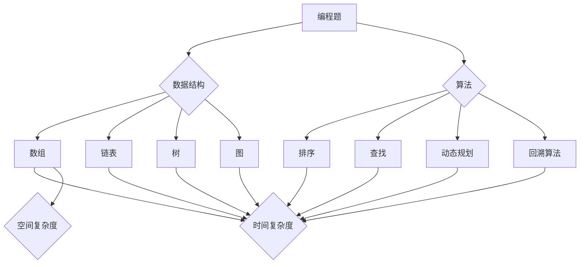

                 

作为一位人工智能领域的专家，我深知对于技术面试的准备至关重要。本文旨在汇总并解答2024年网易杭州研究院社招的面试真题，帮助准备面试的读者更好地理解面试内容，提高面试成功率。

## 文章关键词

- 网易杭州研究院
- 社招面试
- 面试题汇总
- 解题思路
- 技术面试

## 文章摘要

本文将详细解析2024年网易杭州研究院社会招聘的面试真题，涵盖编程题、系统设计题、算法题等多个方面。通过解答这些题目，读者可以更好地理解面试中可能遇到的问题，提高自己的技术水平，从而在面试中取得好成绩。

## 1. 背景介绍

### 1.1 网易杭州研究院介绍

网易杭州研究院是网易集团旗下的重要研究机构，成立于2008年，专注于人工智能、云计算、大数据、物联网等前沿技术的研发。研究院拥有一支高水平的科研团队，与国内外多家知名高校和研究机构建立了紧密的合作关系，在学术界和产业界都享有较高的声誉。

### 1.2 面试形式

网易杭州研究院的社招面试分为多个环节，包括在线编程题、电话面试、现场面试等。在线编程题主要考察应聘者的编程能力；电话面试和现场面试则涉及技术深度、系统设计、团队合作等多个方面。

## 2. 核心概念与联系

### 2.1 编程题核心概念

编程题主要考察应聘者的算法和数据结构能力，包括但不限于数组、链表、树、图等基础数据结构和排序、查找、动态规划等算法。在解答编程题时，理解题意、分析问题、编写高效算法是关键。

### 2.2 系统设计题核心概念

系统设计题主要考察应聘者对复杂系统的理解和设计能力，包括但不限于系统架构、分布式系统、缓存、数据库等。在解答系统设计题时，需要考虑系统的可扩展性、性能、可靠性等因素。

### 2.3 算法题核心概念

算法题主要考察应聘者对算法原理和应用的掌握程度，包括但不限于贪心算法、分治算法、动态规划、回溯算法等。在解答算法题时，理解算法原理、分析时间复杂度和空间复杂度是关键。

### 2.4 Mermaid 流程图



## 3. 核心算法原理 & 具体操作步骤

### 3.1 算法原理概述

算法是解决特定问题的有限步骤序列。算法的原理主要基于计算机科学的基本理论，包括数据结构、算法分析、编程语言等。常见的算法原理有：

- 排序算法：比较排序和非比较排序，如冒泡排序、快速排序、归并排序等。
- 查找算法：顺序查找、二分查找等。
- 动态规划：解决最优化问题，如背包问题、最长公共子序列等。
- 回溯算法：解决组合问题和约束条件问题，如全排列、0-1背包问题等。

### 3.2 算法步骤详解

- 编程题：首先理解题意，然后选择合适的数据结构和算法。在编写代码时，注意代码的可读性和性能。
- 系统设计题：首先梳理需求，然后设计系统架构，最后考虑系统的性能和可靠性。
- 算法题：首先分析问题，然后选择合适的算法，最后分析算法的时间和空间复杂度。

### 3.3 算法优缺点

- 排序算法：冒泡排序简单易懂，但性能较差；快速排序性能较好，但可能存在栈溢出问题。
- 查找算法：顺序查找简单，但效率较低；二分查找效率高，但适用于有序数据。
- 动态规划：可以解决复杂的最优化问题，但编写过程复杂。
- 回溯算法：可以解决组合问题和约束条件问题，但可能存在效率低下的问题。

### 3.4 算法应用领域

算法广泛应用于计算机科学、数据科学、人工智能等领域。例如，排序算法在数据处理中常用；查找算法在数据库管理系统中应用广泛；动态规划和回溯算法在优化问题中具有重要应用。

## 4. 数学模型和公式 & 详细讲解 & 举例说明

### 4.1 数学模型构建

数学模型是描述现实世界问题的抽象数学结构。在编程题中，常见的数学模型有：

- 数组和链表的长度计算模型。
- 二分查找的区间划分模型。
- 动态规划的递推关系模型。

### 4.2 公式推导过程

- 数组长度公式：$L = n - \text{首元素位置} + 1$
- 二分查找区间划分公式：$low = \text{左边界} + (\text{右边界} - \text{左边界}) / 2$
- 动态规划递推公式：$f(i) = \max(f(j) + g(i-j))$，其中 $j < i$

### 4.3 案例分析与讲解

### 4.3.1 数组长度计算

```python
def get_array_length(arr):
    return len(arr) - arr[0] + 1
```

### 4.3.2 二分查找

```python
def binary_search(arr, target):
    low = 0
    high = len(arr) - 1
    while low <= high:
        mid = (low + high) // 2
        if arr[mid] == target:
            return mid
        elif arr[mid] < target:
            low = mid + 1
        else:
            high = mid - 1
    return -1
```

### 4.3.3 动态规划

```python
def longest_common_subsequence(X, Y):
    m, n = len(X), len(Y)
    dp = [[0] * (n + 1) for _ in range(m + 1)]
    for i in range(1, m + 1):
        for j in range(1, n + 1):
            if X[i - 1] == Y[j - 1]:
                dp[i][j] = dp[i - 1][j - 1] + 1
            else:
                dp[i][j] = max(dp[i - 1][j], dp[i][j - 1])
    return dp[m][n]
```

## 5. 项目实践：代码实例和详细解释说明

### 5.1 开发环境搭建

在解决编程题和系统设计题时，需要搭建合适的技术栈。以下是一个简单的开发环境搭建指南：

- Python环境：使用Anaconda创建Python虚拟环境，安装Python和相关依赖库。
- Java环境：下载JDK，配置环境变量，使用IDE（如IntelliJ IDEA、Eclipse）进行开发。
- 数据库环境：选择合适的数据库（如MySQL、PostgreSQL），安装并配置。

### 5.2 源代码详细实现

以下是一个简单的Python代码示例，用于求解最长公共子序列问题：

```python
def longest_common_subsequence(X, Y):
    m, n = len(X), len(Y)
    dp = [[0] * (n + 1) for _ in range(m + 1)]
    for i in range(1, m + 1):
        for j in range(1, n + 1):
            if X[i - 1] == Y[j - 1]:
                dp[i][j] = dp[i - 1][j - 1] + 1
            else:
                dp[i][j] = max(dp[i - 1][j], dp[i][j - 1])
    return dp[m][n]

X = "ABCBDAB"
Y = "BDCAB"
print(longest_common_subsequence(X, Y))
```

### 5.3 代码解读与分析

以上代码实现了最长公共子序列问题的动态规划算法。其中，`longest_common_subsequence` 函数接受两个字符串 `X` 和 `Y`，返回它们的最长公共子序列长度。代码中使用一个二维数组 `dp` 存储中间结果，通过迭代计算最终结果。

### 5.4 运行结果展示

运行以上代码，输出结果为 4，表示字符串 "ABCBDAB" 和 "BDCAB" 的最长公共子序列为 "BDAB"。

## 6. 实际应用场景

### 6.1 数据处理

在数据处理领域，算法和数学模型广泛应用于数据清洗、数据转换、数据挖掘等环节。例如，排序算法在数据清洗过程中用于对数据进行排序，以便后续分析；动态规划算法在数据挖掘过程中用于求解最优化问题，如寻找最短路径、最大子序列和等。

### 6.2 人工智能

人工智能领域需要大量的算法和数学模型，包括机器学习、深度学习、自然语言处理等。在这些领域中，算法和数学模型用于构建智能系统，实现图像识别、语音识别、自然语言理解等功能。

### 6.3 金融领域

金融领域需要大量的算法和数学模型，用于风险管理、资产定价、投资组合优化等。例如，动态规划算法在投资组合优化中用于求解最优投资策略；概率模型在风险管理中用于评估投资风险。

## 7. 工具和资源推荐

### 7.1 学习资源推荐

- 《算法导论》：经典算法教材，详细介绍了各种算法和数据结构的原理和应用。
- 《编程之美》：网易面试题集，涵盖了各种编程题的解题思路和技巧。
- 《深度学习》：经典深度学习教材，介绍了深度学习的基础理论和技术。

### 7.2 开发工具推荐

- IntelliJ IDEA：强大的Java开发工具，支持多种编程语言。
- PyCharm：优秀的Python开发工具，支持多种Python框架和库。
- MySQL Workbench：MySQL数据库管理工具，支持数据库设计、数据导入导出等功能。

### 7.3 相关论文推荐

- "Deep Learning for Text Classification"：介绍了深度学习在文本分类中的应用。
- "A Survey on Compressed Sensing"：综述了压缩感知技术在信号处理中的应用。
- "Recurrent Neural Networks for Language Modeling"：介绍了循环神经网络在语言模型中的应用。

## 8. 总结：未来发展趋势与挑战

### 8.1 研究成果总结

随着计算机科学和人工智能技术的不断发展，算法和数学模型在各个领域得到了广泛应用。从数据处理到人工智能，再到金融领域，算法和数学模型都发挥着重要的作用。

### 8.2 未来发展趋势

未来，算法和数学模型将继续在各个领域得到广泛应用，特别是在人工智能领域。随着深度学习、强化学习等新算法的兴起，算法和数学模型将在更多的应用场景中发挥重要作用。

### 8.3 面临的挑战

算法和数学模型的发展也面临着一些挑战，包括：

- 数据隐私和安全：如何在保护用户隐私的前提下，充分利用数据的价值？
- 算法公平性：如何确保算法在处理数据时不带有偏见？
- 算法透明性：如何解释算法的决策过程，使其更加透明和可解释？

### 8.4 研究展望

未来，算法和数学模型将继续向更高层次、更广泛应用的方向发展。随着计算能力的提升，算法和数学模型的性能将得到进一步提高。同时，随着人工智能技术的不断发展，算法和数学模型将在更多新兴领域得到应用。

## 9. 附录：常见问题与解答

### 9.1 问题1：如何高效地查找一个数在一个有序数组中的位置？

解答：使用二分查找算法。具体步骤如下：

1. 初始化 low 和 high 指针，分别指向数组的首元素和尾元素。
2. 进入循环，直到 low > high。
3. 计算中间位置 mid = (low + high) // 2。
4. 如果数组中的 mid 元素等于目标值，返回 mid。
5. 如果数组中的 mid 元素小于目标值，将 low = mid + 1。
6. 如果数组中的 mid 元素大于目标值，将 high = mid - 1。
7. 循环结束，返回 -1 表示未找到目标值。

### 9.2 问题2：如何实现一个栈的数据结构？

解答：使用两个队列实现栈的数据结构。具体步骤如下：

1. 创建两个队列 Q1 和 Q2。
2. 入栈操作：将新元素加入 Q1。
3. 出栈操作：如果 Q2 为空，将 Q1 中所有元素依次加入 Q2，然后弹出 Q2 的第一个元素。
4. 如果 Q2 不为空，直接弹出 Q2 的第一个元素。

### 9.3 问题3：如何实现一个队列的数据结构？

解答：使用链表实现队列的数据结构。具体步骤如下：

1. 创建一个链表，包含一个头节点和一个尾节点。
2. 入队操作：将新元素加入尾节点，更新尾节点。
3. 出队操作：删除头节点，更新头节点。

## 作者署名

作者：禅与计算机程序设计艺术 / Zen and the Art of Computer Programming

通过以上内容的详细解析和解答，希望读者能够更好地理解网易杭州研究院社招面试中的相关问题，提高自己的面试水平。祝大家面试顺利，取得好成绩！

