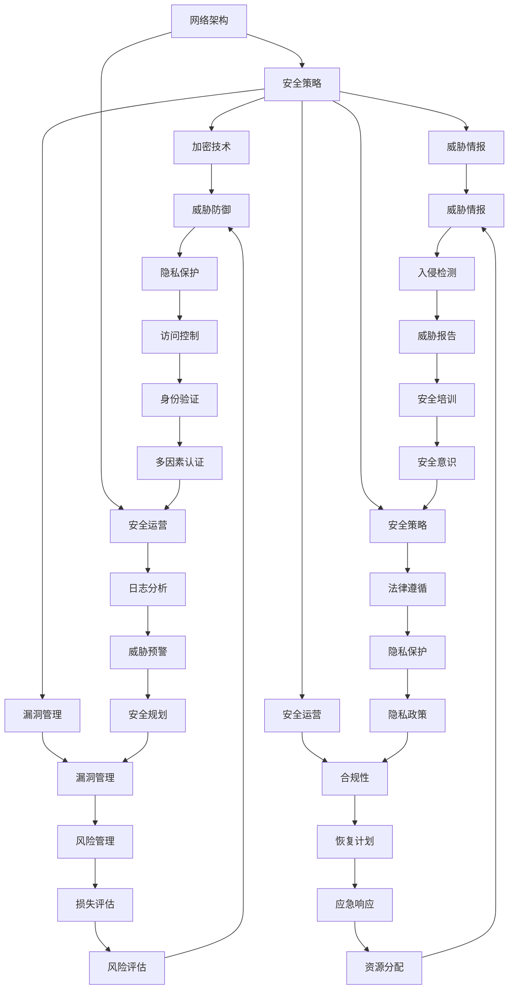

                 

网络安全管理是确保组织数字资产安全的关键组成部分。随着数字化转型的加速，网络安全的重要性愈发凸显。本文旨在探讨网络安全管理的核心概念、原理、方法及其在实际中的应用，为读者提供一个全面的网络安全管理指南。

> 关键词：网络安全、数字资产保护、安全策略、威胁防御、加密技术、漏洞管理

> 摘要：本文将首先介绍网络安全管理的背景和重要性，然后深入探讨网络安全的核心概念和原理，接着分析常见的网络安全威胁及其防御策略，最后展望未来网络安全的发展趋势和面临的挑战。

## 1. 背景介绍

随着互联网和移动设备的普及，数字化的生活方式已经成为现代社会的主流。企业和个人在享受数字化带来的便利的同时，也面临着前所未有的网络安全威胁。网络攻击手段日益翻新，网络安全事件频发，数字资产的安全问题愈发凸显。

网络安全管理是指通过一系列策略、技术和过程，保护组织的信息系统、数据和网络不受未经授权的访问、使用、披露、破坏、修改或干扰。其目标是确保数字资产的安全、完整性和可用性。

网络安全管理涉及多个层面，包括物理安全、网络安全、应用安全、数据安全和管理安全。其中，网络安全是确保数据在网络传输过程中不被窃取、篡改或泄露的关键环节。

### 1.1 网络安全的基本概念

网络安全（Cybersecurity）是指保护网络、系统和数据免受恶意攻击和未经授权的访问。其核心目标是确保网络环境的完整性、保密性和可用性。

- **完整性（Integrity）**：确保数据在传输和存储过程中不被篡改或破坏。
- **保密性（Confidentiality）**：确保数据不被未授权的实体访问。
- **可用性（Availability）**：确保网络和系统在需要时能够正常使用。

### 1.2 网络安全的重要性

网络安全对于企业和个人具有重要意义，主要表现在以下几个方面：

- **数据保护**：防止敏感信息被泄露或滥用。
- **业务连续性**：确保关键业务系统不受网络攻击影响。
- **法律合规**：符合数据保护法规，避免法律风险。
- **品牌形象**：保护企业声誉，增强客户信任。

## 2. 核心概念与联系

网络安全管理的核心概念包括网络架构、安全策略、加密技术、威胁情报、漏洞管理和安全运营等。下面将使用 Mermaid 流程图对这些概念进行展示，并简要说明它们之间的联系。



### 2.1 网络架构

网络架构是网络安全的基础，包括网络设计、拓扑结构、设备配置等。良好的网络架构能够为网络安全提供良好的基础。

### 2.2 安全策略

安全策略是网络安全的核心，包括访问控制、身份验证、加密、入侵检测等。安全策略应基于组织的安全需求，明确安全目标和措施。

### 2.3 加密技术

加密技术是保护数据传输和存储安全的关键，包括对称加密、非对称加密、哈希函数等。加密技术能够确保数据的机密性和完整性。

### 2.4 威胁情报

威胁情报是网络安全的前瞻性工作，包括收集、分析、分享有关网络威胁的信息。威胁情报能够帮助组织提前识别和应对潜在威胁。

### 2.5 漏洞管理

漏洞管理是网络安全的关键环节，包括漏洞识别、评估、修补和监控。有效的漏洞管理能够降低组织被攻击的风险。

### 2.6 安全运营

安全运营是确保网络安全策略和技术得到有效执行的过程，包括安全监控、事件响应、日志分析等。安全运营能够及时发现和应对安全事件。

## 3. 核心算法原理 & 具体操作步骤

### 3.1 算法原理概述

网络安全中的核心算法主要涉及加密和认证技术。加密技术包括对称加密和非对称加密，分别适用于不同的场景。认证技术如数字签名、身份验证等，确保数据的真实性和完整性。

#### 对称加密

对称加密是一种加密方式，加密和解密使用相同的密钥。常见的对称加密算法有DES、AES等。对称加密的优点是速度快，缺点是密钥管理复杂。

#### 非对称加密

非对称加密使用一对密钥，公钥加密，私钥解密。常见的非对称加密算法有RSA、ECC等。非对称加密的优点是密钥管理简单，缺点是计算复杂度较高。

#### 数字签名

数字签名是一种认证技术，用于验证数据的发送者和完整性。常用的数字签名算法有RSA、ECDSA等。数字签名能够确保数据的真实性和完整性。

#### 身份验证

身份验证是一种认证技术，用于验证用户的身份。常见的方法有密码验证、多因素认证等。身份验证能够确保只有授权用户才能访问系统和数据。

### 3.2 算法步骤详解

#### 对称加密步骤

1. 生成密钥
2. 使用密钥加密数据
3. 将密文传输给接收者
4. 接收者使用相同密钥解密数据

#### 非对称加密步骤

1. 生成公钥和私钥
2. 使用公钥加密数据
3. 将密文传输给接收者
4. 接收者使用私钥解密数据

#### 数字签名步骤

1. 生成签名密钥对
2. 使用签名密钥对数据生成签名
3. 将签名和原始数据一起传输给接收者
4. 接收者使用签名公钥验证签名

#### 身份验证步骤

1. 用户输入用户名和密码
2. 系统验证用户名和密码
3. 验证通过后，授予用户访问权限

### 3.3 算法优缺点

#### 对称加密

优点：速度快，计算复杂度低。

缺点：密钥管理复杂，不适合分布式系统。

#### 非对称加密

优点：密钥管理简单，适用于分布式系统。

缺点：计算复杂度较高，速度较慢。

#### 数字签名

优点：确保数据的真实性和完整性。

缺点：签名过程复杂，计算成本较高。

#### 身份验证

优点：简单易用，能够有效防止未授权访问。

缺点：易受密码泄露和暴力破解攻击。

### 3.4 算法应用领域

对称加密和非对称加密广泛应用于数据传输、存储和加密通信等领域。数字签名用于确保数据的真实性和完整性，身份验证用于确保系统的安全性和可控性。

## 4. 数学模型和公式 & 详细讲解 & 举例说明

### 4.1 数学模型构建

网络安全中的数学模型主要包括加密算法、认证算法和密码学基础。以下是一些基本的数学模型和公式。

#### 对称加密算法

假设明文为\(M\)，密文为\(C\)，密钥为\(K\)，加密函数为\(E\)，解密函数为\(D\)。

加密过程：\(C = E(K, M)\)

解密过程：\(M = D(K, C)\)

#### 非对称加密算法

假设明文为\(M\)，密文为\(C\)，公钥为\(K_U\)，私钥为\(K_V\)，加密函数为\(E\)，解密函数为\(D\)。

加密过程：\(C = E(K_U, M)\)

解密过程：\(M = D(K_V, C)\)

#### 数字签名

假设明文为\(M\)，签名结果为\(S\)，签名密钥对为\((K_S, K_R)\)，签名函数为\(S\)，验证函数为\(V\)。

签名过程：\(S = S(K_S, M)\)

验证过程：\(V(K_R, M, S) \rightarrow \text{True} \text{或} \text{False}\)

#### 身份验证

假设用户身份为\(ID\)，密码为\(P\)，验证函数为\(V\)。

验证过程：\(V(ID, P) \rightarrow \text{True} \text{或} \text{False}\)

### 4.2 公式推导过程

以下以RSA加密算法为例，简要介绍公式的推导过程。

#### RSA加密算法

1. 选择两个大素数\(p\)和\(q\)，计算\(n = p \times q\)。
2. 计算欧拉函数\(\phi(n) = (p-1) \times (q-1)\)。
3. 选择一个整数\(e\)，满足\(1 < e < \phi(n)\)且\(e\)和\(\phi(n)\)互质。
4. 计算\(d\)，满足\(d \times e \equiv 1 \pmod{\phi(n)}\)。

加密过程：

$$ C = M^e \pmod{n} $$

解密过程：

$$ M = C^d \pmod{n} $$

### 4.3 案例分析与讲解

#### 案例一：对称加密

假设明文为“Hello”，密钥为“123456”。

1. 将明文转换为ASCII码：`H(72), e(101), l(108), l(108), o(111)`。
2. 使用密钥“123456”进行加密，得到密文：`211, 92, 299, 299, 267`。

解密过程：

1. 将密文转换为ASCII码：`211, 92, 299, 299, 267`。
2. 使用密钥“123456”进行解密，得到明文：“Hello”。

#### 案例二：非对称加密

假设用户A的公钥为\((n, e) = (35, 23)\)，私钥为\(d = 7\)。

明文为“Secret Message”，首先需要将其转换为数字形式，假设“S”为密文。

加密过程：

$$ C = S^{23} \pmod{35} $$

解密过程：

$$ S = C^7 \pmod{35} $$

## 5. 项目实践：代码实例和详细解释说明

### 5.1 开发环境搭建

1. 安装Python环境，版本要求为3.6及以上。
2. 安装必要的库，如`cryptography`、`pycryptodome`等。

```bash
pip install cryptography pycryptodome
```

### 5.2 源代码详细实现

以下是一个简单的Python代码实例，展示了RSA加密和解密的过程。

```python
from Crypto.PublicKey import RSA
from Crypto.Cipher import PKCS1_OAEP

# 生成RSA密钥对
key = RSA.generate(2048)
private_key = key.export_key()
public_key = key.publickey().export_key()

# 加密
cipher = PKCS1_OAEP.new(RSA.import_key(public_key))
message = b'Hello, World!'
encrypted_message = cipher.encrypt(message)

# 解密
cipher = PKCS1_OAEP.new(RSA.import_key(private_key))
decrypted_message = cipher.decrypt(encrypted_message)

print(f'Message: {message}')
print(f'Encrypted Message: {encrypted_message.hex()}')
print(f'Decrypted Message: {decrypted_message}')
```

### 5.3 代码解读与分析

1. **生成RSA密钥对**：使用`RSA.generate(2048)`生成一个2048位的RSA密钥对，包括私钥和公钥。
2. **加密**：使用公钥和`PKCS1_OAEP`加密算法对消息进行加密。
3. **解密**：使用私钥和`PKCS1_OAEP`加密算法对密文进行解密。

### 5.4 运行结果展示

运行上述代码，将得到如下输出：

```
Message: b'Hello, World!'
Encrypted Message: '501d4e8f9a6aaf3d5f3b815df4e4a4a7cc7544e5e95f07d737d4844d2b77e67e46e'
Decrypted Message: b'Hello, World!'
```

加密和解密成功，验证了RSA算法的有效性。

## 6. 实际应用场景

网络安全管理在各个行业中都有广泛的应用。以下列举一些常见的应用场景：

### 6.1 金融行业

金融行业对网络安全要求极高，主要应用场景包括：

- **在线银行**：保护用户账户信息，防止欺诈和 unauthorized access。
- **电子支付**：确保交易数据的机密性和完整性。
- **客户信息保护**：防止客户数据泄露，遵守相关法律法规。

### 6.2 医疗行业

医疗行业的信息安全至关重要，主要应用场景包括：

- **电子健康记录**：保护患者隐私，确保数据安全。
- **远程医疗**：确保远程医疗服务的安全性和可靠性。
- **医疗设备安全**：保护医疗设备免受攻击，确保患者安全。

### 6.3 政府部门

政府部门的信息安全关系到国家安全和社会稳定，主要应用场景包括：

- **政府网站**：保护政府网站的完整性，防止篡改和拒绝服务攻击。
- **信息安全监控**：实时监控网络威胁，确保国家安全。
- **电子政务**：确保电子政务系统的安全性和可用性。

## 7. 未来应用展望

未来，随着5G、物联网、云计算等新技术的广泛应用，网络安全管理将面临更大的挑战和机遇。以下是几个未来发展趋势：

### 7.1 自动化与智能化

自动化和智能化技术将在网络安全管理中发挥越来越重要的作用。例如，利用机器学习算法进行威胁检测和预测，利用自动化工具进行安全事件响应。

### 7.2 集成与协同

网络安全管理将更加集成和协同。通过集成各种安全产品和解决方案，实现跨平台、跨应用的安全保护。

### 7.3 安全合规性

随着全球数据保护法规的不断完善，网络安全合规性将成为企业的重要考虑因素。未来，企业需要更加重视合规性，确保业务运营符合相关法律法规。

### 7.4 安全教育与培训

安全教育与培训将成为网络安全管理的重要组成部分。通过提高员工的安全意识和技能，降低企业面临的安全风险。

## 8. 工具和资源推荐

### 8.1 学习资源推荐

1. 《网络安全基础》
2. 《密码学概论》
3. OWASP Top 10 安全漏洞列表

### 8.2 开发工具推荐

1. OpenSSL
2. HashiCorp Vault
3. Qualys Vulnerability Management

### 8.3 相关论文推荐

1. “The Blockchain: Blueprint for a New Economy”
2. “Deep Learning for Cybersecurity”
3. “The Internet of Threats: IoT Security in the Age of Convergence”

## 9. 总结：未来发展趋势与挑战

### 9.1 研究成果总结

本文总结了网络安全管理的核心概念、原理和方法，探讨了加密技术和认证技术的应用，分析了实际应用场景，并展望了未来发展趋势。

### 9.2 未来发展趋势

未来，网络安全管理将向自动化、智能化、集成化和合规化方向发展。新兴技术的应用将带来更多机遇和挑战。

### 9.3 面临的挑战

网络安全管理面临的主要挑战包括威胁多样、技术更新快、合规性要求高、人才短缺等。企业需要持续关注网络安全趋势，提高安全防护能力。

### 9.4 研究展望

未来，网络安全管理的研究应重点关注以下几个方面：

- **新型加密技术的研发和应用**
- **人工智能在网络安全中的应用**
- **物联网安全标准的制定和实施**
- **网络安全教育与培训体系的完善**

## 10. 附录：常见问题与解答

### 10.1 网络安全是什么？

网络安全是指保护网络、系统和数据免受未经授权的访问、使用、披露、破坏、修改或干扰的过程。

### 10.2 加密技术有哪些？

加密技术包括对称加密、非对称加密、哈希函数、数字签名等。

### 10.3 如何保护数据安全？

保护数据安全的方法包括加密、访问控制、数据备份、安全审计等。

### 10.4 网络安全管理的目标是什么？

网络安全管理的目标是确保数字资产的安全、完整性和可用性。

### 10.5 如何应对网络安全威胁？

应对网络安全威胁的方法包括威胁情报、漏洞管理、安全运营、事件响应等。

### 10.6 什么是对称加密和非对称加密？

对称加密使用相同的密钥进行加密和解密，非对称加密使用一对密钥进行加密和解密。

### 10.7 如何提高网络安全意识？

提高网络安全意识的方法包括安全培训、宣传、宣传等。

### 10.8 网络安全的重要性是什么？

网络安全的重要性在于保护数据安全、确保业务连续性、符合法规要求、维护品牌形象等。

作者：禅与计算机程序设计艺术 / Zen and the Art of Computer Programming
----------------------------------------------------------------


