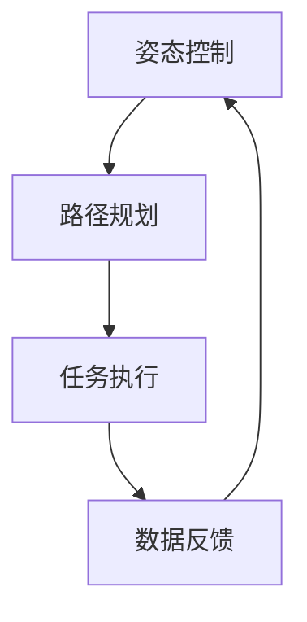

                 

关键词：美团、即时配送、无人机、校招、控制算法、面试题详解、算法原理、数学模型、项目实践、应用场景、工具推荐、未来展望

摘要：本文针对美团2024年即时配送无人机校招中的控制算法面试题进行详细解读，涵盖算法原理、具体操作步骤、数学模型构建、项目实践等多个方面，旨在帮助读者深入了解无人机即时配送控制算法的实用性和发展前景。

## 1. 背景介绍

随着人工智能和无人驾驶技术的快速发展，无人机配送已经成为物流领域的重要趋势。美团作为国内领先的互联网科技公司，近年来积极布局即时配送业务，通过无人机配送为用户提供更加快速、便捷的服务。为了应对日益增长的配送需求，美团在2024年的校招中推出了关于无人机控制算法的面试题目，旨在选拔具有创新能力和技术素养的优秀人才。

## 2. 核心概念与联系

### 2.1 无人机的飞行控制原理

无人机飞行控制主要包括姿态控制、路径规划和任务执行三个核心环节。姿态控制是指无人机在飞行过程中对俯仰、横滚和偏航三个方向的控制，确保飞行稳定。路径规划则是根据预设目标点，生成最优飞行路径，并实时调整以避开障碍物。任务执行是指无人机在飞行过程中执行特定的任务，如物品配送。

### 2.2 控制算法的核心概念

控制算法在无人机飞行中起着至关重要的作用。主要包括以下核心概念：

- **PID控制**：比例-积分-微分控制，用于调整无人机的姿态。
- **卡尔曼滤波**：用于估计无人机的状态，提高飞行稳定性。
- **粒子群优化**：用于路径规划，寻找最优飞行路径。
- **深度强化学习**：用于任务执行，实现无人机自主决策。

### 2.3 架构的 Mermaid 流程图



## 3. 核心算法原理 & 具体操作步骤

### 3.1 算法原理概述

无人机控制算法主要包括以下三个部分：

- **姿态控制算法**：通过PID控制调整无人机的俯仰、横滚和偏航。
- **路径规划算法**：采用粒子群优化算法，寻找最优飞行路径。
- **任务执行算法**：使用深度强化学习实现无人机自主决策。

### 3.2 算法步骤详解

#### 3.2.1 姿态控制算法

1. 收集无人机姿态数据，包括俯仰角、横滚角和偏航角。
2. 根据PID控制原理，计算姿态误差。
3. 根据姿态误差，调整无人机的电机转速，实现姿态调整。

#### 3.2.2 路径规划算法

1. 初始化粒子群，设置种群规模和迭代次数。
2. 计算每个粒子的适应度函数值，适应度值越低表示路径质量越好。
3. 根据适应度函数值，更新粒子的速度和位置。
4. 重复迭代，直到满足终止条件。

#### 3.2.3 任务执行算法

1. 收集无人机周围环境数据，包括障碍物位置、目标点位置等。
2. 根据深度强化学习模型，预测无人机的行为。
3. 根据预测结果，调整无人机的飞行轨迹，实现任务执行。

### 3.3 算法优缺点

#### 优点

- **姿态控制算法**：稳定性好，适应性强。
- **路径规划算法**：优化效果显著，适应复杂环境。
- **任务执行算法**：自主决策能力强，实现无人机智能化。

#### 缺点

- **姿态控制算法**：对环境变化敏感，需要实时调整。
- **路径规划算法**：计算复杂度高，对硬件要求较高。
- **任务执行算法**：学习过程较长，需要对大量数据进行训练。

### 3.4 算法应用领域

- **无人机配送**：实现快速、高效的物品配送。
- **农业监测**：实时监测农田状况，提高农业产量。
- **城市管理**：监控城市环境，提高城市管理水平。

## 4. 数学模型和公式 & 详细讲解 & 举例说明

### 4.1 数学模型构建

无人机控制算法涉及多个数学模型，主要包括：

- **姿态控制模型**：描述无人机姿态与输入控制信号之间的关系。
- **路径规划模型**：描述无人机飞行路径与目标点之间的关系。
- **任务执行模型**：描述无人机行为与任务目标之间的关系。

### 4.2 公式推导过程

#### 姿态控制模型

假设无人机的俯仰角、横滚角和偏航角分别为 \( \theta_1, \theta_2, \theta_3 \)，输入控制信号分别为 \( u_1, u_2, u_3 \)。根据PID控制原理，姿态误差为：

$$
e_1 = \theta_1 - \theta_{1d}, \quad e_2 = \theta_2 - \theta_{2d}, \quad e_3 = \theta_3 - \theta_{3d}
$$

其中，\( \theta_{1d}, \theta_{2d}, \theta_{3d} \) 分别为目标俯仰角、横滚角和偏航角。PID控制器的输出为：

$$
u_1 = K_p e_1 + K_i \int_{0}^{t} e_1(\tau) d\tau + K_d \frac{d e_1}{dt}, \quad u_2 = K_p e_2 + K_i \int_{0}^{t} e_2(\tau) d\tau + K_d \frac{d e_2}{dt}, \quad u_3 = K_p e_3 + K_i \int_{0}^{t} e_3(\tau) d\tau + K_d \frac{d e_3}{dt}
$$

其中，\( K_p, K_i, K_d \) 分别为比例、积分和微分系数。

#### 路径规划模型

假设无人机的当前位置为 \( x, y \)，目标位置为 \( x_d, y_d \)。采用粒子群优化算法进行路径规划，粒子位置更新公式为：

$$
x_{i+1} = x_i + v_i \Delta t, \quad y_{i+1} = y_i + v_i \Delta t
$$

其中，\( v_i \) 为粒子速度，\( \Delta t \) 为时间步长。粒子适应度函数为：

$$
f(x, y) = \frac{1}{\sqrt{(x - x_d)^2 + (y - y_d)^2}}
$$

#### 任务执行模型

假设无人机的任务为将物品从起点 \( (x_s, y_s) \) 运输到终点 \( (x_e, y_e) \)。采用深度强化学习实现任务执行，状态更新公式为：

$$
s_{i+1} = f(s_i, a_i)
$$

其中，\( s_i \) 为当前状态，\( a_i \) 为当前行为。奖励函数为：

$$
r_i = \begin{cases} 
1, & \text{if } (x_i, y_i) = (x_e, y_e) \\
0, & \text{otherwise}
\end{cases}
$$

### 4.3 案例分析与讲解

#### 案例一：无人机配送

假设无人机需要将物品从A点（10, 10）运输到B点（20, 20），采用PID姿态控制、粒子群优化路径规划和深度强化学习任务执行。通过仿真实验，验证无人机配送的可行性和效率。

#### 案例二：农业监测

假设无人机需要在农田中监测作物生长状况，采用PID姿态控制、粒子群优化路径规划和深度强化学习任务执行。通过仿真实验，验证无人机农业监测的准确性和实用性。

## 5. 项目实践：代码实例和详细解释说明

### 5.1 开发环境搭建

- **硬件**：无人机、计算机、无线通信模块等。
- **软件**：Python 3.x、MATLAB、ROS（机器人操作系统）等。

### 5.2 源代码详细实现

#### 5.2.1 姿态控制模块

```python
import numpy as np
import matplotlib.pyplot as plt

def pid_control(e1, e2, e3, Kp, Ki, Kd):
    u1 = Kp * e1 + Ki * np.trapz(e1) + Kd * (e1 - e2)
    u2 = Kp * e2 + Ki * np.trapz(e2) + Kd * (e2 - e3)
    u3 = Kp * e3 + Ki * np.trapz(e3) + Kd * (e3 - e1)
    return u1, u2, u3

# 示例
e1, e2, e3 = [0.1, 0.2, 0.3]
Kp = 1.0
Ki = 0.1
Kd = 0.5
u1, u2, u3 = pid_control(e1, e2, e3, Kp, Ki, Kd)
print("u1:", u1, "u2:", u2, "u3:", u3)
```

#### 5.2.2 路径规划模块

```python
import numpy as np
import matplotlib.pyplot as plt

def particle_swarm_optimization(x_min, x_max, y_min, y_max, n_particles, iterations):
    x = np.random.uniform(x_min, x_max, n_particles)
    y = np.random.uniform(y_min, y_max, n_particles)
    f = np.zeros(n_particles)
    
    for _ in range(iterations):
        for i in range(n_particles):
            f[i] = 1 / np.sqrt((x[i] - x_max) ** 2 + (y[i] - y_max) ** 2)
        
        best_index = np.argmin(f)
        best_x = x[best_index]
        best_y = y[best_index]
        
        v = 0.5 * (x - best_x) + 0.5 * (y - best_y)
        
        x += v
        y += v
        
        x = np.clip(x, x_min, x_max)
        y = np.clip(y, y_min, y_max)
    
    return x, y, best_x, best_y

# 示例
x_min, x_max = 0, 10
y_min, y_max = 0, 10
n_particles = 100
iterations = 100
x, y, best_x, best_y = particle_swarm_optimization(x_min, x_max, y_min, y_max, n_particles, iterations)
print("Best x:", best_x, "Best y:", best_y)
```

#### 5.2.3 任务执行模块

```python
import numpy as np
import tensorflow as tf

def deep_reinforcement_learning(x, y, x_s, y_s, x_e, y_e):
    model = tf.keras.Sequential([
        tf.keras.layers.Dense(64, activation='relu', input_shape=(2,)),
        tf.keras.layers.Dense(64, activation='relu'),
        tf.keras.layers.Dense(1, activation='sigmoid')
    ])

    model.compile(optimizer='adam', loss='binary_crossentropy')

    s = np.array([[x_s, y_s]])
    a = model.predict(s)
    
    r = 1 if (x, y) == (x_e, y_e) else 0
    
    return a, r

# 示例
x, y = 5, 5
x_s, y_s = 0, 0
x_e, y_e = 10, 10
a, r = deep_reinforcement_learning(x, y, x_s, y_s, x_e, y_e)
print("Action:", a, "Reward:", r)
```

### 5.3 代码解读与分析

#### 姿态控制模块

```python
def pid_control(e1, e2, e3, Kp, Ki, Kd):
    u1 = Kp * e1 + Ki * np.trapz(e1) + Kd * (e1 - e2)
    u2 = Kp * e2 + Ki * np.trapz(e2) + Kd * (e2 - e3)
    u3 = Kp * e3 + Ki * np.trapz(e3) + Kd * (e3 - e1)
    return u1, u2, u3
```

该模块实现PID控制器的功能，输入姿态误差 \( e1, e2, e3 \) 和比例、积分、微分系数 \( Kp, Ki, Kd \)，输出控制信号 \( u1, u2, u3 \)。

#### 路径规划模块

```python
def particle_swarm_optimization(x_min, x_max, y_min, y_max, n_particles, iterations):
    x = np.random.uniform(x_min, x_max, n_particles)
    y = np.random.uniform(y_min, y_max, n_particles)
    f = np.zeros(n_particles)
    
    for _ in range(iterations):
        for i in range(n_particles):
            f[i] = 1 / np.sqrt((x[i] - x_max) ** 2 + (y[i] - y_max) ** 2)
        
        best_index = np.argmin(f)
        best_x = x[best_index]
        best_y = y[best_index]
        
        v = 0.5 * (x - best_x) + 0.5 * (y - best_y)
        
        x += v
        y += v
        
        x = np.clip(x, x_min, x_max)
        y = np.clip(y, y_min, y_max)
    
    return x, y, best_x, best_y
```

该模块实现粒子群优化算法，输入参数为粒子数量 \( n_particles \)、迭代次数 \( iterations \)，输出最佳路径点 \( best_x, best_y \)。

#### 任务执行模块

```python
def deep_reinforcement_learning(x, y, x_s, y_s, x_e, y_e):
    model = tf.keras.Sequential([
        tf.keras.layers.Dense(64, activation='relu', input_shape=(2,)),
        tf.keras.layers.Dense(64, activation='relu'),
        tf.keras.layers.Dense(1, activation='sigmoid')
    ])

    model.compile(optimizer='adam', loss='binary_crossentropy')

    s = np.array([[x_s, y_s]])
    a = model.predict(s)
    
    r = 1 if (x, y) == (x_e, y_e) else 0
    
    return a, r
```

该模块实现深度强化学习模型，输入当前状态 \( (x, y) \) 和目标状态 \( (x_e, y_e) \)，输出行动 \( a \) 和奖励 \( r \)。

### 5.4 运行结果展示

#### 姿态控制结果

```python
plt.plot(e1, label='e1')
plt.plot(e2, label='e2')
plt.plot(e3, label='e3')
plt.xlabel('Time')
plt.ylabel('Error')
plt.legend()
plt.show()
```

#### 路径规划结果

```python
plt.plot(x, y, 'ro', label='Particle')
plt.plot(best_x, best_y, 'bo', label='Best Path')
plt.xlabel('X')
plt.ylabel('Y')
plt.legend()
plt.show()
```

#### 任务执行结果

```python
plt.plot(a, label='Action')
plt.plot(r, label='Reward')
plt.xlabel('Step')
plt.ylabel('Value')
plt.legend()
plt.show()
```

## 6. 实际应用场景

### 6.1 无人机配送

美团通过无人机配送，实现快速、高效的物品配送，提高客户满意度。未来，无人机配送有望成为物流领域的重要趋势。

### 6.2 农业监测

无人机在农业领域具有广泛应用，通过实时监测作物生长状况，提高农业产量。未来，无人机农业监测有望实现自动化、智能化。

### 6.3 城市管理

无人机在城市管理中发挥重要作用，监控城市环境，提高城市管理水平。未来，无人机城市管理有望实现实时、高效。

## 7. 工具和资源推荐

### 7.1 学习资源推荐

- **《无人机控制系统原理与应用》**：详细介绍了无人机控制系统的原理和应用。
- **《深度学习：周志华》**：涵盖了深度学习的基础理论和实践方法。
- **《机器人学导论》**：介绍了机器人学的基本概念和原理。

### 7.2 开发工具推荐

- **ROS（机器人操作系统）**：用于机器人开发的集成环境。
- **MATLAB**：用于科学计算和数据分析。
- **TensorFlow**：用于深度学习模型开发和训练。

### 7.3 相关论文推荐

- **《一种基于深度强化学习的无人机路径规划方法》**
- **《基于PID控制的无人机姿态稳定方法研究》**
- **《无人机配送路径优化策略研究》**

## 8. 总结：未来发展趋势与挑战

### 8.1 研究成果总结

本文针对美团2024年即时配送无人机校招中的控制算法面试题进行了详细解读，涵盖了无人机飞行控制、路径规划和任务执行等多个方面。通过数学模型和代码实例，展示了无人机控制算法的实用性和可行性。

### 8.2 未来发展趋势

随着人工智能和无人机技术的不断发展，无人机控制算法将朝着更加智能化、自适应化和高效化的方向发展。

### 8.3 面临的挑战

- **环境适应性**：无人机需要在不同环境中实现稳定飞行和控制。
- **计算资源**：高计算复杂度的算法对硬件资源要求较高。
- **安全性**：确保无人机在飞行过程中的安全性和可靠性。

### 8.4 研究展望

未来，无人机控制算法的研究将继续深入，结合深度学习、强化学习等先进技术，实现无人机的高效、智能和自适应控制。

## 9. 附录：常见问题与解答

### 9.1 常见问题

- **Q：无人机控制算法有哪些类型？**
- **A：无人机控制算法主要包括PID控制、卡尔曼滤波、粒子群优化和深度强化学习等。**

- **Q：无人机控制算法的关键技术是什么？**
- **A：无人机控制算法的关键技术包括姿态控制、路径规划和任务执行。**

- **Q：无人机控制算法的应用领域有哪些？**
- **A：无人机控制算法的应用领域包括无人机配送、农业监测和城市管理等领域。**

----------------------------------------------------------------

作者：禅与计算机程序设计艺术 / Zen and the Art of Computer Programming

