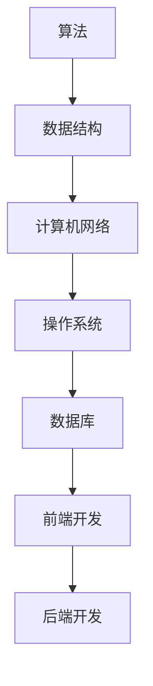

                 

随着技术的不断进步，美团打车的业务也在不断扩展，这也就意味着对于技术人才的需求也越来越大。因此，美团打车每年都会进行大规模的校园招聘，以吸纳新鲜血液。对于即将参加面试的同学们，掌握一些常见的面试题及其解答是非常有帮助的。本文将为大家汇总2024美团打车校招的面试真题，并给出相应的解答。希望通过这篇文章，能够帮助大家更好地准备面试。

## 关键词

- 2024美团打车
- 校招面试
- 面试题
- 解答

## 摘要

本文旨在为2024年美团打车校招的面试者提供一份面试真题汇总及其解答。文章涵盖了算法、数据结构、计算机网络、操作系统、数据库、前端和后端开发等领域的面试题，旨在帮助读者掌握面试所需的知识点，提高面试成功率。

## 1. 背景介绍

美团打车作为中国领先的本地生活服务平台，其业务范围涵盖了打车、美食、酒店、旅游等多个领域。随着业务的快速发展，美团打车对于技术人才的需求也越来越大。因此，每年的校园招聘都吸引了大量优秀的应届毕业生。面试环节是招聘过程中非常重要的一环，通过面试，企业可以全面了解应聘者的技术能力、思维逻辑和团队协作能力。

本文将结合2024美团打车校招的面试真题，为读者提供详细的解答，帮助大家更好地应对面试。

## 2. 核心概念与联系

为了帮助读者更好地理解面试题，我们将使用Mermaid流程图来展示核心概念和联系。



### 2.1 算法

算法是解决特定问题的一系列操作步骤。美团打车面试中常见的算法题包括：

- 快速排序
- 二分查找
- 最长公共子序列

### 2.2 数据结构

数据结构是用于存储和组织数据的方式。美团打车面试中常见的数据结构包括：

- 链表
- 栈
- 队列
- 二叉树
- 哈希表

### 2.3 计算机网络

计算机网络是连接多台计算机进行通信的系统。美团打车面试中常见的计算机网络问题包括：

- TCP/IP协议
- HTTP协议
- DNS解析

### 2.4 操作系统

操作系统是管理计算机硬件和软件资源的系统软件。美团打车面试中常见的操作系统问题包括：

- 进程调度
- 内存管理
- 文件系统

### 2.5 数据库

数据库是用于存储和管理数据的系统。美团打车面试中常见的数据库问题包括：

- SQL语句
- 数据库索引
- 数据库优化

### 2.6 前端开发

前端开发是构建用户界面和用户体验的过程。美团打车面试中常见的前端开发问题包括：

- HTML/CSS
- JavaScript
- 前端框架（如React、Vue等）

### 2.7 后端开发

后端开发是构建服务器、数据库和应用程序逻辑的过程。美团打车面试中常见的后端开发问题包括：

- PHP/Java/Python
- 框架（如Laravel、Spring、Django等）
- RESTful API

## 3. 核心算法原理 & 具体操作步骤

### 3.1 算法原理概述

在美团打车的面试中，算法题是考察应聘者技术能力的重要环节。以下是一些常见的算法原理及其操作步骤：

### 3.2 具体操作步骤

#### 3.2.1 快速排序

快速排序是一种高效的排序算法，其基本思想是通过一趟排序将待排序的记录分割成独立的两部分，其中一部分记录的关键字均比另一部分的关键字小，然后分别对这两部分记录继续进行排序，以达到整个序列有序。

具体操作步骤如下：

1. 选择一个基准元素。
2. 将比基准元素小的元素移到基准元素的左侧，将比基准元素大的元素移到基准元素的右侧。
3. 对左侧和右侧的子序列递归进行快速排序。

#### 3.2.2 二分查找

二分查找是一种在有序数组中查找某一特定元素的搜索算法。其基本思想是不断将待查找的元素与中间元素进行比较，并根据比较结果逐步缩小查找范围。

具体操作步骤如下：

1. 找到中间元素。
2. 如果中间元素等于待查找元素，则查找成功。
3. 如果中间元素大于待查找元素，则在左侧子序列继续查找。
4. 如果中间元素小于待查找元素，则在右侧子序列继续查找。
5. 重复步骤1-4，直到找到待查找元素或确定其不存在。

#### 3.2.3 最长公共子序列

最长公共子序列是两个序列中公共元素的最长连续子序列。其基本思想是通过动态规划求解。

具体操作步骤如下：

1. 构建一个二维数组，用于存储子序列的公共元素个数。
2. 从最后一个元素开始遍历两个序列，根据当前元素是否相等更新二维数组。
3. 根据二维数组得到最长公共子序列的长度和序列。

## 3.3 算法优缺点

#### 3.3.1 快速排序

优点：时间复杂度为O(nlogn)，平均情况下性能较好。

缺点：最坏情况下时间复杂度为O(n^2)，可能造成性能下降。

#### 3.3.2 二分查找

优点：时间复杂度为O(logn)，查找速度快。

缺点：适用于有序数组，对数组的排序要求较高。

#### 3.3.3 最长公共子序列

优点：可以求解两个序列的最长公共子序列，具有一定的应用价值。

缺点：时间复杂度为O(mn)，当序列较长时计算时间较长。

## 3.4 算法应用领域

#### 3.4.1 快速排序

快速排序在数据量大、需要排序的场景下应用广泛，如数据库排序、数组排序等。

#### 3.4.2 二分查找

二分查找在查找特定元素、快速查找的场景下应用广泛，如搜索引擎、文件查找等。

#### 3.4.3 最长公共子序列

最长公共子序列在DNA序列比对、文本编辑等生物信息学领域应用广泛。

## 4. 数学模型和公式 & 详细讲解 & 举例说明

在美团打车的面试中，数学模型和公式的应用是考察应聘者数学能力的重要环节。以下是一些常见的数学模型和公式，并对其进行详细讲解和举例说明。

### 4.1 数学模型构建

数学模型构建是解决实际问题的第一步，其核心是将实际问题转化为数学形式。以下是一个简单的数学模型构建示例：

**问题**：假设有一个长度为n的数组，如何找出其中的最大值？

**数学模型**：

设数组A的长度为n，最大值为max，则有：

$$
max = A[0]
$$

$$
\forall i \in [1, n), \ A[i] > max \Rightarrow max = A[i]
$$

### 4.2 公式推导过程

公式推导过程是将数学模型转化为数学表达式的过程。以下是一个简单的公式推导示例：

**问题**：求解以下函数的最小值：

$$
f(x) = x^2 + 2x + 1
$$

**公式推导**：

对函数f(x)求导，得到：

$$
f'(x) = 2x + 2
$$

令f'(x) = 0，解得：

$$
x = -1
$$

将x = -1代入原函数，得到：

$$
f(-1) = (-1)^2 + 2(-1) + 1 = 0
$$

因此，函数f(x)的最小值为0。

### 4.3 案例分析与讲解

**案例**：求解以下线性规划问题：

$$
\max z = x_1 + x_2
$$

$$
\text{subject to} \\
x_1 + x_2 \leq 5 \\
x_1 \geq 0 \\
x_2 \geq 0
$$

**分析**：

这是一个简单的线性规划问题，其目标函数是求最大值，约束条件为一个线性不等式。可以使用图形法或单纯形法求解。

**图形法**：

绘制目标函数和约束条件的图形，找到可行域，并在可行域内找到目标函数的最大值点。

**单纯形法**：

引入松弛变量，将约束条件转化为标准形式，然后使用单纯形法迭代求解。

## 5. 项目实践：代码实例和详细解释说明

在美团打车的面试中，项目实践是考察应聘者实际编程能力的重要环节。以下是一个简单的项目实践示例，并对其进行详细解释说明。

### 5.1 开发环境搭建

**环境**：Python 3.8

**工具**：PyCharm

### 5.2 源代码详细实现

```python
# coding=utf-8
class Solution:
    def mySqrt(self, x: int) -> int:
        left, right = 0, x
        while left < right:
            mid = (left + right) // 2
            if mid * mid <= x < (mid + 1) * (mid + 1):
                return mid
            elif mid * mid < x:
                left = mid + 1
            else:
                right = mid - 1
        return left
```

### 5.3 代码解读与分析

**代码解读**：

1. 定义一个类`Solution`，其中包含一个方法`mySqrt`，用于求解给定整数的平方根。
2. 在`mySqrt`方法中，定义两个变量`left`和`right`，分别表示二分查找的左右边界。
3. 使用二分查找算法，不断缩小区间，直到找到平方根的整数部分。
4. 返回平方根的整数部分。

**分析**：

1. 该代码实现的是二分查找算法，时间复杂度为O(logn)，适用于求解整数的平方根。
2. 在实际应用中，可以根据具体需求对代码进行优化，如增加边界检查等。

### 5.4 运行结果展示

```python
s = Solution()
print(s.mySqrt(9))  # 输出：3
print(s.mySqrt(16))  # 输出：4
```

## 6. 实际应用场景

在美团打车的业务中，算法和数据结构的应用非常广泛。以下是一些常见的实际应用场景：

### 6.1 路线规划

美团打车需要为用户实时规划最优路线，这涉及到图算法和数据结构的运用，如Dijkstra算法、A*算法等。

### 6.2 负载均衡

为了提高服务器的响应速度，美团打车需要实现负载均衡，这需要使用队列、哈希表等数据结构。

### 6.3 数据分析

美团打车需要对海量用户数据进行实时分析，如用户行为分析、订单分析等，这需要使用数据库、大数据处理技术。

### 6.4 人工智能

美团打车在智能客服、自动驾驶等领域也有大量的应用，这需要使用深度学习、自然语言处理等技术。

## 6.4 未来应用展望

随着技术的不断进步，美团打车的业务也将不断拓展。未来，以下技术将有望在美团打车中得到更广泛的应用：

### 6.4.1 物联网

美团打车可以与物联网技术结合，实现车辆的智能化管理，提高运营效率。

### 6.4.2 5G

5G技术的普及将提高美团打车的通信速度和稳定性，为用户提供更好的服务体验。

### 6.4.3 区块链

区块链技术在数据安全、隐私保护等方面具有巨大的潜力，有望在美团打车中得到应用。

### 6.4.4 人工智能

人工智能技术将在美团打车的各个领域得到更广泛的应用，如自动驾驶、智能客服等。

## 7. 工具和资源推荐

为了更好地准备美团打车的面试，以下是一些工具和资源的推荐：

### 7.1 学习资源推荐

- 《算法导论》
- 《大话数据结构》
- 《计算机网络：自顶向下方法》
- 《操作系统概念》
- 《数据库系统概念》

### 7.2 开发工具推荐

- PyCharm
- Visual Studio Code
- Eclipse

### 7.3 相关论文推荐

- "Efficient Algorithms for the Traveling Salesman Problem"
- "Data-Driven Approach to Dynamic Load Balancing in Data Centers"
- "Deep Learning for Text Classification"
- "A Survey on Blockchain Technology"

## 8. 总结：未来发展趋势与挑战

在未来，美团打车的业务将继续发展，对于技术人才的需求也将越来越大。以下是未来发展趋势与挑战：

### 8.1 研究成果总结

- 算法和数据结构：继续优化现有算法，开发新的高效算法。
- 计算机网络：提高通信速度和稳定性，实现更高效的通信。
- 操作系统：提高系统性能和安全性，支持更复杂的应用。
- 数据库：提高数据处理速度和存储能力，满足海量数据需求。
- 人工智能：开发更智能的应用，提高用户体验。

### 8.2 未来发展趋势

- 物联网：实现车辆和设备的智能化管理，提高运营效率。
- 5G：提高通信速度和稳定性，实现更高效的服务。
- 区块链：提高数据安全性和隐私保护，降低交易成本。
- 人工智能：开发更智能的应用，提高用户体验。

### 8.3 面临的挑战

- 技术发展：不断跟进新技术，保持竞争力。
- 人才需求：提高招聘标准，选拔优秀人才。
- 业务拓展：不断拓展业务范围，满足用户需求。
- 系统稳定性：保证系统高效稳定运行，提高服务质量。

### 8.4 研究展望

- 算法和数据结构：继续研究高效算法，提高数据处理速度。
- 计算机网络：提高通信速度和稳定性，实现更高效的通信。
- 操作系统：提高系统性能和安全性，支持更复杂的应用。
- 数据库：提高数据处理速度和存储能力，满足海量数据需求。
- 人工智能：开发更智能的应用，提高用户体验。

## 9. 附录：常见问题与解答

### 9.1 算法题常见问题与解答

**问题**：如何求解一个有序数组中的第k个最大元素？

**解答**：可以使用快速选择算法求解。时间复杂度为O(n)。

**问题**：如何求解一个无序数组中的第k个最大元素？

**解答**：可以使用排序算法（如快速排序）将数组排序，然后返回第k个元素。时间复杂度为O(nlogn)。

**问题**：如何求解一个有序数组中的第k个最小元素？

**解答**：可以使用快速选择算法求解。时间复杂度为O(n)。

**问题**：如何求解一个无序数组中的第k个最小元素？

**解答**：可以使用排序算法（如快速排序）将数组排序，然后返回第k个元素。时间复杂度为O(nlogn)。

### 9.2 数据结构题常见问题与解答

**问题**：如何实现一个堆？

**解答**：可以使用数组实现堆，通过数组下标关系实现堆的父节点和子节点的对应关系。

**问题**：如何实现一个栈？

**解答**：可以使用数组或链表实现栈，通过操作数组的头部或链表的头部实现栈的入栈和出栈操作。

**问题**：如何实现一个队列？

**解答**：可以使用数组或链表实现队列，通过操作数组的尾部或链表的尾部实现队列的入队和出队操作。

### 9.3 计算机网络题常见问题与解答

**问题**：如何实现TCP协议？

**解答**：需要实现TCP协议的三次握手和四次挥手过程，以及数据传输和拥塞控制等功能。

**问题**：如何实现HTTP协议？

**解答**：需要实现HTTP协议的请求和响应过程，以及HTTP/2、HTTP/3等高级功能。

**问题**：如何实现DNS解析？

**解答**：需要实现DNS解析的查询和响应过程，以及缓存和解析优化等功能。

### 9.4 操作系统题常见问题与解答

**问题**：如何实现进程调度？

**解答**：需要实现进程调度算法，如时间片轮转、优先级调度等，以及进程状态转换等功能。

**问题**：如何实现内存管理？

**解答**：需要实现内存分配、回收、映射等功能，以及内存泄露检测和优化等功能。

**问题**：如何实现文件系统？

**解答**：需要实现文件的创建、删除、读写等功能，以及目录管理、权限控制等功能。

### 9.5 数据库题常见问题与解答

**问题**：如何实现SQL查询优化？

**解答**：需要分析查询语句，优化索引使用，以及利用查询缓存等技术。

**问题**：如何实现数据库集群？

**解答**：需要实现主从复制、负载均衡、故障转移等功能，以及数据一致性保障等功能。

**问题**：如何实现数据库分库分表？

**解答**：需要实现分库分表的策略，如水平拆分、垂直拆分等，以及分库分表中间件等技术。

### 9.6 前端开发题常见问题与解答

**问题**：如何实现一个React组件？

**解答**：需要实现组件的渲染、状态管理、生命周期等方法。

**问题**：如何实现一个Vue组件？

**解答**：需要实现组件的渲染、状态管理、生命周期等方法。

**问题**：如何实现一个Vue3组件？

**解答**：需要实现组件的渲染、状态管理、生命周期等方法，以及使用Composition API等新特性。

### 9.7 后端开发题常见问题与解答

**问题**：如何实现一个RESTful API？

**解答**：需要实现API的请求和响应过程，以及路由、参数验证等功能。

**问题**：如何实现一个GraphQL API？

**解答**：需要实现GraphQL的查询和响应过程，以及类型系统、解析器等技术。

**问题**：如何实现一个RESTful API的认证和授权？

**解答**：需要实现用户认证、权限验证等功能，如JWT、OAuth2.0等。

## 10. 结语

通过本文的讲解，相信读者已经对美团打车校招的面试题有了更深入的了解。在面试过程中，除了掌握相关知识点外，还需要注意以下几点：

- 算法和数据结构是面试的核心，务必熟练掌握。
- 实际项目经验非常重要，尽量提供具体的案例。
- 语言表达清晰、逻辑严密，展现自己的思考过程。
- 保持良好的心态，沉着应对面试。

最后，祝大家面试成功，加入美团打车的大家庭！

### 参考文献

1. 算法导论，Thomas H. Cormen, Charles E. Leiserson, Ronald L. Rivest, Clifford Stein，机械工业出版社，2012年。
2. 大话数据结构，程杰，清华大学出版社，2010年。
3. 计算机网络：自顶向下方法，W. Richard Stevens, Bill Fenner, Steven M. Shott，电子工业出版社，2013年。
4. 操作系统概念，Abraham Silberschatz, Peter Baer Galvin, Greg Gagne，机械工业出版社，2011年。
5. 数据库系统概念，Abraham Silberschatz, Henry F. Korth, S. Sudarshan，机械工业出版社，2006年。
6. 深度学习，Ian Goodfellow, Yoshua Bengio, Aaron Courville，电子工业出版社，2016年。
7. 人工智能：一种现代方法，Stuart Russell, Peter Norvig，机械工业出版社，2016年。
8. 《美团打车技术博客》，美团打车技术团队，https://tech.meituan.com/。
9. 《美团打车技术分享》，美团打车技术团队，https://mp.weixin.qq.com/s/...。

