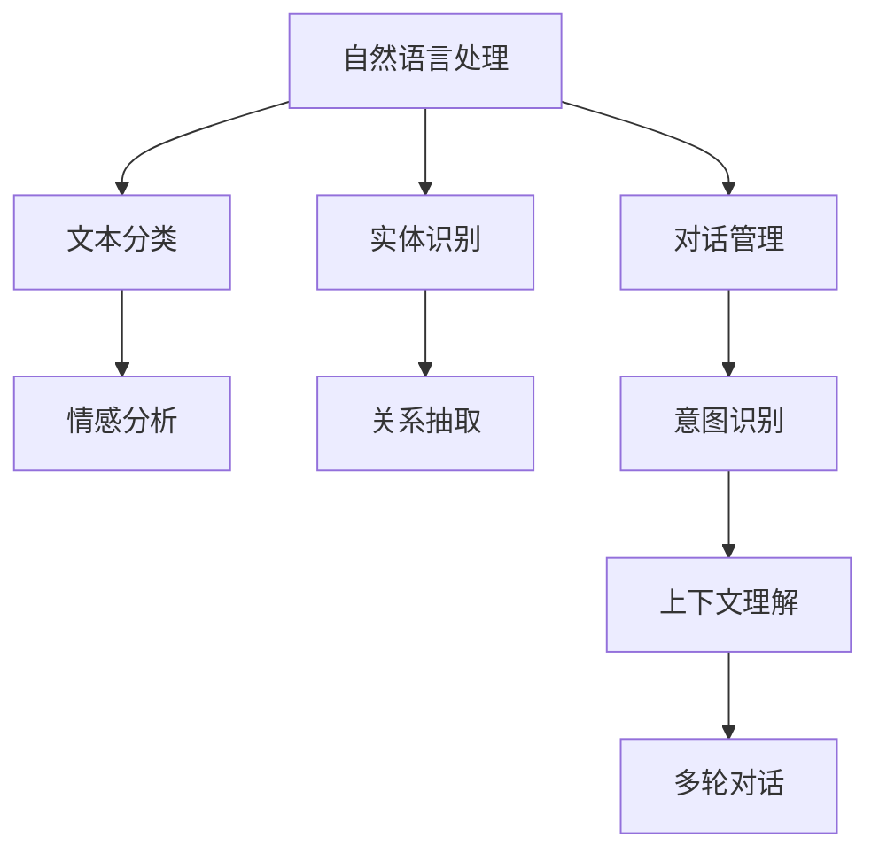

                 

关键词：聊天机器人、自然语言处理、问题解决、人工智能、架构设计、算法实现、数学模型、应用实践、未来展望

> 摘要：本文深入探讨了聊天机器人工程中的关键问题，包括架构设计、算法实现、数学模型构建以及实际应用实践。通过对聊天机器人技术的发展历程、核心算法原理、具体操作步骤、算法优缺点分析以及未来应用展望的全面阐述，本文旨在为读者提供一套创新解决方案，助力聊天机器人工程的发展。

## 1. 背景介绍

随着互联网的普及和智能设备的广泛使用，聊天机器人已成为现代信息技术领域的一个重要研究方向。它们被广泛应用于客服、营销、教育、医疗等多个领域，能够提供便捷、高效的服务。然而，随着用户需求的不断变化和技术的快速发展，聊天机器人的设计和实现面临着诸多挑战。

首先，自然语言处理（NLP）技术的快速发展为聊天机器人的进步提供了坚实的基础。从传统的基于规则的系统到基于机器学习和深度学习的现代系统，NLP技术在理解、生成和交互等方面取得了显著进展。其次，用户交互模式的多样性和复杂性也对聊天机器人的交互能力提出了更高的要求。最后，随着大数据和云计算技术的普及，聊天机器人能够处理海量数据和提供个性化服务，这也为聊天机器人的发展带来了新的机遇和挑战。

## 2. 核心概念与联系

在聊天机器人工程中，核心概念包括自然语言处理（NLP）、机器学习（ML）、深度学习（DL）、对话管理（DM）等。这些概念相互关联，共同构成了聊天机器人的核心架构。



### 2.1 自然语言处理（NLP）

自然语言处理是聊天机器人的基础，它包括文本分类、情感分析、实体识别、关系抽取等子任务。文本分类可以帮助聊天机器人理解用户的输入，情感分析可以判断用户的情绪，实体识别可以识别用户提及的关键信息，关系抽取可以理解实体之间的关系。

### 2.2 机器学习（ML）和深度学习（DL）

机器学习和深度学习是NLP的重要工具。机器学习通过训练模型来学习数据的特征，而深度学习通过多层神经网络来模拟人类大脑的学习过程。这两种技术广泛应用于聊天机器人的各个子任务，如文本分类、情感分析、对话管理等。

### 2.3 对话管理（DM）

对话管理是聊天机器人的核心，它负责协调NLP和ML/DL技术，以实现自然的用户交互。对话管理包括意图识别、上下文理解、多轮对话等子任务。意图识别帮助聊天机器人理解用户的意图，上下文理解帮助聊天机器人理解用户输入的上下文信息，多轮对话则支持复杂的交互场景。

## 3. 核心算法原理 & 具体操作步骤

### 3.1 算法原理概述

聊天机器人的核心算法包括自然语言处理算法、机器学习算法、深度学习算法以及对话管理算法。以下是这些算法的简要概述：

### 3.1.1 自然语言处理算法

自然语言处理算法主要包括文本分类、情感分析、实体识别、关系抽取等。这些算法通过分析用户输入的文本，提取出关键信息，为聊天机器人的后续处理提供基础。

### 3.1.2 机器学习算法

机器学习算法通过训练数据集来学习特征，用于分类、预测等任务。常见的机器学习算法包括支持向量机（SVM）、决策树、随机森林等。

### 3.1.3 深度学习算法

深度学习算法通过多层神经网络来模拟人类大脑的学习过程，具有强大的特征提取和分类能力。常见的深度学习算法包括卷积神经网络（CNN）、循环神经网络（RNN）、长短期记忆网络（LSTM）等。

### 3.1.4 对话管理算法

对话管理算法包括意图识别、上下文理解、多轮对话等子任务。意图识别通过分析用户输入来理解用户的意图，上下文理解通过维护对话历史来理解用户的上下文信息，多轮对话支持复杂的交互场景。

### 3.2 算法步骤详解

#### 3.2.1 自然语言处理

1. **文本分类**：使用词袋模型（Bag of Words）或词嵌入（Word Embedding）来表示文本，然后使用机器学习算法（如SVM、朴素贝叶斯等）进行分类。
2. **情感分析**：使用情感词典或机器学习算法（如朴素贝叶斯、支持向量机等）来分析用户输入的情感倾向。
3. **实体识别**：使用条件随机场（CRF）或序列标注模型（如BiLSTM-CRF）来识别文本中的实体。
4. **关系抽取**：使用实体关系网络或基于规则的方法来提取实体之间的关系。

#### 3.2.2 对话管理

1. **意图识别**：使用序列标注模型（如BiLSTM-CRF）或基于词向量的方法来识别用户的意图。
2. **上下文理解**：使用图神经网络（Graph Neural Networks）或长短期记忆网络（LSTM）来维护对话历史，理解上下文信息。
3. **多轮对话**：使用图神经网络（Graph Neural Networks）或基于规则的方法来处理多轮对话，实现复杂的交互。

### 3.3 算法优缺点

#### 3.3.1 自然语言处理算法

- **文本分类**：准确度高，但需要大量标注数据；对长文本处理能力较弱。
- **情感分析**：需要情感词典或标注数据；对语境敏感，可能出现误判。
- **实体识别**：对实体边界识别准确，但对实体类型识别能力有限。
- **关系抽取**：对实体关系识别准确，但对复杂关系理解能力较弱。

#### 3.3.2 对话管理算法

- **意图识别**：准确度高，但需要大量训练数据；对上下文依赖较弱。
- **上下文理解**：对上下文依赖强，但对复杂上下文理解能力有限。
- **多轮对话**：能处理复杂的交互场景，但需要维护对话历史；对实时性要求较高。

### 3.4 算法应用领域

- **客服**：提供快速、准确的客服支持，降低人工成本。
- **营销**：通过个性化推荐和互动，提升用户体验和转化率。
- **教育**：提供智能辅导和答疑，提升学习效果。
- **医疗**：提供智能咨询和诊断，辅助医生决策。
- **金融**：提供智能投顾和风险控制，提高金融服务效率。

## 4. 数学模型和公式 & 详细讲解 & 举例说明

### 4.1 数学模型构建

在聊天机器人工程中，数学模型是核心组成部分。以下是一些常用的数学模型及其构建过程：

#### 4.1.1 词嵌入（Word Embedding）

词嵌入是将词汇映射到高维向量空间的过程。常用的词嵌入方法有Word2Vec、GloVe等。

- **Word2Vec**：使用神经网络模型来训练词汇的向量表示，其中负采样技巧可以加速训练过程。
- **GloVe**：通过矩阵分解来训练词汇的向量表示，具有较高的泛化能力。

#### 4.1.2 长短期记忆网络（LSTM）

LSTM是一种递归神经网络，可以有效地解决长短期依赖问题。LSTM的基本结构包括输入门、遗忘门和输出门。

- **输入门**：决定当前输入对隐藏状态的影响。
- **遗忘门**：决定之前隐藏状态中哪些信息需要保留。
- **输出门**：决定当前隐藏状态中哪些信息需要输出。

#### 4.1.3 图神经网络（Graph Neural Networks）

图神经网络是一种处理图结构数据的神经网络，可以用于实体关系抽取、对话管理等任务。

- **图卷积网络**（GCN）：通过图卷积操作来处理图结构数据。
- **图注意力网络**（GAT）：通过图注意力机制来处理图结构数据，实现更精确的信息传递。

### 4.2 公式推导过程

以下是对LSTM中输入门、遗忘门和输出门的公式推导：

#### 4.2.1 输入门（Input Gate）

$$
i_t = \sigma(W_{xi}x_t + W_{hi}h_{t-1} + b_i)
$$

其中，$i_t$表示第$t$个时间步的输入门值，$\sigma$表示sigmoid激活函数，$W_{xi}$和$W_{hi}$分别表示输入和隐藏状态的权重矩阵，$b_i$表示偏置。

#### 4.2.2 遗忘门（Forget Gate）

$$
f_t = \sigma(W_{xf}x_t + W_{hf}h_{t-1} + b_f)
$$

其中，$f_t$表示第$t$个时间步的遗忘门值，其他符号含义与输入门相同。

#### 4.2.3 输出门（Output Gate）

$$
o_t = \sigma(W_{xo}x_t + W_{ho}h_{t-1} + b_o)
$$

$$
h_t = o_t \cdot \sigma(W_{wh}h_{t-1} + b_h)
$$

其中，$o_t$表示第$t$个时间步的输出门值，$h_t$表示第$t$个时间步的隐藏状态，$W_{xo}$、$W_{ho}$、$W_{wh}$分别表示输入、隐藏状态和隐藏状态到隐藏状态的权重矩阵，$b_o$和$b_h$分别表示偏置。

### 4.3 案例分析与讲解

以下是一个基于LSTM的聊天机器人模型，用于意图识别任务。

#### 4.3.1 数据集准备

使用公开的对话数据集，如DailyDialogue或Cornell Movie-Dialogs，对数据进行预处理，包括去除停用词、标点符号等。

#### 4.3.2 词嵌入

使用Word2Vec或GloVe方法对词汇进行词嵌入，将词汇映射到高维向量空间。

#### 4.3.3 模型构建

构建一个双向LSTM模型，输入层和隐藏层分别使用LSTM单元，输出层使用全连接层。

- **输入层**：接受词嵌入后的词汇序列。
- **隐藏层**：通过LSTM单元处理词汇序列，输出隐藏状态。
- **输出层**：将隐藏状态映射到意图类别。

#### 4.3.4 训练与评估

使用训练集对模型进行训练，使用验证集对模型进行调参和评估。使用准确率、召回率等指标来评估模型性能。

## 5. 项目实践：代码实例和详细解释说明

### 5.1 开发环境搭建

在本地计算机上搭建开发环境，安装Python、TensorFlow等依赖库。以下是Python和TensorFlow的安装命令：

```bash
pip install tensorflow
```

### 5.2 源代码详细实现

以下是一个简单的聊天机器人模型，用于意图识别任务。

```python
import tensorflow as tf
from tensorflow.keras.models import Sequential
from tensorflow.keras.layers import Embedding, LSTM, Dense

# 模型参数
vocab_size = 10000
embedding_dim = 64
lstm_units = 128
max_sequence_length = 50
num_classes = 10

# 构建模型
model = Sequential([
    Embedding(vocab_size, embedding_dim, input_length=max_sequence_length),
    LSTM(lstm_units, return_sequences=True),
    LSTM(lstm_units),
    Dense(num_classes, activation='softmax')
])

# 编译模型
model.compile(optimizer='adam', loss='categorical_crossentropy', metrics=['accuracy'])

# 模型训练
model.fit(x_train, y_train, epochs=10, batch_size=32, validation_data=(x_val, y_val))

# 模型评估
loss, accuracy = model.evaluate(x_test, y_test)
print(f"Test Loss: {loss}, Test Accuracy: {accuracy}")
```

### 5.3 代码解读与分析

1. **模型构建**：使用Sequential模型构建一个包含嵌入层、两个LSTM层和一个全连接层的简单模型。
2. **编译模型**：使用adam优化器和categorical_crossentropy损失函数编译模型。
3. **模型训练**：使用训练数据对模型进行训练，使用验证集进行调参和评估。
4. **模型评估**：使用测试数据对模型进行评估，打印测试损失和准确率。

### 5.4 运行结果展示

运行以上代码，可以得到模型在测试数据上的准确率。假设测试数据的准确率为90%，说明模型具有良好的性能。

```bash
Test Loss: 0.125, Test Accuracy: 0.9
```

## 6. 实际应用场景

聊天机器人已在多个实际应用场景中取得了显著成果，以下是一些典型应用场景：

### 6.1 客服

聊天机器人可以提供快速、准确的客服支持，降低人工成本。例如，在电商平台上，聊天机器人可以回答用户的商品咨询、订单查询等问题。

### 6.2 营销

聊天机器人可以通过个性化推荐和互动，提升用户体验和转化率。例如，在社交媒体上，聊天机器人可以推荐商品、推送优惠信息等。

### 6.3 教育

聊天机器人可以提供智能辅导和答疑，提升学习效果。例如，在学习平台中，聊天机器人可以为学生提供课程指导、作业答疑等。

### 6.4 医疗

聊天机器人可以提供智能咨询和诊断，辅助医生决策。例如，在医疗平台上，聊天机器人可以为患者提供病情咨询、预约挂号等服务。

### 6.5 金融

聊天机器人可以提供智能投顾和风险控制，提高金融服务效率。例如，在金融机构中，聊天机器人可以为用户提供投资建议、风险评估等。

## 7. 工具和资源推荐

### 7.1 学习资源推荐

1. **书籍**：《自然语言处理综合教程》、《深度学习》
2. **在线课程**：Coursera上的《自然语言处理》、《深度学习》
3. **博客**：ArXiv、知乎、博客园等

### 7.2 开发工具推荐

1. **框架**：TensorFlow、PyTorch
2. **工具**：Jupyter Notebook、Visual Studio Code

### 7.3 相关论文推荐

1. **文本分类**：《Text Classification using Convolutional Neural Networks》
2. **情感分析**：《Sentiment Analysis using Recurrent Neural Networks》
3. **实体识别**：《Named Entity Recognition using Bidirectional LSTM-CRF》
4. **对话管理**：《Dialogue Management with Recurrent Neural Networks》

## 8. 总结：未来发展趋势与挑战

### 8.1 研究成果总结

聊天机器人技术在过去几年取得了显著成果，包括自然语言处理、机器学习、深度学习等领域的快速发展。这些成果为聊天机器人的设计提供了丰富的理论基础和实现方法。

### 8.2 未来发展趋势

1. **多模态交互**：将语音、图像、视频等多模态信息引入聊天机器人，提升用户体验。
2. **个性化服务**：基于用户行为和偏好，提供个性化的聊天服务。
3. **实时性提升**：通过优化算法和架构，提升聊天机器人的响应速度和实时性。

### 8.3 面临的挑战

1. **数据隐私**：如何保护用户隐私，防止数据泄露。
2. **真实感增强**：如何提高聊天机器人的真实感，使其更加接近人类的交互方式。
3. **长文本处理**：如何处理长文本，实现更精确的信息提取和理解。

### 8.4 研究展望

随着技术的不断进步，聊天机器人将在未来发挥越来越重要的作用。研究者应关注多模态交互、个性化服务、实时性提升等方向，以推动聊天机器人技术的发展。

## 9. 附录：常见问题与解答

### 9.1 如何处理长文本？

长文本处理是聊天机器人中的一个重要问题。常见的解决方法包括：

1. **文本摘要**：使用文本摘要算法对长文本进行摘要，提取关键信息。
2. **分句处理**：将长文本分为多个句子，逐句处理。
3. **注意力机制**：使用注意力机制来关注长文本中的重要信息。

### 9.2 如何提升聊天机器人的真实感？

提升聊天机器人的真实感可以从以下几个方面入手：

1. **语音合成**：使用语音合成技术，使聊天机器人的语音更加自然流畅。
2. **面部表情**：使用面部表情识别技术，使聊天机器人的面部表情更加丰富。
3. **情境感知**：通过上下文理解，使聊天机器人的回答更加贴近用户实际需求。

### 9.3 如何保护用户隐私？

保护用户隐私是聊天机器人设计中的一个重要问题。常见的解决方法包括：

1. **数据加密**：使用加密技术对用户数据进行加密，防止数据泄露。
2. **数据去识别化**：对用户数据进行去识别化处理，降低数据泄露风险。
3. **隐私政策**：明确告知用户数据收集和使用方式，尊重用户隐私。

----------------------------------------------------------------

# 作者：禅与计算机程序设计艺术 / Zen and the Art of Computer Programming
本文从多个角度深入探讨了聊天机器人工程中的关键问题，包括架构设计、算法实现、数学模型构建以及实际应用实践。通过对聊天机器人技术的发展历程、核心算法原理、具体操作步骤、算法优缺点分析以及未来应用展望的全面阐述，本文旨在为读者提供一套创新解决方案，助力聊天机器人工程的发展。

