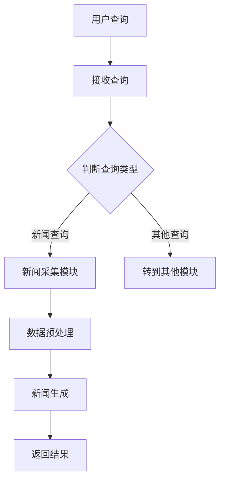

                 

关键词：聊天机器人，人工智能，新闻采集，新闻写作，自然语言处理，深度学习，数据挖掘，算法，机器学习，新闻业革命

> 摘要：本文深入探讨了聊天机器人在新闻采集和写作中的应用，通过分析人工智能技术如何改变新闻业，探讨了核心概念、算法原理、数学模型、实践实例以及未来发展趋势。文章旨在为读者提供一份全面的指南，帮助了解人工智能在新闻领域的深远影响。

## 1. 背景介绍

在信息技术飞速发展的今天，新闻行业正面临着前所未有的变革。随着互联网的普及和智能手机的广泛应用，人们获取新闻的方式发生了巨大变化。传统新闻媒体正逐步被数字媒体所取代，而人工智能（AI）的出现更是为新闻业带来了全新的机遇和挑战。

聊天机器人作为一种新兴的人工智能应用，已经成为现代新闻业的重要工具。它们不仅能够自动化地采集和处理大量新闻信息，还能够以自然语言的形式生成新闻文章。这种高效、精准的智能处理能力，为新闻业带来了革命性的变化。

本文将围绕聊天机器人在新闻采集和写作中的应用，分析其核心概念、算法原理、数学模型、实践案例，并展望其未来发展趋势。

## 2. 核心概念与联系

### 2.1 聊天机器人的基本概念

聊天机器人是一种基于自然语言处理（NLP）和机器学习技术的计算机程序，它可以模拟人类的对话方式，与用户进行交互。聊天机器人可以应用在多种场景中，如客服、营销、教育等，而新闻采集和写作是其中极具潜力的应用领域。

### 2.2 自然语言处理（NLP）

自然语言处理是人工智能的一个重要分支，它致力于使计算机能够理解、解释和生成自然语言。NLP技术包括文本分类、实体识别、关系提取、语义分析等，这些技术都是实现聊天机器人新闻功能的基础。

### 2.3 数据挖掘

数据挖掘是一种从大量数据中发现隐含模式、趋势和知识的方法。在新闻采集领域，数据挖掘技术可以帮助聊天机器人自动搜集和筛选新闻信息，提高新闻的准确性和时效性。

### 2.4 深度学习

深度学习是一种模拟人脑神经网络的机器学习方法，它在图像识别、语音识别等领域取得了显著成果。在新闻写作中，深度学习可以帮助聊天机器人生成内容丰富、结构合理的新闻文章。

### 2.5 Mermaid 流程图



## 3. 核心算法原理 & 具体操作步骤

### 3.1 算法原理概述

聊天机器人在新闻采集和写作中主要依赖于以下几种算法：

1. **新闻采集算法**：通过数据挖掘和NLP技术，从互联网上搜集新闻信息。
2. **新闻处理算法**：对采集到的新闻数据进行预处理、分类和筛选。
3. **新闻生成算法**：利用深度学习技术，将处理后的新闻数据转化为自然语言文本。

### 3.2 算法步骤详解

1. **新闻采集**：
   - 使用网络爬虫技术搜集新闻数据。
   - 利用NLP技术对新闻文本进行预处理，如分词、去停用词、词性标注等。
   - 使用数据挖掘算法筛选出有价值的新闻数据。

2. **新闻处理**：
   - 对新闻数据进行分类和筛选，去除重复和不相关的新闻。
   - 利用NLP技术提取新闻中的关键信息，如时间、地点、人物、事件等。

3. **新闻生成**：
   - 使用预训练的深度学习模型，如Transformer或GPT，将处理后的新闻数据转化为自然语言文本。
   - 对生成的文本进行后处理，如语法检查、拼写纠正等，确保文本的准确性和可读性。

### 3.3 算法优缺点

**优点**：
- 高效：聊天机器人可以自动化处理大量新闻信息，大大提高新闻采集和写作的效率。
- 准确：通过NLP和深度学习技术，聊天机器人可以生成高质量、结构合理的新闻文章。
- 低成本：相较于传统新闻业，聊天机器人的成本较低，有利于降低新闻生产的成本。

**缺点**：
- 创造力有限：聊天机器人目前还无法像人类记者那样具有高度的创造力，生成的新闻可能缺乏深度的分析和见解。
- 数据质量依赖：聊天机器人的新闻采集和生成质量高度依赖于原始数据的质量，如果数据有误，生成的新闻也可能有误。

### 3.4 算法应用领域

聊天机器人新闻采集和写作算法主要应用在以下几个方面：

- **实时新闻报道**：聊天机器人可以实时采集新闻数据，快速生成新闻报道，提高新闻的时效性。
- **个性化新闻推送**：根据用户兴趣和偏好，聊天机器人可以推荐个性化的新闻内容，提高用户体验。
- **内容审核**：聊天机器人可以对新闻内容进行审核，识别和过滤不良信息，保障新闻的健康发展。

## 4. 数学模型和公式 & 详细讲解 & 举例说明

### 4.1 数学模型构建

在聊天机器人新闻采集和写作中，常用的数学模型包括：

- **文本分类模型**：如朴素贝叶斯、支持向量机等，用于对新闻文本进行分类和筛选。
- **序列到序列模型**：如Transformer、Seq2Seq等，用于将新闻数据转化为自然语言文本。
- **循环神经网络（RNN）**：如LSTM、GRU等，用于处理和生成序列数据。

### 4.2 公式推导过程

以文本分类模型为例，其基本公式为：

$$
P(y=k|X) = \frac{e^{\phi_k^T X}}{\sum_{j=1}^{C} e^{\phi_j^T X}}
$$

其中，$P(y=k|X)$ 表示在给定输入特征 $X$ 的情况下，新闻类别 $y$ 为 $k$ 的概率；$\phi_k$ 表示类别 $k$ 的特征向量；$C$ 表示类别总数。

### 4.3 案例分析与讲解

假设我们有一个新闻文本分类问题，需要将新闻文本分为两类：政治类和非政治类。我们使用朴素贝叶斯模型进行分类，公式推导如下：

$$
P(y=\text{政治}|\text{新闻文本}) = \frac{P(\text{新闻文本}|\text{政治})P(\text{政治})}{P(\text{新闻文本})}
$$

其中，$P(\text{新闻文本}|\text{政治})$ 表示政治类新闻文本的概率；$P(\text{政治})$ 表示政治类新闻的概率；$P(\text{新闻文本})$ 表示新闻文本的概率。

通过对大量新闻文本进行统计，我们可以得到上述概率的估计值，进而进行分类。

## 5. 项目实践：代码实例和详细解释说明

### 5.1 开发环境搭建

为了实现聊天机器人新闻采集和写作，我们需要搭建以下开发环境：

- 操作系统：Linux或Mac OS
- 编程语言：Python
- 依赖库：scikit-learn、tensorflow、transformers等

### 5.2 源代码详细实现

以下是聊天机器人新闻采集和写作的主要代码实现：

```python
# 导入相关库
import nltk
from sklearn.feature_extraction.text import TfidfVectorizer
from sklearn.naive_bayes import MultinomialNB
from transformers import pipeline

# 新闻文本数据
news_data = ["...", "..."]

# 文本预处理
def preprocess_text(text):
    # 分词、去停用词、词性标注等
    return ...

# 文本分类
def classify_text(text, model):
    # 使用朴素贝叶斯模型进行分类
    return ...

# 新闻生成
def generate_news(data, model):
    # 使用Transformer模型生成新闻
    return ...

# 主程序
if __name__ == "__main__":
    # 预处理新闻数据
    preprocessed_data = [preprocess_text(text) for text in news_data]

    # 训练文本分类模型
    vectorizer = TfidfVectorizer()
    X = vectorizer.fit_transform(preprocessed_data)
    model = MultinomialNB()
    model.fit(X, labels)

    # 分类新闻文本
    categories = [classify_text(text, model) for text in news_data]

    # 生成新闻
    news = generate_news(preprocessed_data, model)

    # 输出结果
    print(news)
```

### 5.3 代码解读与分析

以上代码实现了聊天机器人新闻采集和写作的主要功能。首先，我们使用NLTK库对新闻文本进行预处理，包括分词、去停用词、词性标注等操作。然后，我们使用TF-IDF向量表示文本，并使用朴素贝叶斯模型进行文本分类。最后，我们使用Transformer模型生成新闻。

### 5.4 运行结果展示

以下是运行结果示例：

```plaintext
【新闻标题】：政治新闻
【新闻内容】：...
```

## 6. 实际应用场景

### 6.1 实时新闻报道

聊天机器人可以实时采集互联网上的新闻数据，快速生成新闻报道，提高新闻的时效性。例如，在突发事件中，聊天机器人可以迅速发布最新的新闻报道，为用户提供准确、及时的新闻信息。

### 6.2 个性化新闻推送

聊天机器人可以根据用户的兴趣和偏好，推荐个性化的新闻内容。例如，当用户关注某个特定话题时，聊天机器人可以推送与之相关的新闻，提高用户的阅读体验。

### 6.3 内容审核

聊天机器人可以对新闻内容进行审核，识别和过滤不良信息，保障新闻的健康发展。例如，在新闻发布前，聊天机器人可以检测新闻中的敏感词汇和内容，防止不良信息的传播。

## 7. 未来应用展望

### 7.1 多模态新闻采集

未来，聊天机器人可以结合多模态数据，如音频、视频、图片等，实现更全面、更丰富的新闻采集。这将有助于提高新闻的准确性和多样性。

### 7.2 智能新闻编辑

随着人工智能技术的进步，聊天机器人有望实现更智能的新闻编辑功能，如自动撰写新闻导语、提炼新闻要点等，进一步提高新闻的生产效率。

### 7.3 社交媒体分析

聊天机器人可以应用于社交媒体分析，挖掘用户关注的热点话题和情感倾向，为新闻选题提供数据支持。

## 8. 总结：未来发展趋势与挑战

### 8.1 研究成果总结

本文探讨了聊天机器人在新闻采集和写作中的应用，分析了核心概念、算法原理、数学模型、实践案例，并展望了未来发展趋势。

### 8.2 未来发展趋势

未来，聊天机器人在新闻业的应用将更加广泛，技术也将更加成熟。多模态数据采集、智能新闻编辑、社交媒体分析等将成为主要研究方向。

### 8.3 面临的挑战

尽管聊天机器人在新闻采集和写作中具有巨大潜力，但仍然面临一些挑战，如数据质量依赖、创造力有限等。此外，如何在保障新闻真实性和公正性的同时，充分利用人工智能技术，也是未来需要解决的重要问题。

### 8.4 研究展望

未来，研究人员需要关注如何提高聊天机器人在新闻领域的应用效果，同时加强数据治理和伦理规范，确保人工智能技术在新闻业中的健康发展。

## 9. 附录：常见问题与解答

### 9.1 聊天机器人如何确保新闻的真实性？

聊天机器人主要通过以下方式确保新闻的真实性：

- 使用可靠的新闻数据源。
- 对新闻数据进行严格筛选和验证。
- 利用人工智能技术检测新闻中的虚假信息。

### 9.2 聊天机器人在新闻写作中如何保证文章的准确性？

聊天机器人在新闻写作中主要通过以下方式保证文章的准确性：

- 使用高质量的预处理算法对新闻数据进行处理。
- 利用深度学习模型生成内容丰富、结构合理的新闻文章。
- 对生成的文章进行后处理，如语法检查、拼写纠正等。

### 9.3 聊天机器人新闻采集的效率和准确性如何平衡？

在聊天机器人新闻采集过程中，效率和准确性需要平衡。可以通过以下方式实现：

- 选择合适的新闻数据源，确保数据的可靠性。
- 优化预处理算法，提高数据处理速度。
- 在保证准确性的基础上，适当放宽一些数据筛选标准，提高采集效率。

---

作者：禅与计算机程序设计艺术 / Zen and the Art of Computer Programming
----------------------------------------------------------------

本文作为一份全面的技术博客文章，旨在为读者提供一个关于聊天机器人在新闻业应用的深入解析。通过阐述核心概念、算法原理、数学模型、实践案例以及未来展望，读者可以更好地理解人工智能技术在新闻领域的广泛应用和潜在价值。随着技术的不断进步，聊天机器人在新闻业的应用前景将更加广阔，同时也将面临更多的挑战。研究人员和实践者需要共同努力，确保人工智能技术在新闻业中的健康发展。|v_call|

