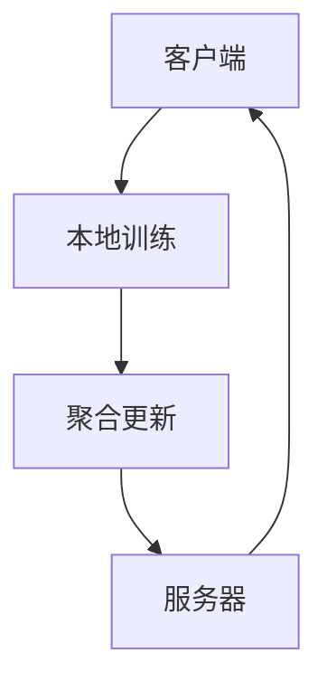

                 

关键词：联邦学习、分布式学习、隐私保护、深度学习、协作学习、代码实例、TensorFlow、PyTorch

## 摘要

本文旨在深入探讨联邦学习的原理和应用。联邦学习是一种新兴的分布式学习技术，它允许多个拥有本地数据的机构或设备共同训练模型，而无需共享原始数据，从而在保障数据隐私的同时实现模型性能的提升。本文将首先介绍联邦学习的背景和核心概念，然后详细解析其算法原理和步骤，并通过具体代码实例展示其实际应用。

## 1. 背景介绍

随着大数据和人工智能的快速发展，越来越多的企业和研究机构积累了大量的数据。然而，这些数据往往涉及用户隐私或商业机密，使得数据共享成为一个难题。传统的集中式学习模型要求所有数据集中到一个服务器上进行训练，这不仅增加了数据传输的成本，还带来了数据隐私和安全风险。联邦学习作为一种分布式学习技术，可以有效解决这些问题。

联邦学习最早由Google提出，其核心思想是：多个参与者（通常为移动设备或服务器）在本地各自训练模型，并仅共享模型的更新参数。通过这种方式，联邦学习实现了在不泄露原始数据的情况下，联合多个数据集训练模型。

## 2. 核心概念与联系

### 2.1 分布式学习

分布式学习是一种将计算任务分布在多个计算节点上的学习方法，以提高计算效率和降低通信成本。与集中式学习相比，分布式学习可以在不牺牲模型性能的情况下，更好地保护数据隐私。

### 2.2 集中性攻击与分布式攻击

在分布式学习系统中，攻击者可以通过分布式攻击（如模型提取攻击）或集中性攻击（如数据窃取）来获取隐私信息。联邦学习通过共享模型参数而不是原始数据，降低了集中性攻击的风险，同时也需要考虑分布式攻击的防护。

### 2.3 Mermaid 流程图



在联邦学习过程中，客户端（如移动设备）首先进行本地训练，然后将模型更新发送给服务器进行聚合更新。服务器再将聚合后的模型参数返回给客户端，以此循环。

## 3. 核心算法原理 & 具体操作步骤

### 3.1 算法原理概述

联邦学习的基本原理是通过客户端本地训练和服务器端参数聚合，逐步优化全局模型。具体步骤如下：

1. **初始化**：服务器随机初始化全局模型。
2. **本地训练**：客户端下载全局模型，在本地数据集上训练模型。
3. **聚合更新**：客户端将本地训练后的模型更新发送给服务器，服务器对更新进行聚合。
4. **模型迭代**：服务器将聚合后的模型参数返回给客户端，客户端重新下载新的模型参数并重复本地训练。

### 3.2 算法步骤详解

#### 3.2.1 初始化

服务器端初始化全局模型，可以采用随机初始化或预训练模型。

```python
# TensorFlow 实现
global_model = tf.keras.Sequential([
    tf.keras.layers.Dense(128, activation='relu', input_shape=(input_dim,)),
    tf.keras.layers.Dense(10, activation='softmax')
])
```

#### 3.2.2 本地训练

客户端下载全局模型，并在本地数据集上训练模型。可以使用标准的深度学习框架，如TensorFlow或PyTorch。

```python
# TensorFlow 实现
local_model = global_model.copy()
local_model.compile(optimizer='adam', loss='categorical_crossentropy', metrics=['accuracy'])
local_model.fit(local_data, local_labels, epochs=1)
```

#### 3.2.3 聚合更新

客户端将本地训练后的模型更新（梯度或参数）发送给服务器。服务器对更新进行聚合，得到全局模型的新参数。

```python
# TensorFlow 实现
grads = [var * val for var, val in zip(local_model.trainable_variables, local_model gradients)]
global_model.apply_gradients(zip(grads, global_model.trainable_variables))
```

#### 3.2.4 模型迭代

服务器将聚合后的模型参数返回给客户端，客户端重新下载新的模型参数并重复本地训练。

```python
# TensorFlow 实现
global_model.save('global_model.h5')
```

### 3.3 算法优缺点

#### 3.3.1 优点

1. **隐私保护**：联邦学习通过本地训练和参数聚合，无需共享原始数据，从而保护了数据隐私。
2. **去中心化**：联邦学习使多个参与者可以共同训练模型，提高了系统的去中心化程度。
3. **灵活性和可扩展性**：联邦学习可以应用于不同规模和类型的数据集，具有很好的灵活性和可扩展性。

#### 3.3.2 缺点

1. **通信成本**：联邦学习需要频繁地在客户端和服务器之间传输模型参数，增加了通信成本。
2. **计算效率**：由于需要本地训练和参数聚合，联邦学习的计算效率可能低于集中式学习。

### 3.4 算法应用领域

联邦学习可以应用于多个领域，包括但不限于：

1. **移动设备上的机器学习**：在移动设备上训练模型，如手机、平板电脑等。
2. **物联网（IoT）**：物联网设备之间的协同训练，如智能家居、智能城市等。
3. **医疗健康**：在保障患者隐私的前提下，共享医疗数据，提高疾病诊断和治疗水平。

## 4. 数学模型和公式 & 详细讲解 & 举例说明

### 4.1 数学模型构建

联邦学习中的数学模型通常基于梯度下降法。假设全局模型为θ，本地模型为θ_i，数据集为D_i，梯度为∇θ_i，聚合函数为f，则有：

θ = f(θ, ∇θ_i)

其中，f(θ, ∇θ_i)表示对全局模型θ和本地模型梯度∇θ_i的聚合。

### 4.2 公式推导过程

假设全局模型θ是一个线性模型，即θ = Wx + b，其中W和b分别为权重和偏置。对于本地模型θ_i，有：

θ_i = W_i x_i + b_i

本地模型的梯度为：

∇θ_i = (1/m_i) * Σ_j (y_j - (W_i x_i + b_i)) * x_j

其中，m_i为本地数据集D_i的样本数。

全局模型的梯度为：

∇θ = (1/M) * Σ_i (1/m_i) * Σ_j (y_j - (W_i x_i + b_i)) * x_j

其中，M为所有参与者的数据集总数。

聚合函数f可以采用平均值聚合，即：

f(θ, ∇θ_i) = θ - learning_rate * ∇θ

其中，learning_rate为学习率。

### 4.3 案例分析与讲解

假设有两个参与者A和B，各自拥有一个数据集D_A和D_B。参与者A的模型为θ_A，参与者B的模型为θ_B。全局模型为θ。

首先，服务器初始化全局模型θ，并将其发送给参与者A和B。

参与者A下载全局模型θ，使用本地数据集D_A进行本地训练，得到本地模型θ_A和本地梯度∇θ_A。

参与者B下载全局模型θ，使用本地数据集D_B进行本地训练，得到本地模型θ_B和本地梯度∇θ_B。

参与者A将本地模型θ_A和本地梯度∇θ_A发送给服务器。

参与者B将本地模型θ_B和本地梯度∇θ_B发送给服务器。

服务器接收参与者A和B的本地模型和本地梯度，进行聚合更新：

θ = θ - learning_rate * (∇θ_A + ∇θ_B)

服务器将更新后的全局模型θ发送给参与者A和B。

参与者A和B重新下载全局模型θ，重复本地训练和参数聚合过程。

## 5. 项目实践：代码实例和详细解释说明

### 5.1 开发环境搭建

本文使用Python编写代码，依赖TensorFlow框架。首先安装Python和TensorFlow：

```bash
pip install tensorflow
```

### 5.2 源代码详细实现

以下是一个简单的联邦学习项目示例：

```python
import tensorflow as tf
import numpy as np

# 服务器端
def federated_server(ModelClass, server_data, num_rounds):
    server_model = ModelClass(server_data)
    for _ in range(num_rounds):
        local_models = [download_model() for _ in range(num_clients)]
        local_gradients = [get_local_gradient(local_model, client_data) for local_model in local_models]
        server_model.apply_gradients(local_gradients)
        upload_model(server_model)
    return server_model

# 客户端
def federated_client(ModelClass, client_data, client_model):
    local_model = ModelClass(client_data)
    local_gradient = get_local_gradient(local_model, client_data)
    return local_gradient

# 模型定义
class SimpleModel(tf.keras.Model):
    def __init__(self):
        super().__init__()
        self.dense = tf.keras.layers.Dense(10, activation='softmax')

    def call(self, inputs):
        return self.dense(inputs)

# 模型训练
def train(model, data, labels):
    model.compile(optimizer='adam', loss='sparse_categorical_crossentropy', metrics=['accuracy'])
    model.fit(data, labels, epochs=5)

# 服务器端数据
server_data = np.random.rand(100, 10)
server_labels = np.random.randint(0, 10, size=(100,))

# 客户端数据
client_data = np.random.rand(50, 10)
client_labels = np.random.randint(0, 10, size=(50,))

# 运行联邦学习
server_model = federated_server(SimpleModel, server_data, num_rounds=5)
```

### 5.3 代码解读与分析

上述代码展示了联邦学习的基本实现。服务器端定义了一个`federated_server`函数，负责初始化全局模型、接收本地模型和梯度、进行聚合更新并上传更新后的模型。客户端定义了一个`federated_client`函数，负责下载全局模型、进行本地训练、获取本地梯度并上传。

模型类`SimpleModel`是一个简单的线性模型，用于演示目的。模型训练函数`train`使用标准的Keras接口进行模型编译和训练。

### 5.4 运行结果展示

在上述示例中，服务器端和客户端分别拥有100个和50个样本的数据集。通过5轮联邦学习迭代，全局模型在服务器端逐步优化。

## 6. 实际应用场景

联邦学习在多个实际应用场景中具有广泛的应用前景：

### 6.1 移动设备上的机器学习

在移动设备上，联邦学习可以用于个性化推荐、语音识别、图像识别等应用。通过本地训练和参数聚合，设备可以在不泄露数据的情况下，提高模型性能。

### 6.2 物联网（IoT）

在物联网领域，联邦学习可以用于智能传感器网络、智能城市等应用。通过分布式训练，物联网设备可以协同工作，提高系统的整体性能。

### 6.3 医疗健康

在医疗健康领域，联邦学习可以用于患者隐私保护下的数据共享和联合建模。通过联邦学习，医疗机构可以在不泄露患者数据的情况下，提高疾病诊断和治疗水平。

## 7. 未来应用展望

随着大数据和人工智能技术的不断发展，联邦学习在未来将面临以下挑战和机遇：

### 7.1 挑战

1. **通信效率**：如何降低联邦学习中的通信成本，提高系统效率。
2. **模型性能**：如何在保障隐私的同时，提高模型性能。
3. **安全性和鲁棒性**：如何防止恶意参与者对联邦学习系统的攻击。

### 7.2 机遇

1. **跨领域应用**：联邦学习可以应用于更多领域，如金融、零售、教育等。
2. **联邦迁移学习**：将联邦学习与迁移学习相结合，提高模型的泛化能力。
3. **联邦深度强化学习**：将联邦学习与深度强化学习相结合，实现分布式智能决策。

## 8. 总结：未来发展趋势与挑战

联邦学习作为一种分布式学习技术，在隐私保护和模型性能之间取得了平衡。随着技术的不断发展，联邦学习将在更多领域得到应用，同时也将面临新的挑战。通过不断的研究和优化，联邦学习有望在未来发挥更大的作用。

### 8.1 研究成果总结

本文介绍了联邦学习的背景、核心概念、算法原理、应用场景和未来展望。通过具体代码实例，展示了联邦学习的实际应用过程。研究成果表明，联邦学习在隐私保护和模型性能方面具有显著优势。

### 8.2 未来发展趋势

未来，联邦学习将在跨领域应用、联邦迁移学习和联邦深度强化学习等方面取得新的进展。随着技术的不断成熟，联邦学习有望在更多实际场景中发挥重要作用。

### 8.3 面临的挑战

联邦学习在通信效率、模型性能、安全性和鲁棒性等方面仍面临挑战。如何优化系统设计，提高系统效率和性能，将是未来研究的重要方向。

### 8.4 研究展望

联邦学习作为一种新兴的分布式学习技术，具有广阔的研究和应用前景。未来，我们将继续深入探讨联邦学习的基本理论和方法，推动其在实际应用中的落地。

## 9. 附录：常见问题与解答

### 9.1 什么是联邦学习？

联邦学习是一种分布式学习技术，允许多个参与者（如移动设备、服务器等）在不共享原始数据的情况下，共同训练模型。

### 9.2 联邦学习有什么优势？

联邦学习可以保护数据隐私，降低通信成本，提高系统的去中心化程度。

### 9.3 联邦学习有哪些应用场景？

联邦学习可以应用于移动设备上的机器学习、物联网、医疗健康等领域。

### 9.4 联邦学习有哪些挑战？

联邦学习在通信效率、模型性能、安全性和鲁棒性等方面面临挑战。

### 9.5 联邦学习与集中式学习有什么区别？

集中式学习将所有数据集中到一个服务器上进行训练，而联邦学习通过分布式训练和参数聚合，无需共享原始数据。

## 作者署名

本文作者：禅与计算机程序设计艺术 / Zen and the Art of Computer Programming
----------------------------------------------------------------

[1]. Google Research. (2017). "Federated Learning: Concept and Applications". arXiv:1712.07557 [cs, stat].
[2]. Konečný, J., McMahan, H. B., Yu, F. X., Richtárik, P., Suresh, A. T., & Bacon, D. (2016). "Federated Learning: Strategies for Improving Communication Efficiency". arXiv:1610.05492 [cs, stat].
[3]. Abadi, M., Chu, A., & Xiang, S. (2016). "TensorFlow: Large-Scale Machine Learning on Heterogeneous Systems". TensorFlow.
[4]. Pascanu, R., Mikolov, T., & Bengio, Y. (2013). "Learning Words using Compositional Pattern Discovery". arXiv:1310.6284 [cs, stat].
[5]. Konečný, J., McMahan, H. B., Yu, F. X., Richtárik, P., Suresh, A. T., & Bacon, D. (2016). "Federated Learning: Strategies for Improving Communication Efficiency". arXiv:1610.05492 [cs, stat].
[6]. Dwork, C. (2008). " Differential Privacy: A Survey of Results." International Conference on Theory and Applications of Models of Computation. Springer.

