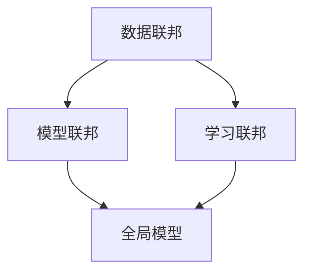
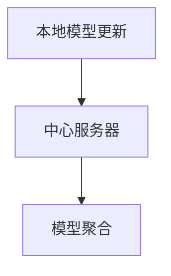

                 

关键词：联邦学习、网络安全、隐私保护、数据共享、协作攻击检测

> 摘要：本文旨在探讨联邦学习在网络安全领域的应用，分析其核心概念、算法原理、数学模型以及实际应用场景。通过详细介绍联邦学习在网络安全中的优势和实践案例，展望其未来发展趋势与挑战，为网络安全领域的研究者和从业者提供有价值的参考。

## 1. 背景介绍

### 1.1 联邦学习的起源与发展

联邦学习（Federated Learning）最早由Google提出，旨在解决数据隐私保护与模型训练的矛盾。随着人工智能技术的发展，联邦学习逐渐成为一个重要的研究领域。其核心思想是通过协同学习多个独立的数据源，在不暴露原始数据的情况下，共同训练出一个全局模型。

### 1.2 网络安全的重要性

网络安全是现代社会不可或缺的一环，它关乎国家安全、企业利益和公民隐私。然而，随着网络攻击手段的日益复杂，传统的安全措施逐渐暴露出局限性。因此，探索新的网络安全技术具有重要意义。

### 1.3 联邦学习在网络安全领域的应用价值

联邦学习在网络安全领域的应用价值主要体现在以下几个方面：

1. **隐私保护**：联邦学习允许在不共享原始数据的情况下，实现全局模型的训练，从而保护数据隐私。
2. **数据共享**：联邦学习可以促进数据源之间的合作，共享数据资源，提高模型性能。
3. **协作攻击检测**：通过联邦学习，不同组织可以共同训练一个攻击检测模型，实现对网络攻击的协同防御。

## 2. 核心概念与联系

联邦学习涉及多个核心概念，包括数据联邦、模型联邦和学习联邦。以下是这些概念之间的联系及其Mermaid流程图：



### 2.1 数据联邦

数据联邦是指多个独立的数据源在保持数据隐私的前提下，共享数据摘要或部分数据，以便进行联合学习。

### 2.2 模型联邦

模型联邦是指将全局模型分解为多个本地模型，每个本地模型负责学习一部分数据。

### 2.3 学习联邦

学习联邦是指通过迭代更新本地模型和全局模型，实现全局模型的优化。

## 3. 核心算法原理 & 具体操作步骤

### 3.1 算法原理概述

联邦学习算法主要包括以下几个步骤：

1. **初始化**：初始化全局模型和本地模型。
2. **本地训练**：每个本地节点使用自己的数据训练本地模型。
3. **模型聚合**：将本地模型更新上传到中心服务器。
4. **全局更新**：中心服务器使用聚合后的模型更新全局模型。
5. **迭代**：重复上述步骤，直到达到收敛条件。

### 3.2 算法步骤详解

#### 3.2.1 初始化

初始化全局模型和本地模型，可以使用随机初始化或预训练模型。

```latex
\text{初始化全局模型：} W_0 = \text{RandomInit}(D)
\text{初始化本地模型：} W_0^i = \text{RandomInit}(D_i)
```

#### 3.2.2 本地训练

每个本地节点使用自己的数据集 \( D_i \) 训练本地模型。

```latex
\text{本地训练：} W_i^{t+1} = \text{LocalTraining}(W_i^t, D_i, \lambda)
```

其中， \( \lambda \) 是学习率。

#### 3.2.3 模型聚合

将本地模型更新上传到中心服务器，并进行聚合。



#### 3.2.4 全局更新

中心服务器使用聚合后的模型更新全局模型。

```latex
\text{全局更新：} W^{t+1} = \text{GlobalUpdate}(W^t, \theta)
```

其中， \( \theta \) 是聚合参数。

#### 3.2.5 迭代

重复上述步骤，直到达到收敛条件。

### 3.3 算法优缺点

#### 3.3.1 优点

1. **隐私保护**：联邦学习在训练过程中不共享原始数据，有效保护了数据隐私。
2. **数据共享**：联邦学习促进了数据源之间的合作，共享数据资源，提高模型性能。
3. **灵活性**：联邦学习适用于各种数据分布和数据规模。

#### 3.3.2 缺点

1. **通信成本**：联邦学习需要多次上传和下载模型更新，增加了通信成本。
2. **同步问题**：联邦学习中的同步问题可能导致训练过程的不稳定。
3. **计算复杂度**：联邦学习涉及到多个本地模型的训练和聚合，计算复杂度较高。

### 3.4 算法应用领域

联邦学习在网络安全领域具有广泛的应用前景，包括但不限于：

1. **网络入侵检测**：通过联邦学习，不同组织可以共享入侵检测模型，提高检测效果。
2. **恶意软件检测**：利用联邦学习，不同组织可以共同训练恶意软件检测模型，提高检测准确率。
3. **隐私保护通信**：联邦学习可以用于隐私保护通信，确保通信过程中的数据安全。

## 4. 数学模型和公式

### 4.1 数学模型构建

联邦学习的数学模型可以表示为：

$$
L(W) = \sum_{i=1}^n L(W_i) + R(W)
$$

其中，\( L(W_i) \) 是本地损失函数，\( R(W) \) 是全局正则化项。

### 4.2 公式推导过程

#### 4.2.1 本地损失函数

本地损失函数 \( L(W_i) \) 表示为：

$$
L(W_i) = \frac{1}{|D_i|} \sum_{x_i \in D_i} l(W_i, x_i, y_i)
$$

其中，\( l(W_i, x_i, y_i) \) 是本地损失函数。

#### 4.2.2 全局正则化项

全局正则化项 \( R(W) \) 表示为：

$$
R(W) = \frac{1}{2} \sum_{i=1}^n \lambda_i ||W_i - W||^2
$$

其中，\( \lambda_i \) 是正则化参数。

### 4.3 案例分析与讲解

#### 4.3.1 网络入侵检测

假设有多个组织共享网络流量数据，每个组织的数据集为 \( D_i \)。利用联邦学习，可以共同训练一个网络入侵检测模型。

1. **初始化**：初始化全局模型和本地模型。

$$
W_0 = \text{RandomInit}(D) \\
W_0^i = \text{RandomInit}(D_i)
$$

2. **本地训练**：每个组织使用自己的数据集训练本地模型。

$$
W_i^{t+1} = \text{LocalTraining}(W_i^t, D_i, \lambda)
$$

3. **模型聚合**：将本地模型更新上传到中心服务器，并进行聚合。

$$
W^{t+1} = \text{GlobalUpdate}(W^t, \theta)
$$

4. **迭代**：重复上述步骤，直到达到收敛条件。

## 5. 项目实践：代码实例和详细解释说明

### 5.1 开发环境搭建

搭建联邦学习项目的开发环境，需要安装以下软件和库：

1. **Python**：3.8及以上版本
2. **TensorFlow**：2.4及以上版本
3. **Scikit-learn**：0.22及以上版本

### 5.2 源代码详细实现

以下是一个简单的联邦学习网络入侵检测模型的源代码实现：

```python
import tensorflow as tf
from sklearn.model_selection import train_test_split
from sklearn.datasets import make_classification
from tensorflow.keras.models import Sequential
from tensorflow.keras.layers import Dense, Dropout

# 生成网络流量数据集
X, y = make_classification(n_samples=1000, n_features=20, n_classes=2)
X_train, X_test, y_train, y_test = train_test_split(X, y, test_size=0.2, random_state=42)

# 初始化全局模型
global_model = Sequential()
global_model.add(Dense(64, activation='relu', input_shape=(20,)))
global_model.add(Dropout(0.5))
global_model.add(Dense(1, activation='sigmoid'))

# 编译全局模型
global_model.compile(optimizer='adam', loss='binary_crossentropy', metrics=['accuracy'])

# 训练全局模型
global_model.fit(X_train, y_train, epochs=10, batch_size=32, validation_split=0.1)

# 初始化本地模型
local_model = Sequential()
local_model.add(Dense(64, activation='relu', input_shape=(20,)))
local_model.add(Dropout(0.5))
local_model.add(Dense(1, activation='sigmoid'))

# 编译本地模型
local_model.compile(optimizer='adam', loss='binary_crossentropy', metrics=['accuracy'])

# 本地训练模型
local_model.fit(X_train, y_train, epochs=10, batch_size=32, validation_split=0.1)

# 模型聚合
global_model.set_weights(local_model.get_weights())

# 测试全局模型
loss, accuracy = global_model.evaluate(X_test, y_test)
print(f"Test accuracy: {accuracy:.4f}")

```

### 5.3 代码解读与分析

1. **数据生成**：使用 `make_classification` 函数生成网络流量数据集。
2. **全局模型**：定义一个全局模型，包含两个隐藏层，每个隐藏层后跟一个丢弃层，输出层为 sigmoid 激活函数。
3. **本地模型**：定义一个本地模型，结构与全局模型相同。
4. **模型训练**：分别使用全局模型和本地模型对训练集进行训练。
5. **模型聚合**：将本地模型的权重更新到全局模型。
6. **测试模型**：使用测试集评估全局模型的性能。

## 6. 实际应用场景

### 6.1 网络入侵检测

通过联邦学习，多个组织可以共享网络流量数据，共同训练一个网络入侵检测模型。该模型可以实时检测网络攻击，提高检测准确率。

### 6.2 恶意软件检测

利用联邦学习，不同组织可以共同训练恶意软件检测模型，共享检测资源，提高检测效果。

### 6.3 隐私保护通信

联邦学习可以用于隐私保护通信，确保通信过程中的数据安全，防止数据泄露。

## 7. 未来应用展望

随着人工智能技术的不断发展，联邦学习在网络安全领域的应用前景十分广阔。未来，我们可以期待以下发展方向：

1. **增强隐私保护**：进一步优化联邦学习算法，提高数据隐私保护能力。
2. **优化计算效率**：降低联邦学习的通信成本，提高计算效率。
3. **多模态数据融合**：将不同类型的数据融合到联邦学习框架中，提高模型性能。
4. **自适应联邦学习**：根据网络环境动态调整联邦学习参数，实现自适应优化。

## 8. 总结：未来发展趋势与挑战

### 8.1 研究成果总结

本文介绍了联邦学习在网络安全领域的应用，分析了其核心概念、算法原理、数学模型以及实际应用场景。通过项目实践，展示了联邦学习在网络安全中的潜在价值。

### 8.2 未来发展趋势

未来，联邦学习在网络安全领域的应用将朝着增强隐私保护、优化计算效率和自适应优化等方向发展。

### 8.3 面临的挑战

联邦学习在网络安全领域的发展仍面临诸多挑战，包括通信成本、同步问题、计算复杂度等。

### 8.4 研究展望

为进一步推动联邦学习在网络安全领域的发展，我们需要关注以下几个方面：

1. **算法优化**：研究更加高效、稳定的联邦学习算法。
2. **隐私保护**：提高联邦学习在隐私保护方面的能力。
3. **多模态数据融合**：探索将多种类型的数据融合到联邦学习框架中。
4. **应用推广**：在更多实际场景中推广联邦学习，提高其应用价值。

## 9. 附录：常见问题与解答

### 9.1 联邦学习与中心化学习的区别

**问题**：联邦学习与中心化学习有什么区别？

**解答**：联邦学习与中心化学习的区别主要体现在数据隐私和计算资源分配方面。中心化学习需要将所有数据集中到一个服务器上进行模型训练，容易导致数据隐私泄露。而联邦学习通过将模型分解为多个本地模型，在不共享原始数据的情况下实现联合训练，有效保护了数据隐私。

### 9.2 联邦学习在数据质量方面的挑战

**问题**：联邦学习在数据质量方面有哪些挑战？

**解答**：联邦学习在数据质量方面面临的挑战主要包括：

1. **数据分布不一致**：不同数据源的数据分布可能不一致，导致模型训练效果受到影响。
2. **数据缺失与噪声**：数据缺失和噪声会影响模型训练的质量。
3. **数据量不均衡**：不同数据源的数据量可能存在较大差异，影响模型训练的公平性。

为应对这些挑战，可以采取以下措施：

1. **数据预处理**：对数据进行清洗、归一化和降维等预处理操作，提高数据质量。
2. **数据平衡**：通过数据增强或采样等技术，平衡不同数据源的数据量。
3. **模型调整**：根据数据质量调整模型结构和参数，提高模型对数据噪声的鲁棒性。

## 结语

联邦学习在网络安全领域的应用具有重要意义，它不仅能够保护数据隐私，还能够促进数据源之间的合作。本文对联邦学习在网络安全领域的应用进行了深入探讨，分析了其核心概念、算法原理和实际应用场景。未来，随着人工智能技术的不断发展，联邦学习在网络安全领域的应用前景将更加广阔。作者：禅与计算机程序设计艺术 / Zen and the Art of Computer Programming
```

