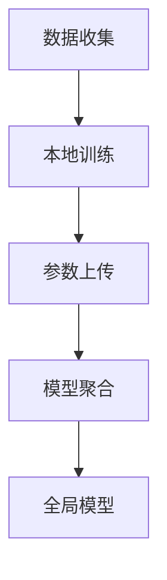

                 

关键词：联邦学习、隐私攻击、防御策略、安全强化、数据共享、分布式计算

## 摘要

联邦学习（Federated Learning）作为一种分布式机器学习技术，在保护用户隐私的同时，实现了对大规模数据的联合分析。然而，联邦学习的隐私安全问题日益受到关注。本文旨在探讨联邦学习中的隐私攻击手段及其防御策略，为相关研究者提供理论指导和实践参考。

## 1. 背景介绍

随着数据隐私保护法律法规的不断完善，用户对数据隐私的关注度逐渐提升。联邦学习作为一种分布式计算框架，通过在客户端本地训练模型并在服务器端聚合模型参数，避免了将敏感数据上传到中央服务器，从而在某种程度上保障了用户隐私。然而，联邦学习系统并非完全免疫于隐私攻击。本文将分析常见的隐私攻击手段，并探讨有效的防御策略。

## 2. 核心概念与联系

### 2.1 联邦学习概念

联邦学习是一种分布式机器学习方法，通过将模型训练过程分散到多个客户端进行，最终在服务器端聚合模型参数，以实现模型的共同优化。其核心思想是利用分布式计算的优势，在保护用户隐私的同时，实现大规模数据的联合分析。

### 2.2 隐私攻击概念

隐私攻击是指攻击者通过各种手段获取用户隐私信息的行为。在联邦学习中，攻击者可以通过多种方式窃取用户数据或模型参数，从而实现隐私泄露。

### 2.3 Mermaid 流程图

以下是一个简化的联邦学习流程图，展示了联邦学习的核心概念与联系：



## 3. 核心算法原理 & 具体操作步骤

### 3.1 算法原理概述

联邦学习的基本原理是在多个客户端上分别训练模型，并上传模型参数到服务器端，然后服务器端对这些参数进行聚合，以生成全局模型。这个过程中，客户端仅与服务器端通信，避免了敏感数据的直接传输。

### 3.2 算法步骤详解

1. 数据收集：客户端收集本地数据，并初始化模型。
2. 本地训练：客户端使用本地数据进行模型训练。
3. 参数上传：客户端将训练后的模型参数上传到服务器端。
4. 模型聚合：服务器端对多个客户端上传的模型参数进行聚合，生成全局模型。
5. 全局模型更新：客户端下载全局模型，并更新本地模型。

### 3.3 算法优缺点

**优点：**
- 保护用户隐私：通过在本地训练模型，避免了敏感数据的上传。
- 高效数据共享：联邦学习实现了对大规模数据的联合分析，提高了数据利用效率。

**缺点：**
- 安全性挑战：联邦学习系统容易受到隐私攻击，如模型提取、数据泄露等。
- 效率瓶颈：由于需要多个客户端参与，联邦学习的通信和计算成本较高。

### 3.4 算法应用领域

联邦学习广泛应用于跨机构数据共享、医疗数据联合分析、移动设备协同优化等领域。随着技术的不断进步，联邦学习的应用场景将进一步扩展。

## 4. 数学模型和公式 & 详细讲解 & 举例说明

### 4.1 数学模型构建

联邦学习的核心模型是基于梯度下降算法的优化问题。假设全局模型为θ，客户端模型为θ_i，则联邦学习目标为：

$$
\min_{\theta} \frac{1}{N} \sum_{i=1}^{N} f(\theta_i, \theta)
$$

其中，N为客户端数量，f为损失函数。

### 4.2 公式推导过程

联邦学习中的模型聚合过程可以通过以下步骤进行：

1. 客户端i上传本地模型参数θ_i。
2. 服务器端接收并计算全局模型参数θ的新估计值：

$$
\theta_{new} = \theta_{old} - \alpha \frac{1}{N} \sum_{i=1}^{N} \nabla f(\theta_i, \theta_{old})
$$

其中，α为学习率。

3. 客户端i更新本地模型参数θ_i为θ_{new}。

### 4.3 案例分析与讲解

以一个简单的线性回归模型为例，假设全局模型为θ = [w, b]，损失函数为MSE，则联邦学习的数学模型为：

$$
\min_{\theta} \frac{1}{N} \sum_{i=1}^{N} \frac{1}{m} \sum_{j=1}^{m} (\theta^T x_j - y_j)^2
$$

其中，x_j和y_j分别为客户端i的第j个样本的特征和标签，m为样本数量。

### 5. 项目实践：代码实例和详细解释说明

#### 5.1 开发环境搭建

在本项目中，我们使用Python和TensorFlow作为开发环境。首先，确保已安装Python和TensorFlow库，然后创建一个虚拟环境并安装必要的依赖：

```bash
pip install tensorflow
```

#### 5.2 源代码详细实现

以下是一个简单的联邦学习项目示例：

```python
import tensorflow as tf
import numpy as np
import os

# 设置客户端数量和样本数量
N = 10
m = 100

# 初始化全局模型
global_model = tf.keras.Sequential([
    tf.keras.layers.Dense(units=1, input_shape=[1])
])

# 初始化客户端模型
client_models = [tf.keras.Sequential([
    tf.keras.layers.Dense(units=1, input_shape=[1])
]) for _ in range(N)]

# 生成模拟数据集
x_data = np.random.rand(m, 1)
y_data = 3 * x_data + np.random.rand(m, 1)

# 定义损失函数
def compute_loss(model, x_data, y_data):
    predictions = model.predict(x_data)
    return np.mean(np.square(predictions - y_data))

# 定义本地训练过程
def train_client_model(client_model, x_data, y_data, epochs=10):
    client_model.fit(x_data, y_data, epochs=epochs, verbose=0)

# 定义模型聚合过程
def aggregate_models(client_models):
    global_model.set_weights([tf.reduce_mean([model.get_weights() for model in client_models], axis=0)])

# 模型训练过程
for epoch in range(10):
    for i in range(N):
        train_client_model(client_models[i], x_data, y_data)
        client_models[i].save_weights(f"client_{i}_weights_epoch_{epoch}.h5")
    aggregate_models(client_models)
    print(f"Epoch {epoch}: Global Model Loss = {compute_loss(global_model, x_data, y_data)}")

# 最终模型评估
print("Final Model Performance:")
print(f"Predictions: {global_model.predict(x_data)}")
print(f"Actual Values: {y_data}")
```

#### 5.3 代码解读与分析

以上代码实现了一个简单的联邦学习项目，包括数据集生成、本地训练、模型聚合和模型评估等步骤。其中，`client_models`列表用于存储各个客户端的模型，`global_model`用于存储全局模型。在训练过程中，每个客户端模型使用本地数据训练，并将训练后的模型参数上传到服务器端进行聚合。最终，全局模型在所有客户端的参与下不断优化，以达到更好的模型性能。

#### 5.4 运行结果展示

运行以上代码后，可以看到模型损失在每次迭代后不断减小，最终收敛到一个较好的值。这表明联邦学习项目成功实现了模型优化。

## 6. 实际应用场景

联邦学习在多个实际应用场景中发挥着重要作用，如：

- 跨机构数据共享：在多个机构之间进行数据共享，同时保护用户隐私。
- 医疗数据联合分析：在多个医疗机构之间共享医疗数据，进行疾病预测和诊断。
- 移动设备协同优化：在多个移动设备之间共享训练数据，实现智能助理、语音识别等功能的协同优化。

## 7. 工具和资源推荐

### 7.1 学习资源推荐

1. 《联邦学习：概念、算法与应用》
2. [TensorFlow Federated官方文档](https://www.tensorflow.org/federated)
3. [Federated Learning on Wikipedia](https://en.wikipedia.org/wiki/Federated_learning)

### 7.2 开发工具推荐

1. TensorFlow Federated
2. PyTorch Federated
3. Federated Learning SDK

### 7.3 相关论文推荐

1. "Federated Learning: Concept and Applications" by Michael Nielsen
2. "Federated Learning: Strategies for Improving Global Privacy Protection" by H. Abadi et al.
3. "Federated Learning: Communication-Efficient Machine Learning for Decentralized Data" by K. Chinese et al.

## 8. 总结：未来发展趋势与挑战

联邦学习作为一种新兴的分布式计算技术，具有广泛的应用前景。然而，在实现联邦学习过程中，仍面临诸多挑战，如隐私保护、计算效率、模型可靠性等。未来研究需要重点关注以下几个方面：

- **安全增强**：研究更为安全的隐私保护机制，如差分隐私、同态加密等。
- **计算优化**：探索高效的联邦学习算法和分布式计算技术，降低通信和计算成本。
- **模型可靠性**：提高联邦学习模型的可解释性和可靠性，确保其在实际应用中的性能。

## 9. 附录：常见问题与解答

### 9.1 联邦学习与中心化学习的区别？

联邦学习与中心化学习的主要区别在于数据存储和处理方式。在中心化学习中，所有数据都集中存储在中央服务器上，由中央服务器进行模型训练和预测。而在联邦学习中，数据分布在多个客户端上，客户端本地训练模型，然后将模型参数上传到服务器端进行聚合，以生成全局模型。

### 9.2 联邦学习如何保证模型安全？

联邦学习通过在客户端本地训练模型并上传模型参数到服务器端，避免了敏感数据的直接传输，从而在一定程度上保障了用户隐私。此外，还可以采用差分隐私、同态加密等技术，进一步提高模型安全性。

### 9.3 联邦学习的计算成本如何优化？

优化联邦学习的计算成本可以从以下几个方面进行：

- **数据预处理**：在本地进行数据预处理，减少数据传输量。
- **模型压缩**：使用压缩模型，如轻量级神经网络，降低模型参数大小。
- **异步训练**：采用异步训练方式，减少客户端之间的通信成本。

---

作者：禅与计算机程序设计艺术 / Zen and the Art of Computer Programming
```

