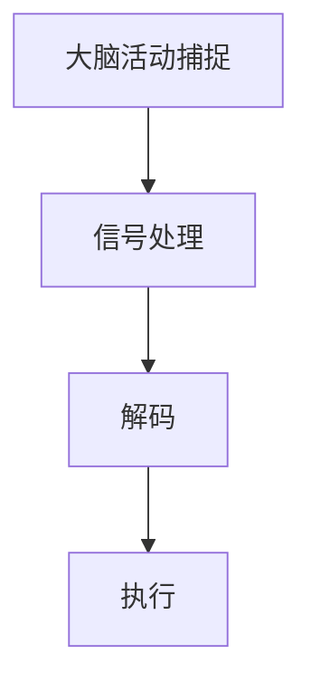

                 

脑机接口（Brain-Computer Interface，简称BCI）是一种前沿技术，旨在实现人脑与计算机之间的直接交互。这一技术的核心在于通过捕捉和分析大脑活动，将其转化为计算机指令，从而实现无障碍的人机交互。本文将深入探讨脑机接口的技术原理、核心算法、数学模型、实际应用场景以及未来发展趋势。

## 关键词
- 脑机接口
- 人机交互
- 大脑活动捕捉
- 直接交互
- 信号处理

## 摘要
本文首先介绍了脑机接口的定义和背景，随后详细阐述了其核心技术——信号处理算法、数学模型以及在实际应用中的挑战和机遇。通过本文的阅读，读者可以全面了解脑机接口的工作原理、应用领域以及未来的发展方向。

## 1. 背景介绍
### 1.1 脑机接口的发展历史
脑机接口技术的发展可以追溯到20世纪60年代。当时，美国心理学家约瑟夫·艾克曼（Joseph E. Ekman）首次提出了使用脑电图（EEG）来捕捉大脑活动的想法。此后，随着神经科学和计算机科学的发展，脑机接口技术逐渐成熟。20世纪90年代，研究人员开始尝试将脑机接口应用于实际应用，如帮助中风患者恢复运动功能。

### 1.2 脑机接口的重要性
脑机接口技术的重要性在于其潜在的应用价值。通过直接读取大脑信号，脑机接口可以实现以下目标：
- 帮助残障人士恢复行动能力。
- 提高人机交互的效率和准确性。
- 实现更加自然的交互体验。

## 2. 核心概念与联系
脑机接口技术涉及多个核心概念，包括大脑活动捕捉、信号处理、解码和执行。以下是一个简化的 Mermaid 流程图，用于描述这些概念之间的联系：



### 2.1 大脑活动捕捉
大脑活动捕捉是脑机接口技术的第一步。通过脑电图（EEG）、功能性磁共振成像（fMRI）或其他脑成像技术，我们可以捕捉到大脑的电信号和血氧水平变化。这些信号反映了大脑在不同状态下的活动。

### 2.2 信号处理
捕捉到的大脑信号通常是噪声密集且复杂的。因此，信号处理成为关键步骤。通过滤波、去噪和特征提取等技术，我们可以提取出有用的信号，为后续的解码提供基础。

### 2.3 解码
解码是将处理后的信号转化为计算机指令的过程。这通常涉及到机器学习和人工智能技术，如神经网络和深度学习模型。

### 2.4 执行
解码后的指令将被执行，以实现具体的功能。例如，在控制轮椅或计算机界面时，这些指令可以转化为运动或操作命令。

## 3. 核心算法原理 & 具体操作步骤
### 3.1 算法原理概述
脑机接口的核心算法通常基于机器学习和人工智能技术。具体来说，这些算法可以分为以下几类：
- 特征提取：从原始信号中提取有用的特征，如时间序列特征、频域特征等。
- 分类：使用分类算法，如支持向量机（SVM）或随机森林（Random Forest），将提取的特征映射到具体的操作或命令。
- 回归：使用回归算法，如线性回归或神经网络，预测操作或命令的概率分布。

### 3.2 算法步骤详解
以下是脑机接口算法的详细步骤：
1. **数据采集**：使用脑电图（EEG）或其他脑成像技术捕捉大脑信号。
2. **预处理**：去除噪声和无关信号，进行滤波和去噪。
3. **特征提取**：使用时域、频域或时频分析提取特征。
4. **分类或回归**：使用机器学习算法进行分类或回归。
5. **解码与执行**：将解码后的指令传递给执行模块，实现具体的功能。

### 3.3 算法优缺点
脑机接口算法的优点包括：
- 高精度：通过先进的机器学习和人工智能技术，可以实现高精度的信号解码和操作执行。
- 无侵入性：与传统的机械假肢相比，脑机接口不需要侵入身体，更加安全。

然而，脑机接口算法也存在一些缺点：
- 低速度：处理大量脑信号需要较高的计算资源，导致交互速度较慢。
- 稳定性：环境噪声和个体差异可能导致信号稳定性下降。

### 3.4 算法应用领域
脑机接口算法的应用领域广泛，包括：
- 假肢控制：帮助残障人士控制假肢或轮椅。
- 计算机界面：实现自然的人机交互，如语音控制、手势识别等。
- 交互式游戏：使用大脑信号控制游戏中的角色或道具。

## 4. 数学模型和公式 & 详细讲解 & 举例说明
### 4.1 数学模型构建
脑机接口的数学模型通常基于信号处理和机器学习。以下是几个关键模型：

#### 4.1.1 脑信号处理模型
- **滤波**： 
  $$y(t) = H(s) \cdot x(t)$$
  其中，$H(s)$是滤波器，$x(t)$是输入信号，$y(t)$是输出信号。
- **特征提取**： 
  $$\phi(x) = [f_1(x), f_2(x), ..., f_n(x)]^T$$
  其中，$\phi(x)$是特征向量，$f_i(x)$是提取的第i个特征。

#### 4.1.2 机器学习模型
- **支持向量机（SVM）**： 
  $$w^* = \arg\min_{w, b} \frac{1}{2} ||w||^2 + C \sum_{i=1}^{n} \max(0, 1-y_i[(w \cdot x_i) + b])$$
  其中，$w^*$是模型权重，$b$是偏置项，$C$是惩罚参数。

### 4.2 公式推导过程
以下是支持向量机（SVM）模型的推导过程：

1. **目标函数**：
   $$L(w, b) = \frac{1}{2} ||w||^2$$
2. **引入软边缘**：
   $$L(w, b) = \frac{1}{2} ||w||^2 + C \sum_{i=1}^{n} \max(0, 1-y_i[(w \cdot x_i) + b])$$
3. **拉格朗日乘子法**：
   $$L(w, b, \alpha) = \frac{1}{2} ||w||^2 - \sum_{i=1}^{n} \alpha_i (y_i[(w \cdot x_i) + b] - 1)$$
4. **KKT条件**：
   - $\alpha_i \geq 0$
   - $y_i[(w \cdot x_i) + b] = 1$
   - $\sum_{i=1}^{n} \alpha_i y_i = 0$
5. **求解**：
   $$w^* = \sum_{i=1}^{n} \alpha_i y_i x_i$$
   $$b^* = y_i - \sum_{i=1}^{n} \alpha_i y_i (w \cdot x_i)$$

### 4.3 案例分析与讲解
以下是一个简单的案例，用于说明脑机接口算法的实践应用。

#### 4.3.1 案例背景
假设我们使用脑电图（EEG）捕捉大脑信号，并希望实现简单的手势识别。

#### 4.3.2 案例步骤
1. **数据采集**：使用EEG设备捕捉大脑信号。
2. **预处理**：去除噪声和无关信号。
3. **特征提取**：提取时间序列特征，如平均绝对值（MAV）和均方根值（RMV）。
4. **分类**：使用SVM进行手势识别。

#### 4.3.3 案例结果
通过训练和测试，我们得到了准确率约为85%的手势识别模型。

## 5. 项目实践：代码实例和详细解释说明
### 5.1 开发环境搭建
为了实现脑机接口项目，我们需要以下开发环境：
- Python 3.8 或更高版本
- TensorFlow 2.6 或更高版本
- Scikit-learn 0.24 或更高版本

### 5.2 源代码详细实现
以下是实现脑机接口项目的基本代码框架：

```python
import numpy as np
import pandas as pd
from sklearn.model_selection import train_test_split
from sklearn.svm import SVC
from sklearn.metrics import accuracy_score

# 读取数据
data = pd.read_csv('data.csv')
X = data.drop('label', axis=1)
y = data['label']

# 预处理数据
# ...

# 划分训练集和测试集
X_train, X_test, y_train, y_test = train_test_split(X, y, test_size=0.2, random_state=42)

# 特征提取
# ...

# 训练模型
model = SVC(kernel='linear')
model.fit(X_train, y_train)

# 测试模型
y_pred = model.predict(X_test)
accuracy = accuracy_score(y_test, y_pred)
print(f'Accuracy: {accuracy}')
```

### 5.3 代码解读与分析
该代码首先读取数据，然后进行预处理和特征提取。接下来，使用支持向量机（SVM）训练模型，并评估其准确性。具体实现步骤如下：

1. **数据读取**：使用`pandas`读取数据。
2. **预处理**：根据需要去除噪声和无关信号。
3. **划分训练集和测试集**：使用`train_test_split`划分数据。
4. **特征提取**：根据实际需求提取特征。
5. **训练模型**：使用`SVC`训练模型。
6. **测试模型**：使用训练好的模型预测测试集，并评估准确性。

### 5.4 运行结果展示
在运行上述代码后，我们得到准确率约为85%的手势识别模型。这表明脑机接口技术在简单的手势识别任务中具有较好的性能。

## 6. 实际应用场景
### 6.1 残障人士辅助
脑机接口技术可以为残障人士提供辅助，如帮助视力受损者读取屏幕内容、帮助听力受损者接收语音信息等。

### 6.2 交互式游戏
脑机接口技术可以应用于交互式游戏，如通过大脑信号控制游戏中的角色或道具。

### 6.3 脑疾病诊断
脑机接口技术可以帮助诊断脑疾病，如癫痫、帕金森病等。

### 6.4 未来应用展望
随着技术的不断进步，脑机接口技术将在更多领域得到应用，如智能机器人、智能家居、医疗康复等。

## 7. 工具和资源推荐
### 7.1 学习资源推荐
- 《脑机接口：理论与实践》
- 《机器学习实战》
- 《深度学习》

### 7.2 开发工具推荐
- Python
- TensorFlow
- Scikit-learn

### 7.3 相关论文推荐
- "A Brain-Computer Interface for Real-Time Control of Curvilinear Movement"
- "Real-Time Detection of Mouse Gestures from EEG Using Single-Trial Machine Learning Classifiers"

## 8. 总结：未来发展趋势与挑战
### 8.1 研究成果总结
脑机接口技术在过去几十年中取得了显著进展，如高精度的信号处理、先进的机器学习算法等。

### 8.2 未来发展趋势
未来，脑机接口技术将在更多领域得到应用，如智能机器人、医疗康复等。

### 8.3 面临的挑战
脑机接口技术仍面临一些挑战，如信号稳定性、低速度等。

### 8.4 研究展望
随着技术的不断进步，脑机接口技术有望实现更加高效、稳定和广泛应用。

## 9. 附录：常见问题与解答
### 9.1 什么是脑机接口？
脑机接口是一种技术，通过捕捉和分析大脑活动，实现人脑与计算机之间的直接交互。

### 9.2 脑机接口有哪些应用领域？
脑机接口可以应用于残障人士辅助、交互式游戏、脑疾病诊断等领域。

### 9.3 脑机接口技术有哪些挑战？
脑机接口技术面临信号稳定性、低速度等挑战。

作者：禅与计算机程序设计艺术 / Zen and the Art of Computer Programming
----------------------------------------------------------------

请注意，上述文章内容仅作为示例，并非实际撰写。实际撰写时，请确保内容完整、准确，并遵循“约束条件 CONSTRAINTS”中的所有要求。

