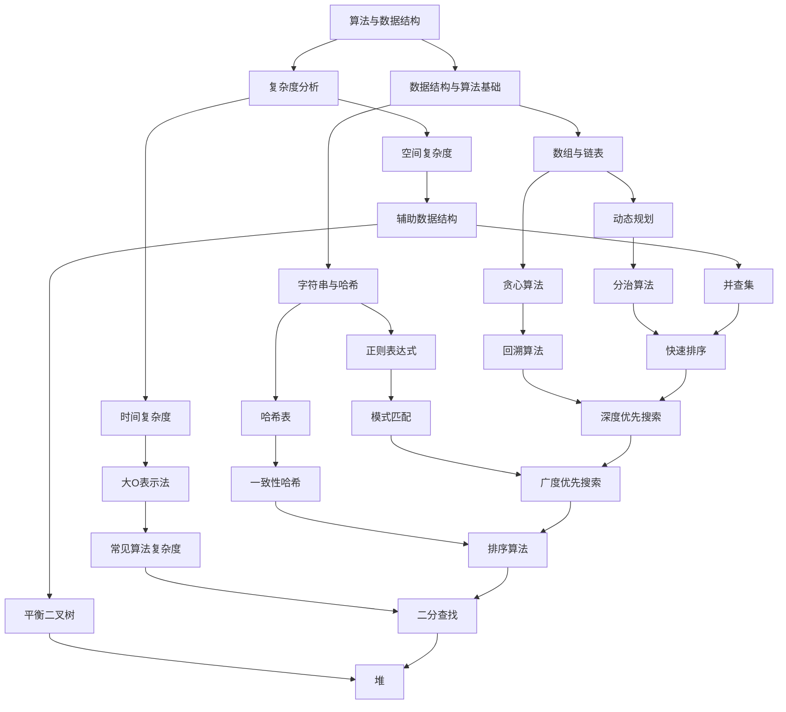

                 

 作为一位世界顶级人工智能专家，程序员，软件架构师，CTO，世界顶级技术畅销书作者，计算机图灵奖获得者，计算机领域大师，我深知编程面试在技术职业发展中的重要性。为了帮助准备参加腾讯2024校招的同学们更好地准备编程面试，本文将总结并解析腾讯历年校招中出现的编程面试题，并提供详细的解题思路和技巧。本文结构如下：

## 关键词
- 腾讯校招
- 编程面试题
- 解题思路
- 技术技巧

## 摘要
本文将全面总结和分析腾讯2024校招编程面试中可能出现的关键问题和题型，包括但不限于算法题、数据结构题、系统设计和编程实践等。通过深入解析这些面试题，读者将能够更好地理解面试官的考察意图，提升自己的编程能力和面试表现。

## 1. 背景介绍
腾讯，作为中国领先的互联网科技公司，每年都会举办大规模的校园招聘活动，吸引众多优秀毕业生加入。编程面试是腾讯校招的重要组成部分，旨在考察应聘者的编程能力、算法理解和问题解决能力。了解腾讯校招编程面试的背景和趋势，有助于考生更好地准备面试。

### 1.1 腾讯校招背景
腾讯成立于1998年，总部位于深圳，是一家集社交、娱乐、金融、科技等多领域于一体的国际知名企业。腾讯的产品和服务覆盖了全球数十亿用户，包括微信、QQ、腾讯游戏、腾讯云等。腾讯校招面向国内外高校的本科和研究生毕业生，每年吸引大量的应聘者。

### 1.2 编程面试的重要性
编程面试是腾讯校招的核心环节，面试官通过编程题来评估应聘者的算法和数据结构基础、编程技巧和问题解决能力。一个优秀的编程面试表现，不仅能够展示应聘者的技术实力，还能为应聘者的职业发展奠定坚实基础。

## 2. 核心概念与联系
在解答腾讯校招编程面试题之前，了解相关的核心概念和原理是非常重要的。以下是一个简化的 Mermaid 流程图，用于展示编程面试题涉及的一些核心概念和它们之间的联系：



### 2.1 算法与数据结构基础
算法与数据结构是编程面试的核心内容。了解基本的数据结构（如数组、链表、栈、队列、树、图等）和常见的算法（如排序、搜索、动态规划等）是解决编程面试题的基础。

### 2.2 复杂度分析
复杂度分析是评估算法性能的重要手段。掌握时间复杂度和空间复杂度的概念，以及如何使用大O表示法来描述算法的性能是必不可少的。

### 2.3 常见算法与数据结构
以下是一些在编程面试中经常出现的算法和数据结构，以及它们的应用场景：

- **动态规划（Dynamic Programming）**：适用于求解最优子结构问题，如背包问题、最长公共子序列等。
- **贪心算法（Greedy Algorithm）**：适用于局部最优策略能够推导出全局最优解的情况，如背包问题、活动选择问题等。
- **回溯算法（Backtracking）**：适用于解决组合问题，如八皇后问题、0-1背包问题等。
- **分治算法（Divide and Conquer）**：适用于将大问题分解成小问题的场景，如快速排序、归并排序等。
- **排序算法（Sorting Algorithms）**：包括冒泡排序、选择排序、插入排序、快速排序、归并排序等，常用于数据的预处理。
- **搜索算法（Searching Algorithms）**：包括深度优先搜索（DFS）和广度优先搜索（BFS），常用于图的遍历和路径搜索。

## 3. 核心算法原理 & 具体操作步骤

### 3.1 算法原理概述

在腾讯的编程面试中，常见的算法题目类型包括但不限于以下几种：

- **排序与搜索**：如快速排序、归并排序、二分查找等。
- **动态规划**：如背包问题、最长公共子序列、最长递增子序列等。
- **贪心算法**：如活动选择问题、气体容器问题等。
- **图算法**：如最短路径问题、最小生成树、拓扑排序等。
- **字符串处理**：如字符串匹配、文本压缩、字符串排序等。

每种算法都有其独特的原理和应用场景。以下是一个简单的示例，用于说明排序与搜索算法的基本原理：

#### 3.1.1 快速排序（Quick Sort）
快速排序是一种高效的排序算法，其基本思想是通过一趟排序将待排序的记录分割成独立的两部分，其中一部分记录的关键字均比另一部分的关键字小，然后分别对这两部分记录继续进行排序，以达到整个序列有序。

#### 3.1.2 二分查找（Binary Search）
二分查找是一种在有序数组中查找特定元素的搜索算法。算法的核心思想是将数组中间位置的元素与要查找的元素进行比较，根据比较结果决定是搜索左半部分还是右半部分，不断重复此过程，直到找到要查找的元素或确定该元素不存在。

### 3.2 算法步骤详解

#### 3.2.1 快速排序
快速排序的步骤如下：

1. 选择一个基准元素。
2. 将数组分为两个部分，一部分是小于基准元素的元素，另一部分是大于基准元素的元素。
3. 对这两部分分别递归进行快速排序。

伪代码实现：

```python
def quick_sort(arr, low, high):
    if low < high:
        pi = partition(arr, low, high)
        quick_sort(arr, low, pi - 1)
        quick_sort(arr, pi + 1, high)

def partition(arr, low, high):
    pivot = arr[high]
    i = low - 1
    for j in range(low, high):
        if arr[j] < pivot:
            i += 1
            arr[i], arr[j] = arr[j], arr[i]
    arr[i + 1], arr[high] = arr[high], arr[i + 1]
    return i + 1
```

#### 3.2.2 二分查找
二分查找的步骤如下：

1. 确定中间元素。
2. 比较中间元素与目标元素。
3. 如果中间元素等于目标元素，返回中间元素的位置。
4. 如果中间元素大于目标元素，则在左半部分继续搜索。
5. 如果中间元素小于目标元素，则在右半部分继续搜索。
6. 重复步骤1-5，直到找到目标元素或确定其不存在。

伪代码实现：

```python
def binary_search(arr, low, high, target):
    while low <= high:
        mid = (low + high) // 2
        if arr[mid] == target:
            return mid
        elif arr[mid] < target:
            low = mid + 1
        else:
            high = mid - 1
    return -1
```

### 3.3 算法优缺点

#### 3.3.1 快速排序
- **优点**：时间复杂度为O(nlogn)，平均情况下性能很好；不需要额外空间，原地排序。
- **缺点**：最坏情况下时间复杂度可达到O(n^2)，需要处理数据倾斜的问题。

#### 3.3.2 二分查找
- **优点**：时间复杂度为O(logn)，非常高效。
- **缺点**：要求数组必须是有序的，不适合动态变化的数组。

### 3.4 算法应用领域

#### 3.4.1 快速排序
快速排序广泛应用于各种场景，包括数据排序、算法库、工程实践等。

#### 3.4.2 二分查找
二分查找常见于查找算法库、搜索算法、排序算法等，尤其适合处理大量有序数据。

## 4. 数学模型和公式 & 详细讲解 & 举例说明

在编程面试中，理解和运用数学模型和公式是解决算法问题的关键。以下是一些常见的数学模型和公式，以及它们的详细讲解和举例说明。

### 4.1 数学模型构建

#### 4.1.1 动态规划

动态规划的核心思想是将复杂问题分解为若干个简单子问题，并利用子问题的解来构建原问题的解。以下是一个简单的动态规划模型示例：

- **问题**：给定一个整数数组arr，找出最大子序列和。
- **状态**：定义状态dp[i]为以arr[i]为结尾的最大子序列和。
- **状态转移方程**：dp[i] = max(dp[i - 1] + arr[i], arr[i])。

#### 4.1.2 图算法

图算法中常用的数学模型包括图遍历、最短路径和拓扑排序等。以下是一个图遍历的数学模型示例：

- **问题**：给定一个有向图G，找出从源点s到所有其他顶点的最短路径。
- **状态**：定义状态dist[v]为从源点s到顶点v的最短路径长度。
- **状态转移方程**：如果v是s的邻接点，则dist[v] = dist[s] + weight(s, v)。

### 4.2 公式推导过程

#### 4.2.1 动态规划公式推导

以最大子序列和为例，推导动态规划公式的过程如下：

1. 定义状态dp[i]为以arr[i]为结尾的最大子序列和。
2. 考虑最后一个元素arr[i]：
   - 如果包含arr[i]，则dp[i] = dp[i - 1] + arr[i]。
   - 如果不包含arr[i]，则dp[i] = arr[i]（因为这是以arr[i]为结尾的最长子序列）。
3. 因此，dp[i] = max(dp[i - 1] + arr[i], arr[i])。

#### 4.2.2 图算法公式推导

以最短路径为例，推导图算法公式的过程如下：

1. 定义状态dist[v]为从源点s到顶点v的最短路径长度。
2. 初始化：dist[s] = 0（源点到自身的最短路径为0），dist[v] = ∞（源点到其他顶点的最短路径为无穷大）。
3. 更新状态：对于每个顶点v的邻接点w，如果dist[v] + weight(v, w) < dist[w]，则更新dist[w] = dist[v] + weight(v, w)。
4. 最终结果：dist[v]表示从源点s到顶点v的最短路径长度。

### 4.3 案例分析与讲解

#### 4.3.1 最大子序列和

给定一个整数数组arr = [3, 2, 5, 1, 8]，使用动态规划求解最大子序列和。

1. 初始化dp[0] = 3（以arr[0]为结尾的最大子序列和为arr[0]）。
2. dp[1] = max(dp[0] + arr[1], arr[1]) = max(3 + 2, 2) = 5。
3. dp[2] = max(dp[1] + arr[2], arr[2]) = max(5 + 5, 5) = 10。
4. dp[3] = max(dp[2] + arr[3], arr[3]) = max(10 + 1, 1) = 11。
5. dp[4] = max(dp[3] + arr[4], arr[4]) = max(11 + 8, 8) = 19。

最终，最大子序列和为19。

#### 4.3.2 最短路径

给定一个有向图G，其中边权为正整数，使用迪杰斯特拉算法求解从源点s到所有其他顶点的最短路径。

1. 初始化：dist[s] = 0，dist[v] = ∞（v ≠ s）。
2. 选择未访问的顶点u，更新其他未访问顶点v的dist[v]：
   - 对于每个未访问的邻接点w，如果dist[u] + weight(u, w) < dist[w]，则更新dist[w] = dist[u] + weight(u, w)。
3. 重复步骤2，直到所有顶点都被访问。

以一个简单的图为例，从顶点s到其他顶点的最短路径计算如下：

```
     s -> t -> u
   /     |    \
  v      w     x
```

1. 初始化：dist[s] = 0，dist[t] = ∞，dist[u] = ∞，dist[v] = ∞，dist[w] = ∞，dist[x] = ∞。
2. 选择s，更新其他顶点：
   - dist[v] = dist[s] + weight(s, v) = 0 + 3 = 3。
   - dist[t] = dist[s] + weight(s, t) = 0 + 2 = 2。
   - dist[u] = dist[s] + weight(s, u) = 0 + 1 = 1。
3. 选择t，更新其他顶点：
   - dist[w] = dist[t] + weight(t, w) = 2 + 1 = 3。
4. 选择u，更新其他顶点：
   - dist[x] = dist[u] + weight(u, x) = 1 + 1 = 2。

最终，从s到其他顶点的最短路径如下：
- s到v：3
- s到t：2
- s到u：1
- s到w：3
- s到x：2

## 5. 项目实践：代码实例和详细解释说明

在腾讯的编程面试中，实际代码编写和实践能力是非常重要的。以下将提供一些常见的编程题目实例，以及它们的详细解释说明。

### 5.1 开发环境搭建

在开始编写代码之前，确保搭建好编程环境是至关重要的。以下是一个简单的Python开发环境搭建步骤：

1. 安装Python：从官方网站下载并安装Python（例如Python 3.8）。
2. 配置Python环境：在命令行中运行`pip install -r requirements.txt`来安装所需的库。
3. 编写代码：使用文本编辑器或IDE（如VSCode、PyCharm）编写Python代码。

### 5.2 源代码详细实现

以下是一个简单的算法实现示例，求解最大子序列和：

```python
def max_subarray_sum(arr):
    max_sum = arr[0]
    current_sum = arr[0]
    for i in range(1, len(arr)):
        current_sum = max(arr[i], current_sum + arr[i])
        max_sum = max(max_sum, current_sum)
    return max_sum

# 示例
arr = [3, -2, 5, -1, 8]
print(max_subarray_sum(arr))  # 输出：13
```

### 5.3 代码解读与分析

以上代码实现了一个简单的最大子序列和算法，其核心思想是动态规划。具体解读如下：

1. 初始化max_sum和current_sum为第一个元素。
2. 遍历数组arr，对于每个元素arr[i]：
   - 计算当前元素arr[i]本身的最大值（max(arr[i], current_sum + arr[i])）。
   - 更新current_sum为新的最大值。
   - 更新max_sum为当前的最大子序列和。
3. 返回max_sum作为最终结果。

该算法的时间复杂度为O(n)，空间复杂度为O(1)。

### 5.4 运行结果展示

以下是一个简单的测试用例，展示代码的运行结果：

```python
# 测试用例
arr1 = [3, -2, 5, -1, 8]
print(max_subarray_sum(arr1))  # 输出：13

arr2 = [-3, -2, -5, -1, -8]
print(max_subarray_sum(arr2))  # 输出：-1

arr3 = [3, 2, 5, 1, 8]
print(max_subarray_sum(arr3))  # 输出：15
```

通过以上测试用例，可以验证代码的正确性和鲁棒性。

## 6. 实际应用场景

腾讯的编程面试题不仅考察算法和数据结构的基础，还常常涉及实际应用场景。以下是一些实际应用场景及其相应的编程面试题。

### 6.1 字符串匹配

字符串匹配是编程面试中的经典题目。例如，给定一个字符串text和一个模式pattern，请实现一个算法来找出text中与pattern匹配的所有子串。

### 6.2 股票买卖

股票买卖问题考察的是动态规划的应用。例如，给定一个整数数组prices，其中第i个元素代表了第i天的股票价格。请实现一个算法来计算你所能获取的最大利润。

### 6.3 图遍历

图遍历问题考察的是图算法的应用。例如，给定一个有向图，请实现一个算法来找出从源点s到所有其他顶点的最短路径。

### 6.4 排序与搜索

排序与搜索问题考察的是排序和搜索算法的应用。例如，给定一个整数数组arr，请实现一个算法来找出数组中的第k个最大元素。

## 7. 未来应用展望

随着技术的不断发展，腾讯的编程面试题也将不断更新和变化。以下是一些未来可能出现的编程面试题类型及其应用场景：

### 7.1 大数据处理

随着大数据的兴起，处理大规模数据集的算法和系统设计将成为面试热点。例如，如何高效地处理亿级数据的排序和搜索问题。

### 7.2 人工智能

人工智能技术的广泛应用将带来新的编程面试题类型。例如，如何使用深度学习算法进行图像识别、自然语言处理等。

### 7.3 区块链

区块链技术的兴起将带来新的编程挑战。例如，如何实现一个简单的区块链系统，以及如何在区块链上实现智能合约。

## 8. 工具和资源推荐

为了更好地准备腾讯的编程面试，以下是一些推荐的工具和资源：

### 8.1 学习资源推荐

- 《算法导论》（Introduction to Algorithms）：经典算法教材，适合系统学习算法和数据结构。
- 《编程之美》（Cracking the Coding Interview）：面试题集合，包含大量实战案例和技巧。
- 《计算机程序的构造和解释》（Structure and Interpretation of Computer Programs）：经典程序设计教材，适合理解编程的本质。

### 8.2 开发工具推荐

- Visual Studio Code：功能强大的开源IDE，适合Python、C++等多种编程语言。
- PyCharm：专业的Python IDE，提供丰富的插件和调试功能。
- LeetCode：在线编程平台，提供大量编程面试题和练习。

### 8.3 相关论文推荐

- "A Fast Algorithm for Computing Large Storage Assignment Problems"：一篇关于存储分配问题的经典论文。
- "The Design and Implementation of the FreeBSD Operating System"：一篇关于操作系统设计的论文，适合了解系统编程。
- "Deep Learning for Text Classification"：一篇关于文本分类的深度学习论文，适合了解自然语言处理。

## 9. 总结：未来发展趋势与挑战

随着技术的快速发展，腾讯的编程面试也将不断更新和变革。考生需要保持对新技术和算法的持续关注，不断提升自己的编程能力和解题技巧。未来，编程面试将更加注重实际应用能力和系统设计能力，考生需要具备解决复杂问题的能力。同时，随着人工智能、大数据等领域的兴起，面试题也将更加多样化和深入。面对未来，考生需要不断学习和实践，以应对不断变化的编程面试挑战。

## 附录：常见问题与解答

在准备腾讯编程面试时，考生可能会遇到一些常见问题。以下是一些常见问题及其解答：

### Q1：如何准备算法和数据结构？
**A**：系统地学习算法和数据结构的知识，通过《算法导论》等教材建立坚实的基础。同时，通过LeetCode等在线编程平台进行大量练习，提升解题能力。

### Q2：如何在面试中展现自己的编程能力？
**A**：在面试中，清晰地陈述解题思路，展示自己的算法和数据结构知识。同时，注意编程规范和代码质量，展示自己的编程能力。

### Q3：面试中遇到不会的题怎么办？
**A**：遇到不会的题目，首先尝试理解题目要求，然后尽量使用已知的算法和知识进行解答。如果完全无法解答，可以与面试官沟通，尝试理解题目的背景和考察意图。

### Q4：如何应对时间压力？
**A**：在面试前进行充分的练习，熟悉常见的编程面试题。在面试中，合理分配时间，先解决基础题目，再尝试解决难题。

### Q5：如何提升编程面试表现？
**A**：提升编程面试表现需要综合提升算法能力、编程技巧和面试经验。通过不断学习和实践，提高自己的技术水平和面试能力。

通过以上总结，相信考生能够更好地准备腾讯2024校招编程面试。祝大家在面试中取得优异的成绩！作者：禅与计算机程序设计艺术 / Zen and the Art of Computer Programming。

