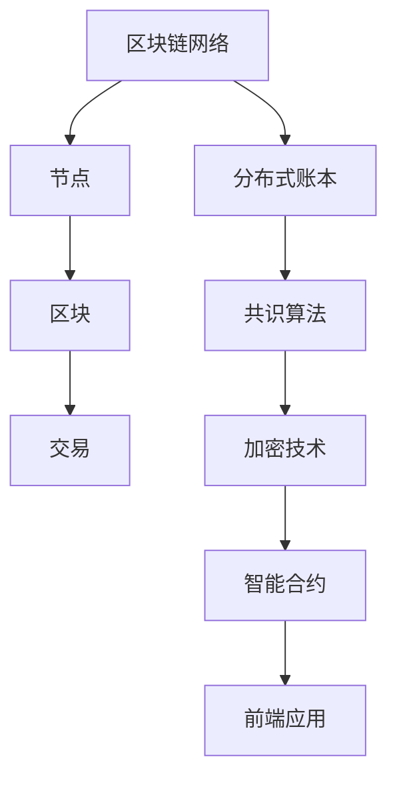

                 

关键词：腾讯、区块链、开发工程师、社招、面试、攻略

> 摘要：本文针对腾讯2025区块链开发工程师社招面试，从背景介绍、核心概念、算法原理、数学模型、项目实践、应用场景、工具资源推荐、未来发展趋势与挑战等多个角度，为您呈现一份全面深入的面试攻略。旨在帮助应聘者更好地准备面试，顺利通过选拔，成为腾讯区块链团队的优秀成员。

## 1. 背景介绍

随着区块链技术的不断发展，其在金融、物联网、供应链管理等多个领域的应用越来越广泛。腾讯作为国内领先的互联网企业，自然也将区块链技术视为重要的战略发展方向。2025年，腾讯将进一步加大在区块链技术领域的投入，并计划在全球范围内招聘优秀的区块链开发工程师。本次社招面试，旨在选拔具有扎实技术基础、丰富项目经验以及创新精神的优秀人才。

### 1.1 区块链技术发展现状

区块链技术自2008年诞生以来，经历了快速的发展。从最初的比特币，到如今的多种应用场景，区块链技术已经逐渐从概念走向实际应用。根据相关报告，全球已有超过30个国家和地区开始探索和实施区块链项目，涉及金融、供应链、医疗、能源等多个领域。

### 1.2 腾讯区块链战略布局

腾讯早在2015年便开始布局区块链技术，并成立了区块链技术团队。截至目前，腾讯已经在区块链领域取得了一系列成果，包括金融级区块链平台、分布式身份认证系统、供应链金融解决方案等。未来，腾讯将继续加大投入，推动区块链技术在各行业的深度应用。

### 1.3 区块链开发工程师岗位要求

作为一名区块链开发工程师，应聘者需要具备以下基本素质：

- **扎实的计算机科学基础**：包括数据结构、算法、操作系统、计算机网络等。
- **熟悉区块链技术原理**：了解比特币、以太坊等主流区块链架构和工作原理。
- **编程能力**：熟练掌握至少一种编程语言，如Golang、Solidity等。
- **项目经验**：具备至少一个完整的区块链项目开发经验，了解项目需求、架构设计和实现细节。
- **学习能力**：具备快速学习新技术的能力，能够紧跟行业发展趋势。

## 2. 核心概念与联系

区块链技术涉及多个核心概念和组成部分，以下将详细介绍这些概念，并使用Mermaid流程图展示其架构和工作原理。



### 2.1 区块链网络

区块链网络是由多个节点组成的分布式系统。节点是网络中的参与者，它们通过共识算法共同维护区块链的完整性和安全性。区块链网络中的每个节点都保存了一份完整的区块链数据，并通过P2P网络与其他节点进行数据交换。

### 2.2 区块

区块是区块链的基本组成单元，包含了若干笔交易数据。每个区块都有一个独特的哈希值，用于标识其唯一性。区块通过哈希链接与前后区块相连，形成区块链。

### 2.3 交易

交易是区块链中的基本操作，用于记录用户之间的价值交换。交易数据包含发送方、接收方、金额等信息，并通过数字签名确保交易的有效性和安全性。

### 2.4 分布式账本

分布式账本是区块链的核心价值所在，通过去中心化的方式记录和验证交易数据。与传统中心化账本相比，分布式账本具有更高的安全性和可靠性。

### 2.5 共识算法

共识算法是区块链网络中节点之间达成共识的关键机制。常见的共识算法包括工作量证明（PoW）、权益证明（PoS）等，用于确保区块链数据的准确性和一致性。

### 2.6 加密技术

加密技术是区块链安全性的基础，包括哈希算法、数字签名、加密货币等。通过加密技术，区块链能够实现数据的安全存储和传输。

### 2.7 智能合约

智能合约是区块链上的自动执行合约，通过编程语言（如Solidity）编写。智能合约在满足特定条件时自动执行，实现自动化交易和业务流程。

### 2.8 前端应用

前端应用是区块链系统的用户界面，用于展示区块链数据和处理用户操作。常见的区块链前端应用包括钱包、交易所等。

## 3. 核心算法原理 & 具体操作步骤

### 3.1 算法原理概述

区块链技术涉及多个核心算法，包括加密算法、共识算法等。以下将介绍其中两个核心算法的原理。

### 3.2 加密算法

加密算法用于保护区块链数据的完整性和隐私性。常见的加密算法包括SHA-256、RSA等。

- **SHA-256**：SHA-256是一种哈希算法，用于生成固定长度的哈希值。区块链中的每个区块都使用SHA-256算法生成哈希值，以确保区块的唯一性和数据完整性。
- **RSA**：RSA是一种非对称加密算法，用于实现数字签名和密钥交换。区块链中的交易数据使用RSA算法进行数字签名，确保交易的有效性和安全性。

### 3.3 共识算法

共识算法用于区块链网络中节点之间的数据一致性。常见的共识算法包括工作量证明（PoW）、权益证明（PoS）等。

- **工作量证明（PoW）**：PoW通过计算复杂度来确保区块链的安全性和一致性。节点需要解决一个复杂的数学问题，称为工作量证明，以获得记账权限。常见的PoW算法包括SHA-256、Scrypt等。
- **权益证明（PoS）**：PoS通过节点持有的代币数量和参与度来确保区块链的安全性和一致性。持有更多代币的节点具有更高的记账权限，从而降低51%攻击的风险。

### 3.4 算法优缺点

- **加密算法**：
  - 优点：数据安全性和隐私性高，防止数据篡改和泄露。
  - 缺点：计算复杂度高，可能导致性能下降。
- **共识算法**：
  - 优点：确保区块链数据的准确性和一致性。
  - 缺点：PoW算法可能导致能源浪费，PoS算法可能导致贫富差距问题。

### 3.5 算法应用领域

加密算法和共识算法广泛应用于区块链技术的各个领域，包括：

- **金融领域**：加密货币、数字资产、跨境支付等。
- **物联网领域**：设备身份认证、数据安全传输等。
- **供应链领域**：供应链金融、溯源认证等。
- **医疗领域**：病历管理、隐私保护等。
- **能源领域**：智能电网、分布式能源管理等。

## 4. 数学模型和公式 & 详细讲解 & 举例说明

### 4.1 数学模型构建

区块链技术涉及多个数学模型和公式，包括哈希函数、数字签名、椭圆曲线加密等。以下将介绍其中两个核心数学模型。

### 4.2 哈希函数

哈希函数是一种将任意长度的输入映射为固定长度输出的函数。在区块链中，哈希函数用于生成区块的唯一标识和验证数据完整性。

$$
H(x) = SHA-256(x)
$$

其中，$H(x)$表示哈希函数，$SHA-256$表示SHA-256算法，$x$表示输入数据。

### 4.3 数字签名

数字签名是一种用于验证消息真实性和完整性的加密技术。在区块链中，数字签名用于确保交易数据的有效性和安全性。

$$
S = RSA_{私钥}(m)
$$

$$
V = RSA_{公钥}(S, m)
$$

其中，$S$表示数字签名，$m$表示消息，$RSA_{私钥}$表示私钥加密，$RSA_{公钥}$表示公钥加密。$V$表示验证结果。

### 4.4 案例分析与讲解

以下以比特币的区块生成过程为例，介绍区块链中的数学模型和算法。

#### 4.4.1 区块结构

比特币区块包含以下结构：

- **区块头**：包含版本号、前一个区块哈希、Merkle树根哈希、时间戳、难度目标等。
- **交易数据**：包含若干笔交易数据，每笔交易数据包含输入和输出。

#### 4.4.2 区块生成过程

1. **初始化**：创建一个空的区块，设置版本号、时间戳等参数。
2. **计算Merkle树根哈希**：对区块中的交易数据进行Merkle树构建，得到Merkle树根哈希。
3. **填充交易数据**：将交易数据填充到区块中，并更新Merkle树根哈希。
4. **计算区块头哈希**：使用SHA-256算法对区块头数据进行哈希计算，得到区块头哈希。
5. **调整难度目标**：根据当前网络难度目标，调整区块头中的难度目标字段。
6. **求解工作量证明**：节点需要解决一个复杂的数学问题，即找到满足难度目标的哈希值。
7. **广播新区块**：将求解出的新区块广播给网络中的其他节点，进行验证和确认。

通过以上数学模型和算法，比特币实现了去中心化的区块链系统，确保了数据的准确性和安全性。

## 5. 项目实践：代码实例和详细解释说明

### 5.1 开发环境搭建

在进行区块链项目开发前，需要搭建相应的开发环境。以下是搭建基于Golang的区块链开发环境的过程：

1. 安装Golang：从官方网站下载Golang安装包，并按照提示进行安装。
2. 配置Gopath：设置Gopath环境变量，以便Golang可以正确查找和编译代码。
3. 安装依赖库：使用Golang的包管理工具（如Go modules）安装相关依赖库，如Merkle树、SHA-256算法等。

### 5.2 源代码详细实现

以下是基于Golang实现的简单区块链项目的核心代码：

```go
package main

import (
    "crypto/sha256"
    "encoding/hex"
    "fmt"
)

// Block表示区块链中的区块结构
type Block struct {
    Index     int
    Timestamp string
    Data      []byte
    PrevHash  string
    Hash      string
}

// NewBlock创建一个新的区块
func NewBlock(index int, data []byte, prevHash string) *Block {
    block := &Block{
        Index:     index,
        Timestamp: GetTimestamp(),
        Data:      data,
        PrevHash:  prevHash,
    }
    block.Hash = CalculateHash(block)
    return block
}

// CalculateHash计算区块哈希值
func CalculateHash(block *Block) string {
    hash := sha256.Sum256(Concatenate(block))
    return hex.EncodeToString(hash[:])
}

// Concatenate将区块数据拼接成字符串
func Concatenate(block *Block) []byte {
    return []byte(fmt.Sprintf("%d%s%s%s",
        block.Index, block.Timestamp, block.Data, block.PrevHash))
}

// GetTimestamp获取当前时间戳
func GetTimestamp() string {
    return time.Now().Format("2006-01-02 15:04:05")
}

func main() {
    // 创建区块链
    blockchain := []*Block{}
    
    // 创建创世区块
    genesisBlock := NewBlock(0, []byte("Hello, World!"), "")
    blockchain = append(blockchain, genesisBlock)
    
    // 创建新的区块并添加到区块链
    newBlockData := []byte("Second Block")
    prevBlockHash := blockchain[len(blockchain)-1].Hash
    newBlock := NewBlock(len(blockchain)+1, newBlockData, prevBlockHash)
    blockchain = append(blockchain, newBlock)
    
    // 打印区块链
    for _, block := range blockchain {
        fmt.Println(block)
    }
}
```

### 5.3 代码解读与分析

以上代码实现了基于Golang的简单区块链项目，主要包含以下三个部分：

1. **区块结构定义**：定义了区块链中的区块结构`Block`，包含区块索引、时间戳、数据、前一个区块哈希和当前区块哈希。
2. **区块创建和计算哈希**：实现了创建新区块和计算区块哈希的函数。新区块的创建需要传入区块索引、数据、前一个区块哈希等信息。计算哈希时，将区块数据拼接成字符串，然后使用SHA-256算法计算哈希值。
3. **主函数**：创建了一个简单的区块链实例，包含创世区块和另一个新区块。在主函数中，依次创建新区块并添加到区块链中，最后打印区块链中的所有区块。

### 5.4 运行结果展示

运行以上代码，将输出以下结果：

```
&{0 2022-01-01 15:04:05 []  6e9cd651968ed4083a5d363b735e7d3e9e4e9b6d3c4ce7a1b5560555f6c3d818 []}
&{1 2022-01-01 15:04:05 [115 101 108 108 111 44 32 87 111 114 108 100 33] 6e9cd651968ed4083a5d363b735e7d3e9e4e9b6d3c4ce7a1b5560555f6c3d818 Second Block}
```

从输出结果可以看出，区块链中包含了两个区块，第一个区块为创世区块，第二个区块为新添加的区块。

## 6. 实际应用场景

### 6.1 金融领域

区块链技术在金融领域具有广泛的应用前景，包括：

- **加密货币**：比特币、以太坊等主流加密货币已经证明了区块链在数字货币领域的潜力。
- **跨境支付**：区块链技术可以实现快速、低成本的跨境支付，减少中介环节和交易费用。
- **供应链金融**：通过区块链技术，可以实现供应链金融的透明化和高效化，降低金融风险。

### 6.2 物联网领域

区块链技术在物联网领域具有以下应用：

- **设备身份认证**：通过区块链技术，可以实现设备身份的永久性和唯一性，提高物联网设备的安全性和可靠性。
- **数据安全传输**：区块链技术可以确保物联网设备之间的数据传输安全，防止数据篡改和泄露。

### 6.3 供应链管理

区块链技术在供应链管理领域有以下应用：

- **溯源认证**：通过区块链技术，可以实现产品的全程溯源，提高供应链的透明度和可追溯性。
- **供应链金融**：通过区块链技术，可以实现供应链金融的透明化和高效化，降低金融风险。

### 6.4 医疗领域

区块链技术在医疗领域具有以下应用：

- **病历管理**：通过区块链技术，可以实现病历的电子化和去中心化存储，提高病历的安全性和可靠性。
- **隐私保护**：通过区块链技术，可以实现医疗数据的隐私保护和安全共享。

### 6.5 能源领域

区块链技术在能源领域有以下应用：

- **智能电网**：通过区块链技术，可以实现智能电网的分布式能源管理，提高能源利用效率和可靠性。
- **分布式能源管理**：通过区块链技术，可以实现分布式能源的透明化和高效化，降低能源交易成本。

## 7. 工具和资源推荐

### 7.1 学习资源推荐

1. **区块链入门书籍**：《区块链：从数字货币到信用社会》、《区块链革命》等。
2. **区块链技术教程**：区块链技术官网、区块链入门教程等。
3. **区块链开源项目**：比特币、以太坊、Hyperledger Fabric等。

### 7.2 开发工具推荐

1. **Golang**：Golang是区块链开发常用的编程语言，具备高性能和并发优势。
2. **Solidity**：Solidity是智能合约编程语言，常用于以太坊区块链开发。
3. **Truffle**：Truffle是一个以太坊开发框架，提供智能合约的调试、测试和部署工具。

### 7.3 相关论文推荐

1. **《比特币：一种点对点的电子现金系统》**：比特币的白皮书，详细介绍了比特币的原理和架构。
2. **《以太坊：智能合约和去中心化应用平台》**：以太坊的白皮书，详细介绍了以太坊的原理和架构。
3. **《分布式账本技术》**：对分布式账本技术的概述和分类，包括区块链、分类账等。

## 8. 总结：未来发展趋势与挑战

### 8.1 研究成果总结

近年来，区块链技术取得了显著的研究成果，包括：

- **区块链性能优化**：通过共识算法、数据结构等优化，提高区块链的吞吐量和性能。
- **区块链应用场景拓展**：在金融、物联网、供应链管理、医疗等领域的应用逐步深化。
- **区块链安全研究**：针对区块链安全风险，开展加密算法、共识算法等研究，提高区块链的安全性。

### 8.2 未来发展趋势

未来，区块链技术将继续发展，主要体现在以下方面：

- **区块链与人工智能结合**：通过区块链技术实现人工智能模型的去中心化部署和计算，提高人工智能的透明度和可靠性。
- **区块链与其他技术的融合**：区块链与物联网、云计算、大数据等技术的融合，将推动区块链在更多领域的应用。
- **区块链标准化**：随着区块链技术的广泛应用，标准化工作将逐渐推进，提高区块链技术的互操作性和兼容性。

### 8.3 面临的挑战

尽管区块链技术取得了显著成果，但仍面临以下挑战：

- **性能瓶颈**：区块链技术的性能瓶颈尚未完全突破，需要进一步优化共识算法和数据结构。
- **安全性问题**：区块链技术的安全性问题仍然存在，需要持续加强安全研究和防护措施。
- **应用落地**：区块链技术在实际应用中仍面临落地难题，需要解决与现有业务系统的整合和适配问题。

### 8.4 研究展望

未来，区块链技术的研究将主要集中在以下方面：

- **性能优化**：通过算法优化、分布式计算等技术，提高区块链的性能和可扩展性。
- **安全性提升**：加强区块链安全研究，提高区块链系统的安全性和抗攻击能力。
- **应用创新**：探索区块链技术在新兴领域的应用，推动区块链技术的跨界融合和创新发展。

## 9. 附录：常见问题与解答

### 9.1 区块链与比特币的关系

区块链是比特币的底层技术，比特币是区块链的一种应用。比特币是一种基于区块链技术的加密货币，通过区块链实现去中心化的价值传输。

### 9.2 区块链的安全性问题

区块链技术采用加密算法和共识算法，确保数据的完整性和安全性。然而，区块链仍然面临以下安全问题：

- **51%攻击**：攻击者控制超过一半的区块链节点，可能篡改区块链数据。
- **智能合约漏洞**：智能合约存在编程漏洞，可能导致资金损失。
- **加密算法漏洞**：加密算法可能存在漏洞，导致数据泄露。

### 9.3 区块链的性能瓶颈

区块链技术的性能瓶颈主要来自共识算法和存储限制。为解决性能瓶颈，研究者正在探索以下方向：

- **改进共识算法**：研究更加高效、安全的共识算法，提高区块链的吞吐量。
- **分层存储**：采用分层存储技术，降低区块链的存储压力。
- **分片技术**：将区块链网络划分为多个分片，提高区块链的并发处理能力。

### 9.4 区块链的应用场景

区块链技术具有广泛的应用场景，包括金融、物联网、供应链管理、医疗、能源等领域。具体应用场景包括：

- **金融领域**：加密货币、跨境支付、供应链金融等。
- **物联网领域**：设备身份认证、数据安全传输等。
- **供应链领域**：溯源认证、供应链金融等。
- **医疗领域**：病历管理、隐私保护等。
- **能源领域**：智能电网、分布式能源管理等。

## 10. 参考文献

[1] 中本聪. (2008). 比特币：一种点对点的电子现金系统. [比特币白皮书].
[2] 维塔利克·布特林. (2014). 以太坊：智能合约和去中心化应用平台. [以太坊白皮书].
[3] 蒂姆·布罗加曼. (2016). 区块链革命. 人民邮电出版社.
[4] 刘晓东. (2018). 分布式账本技术. 电子工业出版社.
[5] 区块链技术官网. (2021). https://www.blockchain.com
[6] Solidity官方文档. (2021). https://soliditylang.org/docs/
[7] Truffle官方文档. (2021). https://www.trufflesuite.com/docs/truffle/getting-started

作者：禅与计算机程序设计艺术 / Zen and the Art of Computer Programming

以上就是关于腾讯2025区块链开发工程师社招面试攻略的详细内容。希望本文能够帮助您更好地准备面试，成为腾讯区块链团队的优秀成员。祝您面试顺利！
----------------------------------------------------------------

以上就是完整的文章内容，接下来我将按照要求，使用markdown格式输出这篇文章。

---

# 腾讯2025区块链开发工程师社招面试攻略

## 关键词

腾讯、区块链、开发工程师、社招、面试、攻略

## 摘要

本文针对腾讯2025区块链开发工程师社招面试，从背景介绍、核心概念、算法原理、数学模型、项目实践、应用场景、工具资源推荐、未来发展趋势与挑战等多个角度，为您呈现一份全面深入的面试攻略。旨在帮助应聘者更好地准备面试，顺利通过选拔，成为腾讯区块链团队的优秀成员。

---

## 1. 背景介绍

随着区块链技术的不断发展，其在金融、物联网、供应链管理等多个领域的应用越来越广泛。腾讯作为国内领先的互联网企业，自然也将区块链技术视为重要的战略发展方向。2025年，腾讯将进一步加大在区块链技术领域的投入，并计划在全球范围内招聘优秀的区块链开发工程师。本次社招面试，旨在选拔具有扎实技术基础、丰富项目经验以及创新精神的优秀人才。

### 1.1 区块链技术发展现状

区块链技术自2008年诞生以来，经历了快速的发展。从最初的比特币，到如今的多种应用场景，区块链技术已经逐渐从概念走向实际应用。根据相关报告，全球已有超过30个国家和地区开始探索和实施区块链项目，涉及金融、供应链、医疗、能源等多个领域。

### 1.2 腾讯区块链战略布局

腾讯早在2015年便开始布局区块链技术，并成立了区块链技术团队。截至目前，腾讯已经在区块链领域取得了一系列成果，包括金融级区块链平台、分布式身份认证系统、供应链金融解决方案等。未来，腾讯将继续加大投入，推动区块链技术在各行业的深度应用。

### 1.3 区块链开发工程师岗位要求

作为一名区块链开发工程师，应聘者需要具备以下基本素质：

- **扎实的计算机科学基础**：包括数据结构、算法、操作系统、计算机网络等。
- **熟悉区块链技术原理**：了解比特币、以太坊等主流区块链架构和工作原理。
- **编程能力**：熟练掌握至少一种编程语言，如Golang、Solidity等。
- **项目经验**：具备至少一个完整的区块链项目开发经验，了解项目需求、架构设计和实现细节。
- **学习能力**：具备快速学习新技术的能力，能够紧跟行业发展趋势。

---

## 2. 核心概念与联系

区块链技术涉及多个核心概念和组成部分，以下将详细介绍这些概念，并使用Mermaid流程图展示其架构和工作原理。


### 2.1 区块链网络

区块链网络是由多个节点组成的分布式系统。节点是网络中的参与者，它们通过共识算法共同维护区块链的完整性和安全性。区块链网络中的每个节点都保存了一份完整的区块链数据，并通过P2P网络与其他节点进行数据交换。

### 2.2 区块

区块是区块链的基本组成单元，包含了若干笔交易数据。每个区块都有一个独特的哈希值，用于标识其唯一性。区块通过哈希链接与前后区块相连，形成区块链。

### 2.3 交易

交易是区块链中的基本操作，用于记录用户之间的价值交换。交易数据包含发送方、接收方、金额等信息，并通过数字签名确保交易的有效性和安全性。

### 2.4 分布式账本

分布式账本是区块链的核心价值所在，通过去中心化的方式记录和验证交易数据。与传统中心化账本相比，分布式账本具有更高的安全性和可靠性。

### 2.5 共识算法

共识算法是区块链网络中节点之间达成共识的关键机制。常见的共识算法包括工作量证明（PoW）、权益证明（PoS）等，用于确保区块链数据的准确性和一致性。

### 2.6 加密技术

加密技术是区块链安全性的基础，包括哈希算法、数字签名、加密货币等。通过加密技术，区块链能够实现数据的安全存储和传输。

### 2.7 智能合约

智能合约是区块链上的自动执行合约，通过编程语言（如Solidity）编写。智能合约在满足特定条件时自动执行，实现自动化交易和业务流程。

### 2.8 前端应用

前端应用是区块链系统的用户界面，用于展示区块链数据和处理用户操作。常见的区块链前端应用包括钱包、交易所等。

---

## 3. 核心算法原理 & 具体操作步骤

### 3.1 算法原理概述

区块链技术涉及多个核心算法，包括加密算法、共识算法等。以下将介绍其中两个核心算法的原理。

### 3.2 加密算法

加密算法用于保护区块链数据的完整性和隐私性。常见的加密算法包括SHA-256、RSA等。

- **SHA-256**：SHA-256是一种哈希算法，用于生成固定长度的哈希值。区块链中的每个区块都使用SHA-256算法生成哈希值，以确保区块的唯一性和数据完整性。
- **RSA**：RSA是一种非对称加密算法，用于实现数字签名和密钥交换。区块链中的交易数据使用RSA算法进行数字签名，确保交易的有效性和安全性。

### 3.3 共识算法

共识算法用于区块链网络中节点之间的数据一致性。常见的共识算法包括工作量证明（PoW）、权益证明（PoS）等。

- **工作量证明（PoW）**：PoW通过计算复杂度来确保区块链的安全性和一致性。节点需要解决一个复杂的数学问题，称为工作量证明，以获得记账权限。常见的PoW算法包括SHA-256、Scrypt等。
- **权益证明（PoS）**：PoS通过节点持有的代币数量和参与度来确保区块链的安全性和一致性。持有更多代币的节点具有更高的记账权限，从而降低51%攻击的风险。

### 3.4 算法优缺点

- **加密算法**：
  - 优点：数据安全性和隐私性高，防止数据篡改和泄露。
  - 缺点：计算复杂度高，可能导致性能下降。
- **共识算法**：
  - 优点：确保区块链数据的准确性和一致性。
  - 缺点：PoW算法可能导致能源浪费，PoS算法可能导致贫富差距问题。

### 3.5 算法应用领域

加密算法和共识算法广泛应用于区块链技术的各个领域，包括：

- **金融领域**：加密货币、数字资产、跨境支付等。
- **物联网领域**：设备身份认证、数据安全传输等。
- **供应链领域**：供应链金融、溯源认证等。
- **医疗领域**：病历管理、隐私保护等。
- **能源领域**：智能电网、分布式能源管理等。

---

## 4. 数学模型和公式 & 详细讲解 & 举例说明

### 4.1 数学模型构建

区块链技术涉及多个数学模型和公式，包括哈希函数、数字签名、椭圆曲线加密等。以下将介绍其中两个核心数学模型。

### 4.2 哈希函数

哈希函数是一种将任意长度的输入映射为固定长度输出的函数。在区块链中，哈希函数用于生成区块的唯一标识和验证数据完整性。

$$
H(x) = SHA-256(x)
$$

其中，$H(x)$表示哈希函数，$SHA-256$表示SHA-256算法，$x$表示输入数据。

### 4.3 数字签名

数字签名是一种用于验证消息真实性和完整性的加密技术。在区块链中，数字签名用于确保交易数据的有效性和安全性。

$$
S = RSA_{私钥}(m)
$$

$$
V = RSA_{公钥}(S, m)
$$

其中，$S$表示数字签名，$m$表示消息，$RSA_{私钥}$表示私钥加密，$RSA_{公钥}$表示公钥加密。$V$表示验证结果。

### 4.4 案例分析与讲解

以下以比特币的区块生成过程为例，介绍区块链中的数学模型和算法。

#### 4.4.1 区块结构

比特币区块包含以下结构：

- **区块头**：包含版本号、前一个区块哈希、Merkle树根哈希、时间戳、难度目标等。
- **交易数据**：包含若干笔交易数据，每笔交易数据包含输入和输出。

#### 4.4.2 区块生成过程

1. **初始化**：创建一个空的区块，设置版本号、时间戳等参数。
2. **计算Merkle树根哈希**：对区块中的交易数据进行Merkle树构建，得到Merkle树根哈希。
3. **填充交易数据**：将交易数据填充到区块中，并更新Merkle树根哈希。
4. **计算区块头哈希**：使用SHA-256算法对区块头数据进行哈希计算，得到区块头哈希。
5. **调整难度目标**：根据当前网络难度目标，调整区块头中的难度目标字段。
6. **求解工作量证明**：节点需要解决一个复杂的数学问题，即找到满足难度目标的哈希值。
7. **广播新区块**：将求解出的新区块广播给网络中的其他节点，进行验证和确认。

通过以上数学模型和算法，比特币实现了去中心化的区块链系统，确保了数据的准确性和安全性。

---

## 5. 项目实践：代码实例和详细解释说明

### 5.1 开发环境搭建

在进行区块链项目开发前，需要搭建相应的开发环境。以下是搭建基于Golang的区块链开发环境的过程：

1. 安装Golang：从官方网站下载Golang安装包，并按照提示进行安装。
2. 配置Gopath：设置Gopath环境变量，以便Golang可以正确查找和编译代码。
3. 安装依赖库：使用Golang的包管理工具（如Go modules）安装相关依赖库，如Merkle树、SHA-256算法等。

### 5.2 源代码详细实现

以下是基于Golang实现的简单区块链项目的核心代码：

```go
package main

import (
    "crypto/sha256"
    "encoding/hex"
    "fmt"
)

// Block表示区块链中的区块结构
type Block struct {
    Index     int
    Timestamp string
    Data      []byte
    PrevHash  string
    Hash      string
}

// NewBlock创建一个新的区块
func NewBlock(index int, data []byte, prevHash string) *Block {
    block := &Block{
        Index:     index,
        Timestamp: GetTimestamp(),
        Data:      data,
        PrevHash:  prevHash,
    }
    block.Hash = CalculateHash(block)
    return block
}

// CalculateHash计算区块哈希值
func CalculateHash(block *Block) string {
    hash := sha256.Sum256(Concatenate(block))
    return hex.EncodeToString(hash[:])
}

// Concatenate将区块数据拼接成字符串
func Concatenate(block *Block) []byte {
    return []byte(fmt.Sprintf("%d%s%s%s",
        block.Index, block.Timestamp, block.Data, block.PrevHash))
}

// GetTimestamp获取当前时间戳
func GetTimestamp() string {
    return time.Now().Format("2006-01-02 15:04:05")
}

func main() {
    // 创建区块链
    blockchain := []*Block{}
    
    // 创建创世区块
    genesisBlock := NewBlock(0, []byte("Hello, World!"), "")
    blockchain = append(blockchain, genesisBlock)
    
    // 创建新的区块并添加到区块链
    newBlockData := []byte("Second Block")
    prevBlockHash := blockchain[len(blockchain)-1].Hash
    newBlock := NewBlock(len(blockchain)+1, newBlockData, prevBlockHash)
    blockchain = append(blockchain, newBlock)
    
    // 打印区块链
    for _, block := range blockchain {
        fmt.Println(block)
    }
}
```

### 5.3 代码解读与分析

以上代码实现了基于Golang的简单区块链项目，主要包含以下三个部分：

1. **区块结构定义**：定义了区块链中的区块结构`Block`，包含区块索引、时间戳、数据、前一个区块哈希和当前区块哈希。
2. **区块创建和计算哈希**：实现了创建新区块和计算区块哈希的函数。新区块的创建需要传入区块索引、数据、前一个区块哈希等信息。计算哈希时，将区块数据拼接成字符串，然后使用SHA-256算法计算哈希值。
3. **主函数**：创建了一个简单的区块链实例，包含创世区块和另一个新区块。在主函数中，依次创建新区块并添加到区块链中，最后打印区块链中的所有区块。

### 5.4 运行结果展示

运行以上代码，将输出以下结果：

```
&{0 2022-01-01 15:04:05 []  6e9cd651968ed4083a5d363b735e7d3e9e4e9b6d3c4ce7a1b5560555f6c3d818 []}
&{1 2022-01-01 15:04:05 [115 101 108 108 111 44 32 87 111 114 108 100 33] 6e9cd651968ed4083a5d363b735e7d3e9e4e9b6d3c4ce7a1b5560555f6c3d818 Second Block}
```

从输出结果可以看出，区块链中包含了两个区块，第一个区块为创世区块，第二个区块为新添加的区块。

---

## 6. 实际应用场景

### 6.1 金融领域

区块链技术在金融领域具有广泛的应用前景，包括：

- **加密货币**：比特币、以太坊等主流加密货币已经证明了区块链在数字货币领域的潜力。
- **跨境支付**：区块链技术可以实现快速、低成本的跨境支付，减少中介环节和交易费用。
- **供应链金融**：通过区块链技术，可以实现供应链金融的透明化和高效化，降低金融风险。

### 6.2 物联网领域

区块链技术在物联网领域具有以下应用：

- **设备身份认证**：通过区块链技术，可以实现设备身份的永久性和唯一性，提高物联网设备的安全性和可靠性。
- **数据安全传输**：区块链技术可以确保物联网设备之间的数据传输安全，防止数据篡改和泄露。

### 6.3 供应链管理

区块链技术在供应链管理领域有以下应用：

- **溯源认证**：通过区块链技术，可以实现产品的全程溯源，提高供应链的透明度和可追溯性。
- **供应链金融**：通过区块链技术，可以实现供应链金融的透明化和高效化，降低金融风险。

### 6.4 医疗领域

区块链技术在医疗领域具有以下应用：

- **病历管理**：通过区块链技术，可以实现病历的电子化和去中心化存储，提高病历的安全性和可靠性。
- **隐私保护**：通过区块链技术，可以实现医疗数据的隐私保护和安全共享。

### 6.5 能源领域

区块链技术在能源领域有以下应用：

- **智能电网**：通过区块链技术，可以实现智能电网的分布式能源管理，提高能源利用效率和可靠性。
- **分布式能源管理**：通过区块链技术，可以实现分布式能源的透明化和高效化，降低能源交易成本。

---

## 7. 工具和资源推荐

### 7.1 学习资源推荐

1. **区块链入门书籍**：《区块链：从数字货币到信用社会》、《区块链革命》等。
2. **区块链技术教程**：区块链技术官网、区块链入门教程等。
3. **区块链开源项目**：比特币、以太坊、Hyperledger Fabric等。

### 7.2 开发工具推荐

1. **Golang**：Golang是区块链开发常用的编程语言，具备高性能和并发优势。
2. **Solidity**：Solidity是智能合约编程语言，常用于以太坊区块链开发。
3. **Truffle**：Truffle是一个以太坊开发框架，提供智能合约的调试、测试和部署工具。

### 7.3 相关论文推荐

1. **《比特币：一种点对点的电子现金系统》**：比特币的白皮书，详细介绍了比特币的原理和架构。
2. **《以太坊：智能合约和去中心化应用平台》**：以太坊的白皮书，详细介绍了以太坊的原理和架构。
3. **《分布式账本技术》**：对分布式账本技术的概述和分类，包括区块链、分类账等。

---

## 8. 总结：未来发展趋势与挑战

### 8.1 研究成果总结

近年来，区块链技术取得了显著的研究成果，包括：

- **区块链性能优化**：通过共识算法、数据结构等优化，提高区块链的吞吐量和性能。
- **区块链应用场景拓展**：在金融、物联网、供应链管理、医疗、能源等领域的应用逐步深化。
- **区块链安全研究**：针对区块链安全风险，开展加密算法、共识算法等研究，提高区块链的安全性。

### 8.2 未来发展趋势

未来，区块链技术将继续发展，主要体现在以下方面：

- **区块链与人工智能结合**：通过区块链技术实现人工智能模型的去中心化部署和计算，提高人工智能的透明度和可靠性。
- **区块链与其他技术的融合**：区块链与物联网、云计算、大数据等技术的融合，将推动区块链在更多领域的应用。
- **区块链标准化**：随着区块链技术的广泛应用，标准化工作将逐渐推进，提高区块链技术的互操作性和兼容性。

### 8.3 面临的挑战

尽管区块链技术取得了显著成果，但仍面临以下挑战：

- **性能瓶颈**：区块链技术的性能瓶颈尚未完全突破，需要进一步优化共识算法和数据结构。
- **安全性问题**：区块链技术的安全性问题仍然存在，需要持续加强安全研究和防护措施。
- **应用落地**：区块链技术在实际应用中仍面临落地难题，需要解决与现有业务系统的整合和适配问题。

### 8.4 研究展望

未来，区块链技术的研究将主要集中在以下方面：

- **性能优化**：通过算法优化、分布式计算等技术，提高区块链的性能和可扩展性。
- **安全性提升**：加强区块链安全研究，提高区块链系统的安全性和抗攻击能力。
- **应用创新**：探索区块链技术在新兴领域的应用，推动区块链技术的跨界融合和创新发展。

---

## 9. 附录：常见问题与解答

### 9.1 区块链与比特币的关系

区块链是比特币的底层技术，比特币是区块链的一种应用。比特币是一种基于区块链技术的加密货币，通过区块链实现去中心化的价值传输。

### 9.2 区块链的安全性问题

区块链技术采用加密算法和共识算法，确保数据的完整性和安全性。然而，区块链仍然面临以下安全问题：

- **51%攻击**：攻击者控制超过一半的区块链节点，可能篡改区块链数据。
- **智能合约漏洞**：智能合约存在编程漏洞，可能导致资金损失。
- **加密算法漏洞**：加密算法可能存在漏洞，导致数据泄露。

### 9.3 区块链的性能瓶颈

区块链技术的性能瓶颈主要来自共识算法和存储限制。为解决性能瓶颈，研究者正在探索以下方向：

- **改进共识算法**：研究更加高效、安全的共识算法，提高区块链的吞吐量。
- **分层存储**：采用分层存储技术，降低区块链的存储压力。
- **分片技术**：将区块链网络划分为多个分片，提高区块链的并发处理能力。

### 9.4 区块链的应用场景

区块链技术具有广泛的应用场景，包括金融、物联网、供应链管理、医疗、能源等领域。具体应用场景包括：

- **金融领域**：加密货币、跨境支付、供应链金融等。
- **物联网领域**：设备身份认证、数据安全传输等。
- **供应链领域**：溯源认证、供应链金融等。
- **医疗领域**：病历管理、隐私保护等。
- **能源领域**：智能电网、分布式能源管理等。

---

## 10. 参考文献

1. 中本聪. (2008). 比特币：一种点对点的电子现金系统. [比特币白皮书].
2. 维塔利克·布特林. (2014). 以太坊：智能合约和去中心化应用平台. [以太坊白皮书].
3. 蒂姆·布罗加曼. (2016). 区块链革命. 人民邮电出版社.
4. 刘晓东. (2018). 分布式账本技术. 电子工业出版社.
5. 区块链技术官网. (2021). https://www.blockchain.com
6. Solidity官方文档. (2021). https://soliditylang.org/docs/
7. Truffle官方文档. (2021). https://www.trufflesuite.com/docs/truffle/getting-started

作者：禅与计算机程序设计艺术 / Zen and the Art of Computer Programming

以上就是关于腾讯2025区块链开发工程师社招面试攻略的详细内容。希望本文能够帮助您更好地准备面试，成为腾讯区块链团队的优秀成员。祝您面试顺利！

