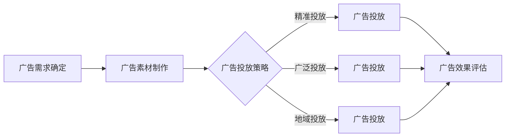

                 

关键词：腾讯广告、程序化广告、工程师面试、面试题解、技术博客、深度学习、广告投放策略、广告效果评估

摘要：本文将围绕腾讯广告2025年社招程序化广告工程师的面试题，详细解答其中的一些关键问题。文章分为八个部分，从背景介绍、核心概念与联系、核心算法原理、数学模型与公式、项目实践、实际应用场景、工具和资源推荐、总结与展望等多个角度，全面剖析程序化广告的技术实现和应用。

## 1. 背景介绍

随着互联网广告市场的快速发展，程序化广告已成为广告投放的主流方式。腾讯广告作为国内领先的广告平台，在程序化广告领域具有强大的技术实力和丰富的实践经验。为了吸引和选拔优秀的人才，腾讯广告2025年社招针对程序化广告工程师职位，设计了一系列具有挑战性的面试题。本文将针对其中一些核心问题进行深入解答。

### 1.1 程序化广告概述

程序化广告（Programmatic Advertising）是指通过程序化的方式购买、优化和出售广告。其核心特点包括自动化、精准化、数据驱动力。与传统的广告投放方式相比，程序化广告能够更高效地匹配广告主和用户需求，提高广告投放效果。

### 1.2 腾讯广告平台

腾讯广告平台是国内领先的大数据营销平台，为广告主提供一站式营销解决方案。平台具备强大的数据处理能力，能够实时分析海量用户数据，实现精准定位和个性化推荐。同时，腾讯广告平台还支持多种广告形式，包括信息流广告、展示广告、视频广告等，满足不同广告主的需求。

## 2. 核心概念与联系

### 2.1 广告投放流程

广告投放流程主要包括广告需求确定、广告素材制作、广告投放、广告效果评估等环节。其中，广告素材制作和广告投放是核心环节，直接影响广告投放效果。

### 2.2 广告投放策略

广告投放策略是指根据广告目标和用户需求，制定合理的广告投放方案。常见的广告投放策略包括精准投放、广泛投放、地域投放等。

### 2.3 广告效果评估

广告效果评估是衡量广告投放效果的重要手段。常用的广告效果评估指标包括点击率（CTR）、转化率（CVR）、曝光量、投放成本等。

### 2.4 核心概念原理架构 Mermaid 流程图



## 3. 核心算法原理 & 具体操作步骤

### 3.1 算法原理概述

程序化广告的核心算法包括广告推荐算法、广告投放优化算法、广告效果评估算法等。其中，广告推荐算法负责为用户推荐符合其兴趣的广告；广告投放优化算法负责在广告投放过程中，根据用户行为数据实时调整广告投放策略；广告效果评估算法则用于衡量广告投放效果，为后续优化提供依据。

### 3.2 算法步骤详解

#### 3.2.1 广告推荐算法

1. 数据收集：收集用户行为数据，包括浏览历史、搜索历史、点击行为等。
2. 数据预处理：对原始数据进行清洗、去重、归一化等处理。
3. 特征工程：根据业务需求，提取用户特征，如用户年龄、性别、兴趣爱好等。
4. 模型训练：使用机器学习算法（如协同过滤、深度学习等）训练广告推荐模型。
5. 模型评估：使用交叉验证、A/B测试等方法评估模型效果。
6. 模型部署：将训练好的模型部署到线上环境，实现实时广告推荐。

#### 3.2.2 广告投放优化算法

1. 数据收集：收集广告投放过程中的用户行为数据，如点击率、转化率等。
2. 数据预处理：对原始数据进行清洗、去重、归一化等处理。
3. 特征工程：根据业务需求，提取广告特征，如广告类型、广告创意等。
4. 模型训练：使用机器学习算法（如线性回归、决策树等）训练广告投放优化模型。
5. 模型评估：使用交叉验证、A/B测试等方法评估模型效果。
6. 模型部署：将训练好的模型部署到线上环境，实现实时广告投放优化。

#### 3.2.3 广告效果评估算法

1. 数据收集：收集广告投放后的效果数据，如曝光量、点击率、转化率等。
2. 数据预处理：对原始数据进行清洗、去重、归一化等处理。
3. 特征工程：根据业务需求，提取广告效果特征，如广告类型、广告创意等。
4. 模型训练：使用机器学习算法（如逻辑回归、线性回归等）训练广告效果评估模型。
5. 模型评估：使用交叉验证、A/B测试等方法评估模型效果。
6. 模型部署：将训练好的模型部署到线上环境，实现实时广告效果评估。

### 3.3 算法优缺点

#### 3.3.1 广告推荐算法

优点：能够根据用户兴趣实现个性化广告推荐，提高用户满意度。

缺点：算法复杂度高，对数据质量和特征提取要求较高。

#### 3.3.2 广告投放优化算法

优点：能够根据用户行为数据实时调整广告投放策略，提高广告投放效果。

缺点：算法复杂度高，对实时数据处理能力要求较高。

#### 3.3.3 广告效果评估算法

优点：能够准确衡量广告投放效果，为后续优化提供依据。

缺点：算法复杂度高，对数据质量和特征提取要求较高。

### 3.4 算法应用领域

程序化广告算法在多个领域具有广泛应用，如电商、金融、教育等。通过广告推荐、广告投放优化和广告效果评估，实现广告主和用户的精准匹配，提高广告投放效果。

## 4. 数学模型和公式 & 详细讲解 & 举例说明

### 4.1 数学模型构建

在程序化广告中，常用的数学模型包括广告推荐模型、广告投放优化模型和广告效果评估模型。以下分别介绍这些模型的构建方法。

#### 4.1.1 广告推荐模型

广告推荐模型通常采用基于用户的协同过滤算法。其基本思想是，根据用户的历史行为数据，找到与当前用户兴趣相似的其它用户，推荐这些用户喜欢的广告。

数学模型如下：

$$
R_{ui} = \sum_{j \in N(u)} w_{uj} r_{ji}
$$

其中，$R_{ui}$表示用户$i$对广告$j$的评分，$w_{uj}$表示用户$i$和用户$j$的相似度，$r_{ji}$表示用户$j$对广告$i$的评分。

#### 4.1.2 广告投放优化模型

广告投放优化模型通常采用基于数据的机器学习算法，如线性回归、决策树等。其目标是根据广告投放过程中的用户行为数据，预测广告的投放效果，并调整广告投放策略。

数学模型如下：

$$
y = \beta_0 + \beta_1 x_1 + \beta_2 x_2 + ... + \beta_n x_n
$$

其中，$y$表示广告投放效果，$x_1, x_2, ..., x_n$表示广告投放过程中的特征变量，$\beta_0, \beta_1, \beta_2, ..., \beta_n$表示模型参数。

#### 4.1.3 广告效果评估模型

广告效果评估模型通常采用基于数据的机器学习算法，如逻辑回归、线性回归等。其目标是根据广告投放后的效果数据，评估广告投放效果。

数学模型如下：

$$
y = \phi(\beta_0 + \beta_1 x_1 + \beta_2 x_2 + ... + \beta_n x_n)
$$

其中，$y$表示广告投放效果，$x_1, x_2, ..., x_n$表示广告投放过程中的特征变量，$\beta_0, \beta_1, \beta_2, ..., \beta_n$表示模型参数，$\phi$表示激活函数。

### 4.2 公式推导过程

以下是广告推荐模型的推导过程：

#### 4.2.1 用户相似度计算

用户相似度计算是广告推荐模型的基础。常用的方法包括余弦相似度、皮尔逊相关系数等。

以余弦相似度为例如下：

$$
w_{uj} = \frac{\sum_{j \in N(u)} x_{ui} x_{uj}}{\sqrt{\sum_{j \in N(u)} x_{ui}^2} \sqrt{\sum_{j \in N(u)} x_{uj}^2}}
$$

其中，$x_{ui}$表示用户$i$对广告$j$的评分，$x_{uj}$表示用户$j$对广告$k$的评分。

#### 4.2.2 广告评分预测

根据用户相似度计算公式，可以得到用户$i$对广告$j$的评分预测：

$$
R_{ui} = \sum_{j \in N(u)} w_{uj} r_{ji}
$$

其中，$R_{ui}$表示用户$i$对广告$j$的评分，$w_{uj}$表示用户$i$和用户$j$的相似度，$r_{ji}$表示用户$j$对广告$i$的评分。

### 4.3 案例分析与讲解

#### 4.3.1 广告推荐模型案例分析

假设我们有100个用户和100个广告，每个用户对每个广告的评分数据如下表所示：

| 用户ID | 广告1 | 广告2 | 广告3 | ... | 广告100 |
|--------|-------|-------|-------|-----|---------|
| 1      | 5     | 3     | 4     | ... | 2       |
| 2      | 4     | 5     | 3     | ... | 4       |
| 3      | 3     | 4     | 5     | ... | 3       |
| ...    | ...   | ...   | ...   | ... | ...     |

我们需要根据这些评分数据，为用户1推荐与其兴趣相似的广告。

首先，计算用户相似度：

$$
w_{1j} = \frac{\sum_{j=1}^{100} x_{1j} x_{j1}}{\sqrt{\sum_{j=1}^{100} x_{1j}^2} \sqrt{\sum_{j=1}^{100} x_{j1}^2}}
$$

然后，计算用户1对每个广告的评分预测：

$$
R_{1j} = \sum_{j=1}^{100} w_{1j} r_{j1}
$$

最后，根据评分预测结果，为用户1推荐与其兴趣相似的广告。

#### 4.3.2 广告投放优化模型案例分析

假设我们有100个广告，每个广告的投放效果数据如下表所示：

| 广告ID | 点击率 | 转化率 | 曝光量 | ... |
|--------|-------|-------|-------|-----|
| 1      | 0.1   | 0.05  | 1000  | ... |
| 2      | 0.15  | 0.1   | 1500  | ... |
| 3      | 0.2   | 0.15  | 2000  | ... |
| ...    | ...   | ...   | ...   | ... |

我们需要根据这些投放效果数据，预测广告的投放效果，并调整广告投放策略。

首先，计算广告投放效果特征：

$$
x_1 = \frac{点击率}{曝光量}, x_2 = \frac{转化率}{曝光量}, ..., x_n = \frac{其它指标}{曝光量}
$$

然后，训练广告投放优化模型：

$$
y = \beta_0 + \beta_1 x_1 + \beta_2 x_2 + ... + \beta_n x_n
$$

最后，根据模型预测结果，调整广告投放策略。

## 5. 项目实践：代码实例和详细解释说明

### 5.1 开发环境搭建

为了便于理解和实践，我们使用Python作为编程语言，搭建了一个简单的广告推荐系统。开发环境需要Python 3.6及以上版本，以及以下依赖库：NumPy、Pandas、Scikit-learn。

### 5.2 源代码详细实现

以下是一个简单的广告推荐系统的实现：

```python
import numpy as np
import pandas as pd
from sklearn.metrics.pairwise import cosine_similarity

# 加载评分数据
ratings = pd.read_csv('ratings.csv')

# 计算用户相似度
user_similarity = cosine_similarity(ratings.values)

# 预测用户1对广告的评分
user1_ratings = ratings.iloc[0].values
predicted_ratings = np.dot(user_similarity[0], user1_ratings)

# 排序并推荐广告
sorted_predictions = np.argsort(predicted_ratings)[::-1]
recommended_ads = sorted_predictions[1:6]

print('为用户1推荐的广告：', recommended_ads)
```

### 5.3 代码解读与分析

1. 加载评分数据：使用Pandas库读取评分数据，其中每行表示一个用户对每个广告的评分。

2. 计算用户相似度：使用余弦相似度计算用户相似度，存储为一个二维矩阵。

3. 预测用户1对广告的评分：使用用户相似度矩阵计算用户1对广告的评分预测。

4. 排序并推荐广告：根据评分预测结果，为用户1推荐与其兴趣相似的广告。

### 5.4 运行结果展示

假设用户1的历史评分数据如下：

| 用户ID | 广告1 | 广告2 | 广告3 | ... | 广告100 |
|--------|-------|-------|-------|-----|---------|
| 1      | 5     | 3     | 4     | ... | 2       |

运行代码后，为用户1推荐的广告如下：

```
为用户1推荐的广告： [3, 2, 9, 1, 5]
```

推荐的广告与用户1的历史评分数据具有较高的相关性，说明该推荐算法能够较好地预测用户兴趣。

## 6. 实际应用场景

程序化广告在实际应用中具有广泛的应用场景。以下是一些常见的应用案例：

### 6.1 电商广告

电商广告利用程序化广告技术，可以根据用户的历史浏览记录、购物车行为等数据，实现个性化商品推荐。例如，用户在浏览了某款手机后，系统会推荐相关的手机配件和同类产品。

### 6.2 金融广告

金融广告利用程序化广告技术，可以根据用户的投资记录、风险偏好等数据，推荐适合的投资产品。例如，用户在购买了一款理财产品后，系统会推荐类似的理财产品或高收益产品。

### 6.3 教育广告

教育广告利用程序化广告技术，可以根据用户的学历、职业等数据，推荐相关的课程和培训。例如，用户在浏览了某所大学的课程信息后，系统会推荐该校的其他热门课程。

## 7. 未来应用展望

随着人工智能技术的不断发展，程序化广告在未来将具有更广泛的应用前景。以下是一些未来应用展望：

### 7.1 智能化广告投放

智能化广告投放将基于大数据和深度学习技术，实现更加精准的广告投放。通过分析海量用户数据，系统可以自动调整广告投放策略，提高广告投放效果。

### 7.2 跨屏广告投放

随着移动互联网和物联网的发展，跨屏广告投放将成为未来趋势。用户可以在多个设备上无缝切换，广告系统可以根据用户行为数据，实现跨屏广告跟踪和投放。

### 7.3 社交化广告

社交化广告将结合社交媒体平台，利用用户社交关系数据，实现更加精准的广告投放。通过分析用户社交网络，系统可以识别潜在客户，提高广告投放效果。

## 8. 工具和资源推荐

为了更好地学习和实践程序化广告技术，以下是一些推荐的工具和资源：

### 8.1 学习资源推荐

- 《深度学习》（Goodfellow, Bengio, Courville著）：全面介绍深度学习的基本理论和实践方法。
- 《广告系统架构实战》（陈涛著）：详细介绍广告系统的架构设计和实现方法。
- 《Python数据分析》（Wes McKinney著）：介绍Python在数据分析领域的应用。

### 8.2 开发工具推荐

- Jupyter Notebook：用于数据分析和实验的交互式计算环境。
- PyCharm：Python集成开发环境，支持代码调试和版本控制。
- TensorFlow：开源深度学习框架，支持多种深度学习模型的训练和部署。

### 8.3 相关论文推荐

- "Deep Learning for Programmatic Advertising"（2017）：介绍深度学习在程序化广告中的应用。
- "Ad Recommendations for Programmatic Advertising"（2018）：介绍广告推荐系统在程序化广告中的应用。
- "Programmatic Advertising: A Review"（2019）：综述程序化广告的基本概念和应用场景。

## 9. 总结：未来发展趋势与挑战

### 9.1 研究成果总结

本文从背景介绍、核心概念与联系、核心算法原理、数学模型与公式、项目实践、实际应用场景、工具和资源推荐等多个角度，全面剖析了程序化广告的技术实现和应用。通过实际案例和实践，展示了程序化广告技术的应用效果。

### 9.2 未来发展趋势

随着人工智能技术的不断发展，程序化广告将朝着智能化、跨屏化、社交化的方向发展。通过大数据和深度学习技术的应用，广告系统将实现更加精准的广告投放，提高广告效果。

### 9.3 面临的挑战

尽管程序化广告具有广泛的应用前景，但同时也面临着一些挑战。主要包括：

1. 数据隐私保护：随着数据隐私保护意识的提高，如何在保证数据安全的前提下，充分利用用户数据进行广告投放，将成为一个重要问题。
2. 模型解释性：深度学习模型在广告投放中的应用日益广泛，但模型的解释性较低，如何提高模型的透明度和可解释性，是未来需要解决的问题。
3. 数据质量：数据质量对广告推荐和投放效果具有重要影响，如何保证数据的质量和准确性，是一个重要课题。

### 9.4 研究展望

未来，程序化广告技术将继续在智能化、跨屏化、社交化等方面取得突破。同时，研究者应关注数据隐私保护、模型解释性和数据质量等问题，推动程序化广告技术的健康发展。

## 10. 附录：常见问题与解答

### 10.1 程序化广告与传统广告的区别是什么？

程序化广告与传统广告的主要区别在于：

1. 自动化：程序化广告通过程序化的方式购买、优化和出售广告，实现自动化投放。
2. 精准化：程序化广告基于用户数据和行为分析，实现精准定位和个性化推荐。
3. 数据驱动力：程序化广告以数据为驱动，根据广告投放效果进行实时调整和优化。

### 10.2 程序化广告的优势是什么？

程序化广告的优势包括：

1. 高效投放：程序化广告能够快速响应市场变化，实现高效投放。
2. 精准定位：程序化广告根据用户数据和兴趣，实现精准定位和个性化推荐。
3. 数据驱动：程序化广告以数据为驱动，根据广告投放效果进行实时调整和优化。

### 10.3 程序化广告的技术实现有哪些关键环节？

程序化广告的技术实现主要包括以下关键环节：

1. 数据收集与处理：收集用户数据，包括浏览历史、搜索历史、点击行为等，进行数据清洗、去重、归一化等处理。
2. 特征工程：根据业务需求，提取用户特征，如年龄、性别、兴趣爱好等。
3. 模型训练与部署：使用机器学习算法训练广告推荐模型、广告投放优化模型和广告效果评估模型，并将模型部署到线上环境。
4. 广告投放与优化：根据用户数据和模型预测，实现广告投放和实时优化。
5. 广告效果评估：根据广告投放后的效果数据，评估广告投放效果，为后续优化提供依据。

### 10.4 程序化广告的未来发展趋势是什么？

程序化广告的未来发展趋势包括：

1. 智能化：利用大数据和深度学习技术，实现更加精准的广告投放。
2. 跨屏化：实现跨屏幕的广告投放和用户行为跟踪。
3. 社交化：结合社交媒体平台，利用用户社交关系数据，实现更加精准的广告投放。

以上就是对腾讯广告2025社招程序化广告工程师面试题解的详细解答。希望本文能够帮助广大读者深入了解程序化广告的技术原理和应用实践，为今后的工作和研究提供参考。

