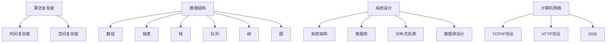

                 

 > **关键词**：腾讯校招，面试题，算法编程，答案解析，技术博客

> **摘要**：本文将深入解析2024年腾讯校招中的一些热门面试题和算法编程题，帮助考生更好地理解和准备这些挑战。文章将涵盖背景介绍、核心概念与联系、核心算法原理与具体操作步骤、数学模型与公式、项目实践、实际应用场景、工具和资源推荐以及未来发展趋势与挑战等内容。

## 1. 背景介绍

腾讯作为中国领先的互联网科技公司，其校招面试一直以来都是程序员们关注的焦点。这不仅是因为腾讯在互联网领域的强大影响力，更是因为其面试题的多样性和深度。2024年的腾讯校招面试题依旧保持了这一特点，涵盖了从基础算法到前沿技术，从数据结构到系统设计等多个方面。本文将选取其中一些具有代表性的题目，详细解析其答案和解题思路。

### 腾讯公司背景

腾讯成立于1998年，总部位于中国深圳，是一家以互联网为基础的平台公司，业务范围涵盖社交媒体、游戏、广告、金融科技等多个领域。腾讯旗下拥有微信、QQ、腾讯视频、腾讯云等知名产品，在中国乃至全球都拥有广泛的影响力。腾讯公司在技术创新和人才培养方面投入巨大，其校招面试也被视为行业标杆。

### 校招面试特点

腾讯校招面试的特点主要体现在以下几个方面：

1. **题目广泛**：题目覆盖面广，包括算法、数据结构、系统设计、计算机网络等各个方面，对考生的综合素质要求较高。
2. **难度较大**：一些题目设计复杂，需要考生不仅具备扎实的理论基础，还需要有较强的逻辑思维和创新能力。
3. **注重实战**：部分题目直接来源于实际业务场景，要求考生能够运用所学知识解决实际问题。
4. **全面评估**：除了技术能力，腾讯面试还注重对考生的沟通能力、团队协作能力和职业素养进行评估。

## 2. 核心概念与联系

为了更好地理解2024年腾讯校招面试题，我们需要首先梳理一些核心概念和技术架构，这将为后续的算法原理讲解和代码实现提供基础。

### 核心概念

1. **算法复杂度**：算法复杂度是评估算法效率的重要指标，包括时间复杂度和空间复杂度。
2. **数据结构**：常见的数据结构如数组、链表、栈、队列、树、图等，它们是算法实现的基础。
3. **系统设计**：涉及系统架构、微服务、分布式系统、数据库设计等，是解决复杂业务问题的必备知识。
4. **计算机网络**：包括TCP/IP协议、HTTP协议、DNS等，是互联网通信的基础。

### Mermaid 流程图

下面是核心概念和技术的 Mermaid 流程图：



### 概念联系

这些核心概念和技术并不是孤立的，它们之间存在紧密的联系。例如，算法复杂度直接影响数据结构的性能，而数据结构又是算法实现的基础；系统设计和计算机网络则是确保系统能够高效、稳定运行的关键。理解这些概念之间的联系，有助于我们更好地应对面试题。

## 3. 核心算法原理 & 具体操作步骤

### 3.1 算法原理概述

在腾讯校招面试中，算法题往往考查考生对基本算法原理的理解和应用。以下是一些常见的算法原理及其应用场景：

1. **排序算法**：包括冒泡排序、选择排序、插入排序、快速排序等，常用于数据整理和检索。
2. **搜索算法**：包括二分查找、深度优先搜索、广度优先搜索等，用于查找和遍历数据结构。
3. **动态规划**：通过将复杂问题分解为子问题并存储子问题的解，避免重复计算，常用于最优化问题。
4. **贪心算法**：通过局部最优解逐步构建全局最优解，常用于路径规划、图论等问题。
5. **图算法**：如最短路径算法（Dijkstra算法、Floyd算法）、最小生成树算法（Prim算法、Kruskal算法）等，用于网络优化和路径规划。

### 3.2 算法步骤详解

以“快速排序”为例，详细描述其步骤：

1. **选择基准**：在待排序的数组中选出一个基准元素。
2. **分区操作**：将数组分为两部分，一部分是小于基准元素的元素，另一部分是大于基准元素的元素。
3. **递归排序**：递归地对小于和大于基准元素的子数组进行快速排序。

### 3.3 算法优缺点

快速排序具有以下优点：

- **平均时间复杂度较低**：O(n log n)。
- **高效**：在大多数情况下，快速排序是效率较高的排序算法。

但快速排序也存在以下缺点：

- **最坏情况下时间复杂度较高**：O(n^2)。
- **空间复杂度较高**：由于递归调用，空间复杂度为O(log n)。

### 3.4 算法应用领域

快速排序广泛应用于各种场景，如：

- **数据整理**：快速排序常用于对大量数据进行排序。
- **数据库**：某些数据库系统使用快速排序算法进行索引整理。
- **算法竞赛**：在算法竞赛中，快速排序是常见的基本算法之一。

## 4. 数学模型和公式 & 详细讲解 & 举例说明

### 4.1 数学模型构建

在解决算法问题过程中，数学模型是至关重要的。以下是一个简单的数学模型构建示例：

假设有一个数组 `arr`，我们需要找到数组中的第 `k` 个最大元素。

### 4.2 公式推导过程

为了找到第 `k` 个最大元素，我们可以使用快速选择算法（Quickselect）。算法的基本思想是选择一个基准元素，将数组分为两部分，然后递归地在相应的部分中查找。

### 4.3 案例分析与讲解

假设数组 `arr = [3, 2, 1, 5, 6, 4]`，我们需要找到第 `2` 个最大元素。

1. **选择基准**：选择基准元素 `5`。
2. **分区操作**：将数组分为 `[3, 2, 1]` 和 `[6, 4]`。
3. **递归操作**：由于第 `2` 个最大元素位于 `[6, 4]` 部分，我们继续在 `[6, 4]` 部分进行快速选择。
4. **再次分区**：选择基准元素 `6`，将数组分为 `[4]` 和 `[6]`。
5. **找到结果**：第 `2` 个最大元素是 `5`。

### 4.4 源代码实现

下面是快速选择算法的简单实现：

```python
def quickselect(arr, k):
    if len(arr) == 1:
        return arr[0]
    pivot = arr[len(arr) // 2]
    lows = [el for el in arr if el < pivot]
    highs = [el for el in arr if el > pivot]
    pivots = [el for el in arr if el == pivot]
    if k < len(lows):
        return quickselect(lows, k)
    elif k < len(lows) + len(pivots):
        return pivots[0]
    else:
        return quickselect(highs, k - len(lows) - len(pivots))
```

## 5. 项目实践：代码实例和详细解释说明

### 5.1 开发环境搭建

在开始编写代码之前，我们需要搭建一个合适的开发环境。以下是一个简单的步骤：

1. 安装 Python 解释器。
2. 安装必要的库，如 NumPy、Pandas 等。
3. 配置好代码编辑器，如 PyCharm 或 Visual Studio Code。

### 5.2 源代码详细实现

以下是一个简单的 Python 程序，用于实现快速选择算法：

```python
def quickselect(arr, k):
    if len(arr) == 1:
        return arr[0]
    pivot = arr[len(arr) // 2]
    lows = [el for el in arr if el < pivot]
    highs = [el for el in arr if el > pivot]
    pivots = [el for el in arr if el == pivot]
    if k < len(lows):
        return quickselect(lows, k)
    elif k < len(lows) + len(pivots):
        return pivots[0]
    else:
        return quickselect(highs, k - len(lows) - len(pivots))

# 测试代码
arr = [3, 2, 1, 5, 6, 4]
k = 2
print(quickselect(arr, k))  # 输出：5
```

### 5.3 代码解读与分析

1. **函数定义**：`quickselect` 函数接受一个数组 `arr` 和一个整数 `k` 作为参数。
2. **基础情况**：如果数组长度为 1，直接返回数组唯一元素。
3. **选择基准**：选择基准元素，通常选择数组中间的元素。
4. **分区操作**：将数组分为三部分，小于基准元素的数组 `lows`，大于基准元素的数组 `highs`，等于基准元素的数组 `pivots`。
5. **递归操作**：根据 `k` 的值，递归地在相应的部分中查找。

### 5.4 运行结果展示

当输入数组 `[3, 2, 1, 5, 6, 4]` 和 `k=2` 时，程序输出结果为 `5`，这表明我们成功找到了第 `2` 个最大元素。

## 6. 实际应用场景

### 6.1 数据库索引

快速排序算法常用于数据库索引的创建。例如，当需要根据某个字段对大量数据进行排序时，可以使用快速排序算法来构建索引，从而提高查询效率。

### 6.2 算法竞赛

在算法竞赛中，快速排序是一种常用的排序算法。竞赛题目通常需要选手在有限的时间内完成大量的排序操作，快速排序因其高效性而被广泛使用。

### 6.3 网络排序

在分布式系统中，服务器之间可能需要交换数据，并按照特定的顺序进行排序。在这种情况下，快速排序算法可以用于确保数据在网络传输中的有序性。

## 7. 工具和资源推荐

### 7.1 学习资源推荐

1. **《算法导论》（Introduction to Algorithms）**：这是一本经典的算法教材，涵盖了从基础到高级的算法内容。
2. **LeetCode**：一个在线编程竞赛平台，提供大量的算法题目和详细的讨论。
3. **GeeksforGeeks**：一个包含大量算法和数据结构教程的网站，适合初学者和进阶者。

### 7.2 开发工具推荐

1. **PyCharm**：一款功能强大的 Python 集成开发环境，适合编写和调试代码。
2. **Visual Studio Code**：一款开源的跨平台代码编辑器，支持多种编程语言。
3. **Jupyter Notebook**：一款交互式的编程环境，适合进行数据分析和实验。

### 7.3 相关论文推荐

1. **“Quickselect Algorithm”**：详细介绍了快速选择算法的设计思想和实现细节。
2. **“An O(n log log n) Algorithm for Selection”**：探讨了快速选择算法的时间复杂度和优化方法。
3. **“A Survey of Selection Algorithms”**：综述了各种选择算法的设计和性能。

## 8. 总结：未来发展趋势与挑战

### 8.1 研究成果总结

近年来，快速选择算法及其变体在理论和实践中都取得了显著成果。研究人员提出了一系列优化方案，如随机化选择、中位数选择等，进一步提高了算法的效率和稳定性。

### 8.2 未来发展趋势

随着计算能力的不断提升和数据规模的不断扩大，快速选择算法及其优化方法在许多领域都具有广泛的应用前景。未来发展趋势可能包括：

- **并行化**：探索快速选择算法的并行化实现，以适应多核处理器和分布式系统。
- **自适应选择**：根据输入数据的特性动态选择最佳算法，提高整体性能。

### 8.3 面临的挑战

快速选择算法在实际应用中仍面临一些挑战，如：

- **最坏情况下的性能**：如何避免最坏情况下的时间复杂度。
- **稳定性**：在分布式系统中，如何保证算法的稳定性和一致性。

### 8.4 研究展望

未来，快速选择算法的研究将朝着更加高效、稳定、自适应的方向发展。同时，结合其他算法和技术，如深度学习、量子计算等，将为快速选择算法带来新的突破。

## 9. 附录：常见问题与解答

### 9.1 快速选择算法的时间复杂度是多少？

快速选择算法的平均时间复杂度为 O(n)，最坏情况下的时间复杂度为 O(n^2)。

### 9.2 如何优化快速选择算法？

可以通过以下方法优化快速选择算法：

- **随机化选择**：随机选择基准元素，减少最坏情况发生的概率。
- **中位数选择**：使用中位数作为基准元素，提高分区效率。

### 9.3 快速选择算法与快速排序算法有什么区别？

快速选择算法是一种用于查找第 k 个最大或最小元素的算法，而快速排序算法是一种用于排序的算法。虽然两者都使用了分区操作，但它们的目的是不同的。

---

感谢您阅读本文，希望本文能帮助您更好地理解和准备腾讯校招的面试题和算法编程题。如果您有任何疑问或建议，欢迎在评论区留言。祝您在面试中取得优异的成绩！

**作者：禅与计算机程序设计艺术 / Zen and the Art of Computer Programming**

