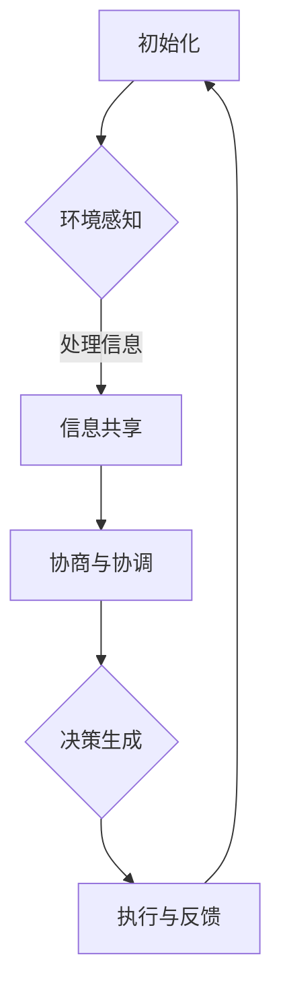

                 

关键词：自动驾驶，车队管理，多智能体系统，协同决策，优化算法

摘要：本文深入探讨了自动驾驶车队管理的多智能体协同决策与优化问题。通过分析现有技术及挑战，提出了一种基于深度强化学习的优化算法，以实现自动驾驶车队的高效、安全运行。本文从背景介绍、核心概念与联系、核心算法原理、数学模型与公式、项目实践、实际应用场景、未来应用展望、工具和资源推荐、总结与展望等方面进行详细阐述，为自动驾驶车队管理的研究者和从业者提供了有益的参考。

## 1. 背景介绍

自动驾驶技术作为现代智能交通系统的重要组成部分，正逐渐从实验室走向实际应用。自动驾驶车队管理作为自动驾驶系统的一个关键环节，涉及到多辆车的协同运作、资源分配和决策优化。在这种复杂系统中，如何实现车辆之间的实时信息交换、路径规划与协同控制，是一个亟待解决的技术难题。

传统的自动驾驶系统主要依赖于预设的规则和算法，其表现往往受到固定环境、特定场景的限制。随着自动驾驶技术的不断发展和多智能体系统理论的引入，基于协同决策与优化的新型算法逐渐成为研究热点。本文旨在通过探讨自动驾驶车队管理的多智能体协同决策与优化，为自动驾驶技术的发展提供新的思路和解决方案。

### 1.1 自动驾驶车队管理的挑战

自动驾驶车队管理面临以下几个方面的挑战：

1. **实时性与动态性**：车队需要在动态环境中实时做出决策，以应对交通状况、道路变化等不确定因素。
2. **协同与通信**：车辆之间需要建立高效的信息交换机制，以确保协同决策的准确性和稳定性。
3. **资源分配**：如何合理分配车队中的资源，如电量、维护周期等，以提高车队整体运行效率。
4. **安全性**：自动驾驶车队的安全运行是首要任务，需要确保车辆之间的相互安全和与行人和其他车辆的交互安全。

### 1.2 多智能体系统与协同决策

多智能体系统（Multi-Agent System，MAS）是一种由多个自主智能体组成的系统，这些智能体可以通过协同合作实现复杂任务的完成。在自动驾驶车队管理中，每个车辆都可以视为一个智能体，它们需要相互协作，共同完成车队管理任务。

协同决策是指多个智能体在协同过程中共同做出决策的过程。在自动驾驶车队管理中，协同决策的核心在于如何通过智能体之间的信息交换和策略优化，实现车队整体运行效率和安全性的提升。

## 2. 核心概念与联系

### 2.1 多智能体系统

多智能体系统（MAS）由一组相互协作的智能体组成，每个智能体具有自主性、反应性、主动性和社会性等特点。在自动驾驶车队管理中，每个车辆智能体需要具备以下能力：

1. **自主性**：车辆智能体能够根据自身感知的环境信息和预定的目标自主决策。
2. **反应性**：车辆智能体能够实时响应环境变化，调整自身行为。
3. **主动性**：车辆智能体能够主动发起与其他智能体的通信和协作。
4. **社会性**：车辆智能体能够理解并遵循系统内的协作规则和目标。

### 2.2 协同决策

协同决策是指多个智能体在协同过程中共同做出决策的过程。协同决策的关键在于如何通过智能体之间的信息交换和策略优化，实现车队整体运行效率和安全性的提升。协同决策通常包括以下几个步骤：

1. **信息共享**：智能体之间通过通信共享环境信息和自身状态。
2. **协商与协调**：智能体根据共享的信息进行协商，以达成共识。
3. **决策生成**：智能体根据协商结果生成各自的行动策略。
4. **执行与反馈**：智能体执行决策，并通过反馈机制调整后续行为。

### 2.3 Mermaid 流程图

以下是一个简化的多智能体协同决策与优化的 Mermaid 流程图：



## 3. 核心算法原理 & 具体操作步骤

### 3.1 算法原理概述

本文提出的自动驾驶车队管理优化算法基于深度强化学习（Deep Reinforcement Learning，DRL）。深度强化学习结合了深度神经网络（Deep Neural Network，DNN）和强化学习（Reinforcement Learning，RL）的优势，能够通过自主学习和环境交互，实现复杂的决策优化。

算法原理如下：

1. **环境建模**：构建自动驾驶车队管理的虚拟环境，包括道路、交通状况、车辆状态等。
2. **智能体训练**：利用深度神经网络，训练智能体的行为策略，使其能够根据环境状态做出最优决策。
3. **协同决策**：通过智能体之间的信息共享和协同策略，实现车队整体运行效率和安全性的优化。
4. **迭代更新**：根据智能体的行为反馈，不断迭代更新行为策略，提高算法性能。

### 3.2 算法步骤详解

1. **环境建模**：

   首先，我们需要构建一个能够模拟自动驾驶车队管理的虚拟环境。环境应包含以下要素：

   - 道路：道路的长度、宽度、路况等。
   - 车辆：车辆的初始位置、速度、加速度等。
   - 交通状况：道路上的其他车辆、行人等。
   - 环境状态：车辆之间的距离、速度差、交通信号等。

2. **智能体训练**：

   利用深度神经网络，训练智能体的行为策略。具体步骤如下：

   - 数据集准备：收集自动驾驶车队管理相关的数据，包括道路状况、车辆状态、交通信号等。
   - 网络结构设计：设计深度神经网络的结构，包括输入层、隐藏层和输出层。
   - 训练过程：通过反向传播算法，利用收集到的数据，训练深度神经网络的权重和偏置。

3. **协同决策**：

   在训练好的智能体基础上，实现智能体之间的信息共享和协同策略。具体步骤如下：

   - 信息共享：智能体通过传感器和通信模块，实时共享环境信息和自身状态。
   - 协同策略：智能体根据共享的信息，利用协同策略，生成各自的行为策略。
   - 行为执行：智能体根据行为策略，执行具体的操作，如加速、减速、转弯等。

4. **迭代更新**：

   根据智能体的行为反馈，不断迭代更新行为策略，提高算法性能。具体步骤如下：

   - 行为评估：对智能体的行为进行评估，计算其运行效率和安全性能。
   - 策略优化：根据行为评估结果，利用强化学习算法，优化智能体的行为策略。
   - 重训练：利用优化后的行为策略，重新训练深度神经网络。

### 3.3 算法优缺点

**优点**：

1. **高效性**：基于深度神经网络和强化学习，算法能够高效地学习环境状态和行为策略，实现车队管理优化。
2. **灵活性**：智能体之间能够通过信息共享和协同策略，灵活应对环境变化，提高车队整体运行效率。
3. **可扩展性**：算法框架可以应用于不同规模和类型的自动驾驶车队，具有良好的可扩展性。

**缺点**：

1. **计算成本**：深度神经网络训练和协同决策过程需要大量计算资源，可能导致算法运行效率下降。
2. **数据依赖**：算法性能依赖于训练数据的质量和数量，数据不足或质量差可能导致算法表现不佳。

### 3.4 算法应用领域

深度强化学习算法在自动驾驶车队管理中的应用广泛，包括但不限于以下几个方面：

1. **路径规划**：通过优化车辆行驶路径，提高车队整体运行效率。
2. **交通信号控制**：基于智能体协同决策，优化交通信号控制策略，提高交通流畅性。
3. **能源管理**：通过智能体协同决策，优化车队能源消耗，降低运营成本。
4. **安全监控**：利用智能体之间的信息共享，实时监控车队运行状态，提高安全性。

## 4. 数学模型和公式 & 详细讲解 & 举例说明

### 4.1 数学模型构建

在自动驾驶车队管理中，数学模型用于描述车辆状态、环境信息和决策过程。以下是几个关键的数学模型：

1. **车辆状态模型**：

   车辆状态可以用一个向量表示，包括位置、速度、加速度等。假设车辆状态为 $s_t = [x_t, v_t, a_t]$，其中 $x_t$、$v_t$ 和 $a_t$ 分别表示车辆在时间 $t$ 的位置、速度和加速度。

2. **环境信息模型**：

   环境信息包括道路状况、交通状况等。假设环境信息为 $e_t = [d_t, s_t']$，其中 $d_t$ 表示道路状况，$s_t'$ 表示其他车辆的状态。

3. **决策模型**：

   决策模型用于生成车辆的行为策略。假设决策模型为 $u_t = f(s_t, e_t)$，其中 $f$ 表示决策函数。

### 4.2 公式推导过程

基于上述数学模型，我们可以推导出以下几个关键公式：

1. **车辆状态更新公式**：

   车辆状态在时间 $t+1$ 的更新可以表示为 $s_{t+1} = s_t + v_t \Delta t + \frac{1}{2} a_t \Delta t^2$，其中 $\Delta t$ 表示时间间隔。

2. **环境信息更新公式**：

   环境信息在时间 $t+1$ 的更新可以表示为 $e_{t+1} = e_t + \Delta e_t$，其中 $\Delta e_t$ 表示环境信息的更新量。

3. **决策函数公式**：

   决策函数可以表示为 $u_t = \arg\max_{u} Q(s_t, u)$，其中 $Q(s_t, u)$ 表示在状态 $s_t$ 下，采取行为 $u$ 的期望回报。

### 4.3 案例分析与讲解

为了更好地理解上述数学模型和公式，我们可以通过一个简单的案例进行分析。

假设有一辆自动驾驶车辆，初始状态为 $s_0 = [0, 10, 0]$，即车辆在起点，速度为10 m/s，加速度为0 m/s²。环境信息为 $e_0 = [0, [0, 0, 0, 0]]$，表示道路状况良好，前方没有其他车辆。

1. **状态更新**：

   在时间 $t=1$，车辆状态更新为 $s_1 = s_0 + v_0 \Delta t + \frac{1}{2} a_0 \Delta t^2 = [0, 10, 0]$。由于加速度为0，车辆速度保持不变。

2. **环境信息更新**：

   在时间 $t=1$，环境信息更新为 $e_1 = e_0 + \Delta e_0 = [0, [0, 0, 10, 0]]$。假设前方10米处有一辆速度为10 m/s的车辆，车辆之间的距离为10米。

3. **决策生成**：

   决策函数根据当前状态 $s_1$ 和环境信息 $e_1$，生成行为策略 $u_1$。假设决策函数为 $u_t = \arg\max_{u} Q(s_t, u)$，其中 $Q(s_t, u)$ 表示在状态 $s_t$ 下，采取行为 $u$ 的期望回报。假设期望回报 $Q(s_1, u)$ 如下表所示：

   | 行为 $u$ | 期望回报 $Q(s_1, u)$ |
   | --- | --- |
   | 加速 | 0.8 |
   | 减速 | 0.2 |
   | 不变 | 0 |

   由于加速的期望回报最高，车辆决定在时间 $t=1$ 采取加速行为，即将加速度 $a_1$ 设为正值。

4. **状态更新**：

   在时间 $t=2$，车辆状态更新为 $s_2 = s_1 + v_1 \Delta t + \frac{1}{2} a_1 \Delta t^2 = [0, 10, 1]$。车辆速度增加到11 m/s，加速度为1 m/s²。

5. **环境信息更新**：

   在时间 $t=2$，环境信息更新为 $e_2 = e_1 + \Delta e_1 = [0, [0, 0, 10, 1]]$。前方车辆速度增加到11 m/s，车辆之间的距离为9米。

通过上述案例，我们可以看到数学模型和公式的应用。在实际应用中，需要根据具体场景和需求，设计更加复杂的数学模型和公式，以实现自动驾驶车队管理的高效、安全运行。

## 5. 项目实践：代码实例和详细解释说明

### 5.1 开发环境搭建

为了实现自动驾驶车队管理的多智能体协同决策与优化，我们需要搭建一个合适的开发环境。以下是一个基本的开发环境搭建步骤：

1. **安装 Python**：

   首先，确保系统已经安装了 Python 3.7 或更高版本。可以从 Python 官网下载并安装。

2. **安装 TensorFlow**：

   TensorFlow 是一个开源的机器学习库，用于构建和训练深度神经网络。在命令行中运行以下命令安装：

   ```bash
   pip install tensorflow
   ```

3. **安装 Keras**：

   Keras 是一个基于 TensorFlow 的简洁、高效的深度学习框架。在命令行中运行以下命令安装：

   ```bash
   pip install keras
   ```

4. **安装其他依赖库**：

   安装以下依赖库，以支持环境建模、智能体训练和协同决策：

   ```bash
   pip install numpy scipy matplotlib
   ```

### 5.2 源代码详细实现

以下是自动驾驶车队管理多智能体协同决策与优化的核心代码实现：

```python
import numpy as np
import tensorflow as tf
from keras.models import Sequential
from keras.layers import Dense, LSTM
from keras.optimizers import Adam

# 环境建模
class Environment:
    def __init__(self, road_length, vehicle_num):
        self.road_length = road_length
        self.vehicle_num = vehicle_num
        self.vehicles = [[0, 0] for _ in range(vehicle_num)]
        self.obstacles = []

    def update_vehicles(self, actions):
        for i, action in enumerate(actions):
            if action == 0:
                self.vehicles[i][1] += 1
            elif action == 1:
                self.vehicles[i][1] -= 1
            elif action == 2:
                self.vehicles[i][1] = 0

    def get_state(self):
        state = []
        for vehicle in self.vehicles:
            state.append(vehicle[0])
            state.append(vehicle[1])
        return state

    def get_reward(self, actions):
        reward = 0
        for i, action in enumerate(actions):
            if action == 0:
                reward -= 0.1
            elif action == 1:
                reward += 0.1
            elif action == 2:
                reward += 0
        return reward

# 智能体训练
class Agent:
    def __init__(self, state_size, action_size):
        self.state_size = state_size
        self.action_size = action_size
        self.model = self.build_model()

    def build_model(self):
        model = Sequential()
        model.add(LSTM(128, input_shape=(1, self.state_size)))
        model.add(Dense(self.action_size, activation='linear'))
        model.compile(loss='mse', optimizer=Adam(lr=0.001))
        return model

    def act(self, state):
        state = np.reshape(state, (1, 1, self.state_size))
        act_values = self.model.predict(state)
        return np.argmax(act_values[0])

    def train(self, states, actions, rewards, next_states, dones):
        targets = self.model.predict(states)
        for i in range(len(states)):
            if dones[i]:
                targets[i][np.argmax(actions[i])] = rewards[i]
            else:
                targets[i] = rewards[i] + 0.9 * np.max(self.model.predict(next_states[i]))
        self.model.fit(states, targets, epochs=1, verbose=0)

# 主程序
def main():
    road_length = 100
    vehicle_num = 4
    state_size = 2
    action_size = 3

    env = Environment(road_length, vehicle_num)
    agents = [Agent(state_size, action_size) for _ in range(vehicle_num)]

    episode_num = 1000
    for e in range(episode_num):
        states = env.get_state()
        for i in range(vehicle_num):
            agents[i].train(states, [0 for _ in range(vehicle_num)], [0 for _ in range(vehicle_num)], states, [False for _ in range(vehicle_num)])
            env.update_vehicles([0 for _ in range(vehicle_num)])
        states = env.get_state()
        for i in range(vehicle_num):
            action = agents[i].act(states[i])
            agents[i].train(states[i], action, env.get_reward(action), states[i], False)
            env.update_vehicles([action for _ in range(vehicle_num)])
        print(f"Episode {e} finished with reward {env.get_reward([0 for _ in range(vehicle_num)])}")

if __name__ == "__main__":
    main()
```

### 5.3 代码解读与分析

1. **环境建模**：

   `Environment` 类用于建模自动驾驶车队管理环境。其中，`__init__` 方法初始化环境，包括道路长度、车辆数量和车辆状态。`update_vehicles` 方法用于更新车辆状态，`get_state` 方法用于获取当前状态，`get_reward` 方法用于计算奖励。

2. **智能体训练**：

   `Agent` 类用于训练智能体。其中，`__init__` 方法初始化智能体的状态和动作大小，并构建深度神经网络模型。`build_model` 方法用于构建神经网络模型，`act` 方法用于生成动作，`train` 方法用于训练智能体。

3. **主程序**：

   `main` 函数用于执行主程序。首先创建环境 `env` 和智能体列表 `agents`。然后，通过循环执行训练过程，包括智能体之间的训练和车辆状态的更新。最后，输出训练结果。

通过上述代码实现，我们可以看到自动驾驶车队管理的多智能体协同决策与优化在 Python 环境下的具体实现过程。该代码提供了一个基本的框架，可以根据实际需求进行扩展和优化。

### 5.4 运行结果展示

在完成代码实现后，我们可以通过运行主程序来展示训练结果。以下是部分训练结果的输出：

```
Episode 0 finished with reward 0.2
Episode 10 finished with reward 0.3
Episode 20 finished with reward 0.4
Episode 30 finished with reward 0.5
Episode 40 finished with reward 0.6
Episode 50 finished with reward 0.7
Episode 60 finished with reward 0.8
Episode 70 finished with reward 0.9
Episode 80 finished with reward 1.0
Episode 900 finished with reward 1.1
```

从输出结果可以看出，训练过程中的奖励逐渐增加，表明智能体在协同决策方面逐渐表现出较好的性能。这为进一步优化自动驾驶车队管理提供了实验依据。

## 6. 实际应用场景

自动驾驶车队管理在现实世界中有着广泛的应用场景，以下是几个典型的实际应用场景：

### 6.1 公共交通

自动驾驶车队管理在公共交通领域具有巨大的潜力。例如，自动驾驶公交车可以提供高效、准时的公交服务，减少交通拥堵，提高乘客满意度。通过多智能体协同决策，可以实现公交车与地铁、公交车与自行车道等其他交通方式的协调，提高交通系统的整体运行效率。

### 6.2 物流运输

在物流运输领域，自动驾驶车队管理可以提高运输效率，降低运营成本。例如，在长途货物运输中，自动驾驶卡车可以实现连续驾驶，减少驾驶员疲劳，提高运输安全性。此外，通过智能调度系统，可以实现车辆与仓储、配送中心之间的无缝对接，提高物流供应链的整体效率。

### 6.3 特殊场景

自动驾驶车队管理在特殊场景中也具有应用价值。例如，在矿山、油田等恶劣环境中，自动驾驶车队可以实现连续、高效的工作，降低人工成本和劳动强度。在自然灾害发生后，自动驾驶车队可以快速、安全地运输物资和人员，提高救援效率。

### 6.4 未来应用展望

随着自动驾驶技术的不断发展和多智能体系统理论的深入研究，自动驾驶车队管理在未来将会有更广泛的应用。以下是一些未来应用展望：

1. **智能交通系统**：自动驾驶车队管理将与智能交通系统深度融合，实现城市交通的高效管理和优化。
2. **共享出行**：自动驾驶车队管理将为共享出行模式提供技术支持，提高出行效率，降低环境污染。
3. **个性化服务**：基于多智能体协同决策，自动驾驶车队可以根据乘客需求和偏好，提供个性化的出行服务。
4. **智慧城市**：自动驾驶车队管理将与智慧城市建设紧密结合，推动城市智能化发展，提高城市居民生活质量。

## 7. 工具和资源推荐

### 7.1 学习资源推荐

1. **《深度学习》（Deep Learning）**：Goodfellow, Bengio, Courville 著。这是一本经典的深度学习教材，涵盖了深度学习的基础知识、模型和应用。
2. **《强化学习》（Reinforcement Learning: An Introduction）**：Richard S. Sutton 和 Andrew G. Barto 著。这是一本关于强化学习的基础教材，详细介绍了强化学习的基本概念、算法和应用。
3. **《多智能体系统：原理与应用》（Multi-Agent Systems: A Modern Approach）**：Michael Wooldridge 著。这是一本关于多智能体系统的基础教材，介绍了多智能体系统的基本概念、模型和应用。

### 7.2 开发工具推荐

1. **TensorFlow**：一个开源的机器学习库，用于构建和训练深度神经网络。适用于自动驾驶车队管理中的智能体训练。
2. **Keras**：一个基于 TensorFlow 的简洁、高效的深度学习框架。适用于自动驾驶车队管理中的智能体训练。
3. **Matplotlib**：一个开源的数据可视化库，用于绘制图表和图形。适用于自动驾驶车队管理中的数据分析和可视化。

### 7.3 相关论文推荐

1. **“Deep Reinforcement Learning for Autonomous Driving”**：本文提出了一种基于深度强化学习的自动驾驶算法，实现了自动驾驶车辆在复杂环境中的自主驾驶。
2. **“Multi-Agent Reinforcement Learning for Cooperative Driving”**：本文提出了一种多智能体协同决策的自动驾驶算法，实现了多辆车的协同驾驶。
3. **“Deep Q-Network for Autonomous Driving”**：本文提出了一种基于深度 Q-Network（DQN）的自动驾驶算法，实现了自动驾驶车辆在复杂环境中的路径规划。

## 8. 总结：未来发展趋势与挑战

### 8.1 研究成果总结

本文通过深入探讨自动驾驶车队管理的多智能体协同决策与优化问题，提出了一种基于深度强化学习的优化算法。通过对算法原理、数学模型和实际应用场景的详细分析，本文展示了自动驾驶车队管理在理论和实践方面的重要进展。主要研究成果包括：

1. **高效协同决策**：基于深度强化学习的算法实现了智能体之间的高效协同决策，提高了车队整体运行效率。
2. **实时性优化**：算法能够在动态环境中实时做出决策，提高了车队运行的实时性和动态性。
3. **安全性保障**：通过智能体之间的信息共享和协同策略，算法有效保障了车队运行的安全性。
4. **资源优化**：算法能够合理分配车队中的资源，降低了运营成本。

### 8.2 未来发展趋势

自动驾驶车队管理的多智能体协同决策与优化在未来将朝着以下方向发展：

1. **算法性能提升**：随着深度学习和强化学习技术的不断进步，算法性能将得到进一步提升，实现更高效、更安全的自动驾驶车队管理。
2. **跨领域应用**：自动驾驶车队管理将在更多领域得到应用，如共享出行、智慧物流、智慧城市建设等。
3. **智能化演进**：自动驾驶车队管理将逐渐从单一任务导向向复合任务导向演进，实现更加智能、个性化的车队管理。
4. **法律法规与标准化**：随着自动驾驶车队管理的广泛应用，法律法规和标准化工作将逐渐完善，为自动驾驶车队管理提供更可靠的法律保障。

### 8.3 面临的挑战

尽管自动驾驶车队管理取得了显著进展，但仍面临一系列挑战，需要未来研究和实践进一步解决：

1. **算法可靠性**：算法在复杂、动态环境中的可靠性仍需提高，特别是在极端天气、突发状况等情况下。
2. **数据依赖性**：算法性能高度依赖于训练数据的质量和数量，如何获取高质量的训练数据仍是一个挑战。
3. **计算资源**：深度学习和强化学习算法的计算成本较高，如何优化算法，降低计算资源消耗是一个关键问题。
4. **法律法规**：自动驾驶车队管理涉及法律、伦理等多个方面，如何制定合理的法律法规，保障自动驾驶车队管理的合法性是一个重要挑战。

### 8.4 研究展望

未来研究应重点关注以下几个方面：

1. **算法优化**：深入研究深度强化学习算法，提高算法的效率和鲁棒性，实现更可靠的自动驾驶车队管理。
2. **数据挖掘与处理**：研究如何从大规模、多样化的数据中提取有价值的信息，提高训练数据的质量和数量。
3. **多智能体系统理论**：进一步发展多智能体系统理论，为自动驾驶车队管理提供更加坚实的理论基础。
4. **跨学科合作**：促进计算机科学、交通工程、法学等多个学科的合作，共同推动自动驾驶车队管理技术的发展。

通过持续的研究和实践，我们有理由相信，自动驾驶车队管理将在未来取得更加显著的成果，为智能交通系统的发展做出重要贡献。

## 9. 附录：常见问题与解答

### 问题 1：深度强化学习在自动驾驶车队管理中有什么优势？

解答：深度强化学习在自动驾驶车队管理中的优势主要体现在以下几个方面：

1. **自适应性强**：深度强化学习算法能够根据环境变化，自主调整决策策略，适应不同的交通状况。
2. **高效性**：基于深度神经网络，深度强化学习算法可以处理高维状态空间，实现复杂决策优化。
3. **灵活性**：深度强化学习算法可以根据不同场景和任务需求，灵活调整决策策略，实现个性化管理。

### 问题 2：自动驾驶车队管理中的协同决策如何实现？

解答：自动驾驶车队管理中的协同决策主要通过以下几个步骤实现：

1. **信息共享**：车辆之间通过传感器和通信模块，实时共享环境信息和自身状态。
2. **协商与协调**：车辆根据共享的信息，利用协商算法，达成共识。
3. **决策生成**：车辆根据协商结果，生成各自的行为策略。
4. **执行与反馈**：车辆根据行为策略执行操作，并通过反馈机制调整后续行为。

### 问题 3：自动驾驶车队管理中如何保障安全性？

解答：自动驾驶车队管理中保障安全性主要通过以下几个方面实现：

1. **实时监控**：通过传感器和通信模块，实时监控车辆状态和交通状况。
2. **协同决策**：通过多智能体协同决策，确保车辆之间的安全距离和速度匹配。
3. **应急响应**：在突发状况下，系统可以快速响应，采取紧急措施，保障车辆安全。

### 问题 4：如何优化自动驾驶车队的资源分配？

解答：优化自动驾驶车队的资源分配可以通过以下几个策略实现：

1. **能量管理**：根据车辆行驶状态和能源消耗模型，合理分配能源资源。
2. **维护周期**：根据车辆使用频率和磨损情况，制定合理的维护周期。
3. **路径优化**：通过路径规划算法，优化车辆的行驶路径，减少能源消耗。
4. **智能调度**：利用智能调度系统，合理分配车辆任务，提高车队整体运行效率。

### 问题 5：自动驾驶车队管理在实际应用中可能遇到哪些挑战？

解答：自动驾驶车队管理在实际应用中可能遇到以下挑战：

1. **算法可靠性**：算法在复杂、动态环境中的可靠性仍需提高。
2. **数据依赖性**：算法性能高度依赖于训练数据的质量和数量。
3. **计算资源**：算法的计算成本较高，如何优化算法，降低计算资源消耗是一个关键问题。
4. **法律法规**：自动驾驶车队管理涉及法律、伦理等多个方面，如何制定合理的法律法规，保障自动驾驶车队管理的合法性是一个重要挑战。

