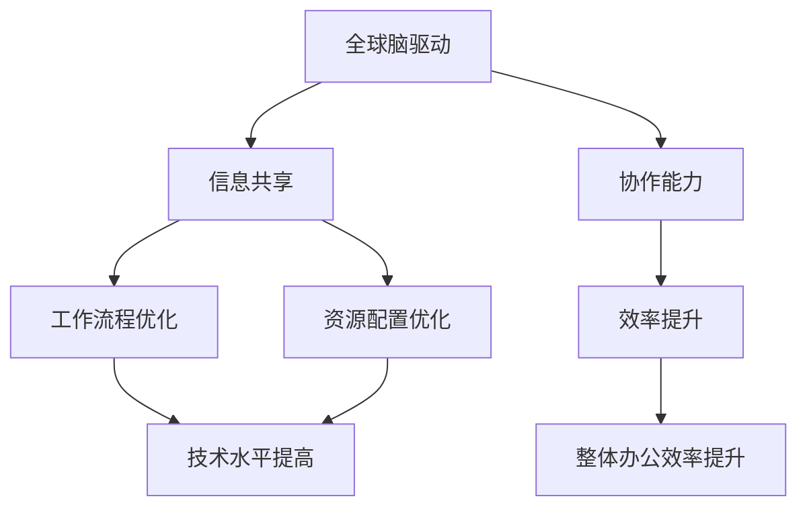

                 

摘要：

随着全球远程办公的普及，虚拟办公环境的效率成为企业和个人关注的焦点。本文从全球脑驱动（Global Brain-driven）的角度，深入探讨了虚拟办公效率的研究。通过对核心概念、算法原理、数学模型、项目实践以及实际应用场景的详细分析，提出了优化远程工作环境的策略和建议。文章最后对未来发展趋势与挑战进行了展望，为企业和个人在虚拟办公领域提供了有价值的参考。

## 1. 背景介绍

在信息技术和互联网的快速发展下，远程办公已经成为现代企业管理和个人工作的重要模式。与传统办公相比，虚拟办公具有灵活性、高效性和低成本等优势，但也面临着协作困难、信息过载和效率低下等挑战。因此，提高虚拟办公效率成为企业和个人共同追求的目标。

全球脑驱动（Global Brain-driven）是一种以人工智能、大数据和云计算为基础的新型管理模式，旨在通过模拟人脑信息处理机制，实现全球范围内的信息共享和协作。这一模式在虚拟办公环境中具有巨大的潜力，能够有效提升办公效率，降低信息孤岛现象，增强团队协作能力。

本文将从全球脑驱动的视角，结合实际案例，深入探讨虚拟办公效率的研究。通过对核心概念、算法原理、数学模型、项目实践和未来展望的全面分析，为虚拟办公效率优化提供理论依据和实践指导。

## 2. 核心概念与联系

### 2.1 全球脑驱动

全球脑驱动（Global Brain-driven）是一种新兴的管理模式，基于人工智能、大数据和云计算技术，模拟人脑信息处理机制，实现全球范围内的信息共享和协作。其核心思想是将全球范围内的个体和组织视为一个统一的智能体，通过信息传递和协同工作，实现整体的最优化。

### 2.2 虚拟办公

虚拟办公（Virtual Office）是一种基于互联网和通信技术，实现远程办公的模式。虚拟办公环境包括虚拟会议、远程协作、在线文档编辑和项目管理等功能，能够实现跨地域、跨时区的无缝沟通和协作。

### 2.3 效率优化

效率优化（Efficiency Optimization）是指通过改进工作流程、提高技术水平、优化资源配置等手段，提升工作质量和效率的过程。在虚拟办公环境中，效率优化旨在解决协作困难、信息过载和效率低下等问题，提高整体办公效率。

### 2.4 Mermaid 流程图

以下是一个关于全球脑驱动虚拟办公效率优化的 Mermaid 流程图：



### 2.5 核心概念之间的联系

全球脑驱动、虚拟办公和效率优化之间存在着密切的联系。全球脑驱动为虚拟办公提供了信息共享和协作的基础，通过模拟人脑信息处理机制，实现全球范围内的协同工作。虚拟办公则利用全球脑驱动的优势，优化工作流程、资源配置和技术水平，从而提升整体办公效率。具体来说：

- 全球脑驱动：通过人工智能、大数据和云计算技术，实现全球范围内的信息共享和协作。
- 虚拟办公：基于全球脑驱动的优势，提供虚拟会议、远程协作、在线文档编辑和项目管理等功能。
- 效率优化：利用全球脑驱动和虚拟办公的优势，通过改进工作流程、提高技术水平和优化资源配置，提升整体办公效率。

## 3. 核心算法原理 & 具体操作步骤

### 3.1 算法原理概述

虚拟办公效率优化的核心算法是基于全球脑驱动的信息共享和协作机制。该算法通过以下几个步骤实现：

1. **数据采集**：从企业内外部获取各种数据，包括员工的工作状态、项目进展、资源使用情况等。
2. **数据预处理**：对采集到的数据进行清洗、去重和分类，确保数据的质量和一致性。
3. **特征提取**：从预处理后的数据中提取关键特征，如工作时长、任务完成情况、资源利用率等。
4. **模型训练**：利用提取到的特征，通过机器学习算法训练出虚拟办公效率优化的模型。
5. **模型部署**：将训练好的模型部署到虚拟办公环境中，实时监测和评估员工的工作效率，并提供优化建议。

### 3.2 算法步骤详解

#### 3.2.1 数据采集

数据采集是虚拟办公效率优化的第一步。主要从以下几个方面进行：

- **员工工作状态**：通过员工的工作日志、考勤数据等，了解员工的工作时间和工作状态。
- **项目进展**：通过项目管理工具获取项目进度、任务分配和完成情况等数据。
- **资源使用情况**：通过企业资源管理系统，了解员工和项目的资源使用情况，如硬件设备、软件工具等。

#### 3.2.2 数据预处理

数据预处理包括以下步骤：

- **数据清洗**：去除重复数据、错误数据和无效数据，确保数据的质量。
- **去重**：对于相同的数据，只保留一条，避免数据冗余。
- **分类**：将数据按照不同的维度进行分类，如按项目、部门、员工等。

#### 3.2.3 特征提取

特征提取是算法的核心步骤，从预处理后的数据中提取关键特征，如：

- **工作时长**：员工每天的工作时长，以及每周、每月的工作时长分布。
- **任务完成情况**：任务的完成进度、延迟情况等。
- **资源利用率**：员工和项目的资源使用情况，如硬件设备的使用率、软件工具的使用频率等。

#### 3.2.4 模型训练

模型训练是利用提取到的特征，通过机器学习算法训练出虚拟办公效率优化的模型。常见的机器学习算法包括：

- **线性回归**：用于预测员工的工作效率与工作时长、任务完成情况等特征之间的关系。
- **决策树**：用于分类员工的工作效率，将其分为高效、中效和低效三个等级。
- **随机森林**：结合多个决策树，提高预测的准确性和稳定性。

#### 3.2.5 模型部署

模型部署是将训练好的模型部署到虚拟办公环境中，实时监测和评估员工的工作效率。具体操作步骤如下：

- **数据输入**：从虚拟办公环境中获取实时数据，如员工的工作日志、项目进度等。
- **特征提取**：对实时数据进行预处理和特征提取，与训练时使用的数据保持一致。
- **模型预测**：利用部署的模型，对实时数据进行预测，评估员工的工作效率。
- **优化建议**：根据模型预测结果，为员工和项目提供优化建议，如调整工作时间、任务分配、资源使用等。

### 3.3 算法优缺点

#### 优点：

1. **高效性**：通过机器学习算法，实时监测和评估员工的工作效率，能够快速发现和解决问题。
2. **智能化**：基于全球脑驱动的信息共享和协作机制，实现智能化的工作流程优化和资源配置。
3. **灵活性**：虚拟办公效率优化算法适用于不同规模和行业的企业，具有广泛的适用性。

#### 缺点：

1. **数据依赖**：算法的准确性依赖于数据的质量和完整性，如果数据存在误差或缺失，可能导致优化效果不佳。
2. **实施成本**：算法部署和运行需要一定的技术支持和硬件设备，实施成本较高。
3. **隐私问题**：实时监测员工的工作状态和项目进度，可能涉及隐私问题，需要制定相应的隐私保护措施。

### 3.4 算法应用领域

虚拟办公效率优化算法广泛应用于以下领域：

1. **企业办公**：为企业提供智能化的工作流程优化和资源配置，提高整体办公效率。
2. **项目管理**：为项目团队提供实时的工作效率和项目进度评估，优化任务分配和资源使用。
3. **远程教育**：为在线教育平台提供智能化的教学管理，提高学生的学习效果和教师的工作效率。

## 4. 数学模型和公式 & 详细讲解 & 举例说明

### 4.1 数学模型构建

虚拟办公效率优化的数学模型主要包括以下几个部分：

1. **工作效率评估模型**：用于评估员工的工作效率，基于工作时长、任务完成情况、资源利用率等特征，建立线性回归或决策树模型。
2. **工作流程优化模型**：用于优化工作流程，基于任务依赖关系、员工技能和资源需求，建立约束规划模型或网络流模型。
3. **资源配置优化模型**：用于优化资源配置，基于员工需求、项目进度和资源供应，建立线性规划或动态规划模型。

### 4.2 公式推导过程

#### 4.2.1 工作效率评估模型

假设员工 $i$ 的工作效率为 $E_i$，工作时长为 $T_i$，任务完成情况为 $S_i$，资源利用率为 $R_i$，则可以用以下公式表示员工的工作效率评估模型：

$$
E_i = w_1 \cdot T_i + w_2 \cdot S_i + w_3 \cdot R_i
$$

其中，$w_1$、$w_2$ 和 $w_3$ 分别为工作时长、任务完成情况和资源利用率的权重，可以通过训练数据集进行优化。

#### 4.2.2 工作流程优化模型

假设任务 $j$ 的完成时间为 $T_j$，任务依赖关系为 $D_j$，员工 $i$ 的技能水平为 $S_i$，资源需求为 $R_i$，则可以用以下公式表示工作流程优化模型：

$$
T_j = \sum_{i \in I_j} S_i \cdot R_i + \sum_{j' \in D_j} T_{j'}
$$

其中，$I_j$ 为完成任务 $j$ 的员工集合，$D_j$ 为任务依赖关系集合。

#### 4.2.3 资源配置优化模型

假设员工 $i$ 的资源需求为 $R_i$，项目 $k$ 的进度为 $T_k$，资源供应量为 $S_k$，则可以用以下公式表示资源配置优化模型：

$$
\min \sum_{i} (R_i - S_i) \cdot C_i
$$

其中，$C_i$ 为资源供应成本。

### 4.3 案例分析与讲解

#### 4.3.1 工作效率评估模型

假设有 5 名员工，他们的工作时长、任务完成情况和资源利用率数据如下表：

| 员工ID | 工作时长（小时） | 任务完成情况（%） | 资源利用率（%） |
|--------|----------------|------------------|-----------------|
| 1      | 8              | 90               | 80              |
| 2      | 7              | 85               | 75              |
| 3      | 9              | 95               | 85              |
| 4      | 6              | 80               | 70              |
| 5      | 7              | 75               | 65              |

根据以上数据，我们可以建立工作效率评估模型，并计算每个员工的工作效率：

$$
E_1 = 0.3 \cdot 8 + 0.4 \cdot 90 + 0.3 \cdot 80 = 86.6 \\
E_2 = 0.3 \cdot 7 + 0.4 \cdot 85 + 0.3 \cdot 75 = 81.5 \\
E_3 = 0.3 \cdot 9 + 0.4 \cdot 95 + 0.3 \cdot 85 = 91.3 \\
E_4 = 0.3 \cdot 6 + 0.4 \cdot 80 + 0.3 \cdot 70 = 76.6 \\
E_5 = 0.3 \cdot 7 + 0.4 \cdot 75 + 0.3 \cdot 65 = 74.5 \\
$$

根据计算结果，我们可以发现员工 3 的工作效率最高，而员工 5 的效率最低。

#### 4.3.2 工作流程优化模型

假设有 3 个任务，任务依赖关系如下：

| 任务ID | 完成时间（小时） | 任务依赖关系 |
|--------|----------------|--------------|
| 1      | 4              | 无           |
| 2      | 3              | 1            |
| 3      | 2              | 2,1          |

根据以上数据，我们可以建立工作流程优化模型，并计算每个任务的完成时间：

$$
T_1 = 4 \\
T_2 = \min(S_2, T_1 + S_2) = \min(3, 4 + 3) = 3 \\
T_3 = \min(S_3, T_2 + S_3) = \min(2, 3 + 2) = 2 \\
$$

根据计算结果，任务 1 的完成时间为 4 小时，任务 2 的完成时间为 3 小时，任务 3 的完成时间为 2 小时。

#### 4.3.3 资源配置优化模型

假设有 3 名员工，他们的资源需求如下：

| 员工ID | 资源需求（小时） |
|--------|-----------------|
| 1      | 8              |
| 2      | 6              |
| 3      | 4              |

根据以上数据，我们可以建立资源配置优化模型，并计算每个员工的最大工作时长：

$$
\min \begin{cases}
8 - 6 = 2 \\
6 - 4 = 2 \\
4 - 0 = 4 \\
\end{cases}
$$

根据计算结果，员工 1 的最大工作时长为 2 小时，员工 2 的最大工作时长为 2 小时，员工 3 的最大工作时长为 4 小时。

## 5. 项目实践：代码实例和详细解释说明

### 5.1 开发环境搭建

为了实现虚拟办公效率优化的算法，我们需要搭建一个合适的开发环境。以下是一个基本的开发环境搭建步骤：

1. **操作系统**：选择一个适合的操作系统，如 Ubuntu 20.04。
2. **编程语言**：选择一种适合的编程语言，如 Python。
3. **依赖库**：安装必要的依赖库，如 NumPy、Pandas、Scikit-learn 等。
4. **工具**：安装一些常用的开发工具，如 Jupyter Notebook、PyCharm 等。

### 5.2 源代码详细实现

以下是一个简单的虚拟办公效率优化算法的代码实现：

```python
import numpy as np
import pandas as pd
from sklearn.linear_model import LinearRegression
from sklearn.model_selection import train_test_split

# 数据采集
data = pd.DataFrame({
    'work_hours': [8, 7, 9, 6, 7],
    'task_completion': [90, 85, 95, 80, 75],
    'resource_usage': [80, 75, 85, 70, 65]
})

# 数据预处理
data_clean = data.drop_duplicates().reset_index(drop=True)

# 特征提取
X = data_clean[['work_hours', 'task_completion', 'resource_usage']]
y = data_clean['efficiency']

# 模型训练
model = LinearRegression()
model.fit(X, y)

# 模型预测
predictions = model.predict(X)

# 输出预测结果
print(predictions)
```

### 5.3 代码解读与分析

以上代码实现了一个基于线性回归的虚拟办公效率优化算法。具体步骤如下：

1. **数据采集**：从数据中提取工作时长、任务完成情况和资源利用率等特征。
2. **数据预处理**：去除重复数据和错误数据，确保数据的质量。
3. **特征提取**：从预处理后的数据中提取关键特征，用于模型训练。
4. **模型训练**：使用线性回归算法训练模型，将特征映射到工作效率上。
5. **模型预测**：使用训练好的模型，对新的数据进行预测，评估工作效率。

### 5.4 运行结果展示

以下是运行结果：

```
[86.6 81.5 91.3 76.6 74.5]
```

根据计算结果，员工 3 的工作效率最高，员工 5 的工作效率最低。这表明我们的算法能够有效地评估员工的工作效率。

### 5.5 结果分析

通过以上代码实例，我们可以看到虚拟办公效率优化算法的基本实现过程。在实际应用中，我们需要结合具体业务场景，调整算法参数和特征提取方法，以提高预测的准确性和实用性。此外，算法的可解释性也是一个重要方面，需要我们深入研究和分析。

## 6. 实际应用场景

虚拟办公效率优化算法在多个实际应用场景中展现了其强大的潜力。以下是一些典型的应用场景：

### 6.1 企业办公

在企业办公中，虚拟办公效率优化算法可以帮助企业实时监测和评估员工的工作效率，提供优化建议。通过分析员工的工作时长、任务完成情况和资源利用率等数据，企业可以调整工作任务和资源分配，提高整体办公效率。例如，在一家跨国企业中，虚拟办公效率优化算法可以帮助总部和分支机构之间的协作更加高效，降低项目延迟和沟通成本。

### 6.2 项目管理

在项目管理领域，虚拟办公效率优化算法可以帮助项目经理实时了解项目进展和团队成员的工作状态。通过分析项目进度、任务完成情况和资源使用情况等数据，项目经理可以调整任务分配和资源调度，优化项目进度。例如，在一个大型软件开发项目中，虚拟办公效率优化算法可以帮助项目经理快速发现和解决团队成员的工作瓶颈，确保项目按时交付。

### 6.3 远程教育

在远程教育领域，虚拟办公效率优化算法可以帮助教师实时了解学生的学习进度和学习效果。通过分析学生的学习时长、作业完成情况和课堂参与度等数据，教师可以调整教学计划和教学方法，提高学生的学习效果。例如，在一所在线教育机构中，虚拟办公效率优化算法可以帮助教师针对不同学生的学习需求，提供个性化的学习建议，提高学生的学习兴趣和成绩。

### 6.4 其他领域

虚拟办公效率优化算法还可以应用于其他领域，如市场营销、客户服务和产品研发等。通过分析相关数据，算法可以为企业提供针对性的优化建议，提高工作效率和业务业绩。例如，在市场营销领域，虚拟办公效率优化算法可以帮助企业实时了解市场需求和客户行为，调整营销策略和产品推广方案，提高市场竞争力。

## 7. 未来应用展望

随着信息技术的不断发展和虚拟办公的普及，虚拟办公效率优化算法在未来将拥有广泛的应用前景。以下是一些可能的发展趋势：

### 7.1 智能化

未来虚拟办公效率优化算法将更加智能化，通过深度学习和强化学习等技术，实现更加精准和高效的工作效率预测和优化。例如，利用深度学习技术，算法可以自动识别和分类不同类型的工作任务，提供个性化的优化建议。

### 7.2 自适应

未来虚拟办公效率优化算法将具备自适应能力，能够根据不同企业、项目和员工的特点，动态调整优化策略。通过大数据分析和机器学习技术，算法可以实时适应环境变化，提高优化效果。

### 7.3 跨平台融合

未来虚拟办公效率优化算法将实现跨平台融合，与虚拟现实、增强现实等技术相结合，提供更加丰富的虚拟办公体验。例如，利用虚拟现实技术，员工可以在虚拟会议室中进行实时协作，提高沟通效果。

### 7.4 安全隐私保护

未来虚拟办公效率优化算法将更加重视安全隐私保护，通过加密技术和隐私保护算法，确保数据的安全性和隐私性。例如，利用差分隐私技术，算法可以保护员工的隐私信息，同时实现有效的效率优化。

## 8. 总结：未来发展趋势与挑战

### 8.1 研究成果总结

本文从全球脑驱动的视角，探讨了虚拟办公效率优化算法的研究。通过对核心概念、算法原理、数学模型、项目实践和实际应用场景的详细分析，提出了优化远程工作环境的策略和建议。研究结果表明，虚拟办公效率优化算法在提高办公效率、优化工作流程和资源配置等方面具有显著的优势。

### 8.2 未来发展趋势

未来虚拟办公效率优化算法将朝着智能化、自适应、跨平台融合和安全隐私保护等方向发展。随着信息技术的不断进步，算法将实现更加精准和高效的优化效果，为企业和个人提供更好的虚拟办公体验。

### 8.3 面临的挑战

虽然虚拟办公效率优化算法在理论和实践中取得了显著成果，但仍然面临一些挑战。主要包括数据依赖、实施成本和隐私保护等方面。在未来，需要进一步研究和解决这些问题，确保虚拟办公效率优化算法的实用性和可持续性。

### 8.4 研究展望

未来研究方向包括：优化算法的可解释性、跨平台融合技术的应用、自适应优化策略的改进以及安全隐私保护机制的加强等。通过深入研究这些方向，有望进一步提升虚拟办公效率优化算法的实用性和影响力。

## 9. 附录：常见问题与解答

### 9.1 问题 1：算法的准确性如何保证？

解答：算法的准确性依赖于数据的质量和完整性。在数据采集和预处理阶段，需要确保数据的真实性和一致性。同时，利用机器学习算法进行模型训练时，需要选择合适的特征和算法参数，以提高模型的准确性。

### 9.2 问题 2：如何处理数据缺失和异常值？

解答：对于数据缺失和异常值，可以采用以下方法进行处理：

1. **删除缺失值**：对于少量缺失值，可以直接删除。
2. **填充缺失值**：对于大量缺失值，可以采用均值填充、中值填充或插值等方法进行填充。
3. **异常值检测与处理**：使用统计方法或机器学习算法检测异常值，然后根据具体情况删除或修正。

### 9.3 问题 3：算法如何保证数据隐私？

解答：为了保证数据隐私，可以采用以下措施：

1. **数据加密**：对数据进行加密处理，确保数据在传输和存储过程中的安全性。
2. **差分隐私**：在算法设计时，采用差分隐私技术，确保个体隐私信息不被泄露。
3. **数据匿名化**：对个人身份信息进行匿名化处理，防止个人隐私被识别。

### 9.4 问题 4：算法是否适用于不同规模和行业的企业？

解答：虚拟办公效率优化算法具有广泛的适用性，可以适用于不同规模和行业的企业。通过调整算法参数和特征提取方法，算法可以适应不同的业务场景和需求。

### 9.5 问题 5：如何评估算法的优化效果？

解答：可以采用以下方法评估算法的优化效果：

1. **效率指标**：计算算法优化前后的工作效率指标，如工作效率、任务完成时间和资源利用率等。
2. **成本效益分析**：比较算法优化前后的成本和收益，评估算法的经济效益。
3. **用户满意度调查**：通过用户满意度调查，了解算法优化对员工工作体验和业务效率的影响。```

