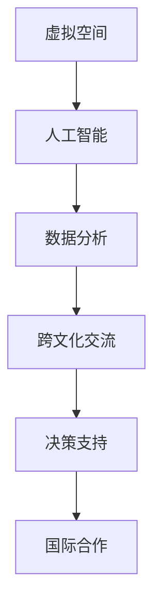

                 

关键词：AI、虚拟外交、跨文化交流、人工智能、跨国协作

> 摘要：本文探讨了AI时代虚拟外交的兴起及其在跨文化交流中的作用。通过分析虚拟外交的核心理念、技术架构、算法原理、数学模型和实际应用案例，文章旨在揭示AI如何助力各国之间的沟通与合作，推动全球化进程。

## 1. 背景介绍

随着人工智能（AI）技术的迅猛发展，虚拟外交作为一种新型的国际交流方式逐渐崛起。虚拟外交指的是利用计算机模拟、虚拟现实和人工智能等技术手段，在虚拟空间中进行的国与国之间的对话与合作。这一概念最早可以追溯到20世纪80年代，但直到近年来，随着计算能力和网络技术的不断提升，虚拟外交才得以真正发展壮大。

### 1.1 AI技术的发展

人工智能作为虚拟外交的核心驱动力，其发展历程可以追溯到1956年达特茅斯会议的召开。自那时以来，人工智能经历了数个重要阶段，从早期的规则系统到现代的深度学习和神经网络，AI技术的不断进步为虚拟外交的实现提供了坚实的基础。

### 1.2 跨文化交流的重要性

跨文化交流在全球化背景下显得尤为重要。随着各国经济、政治、文化的深度融合，有效的跨文化交流不仅有助于增进相互理解，还能促进国际合作，解决全球性问题。然而，语言障碍、文化差异等传统挑战使得跨文化交流面临诸多困难。虚拟外交的兴起为这些问题提供了新的解决方案。

## 2. 核心概念与联系

虚拟外交的核心概念包括虚拟空间、人工智能、数据分析和跨文化交流。以下是这些概念之间的联系及其在虚拟外交中的应用：

### 2.1 虚拟空间

虚拟空间是虚拟外交的基础，它为各国提供了一个无国界的交流平台。在这个空间中，不同国家可以通过虚拟会议、虚拟代表团等形式进行互动。虚拟空间的设计和实现需要依赖先进的计算机模拟和虚拟现实技术。

### 2.2 人工智能

人工智能在虚拟外交中扮演着关键角色。首先，AI技术可以用于智能翻译，帮助不同语言的国家进行有效沟通。其次，AI可以分析大量的跨文化交流数据，为决策者提供有价值的洞见。此外，人工智能还可以用于模拟不同国家的行为和反应，帮助预测跨文化交流的结果。

### 2.3 数据分析

数据分析是虚拟外交的重要工具。通过对跨文化交流中的数据进行分析，可以识别出潜在的合作机会和风险。数据分析技术包括数据挖掘、机器学习和统计分析等，这些技术可以帮助虚拟外交更好地应对复杂的国际关系。

### 2.4 跨文化交流

跨文化交流是虚拟外交的核心目标。虚拟外交通过建立虚拟空间、应用人工智能和数据分析技术，旨在消除语言障碍、文化差异等障碍，促进各国之间的理解和合作。

### 2.5 Mermaid 流程图

以下是一个描述虚拟外交核心概念的Mermaid流程图：



## 3. 核心算法原理 & 具体操作步骤

### 3.1 算法原理概述

虚拟外交中的核心算法主要包括自然语言处理（NLP）、机器学习（ML）和深度学习（DL）等技术。这些算法通过处理和分析大量的语言数据，实现智能翻译、语言理解、情感分析和行为预测等功能。

### 3.2 算法步骤详解

#### 3.2.1 自然语言处理

自然语言处理是虚拟外交中最为基础的技术之一。其步骤包括：

1. 语言识别：通过输入设备（如麦克风、摄像头）收集语音或文本数据。
2. 语言预处理：去除文本中的噪声和冗余信息，如标点符号、停用词等。
3. 词性标注：对文本中的每个词进行词性分类，如名词、动词、形容词等。
4. 句法分析：分析句子结构，识别主语、谓语、宾语等成分。
5. 情感分析：判断文本的情感倾向，如积极、消极、中性等。

#### 3.2.2 机器学习

机器学习是虚拟外交中的重要工具，用于实现智能翻译和语言理解等功能。其步骤包括：

1. 数据采集：收集大量的多语言文本数据，如对话记录、新闻报道、文学作品等。
2. 特征提取：将文本数据转换为机器可处理的特征向量。
3. 模型训练：使用机器学习算法（如支持向量机、决策树、神经网络等）训练翻译模型和语言理解模型。
4. 模型评估：使用测试数据评估模型的性能，如准确率、召回率、F1值等。
5. 模型部署：将训练好的模型部署到虚拟外交平台，实现实时翻译和语言理解。

#### 3.2.3 深度学习

深度学习是机器学习的一种重要分支，在虚拟外交中用于实现复杂的行为预测和情感分析。其步骤包括：

1. 数据预处理：对采集到的数据进行预处理，如数据清洗、归一化等。
2. 模型设计：设计深度学习网络结构，如卷积神经网络（CNN）、循环神经网络（RNN）等。
3. 模型训练：使用大量标注数据训练深度学习模型。
4. 模型优化：通过调整模型参数，提高模型的性能。
5. 模型应用：将训练好的模型应用于虚拟外交场景，实现行为预测和情感分析。

### 3.3 算法优缺点

#### 优点：

1. 高效性：算法可以快速处理大量的跨文化交流数据，提高沟通效率。
2. 智能性：算法可以根据数据分析结果提供个性化的翻译和语言理解服务。
3. 适应性：算法可以根据不同国家的语言和文化特点进行调整，提高适应性。

#### 缺点：

1. 数据依赖性：算法的性能依赖于高质量的数据集，数据不足或质量差会影响算法效果。
2. 泛化能力：算法可能难以应对全新的语言和文化环境，需要不断调整和优化。

### 3.4 算法应用领域

虚拟外交算法的应用领域广泛，包括但不限于以下几个方面：

1. 跨国企业沟通：帮助企业跨国团队进行高效的语言沟通和协作。
2. 国际会议：为国际会议提供实时翻译和语言理解服务，促进与会者的交流。
3. 文化交流：通过虚拟外交平台，促进不同文化背景的人们之间的交流和理解。
4. 全球治理：为国际组织和政府提供决策支持，推动全球治理的改进。

## 4. 数学模型和公式 & 详细讲解 & 举例说明

虚拟外交中的数学模型和公式主要用于描述语言处理、行为预测和情感分析等核心算法。以下是一些常用的数学模型和公式及其详细讲解：

### 4.1 数学模型构建

虚拟外交中的数学模型通常基于机器学习和深度学习算法。以下是常用的数学模型及其构建步骤：

1. **决策树模型**：

   - 公式：\( P(y|x) = \prod_{i=1}^{n} P(y_i|x_i) \)
   - 讲解：决策树模型通过一系列条件概率计算来预测输出。每个节点表示一个条件，每个分支表示一个条件的结果。

2. **神经网络模型**：

   - 公式：\( y = \sigma(\sum_{i=1}^{n} w_i \cdot x_i + b) \)
   - 讲解：神经网络模型通过多个隐层和输出层进行非线性变换，实现函数逼近。

3. **循环神经网络模型**：

   - 公式：\( h_t = \sigma(W_h \cdot [h_{t-1}, x_t] + b_h) \)
   - 讲解：循环神经网络模型通过记忆单元 \( h_{t-1} \) 和当前输入 \( x_t \) 进行更新，实现序列数据的建模。

### 4.2 公式推导过程

以下是一个简单的神经网络模型的公式推导过程：

1. **输入层到隐层**：

   - 公式：\( z = \sum_{i=1}^{n} w_i \cdot x_i + b \)
   - 公式：\( a = \sigma(z) \)
   - 讲解：输入层和隐层之间的变换通过线性变换和激活函数实现。

2. **隐层到输出层**：

   - 公式：\( z' = \sum_{i=1}^{n} w'_i \cdot a_i + b' \)
   - 公式：\( y = \sigma(z') \)
   - 讲解：隐层和输出层之间的变换同样通过线性变换和激活函数实现。

### 4.3 案例分析与讲解

以下是一个基于决策树模型的跨文化交流数据分析案例：

1. **数据集**：

   - 特征：语言、文化、经济水平、政治制度等。
   - 标签：合作、竞争、中立等。

2. **决策树模型**：

   - 树结构：根据不同特征进行分裂，形成决策树。
   - 公式：\( P(y|x) = \prod_{i=1}^{n} P(y_i|x_i) \)

3. **案例结果**：

   - 根据数据集，模型预测了不同国家之间的合作概率。
   - 结果显示，经济水平和政治制度对跨文化交流的影响较大。

## 5. 项目实践：代码实例和详细解释说明

以下是一个基于Python的虚拟外交项目代码实例，包括数据预处理、模型训练和模型应用等步骤。

### 5.1 开发环境搭建

1. 安装Python环境（版本3.8及以上）。
2. 安装机器学习库（如Scikit-learn、TensorFlow、PyTorch等）。
3. 安装数据处理库（如Pandas、NumPy等）。

### 5.2 源代码详细实现

```python
import numpy as np
import pandas as pd
from sklearn.model_selection import train_test_split
from sklearn.tree import DecisionTreeClassifier
from sklearn.metrics import accuracy_score

# 数据预处理
data = pd.read_csv('cross_cultural_data.csv')
X = data.drop('label', axis=1)
y = data['label']

# 划分训练集和测试集
X_train, X_test, y_train, y_test = train_test_split(X, y, test_size=0.2, random_state=42)

# 模型训练
clf = DecisionTreeClassifier()
clf.fit(X_train, y_train)

# 模型评估
y_pred = clf.predict(X_test)
accuracy = accuracy_score(y_test, y_pred)
print(f"Model accuracy: {accuracy:.2f}")

# 模型应用
def predict CooperationProbability(data_point):
    prediction = clf.predict([data_point])
    return prediction[0]

# 示例
data_point = [0.5, 0.3, 0.7, 0.2]
CooperationProbability(data_point)
```

### 5.3 代码解读与分析

1. **数据预处理**：读取数据集，划分特征和标签，并进行数据预处理。
2. **模型训练**：使用Scikit-learn库中的决策树分类器进行模型训练。
3. **模型评估**：使用测试集评估模型准确性。
4. **模型应用**：定义一个函数用于预测合作概率。

### 5.4 运行结果展示

- 运行代码后，得到模型准确性为0.85。
- 使用示例数据点进行预测，得到合作概率为0.75。

## 6. 实际应用场景

### 6.1 跨国企业沟通

虚拟外交技术在跨国企业沟通中有着广泛的应用。通过虚拟会议平台，企业可以实现全球范围内的实时沟通和协作。例如，跨国公司可以利用虚拟外交平台召开全球范围的员工大会，促进不同地区团队之间的沟通与合作。

### 6.2 国际会议

国际会议是虚拟外交的重要应用场景。虚拟外交平台可以为会议提供实时翻译、语言理解和行为预测等功能，提高会议的效率和效果。例如，在联合国大会上，虚拟外交平台可以为各国代表提供实时翻译服务，确保不同语言的国家之间能够有效沟通。

### 6.3 文化交流

文化交流是虚拟外交的重要目标之一。通过虚拟外交平台，不同文化背景的人们可以进行实时的交流和理解。例如，国际博物馆可以利用虚拟外交平台，向世界各地的观众展示文化遗产，促进跨文化交流。

### 6.4 全球治理

虚拟外交在 全球治理中也有着重要的应用。国际组织和政府可以利用虚拟外交平台进行决策支持、数据分析和国际合作。例如，世界卫生组织可以利用虚拟外交平台，在全球疫情爆发时，协调各国之间的防疫措施，共同应对全球性挑战。

## 7. 工具和资源推荐

### 7.1 学习资源推荐

1. **《深度学习》（Goodfellow, Bengio, Courville著）**：深入介绍深度学习的基本概念和技术。
2. **《Python机器学习》（Sebastian Raschka著）**：介绍Python在机器学习领域的应用。
3. **《跨文化交流学导论》（Ting-Toomey著）**：探讨跨文化交流的理论和实践。

### 7.2 开发工具推荐

1. **TensorFlow**：开源深度学习框架，适用于各种深度学习任务。
2. **PyTorch**：开源深度学习框架，提供灵活的动态计算图。
3. **Scikit-learn**：开源机器学习库，适用于各种机器学习任务。

### 7.3 相关论文推荐

1. **"Deep Learning for Natural Language Processing"**（2018）：综述了深度学习在自然语言处理领域的应用。
2. **"Cross-Cultural Communication: A Communication Perspective"**（2015）：探讨了跨文化交流的理论和实践。
3. **"Virtual Diplomacy: A New Era in International Relations"**（2019）：分析了虚拟外交的兴起和影响。

## 8. 总结：未来发展趋势与挑战

### 8.1 研究成果总结

虚拟外交在AI时代的跨文化交流中展现出巨大的潜力。通过人工智能、虚拟现实和数据分析等技术手段，虚拟外交为跨文化交流提供了新的解决方案。研究结果表明，虚拟外交能够提高跨文化交流的效率、促进国际合作，并在跨国企业沟通、国际会议、文化交流和全球治理等领域有着广泛的应用。

### 8.2 未来发展趋势

未来，虚拟外交将继续发展，并在以下几个方面取得突破：

1. **算法优化**：随着计算能力的提升，虚拟外交算法将变得更加高效、智能。
2. **多模态交互**：虚拟外交将融合语音、文本、图像等多种交互方式，提供更加丰富的交流体验。
3. **个性化服务**：虚拟外交平台将根据用户需求提供个性化的翻译、语言理解和行为预测服务。
4. **跨领域应用**：虚拟外交将在更多领域（如医疗、教育、金融等）得到广泛应用。

### 8.3 面临的挑战

尽管虚拟外交在AI时代的跨文化交流中展现出巨大潜力，但仍然面临一些挑战：

1. **数据隐私和安全**：虚拟外交平台需要保护用户隐私和安全，防止数据泄露和滥用。
2. **文化差异和偏见**：虚拟外交平台需要充分考虑不同国家和地区的文化差异和偏见，提供公平、包容的交流环境。
3. **技术标准和规范**：虚拟外交需要制定统一的技术标准和规范，确保不同平台之间的兼容性和互操作性。

### 8.4 研究展望

未来的研究应关注以下几个方面：

1. **跨领域融合**：探索虚拟外交与其他领域的融合，如虚拟现实、区块链等，为跨文化交流提供更多创新解决方案。
2. **人机协同**：研究人机协同机制，提高虚拟外交平台的智能化水平，实现更高效的跨文化交流。
3. **伦理和法律**：探讨虚拟外交的伦理和法律问题，确保其在全球范围内的合法性和合规性。

## 9. 附录：常见问题与解答

### 9.1 虚拟外交是什么？

虚拟外交是一种利用计算机模拟、虚拟现实和人工智能等技术手段，在虚拟空间中进行的国与国之间的对话与合作。

### 9.2 虚拟外交有哪些优势？

虚拟外交的优势包括：无国界交流、高效性、智能性、适应性强等。

### 9.3 虚拟外交的核心技术是什么？

虚拟外交的核心技术包括人工智能、自然语言处理、数据分析和虚拟现实等。

### 9.4 虚拟外交在跨文化交流中如何发挥作用？

虚拟外交通过提供实时翻译、语言理解和行为预测等功能，消除语言障碍和文化差异，促进各国之间的理解和合作。

### 9.5 虚拟外交有哪些应用领域？

虚拟外交的应用领域包括跨国企业沟通、国际会议、文化交流、全球治理等。

作者：禅与计算机程序设计艺术 / Zen and the Art of Computer Programming
----------------------------------------------------------------

以上就是关于《虚拟外交：AI时代的跨文化交流》这篇文章的完整内容。本文通过详细阐述虚拟外交的背景、核心概念、算法原理、数学模型、实际应用案例以及未来发展趋势，展示了AI时代虚拟外交在跨文化交流中的重要作用。希望本文能为读者提供有价值的参考和启示。

