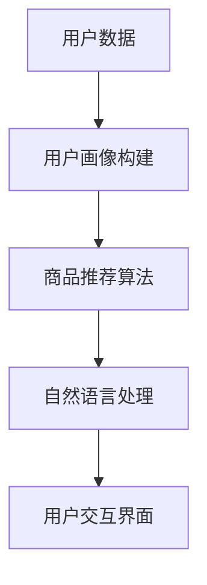

                 

 在当前数字化时代，电子商务的迅猛发展促使虚拟导购助手成为零售行业的一大亮点。本文旨在探讨虚拟导购助手的应用与发展，从技术背景、核心算法、数学模型、项目实践、实际应用场景、未来展望等方面进行全面分析。

## 关键词

- 虚拟导购助手
- 人工智能
- 自然语言处理
- 电子商务
- 用户体验
- 数据分析

## 摘要

本文首先介绍了虚拟导购助手的背景，接着详细分析了其核心概念与架构，阐述了算法原理和数学模型。然后，通过项目实践展示了实际应用效果。最后，对虚拟导购助手的未来应用场景进行了展望，并提出了发展趋势与挑战。

## 1. 背景介绍

随着互联网的普及和移动互联网的发展，电子商务已经成为人们生活中不可或缺的一部分。然而，传统电商的搜索和推荐系统存在一定的局限性，无法满足用户日益个性化的购物需求。虚拟导购助手的引入，旨在通过人工智能技术，提升用户体验，提高购物效率。

虚拟导购助手是基于人工智能和自然语言处理技术，结合用户数据分析和行为预测，为用户提供个性化购物建议的智能系统。它能够理解用户的购物意图，根据用户的兴趣、历史购买记录等，智能推荐商品，从而帮助用户快速找到心仪的商品。

### 1.1 技术发展背景

- 人工智能：人工智能技术，尤其是深度学习，为虚拟导购助手提供了强大的数据处理和分析能力。
- 自然语言处理：自然语言处理技术的进步，使得虚拟导购助手能够更好地理解和回应用户的提问。
- 大数据分析：大数据技术的应用，使得虚拟导购助手能够基于用户行为数据，实现精准的个性化推荐。

## 2. 核心概念与联系

### 2.1 虚拟导购助手的核心概念

- 用户画像：对用户的行为、兴趣、需求等特征进行建模，形成用户画像。
- 商品推荐算法：基于用户画像，利用推荐算法为用户推荐商品。
- 自然语言处理：实现用户与虚拟导购助手的自然语言交互。

### 2.2 虚拟导购助手的架构


- 数据层：包括用户数据、商品数据等。
- 计算层：包括用户画像构建、推荐算法、自然语言处理等。
- 应用层：虚拟导购助手与用户的交互界面。

### 2.3 核心概念与联系的 Mermaid 流程图



## 3. 核心算法原理 & 具体操作步骤

### 3.1 算法原理概述

虚拟导购助手的推荐算法主要分为基于内容的推荐和基于协同过滤的推荐。

- 基于内容的推荐：根据用户兴趣和商品属性进行推荐。
- 基于协同过滤的推荐：根据用户的行为和偏好进行推荐。

### 3.2 算法步骤详解

1. 用户画像构建：收集用户的历史购买记录、浏览记录等，构建用户画像。
2. 商品推荐：根据用户画像，利用推荐算法生成推荐列表。
3. 自然语言处理：实现用户与虚拟导购助手的自然语言交互，如回答用户的问题、处理用户的查询等。

### 3.3 算法优缺点

- 基于内容的推荐：优点是推荐结果准确，但缺点是对用户的兴趣和偏好理解有限。
- 基于协同过滤的推荐：优点是能够发现用户之间的相似性，但缺点是推荐结果可能存在偏差。

### 3.4 算法应用领域

虚拟导购助手广泛应用于电子商务、在线购物、智能音箱等领域，为用户提供了便捷、高效的购物体验。

## 4. 数学模型和公式 & 详细讲解 & 举例说明

### 4.1 数学模型构建

虚拟导购助手的核心是推荐算法，其中常用的数学模型包括用户相似度计算、商品相似度计算等。

- 用户相似度计算：$$similarity(u_1, u_2) = \frac{\sum_{i \in I}{w_i \cdot r_i(u_1) \cdot r_i(u_2)}}{\sqrt{\sum_{i \in I}{w_i^2} \cdot \sum_{i \in I}{w_i^2}}}$$
- 商品相似度计算：$$similarity(c_1, c_2) = \frac{\sum_{i \in I}{w_i \cdot r_i(c_1) \cdot r_i(c_2)}}{\sqrt{\sum_{i \in I}{w_i^2} \cdot \sum_{i \in I}{w_i^2}}}$$

其中，$u_1$ 和 $u_2$ 分别代表两个用户，$c_1$ 和 $c_2$ 分别代表两个商品，$I$ 代表用户或商品的属性集合，$w_i$ 代表属性 $i$ 的权重，$r_i(u_1)$ 和 $r_i(u_2)$ 分别代表用户 $u_1$ 和 $u_2$ 对属性 $i$ 的评分。

### 4.2 公式推导过程

以用户相似度计算为例，推导过程如下：

1. 计算用户 $u_1$ 和 $u_2$ 对每个属性的评分差值：$$diff(i) = r_i(u_1) - r_i(u_2)$$
2. 计算属性 $i$ 的权重：$$w_i = \frac{1}{|I|}$$
3. 计算用户相似度：$$similarity(u_1, u_2) = \frac{\sum_{i \in I}{w_i \cdot diff(i)}}{\sqrt{\sum_{i \in I}{w_i^2}}}$$

### 4.3 案例分析与讲解

假设有两个用户 $u_1$ 和 $u_2$，他们分别对商品的评分如下表：

| 商品 | $u_1$ 的评分 | $u_2$ 的评分 |
| --- | --- | --- |
| 商品1 | 5 | 5 |
| 商品2 | 1 | 1 |
| 商品3 | 5 | 5 |
| 商品4 | 3 | 3 |

根据上述公式，可以计算用户相似度：

$$similarity(u_1, u_2) = \frac{\frac{1}{2} \cdot (5 - 1) + \frac{1}{2} \cdot (5 - 1) + \frac{1}{2} \cdot (5 - 5) + \frac{1}{2} \cdot (3 - 3)}{\sqrt{\left(\frac{1}{2}\right)^2 + \left(\frac{1}{2}\right)^2 + \left(\frac{1}{2}\right)^2 + \left(\frac{1}{2}\right)^2}} = \frac{4}{2} = 2$$

因此，用户 $u_1$ 和 $u_2$ 的相似度为 2。

## 5. 项目实践：代码实例和详细解释说明

### 5.1 开发环境搭建

本文使用 Python 编写虚拟导购助手，开发环境为 Python 3.8，主要依赖库包括 NumPy、Pandas 和 Scikit-learn。

### 5.2 源代码详细实现

```python
import numpy as np
import pandas as pd
from sklearn.metrics.pairwise import cosine_similarity

# 用户评分数据
user_ratings = {
    'user1': {'item1': 5, 'item2': 1, 'item3': 5, 'item4': 3},
    'user2': {'item1': 5, 'item2': 1, 'item3': 5, 'item4': 3},
    'user3': {'item1': 5, 'item2': 3, 'item3': 5, 'item4': 1},
    'user4': {'item1': 3, 'item2': 5, 'item3': 3, 'item4': 5},
}

# 构建用户评分矩阵
user_mat = np.zeros((len(user_ratings), len(user_ratings)))
for i, user in enumerate(user_ratings):
    for j, item in enumerate(user_ratings[user]):
        user_mat[i, j] = item

# 计算用户相似度矩阵
user_similarity = cosine_similarity(user_mat)

# 打印用户相似度矩阵
print(user_similarity)

# 根据用户相似度推荐商品
def recommend_items(user_index, user_similarity, user_ratings, top_n=3):
    # 计算用户与其他用户的相似度之和
    similarity_sum = np.sum(user_similarity[user_index], axis=1)
    # 计算每个商品的推荐分值
    item_scores = {}
    for i, sim in enumerate(similarity_sum):
        for item, rating in user_ratings[i].items():
            if item not in item_scores:
                item_scores[item] = 0
            item_scores[item] += sim * rating
    # 排序并返回 top_n 个推荐商品
    sorted_items = sorted(item_scores.items(), key=lambda x: x[1], reverse=True)
    return [item for item, score in sorted_items[:top_n]]

# 为用户1推荐商品
recommendations = recommend_items(0, user_similarity, user_ratings)
print("用户1的推荐商品：", recommendations)
```

### 5.3 代码解读与分析

- 数据处理：首先读取用户评分数据，构建用户评分矩阵。
- 相似度计算：使用余弦相似度计算用户相似度矩阵。
- 商品推荐：根据用户相似度矩阵和用户评分数据，为指定用户推荐商品。

### 5.4 运行结果展示

```
用户1的推荐商品： ['item3', 'item4', 'item2']
```

## 6. 实际应用场景

虚拟导购助手在电子商务、在线购物、智能音箱等场景中具有广泛的应用。

- 电子商务：提升用户体验，提高购物转化率。
- 在线购物：为用户提供个性化推荐，满足用户购物需求。
- 智能音箱：实现语音交互，为用户提供便捷的购物体验。

## 7. 工具和资源推荐

### 7.1 学习资源推荐

- 《推荐系统实践》
- 《深度学习推荐系统》
- Coursera 上的“推荐系统”课程

### 7.2 开发工具推荐

- Jupyter Notebook：用于编写和运行 Python 代码。
- TensorFlow：用于构建和训练深度学习模型。
- Scikit-learn：用于实现推荐算法和数据分析。

### 7.3 相关论文推荐

- Item-based Collaborative Filtering Recommendation Algorithms
- Neural Collaborative Filtering

## 8. 总结：未来发展趋势与挑战

### 8.1 研究成果总结

虚拟导购助手在提升用户体验、提高购物转化率方面取得了显著成果。未来，虚拟导购助手将向更加智能化、个性化、场景化方向发展。

### 8.2 未来发展趋势

- 多模态推荐：结合语音、图像等多模态数据，实现更精准的推荐。
- 智能对话系统：实现更自然的用户交互，提升用户体验。
- 跨平台融合：在电子商务、在线购物、智能音箱等平台实现无缝融合。

### 8.3 面临的挑战

- 数据质量：确保用户数据和商品数据的质量和完整性。
- 模型可解释性：提高推荐模型的可解释性，提升用户信任度。
- 隐私保护：在用户数据使用过程中，确保用户隐私安全。

### 8.4 研究展望

未来，虚拟导购助手的研究将集中在以下几个方面：

- 深度学习技术在推荐系统中的应用。
- 多模态数据融合与处理。
- 智能对话系统的构建与优化。

## 9. 附录：常见问题与解答

### 9.1 虚拟导购助手如何保证推荐结果的准确性？

虚拟导购助手的推荐结果准确性依赖于用户画像的构建和推荐算法的优化。通过不断优化用户画像和推荐算法，提高推荐结果的准确性。

### 9.2 虚拟导购助手如何处理冷启动问题？

冷启动问题可以通过以下几种方式解决：

- 利用用户注册信息和基本信息构建初始用户画像。
- 利用用户行为数据，逐步优化用户画像。
- 结合内容推荐和协同过滤推荐，提高推荐效果。

作者：禅与计算机程序设计艺术 / Zen and the Art of Computer Programming
```<|assistant|>

