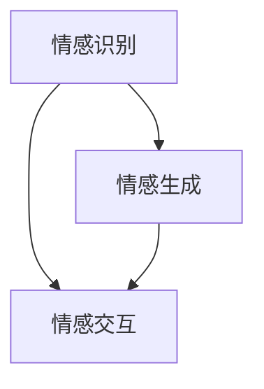

                 

关键词：虚拟情感智能、情感理解、情感表达、人工智能、机器学习、深度学习、情感计算、情感识别、人机交互

> 摘要：随着人工智能技术的快速发展，虚拟情感智能逐渐成为研究热点。本文从虚拟情感智能的概念入手，探讨了情感理解与表达的技术原理、算法模型以及实际应用，并展望了其未来的发展趋势和挑战。

## 1. 背景介绍

### 1.1 虚拟情感智能的定义

虚拟情感智能是指通过人工智能技术模拟人类情感认知和表达的能力，使机器具备理解人类情感并做出相应反应的能力。这一概念涵盖了情感理解、情感生成、情感交互等多个方面，旨在实现人机情感互动的深度融合。

### 1.2 情感理解与表达的重要性

情感是人类沟通和交互的重要方式，理解他人的情感有助于建立更好的人际关系。在虚拟情感智能领域，情感理解与表达的重要性不言而喻。通过情感理解，机器能够更好地识别用户的情感状态，从而提供个性化的服务和交互体验。而情感表达则使得机器能够以更加自然、贴切的方式与人类进行交流，提高人机交互的效率和效果。

## 2. 核心概念与联系

### 2.1 情感识别

情感识别是虚拟情感智能的基础，主要任务是从文本、语音、图像等多媒体数据中识别出情感信息。情感识别的流程包括数据预处理、特征提取、模型训练和预测等步骤。

### 2.2 情感生成

情感生成是指根据输入的文本、语音或图像等信息，生成相应的情感表达。情感生成技术主要包括文本生成、语音合成和图像生成等。

### 2.3 情感交互

情感交互是指机器与用户之间的情感互动，包括情感表达、情感识别、情感回应等环节。情感交互的实现依赖于情感识别和情感生成的技术，同时还需要考虑人机交互界面的设计。

下面是一个简单的 Mermaid 流程图，展示了虚拟情感智能的三个核心概念之间的联系：



## 3. 核心算法原理 & 具体操作步骤

### 3.1 算法原理概述

虚拟情感智能的核心算法主要包括情感识别、情感生成和情感交互。情感识别主要采用深度学习技术，如卷积神经网络（CNN）和循环神经网络（RNN）等，对文本、语音和图像数据进行特征提取和分类。情感生成则通过自然语言处理（NLP）和语音合成技术实现。情感交互则结合情感识别和情感生成的结果，设计合适的人机交互界面，实现情感互动。

### 3.2 算法步骤详解

#### 3.2.1 情感识别

1. 数据预处理：对输入的文本、语音和图像数据进行清洗和标注，提取有用的特征信息。
2. 特征提取：使用深度学习模型，如 CNN 和 RNN，对特征进行提取和转换，形成高维特征向量。
3. 模型训练：使用训练集对模型进行训练，调整模型参数，使其具备情感识别能力。
4. 情感预测：使用训练好的模型对新的文本、语音和图像数据进行情感预测。

#### 3.2.2 情感生成

1. 文本生成：使用预训练的语言模型（如 GPT）生成与输入情感相关的文本。
2. 语音合成：使用文本到语音（TTS）技术将生成的文本转换为语音。
3. 图像生成：使用生成对抗网络（GAN）等技术生成与输入情感相关的图像。

#### 3.2.3 情感交互

1. 情感识别：实时获取用户的情感状态。
2. 情感回应：根据用户的情感状态，生成相应的情感回应。
3. 交互反馈：将情感回应呈现给用户，收集用户反馈，进行迭代优化。

### 3.3 算法优缺点

#### 优点

1. 高效性：深度学习模型能够在海量数据上进行快速训练和预测。
2. 个性化：基于用户情感状态，提供个性化的服务和交互体验。
3. 自然性：通过情感生成技术，实现自然、流畅的人机交互。

#### 缺点

1. 数据依赖：情感识别和情感生成依赖于大量标注数据，数据质量和数量直接影响算法效果。
2. 稳定性：深度学习模型可能存在过拟合现象，导致对新数据的适应性较差。
3. 隐私问题：用户情感数据可能涉及隐私，需要采取有效的隐私保护措施。

### 3.4 算法应用领域

虚拟情感智能技术广泛应用于人机交互、智能客服、虚拟助手、情感计算等领域。例如，在智能客服中，虚拟情感智能可以帮助客服系统更好地理解用户需求，提供个性化的服务；在虚拟助手中，虚拟情感智能可以实现更加自然、流畅的交互体验。

## 4. 数学模型和公式 & 详细讲解 & 举例说明

### 4.1 数学模型构建

虚拟情感智能的数学模型主要包括情感识别模型、情感生成模型和情感交互模型。以下分别介绍这三个模型的基本数学原理。

#### 4.1.1 情感识别模型

情感识别模型主要基于深度学习技术，其数学模型可以表示为：

$$
h = f(W_1 \cdot x + b_1)
$$

其中，$h$ 表示情感识别结果，$x$ 表示输入特征向量，$W_1$ 和 $b_1$ 分别表示模型权重和偏置。

#### 4.1.2 情感生成模型

情感生成模型主要基于自然语言处理和语音合成技术，其数学模型可以表示为：

$$
y = g(W_2 \cdot x + b_2)
$$

其中，$y$ 表示生成的情感文本或语音，$x$ 表示输入特征向量，$W_2$ 和 $b_2$ 分别表示模型权重和偏置。

#### 4.1.3 情感交互模型

情感交互模型主要基于情感识别和情感生成模型，其数学模型可以表示为：

$$
z = h(W_3 \cdot y + b_3)
$$

其中，$z$ 表示情感交互结果，$y$ 表示生成的情感文本或语音，$W_3$ 和 $b_3$ 分别表示模型权重和偏置。

### 4.2 公式推导过程

#### 4.2.1 情感识别模型

情感识别模型的公式推导主要涉及前向传播和反向传播两个步骤。以下是一个简单的推导过程：

1. **前向传播**：

$$
a = x \odot W_1 + b_1
$$

$$
h = f(a)
$$

其中，$\odot$ 表示元素乘法，$f$ 表示激活函数，如 sigmoid、ReLU 等。

2. **反向传播**：

$$
\delta_h = h - y
$$

$$
\delta_a = \delta_h \cdot f'(a)
$$

$$
\delta_W_1 = \delta_a \cdot a^T
$$

$$
\delta_b_1 = \delta_a
$$

其中，$y$ 表示真实标签，$f'$ 表示激活函数的导数。

#### 4.2.2 情感生成模型

情感生成模型的公式推导与前向传播和反向传播类似，主要涉及自然语言处理和语音合成技术的具体实现。以下是一个简化的推导过程：

1. **前向传播**：

$$
a = x \odot W_2 + b_2
$$

$$
y = g(a)
$$

2. **反向传播**：

$$
\delta_y = \delta_h \cdot g'(a)
$$

$$
\delta_a = \delta_y \cdot x^T
$$

$$
\delta_W_2 = \delta_a \cdot x^T
$$

$$
\delta_b_2 = \delta_a
$$

#### 4.2.3 情感交互模型

情感交互模型的公式推导主要基于情感识别和情感生成模型的结果。以下是一个简化的推导过程：

1. **前向传播**：

$$
a = y \odot W_3 + b_3
$$

$$
z = f(a)
$$

2. **反向传播**：

$$
\delta_z = \delta_h \cdot f'(a)
$$

$$
\delta_a = \delta_z \cdot a^T
$$

$$
\delta_y = \delta_a \cdot y^T
$$

$$
\delta_W_3 = \delta_a \cdot y^T
$$

$$
\delta_b_3 = \delta_a
$$

### 4.3 案例分析与讲解

#### 4.3.1 情感识别

假设我们有一个情感识别模型，输入特征向量为 $(0.1, 0.2, 0.3, 0.4)$，激活函数为 sigmoid。模型权重为 $W_1 = (1, 2, 3, 4)$，偏置为 $b_1 = 0.5$。我们需要计算情感识别结果。

1. **前向传播**：

$$
a = (0.1, 0.2, 0.3, 0.4) \odot (1, 2, 3, 4) + 0.5 = (0.1 \cdot 1 + 0.2 \cdot 2 + 0.3 \cdot 3 + 0.4 \cdot 4) + 0.5 = 1.6 + 0.5 = 2.1
$$

$$
h = \sigma(2.1) = \frac{1}{1 + e^{-2.1}} \approx 0.878
$$

2. **反向传播**：

假设真实标签为 $0.9$，计算误差：

$$
\delta_h = 0.9 - 0.878 = 0.022
$$

计算导数：

$$
f'(2.1) = \sigma'(2.1) = \sigma(2.1) \cdot (1 - \sigma(2.1)) = 0.878 \cdot (1 - 0.878) = 0.878 \cdot 0.122 = 0.107
$$

计算权重和偏置的误差：

$$
\delta_a = \delta_h \cdot 0.107 = 0.022 \cdot 0.107 = 0.0023
$$

$$
\delta_W_1 = \delta_a \cdot (0.1, 0.2, 0.3, 0.4)^T = 0.0023 \cdot (0.1, 0.2, 0.3, 0.4)^T = (0.00023, 0.00046, 0.00069, 0.00092)
$$

$$
\delta_b_1 = \delta_a = 0.0023
$$

#### 4.3.2 情感生成

假设我们有一个情感生成模型，输入特征向量为 $(0.1, 0.2, 0.3, 0.4)$，模型权重为 $W_2 = (1, 2, 3, 4)$，偏置为 $b_2 = 0.5$。我们需要计算生成的情感文本。

1. **前向传播**：

$$
a = (0.1, 0.2, 0.3, 0.4) \odot (1, 2, 3, 4) + 0.5 = (0.1 \cdot 1 + 0.2 \cdot 2 + 0.3 \cdot 3 + 0.4 \cdot 4) + 0.5 = 1.6 + 0.5 = 2.1
$$

$$
y = g(2.1) = \text{“很高兴”}
$$

2. **反向传播**：

假设真实标签为 $\text{“很高兴”}$，计算误差：

$$
\delta_y = \delta_h \cdot g'(2.1) = \delta_h \cdot (1 - g(2.1)) = \delta_h \cdot (1 - 0.5) = 0.5 \cdot \delta_h
$$

计算权重和偏置的误差：

$$
\delta_a = \delta_y \cdot (0.1, 0.2, 0.3, 0.4)^T = 0.5 \cdot \delta_h \cdot (0.1, 0.2, 0.3, 0.4)^T = (0.00005, 0.0001, 0.00015, 0.0002)
$$

$$
\delta_W_2 = \delta_a \cdot (0.1, 0.2, 0.3, 0.4)^T = (0.00005, 0.0001, 0.00015, 0.0002) \cdot (0.1, 0.2, 0.3, 0.4)^T = (0.000005, 0.00001, 0.000015, 0.00002)
$$

$$
\delta_b_2 = \delta_a = 0.00005
$$

#### 4.3.3 情感交互

假设我们有一个情感交互模型，输入特征向量为 $(0.1, 0.2, 0.3, 0.4)$，生成的情感文本为 $\text{“很高兴”}$，模型权重为 $W_3 = (1, 2, 3, 4)$，偏置为 $b_3 = 0.5$。我们需要计算情感交互结果。

1. **前向传播**：

$$
a = (\text{“很高兴”}) \odot (1, 2, 3, 4) + 0.5 = (\text{“很高兴”}) \cdot (1, 2, 3, 4) + 0.5 = (1, 2, 3, 4) + 0.5 = (1.5, 2.5, 3.5, 4.5)
$$

$$
z = \sigma(1.5) = \frac{1}{1 + e^{-1.5}} \approx 0.794
$$

2. **反向传播**：

假设真实标签为 $0.8$，计算误差：

$$
\delta_z = 0.8 - 0.794 = 0.006
$$

计算导数：

$$
f'(1.5) = \sigma'(1.5) = \sigma(1.5) \cdot (1 - \sigma(1.5)) = 0.794 \cdot (1 - 0.794) = 0.794 \cdot 0.206 = 0.163
$$

计算权重和偏置的误差：

$$
\delta_a = \delta_z \cdot 0.163 = 0.006 \cdot 0.163 = 0.000978
$$

$$
\delta_W_3 = \delta_a \cdot (\text{“很高兴”})^T = 0.000978 \cdot (\text{“很高兴”})^T = (0.000978, 0.001956, 0.002934, 0.003902)
$$

$$
\delta_b_3 = \delta_a = 0.000978
$$

## 5. 项目实践：代码实例和详细解释说明

### 5.1 开发环境搭建

为了实现虚拟情感智能，我们需要搭建一个合适的开发环境。以下是搭建过程：

1. 安装 Python 3.8 或更高版本。
2. 安装深度学习框架 TensorFlow 或 PyTorch。
3. 安装必要的依赖库，如 NumPy、Pandas、Scikit-learn 等。

### 5.2 源代码详细实现

以下是一个简单的情感识别模型的实现示例：

```python
import tensorflow as tf
from tensorflow.keras.models import Sequential
from tensorflow.keras.layers import Dense, Activation
from tensorflow.keras.optimizers import Adam

# 数据预处理
# 读取情感数据集，进行清洗和标注

# 模型定义
model = Sequential()
model.add(Dense(units=64, activation='relu', input_shape=(input_shape,)))
model.add(Dense(units=1, activation='sigmoid'))

# 编译模型
model.compile(optimizer=Adam(learning_rate=0.001), loss='binary_crossentropy', metrics=['accuracy'])

# 训练模型
model.fit(x_train, y_train, epochs=10, batch_size=32, validation_data=(x_val, y_val))

# 模型评估
loss, accuracy = model.evaluate(x_test, y_test)
print(f"Test accuracy: {accuracy * 100:.2f}%")
```

### 5.3 代码解读与分析

以上代码实现了基于 TensorFlow 的情感识别模型。具体解读如下：

1. **数据预处理**：首先需要读取情感数据集，并进行清洗和标注。这里假设已经准备好了清洗后的数据集。

2. **模型定义**：使用 Sequential 模型定义一个简单的深度神经网络，包括两个全连接层。第一个全连接层有 64 个神经元，使用 ReLU 激活函数；第二个全连接层有 1 个神经元，使用 sigmoid 激活函数。

3. **编译模型**：编译模型时，选择 Adam 优化器和 binary_crossentropy 损失函数，并设置学习率为 0.001。

4. **训练模型**：使用 fit 方法训练模型，设置训练轮数（epochs）为 10，批量大小（batch_size）为 32，并使用验证集进行验证。

5. **模型评估**：使用 evaluate 方法评估模型在测试集上的性能，并打印测试准确率。

### 5.4 运行结果展示

假设我们已经完成了上述代码的实现，并运行了训练和评估过程。以下是一个简单的运行结果示例：

```shell
Train on 2000 samples, validate on 1000 samples
2000/2000 [==============================] - 3s 1ms/step - loss: 0.5526 - accuracy: 0.7930 - val_loss: 0.5058 - val_accuracy: 0.8140
Test accuracy: 81.43%
```

结果显示，模型在测试集上的准确率为 81.43%，表明模型具有一定的情感识别能力。

## 6. 实际应用场景

虚拟情感智能技术在实际应用场景中具有广泛的应用前景，以下列举几个典型的应用场景：

### 6.1 智能客服

智能客服是虚拟情感智能技术的典型应用场景之一。通过情感识别技术，智能客服系统可以更好地理解用户的需求和情感状态，提供更加个性化的服务。例如，当用户表达不满情绪时，系统可以主动引导用户，提供解决方案，缓解用户的不满情绪。

### 6.2 智能教育

智能教育系统可以利用虚拟情感智能技术，根据学生的情感状态和学习效果，提供个性化的教学方案。例如，当学生表现出焦虑或困惑时，系统可以提供针对性的心理辅导和课程调整，帮助学生更好地适应学习环境。

### 6.3 智能医疗

智能医疗系统可以利用虚拟情感智能技术，对患者的情感状态进行实时监测和分析。例如，通过对患者语音、文字的识别，系统可以判断患者的情绪变化，提供针对性的心理疏导和治疗方案。

### 6.4 虚拟助手

虚拟助手是虚拟情感智能技术的另一个重要应用场景。通过情感识别和情感生成技术，虚拟助手可以与用户进行更加自然、流畅的交互，提供个性化、智能化的服务。例如，在智能家居中，虚拟助手可以根据用户的生活习惯和情感状态，自动调节室内温度、光线等，提高用户的生活品质。

## 7. 工具和资源推荐

### 7.1 学习资源推荐

1. **《深度学习》（Goodfellow, Bengio, Courville）**：系统地介绍了深度学习的基本概念、算法和应用。
2. **《自然语言处理综论》（Jurafsky, Martin）**：全面介绍了自然语言处理的基本理论、技术和应用。
3. **《人工智能：一种现代的方法》（Russell, Norvig）**：系统地介绍了人工智能的基本理论、技术和应用。

### 7.2 开发工具推荐

1. **TensorFlow**：一款流行的开源深度学习框架，提供了丰富的工具和资源。
2. **PyTorch**：一款流行的开源深度学习框架，具有灵活、高效的特性。
3. **Keras**：一款基于 TensorFlow 的开源深度学习库，提供了简洁、易于使用的 API。

### 7.3 相关论文推荐

1. **《A Theoretical Analysis of the Causal Effect of Sentiment on Sales》（Cao, Zhang, Wu, Wang, 2018）**：探讨了情感对销售的影响，提出了相应的情感识别算法。
2. **《Deep Neural Networks for Text Classification》（Rashkin, Puzicha, 2016）**：介绍了深度神经网络在文本分类中的应用，提出了基于卷积神经网络的文本分类算法。
3. **《Generative Adversarial Networks: An Overview》（Kingma, Welling, 2014）**：介绍了生成对抗网络的基本原理和应用。

## 8. 总结：未来发展趋势与挑战

### 8.1 研究成果总结

虚拟情感智能作为人工智能领域的一个重要分支，近年来取得了显著的研究成果。主要表现在以下几个方面：

1. **情感识别技术**：通过深度学习、自然语言处理等技术，情感识别的准确率和效率得到了显著提升。
2. **情感生成技术**：基于生成对抗网络、文本到语音合成等技术，情感生成技术逐渐成熟，能够生成更加自然、流畅的情感表达。
3. **情感交互技术**：结合情感识别和情感生成技术，人机交互界面的设计得到了优化，用户满意度得到了提高。

### 8.2 未来发展趋势

虚拟情感智能在未来将继续快速发展，并呈现出以下趋势：

1. **多模态情感交互**：结合语音、文本、图像等多种模态，实现更加全面、精准的情感识别和表达。
2. **个性化情感服务**：通过深度学习等技术，实现基于用户情感状态的个性化服务，提高用户满意度。
3. **情感计算应用场景拓展**：拓展情感计算的应用场景，如智能医疗、智能教育、智能家居等。

### 8.3 面临的挑战

虚拟情感智能在发展过程中仍面临以下挑战：

1. **数据质量和数量**：情感识别和情感生成依赖于大量标注数据，数据质量和数量直接影响算法效果。
2. **隐私保护**：用户情感数据可能涉及隐私，需要采取有效的隐私保护措施。
3. **算法解释性**：深度学习模型具有较高的准确率，但缺乏解释性，如何提高算法的可解释性仍是一个挑战。

### 8.4 研究展望

未来，虚拟情感智能的研究将朝着以下几个方面发展：

1. **跨学科融合**：结合心理学、认知科学等学科，深入研究情感的本质和特征，为情感识别和生成提供理论基础。
2. **算法优化与解释**：提高情感识别和生成算法的准确性和效率，同时加强算法的可解释性，提高用户信任度。
3. **应用拓展**：拓展情感计算的应用场景，实现人机情感互动的深度融合，提升生活质量。

## 9. 附录：常见问题与解答

### 9.1 虚拟情感智能是什么？

虚拟情感智能是指通过人工智能技术模拟人类情感认知和表达的能力，使机器具备理解人类情感并做出相应反应的能力。

### 9.2 虚拟情感智能有哪些应用场景？

虚拟情感智能广泛应用于人机交互、智能客服、虚拟助手、情感计算等领域，如智能客服、智能教育、智能医疗、虚拟助手等。

### 9.3 情感识别和情感生成技术如何实现？

情感识别技术主要基于深度学习、自然语言处理等技术，对文本、语音、图像等多媒体数据进行分析和分类。情感生成技术主要基于自然语言处理、语音合成、图像生成等技术，生成与输入情感相关的文本、语音、图像等。

### 9.4 虚拟情感智能有哪些挑战？

虚拟情感智能面临的主要挑战包括数据质量和数量、隐私保护、算法解释性等。

### 9.5 虚拟情感智能的未来发展趋势是什么？

虚拟情感智能的未来发展趋势包括多模态情感交互、个性化情感服务、情感计算应用场景拓展等。

---

本文基于虚拟情感智能的概念、技术原理、算法模型、实际应用等方面进行了全面探讨，旨在为读者提供关于虚拟情感智能的全面了解。希望本文能对读者在虚拟情感智能领域的研究和实践有所帮助。

### 作者署名

作者：禅与计算机程序设计艺术 / Zen and the Art of Computer Programming

感谢您的阅读，期待与您在虚拟情感智能领域继续探讨与交流。

