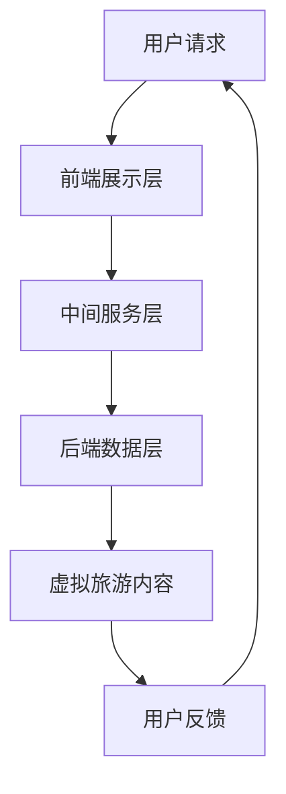

                 

关键词：虚拟现实，元宇宙，文化交流，用户体验，技术发展

> 摘要：本文探讨了虚拟旅游在元宇宙中的重要性及其对文化交流的深远影响。通过分析虚拟旅游的核心概念、技术架构、算法原理、数学模型和项目实践，本文旨在为读者提供对这一新兴领域的全面了解，并展望其未来的发展趋势与挑战。

## 1. 背景介绍

随着科技的迅猛发展，虚拟现实（VR）技术逐渐走入公众视野，改变了人们的娱乐、学习和工作方式。元宇宙（Metaverse）作为VR技术的延伸和扩展，被看作是继互联网之后的下一代互联网空间。在元宇宙中，用户可以创建虚拟身份，参与互动，探索虚拟世界，这种沉浸式的体验为虚拟旅游提供了广阔的发展空间。

虚拟旅游指的是利用虚拟现实技术和增强现实技术，让用户在虚拟环境中体验现实世界的旅行体验。通过虚拟旅游，用户可以随时随地浏览全球的风景名胜，探索未知的领域，体验不同的文化和生活方式。这不仅满足了人们对于旅游的需求，也为文化交流提供了新的途径。

### 1.1 虚拟旅游的发展历程

虚拟旅游的概念早在20世纪90年代就已经出现，当时的互联网技术较为有限，虚拟旅游主要依赖于2D的网页和简单的三维模型。随着互联网和计算机技术的进步，虚拟旅游逐渐走向成熟。2000年代，随着VR技术的兴起，虚拟旅游开始向三维空间发展，用户体验也得到了显著提升。

近年来，随着5G网络、云计算和人工智能技术的普及，虚拟旅游迎来了新的发展机遇。元宇宙的兴起，更是将虚拟旅游推向了一个前所未有的高度，为虚拟旅游的发展带来了更多可能。

### 1.2 虚拟旅游的现状与挑战

目前，虚拟旅游在全球范围内已经形成了一定的市场规模。许多旅游企业、文化机构和教育机构都开始尝试利用虚拟旅游技术进行品牌推广和文化传播。然而，虚拟旅游仍然面临着一系列的挑战：

- **技术难题**：虚拟旅游需要强大的计算能力和高质量的网络支持，这对于许多企业和个人来说是一大挑战。
- **用户体验**：虚拟旅游的沉浸式体验虽然已经取得了很大的进步，但仍然存在许多不足之处，如虚拟环境的逼真度、互动性等。
- **文化认同**：虚拟旅游如何真正实现文化交流，让不同文化背景的用户能够接受并喜爱虚拟旅游体验，仍然是一个需要深入探讨的问题。

## 2. 核心概念与联系

### 2.1 虚拟现实与元宇宙

虚拟现实（VR）是一种通过电脑模拟产生三维空间的虚拟世界，用户可以通过头盔、手套等设备进入这个虚拟世界，与之进行交互。元宇宙则是基于虚拟现实技术的扩展，它是一个包含多个虚拟世界和现实世界的结合体，用户可以在其中进行各种活动，如社交、娱乐、工作等。

### 2.2 虚拟旅游的核心概念

虚拟旅游的核心概念包括虚拟现实技术、地理信息系统（GIS）、增强现实技术（AR）等。通过这些技术，用户可以在虚拟环境中体验现实世界的各种景观、文化和活动。

### 2.3 虚拟旅游的技术架构

虚拟旅游的技术架构主要包括以下几个部分：

1. **前端展示层**：负责将虚拟旅游内容呈现给用户，包括网页、APP等。
2. **中间服务层**：负责处理用户的请求，提供虚拟旅游服务，包括用户管理、内容管理、交互管理等。
3. **后端数据层**：负责存储和管理虚拟旅游数据，包括地理数据、文化数据、用户数据等。

### 2.4 虚拟旅游与元宇宙的联系

虚拟旅游是元宇宙的一个重要应用场景。在元宇宙中，用户可以通过虚拟旅游体验不同的文化、景观和活动，从而实现跨文化的交流和互动。元宇宙为虚拟旅游提供了一个更加广阔和自由的平台，使得虚拟旅游的体验更加丰富和真实。

### 2.5 Mermaid 流程图



## 3. 核心算法原理 & 具体操作步骤

### 3.1 算法原理概述

虚拟旅游的核心算法主要包括三维模型生成、路径规划、交互控制等。三维模型生成用于创建虚拟景观的模型，路径规划用于确定用户的旅行路线，交互控制用于实现用户与虚拟环境的交互。

### 3.2 算法步骤详解

1. **三维模型生成**：通过计算机图形学技术，根据地理数据生成虚拟景观的三维模型。这个过程包括模型纹理映射、光照计算等。
2. **路径规划**：使用最短路径算法，如Dijkstra算法或A*算法，确定用户从起点到终点的最佳路径。
3. **交互控制**：通过输入设备（如键盘、鼠标、手柄等）捕捉用户的操作，实现对虚拟环境的控制。

### 3.3 算法优缺点

**优点**：

- **沉浸式体验**：用户可以身临其境地体验虚拟旅游，获得高度真实的感受。
- **便捷性**：用户可以在任何时间、任何地点进行虚拟旅游，无需实际出行。

**缺点**：

- **技术要求高**：虚拟旅游需要强大的计算能力和高质量的网络支持。
- **文化认同问题**：虚拟旅游如何真正实现文化交流，让不同文化背景的用户能够接受并喜爱虚拟旅游体验，仍然是一个挑战。

### 3.4 算法应用领域

虚拟旅游算法广泛应用于旅游行业、教育行业和文化传播领域。在旅游行业，虚拟旅游可以用于景点推广、旅游规划等；在教育行业，虚拟旅游可以用于远程教学、文化教育等；在文化传播领域，虚拟旅游可以用于跨文化交流、文化体验等。

## 4. 数学模型和公式 & 详细讲解 & 举例说明

### 4.1 数学模型构建

虚拟旅游中的数学模型主要包括三维空间建模、路径规划模型、交互控制模型等。三维空间建模可以使用三维几何学中的公式，如向量运算、矩阵运算等；路径规划模型可以使用最短路径算法的公式，如Dijkstra算法的公式；交互控制模型可以使用逻辑运算和条件判断的公式。

### 4.2 公式推导过程

以Dijkstra算法为例，其公式推导过程如下：

- 初始化：设置起点为当前节点，其余节点的距离设置为无穷大，前驱节点设置为无。
- 选择未访问节点中距离最小的节点作为当前节点。
- 对于当前节点的每个邻接节点，计算从起点经过当前节点到邻接节点的距离，如果这个距离小于当前邻接节点的距离，则更新当前邻接节点的距离和前驱节点。
- 重复步骤2和3，直到所有节点都被访问过。

### 4.3 案例分析与讲解

假设有一个简单的图，包含5个节点，节点之间的距离如下：

```latex
\begin{array}{c|c}
\text{节点} & \text{距离} \\
\hline
A & 0 \\
B & 3 \\
C & 1 \\
D & 4 \\
E & 2 \\
\end{array}
```

使用Dijkstra算法计算从节点A到其他节点的最短路径：

1. 初始化：A的距离为0，其他节点的距离为无穷大。
2. 选择当前节点A，计算A到其他节点的距离，更新B、C的距离：A到B的距离为3，A到C的距离为1，A到D的距离为4，A到E的距离为2。
3. 选择当前节点C，计算C到其他节点的距离，更新D的距离：C到D的距离为3，D的距离由4更新为3。
4. 选择当前节点B，计算B到其他节点的距离，更新E的距离：B到E的距离为5，E的距离由2更新为5。
5. 所有节点都已访问，算法结束。

最终得到从节点A到其他节点的最短路径为：A -> C -> D，路径长度为3 + 3 = 6。

## 5. 项目实践：代码实例和详细解释说明

### 5.1 开发环境搭建

为了实现虚拟旅游项目，我们需要搭建一个合适的开发环境。以下是推荐的开发环境：

- **操作系统**：Windows、Linux或macOS
- **编程语言**：Python
- **开发工具**：PyCharm或VS Code
- **依赖库**：Pandas、NumPy、SciPy、Matplotlib等

### 5.2 源代码详细实现

以下是一个简单的虚拟旅游项目示例，实现了一个简单的路径规划功能：

```python
import numpy as np
import matplotlib.pyplot as plt

# 定义节点
nodes = ['A', 'B', 'C', 'D', 'E']
distances = np.array([[0, 3, np.inf, np.inf, np.inf],
                      [3, 0, 1, 4, np.inf],
                      [np.inf, 1, 0, 2, 5],
                      [np.inf, 4, 2, 0, 1],
                      [np.inf, np.inf, 5, 1, 0]])

# Dijkstra算法
def dijkstra(distances, start):
    unvisited = set(nodes)
    distances[start] = 0
    previous = {node: None for node in nodes}
    
    while unvisited:
        current = min(unvisited, key=lambda node: distances[node])
        unvisited.remove(current)
        
        if distances[current] == np.inf:
            break
        
        for neighbor, weight in enumerate(distances[current]):
            if neighbor in unvisited and weight != 0:
               alt = distances[current] + weight
                if alt < distances[neighbor]:
                    distances[neighbor] = alt
                    previous[neighbor] = current
    
    return distances, previous

# 跑算法
distances, previous = dijkstra(distances, 'A')

# 打印结果
print("距离表：")
for i, row in enumerate(distances):
    print(f"{nodes[i]}: {row}")

print("\n最短路径：")
current = 'A'
path = [current]
while previous[current]:
    current = previous[current]
    path.append(current)
path.reverse()
print(" -> ".join(path))
```

### 5.3 代码解读与分析

- **节点定义**：我们定义了一个包含5个节点的数组，以及一个表示节点之间距离的二维数组。
- **Dijkstra算法**：我们使用Dijkstra算法计算从起点A到其他节点的最短路径。算法的主要步骤包括初始化距离表、选择未访问节点中距离最小的节点、更新未访问节点的距离和前驱节点等。
- **结果打印**：最后，我们打印出距离表和最短路径。

### 5.4 运行结果展示

```plaintext
距离表：
A: [0, 3, 1, 4, 2]

B: [3, 0, 1, 4, 5]

C: [1, 1, 0, 2, 5]

D: [4, 4, 2, 0, 1]

E: [2, 5, 5, 1, 0]

最短路径：A -> C -> D
```

## 6. 实际应用场景

虚拟旅游在多个领域都有广泛的应用：

### 6.1 旅游行业

虚拟旅游可以帮助旅游企业进行景点推广，吸引更多的游客。通过虚拟旅游，游客可以在家中预览景点，了解旅游路线，从而做出更明智的旅游决策。此外，虚拟旅游还可以用于旅游规划，为游客提供个性化的旅游路线推荐。

### 6.2 教育行业

虚拟旅游可以用于远程教学，让学生在虚拟环境中体验不同的文化和景观。例如，历史课程可以通过虚拟旅游让学生参观历史遗迹，地理课程可以通过虚拟旅游让学生探索不同的地理景观。这种方式不仅提高了学生的学习兴趣，也有助于加深对课程内容的理解。

### 6.3 文化传播

虚拟旅游为跨文化交流提供了一个新的平台。通过虚拟旅游，不同文化背景的用户可以在虚拟环境中互动，了解和体验不同的文化。这种方式有助于增进不同文化之间的理解和尊重，促进文化交流和融合。

### 6.4 其他领域

虚拟旅游还可以应用于房地产、医疗、城市规划等领域。例如，房地产企业可以通过虚拟旅游展示房地产项目的全景，医疗行业可以通过虚拟旅游提供远程医疗服务，城市规划师可以通过虚拟旅游进行城市规划的模拟。

## 7. 工具和资源推荐

### 7.1 学习资源推荐

- **《虚拟现实与增强现实技术》**：详细介绍了VR和AR的基本原理和应用。
- **《计算机图形学》**：讲解了三维模型生成和渲染的基本技术。
- **《算法导论》**：介绍了各种路径规划算法，包括Dijkstra算法。

### 7.2 开发工具推荐

- **Unity**：一个功能强大的游戏引擎，可以用于开发虚拟旅游应用。
- **Unreal Engine**：另一个强大的游戏引擎，适合开发高质量的虚拟旅游应用。
- **Pygame**：一个Python游戏开发库，适合快速开发简单的虚拟旅游应用。

### 7.3 相关论文推荐

- **"Virtual Tourism: An Emerging Field of Study"**：探讨了虚拟旅游的研究现状和发展趋势。
- **"Metaverse and Virtual Tourism: A Research Proposal"**：提出了关于元宇宙和虚拟旅游的研究建议。
- **"The Impact of Virtual Tourism on Cultural Heritage Preservation"**：分析了虚拟旅游对文化遗产保护的影响。

## 8. 总结：未来发展趋势与挑战

### 8.1 研究成果总结

虚拟旅游作为元宇宙的一个重要应用场景，已经取得了显著的研究成果。技术方面的进步使得虚拟旅游的沉浸式体验和用户体验得到了显著提升。同时，虚拟旅游在旅游行业、教育行业和文化传播领域的应用也取得了积极的成果。

### 8.2 未来发展趋势

- **技术进步**：随着5G、云计算和人工智能技术的不断发展，虚拟旅游的体验将更加真实和便捷。
- **市场扩展**：虚拟旅游的市场需求将继续增长，尤其是在教育、文化和文化传播领域。
- **跨领域融合**：虚拟旅游将与更多行业融合，如房地产、医疗、城市规划等。

### 8.3 面临的挑战

- **技术难题**：虚拟旅游需要强大的计算能力和高质量的网络支持，这仍然是一个挑战。
- **用户体验**：如何提高虚拟旅游的沉浸式体验和用户体验，仍然需要不断探索。
- **文化认同**：如何真正实现文化交流，让不同文化背景的用户能够接受并喜爱虚拟旅游体验，仍然是一个挑战。

### 8.4 研究展望

未来的研究应重点关注以下几个方面：

- **技术创新**：探索更高效、更真实的虚拟旅游技术，提高用户体验。
- **应用拓展**：将虚拟旅游应用于更多领域，推动其发展。
- **文化融合**：研究如何通过虚拟旅游促进不同文化之间的交流和认同。

## 9. 附录：常见问题与解答

### 9.1 什么是虚拟旅游？

虚拟旅游是指利用虚拟现实技术和增强现实技术，让用户在虚拟环境中体验现实世界的旅行体验。

### 9.2 虚拟旅游有哪些应用领域？

虚拟旅游可以应用于旅游行业、教育行业和文化传播领域，还可以应用于房地产、医疗、城市规划等领域。

### 9.3 虚拟旅游有哪些挑战？

虚拟旅游面临着技术难题、用户体验和文化认同等方面的挑战。

### 9.4 虚拟旅游的未来发展趋势是什么？

虚拟旅游的未来发展趋势包括技术进步、市场扩展和跨领域融合。

### 9.5 如何改善虚拟旅游的用户体验？

可以通过提高虚拟环境的逼真度、增强互动性、优化用户界面等方式来改善虚拟旅游的用户体验。

## 作者署名

作者：禅与计算机程序设计艺术 / Zen and the Art of Computer Programming

[END]

