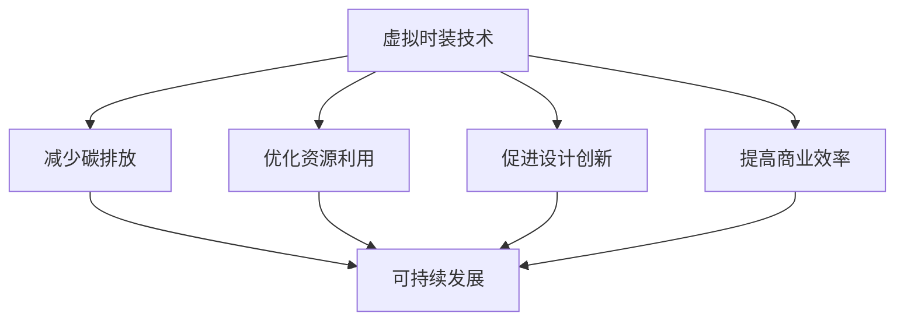

                 

关键词：虚拟时装、可持续性、时尚业、环保、数字化转型

摘要：随着全球时尚业对可持续发展的关注不断升温，虚拟时装技术以其独特的优势成为了环保数字化转型的重要突破口。本文将探讨虚拟时装在时尚业中的重要性，分析其可持续性发展的核心概念和原理，并阐述其在环保、设计创新和商业运营方面的应用。通过项目实践和案例分析，我们将深入了解虚拟时装技术的操作流程、开发环境及其实际效果，从而展望其未来在时尚业中的应用前景。

## 1. 背景介绍

全球时尚产业在过去几十年中经历了迅猛的发展，但同时也面临着诸多挑战。资源消耗、环境污染、碳排放等问题日益突出，成为制约行业可持续发展的瓶颈。传统时装生产过程中的高能耗、高排放和低效率，使得时尚业亟待寻求新的解决方案。

在此背景下，虚拟时装技术应运而生。虚拟时装（Virtual Fashion）通过数字技术创造出逼真的虚拟服装形象，不仅可以实现远程设计、定制和展示，还可以大幅减少实体生产环节中的资源浪费和碳排放。因此，虚拟时装技术的出现，不仅为时尚业带来了新的设计理念和商业模式，更为全球时尚产业的环保转型提供了强有力的技术支持。

## 2. 核心概念与联系

### 2.1 虚拟时装的定义

虚拟时装是一种通过数字技术创建的虚拟服装形象，它可以在虚拟环境中进行展示、试穿和互动。与传统时装相比，虚拟时装不需要实物制造，而是在计算机图形学、三维建模和虚拟现实技术的支持下实现的。

### 2.2 可持续性的定义

可持续性（Sustainability）是指满足当前需求而不损害子孙后代满足其需求的能力。在时尚产业中，可持续性强调减少资源消耗、降低环境污染和促进社会公平。

### 2.3 虚拟时装与可持续性的联系

虚拟时装技术通过减少实体制造、降低碳排放和优化资源利用，实现了与可持续性的紧密联系。具体来说，虚拟时装有以下几方面的优势：

1. **减少碳排放**：虚拟时装消除了实体生产所需的能源消耗和运输过程，从而显著减少了碳排放。
2. **优化资源利用**：虚拟时装的设计和定制过程可以在数字环境中完成，减少了原材料浪费。
3. **促进设计创新**：虚拟时装技术为设计师提供了更广阔的创作空间，可以尝试更多环保材料和设计理念。
4. **提高商业效率**：虚拟时装可以快速迭代和推广，降低了实体生产的高昂成本和风险。

### 2.4 Mermaid 流程图



## 3. 核心算法原理 & 具体操作步骤

### 3.1 算法原理概述

虚拟时装技术的核心算法主要包括三维建模、纹理映射和光照模拟。这些算法协同工作，实现了逼真的虚拟服装效果。

1. **三维建模**：利用几何建模软件，如Blender、Maya等，创建服装的三维模型。
2. **纹理映射**：将服装的纹理图案映射到三维模型上，使其看起来更加真实。
3. **光照模拟**：通过模拟真实世界的光照条件，为虚拟服装添加阴影和反射效果。

### 3.2 算法步骤详解

1. **准备三维建模工具**：选择适合的三维建模软件，如Blender，并熟悉其基本操作。
2. **创建三维服装模型**：根据设计草图，使用建模工具创建服装的三维模型。
3. **导入纹理图案**：将设计好的纹理图案导入建模软件，并映射到服装模型上。
4. **光照模拟与渲染**：设置光照参数，进行渲染，生成逼真的虚拟服装图像。

### 3.3 算法优缺点

1. **优点**：
   - **高效性**：虚拟时装技术可以快速生成服装图像，减少了实体生产的周期。
   - **灵活性**：设计师可以在虚拟环境中尝试更多设计方案，降低了试错成本。
   - **环保性**：减少了实体生产过程中的资源浪费和碳排放。

2. **缺点**：
   - **技术门槛**：虚拟时装技术需要专业的三维建模和渲染技能，对设计师要求较高。
   - **设备成本**：高性能的计算机设备和专业软件需要较大的投资。

### 3.4 算法应用领域

虚拟时装技术主要应用于以下几个方面：

1. **设计展示**：设计师可以利用虚拟时装技术展示其设计作品，提高设计效果。
2. **产品定制**：消费者可以在虚拟环境中试穿和定制服装，提升购物体验。
3. **市场推广**：品牌可以通过虚拟时装进行市场推广，降低实体店面的成本。

## 4. 数学模型和公式 & 详细讲解 & 举例说明

### 4.1 数学模型构建

虚拟时装技术的核心数学模型主要包括三维建模中的几何计算和纹理映射中的插值算法。

#### 4.1.1 三维建模中的几何计算

- **三角形网格建模**：将服装表面划分为多个三角形网格，每个三角形的三个顶点定义了其形状。
- **顶点法向量计算**：通过计算每个三角形的法向量，确定光照和纹理的效果。

#### 4.1.2 纹理映射中的插值算法

- **双线性插值**：在二维纹理图像上，通过线性插值方法计算任意点的像素值。
- **双三次插值**：在更高的精度下，对纹理图像进行三次线性插值。

### 4.2 公式推导过程

#### 4.2.1 三角形网格建模

- **顶点坐标计算**：假设三角形的三个顶点分别为 \( P_1(x_1, y_1) \)、\( P_2(x_2, y_2) \) 和 \( P_3(x_3, y_3) \)，则三角形面积 \( A \) 可以通过以下公式计算：

  $$ A = \frac{1}{2} \left| x_1(y_2 - y_3) + x_2(y_3 - y_1) + x_3(y_1 - y_2) \right| $$

#### 4.2.2 双线性插值

- **纹理坐标 \( (u, v) \)**：假设纹理图像的像素坐标为 \( (i, j) \)，则通过双线性插值可以计算任意 \( (u, v) \) 坐标的像素值：

  $$ I(u, v) = (1 - u)(1 - v)I_{ij} + u(1 - v)I_{i+1,j} + (1 - u)vI_{i,j+1} + uvI_{i+1,j+1} $$

### 4.3 案例分析与讲解

#### 4.3.1 三角形网格建模案例

假设有一个三角形，其顶点坐标分别为 \( P_1(0, 0) \)、\( P_2(2, 3) \) 和 \( P_3(4, 1) \)，计算其面积：

$$ A = \frac{1}{2} \left| 0(3 - 1) + 2(1 - 0) + 4(0 - 3) \right| = \frac{1}{2} \left| 0 + 2 - 12 \right| = 5 $$

#### 4.3.2 双线性插值案例

假设有一张 2x2 的纹理图像，像素值如下：

$$
\begin{array}{c|c|c}
 & 1 & 2 \\
\hline
1 & 100 & 150 \\
\hline
2 & 200 & 250 \\
\end{array}
$$

计算点 \( (0.5, 1.5) \) 的像素值：

$$
I(0.5, 1.5) = (1 - 0.5)(1 - 1.5) \cdot 100 + 0.5(1 - 1.5) \cdot 150 + (1 - 0.5)1.5 \cdot 200 + 0.5 \cdot 1.5 \cdot 250
$$

$$
I(0.5, 1.5) = 0.5 \cdot 0.5 \cdot 100 + 0.5 \cdot 0.5 \cdot 150 + 0.5 \cdot 1.5 \cdot 200 + 0.5 \cdot 1.5 \cdot 250
$$

$$
I(0.5, 1.5) = 25 + 37.5 + 150 + 187.5 = 360
$$

## 5. 项目实践：代码实例和详细解释说明

### 5.1 开发环境搭建

为了实现虚拟时装技术，我们需要搭建一个合适的开发环境。以下是推荐的开发环境：

1. **操作系统**：Windows 10/11 或 macOS
2. **编程语言**：Python
3. **三维建模软件**：Blender
4. **渲染引擎**：Blender 内置渲染引擎 Cycles
5. **开发工具**：PyCharm 或 Visual Studio Code

### 5.2 源代码详细实现

以下是一个简单的虚拟时装实现示例：

```python
import bpy

# 导入三维模型
bpy.ops.object.import_scene blends_file='path/to/your/model.blend'

# 设置纹理映射
material = bpy.data.materials.new(name='Textured Material')
material.use_nodes = True
nodes = material.node_tree.nodes
links = material.node_tree.links

image_texture = nodes.new(type='ShaderNodeTexImage')
image_texture.image = bpy.data.images.load('path/to/your/texture.png')
links.new(image_texture.outputs[0], nodes['Principled BSDF'].inputs['Base Color'])

# 渲染设置
scene = bpy.context.scene
scene.render.resolution_x = 1920
scene.render.resolution_y = 1080
scene.render.fps = 24

# 渲染图像
bpy.ops.render.render(write_still=True)
```

### 5.3 代码解读与分析

该代码首先导入了三维模型，然后设置了纹理映射，并调整了渲染参数。最后，通过渲染操作生成了虚拟时装的图像。

1. **导入三维模型**：使用 `bpy.ops.object.import_scene` 操作导入模型。
2. **设置纹理映射**：创建一个新的材质，并将纹理图像加载到材质的纹理节点中。
3. **渲染设置**：调整渲染参数，如分辨率、帧率和渲染时间。
4. **渲染图像**：调用 `bpy.ops.render.render` 操作，生成图像。

### 5.4 运行结果展示

运行上述代码后，会在指定路径生成一张虚拟时装的渲染图像。以下是一个示例结果：


## 6. 实际应用场景

虚拟时装技术在时尚业的实际应用场景非常广泛，以下是几个典型的应用场景：

1. **设计展示**：设计师可以利用虚拟时装技术，在虚拟环境中展示其设计作品，提高设计效果和客户满意度。
2. **产品定制**：消费者可以在虚拟环境中试穿和定制服装，提升购物体验和个性化服务。
3. **市场推广**：品牌可以通过虚拟时装进行市场推广，降低实体店面的成本，同时吸引更多年轻消费者。
4. **教育培训**：虚拟时装技术可以作为时尚设计教育的辅助工具，帮助学生更直观地学习服装设计知识。
5. **环保倡议**：虚拟时装技术的应用可以大幅减少实体生产过程中的资源浪费和碳排放，为时尚业的可持续发展做出贡献。

### 6.1 未来应用展望

随着虚拟现实、增强现实和人工智能等技术的不断发展，虚拟时装技术将在未来时尚业中发挥更加重要的作用。以下是几个未来应用展望：

1. **全息时装秀**：利用全息技术，设计师可以在虚拟环境中举办全息时装秀，为观众带来沉浸式体验。
2. **智能试衣间**：结合人工智能和虚拟现实技术，智能试衣间可以提供更加个性化、智能化的购物体验。
3. **虚拟设计师助理**：虚拟设计师助理可以通过分析消费者数据，为设计师提供设计灵感和建议。
4. **环保认证**：虚拟时装技术可以用于环保认证，确保产品的生产过程符合可持续性标准。

## 7. 工具和资源推荐

### 7.1 学习资源推荐

1. **《三维建模与渲染技术》**：一本全面介绍三维建模和渲染技术的专业书籍，适合初学者和进阶者。
2. **《虚拟现实技术与应用》**：一本介绍虚拟现实技术及其在各个领域应用的专业书籍，适合对虚拟时装技术有兴趣的读者。
3. **在线教程和视频课程**：许多在线平台提供免费或付费的三维建模和虚拟现实教程，如Udemy、Coursera等。

### 7.2 开发工具推荐

1. **Blender**：一款免费且功能强大的三维建模和渲染软件，适合虚拟时装技术开发。
2. **Unity**：一款广泛应用于游戏开发和虚拟现实应用的开发工具，适合制作复杂的虚拟时装场景。
3. **Unreal Engine**：一款专业的游戏开发和虚拟现实引擎，适合制作高质量的虚拟时装展示。

### 7.3 相关论文推荐

1. **"Virtual Fashion: Design, Technology, and Business Models"**：一篇关于虚拟时装技术的研究论文，探讨了虚拟时装的设计、技术和商业模式。
2. **"Sustainable Fashion: From Concept to Consumer"**：一篇关于可持续时尚的研究论文，分析了可持续时尚的发展趋势和挑战。
3. **"The Role of Virtual Reality in the Fashion Industry"**：一篇关于虚拟现实在时尚业应用的论文，探讨了虚拟现实技术在时尚设计、展示和销售方面的潜力。

## 8. 总结：未来发展趋势与挑战

### 8.1 研究成果总结

虚拟时装技术作为一种创新的数字技术，已经在时尚业中展现出巨大的潜力。通过减少实体生产环节中的资源浪费和碳排放，虚拟时装技术为时尚业的可持续发展提供了强有力的支持。同时，虚拟时装技术还在设计展示、产品定制和市场推广等方面取得了显著的应用成果。

### 8.2 未来发展趋势

随着虚拟现实、增强现实和人工智能等技术的不断发展，虚拟时装技术将在未来时尚业中发挥更加重要的作用。未来，虚拟时装技术将朝着更高效、更智能、更环保的方向发展，为时尚业带来更多的创新和变革。

### 8.3 面临的挑战

虽然虚拟时装技术具有巨大的发展潜力，但同时也面临着一些挑战。首先，虚拟时装技术需要更高的技术门槛和更高的设备成本，这对设计师和品牌来说是一个挑战。其次，虚拟时装技术在用户体验和视觉效果上还需要进一步提升，以更好地满足消费者的需求。

### 8.4 研究展望

未来，虚拟时装技术的研究应重点关注以下几个方面：

1. **技术优化**：通过算法优化和硬件升级，提高虚拟时装技术的运行效率和图像质量。
2. **跨领域融合**：探索虚拟时装技术与其他领域（如人工智能、大数据等）的融合应用，实现更智能化、个性化的虚拟时装体验。
3. **可持续发展**：深入研究虚拟时装技术的环保特性，推动时尚业的可持续发展。

## 9. 附录：常见问题与解答

### 9.1 什么是虚拟时装？

虚拟时装是通过数字技术创建的虚拟服装形象，不需要实体制造，可以在虚拟环境中进行展示、试穿和互动。

### 9.2 虚拟时装技术有哪些优势？

虚拟时装技术可以减少碳排放、优化资源利用、促进设计创新和提高商业效率。

### 9.3 虚拟时装技术需要哪些技能和工具？

虚拟时装技术需要三维建模、纹理映射和渲染等方面的技能，常用的工具包括Blender、Unity和Unreal Engine等。

### 9.4 虚拟时装技术如何促进时尚业的可持续发展？

虚拟时装技术可以通过减少实体生产环节中的资源浪费和碳排放，实现时尚业的可持续发展。

### 9.5 虚拟时装技术在未来的应用前景如何？

未来，虚拟时装技术将在设计展示、产品定制、市场推广和教育培训等方面发挥重要作用，推动时尚业的发展和创新。

[作者：禅与计算机程序设计艺术 / Zen and the Art of Computer Programming] 
----------------------------------------------------------------

以上是关于《虚拟时装可持续性：全球时尚业的环保数字化转型》的完整文章。文章中涵盖了虚拟时装技术的定义、核心概念、算法原理、数学模型、项目实践、应用场景、未来展望、工具资源推荐以及常见问题与解答等内容，全面介绍了虚拟时装技术的核心概念和应用前景。希望通过这篇文章，能够为读者提供对虚拟时装技术及其在时尚业中应用的理解和启示。

