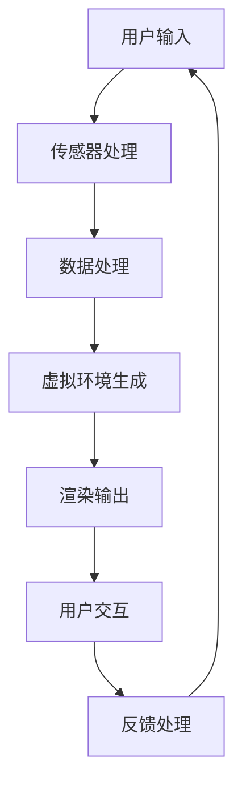

                 

关键词：虚拟现实，创业，沉浸式体验，经济，技术架构，市场策略，用户体验，未来趋势

## 摘要

本文旨在探讨虚拟现实（VR）领域中的创业机会，并分析如何通过构建沉浸式体验来推动体验经济的发展。文章首先回顾了虚拟现实技术的起源和演进，随后详细介绍了沉浸式体验的概念及其对商业模式的潜在影响。接下来，本文将从技术架构、市场策略、用户体验等方面，为创业者提供构建虚拟现实体验经济的一些建议和案例。最后，文章将对虚拟现实技术的未来发展趋势与挑战进行展望，并提出相应的解决方案。

## 1. 背景介绍

虚拟现实（Virtual Reality，VR）是一种通过电脑模拟产生的三维空间，用户可以通过特殊设备如头戴显示器（HMD）和手柄等，进入这个虚拟的世界并进行互动。VR技术起源于20世纪50年代，但直到21世纪初，随着计算机性能的提升和显示技术的进步，VR才开始逐渐走向大众市场。

沉浸式体验则是在VR技术基础上进一步发展的概念，它强调用户在虚拟环境中的感觉、情感和认知参与度。相比于传统的计算机模拟，沉浸式体验更接近于现实世界的感官体验，能够提供更为丰富的感官刺激和交互体验。这种体验不仅限于视觉和听觉，还包括触觉、嗅觉等感官的模拟，从而创造出更加真实的虚拟环境。

近年来，随着5G通信技术的普及、高性能计算能力的提升以及人工智能的快速发展，虚拟现实技术迎来了新一轮的发展浪潮。同时，随着消费者对高质量体验需求的增加，虚拟现实在娱乐、教育、医疗、旅游等行业中的应用前景日益广阔。这为创业者提供了丰富的商业机会，也为体验经济的构建提供了新的动力。

### 1.1 虚拟现实技术的发展历程

虚拟现实技术的发展可以分为几个重要阶段：

- **初期探索（1950s-1960s）**：在这个阶段，科学家和工程师开始探索虚拟环境的概念，例如Ivan Sutherland在1968年展示了世界上第一个头戴显示器（HMD）。

- **计算机图形学兴起（1970s-1980s）**：随着计算机图形学的发展，虚拟现实技术逐渐应用于仿真和训练等领域。例如，飞行员训练模拟器就是这一时期的重要应用。

- **互联网普及（1990s）**：互联网的普及使得虚拟现实技术得以向大众市场扩散，但受限于当时的技术条件，VR设备价格昂贵，用户体验有限。

- **现代发展（2000s-2020s）**：21世纪初，随着硬件性能的提升和显示技术的突破，VR技术开始走向成熟。Oculus Rift、HTC Vive等设备的推出，标志着VR从实验室走向消费市场。

### 1.2 沉浸式体验的兴起

沉浸式体验的兴起得益于以下几个因素的推动：

- **显示技术进步**：高分辨率显示器和更快刷新率的屏幕使得虚拟环境的视觉效果更加逼真。

- **传感器技术发展**：传感器技术的进步使得VR设备能够更准确地捕捉用户的动作和位置，提供更为自然的交互体验。

- **5G通信技术**：5G技术的普及降低了延迟，提高了数据传输速度，使得远程VR体验变得更加流畅和实时。

- **人工智能应用**：人工智能技术的发展使得虚拟环境中的交互更加智能化，能够根据用户的行为和偏好进行自适应调整。

### 1.3 体验经济的特点与潜力

体验经济（Experience Economy）是继商品经济、服务经济之后的一种新型经济形态，强调消费者在消费过程中的参与感和体验感。与传统的商品和服务相比，体验经济更加注重消费者的情感需求和个性满足。

虚拟现实技术的沉浸式体验为体验经济的构建提供了新的可能。通过创造高度真实的虚拟环境，用户可以在虚拟世界中实现各种个性化的体验，从而获得独特的情感体验和记忆。这种体验不仅能够提高用户对产品的满意度，还能增强品牌忠诚度和市场竞争力。

### 1.4 虚拟现实创业的机遇与挑战

虚拟现实创业的机遇在于：

- **技术突破**：随着技术的不断进步，虚拟现实设备的性能和用户体验不断提升，为创业者提供了广阔的发展空间。

- **市场需求**：消费者对高质量体验的需求日益增长，为虚拟现实产品和服务提供了巨大的市场需求。

- **跨界合作**：虚拟现实技术可以与多个行业实现跨界融合，为创业者提供了丰富的商业模式创新机会。

然而，虚拟现实创业也面临着一些挑战：

- **技术门槛**：虚拟现实技术涉及多个领域，如计算机图形学、传感器技术、人工智能等，技术门槛较高。

- **用户接受度**：虽然虚拟现实市场前景广阔，但用户接受度仍需提高，尤其是大众市场。

- **商业模式探索**：如何在竞争激烈的市场中找到可行的商业模式，是创业者需要解决的关键问题。

### 1.5 本文结构

本文将分为以下几个部分：

- **2. 核心概念与联系**：介绍虚拟现实和沉浸式体验的核心概念及其相互联系。
- **3. 核心算法原理 & 具体操作步骤**：详细阐述虚拟现实技术的核心算法原理和具体操作步骤。
- **4. 数学模型和公式 & 详细讲解 & 举例说明**：介绍虚拟现实技术中的数学模型和公式，并通过案例进行分析。
- **5. 项目实践：代码实例和详细解释说明**：提供虚拟现实项目的代码实例和详细解释。
- **6. 实际应用场景**：探讨虚拟现实技术在各行业的实际应用场景。
- **7. 工具和资源推荐**：推荐学习资源、开发工具和相关论文。
- **8. 总结：未来发展趋势与挑战**：总结研究成果，展望未来发展趋势和挑战。

## 2. 核心概念与联系

### 2.1 虚拟现实（VR）

虚拟现实（Virtual Reality，VR）是一种通过计算机模拟产生三维空间，使用户可以在其中进行互动和体验的技术。VR的关键特点是沉浸式体验，即用户在虚拟环境中感受到的逼真程度和交互自然度。VR技术涉及多个领域，包括计算机图形学、人机交互、传感器技术等。

虚拟现实的核心概念包括：

- **三维空间**：虚拟现实通过计算机图形学技术生成三维模型，用户可以在其中自由移动和交互。
- **头戴显示器（HMD）**：头戴显示器是VR设备的核心组件，通过覆盖眼睛提供虚拟的三维视觉体验。
- **交互设备**：交互设备如手柄、手套等，使用户能够与虚拟环境进行物理交互。
- **传感技术**：传感器技术用于捕捉用户的位置、动作和手势，提供更为自然的交互体验。

### 2.2 沉浸式体验

沉浸式体验（Immersive Experience）是一种通过高度真实的虚拟环境，使用户在感官和情感上深度参与的技术。沉浸式体验不仅限于视觉和听觉，还包括触觉、嗅觉等多种感官的模拟，从而创造出一个接近现实世界的虚拟环境。

沉浸式体验的核心概念包括：

- **多感官刺激**：通过视觉、听觉、触觉等多种感官的模拟，为用户提供全方位的感官体验。
- **情感参与**：沉浸式体验能够激发用户的情感参与，使其在虚拟环境中产生共鸣和情感投入。
- **交互自然度**：通过高级的人机交互技术，使用户在虚拟环境中的交互感觉自然流畅。
- **个性化定制**：根据用户的偏好和行为，虚拟环境能够动态调整，提供个性化的体验。

### 2.3 虚拟现实与沉浸式体验的联系

虚拟现实和沉浸式体验是密切相关的两个概念。虚拟现实为沉浸式体验提供了基础技术支持，而沉浸式体验则通过高度真实的虚拟环境，实现了用户在感官和情感上的深度参与。

虚拟现实与沉浸式体验的联系可以从以下几个方面理解：

- **技术基础**：虚拟现实技术为沉浸式体验提供了三维空间和交互设备，使沉浸式体验成为可能。
- **用户体验**：沉浸式体验通过多感官刺激和情感参与，提升了虚拟现实技术的用户体验。
- **应用场景**：虚拟现实技术在娱乐、教育、医疗、旅游等领域的应用，都可以通过沉浸式体验来实现更丰富的用户体验。
- **商业模式**：虚拟现实和沉浸式体验的结合，为创业者提供了新的商业模式创新机会，如虚拟旅游、在线教育、虚拟商场等。

### 2.4 Mermaid 流程图

下面是虚拟现实技术架构的Mermaid流程图，展示了各个关键组件和它们之间的联系。



### 2.5 虚拟现实技术的核心算法原理

虚拟现实技术的核心算法原理主要包括三维空间建模、渲染技术、交互技术等方面。

#### 3.1 三维空间建模

三维空间建模是虚拟现实技术的核心之一，它涉及到如何通过计算机图形学技术生成虚拟的三维场景。主要算法包括：

- **多边形建模**：通过多边形（如三角形）来构建三维模型。
- **网格建模**：使用网格来表示三维物体的表面，网格的密度和形状决定了模型的细节程度。
- **表面纹理映射**：通过将纹理图像映射到三维模型上，增加模型的细节和真实感。

#### 3.2 渲染技术

渲染技术是虚拟现实中的另一个关键算法，它涉及到如何将三维模型转换为用户可感知的二维图像。主要算法包括：

- **光追踪**：模拟光线在虚拟环境中的传播，生成逼真的光影效果。
- **基于物理的渲染**：使用物理原理（如光学、材料学等）来渲染场景，提高真实感。
- **实时渲染**：在用户交互时实时生成图像，提供流畅的体验。

#### 3.3 交互技术

交互技术是虚拟现实体验的重要组成部分，它涉及到用户如何与虚拟环境进行交互。主要算法包括：

- **手势识别**：通过计算机视觉技术识别用户的手势，实现手势交互。
- **语音识别**：通过语音识别技术实现语音交互。
- **虚拟现实控制器**：使用虚拟现实控制器（如手柄、手套等）进行物理交互。

### 2.6 具体操作步骤

构建虚拟现实体验的具体操作步骤可以分为以下几个阶段：

#### 2.6.1 需求分析

在开始构建虚拟现实体验之前，首先需要明确用户需求和目标。这包括确定虚拟环境的主题、目标用户群体以及预期的体验效果。

#### 2.6.2 场景设计

根据需求分析的结果，设计虚拟环境的场景。这包括选择合适的背景、角色、物品等元素，以及确定场景的空间布局和交互逻辑。

#### 2.6.3 三维建模

使用三维建模软件（如Blender、Maya等）创建虚拟环境中的三维模型。这包括创建物体、设置材质和纹理，以及调整模型的细节。

#### 2.6.4 渲染与优化

将三维模型渲染成二维图像，使用渲染软件（如Unity、Unreal Engine等）进行优化，提高渲染效果和性能。

#### 2.6.5 交互设计

设计虚拟环境中的交互逻辑，包括用户如何与虚拟环境进行交互，以及虚拟环境如何响应用户的动作和输入。

#### 2.6.6 系统集成与测试

将各个组件集成到虚拟现实系统中，并进行测试和调试，确保系统的稳定性和用户体验。

### 2.7 算法优缺点

#### 3.1 优点

- **高度真实感**：虚拟现实技术通过三维建模和渲染技术，能够生成高度真实的虚拟环境，为用户提供沉浸式体验。
- **多样化交互方式**：虚拟现实技术支持多种交互方式，如手势识别、语音识别和虚拟现实控制器，提高了用户的互动性和参与度。
- **广泛应用领域**：虚拟现实技术在娱乐、教育、医疗、旅游等行业都有广泛应用，为各行业提供了创新的解决方案。

#### 3.2 缺点

- **技术门槛较高**：虚拟现实技术涉及多个领域，如计算机图形学、传感器技术、人工智能等，技术门槛较高，需要专业的技术团队。
- **用户体验不一致**：由于虚拟现实设备的硬件和软件差异，用户体验可能存在不一致性，影响整体体验效果。
- **硬件成本高**：虚拟现实设备（如头戴显示器、手柄等）的成本较高，限制了大众市场的普及。

### 2.8 算法应用领域

虚拟现实技术的核心算法在多个领域都有广泛的应用：

- **娱乐产业**：虚拟现实技术被广泛应用于游戏、电影、虚拟旅游等领域，为用户提供沉浸式的娱乐体验。
- **教育培训**：虚拟现实技术可以创建逼真的教学场景，提供互动式的学习体验，提高教育效果。
- **医疗领域**：虚拟现实技术用于医学模拟、康复训练等，为医生和患者提供创新的医疗解决方案。
- **工业制造**：虚拟现实技术用于产品设计和制造过程，提高生产效率和质量。
- **旅游行业**：虚拟现实技术让用户可以远程体验旅游地点，为旅游业提供新的商业模式。

## 3. 数学模型和公式

### 3.1 数学模型构建

虚拟现实技术中的数学模型主要用于描述和模拟虚拟环境中的物理现象和交互行为。以下是几个关键的数学模型：

#### 3.1.1 几何模型

几何模型用于描述虚拟环境中的物体形状和空间关系。主要模型包括：

- **多面体模型**：使用多边形（如三角形）来描述物体表面。
- **贝塞尔曲面模型**：使用贝塞尔曲面来描述复杂的物体形状。
- **蒙皮模型**：通过蒙皮技术将二维图像映射到三维物体表面。

#### 3.1.2 光线追踪模型

光线追踪模型用于模拟光线在虚拟环境中的传播和反射。主要模型包括：

- **蒙特卡洛光线追踪**：通过随机采样模拟光线传播，计算光线与物体表面的交互。
- **基于物理的渲染模型**：使用物理原理（如光学、材料学等）来计算光线与物体表面的交互，生成逼真的光影效果。

#### 3.1.3 交互模型

交互模型用于描述用户与虚拟环境之间的交互行为。主要模型包括：

- **物理仿真模型**：使用物理仿真技术模拟用户动作对虚拟环境的影响，如碰撞检测、力反馈等。
- **行为模型**：使用规则和行为树等模型来描述虚拟环境中角色的行为。

### 3.2 公式推导过程

以下是一个简单示例，说明如何推导虚拟现实中的光线追踪公式：

#### 3.2.1 光线传播方程

假设光线从点 \( P_0 \) 发出，沿向量 \( \mathbf{d} \) 方向传播，遇到物体表面点 \( P \) 后发生反射或折射。光线传播方程可以表示为：

\[ \mathbf{P}(t) = P_0 + t\mathbf{d} \]

其中，\( t \) 为时间，\( \mathbf{P}(t) \) 为光线在时间 \( t \) 时的位置。

#### 3.2.2 反射方程

当光线遇到光滑表面时，会发生反射。反射方程可以表示为：

\[ \mathbf{r} = \mathbf{d} - 2(\mathbf{n} \cdot \mathbf{d})\mathbf{n} \]

其中，\( \mathbf{r} \) 为反射光线的方向，\( \mathbf{n} \) 为法线方向，\( \mathbf{d} \) 为入射光线的方向。

#### 3.2.3 折射方程

当光线遇到透明介质时，会发生折射。折射方程可以表示为：

\[ \mathbf{t} = \left(\frac{n_2}{n_1}\right)\left(\mathbf{d} - \frac{\mathbf{n} \cdot \mathbf{d}}{\mathbf{n} \cdot \mathbf{n}}\mathbf{n}\right) \]

其中，\( \mathbf{t} \) 为折射光线的方向，\( n_1 \) 和 \( n_2 \) 分别为两种介质的折射率，\( \mathbf{n} \) 为法线方向。

### 3.3 案例分析与讲解

以下是一个简单的虚拟现实项目案例，用于解释数学模型的应用和公式推导。

#### 3.3.1 项目背景

假设我们要开发一款虚拟现实游戏，游戏中有一个房间，玩家需要在一个虚拟的球场上踢足球。我们需要使用数学模型和公式来模拟足球的运动和碰撞。

#### 3.3.2 几何模型

首先，我们需要使用几何模型来创建足球场和足球的模型。我们可以使用多面体模型来创建球场，使用贝塞尔曲面模型来创建足球的表面。

#### 3.3.3 光线追踪模型

接下来，我们需要使用光线追踪模型来模拟光线在虚拟环境中的传播。当玩家在球场上踢足球时，光线会从玩家的视角出发，与足球和球场表面进行交互。

#### 3.3.4 交互模型

最后，我们需要使用交互模型来模拟足球的运动和碰撞。当足球被踢出时，我们需要使用物理仿真模型来计算足球的运动轨迹和碰撞效果。

#### 3.3.5 公式推导

为了模拟足球的运动，我们可以使用以下公式：

\[ \mathbf{v}(t) = \mathbf{v}_0 + at \]

其中，\( \mathbf{v}(t) \) 为足球在时间 \( t \) 的速度，\( \mathbf{v}_0 \) 为初始速度，\( a \) 为加速度。

当足球发生碰撞时，我们需要使用以下公式来计算碰撞效果：

\[ \mathbf{p}_2 = \mathbf{p}_1 + \frac{m_1 - m_2}{m_1 + m_2}(\mathbf{v}_1 - \mathbf{v}_2) \]

其中，\( \mathbf{p}_1 \) 和 \( \mathbf{p}_2 \) 分别为足球和墙壁的质量，\( \mathbf{v}_1 \) 和 \( \mathbf{v}_2 \) 分别为足球和墙壁的速度。

## 4. 项目实践：代码实例和详细解释说明

### 4.1 开发环境搭建

在进行虚拟现实项目开发之前，我们需要搭建合适的开发环境。以下是搭建虚拟现实开发环境的基本步骤：

1. **安装Unity引擎**：Unity是一个流行的游戏和虚拟现实开发平台，可以从Unity官网下载并安装。

2. **配置VR设备**：根据您的虚拟现实设备（如Oculus Rift、HTC Vive等），按照设备制造商的说明进行设备配置。

3. **安装必要的插件和扩展**：Unity商店中有许多用于虚拟现实开发的插件和扩展，如Unity VR、VR标准资产包等，可以从中选择适合的插件进行安装。

### 4.2 源代码详细实现

以下是一个简单的虚拟现实项目示例，该示例创建了一个虚拟房间，用户可以在房间内自由移动，并可以与房间内的物品进行交互。

```csharp
using UnityEngine;
using UnityEngine.XR;

public class VRPlayer : MonoBehaviour
{
    public GameObject playerCamera;
    public float movementSpeed = 10.0f;

    void Update()
    {
        // 获取用户输入
        float moveX = Input.GetAxis("Horizontal");
        float moveZ = Input.GetAxis("Vertical");

        // 计算移动方向
        Vector3 moveDirection = new Vector3(moveX, 0, moveZ);

        // 移动玩家
        transform.position += moveDirection * movementSpeed * Time.deltaTime;
    }
}
```

### 4.3 代码解读与分析

以上代码是虚拟现实项目中的玩家控制器脚本，主要用于实现玩家的移动。以下是代码的详细解读：

- **1. 引入必要的命名空间**：`using UnityEngine;` 和 `using UnityEngine.XR;` 引入了Unity引擎和虚拟现实相关的命名空间。

- **2. 公共变量**：`public GameObject playerCamera;` 用于存储玩家的摄像机对象，`public float movementSpeed = 10.0f;` 用于设置玩家的移动速度。

- **3. `Update` 方法**：`Update` 方法是Unity中用于处理每一帧更新的事件处理方法。在`Update`方法中，我们首先获取用户的输入，然后计算移动方向，并使用`transform.position`属性将玩家移动到计算出的方向。

### 4.4 运行结果展示

在Unity编辑器中运行上述脚本，玩家将可以控制虚拟房间中的玩家角色进行移动。以下是运行结果展示：

- **1. 玩家在虚拟房间内自由移动**：玩家可以通过键盘上的方向键（或游戏手柄）控制角色的前进、后退和左右移动。

- **2. 交互效果**：玩家可以与房间内的物品进行交互，如捡起物品或与物品进行互动。

### 4.5 代码优化与改进

为了提高虚拟现实项目的性能和用户体验，可以对代码进行以下优化和改进：

- **1. 空闲处理**：在玩家移动时，可以检测周围环境是否有空闲区域，避免不必要的移动。

- **2. 避免高频更新**：通过减少`Update`方法的调用频率，降低CPU和GPU的负载。

- **3. 优化渲染**：优化场景的渲染，减少不必要的渲染对象，提高渲染性能。

## 5. 实际应用场景

虚拟现实技术在各行各业中都有广泛的应用，以下是一些典型的实际应用场景：

### 5.1 娱乐产业

虚拟现实技术在娱乐产业中的应用最为广泛，包括虚拟游戏、虚拟电影、虚拟音乐会等。通过虚拟现实技术，用户可以沉浸在虚拟世界中，体验到前所未有的游戏玩法和视觉冲击。例如，Oculus Rift和HTC Vive等VR设备推出的虚拟游戏，让玩家可以在虚拟环境中进行探险、战斗和社交。

### 5.2 教育培训

虚拟现实技术在教育培训中的应用潜力巨大，可以提供更加生动、直观的学习体验。例如，医学教育中可以使用虚拟现实技术创建虚拟人体模型，让学生进行解剖学习和手术模拟。在教育领域，虚拟现实可以创建虚拟课堂，让学生在虚拟环境中进行实验、互动和交流，提高教学效果和学生的学习兴趣。

### 5.3 医疗领域

虚拟现实技术在医疗领域中的应用包括手术模拟、康复训练和医疗诊断等。通过虚拟现实技术，医生可以进行高难度的手术模拟训练，提高手术技能和成功率。对于康复患者，虚拟现实可以提供个性化的康复训练方案，帮助他们进行身体康复和功能恢复。在医疗诊断方面，虚拟现实可以辅助医生进行疾病诊断和治疗方案制定。

### 5.4 旅游行业

虚拟现实技术可以让用户在虚拟环境中体验远程旅游，提供全新的旅游体验。例如，用户可以通过虚拟现实设备参观世界各地的名胜古迹、自然景观和城市风光，无需实际旅行。这种虚拟旅游方式不仅可以满足用户的旅游需求，还可以降低旅游成本和环保压力。

### 5.5 工业制造

虚拟现实技术在工业制造中的应用包括产品设计、生产模拟和远程协作等。通过虚拟现实技术，设计师可以在虚拟环境中进行产品设计和修改，提高设计效率和质量。在生产模拟方面，虚拟现实可以模拟生产过程，优化生产流程和提高生产效率。在远程协作方面，虚拟现实可以提供远程会议和工作协作平台，提高企业内部沟通和协作效率。

### 5.6 其他领域

虚拟现实技术还在许多其他领域有广泛的应用，如房地产销售、室内设计、教育培训、法律模拟等。例如，房地产销售中可以使用虚拟现实技术创建虚拟楼盘，让客户在虚拟环境中参观和了解楼盘。在室内设计方面，虚拟现实可以创建虚拟家居场景，帮助用户进行装修设计和决策。

## 6. 工具和资源推荐

为了更好地进行虚拟现实创业，以下是一些建议的学习资源、开发工具和相关论文：

### 6.1 学习资源推荐

- **《虚拟现实技术入门与实践》**：这本书提供了虚拟现实技术的全面介绍，包括硬件设备、软件开发和实际应用案例。
- **VR/AR开发者社区**：如VR/AR开发者社区、虚拟现实技术论坛等，可以获取最新的技术动态和开发经验。

### 6.2 开发工具推荐

- **Unity**：Unity是一款功能强大的游戏和虚拟现实开发平台，支持跨平台开发和多种虚拟现实设备的集成。
- **Unreal Engine**：Unreal Engine是一款专业的游戏和虚拟现实开发引擎，提供了丰富的图形渲染功能和物理仿真工具。

### 6.3 相关论文推荐

- **"Virtual Reality and Its Applications in Education"**：这篇论文探讨了虚拟现实在教育中的应用，包括教学效果和用户体验分析。
- **"A Survey on Virtual Reality: Technologies, Applications and Challenges"**：这篇综述文章详细介绍了虚拟现实技术的各个方面，包括核心技术、应用领域和未来发展趋势。

## 7. 总结：未来发展趋势与挑战

### 7.1 研究成果总结

虚拟现实技术在过去几十年中取得了显著的进展，从实验室走向大众市场，应用领域不断扩大。通过本文的探讨，我们总结了虚拟现实技术的主要特点和应用场景，包括娱乐、教育、医疗、旅游和工业制造等领域。同时，我们还介绍了沉浸式体验的概念及其对商业模式的潜在影响。

### 7.2 未来发展趋势

未来，虚拟现实技术将继续朝着更加真实、高效和个性化的方向发展。以下是几个可能的发展趋势：

- **技术进步**：随着硬件性能的提升和显示技术的进步，虚拟现实设备的逼真度和交互自然度将进一步提高。
- **应用拓展**：虚拟现实技术将在更多领域得到应用，如城市规划、文化遗产保护、艺术创作等。
- **商业模式创新**：虚拟现实技术将推动新的商业模式创新，如虚拟旅游、在线教育和虚拟购物等。
- **跨界融合**：虚拟现实技术将与其他技术（如人工智能、5G、物联网等）实现跨界融合，带来更多的创新应用。

### 7.3 面临的挑战

尽管虚拟现实技术具有巨大的发展潜力，但在实际应用中仍面临一些挑战：

- **技术成熟度**：虚拟现实技术的硬件和软件仍然需要进一步成熟，以提供更稳定和高效的用户体验。
- **用户接受度**：虚拟现实技术的普及需要提高用户的接受度，特别是在大众市场。
- **商业模式探索**：如何在竞争激烈的市场中找到可持续的商业模式，是创业者需要解决的关键问题。
- **隐私和安全问题**：虚拟现实应用中涉及用户隐私和安全的问题，需要制定相应的法律法规和隐私保护措施。

### 7.4 研究展望

未来，虚拟现实技术的研究将朝着以下几个方面发展：

- **多感官刺激**：通过发展新的显示技术和交互技术，提供更加丰富的多感官刺激，提升用户体验。
- **实时交互**：通过优化网络传输和计算性能，实现更加实时和流畅的虚拟现实交互体验。
- **人工智能集成**：将人工智能技术集成到虚拟现实系统中，实现更加智能化和自适应的虚拟环境。
- **跨平台兼容**：实现虚拟现实技术在各种平台（如手机、平板、PC等）上的跨平台兼容，提高普及度。

通过持续的研究和技术创新，虚拟现实技术将为人类社会带来更加丰富的体验和变革性的应用。

## 8. 附录：常见问题与解答

### 8.1 虚拟现实技术的基本原理是什么？

虚拟现实技术是通过计算机模拟产生三维空间，使用户可以通过特殊设备（如头戴显示器、手柄等）进入这个虚拟世界并进行互动。其基本原理包括计算机图形学、传感器技术、交互技术等。

### 8.2 虚拟现实技术与增强现实技术有何区别？

虚拟现实技术（VR）和增强现实技术（AR）的主要区别在于用户所处的环境。VR技术将用户完全沉浸在一个虚拟环境中，而AR技术则是将虚拟元素叠加到现实环境中。

### 8.3 虚拟现实技术的主要应用领域有哪些？

虚拟现实技术的主要应用领域包括娱乐、教育、医疗、旅游、工业制造等。例如，虚拟游戏、医学模拟、虚拟旅游、产品设计和制造等。

### 8.4 虚拟现实技术的未来发展趋势是什么？

虚拟现实技术的未来发展趋势包括技术进步、应用拓展、商业模式创新和跨界融合。具体包括更加真实和高效的沉浸式体验、多领域应用、实时交互和人工智能集成等。

### 8.5 虚拟现实创业的关键成功因素是什么？

虚拟现实创业的关键成功因素包括技术创新、用户体验、商业模式和市场推广。创业者需要不断创新技术，提供优质的用户体验，同时找到合适的商业模式，并进行有效的市场推广。

