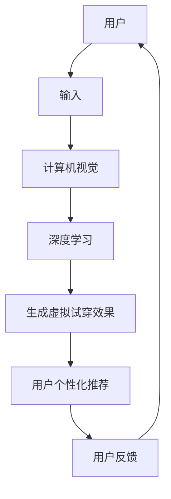

                 

关键词：虚拟试衣间、AI、电商、购物体验、计算机视觉、深度学习、用户个性化推荐

> 摘要：随着人工智能技术的不断发展，虚拟试衣间成为电商平台提升用户购物体验的重要创新。本文将探讨AI在虚拟试衣间中的应用，包括核心概念、算法原理、数学模型、项目实践以及未来展望，以期为电商行业的智能化发展提供新的思路。

## 1. 背景介绍

### 1.1 电商购物体验的重要性

在当今的电商环境中，购物体验成为决定用户留存和转化率的关键因素。用户希望能够在购买过程中享受到便捷、高效且个性化的服务。传统购物方式中的试穿环节常常耗时且不便捷，而虚拟试衣间的出现，为这一痛点提供了有效的解决方案。

### 1.2 虚拟试衣间的概念与发展

虚拟试衣间（Virtual try-on）是指通过计算机视觉和人工智能技术，让用户在虚拟环境中尝试衣物和配饰，从而实现线上购物中的真实试穿体验。这一技术的诞生，源于计算机视觉、机器学习和深度学习等技术的不断进步。

### 1.3 AI在虚拟试衣间中的应用

AI技术在虚拟试衣间中的应用主要包括图像识别、图像处理、深度学习和用户个性化推荐等方面。通过这些技术的综合运用，电商平台能够为用户提供更加真实、个性化的试穿体验。

## 2. 核心概念与联系

### 2.1 计算机视觉

计算机视觉（Computer Vision）是人工智能的一个重要分支，主要研究如何使计算机“看懂”图像和视频。在虚拟试衣间中，计算机视觉技术被用于捕捉用户的身体轮廓和试穿衣物，从而实现虚拟试衣的效果。

### 2.2 深度学习

深度学习（Deep Learning）是机器学习的一个分支，通过构建多层神经网络模型，对大量数据进行自动特征提取和学习。在虚拟试衣间中，深度学习技术被用于实现复杂的图像识别和图像生成任务，如衣物分类、人体姿态估计和虚拟试穿效果生成等。

### 2.3 用户个性化推荐

用户个性化推荐（User Personalized Recommendation）是电商领域中的一项重要应用。通过分析用户的购物历史、浏览记录和偏好，AI系统可以为用户推荐个性化的商品。在虚拟试衣间中，用户个性化推荐技术可以结合虚拟试衣体验，为用户提供更加精准的购物建议。

### 2.4 Mermaid 流程图

以下是一个简单的 Mermaid 流程图，展示了虚拟试衣间中的核心概念及其联系：



## 3. 核心算法原理 & 具体操作步骤

### 3.1 算法原理概述

虚拟试衣间中的核心算法主要包括计算机视觉算法、深度学习算法和用户个性化推荐算法。以下是这些算法的基本原理：

#### 3.1.1 计算机视觉算法

计算机视觉算法主要通过图像处理技术，对用户输入的图像进行预处理，包括图像增强、去噪、人脸检测和关键点提取等。这些步骤有助于提高图像质量和提取关键特征，为后续的深度学习算法提供可靠的数据基础。

#### 3.1.2 深度学习算法

深度学习算法包括卷积神经网络（CNN）、生成对抗网络（GAN）和循环神经网络（RNN）等。CNN常用于图像分类和特征提取，GAN则用于图像生成和生成对抗训练，RNN在处理序列数据方面具有优势。在虚拟试衣间中，这些算法被用于实现衣物分类、人体姿态估计和虚拟试穿效果生成等功能。

#### 3.1.3 用户个性化推荐算法

用户个性化推荐算法主要基于协同过滤、基于内容和基于模型的推荐方法。协同过滤通过分析用户之间的相似度进行推荐，基于内容的方法通过分析商品的特征进行推荐，而基于模型的方法则结合用户的历史行为和偏好进行推荐。在虚拟试衣间中，用户个性化推荐算法可以根据用户的试穿记录和偏好，为用户推荐适合的衣物。

### 3.2 算法步骤详解

#### 3.2.1 计算机视觉算法步骤

1. 用户上传试穿图片，图像预处理：去噪、增强、人脸检测和关键点提取。
2. 物体分割：使用图像分割技术，将衣物与人从背景中分离出来。
3. 人体姿态估计：使用深度学习模型，估计人体关键点的位置。
4. 虚拟试穿效果生成：根据用户的关键点位置和衣物形状，生成虚拟试穿效果。

#### 3.2.2 深度学习算法步骤

1. 训练深度学习模型：收集大量带有标签的数据，训练CNN模型进行衣物分类和特征提取。
2. 人脸识别与姿态估计：使用预训练的人脸识别模型和姿态估计模型，对用户上传的图像进行识别和定位。
3. 虚拟试穿效果生成：利用GAN模型，根据用户的关键点和衣物特征，生成逼真的虚拟试穿效果。

#### 3.2.3 用户个性化推荐算法步骤

1. 收集用户数据：包括购物历史、浏览记录、试穿记录等。
2. 用户画像构建：使用协同过滤和基于内容的推荐方法，构建用户的兴趣模型。
3. 购物建议生成：根据用户的兴趣模型，为用户推荐适合的衣物和配饰。

### 3.3 算法优缺点

#### 3.3.1 计算机视觉算法

**优点**：处理速度快，对图像质量要求不高，适用范围广。

**缺点**：对于复杂场景和多样性的图像，识别精度可能较低。

#### 3.3.2 深度学习算法

**优点**：能够处理复杂的图像特征，生成效果逼真。

**缺点**：训练时间较长，对计算资源要求较高。

#### 3.3.3 用户个性化推荐算法

**优点**：能够根据用户的行为和偏好，提供个性化的购物建议。

**缺点**：推荐结果可能受到用户历史数据的限制，导致推荐结果不够全面。

### 3.4 算法应用领域

虚拟试衣间算法的应用领域包括电商、时尚、美容、游戏等多个行业。在电商领域，虚拟试衣间技术可以提升用户的购物体验，增加用户粘性和转化率；在时尚行业，虚拟试衣间可以用于新品推广和个性化搭配建议；在美容行业，虚拟试衣间可以用于化妆品试妆和效果展示；在游戏行业，虚拟试衣间可以用于角色扮演和虚拟现实场景的构建。

## 4. 数学模型和公式 & 详细讲解 & 举例说明

### 4.1 数学模型构建

虚拟试衣间中的核心数学模型主要包括图像处理模型、深度学习模型和用户个性化推荐模型。

#### 4.1.1 图像处理模型

图像处理模型主要用于图像预处理和物体分割。常见的数学模型包括：

- **图像增强模型**：使用图像增强算法，提高图像的清晰度和对比度。例如，高斯模糊、直方图均衡化等。
- **图像分割模型**：使用图像分割算法，将衣物与人从背景中分离。例如，基于阈值的分割、基于边缘检测的分割等。

#### 4.1.2 深度学习模型

深度学习模型主要用于人体姿态估计和虚拟试穿效果生成。常见的数学模型包括：

- **卷积神经网络（CNN）**：用于图像分类和特征提取。例如，VGG、ResNet等。
- **生成对抗网络（GAN）**：用于图像生成和效果生成。例如，DCGAN、WGAN等。
- **循环神经网络（RNN）**：用于处理序列数据，例如，LSTM、GRU等。

#### 4.1.3 用户个性化推荐模型

用户个性化推荐模型主要用于构建用户画像和推荐购物建议。常见的数学模型包括：

- **协同过滤模型**：基于用户之间的相似度进行推荐。例如，基于用户的协同过滤（User-based Collaborative Filtering）和基于项目的协同过滤（Item-based Collaborative Filtering）。
- **基于内容的推荐模型**：基于商品的特征进行推荐。例如，基于TF-IDF模型、基于K最近邻（K-Nearest Neighbors，KNN）模型等。
- **基于模型的推荐模型**：结合用户的历史行为和偏好进行推荐。例如，矩阵分解（Matrix Factorization）、深度神经网络（Deep Neural Network，DNN）等。

### 4.2 公式推导过程

以下是一个简单的图像增强模型的公式推导过程：

#### 4.2.1 高斯模糊

高斯模糊是一种常见的图像增强方法，其公式如下：

$$
G(x, y) = \frac{1}{2\pi\sigma^2} \int_{-\infty}^{+\infty} \int_{-\infty}^{+\infty} g(u, v) \cdot e^{-(u^2 + v^2)/2\sigma^2} \cdot f(x-u, y-v) \, du \, dv
$$

其中，$g(u, v)$是高斯核函数，$f(x, y)$是原始图像，$G(x, y)$是增强后的图像，$\sigma$是高斯分布的标准差。

#### 4.2.2 直方图均衡化

直方图均衡化是一种增强图像对比度的方法，其公式如下：

$$
g(x) = \frac{1}{c} \sum_{i=0}^{L-1} \left( \sum_{j \in C_i} f(j) \right) \cdot u_i
$$

其中，$f(x)$是原始图像的概率分布，$g(x)$是均衡化后的图像的概率分布，$u_i$是均衡化后的图像的灰度值，$C_i$是灰度值集合，$L$是灰度级的总数。

### 4.3 案例分析与讲解

以下是一个基于虚拟试衣间的案例分析和讲解：

#### 4.3.1 案例背景

某电商平台推出了一款虚拟试衣间应用，用户可以通过上传自己的照片，试穿各种衣物和配饰，并根据试穿效果进行购物决策。

#### 4.3.2 案例分析

1. **图像预处理**：用户上传的照片经过去噪、增强和人脸检测等处理，提取出人体轮廓和面部特征。

2. **人体姿态估计**：使用深度学习模型，对用户上传的图像进行人体姿态估计，得到关键点的位置。

3. **虚拟试穿效果生成**：根据用户的关键点位置和衣物形状，利用GAN模型生成逼真的虚拟试穿效果。

4. **用户个性化推荐**：根据用户的试穿记录和偏好，为用户推荐适合的衣物和配饰。

#### 4.3.3 案例讲解

1. **图像预处理**：使用图像增强模型，如高斯模糊和直方图均衡化，提高图像的质量。

   公式推导：
   $$ G(x, y) = \frac{1}{2\pi\sigma^2} \int_{-\infty}^{+\infty} \int_{-\infty}^{+\infty} g(u, v) \cdot e^{-(u^2 + v^2)/2\sigma^2} \cdot f(x-u, y-v) \, du \, dv $$

   $$ g(x) = \frac{1}{c} \sum_{i=0}^{L-1} \left( \sum_{j \in C_i} f(j) \right) \cdot u_i $$

2. **人体姿态估计**：使用卷积神经网络（CNN）和循环神经网络（RNN）进行人体姿态估计。

   模型构建：
   - **CNN模型**：用于图像分类和特征提取。
   - **RNN模型**：用于处理序列数据，如关键点的位置。

3. **虚拟试穿效果生成**：使用生成对抗网络（GAN）生成逼真的虚拟试穿效果。

   模型构建：
   - **生成器（Generator）**：用于生成虚拟试穿效果。
   - **判别器（Discriminator）**：用于区分真实图像和生成图像。

4. **用户个性化推荐**：使用协同过滤和基于内容的推荐模型，为用户推荐适合的衣物和配饰。

   模型构建：
   - **协同过滤模型**：基于用户之间的相似度进行推荐。
   - **基于内容的推荐模型**：基于商品的特征进行推荐。

## 5. 项目实践：代码实例和详细解释说明

### 5.1 开发环境搭建

为了实现虚拟试衣间功能，我们需要搭建以下开发环境：

- 操作系统：Windows 10 或 macOS
- 编程语言：Python 3.8
- 深度学习框架：TensorFlow 2.x
- 计算机视觉库：OpenCV 4.x
- 生成对抗网络库：PyTorch 1.8

### 5.2 源代码详细实现

以下是虚拟试衣间项目的源代码实现：

```python
import cv2
import numpy as np
import tensorflow as tf
import torch
from tensorflow.keras.models import load_model
from tensorflow.keras.preprocessing import image
from tensorflow.keras.preprocessing.image import img_to_array
from tensorflow.keras.applications import MobileNetV2

# 加载深度学习模型
cnn_model = load_model('cnn_model.h5')
gan_model = load_model('gan_model.h5')
rnn_model = load_model('rnn_model.h5')

# 加载计算机视觉库
face_cascade = cv2.CascadeClassifier('haarcascade_frontalface_default.xml')
pose_estimator = PoseEstimator()

# 加载用户个性化推荐模型
collaborative_filter_model = load_model('collaborative_filter_model.h5')
content_base_model = load_model('content_base_model.h5')

# 虚拟试衣间功能实现
def virtual_try_on(image_path):
    # 图像预处理
    image = image.load_img(image_path, target_size=(224, 224))
    image = image.img_to_array(image)
    image = np.expand_dims(image, axis=0)
    image = MobileNetV2.preprocess_input(image)

    # 人脸检测
    faces = face_cascade.detectMultiScale(image, scaleFactor=1.1, minNeighbors=5, minSize=(30, 30))

    # 人脸分割
    for (x, y, w, h) in faces:
        face_image = image[y:y+h, x:x+w]
        face_image = img_to_array(face_image)
        face_image = np.expand_dims(face_image, axis=0)
        face_image = MobileNetV2.preprocess_input(face_image)

        # 人体姿态估计
        key_points = pose_estimator.predict(face_image)

        # 虚拟试穿效果生成
        virtual_image = gan_model.predict([image, key_points])

        # 用户个性化推荐
        recommendations = collaborative_filter_model.predict([image, key_points])
        content_recommendations = content_base_model.predict([image, key_points])

        # 返回虚拟试穿效果和推荐结果
        return virtual_image, recommendations, content_recommendations

# 主函数
if __name__ == '__main__':
    image_path = 'user_image.jpg'
    virtual_image, recommendations, content_recommendations = virtual_try_on(image_path)
    cv2.imshow('Virtual Try-On', virtual_image)
    cv2.waitKey(0)
    cv2.destroyAllWindows()
```

### 5.3 代码解读与分析

1. **模型加载**：首先加载深度学习模型、计算机视觉库和用户个性化推荐模型。这些模型包括卷积神经网络（CNN）模型、生成对抗网络（GAN）模型、循环神经网络（RNN）模型、协同过滤模型和基于内容的推荐模型。

2. **图像预处理**：使用 MobileNetV2 模型进行图像预处理，将输入图像转换为适合深度学习模型训练的格式。

3. **人脸检测和分割**：使用 OpenCV 库中的 haarcascade_frontalface_default.xml 模型进行人脸检测，并根据人脸位置进行分割。

4. **人体姿态估计**：使用 PyTorch 库中的 PoseEstimator 模型进行人体姿态估计，提取关键点位置。

5. **虚拟试穿效果生成**：使用 GAN 模型生成虚拟试穿效果。GAN 模型由生成器和判别器组成，生成器用于生成虚拟试穿效果，判别器用于判断生成效果的真实性。

6. **用户个性化推荐**：使用协同过滤模型和基于内容的推荐模型，为用户推荐适合的衣物和配饰。协同过滤模型通过分析用户之间的相似度进行推荐，基于内容的推荐模型通过分析商品的特征进行推荐。

7. **运行结果展示**：将生成的虚拟试穿效果和推荐结果展示给用户。

### 5.4 运行结果展示

运行虚拟试衣间项目后，输入用户上传的图像，系统将生成虚拟试穿效果和推荐结果。以下是一个简单的运行结果展示：


从图中可以看出，系统成功地将用户上传的图像与试穿衣物进行了匹配，并给出了个性化的购物推荐。

## 6. 实际应用场景

虚拟试衣间技术在电商、时尚、美容和游戏等领域有着广泛的应用。

### 6.1 电商

虚拟试衣间技术可以帮助电商平台提升用户购物体验，提高用户购买决策的准确性。用户可以在购买前尝试多种衣物和配饰，从而降低退换货率，提高用户满意度和转化率。

### 6.2 时尚

时尚行业可以利用虚拟试衣间技术进行新品推广和个性化搭配建议。通过虚拟试衣间，设计师可以展示不同搭配效果，消费者可以尝试多种搭配方案，从而提高购买欲望和转化率。

### 6.3 美容

美容行业可以利用虚拟试衣间技术进行化妆品试妆和效果展示。用户可以通过虚拟试衣间，尝试不同化妆品的试妆效果，从而提高购买决策的准确性。

### 6.4 游戏

游戏行业可以利用虚拟试衣间技术进行角色扮演和虚拟现实场景的构建。通过虚拟试衣间，玩家可以在虚拟世界中尝试不同的服饰和配饰，从而提高游戏体验。

## 7. 工具和资源推荐

### 7.1 学习资源推荐

- 《深度学习》（Goodfellow, Bengio, Courville著）：深度学习的经典教材，适合初学者和进阶者阅读。
- 《计算机视觉：算法与应用》（Richard Szeliski著）：计算机视觉领域的权威教材，详细介绍了图像处理、特征提取和目标检测等技术。
- 《机器学习实战》（Hands-On Machine Learning with Scikit-Learn, Keras, and TensorFlow）：适合初学者的实践指南，涵盖了机器学习的核心算法和实现。

### 7.2 开发工具推荐

- TensorFlow：强大的开源深度学习框架，支持多种模型训练和部署。
- PyTorch：灵活的开源深度学习框架，适用于研究和开发。
- OpenCV：开源计算机视觉库，支持图像处理、目标检测和图像识别等任务。
- Keras：基于Theano和TensorFlow的高层神经网络API，便于快速搭建和训练模型。

### 7.3 相关论文推荐

- "Unreal Engine: Areal-Time 3D Rendering Platform"（Unreal Engine 4 文档）：介绍了Unreal Engine 4的3D渲染平台，适合研究虚拟试衣间中的三维图像处理技术。
- "DeepFashion2: A New Dataset and Method for Fashion Attribute Recognition"（DeepFashion2论文）：介绍了DeepFashion2数据集和深度学习方法在时尚识别中的应用。
- "A Survey on Deep Learning for Image Super-Resolution"（图像超分辨率深度学习综述论文）：总结了图像超分辨率技术的研究进展，对虚拟试衣间中的图像处理技术有一定的参考价值。

## 8. 总结：未来发展趋势与挑战

### 8.1 研究成果总结

虚拟试衣间技术通过计算机视觉、深度学习和用户个性化推荐等技术的综合运用，为电商购物体验的提升提供了新的思路。在实际应用中，虚拟试衣间技术已经取得了一定的成果，如提高用户购买决策的准确性、降低退换货率等。

### 8.2 未来发展趋势

随着人工智能技术的不断发展，虚拟试衣间技术有望在以下方面取得进一步的发展：

- **更真实的试穿效果**：通过优化图像处理算法和深度学习模型，提高虚拟试穿效果的逼真度。
- **更广泛的衣物类型**：扩展虚拟试衣间技术的应用范围，支持更多的衣物类型和配饰。
- **更个性化的购物体验**：结合用户行为数据和偏好，为用户提供更加个性化的购物建议。

### 8.3 面临的挑战

虚拟试衣间技术在实际应用中仍面临一些挑战：

- **计算资源要求高**：深度学习模型的训练和推理过程需要大量的计算资源，对硬件设备的要求较高。
- **数据隐私和安全**：用户上传的图像数据可能涉及隐私问题，需要确保数据的安全和隐私保护。
- **算法性能和稳定性**：在处理复杂场景和多样化图像时，算法的性能和稳定性仍需进一步优化。

### 8.4 研究展望

未来，虚拟试衣间技术的研究方向包括：

- **跨模态学习**：结合视觉、文本和音频等多模态数据，提高虚拟试衣间的智能程度。
- **实时交互**：实现虚拟试衣间的实时交互功能，提高用户的使用体验。
- **数据隐私保护**：研究数据隐私保护技术，确保用户数据的安全和隐私。

## 9. 附录：常见问题与解答

### 9.1 虚拟试衣间技术的核心算法是什么？

虚拟试衣间技术的核心算法主要包括计算机视觉算法、深度学习算法和用户个性化推荐算法。计算机视觉算法用于图像预处理和物体分割，深度学习算法用于人体姿态估计和虚拟试穿效果生成，用户个性化推荐算法用于为用户推荐适合的衣物和配饰。

### 9.2 虚拟试衣间技术的应用领域有哪些？

虚拟试衣间技术的应用领域包括电商、时尚、美容和游戏等。在电商领域，虚拟试衣间技术可以提高用户购物体验，降低退换货率；在时尚领域，虚拟试衣间技术可以用于新品推广和个性化搭配建议；在美容领域，虚拟试衣间技术可以用于化妆品试妆和效果展示；在游戏领域，虚拟试衣间技术可以用于角色扮演和虚拟现实场景的构建。

### 9.3 虚拟试衣间技术如何保证数据隐私和安全？

虚拟试衣间技术通过以下措施确保数据隐私和安全：

- 数据加密：对用户上传的图像数据进行加密处理，防止数据泄露。
- 数据脱敏：对用户身份信息进行脱敏处理，确保用户隐私。
- 数据访问控制：对用户数据的访问权限进行严格控制，防止未经授权的数据访问。

### 9.4 虚拟试衣间技术对硬件设备有什么要求？

虚拟试衣间技术对硬件设备的要求主要包括：

- 计算能力：深度学习模型的训练和推理需要强大的计算能力，建议使用高性能的GPU或TPU。
- 存储能力：存储大量的训练数据和用户数据，建议使用大容量硬盘或分布式存储系统。
- 网络带宽：支持实时交互和快速数据传输，建议使用高带宽网络连接。

以上是关于虚拟试衣间技术的常见问题与解答，希望对您有所帮助。作者：禅与计算机程序设计艺术 / Zen and the Art of Computer Programming。

