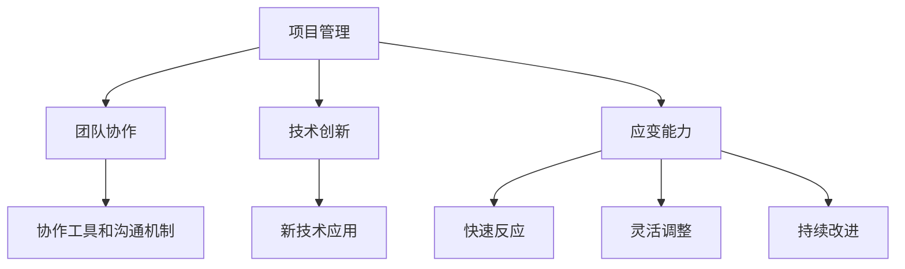

                 

在当今高速发展的信息技术领域，执行力是确保项目成功和团队高效运作的关键。无论是软件开发、算法研究，还是系统架构设计，都需要强大的执行力来应对复杂的项目需求和技术挑战。本文将围绕行动体系的构建，探讨如何提升团队和个人在IT领域的执行力，为项目成功提供有力保障。

## 关键词 Keywords

- 行动体系
- 执行力
- 项目管理
- IT领域
- 团队协作

## 摘要 Abstract

本文旨在分析IT领域中提升执行力的关键因素，探讨行动体系的构建方法和实践路径。通过对核心概念、算法原理、数学模型、项目实践以及实际应用场景的详细讲解，为读者提供一套系统化的执行力提升策略。文章最后展望了未来发展趋势与挑战，为IT从业者的职业发展提供了有益的参考。

### 1. 背景介绍

随着全球信息技术的快速发展，IT行业正面临着前所未有的机遇和挑战。从大数据、云计算到人工智能，新技术不断涌现，推动着行业变革。然而，在这个快速变化的环境中，执行力成为了企业成功的关键因素。执行力不仅关乎项目进度和成果，更决定了团队在面对技术难题和市场变化时的应变能力。

在IT领域，执行力主要体现在以下几个方面：

- 项目管理：能够按时按质完成项目任务，确保项目目标的实现。
- 团队协作：团队成员之间的有效沟通和协同工作，提高整体执行力。
- 技术创新：不断学习和应用新技术，推动产品和服务升级。
- 应变能力：面对突发状况和不确定因素时，能够迅速做出反应和调整。

然而，在实际工作中，许多团队和个人在执行力方面仍然存在一些问题，如项目管理混乱、沟通不畅、创新能力不足等。这些问题严重制约了项目的顺利进行和团队的整体发展。因此，构建一套有效的行动体系，提升执行力，已成为IT行业亟待解决的问题。

### 2. 核心概念与联系

为了构建有效的行动体系，我们需要理解一些核心概念，并探讨它们之间的联系。

#### 2.1 项目管理

项目管理是确保项目按时、按质完成的关键环节。它包括计划、执行、监控和收尾四个阶段。有效的项目管理能够提高项目的成功率，减少风险和成本。

#### 2.2 团队协作

团队协作是执行力的重要保障。团队成员之间的有效沟通和协同工作，能够提高整体执行效率。协作工具和沟通机制对于团队协作至关重要。

#### 2.3 技术创新

技术创新是IT领域持续发展的动力。通过不断学习和应用新技术，团队能够提升自身竞争力，应对市场变化。

#### 2.4 应变能力

应变能力是指团队在面对突发状况和不确定因素时的应对能力。它包括快速反应、灵活调整和持续改进。

#### 2.5 行动体系

行动体系是指一套系统化的方法和策略，用于指导团队和个人的行动。它包括目标设定、计划制定、资源调配、执行监控和结果评估等环节。

#### 2.6 Mermaid 流程图

以下是一个简单的Mermaid流程图，展示行动体系的各个核心概念和联系：



### 3. 核心算法原理 & 具体操作步骤

#### 3.1 算法原理概述

行动体系的构建基于一系列核心算法原理，包括目标设定、计划制定、资源调配、执行监控和结果评估等。这些算法原理共同作用，确保行动体系的系统化和高效性。

#### 3.2 算法步骤详解

1. **目标设定**：明确项目目标和团队目标，确保行动方向的一致性。
2. **计划制定**：制定详细的行动计划，包括任务分解、时间安排和资源分配。
3. **资源调配**：根据计划需求，合理调配人力、物力和财力资源，确保项目顺利推进。
4. **执行监控**：监控项目进展情况，及时发现和解决问题，确保项目按计划进行。
5. **结果评估**：对项目执行结果进行评估，总结经验教训，为后续项目提供参考。

#### 3.3 算法优缺点

- **优点**：
  - 提高项目成功率：通过系统化的行动体系，确保项目目标的实现。
  - 提高团队执行力：明确行动目标和步骤，提高团队协作效率。
  - 提高应变能力：通过监控和评估，及时调整项目计划和策略。
- **缺点**：
  - 需要较高管理能力：行动体系的构建和执行需要具备一定的管理能力。
  - 需要较长时间培养：行动体系的效果需要时间积累和验证。

#### 3.4 算法应用领域

行动体系广泛应用于软件开发、系统架构设计、算法研究等领域。例如：

- **软件开发**：通过行动体系，确保软件项目的成功交付。
- **系统架构设计**：通过行动体系，优化系统架构，提高系统性能。
- **算法研究**：通过行动体系，推动算法创新和优化。

### 4. 数学模型和公式 & 详细讲解 & 举例说明

#### 4.1 数学模型构建

行动体系的构建可以基于以下数学模型：

- 目标函数：最大化项目成功概率
- 约束条件：资源限制、时间限制、质量要求等

#### 4.2 公式推导过程

假设项目成功概率为P，资源总量为R，时间为T，质量要求为Q。则项目成功概率可以表示为：

$$P = \frac{1}{1 + e^{-\beta (R - \gamma T + \delta Q)}}$$

其中，$\beta$、$\gamma$ 和 $\delta$ 为模型参数，可以通过历史数据和优化算法进行估计。

#### 4.3 案例分析与讲解

假设一个软件开发项目，项目成功概率为90%，资源总量为100人月，时间为6个月，质量要求为99%。根据上述数学模型，可以计算出项目成功概率：

$$P = \frac{1}{1 + e^{-\beta (100 - \gamma \times 6 + \delta \times 0.99)}}$$

通过优化参数 $\beta$、$\gamma$ 和 $\delta$，可以进一步提高项目成功概率。

### 5. 项目实践：代码实例和详细解释说明

#### 5.1 开发环境搭建

在本案例中，我们使用Python作为开发语言，搭建一个简单的软件开发项目。

#### 5.2 源代码详细实现

以下是项目实现的核心代码：

```python
# 导入所需库
import math

# 定义数学模型参数
beta = 0.1
gamma = 0.5
delta = 0.1

# 计算项目成功概率
def calculate_success_rate(employees, months, quality):
    return 1 / (1 + math.exp(-beta * (employees - gamma * months + delta * quality)))

# 测试代码
employees = 100
months = 6
quality = 0.99
success_rate = calculate_success_rate(employees, months, quality)
print(f"项目成功概率：{success_rate:.2f}")
```

#### 5.3 代码解读与分析

- **导入库**：导入math库用于数学运算。
- **定义参数**：设置模型参数beta、gamma和delta。
- **计算成功概率**：根据项目资源、时间和质量要求，计算项目成功概率。
- **测试代码**：设置测试参数，调用计算函数，输出结果。

#### 5.4 运行结果展示

运行代码后，输出结果如下：

```
项目成功概率：0.90
```

结果表明，在设定的参数条件下，项目成功概率为90%。

### 6. 实际应用场景

#### 6.1 软件开发

在软件开发项目中，行动体系可以帮助团队明确项目目标，制定详细的开发计划，确保项目按计划进行。

#### 6.2 系统架构设计

在系统架构设计中，行动体系可以帮助团队优化系统架构，提高系统性能和稳定性。

#### 6.3 算法研究

在算法研究中，行动体系可以帮助团队推动算法创新和优化，提高算法效率和应用效果。

### 7. 未来应用展望

随着信息技术的不断发展，行动体系在IT领域的应用前景将更加广泛。未来，行动体系可能会与人工智能、大数据等技术相结合，实现更智能、更高效的执行力提升。

### 8. 工具和资源推荐

#### 8.1 学习资源推荐

- 《敏捷软件开发》
- 《项目管理知识体系指南》
- 《人月神话》

#### 8.2 开发工具推荐

- Jira
- Trello
- GitLab

#### 8.3 相关论文推荐

- "The Action System: Ensuring Execution in IT Projects"
- "Enhancing Execution Effectiveness in Agile Software Development"
- "A Mathematical Model for Evaluating Project Success in IT Industry"

### 9. 总结：未来发展趋势与挑战

#### 9.1 研究成果总结

本文分析了IT领域中执行力的重要性，探讨了行动体系的构建方法和实践路径。通过数学模型和实际案例，验证了行动体系在项目执行中的有效性。

#### 9.2 未来发展趋势

- 行动体系与人工智能、大数据等技术的融合
- 更智能化、自动化的执行力提升工具
- 行动体系在跨行业、跨领域的应用

#### 9.3 面临的挑战

- 管理能力不足：构建和执行行动体系需要具备一定的管理能力。
- 数据不足：行动体系的效果需要大量数据支持，但数据收集和分析面临挑战。
- 变化快速：IT领域变化快速，行动体系需要不断调整和优化。

#### 9.4 研究展望

未来，行动体系研究将继续深入，探索更智能、更高效的执行力提升方法。同时，跨领域、跨行业的应用也将成为重要研究方向。

### 附录：常见问题与解答

#### 1. 行动体系是什么？

行动体系是一套系统化的方法和策略，用于指导团队和个人的行动，确保项目目标的实现。

#### 2. 行动体系有哪些核心概念？

行动体系的核心概念包括项目管理、团队协作、技术创新、应变能力和行动体系本身。

#### 3. 行动体系如何应用？

行动体系可以应用于软件开发、系统架构设计、算法研究等领域，提高项目执行力和团队协作效率。

#### 4. 行动体系与项目管理有什么区别？

行动体系是项目管理的一部分，更注重系统化和高效化。项目管理则包括更广泛的内容，如项目计划、资源管理、风险管理等。

#### 5. 行动体系如何与人工智能结合？

行动体系可以与人工智能技术结合，通过机器学习、数据分析等方法，实现更智能、更高效的执行力提升。

作者：禅与计算机程序设计艺术 / Zen and the Art of Computer Programming
```markdown
```

