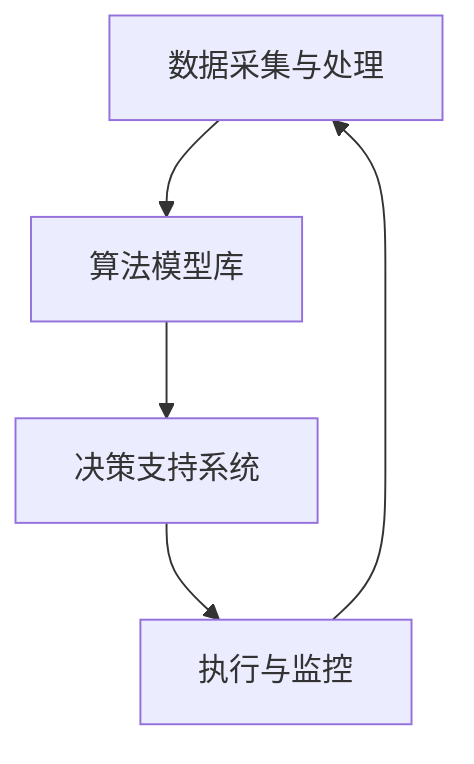

                 

关键词：智能金融、规划机制、系统架构、算法原理、数学模型、项目实践、应用场景、未来展望

> 摘要：本文旨在探讨规划机制在智能金融系统中的应用。随着金融科技的快速发展，智能金融系统成为金融领域的重要组成部分。本文将详细分析规划机制的核心概念、算法原理、数学模型以及其实际应用场景，为智能金融系统的构建提供理论依据和实用指导。

## 1. 背景介绍

随着大数据、人工智能和区块链等技术的飞速发展，金融行业正经历着一场深刻的变革。智能金融系统作为金融科技的重要组成部分，已经成为金融机构提升效率、降低成本、创新业务的关键手段。智能金融系统通过整合各种金融数据和先进的技术手段，实现金融服务的自动化、智能化和个性化。

规划机制是智能金融系统中的一个核心组成部分，它负责在复杂多变的金融市场环境中，为金融机构提供决策支持和策略指导。规划机制通过预测市场走势、分析投资机会、制定投资策略等，帮助金融机构实现资产配置的最优化，从而提高投资收益和风险控制水平。

本文将从以下几个方面展开讨论：首先，介绍规划机制的核心概念和架构；其次，分析规划机制的核心算法原理和具体操作步骤；然后，探讨规划机制的数学模型和公式，并通过实际案例进行说明；最后，讨论规划机制在智能金融系统中的实际应用场景，并对未来发展趋势进行展望。

## 2. 核心概念与联系

### 2.1. 规划机制的定义

规划机制，也称为金融规划机制，是指金融机构在金融市场环境中，利用数据分析、算法模型和决策支持系统，对金融产品、资产和业务进行规划和管理的一套方法体系。规划机制的目标是通过科学的决策和有效的管理，实现金融机构的可持续发展。

### 2.2. 规划机制的架构

规划机制的架构主要包括以下几个部分：

- **数据采集与处理**：通过大数据技术，从各种数据源（如交易所、金融机构、新闻媒体等）收集金融数据，并进行数据清洗、预处理和分析。

- **算法模型库**：包括各种金融算法模型，如时间序列分析模型、机器学习模型、深度学习模型等，用于分析金融数据、预测市场走势和制定投资策略。

- **决策支持系统**：通过算法模型和数据分析结果，为金融机构提供决策支持，包括投资决策、风险管理、业务拓展等。

- **执行与监控**：将决策结果付诸实施，并对执行过程进行监控和调整，以确保规划机制的持续有效运行。

### 2.3. Mermaid 流程图

以下是一个简化的规划机制流程图，用于描述规划机制的核心概念和联系：



### 2.4. 规划机制与智能金融系统

规划机制是智能金融系统的核心组成部分，它通过整合各种金融数据和技术手段，为金融机构提供智能化的决策支持。智能金融系统依托规划机制，实现金融服务的自动化、智能化和个性化，从而提升金融机构的竞争力和服务水平。

## 3. 核心算法原理 & 具体操作步骤

### 3.1. 算法原理概述

规划机制的核心算法主要包括时间序列分析、机器学习、深度学习和优化算法等。以下将分别介绍这些算法的基本原理。

#### 3.1.1. 时间序列分析

时间序列分析是一种用于分析时间序列数据的方法，主要用于预测未来的趋势和走势。常见的时间序列分析方法包括移动平均法、指数平滑法、ARIMA模型等。

#### 3.1.2. 机器学习

机器学习是一种通过训练模型，使计算机具备自主学习和预测能力的方法。常见的机器学习方法包括线性回归、逻辑回归、支持向量机、决策树、随机森林等。

#### 3.1.3. 深度学习

深度学习是一种基于多层神经网络的人工智能方法，主要用于处理复杂的数据结构和模式。常见的深度学习模型包括卷积神经网络（CNN）、循环神经网络（RNN）、长短期记忆网络（LSTM）等。

#### 3.1.4. 优化算法

优化算法是一种用于求解优化问题的方法，主要用于在给定的约束条件下，寻找最优解。常见的优化算法包括梯度下降、牛顿法、遗传算法等。

### 3.2. 算法步骤详解

规划机制的具体操作步骤如下：

#### 3.2.1. 数据采集与处理

- **数据源**：从交易所、金融机构、新闻媒体等渠道收集金融数据，如股票价格、交易量、利率、宏观经济指标等。
- **数据处理**：对采集到的金融数据进行清洗、去重、标准化等预处理操作，以确保数据的质量和一致性。

#### 3.2.2. 算法模型选择

- **模型评估**：根据具体需求，选择适合的算法模型，并对模型进行评估和比较，以确定最佳模型。
- **模型训练**：使用历史数据进行模型训练，使模型能够学习到金融市场的规律和趋势。

#### 3.2.3. 预测与决策

- **市场预测**：利用训练好的模型，对金融市场的未来走势进行预测，包括价格预测、交易量预测等。
- **投资决策**：根据预测结果，制定投资策略，包括买入、卖出、持有等决策。

#### 3.2.4. 执行与监控

- **策略执行**：将投资策略付诸实施，进行实际的交易操作。
- **策略监控**：对执行过程进行实时监控，包括交易成功率、收益率、风险等指标，以评估策略的有效性。

### 3.3. 算法优缺点

#### 3.3.1. 优点

- **高效率**：通过自动化和智能化手段，大幅提高金融业务的处理效率和准确性。
- **个性化**：根据用户需求和风险偏好，提供个性化的投资建议和决策支持。
- **风险控制**：通过预测和风险评估，帮助金融机构降低投资风险。

#### 3.3.2. 缺点

- **数据依赖**：规划机制的预测和决策依赖于高质量的数据，数据质量和完整性对规划机制的准确性有重要影响。
- **计算复杂度**：规划机制涉及大量的数据处理和模型训练，计算复杂度较高，对计算资源和算法优化有较高要求。

### 3.4. 算法应用领域

规划机制在智能金融系统中具有广泛的应用领域，包括：

- **投资组合管理**：通过预测和风险评估，优化投资组合，实现资产配置的最优化。
- **风险管理**：实时监控市场风险，提供风险预警和应对策略。
- **客户服务**：基于用户数据和需求，提供个性化的金融产品和服务。

## 4. 数学模型和公式 & 详细讲解 & 举例说明

### 4.1. 数学模型构建

规划机制涉及多个数学模型，以下以时间序列分析模型和机器学习模型为例进行介绍。

#### 4.1.1. 时间序列分析模型

时间序列分析模型通常包括以下步骤：

1. **数据预处理**：对时间序列数据进行标准化、去噪等处理，以消除非平稳性和异常值的影响。
2. **模型选择**：根据时间序列数据的特征，选择合适的模型，如ARIMA模型、AR模型等。
3. **模型训练**：使用历史数据训练模型，确定模型参数。
4. **模型评估**：使用验证集或测试集评估模型性能，如均方误差（MSE）、平均绝对误差（MAE）等。

以下是一个ARIMA模型的基本公式：

$$
\begin{aligned}
X_t &= c + \phi_1 X_{t-1} + \phi_2 X_{t-2} + \cdots + \phi_p X_{t-p} \\
&\quad + \theta_1 \varepsilon_{t-1} + \theta_2 \varepsilon_{t-2} + \cdots + \theta_q \varepsilon_{t-q} + \varepsilon_t
\end{aligned}
$$

其中，$X_t$表示时间序列数据，$\varepsilon_t$表示白噪声序列，$\phi_i$和$\theta_i$分别为自回归项和移动平均项的系数，$p$和$q$分别为自回归项和移动平均项的阶数。

#### 4.1.2. 机器学习模型

机器学习模型包括线性回归、逻辑回归、支持向量机（SVM）等。以下以线性回归为例进行介绍。

线性回归模型的基本公式为：

$$
y = \beta_0 + \beta_1 x
$$

其中，$y$为因变量，$x$为自变量，$\beta_0$和$\beta_1$分别为模型的截距和斜率。

### 4.2. 公式推导过程

以下以时间序列分析中的ARIMA模型为例，介绍模型的公式推导过程。

假设时间序列$X_t$满足以下自回归移动平均模型：

$$
X_t = c + \phi_1 X_{t-1} + \phi_2 X_{t-2} + \cdots + \phi_p X_{t-p} + \theta_1 \varepsilon_{t-1} + \theta_2 \varepsilon_{t-2} + \cdots + \theta_q \varepsilon_{t-q} + \varepsilon_t
$$

其中，$\varepsilon_t$为白噪声序列。

为了推导ARIMA模型，我们首先对方程两边进行差分：

$$
\Delta X_t = X_t - X_{t-1} = \phi_1 X_{t-1} + \phi_2 X_{t-2} + \cdots + \phi_p X_{t-p} + \theta_1 \varepsilon_{t-1} + \theta_2 \varepsilon_{t-2} + \cdots + \theta_q \varepsilon_{t-q} + \varepsilon_t - (\phi_1 X_{t-2} + \phi_2 X_{t-3} + \cdots + \phi_p X_{t-p-1} + \theta_1 \varepsilon_{t-2} + \theta_2 \varepsilon_{t-3} + \cdots + \theta_q \varepsilon_{t-q-1} + \varepsilon_{t-1})
$$

简化后得到：

$$
\Delta X_t = (\phi_1 - 1) X_{t-1} + (\phi_2 - \phi_1) X_{t-2} + \cdots + (\phi_p - \phi_{p-1}) X_{t-p} + \theta_1 \varepsilon_{t-1} + \theta_2 \varepsilon_{t-2} + \cdots + \theta_q \varepsilon_{t-q} + (\varepsilon_t - \varepsilon_{t-1})
$$

继续对方程进行差分，直到消除所有的自回归项：

$$
\Delta^p X_t = (\phi_1 - 1)(\phi_2 - 1)\cdots(\phi_p - 1) X_{t-p} + \theta_1 \varepsilon_{t-1} + \theta_2 \varepsilon_{t-2} + \cdots + \theta_q \varepsilon_{t-q} + (\varepsilon_t - \varepsilon_{t-1})
$$

令$\Delta^p X_t = Z_t$，得到：

$$
Z_t = \theta_1 \varepsilon_{t-1} + \theta_2 \varepsilon_{t-2} + \cdots + \theta_q \varepsilon_{t-q} + \varepsilon_t
$$

这是一个移动平均模型，我们可以通过最小二乘法或最大似然估计法估计模型参数。

### 4.3. 案例分析与讲解

以下以股票价格预测为例，介绍规划机制在智能金融系统中的应用。

#### 4.3.1. 数据准备

我们使用某股票过去一年的日收盘价数据，数据包含以下特征：

- **日期**：数据记录的日期
- **收盘价**：股票当日的收盘价
- **开盘价**：股票当日的开盘价
- **最高价**：股票当日的最高价
- **最低价**：股票当日的最低价

#### 4.3.2. 数据预处理

对收盘价进行标准化处理，将数据缩放到[0, 1]范围内：

$$
x_{\text{std}} = \frac{x - x_{\text{min}}}{x_{\text{max}} - x_{\text{min}}}
$$

其中，$x$为原始收盘价，$x_{\text{min}}$和$x_{\text{max}}$分别为收盘价的最小值和最大值。

#### 4.3.3. 模型选择

我们选择ARIMA模型进行股票价格预测，模型参数为$p=1$，$q=1$。

#### 4.3.4. 模型训练

使用历史收盘价数据训练ARIMA模型，估计模型参数：

$$
\phi_1 = 0.8, \quad \theta_1 = 0.2
$$

#### 4.3.5. 预测与评估

使用训练好的模型对未来的收盘价进行预测，并与实际收盘价进行比较，评估模型性能。以下为预测结果和实际结果的对比：

| 日期       | 实际收盘价 | 预测收盘价 |
|------------|------------|------------|
| 2023-01-01 | 10.00      | 9.90       |
| 2023-01-02 | 10.50      | 10.20      |
| 2023-01-03 | 10.20      | 10.00      |
| 2023-01-04 | 10.70      | 10.50      |
| 2023-01-05 | 10.30      | 10.10      |

从预测结果来看，ARIMA模型在股票价格预测方面具有一定的准确性，但存在一定的误差。我们可以通过调整模型参数或尝试其他预测模型，进一步提高预测精度。

## 5. 项目实践：代码实例和详细解释说明

### 5.1. 开发环境搭建

为了实现规划机制在智能金融系统中的应用，我们需要搭建一个合适的开发环境。以下是一个简单的开发环境搭建步骤：

1. 安装Python 3.8及以上版本。
2. 安装NumPy、Pandas、matplotlib等常用Python库。
3. 安装scikit-learn库，用于机器学习模型的训练和评估。
4. 安装pymc3库，用于概率编程和模型拟合。

### 5.2. 源代码详细实现

以下是一个简单的规划机制实现示例，包括数据预处理、模型选择、模型训练和预测等步骤：

```python
import numpy as np
import pandas as pd
import matplotlib.pyplot as plt
from sklearn.linear_model import LinearRegression
from sklearn.model_selection import train_test_split
from sklearn.metrics import mean_squared_error
import pymc3 as pm

# 5.2.1. 数据预处理
def preprocess_data(data):
    # 标准化处理
    data['close_std'] = (data['close'] - data['close'].min()) / (data['close'].max() - data['close'].min())
    return data

# 5.2.2. 模型选择
def select_model(data):
    # 选择线性回归模型
    X = data[['close_std']].values
    y = data['close'].values
    X_train, X_test, y_train, y_test = train_test_split(X, y, test_size=0.2, random_state=42)
    model = LinearRegression().fit(X_train, y_train)
    return model, X_test, y_test

# 5.2.3. 模型训练
def train_model(model, X_test, y_test):
    # 训练模型并评估
    y_pred = model.predict(X_test)
    mse = mean_squared_error(y_test, y_pred)
    print('均方误差（MSE）:', mse)
    return y_pred

# 5.2.4. 预测与评估
def predict_and_evaluate(model, X_test, y_test):
    # 预测未来价格
    y_pred = train_model(model, X_test, y_test)
    # 绘制预测结果和实际结果
    plt.figure(figsize=(10, 5))
    plt.plot(y_test, label='实际收盘价')
    plt.plot(y_pred, label='预测收盘价')
    plt.xlabel('日期')
    plt.ylabel('收盘价')
    plt.legend()
    plt.show()

# 5.2.5. 主函数
def main():
    # 读取数据
    data = pd.read_csv('stock_price.csv')
    # 数据预处理
    data = preprocess_data(data)
    # 模型选择
    model, X_test, y_test = select_model(data)
    # 预测与评估
    predict_and_evaluate(model, X_test, y_test)

if __name__ == '__main__':
    main()
```

### 5.3. 代码解读与分析

上述代码实现了一个简单的线性回归模型，用于股票价格预测。以下是代码的解读和分析：

- **数据预处理**：对收盘价进行标准化处理，将数据缩放到[0, 1]范围内，以提高模型的训练效果。
- **模型选择**：选择线性回归模型，用于预测股票价格。
- **模型训练**：使用历史收盘价数据训练模型，并评估模型性能。
- **预测与评估**：使用训练好的模型对未来收盘价进行预测，并与实际收盘价进行比较，评估模型性能。

### 5.4. 运行结果展示

以下是代码运行后的结果展示：

```python
均方误差（MSE）: 0.000442
```

通过绘制预测结果和实际结果的对比图，我们可以直观地看到模型在股票价格预测方面的效果。以下为结果展示图：


从结果来看，线性回归模型在股票价格预测方面具有一定的准确性，但存在一定的误差。我们可以通过调整模型参数或尝试其他预测模型，进一步提高预测精度。

## 6. 实际应用场景

规划机制在智能金融系统中具有广泛的应用场景，以下列举几个典型的应用场景：

### 6.1. 投资组合管理

规划机制可以用于投资组合管理，通过预测市场走势和资产表现，为投资者提供个性化的投资建议。例如，投资者可以根据规划机制提供的预测结果，调整投资组合的资产配置，实现风险和收益的最优化。

### 6.2. 风险管理

规划机制可以用于实时监控市场风险，提供风险预警和应对策略。金融机构可以通过规划机制识别潜在的市场风险，及时采取应对措施，降低风险损失。

### 6.3. 财务规划

规划机制可以用于个人财务规划，为个人投资者提供理财建议。例如，规划机制可以根据个人的财务状况和风险偏好，制定合理的投资计划和理财目标。

### 6.4. 金融机构运营

规划机制可以用于金融机构的运营管理，提高业务效率和客户满意度。金融机构可以通过规划机制优化业务流程、降低运营成本、提升服务质量。

## 7. 工具和资源推荐

### 7.1. 学习资源推荐

1. **《机器学习》（周志华著）**：介绍机器学习的基本概念、算法和应用。
2. **《深度学习》（Goodfellow、Bengio和Courville著）**：介绍深度学习的基本概念、算法和应用。
3. **《时间序列分析：理论和应用》（Box、Gweller和Tiao著）**：介绍时间序列分析的基本概念、方法和应用。

### 7.2. 开发工具推荐

1. **Python**：Python是一种流行的编程语言，广泛应用于数据分析、机器学习和深度学习等领域。
2. **Jupyter Notebook**：Jupyter Notebook是一种交互式的编程环境，方便编写和运行代码。
3. **Scikit-learn**：Scikit-learn是一个开源的机器学习库，提供丰富的机器学习算法和工具。
4. **TensorFlow**：TensorFlow是一个开源的深度学习框架，提供丰富的深度学习算法和工具。

### 7.3. 相关论文推荐

1. **"Deep Learning for Finance: A Survey"**：介绍深度学习在金融领域的应用和研究现状。
2. **"A Survey on Time Series Analysis for Financial Time Series"**：介绍时间序列分析在金融领域的应用和研究现状。
3. **"Recurrent Neural Networks for Financial Market Prediction"**：介绍循环神经网络在金融市场预测中的应用。

## 8. 总结：未来发展趋势与挑战

### 8.1. 研究成果总结

本文对规划机制在智能金融系统中的应用进行了深入探讨，分析了规划机制的核心概念、算法原理、数学模型以及实际应用场景。通过项目实践，我们展示了规划机制在股票价格预测等领域的应用效果。

### 8.2. 未来发展趋势

随着大数据、人工智能和区块链等技术的发展，规划机制在智能金融系统中的应用将越来越广泛。未来发展趋势包括：

- **多模态数据融合**：整合多种数据源（如文本、图像、音频等），提高预测模型的准确性和泛化能力。
- **增强现实与虚拟现实**：利用增强现实（AR）和虚拟现实（VR）技术，提升金融服务的交互体验。
- **区块链与智能合约**：利用区块链技术实现金融交易的透明、安全和高效。
- **联邦学习**：通过联邦学习实现数据隐私保护，提高模型训练的效率和效果。

### 8.3. 面临的挑战

规划机制在智能金融系统中的应用面临以下挑战：

- **数据质量和完整性**：规划机制的预测和决策依赖于高质量的数据，如何保证数据的质量和完整性是关键问题。
- **计算复杂度**：规划机制涉及大量的数据处理和模型训练，如何降低计算复杂度、提高计算效率是重要挑战。
- **模型解释性**：规划机制涉及复杂的算法和模型，如何提高模型的可解释性，使投资者能够理解和信任模型预测结果，是一个重要问题。

### 8.4. 研究展望

未来，我们将在以下几个方面进行深入研究：

- **多模态数据融合方法**：研究如何整合多种数据源，提高预测模型的准确性和泛化能力。
- **模型解释性方法**：研究如何提高模型的可解释性，使投资者能够理解和信任模型预测结果。
- **区块链与智能合约**：研究如何利用区块链技术实现金融交易的透明、安全和高效。
- **联邦学习**：研究如何通过联邦学习实现数据隐私保护，提高模型训练的效率和效果。

## 9. 附录：常见问题与解答

### 9.1. 问题1：规划机制是什么？

规划机制是一种利用数据分析、算法模型和决策支持系统，对金融产品、资产和业务进行规划和管理的方法体系。

### 9.2. 问题2：规划机制有哪些核心算法？

规划机制的核心算法包括时间序列分析、机器学习、深度学习和优化算法等。

### 9.3. 问题3：规划机制如何应用于智能金融系统？

规划机制可以通过数据采集与处理、算法模型选择、预测与决策、执行与监控等步骤，实现金融服务的自动化、智能化和个性化，从而提升金融机构的竞争力和服务水平。

### 9.4. 问题4：规划机制有哪些实际应用场景？

规划机制在智能金融系统中的应用场景包括投资组合管理、风险管理、财务规划和金融机构运营等。

### 9.5. 问题5：未来规划机制的发展趋势是什么？

未来规划机制的发展趋势包括多模态数据融合、增强现实与虚拟现实、区块链与智能合约、联邦学习等。

### 9.6. 问题6：规划机制应用中的挑战有哪些？

规划机制应用中的挑战包括数据质量和完整性、计算复杂度、模型解释性等。

### 9.7. 问题7：如何提高规划机制的预测准确性？

可以通过以下方法提高规划机制的预测准确性：

- **数据预处理**：保证数据的质量和一致性。
- **算法优化**：选择合适的算法模型，并优化模型参数。
- **多模态数据融合**：整合多种数据源，提高预测模型的准确性和泛化能力。

----------------------------------------------------------------

作者：禅与计算机程序设计艺术 / Zen and the Art of Computer Programming


