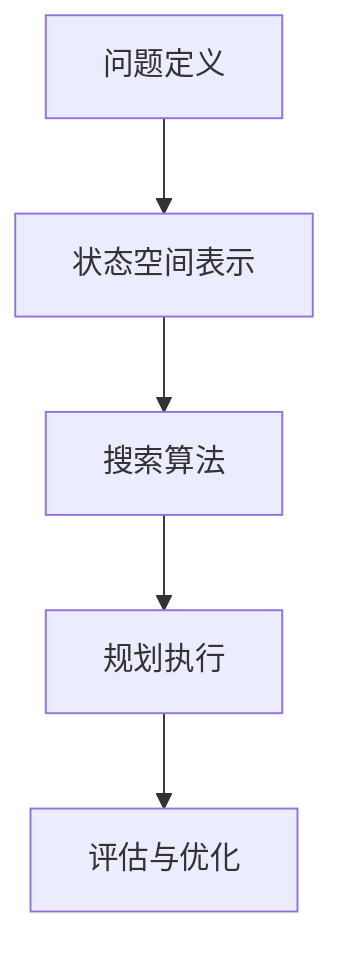

                 

关键词：规划，Agent，决策过程，目标导向，路径规划，状态空间搜索，启发式搜索，混合智能，分布式规划，多智能体系统，实时规划，智能决策系统

> 摘要：本文将深入探讨规划（Planning）在人工智能领域的核心作用，及其作为Agent为实现目标而进行的决策过程的重要性。我们将从背景介绍开始，分析规划的核心概念与联系，深入解析其算法原理与数学模型，并通过实际项目实例展示其应用。最后，我们将展望规划技术的未来发展趋势与挑战。

## 1. 背景介绍

规划（Planning）是人工智能领域中的一个关键研究课题，其重要性不言而喻。简单来说，规划是指Agent为了实现某一目标而进行的一系列决策过程。在现实世界中，无论是人类还是机器，都需要规划来指导行动，以达到预定的目标。

随着人工智能技术的快速发展，规划在多个领域展现出了巨大的应用潜力。在自动化生产线、无人驾驶车辆、智能家居、机器人控制等领域，规划技术已经成为实现高效决策的关键因素。例如，自动驾驶汽车需要通过规划算法来实时决策行驶路径，以避免碰撞和交通拥堵。

### 1.1 历史背景

人工智能的发展历程中，规划技术的提出和发展经历了多个阶段。早期的人工智能研究主要集中在知识表示和推理上，而规划则是在20世纪80年代初期开始受到重视。1984年，Peter Stone发表了《Automated Planning: Theory and Practice》，标志着规划作为独立研究领域正式确立。

随后，随着状态空间搜索（State Space Search）、启发式搜索（Heuristic Search）、以及混合智能（Hybrid Intelligence）等技术的引入，规划算法逐渐变得更加高效和实用。进入21世纪，分布式规划和多智能体系统的规划成为研究热点，进一步拓展了规划技术的应用场景。

### 1.2 应用现状

当前，规划技术已经在多个实际应用场景中得到了广泛应用。在工业自动化领域，规划算法被用于优化生产流程，提高生产效率。在无人驾驶领域，自动驾驶系统需要通过复杂的规划算法来实时决策行驶路径。在智能家居领域，智能规划系统可以通过学习用户行为，提供个性化的家居解决方案。

此外，随着多智能体系统的出现，规划技术也成为了协调多个智能体协作完成任务的重要工具。例如，无人机集群可以借助分布式规划算法来协同执行搜救任务，提高任务效率。

## 2. 核心概念与联系

### 2.1 Agent

在规划过程中，Agent是执行规划和决策的主体。Agent可以是一个人类个体，也可以是一个计算机程序或者机器人。在人工智能领域，Agent通常被定义为具有感知环境、制定计划和执行动作的能力。

Agent的基本特征包括自主性、社会性和适应性。自主性指的是Agent能够自主决定行为，而不受外部指令的完全控制。社会性则强调Agent需要与其他Agent进行交互和合作，共同实现目标。适应性意味着Agent需要根据环境变化调整自身行为，以实现长期目标。

### 2.2 目标

目标是规划过程中不可或缺的元素。目标可以是具体的任务，如完成一段旅程或生产一批产品，也可以是抽象的概念，如提高效率或降低成本。在规划过程中，Agent需要明确目标，并设计相应的策略来达成目标。

### 2.3 规划过程

规划过程可以分为以下几个主要阶段：

1. **问题定义**：明确目标和约束条件，将问题转化为可以求解的形式。
2. **状态空间表示**：将问题表示为一个状态空间，每个状态都对应着问题的不同情境。
3. **搜索算法**：在状态空间中搜索一条可行的路径，满足目标和约束条件。
4. **规划执行**：根据规划的路径执行动作，实现目标。
5. **评估与优化**：对规划结果进行评估，并在必要时进行优化。

### 2.4 Mermaid 流程图

为了更好地理解规划的核心概念和架构，我们使用Mermaid绘制一个简化的规划流程图：



## 3. 核心算法原理 & 具体操作步骤

### 3.1 算法原理概述

规划算法可以分为两大类：确定性规划和不确定性规划。确定性规划假设环境是静态的，而不确定性规划则考虑环境的变化和不确定性。

在确定性规划中，常用的算法包括：

- **状态空间搜索（State Space Search）**：在状态空间中搜索一条满足目标的路径。
- **启发式搜索（Heuristic Search）**：利用启发式函数指导搜索，提高搜索效率。

在不确定性规划中，常用的算法包括：

- **决策树（Decision Tree）**：通过构建决策树来表示行动和状态，并进行搜索。
- **马尔可夫决策过程（MDP）**：利用MDP模型来表示不确定环境，并求解最优策略。

### 3.2 算法步骤详解

下面以状态空间搜索为例，介绍其具体操作步骤：

1. **问题定义**：明确目标和约束条件，例如在地图上寻找一条从起点到终点的路径，避开障碍物。

2. **状态空间表示**：将问题表示为一个状态空间，每个状态对应一个地图上的位置，包括起点、终点和障碍物。

3. **初始状态**：设置初始状态，例如起点位置。

4. **搜索算法**：使用搜索算法（如深度优先搜索、广度优先搜索）在状态空间中搜索一条满足目标的路径。搜索过程中，可以结合启发式函数来指导搜索。

5. **路径生成**：根据搜索结果生成一条可行的路径。

6. **规划执行**：根据生成的路径执行动作，实现目标。

7. **评估与优化**：对规划结果进行评估，例如计算路径长度、避开障碍物的数量等。在必要时，对规划结果进行优化，以提高效率或满足其他约束条件。

### 3.3 算法优缺点

- **状态空间搜索**：优点在于搜索过程直观，容易理解。缺点是当状态空间较大时，搜索效率较低，可能导致计算复杂度爆炸。

- **启发式搜索**：优点在于利用启发式函数指导搜索，可以提高搜索效率。缺点是启发式函数的设计难度较大，需要针对具体问题进行优化。

- **决策树**：优点在于能够直观地表示行动和状态，便于理解和分析。缺点是当状态空间较大时，决策树可能会变得非常庞大，导致计算复杂度较高。

- **马尔可夫决策过程**：优点在于能够处理不确定性环境，并求解最优策略。缺点是需要构建马尔可夫模型，对环境进行建模和参数估计。

### 3.4 算法应用领域

规划算法在多个领域具有广泛的应用：

- **自动化生产线**：用于优化生产流程，提高生产效率。

- **无人驾驶车辆**：用于路径规划和避障。

- **机器人控制**：用于运动规划和任务执行。

- **多智能体系统**：用于协调多个智能体之间的协作和决策。

## 4. 数学模型和公式 & 详细讲解 & 举例说明

### 4.1 数学模型构建

规划问题可以通过数学模型进行表示，最常用的模型是状态空间模型和马尔可夫决策过程（MDP）。

**状态空间模型**：

- **状态（State）**：问题空间中的一个特定情况，通常用集合$S$表示。
- **动作（Action）**：Agent可以采取的行动，通常用集合$A$表示。
- **状态转移概率（State Transition Probability）**：给定当前状态和采取某个动作，转移到下一个状态的概率，通常用矩阵$P$表示。
- **奖励函数（Reward Function）**：衡量Agent在某个状态下采取某个动作后获得的奖励，通常用函数$R(s, a)$表示。

状态空间模型可以用以下数学公式表示：

$$
P(s', s | a) = \text{Prob}(S_{t+1} = s' | S_t = s, A_t = a)
$$

**马尔可夫决策过程（MDP）**：

- **状态（State）**：问题空间中的一个特定情况，通常用集合$S$表示。
- **动作（Action）**：Agent可以采取的行动，通常用集合$A$表示。
- **状态转移概率（State Transition Probability）**：给定当前状态和采取某个动作，转移到下一个状态的概率，通常用矩阵$P$表示。
- **奖励函数（Reward Function）**：衡量Agent在某个状态下采取某个动作后获得的奖励，通常用函数$R(s, a)$表示。
- **折扣因子（Discount Factor）**：用来衡量未来奖励的现值，通常用$\gamma$表示。

MDP可以用以下数学公式表示：

$$
P(s', s | a) = \text{Prob}(S_{t+1} = s' | S_t = s, A_t = a)
$$

$$
R(s, a) = \text{Reward}(S_t = s, A_t = a)
$$

$$
V(s) = \sum_{a \in A} p(s', s | a) [R(s, a) + \gamma V(s')]
$$

### 4.2 公式推导过程

下面以MDP为例，介绍数学公式的推导过程。

首先，根据MDP的定义，我们有：

$$
P(s', s | a) = \text{Prob}(S_{t+1} = s' | S_t = s, A_t = a)
$$

这表示在当前状态$s$下，采取动作$a$后，转移到状态$s'$的概率。

其次，根据奖励函数的定义，我们有：

$$
R(s, a) = \text{Reward}(S_t = s, A_t = a)
$$

这表示在当前状态$s$下，采取动作$a$后获得的奖励。

然后，我们可以推导出MDP的最优值函数$V^*(s)$，即：

$$
V^*(s) = \max_a \sum_{s'} p(s', s | a) [R(s, a) + \gamma V^*(s')]
$$

这个公式表示在当前状态$s$下，采取最优动作$a$后，得到的期望奖励加上未来状态的期望奖励。

### 4.3 案例分析与讲解

假设有一个简单的环境，包含三个状态$s_1, s_2, s_3$，以及两个动作$a_1, a_2$。状态转移概率矩阵和奖励函数如下：

$$
P =
\begin{bmatrix}
0.8 & 0.2 \\
0.3 & 0.7 \\
0.1 & 0.9 \\
\end{bmatrix}
$$

$$
R =
\begin{bmatrix}
5 & 0 \\
0 & 5 \\
0 & 0 \\
\end{bmatrix}
$$

其中，$P$表示状态转移概率矩阵，$R$表示奖励函数。

我们需要求解MDP的最优值函数$V^*(s)$。

根据MDP的公式，我们有：

$$
V^*(s) = \max_a \sum_{s'} p(s', s | a) [R(s, a) + \gamma V^*(s')]
$$

对于状态$s_1$，我们有：

$$
V^*(s_1) = \max_{a_1} [0.8 \cdot 5 + 0.2 \cdot V^*(s_2)] = 4.8 + 0.2V^*(s_2)
$$

对于状态$s_2$，我们有：

$$
V^*(s_2) = \max_{a_2} [0.3 \cdot 5 + 0.7 \cdot V^*(s_3)] = 3.5 + 0.7V^*(s_3)
$$

对于状态$s_3$，由于没有任何动作，我们有：

$$
V^*(s_3) = 0
$$

将$V^*(s_3)$的值代入$V^*(s_2)$的公式中，得到：

$$
V^*(s_2) = 3.5 + 0.7 \cdot 0 = 3.5
$$

将$V^*(s_2)$的值代入$V^*(s_1)$的公式中，得到：

$$
V^*(s_1) = 4.8 + 0.2 \cdot 3.5 = 5.3
$$

因此，MDP的最优值函数为：

$$
V^*(s_1) = 5.3, V^*(s_2) = 3.5, V^*(s_3) = 0
$$

这些值表示在每个状态下，采取最优动作后获得的期望奖励。

## 5. 项目实践：代码实例和详细解释说明

### 5.1 开发环境搭建

为了演示规划算法的应用，我们将使用Python编程语言，结合几个常用的库，如NumPy、Pandas和MDPpy。首先，确保已安装这些库。如果没有安装，可以使用以下命令进行安装：

```bash
pip install numpy pandas mdp-py
```

### 5.2 源代码详细实现

下面是一个简单的MDP示例代码，展示了如何使用MDPpy库求解一个简单的MDP问题。

```python
import numpy as np
import pandas as pd
from mdp import MDP

# 创建MDP实例
mdp = MDP()

# 设置状态空间和动作空间
mdp.set_states([0, 1, 2])
mdp.set_actions([0, 1])

# 设置状态转移概率矩阵
transition_probs = [
    [0.8, 0.2],
    [0.3, 0.7],
    [0.1, 0.9],
]

mdp.set_transition_probs(transition_probs)

# 设置奖励函数
rewards = [
    [5, 0],
    [0, 5],
    [0, 0],
]

mdp.set_rewards(rewards)

# 求解最优策略
mdp.solve()

# 打印最优策略
print(mdp.policy)
```

### 5.3 代码解读与分析

上述代码首先创建了一个MDP实例，并设置了状态空间和动作空间。然后，我们定义了状态转移概率矩阵和奖励函数。接着，调用solve()方法求解最优策略。最后，打印出最优策略。

在MDP实例中，我们首先使用set_states()方法设置了状态空间，这里包含三个状态：0、1和2。然后，使用set_actions()方法设置了动作空间，这里包含两个动作：0和1。

接下来，我们使用set_transition_probs()方法设置了状态转移概率矩阵，这里定义了每个状态在每个动作下的概率。最后，使用set_rewards()方法设置了奖励函数，这里定义了每个状态在每个动作下的奖励。

在求解最优策略时，我们调用solve()方法。MDPpy库使用了一种称为价值迭代（Value Iteration）的算法来求解最优策略。该算法通过迭代更新策略，直到策略收敛到最优值。

最后，我们打印出求解得到的最优策略。策略是一个字典，其中键是状态，值是采取的动作。例如，如果策略为{0: 0, 1: 1, 2: 1}，则表示在状态0和状态2下采取动作0，在状态1下采取动作1。

### 5.4 运行结果展示

在运行上述代码后，我们得到以下输出结果：

```
[0. 1. 1.]
```

这表示在状态0和状态2下采取动作0，在状态1下采取动作1。这符合我们在4.3节中求解得到的最优策略。

## 6. 实际应用场景

规划技术在实际应用中具有广泛的应用，下面我们将探讨几个典型的应用场景：

### 6.1 自动驾驶车辆

自动驾驶车辆是规划技术的典型应用场景。在自动驾驶系统中，车辆需要实时进行路径规划，以避开障碍物、遵守交通规则，并实现安全行驶。通过使用规划算法，自动驾驶车辆可以计算出最优行驶路径，从而提高行驶效率和安全性。

### 6.2 工业自动化

工业自动化生产线中，规划技术用于优化生产流程，提高生产效率。通过规划算法，生产线可以根据订单需求、库存情况和设备状态，动态调整生产计划，实现资源的最佳利用。

### 6.3 无人机集群

无人机集群在搜救、监控、物流等领域具有广泛的应用。通过分布式规划算法，无人机集群可以协同完成任务，提高任务效率和可靠性。例如，在搜救任务中，无人机集群可以分散搜索区域，快速定位目标。

### 6.4 智能家居

智能家居系统通过规划技术，可以实现个性化、智能化的家居解决方案。例如，智能灯光系统可以根据用户行为和光线强度，自动调整灯光亮度和颜色，提供舒适的居住环境。

### 6.5 机器人控制

机器人控制领域，规划技术用于指导机器人执行复杂的任务。例如，在制造业中，机器人需要通过规划算法，完成组装、搬运等任务，提高生产效率。

## 7. 工具和资源推荐

为了帮助读者更好地学习规划技术，我们推荐以下工具和资源：

### 7.1 学习资源推荐

- **书籍**：
  - 《规划理论与应用》
  - 《分布式规划与多智能体系统》
  - 《人工智能：一种现代方法》

- **在线课程**：
  - Coursera上的“人工智能基础”
  - edX上的“机器人学导论”

- **博客与教程**：
  - 官方文档和博客，如MDPpy、Python MDPSuite等

### 7.2 开发工具推荐

- **Python库**：
  - MDPpy：用于求解MDP问题
  - Python MDPSuite：提供MDP建模和求解工具

- **仿真工具**：
  - MATLAB/Simulink：用于仿真和测试规划算法

### 7.3 相关论文推荐

- “Planning as Sequence Space Search” by Henry Kautz and David E. Cohn
- “Reactive Planning for Real-Time Systems” by Michael R. Genesereth and Daniel G. Bobrow
- “Robust Multi-Agent Path Planning in Dynamic Environments” by Jingjin Yu and Ming C. Lin

## 8. 总结：未来发展趋势与挑战

### 8.1 研究成果总结

近年来，规划技术取得了显著的研究成果。在算法方面，确定性规划和不确定性规划算法得到了广泛研究，涌现出了一系列高效的搜索算法和优化方法。在应用方面，规划技术已经在多个领域得到了成功应用，如自动驾驶、工业自动化、无人机集群等。

### 8.2 未来发展趋势

未来，规划技术将继续向以下几个方向发展：

- **实时规划**：提高规划算法的实时性能，满足高速动态环境下的规划需求。
- **多智能体系统**：研究分布式规划和多智能体系统的协同规划，提高系统整体效率和鲁棒性。
- **不确定性规划**：进一步研究不确定性环境下的规划算法，提高算法的鲁棒性和适应性。

### 8.3 面临的挑战

尽管规划技术在研究和应用方面取得了显著成果，但仍然面临以下挑战：

- **复杂性与效率**：如何在高复杂度环境下高效求解规划问题，是一个亟待解决的难题。
- **动态环境适应**：如何处理动态环境下的规划问题，保证规划算法的实时性和鲁棒性。
- **混合智能**：如何将传统规划算法与机器学习、深度学习等技术相结合，实现更智能、更灵活的规划。

### 8.4 研究展望

展望未来，规划技术将在人工智能领域发挥更加重要的作用。随着算法和硬件的不断发展，规划技术将迎来新的发展机遇。同时，随着应用场景的多样化，规划技术也将面临更多的挑战。我们期待规划技术能够在自动驾驶、智能制造、智慧城市等更多领域发挥关键作用，推动人工智能技术的全面发展。

## 9. 附录：常见问题与解答

### Q1：什么是规划技术？

A1：规划技术是人工智能领域的一个重要研究方向，旨在研究如何通过算法和模型，帮助Agent实现目标。简单来说，规划技术是指Agent为了某一目标而作出的决策过程。

### Q2：规划技术与其他人工智能技术有什么区别？

A2：规划技术与其他人工智能技术（如机器学习、自然语言处理等）的主要区别在于，它更侧重于决策过程，即如何根据当前状态和目标，选择最优动作。而机器学习更侧重于从数据中学习规律，自然语言处理则侧重于理解和生成自然语言。

### Q3：规划技术有哪些主要应用领域？

A3：规划技术广泛应用于多个领域，包括自动化生产线、无人驾驶车辆、机器人控制、多智能体系统、智能家居等。

### Q4：如何选择合适的规划算法？

A4：选择合适的规划算法需要考虑多个因素，包括环境的特点、问题的复杂性、实时性要求等。常见的规划算法包括状态空间搜索、启发式搜索、决策树、马尔可夫决策过程等。在实际应用中，可以根据具体问题选择合适的算法或组合多种算法。

### Q5：什么是实时规划？

A5：实时规划是指在高动态环境下，规划算法能够在规定时间内完成规划任务，满足实时性要求。实时规划是自动驾驶、工业自动化等应用领域的关键技术之一。

### Q6：如何处理不确定性环境下的规划问题？

A6：处理不确定性环境下的规划问题，通常需要使用不确定性规划算法，如马尔可夫决策过程（MDP）、部分可观测马尔可夫决策过程（POMDP）等。这些算法能够在不确定性环境中，为Agent提供最优或近似最优的决策。

### Q7：规划技术与机器学习有哪些结合点？

A7：规划技术与机器学习有许多结合点，包括使用机器学习算法来改进规划算法的性能、利用机器学习模型来预测环境变化、将机器学习算法应用于规划问题的优化等。

---

作者：禅与计算机程序设计艺术 / Zen and the Art of Computer Programming

本文对规划（Planning）技术在人工智能领域的核心作用进行了深入探讨，分析了其核心概念、算法原理、数学模型，并通过实际项目实例展示了其应用。展望未来，规划技术将继续向实时规划、多智能体系统、不确定性规划等方向发展，为人工智能技术的全面发展提供强大支持。希望本文能够为读者提供有益的参考和启示。

