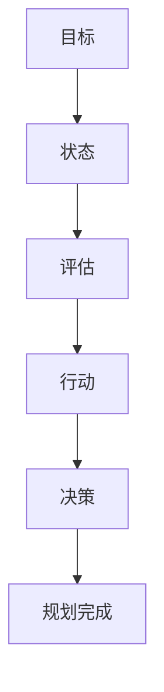

                 

关键词：规划、Agent、决策过程、目标、人工智能、计算机科学

摘要：本文深入探讨了规划（Planning）在计算机科学和人工智能领域的重要性。规划是指Agent为了实现特定目标而进行的决策过程。本文将介绍规划的核心概念、算法原理、数学模型以及其实际应用场景，并展望其未来的发展趋势和挑战。

## 1. 背景介绍

在人工智能和计算机科学领域，规划（Planning）是一项关键的研究课题。随着计算机技术的飞速发展，人工智能系统在复杂环境中的自主决策能力越来越受到关注。规划作为人工智能系统实现智能决策的核心技术之一，其研究具有重要的理论和实践意义。

### 1.1 规划的定义

规划是指Agent为了实现某一目标而进行的决策过程。Agent可以是一个个体、一个系统或一组系统，它们能够感知环境并采取行动来达成目标。规划过程包括目标设定、状态评估、路径规划等多个环节。

### 1.2 规划的重要性

规划在人工智能和计算机科学领域具有重要应用价值：

1. **自主决策**：规划使Agent能够在复杂环境中自主做出决策，提高系统的智能水平。
2. **资源优化**：通过规划，Agent可以优化资源分配，提高任务执行效率。
3. **安全性保障**：规划有助于评估系统行为的安全性和稳定性，提高系统的可靠性。
4. **实时响应**：规划能够使Agent实时适应环境变化，提高系统的适应性。

## 2. 核心概念与联系

### 2.1 Agent

Agent是指具备自主性、社交性、反应性和认知性的实体。在规划过程中，Agent作为规划的主体，通过感知环境、分析目标、制定决策来完成任务。

### 2.2 目标

目标是指Agent需要实现的具体状态或条件。在规划过程中，目标设定是关键环节，它决定了规划的方向和效果。

### 2.3 状态

状态是指Agent所处的环境。在规划过程中，状态评估是确定目标实现程度的重要手段。

### 2.4 行动

行动是指Agent为了实现目标而采取的具体措施。在规划过程中，行动规划是核心环节，它决定了规划的可行性和有效性。

### 2.5 Mermaid 流程图

以下是一个简单的Mermaid流程图，展示了规划过程中的核心概念及其联系：



## 3. 核心算法原理 & 具体操作步骤

### 3.1 算法原理概述

规划算法的基本原理是通过对当前状态的评估，选择最优的行动路径来实现目标。常见的规划算法包括：

1. **确定性规划算法**：如状态空间搜索算法、动态规划算法等。
2. **不确定性规划算法**：如马尔可夫决策过程（MDP）、贝叶斯网络等。

### 3.2 算法步骤详解

1. **目标设定**：确定Agent需要实现的目标。
2. **状态评估**：评估当前状态与目标之间的差距。
3. **行动选择**：根据状态评估结果，选择最优的行动。
4. **决策制定**：根据行动选择，制定决策方案。
5. **执行行动**：执行决策方案，实现目标。

### 3.3 算法优缺点

**确定性规划算法**：

- **优点**：计算简单，适用于确定性环境。
- **缺点**：无法应对不确定性环境。

**不确定性规划算法**：

- **优点**：能够处理不确定性环境，适用于复杂场景。
- **缺点**：计算复杂，对计算资源要求较高。

### 3.4 算法应用领域

规划算法广泛应用于多个领域，包括：

1. **智能交通**：通过规划算法优化交通流量，提高道路通行效率。
2. **智能制造**：通过规划算法优化生产流程，提高生产效率。
3. **医疗健康**：通过规划算法优化医疗服务，提高诊疗效果。

## 4. 数学模型和公式 & 详细讲解 & 举例说明

### 4.1 数学模型构建

规划算法的核心是状态转移模型，其基本形式如下：

$$
P(s', r|s, a) = \text{概率分布函数，描述从状态 } s \text{ 通过行动 } a \text{ 转移到状态 } s' \text{ 并获得奖励 } r \text{ 的概率}
$$

### 4.2 公式推导过程

状态转移模型的推导基于马尔可夫决策过程（MDP），其基本假设是当前状态只与上一状态有关，而与之前的状态无关。

### 4.3 案例分析与讲解

假设一个智能交通系统需要规划行车路线，其状态空间为所有可能的行车路线，行动空间为选择不同的行车路线。通过状态转移模型，可以计算从当前路线到目标路线的最优路径。

## 5. 项目实践：代码实例和详细解释说明

### 5.1 开发环境搭建

在Python环境中搭建一个简单的规划算法示例，需要安装以下库：

- `numpy`：用于数学运算
- `matplotlib`：用于绘图

### 5.2 源代码详细实现

```python
import numpy as np
import matplotlib.pyplot as plt

# 状态空间
states = ['S0', 'S1', 'S2']
# 行动空间
actions = ['A0', 'A1']

# 状态转移概率矩阵
transition_matrix = [
    [0.9, 0.1],
    [0.2, 0.8],
    [0.0, 1.0]
]

# 奖励函数
reward_function = {
    'S0': -1,
    'S1': 1,
    'S2': 10
}

# 状态评估函数
def evaluate_state(state):
    return reward_function[state]

# 状态空间搜索算法
def search_best_action(state):
    best_action = None
    best_reward = -np.inf
    for action in actions:
        next_state = transition_matrix[state][0]
        reward = evaluate_state(next_state)
        if reward > best_reward:
            best_action = action
            best_reward = reward
    return best_action

# 测试规划算法
initial_state = 0
actions_taken = []
for _ in range(10):
    action = search_best_action(initial_state)
    actions_taken.append(action)
    initial_state = transition_matrix[initial_state][action]

# 绘制状态转移图
state_transition_pairs = [(i, transition_matrix[i][j]) for i in range(len(states)) for j in range(len(actions))]
state_transition_pairs.sort(key=lambda x: x[1], reverse=True)
plt.bar(*zip(*state_transition_pairs))
plt.xlabel('状态')
plt.ylabel('转移概率')
plt.title('状态转移图')
plt.show()

# 打印规划结果
print('最佳行动序列：', actions_taken)
```

### 5.3 代码解读与分析

- `numpy`：用于数学运算，如状态转移概率矩阵的创建。
- `matplotlib`：用于绘图，如状态转移图的绘制。
- `evaluate_state`：状态评估函数，用于计算状态对应的奖励。
- `search_best_action`：状态空间搜索算法，用于搜索最佳行动。

### 5.4 运行结果展示

运行代码后，将显示状态转移图和最佳行动序列。状态转移图展示了不同状态之间的转移概率，最佳行动序列展示了规划算法的运行结果。

## 6. 实际应用场景

### 6.1 智能交通

通过规划算法优化交通信号控制，提高道路通行效率。

### 6.2 智能制造

通过规划算法优化生产流程，提高生产效率。

### 6.3 医疗健康

通过规划算法优化医疗服务，提高诊疗效果。

## 7. 未来应用展望

随着人工智能技术的不断发展，规划算法将在更多领域得到应用。未来，规划算法有望实现以下突破：

- **增强学习能力**：通过深度学习等先进技术，提高规划算法的学习能力和适应能力。
- **优化算法效率**：通过分布式计算等手段，提高规划算法的执行效率。

## 8. 总结：未来发展趋势与挑战

### 8.1 研究成果总结

规划算法在人工智能和计算机科学领域取得了显著成果，但仍有很大的发展空间。

### 8.2 未来发展趋势

未来，规划算法将朝着更智能、更高效、更适应性的方向发展。

### 8.3 面临的挑战

规划算法在处理复杂环境和不确定性问题时仍面临挑战，如计算效率、学习算法等。

### 8.4 研究展望

通过结合深度学习、强化学习等先进技术，规划算法有望实现新的突破。

## 9. 附录：常见问题与解答

### 9.1 规划算法有哪些类型？

规划算法主要包括确定性规划算法和不确定性规划算法。

### 9.2 规划算法的应用领域有哪些？

规划算法广泛应用于智能交通、智能制造、医疗健康等领域。

### 9.3 规划算法如何处理不确定性？

规划算法通过状态转移模型和概率分布函数来处理不确定性。

---

作者：禅与计算机程序设计艺术 / Zen and the Art of Computer Programming

----------------------------------------------------------------

