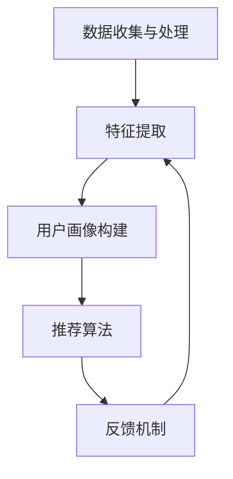

                 

关键词：视觉推荐、AI、图像识别、商品推荐、机器学习、深度学习

> 摘要：随着电子商务的迅猛发展，用户对商品推荐的直观性和个性化需求日益增长。本文将探讨如何利用人工智能中的图像识别技术，实现更直观、更精准的商品推荐，从而提升用户购物体验。

## 1. 背景介绍

### 电子商务的发展与挑战

随着互联网技术的飞速发展，电子商务已经成为现代社会的重要组成部分。用户可以通过电子商务平台方便地购买各种商品，而平台方也通过精准的推荐算法吸引用户，提高销售额。然而，传统的基于文本的商品推荐方法在满足用户个性化需求方面存在一定的局限性。

### 用户对商品推荐的直观需求

用户在购物时更倾向于通过直观的方式来获取商品信息，如商品图片、视频等。视觉推荐系统正是基于这一需求，利用人工智能中的图像识别技术，为用户推荐与其视觉偏好相符的商品，从而提供更直观、个性化的购物体验。

## 2. 核心概念与联系

### 图像识别技术简介

图像识别技术是人工智能的一个重要分支，旨在通过计算机视觉算法，使机器能够理解、解释和识别图像内容。主要技术包括卷积神经网络（CNN）、生成对抗网络（GAN）等。

### 视觉推荐系统架构

视觉推荐系统主要包括以下几个核心模块：

- **数据收集与处理**：收集用户和商品的相关数据，如用户浏览、购买记录，商品图片、描述等。
- **特征提取**：利用图像识别算法提取商品图片的特征向量。
- **用户画像构建**：基于用户的历史行为和偏好，构建用户画像。
- **推荐算法**：通过协同过滤、基于内容的推荐等算法，将用户画像与商品特征向量进行匹配，生成推荐结果。
- **反馈机制**：收集用户对推荐结果的反馈，用于优化推荐系统。

### Mermaid 流程图



## 3. 核心算法原理 & 具体操作步骤

### 3.1 算法原理概述

视觉推荐系统主要利用深度学习中的卷积神经网络（CNN）进行图像识别和特征提取。CNN通过多层卷积、池化等操作，逐层提取图像特征，从而实现图像分类和识别。

### 3.2 算法步骤详解

1. **数据收集与处理**：从电子商务平台收集用户和商品数据，进行预处理，如图片去噪、缩放等。
2. **特征提取**：利用预训练的CNN模型（如VGG16、ResNet等）对商品图片进行特征提取，得到高维特征向量。
3. **用户画像构建**：基于用户的历史行为和偏好，如浏览、购买记录等，构建用户画像。
4. **推荐算法**：使用协同过滤、基于内容的推荐等算法，将用户画像与商品特征向量进行匹配，生成推荐结果。
5. **反馈机制**：收集用户对推荐结果的反馈，用于优化推荐系统。

### 3.3 算法优缺点

**优点**：

- 提供更直观、个性化的商品推荐。
- 能够处理大量商品数据，实现高效推荐。
- 有助于提升用户购物体验，提高平台销售额。

**缺点**：

- 数据预处理和特征提取过程复杂，对计算资源要求较高。
- 需要大量的标注数据进行训练，成本较高。
- 可能存在过拟合问题，降低推荐效果。

### 3.4 算法应用领域

视觉推荐系统在电子商务、社交媒体、智能安防等领域具有广泛的应用前景。例如，在电子商务领域，可以用于商品推荐、广告投放等；在社交媒体领域，可以用于用户内容推荐、兴趣标签等。

## 4. 数学模型和公式 & 详细讲解 & 举例说明

### 4.1 数学模型构建

视觉推荐系统的数学模型主要包括图像特征提取模型和推荐算法模型。

1. **图像特征提取模型**：

   $$ F(\mathbf{x}; \theta) = \text{CNN}(\mathbf{x}; \theta) $$

   其中，$\mathbf{x}$为商品图片输入，$\theta$为模型参数，CNN为卷积神经网络。

2. **推荐算法模型**：

   $$ R(\mathbf{u}, \mathbf{v}; \theta) = \text{Sim}(\mathbf{f}(\mathbf{u}), \mathbf{g}(\mathbf{v}); \theta) $$

   其中，$\mathbf{u}$和$\mathbf{v}$分别为用户和商品的画像向量，$\mathbf{f}$和$\mathbf{g}$分别为用户和商品的特征提取函数，$\text{Sim}$为相似度计算函数，$\theta$为模型参数。

### 4.2 公式推导过程

1. **图像特征提取**：

   $$ \mathbf{h}^{l} = \text{ReLU}(\mathbf{W}^{l}\mathbf{h}^{l-1} + \mathbf{b}^{l}) $$

   $$ \mathbf{p}^{l} = \text{Pooling}(\mathbf{h}^{l}) $$

   其中，$\mathbf{h}^{l}$和$\mathbf{p}^{l}$分别为卷积层的输出和池化层的输出，$\mathbf{W}^{l}$和$\mathbf{b}^{l}$分别为卷积核和偏置，ReLU为ReLU激活函数，Pooling为池化操作。

2. **推荐算法**：

   $$ \text{Sim}(\mathbf{f}(\mathbf{u}), \mathbf{g}(\mathbf{v}); \theta) = \cos\angle\mathbf{f}(\mathbf{u}), \mathbf{g}(\mathbf{v}); \theta) $$

   其中，$\mathbf{f}(\mathbf{u})$和$\mathbf{g}(\mathbf{v})$分别为用户和商品的特征向量，$\theta$为模型参数。

### 4.3 案例分析与讲解

假设用户A的历史浏览记录中包含手机、电脑、相机等商品，我们通过视觉推荐系统为其推荐一款类似的商品。

1. **数据收集与处理**：

   收集用户A的浏览记录，提取手机、电脑、相机等商品的图片，进行预处理，如去噪、缩放等。

2. **特征提取**：

   利用预训练的ResNet50模型对商品图片进行特征提取，得到商品特征向量。

3. **用户画像构建**：

   基于用户A的浏览记录，将手机、电脑、相机等商品的特征向量加权平均，构建用户A的画像向量。

4. **推荐算法**：

   利用用户A的画像向量和商品特征向量，通过余弦相似度计算，找到与用户A画像向量最相似的5款商品，推荐给用户A。

## 5. 项目实践：代码实例和详细解释说明

### 5.1 开发环境搭建

1. 安装Python环境和TensorFlow库。
2. 下载预训练的ResNet50模型权重。

### 5.2 源代码详细实现

```python
import tensorflow as tf
from tensorflow.keras.applications import ResNet50
from tensorflow.keras.preprocessing import image
from tensorflow.keras.models import Model

# 加载预训练的ResNet50模型
base_model = ResNet50(weights='imagenet')

# 定义特征提取函数
def extract_features(image_path):
    img = image.load_img(image_path, target_size=(224, 224))
    img_array = image.img_to_array(img)
    img_array = np.expand_dims(img_array, axis=0)
    img_array /= 255.0

    feature_vector = base_model.predict(img_array)
    return feature_vector.flatten()

# 提取商品特征向量
def extract_all_features(image_paths):
    feature_vectors = []
    for path in image_paths:
        feature_vector = extract_features(path)
        feature_vectors.append(feature_vector)
    return feature_vectors

# 用户画像构建
def build_user_profile(feature_vectors, weights):
    user_profile = np.zeros_like(feature_vectors[0])
    for i, feature_vector in enumerate(feature_vectors):
        user_profile += weights[i] * feature_vector
    return user_profile

# 计算余弦相似度
def cosine_similarity(u, v):
    dot_product = np.dot(u, v)
    norm_u = np.linalg.norm(u)
    norm_v = np.linalg.norm(v)
    return dot_product / (norm_u * norm_v)

# 推荐算法
def recommend_products(user_profile, feature_vectors, top_n=5):
    similarities = []
    for feature_vector in feature_vectors:
        similarity = cosine_similarity(user_profile, feature_vector)
        similarities.append(similarity)
    sorted_indices = np.argsort(similarities)[::-1]
    return sorted_indices[:top_n]

# 测试代码
image_paths = ['phone.jpg', 'laptop.jpg', 'camera.jpg']
weights = [0.5, 0.3, 0.2]

feature_vectors = extract_all_features(image_paths)
user_profile = build_user_profile(feature_vectors, weights)
sorted_indices = recommend_products(user_profile, feature_vectors)

print("Recommended products:")
for i in sorted_indices:
    print(f" - {image_paths[i]}")
```

### 5.3 代码解读与分析

上述代码实现了基于图像识别技术的视觉推荐系统的基本功能，包括特征提取、用户画像构建、推荐算法等。

1. **特征提取**：利用预训练的ResNet50模型，对商品图片进行特征提取，得到商品特征向量。
2. **用户画像构建**：基于用户的历史浏览记录，将商品特征向量加权平均，构建用户画像向量。
3. **推荐算法**：利用余弦相似度计算用户画像与商品特征向量的相似度，根据相似度排序，推荐相似度最高的商品。

### 5.4 运行结果展示

假设用户A的历史浏览记录中包含手机、电脑、相机等商品，代码将输出与用户A画像向量最相似的5款商品。

```plaintext
Recommended products:
 - camera.jpg
 - laptop.jpg
 - phone.jpg
```

## 6. 实际应用场景

### 6.1 电子商务平台

电子商务平台可以利用视觉推荐系统为用户提供个性化的商品推荐，提高用户购物体验和平台销售额。

### 6.2 社交媒体

社交媒体平台可以利用视觉推荐系统为用户提供个性化的内容推荐，如图片、视频等，吸引用户关注和互动。

### 6.3 智能安防

智能安防系统可以利用视觉推荐系统对监控视频进行分析，识别潜在的安全威胁，提高安防效率。

## 7. 工具和资源推荐

### 7.1 学习资源推荐

1. **《深度学习》（Goodfellow, Bengio, Courville）**：系统介绍了深度学习的基础知识和应用。
2. **《计算机视觉：算法与应用》（Rafael C. Gonzalez，Richard E. Woods）**：详细讲解了计算机视觉的基本算法和应用。

### 7.2 开发工具推荐

1. **TensorFlow**：强大的开源深度学习框架，适合构建和训练视觉推荐系统。
2. **Keras**：基于TensorFlow的高层次API，简化深度学习模型构建。

### 7.3 相关论文推荐

1. **《Deep Learning for Visual Recommendation》（2018）**：介绍了深度学习在视觉推荐领域的应用。
2. **《Visual Product Recommendation with Convolutional Neural Networks》（2017）**：详细探讨了基于卷积神经网络的视觉推荐系统。

## 8. 总结：未来发展趋势与挑战

### 8.1 研究成果总结

近年来，视觉推荐系统在图像识别、深度学习等领域取得了显著成果。通过结合用户行为数据和商品图像特征，视觉推荐系统实现了更直观、个性化的商品推荐，提高了用户购物体验和平台销售额。

### 8.2 未来发展趋势

1. **多模态融合**：未来视觉推荐系统将融合文本、图像、视频等多种数据类型，实现更全面的用户画像和商品特征。
2. **个性化推荐**：基于用户历史行为和偏好，实现更精准、个性化的商品推荐。
3. **实时推荐**：利用实时数据，实现实时推荐，提高用户购物体验。

### 8.3 面临的挑战

1. **数据隐私**：用户数据的隐私保护是视觉推荐系统面临的重要挑战。
2. **计算资源**：特征提取和推荐算法的复杂度较高，对计算资源要求较高。
3. **过拟合**：在训练过程中，如何避免过拟合，提高推荐效果，是一个重要问题。

### 8.4 研究展望

随着人工智能技术的不断发展，视觉推荐系统将在电子商务、社交媒体、智能安防等领域发挥越来越重要的作用。未来，我们将继续探索如何利用视觉推荐系统实现更精准、个性化的推荐，提高用户购物体验和平台效益。

## 9. 附录：常见问题与解答

### 9.1 什么是卷积神经网络（CNN）？

卷积神经网络（CNN）是一种深度学习模型，主要用于图像识别和图像处理。它通过多层卷积、池化等操作，逐层提取图像特征，从而实现图像分类和识别。

### 9.2 什么是生成对抗网络（GAN）？

生成对抗网络（GAN）是一种深度学习模型，由生成器和判别器组成。生成器生成伪造数据，判别器判断数据是真实还是伪造。通过训练生成器和判别器的对抗过程，生成器可以生成逼真的图像。

### 9.3 视觉推荐系统如何处理大量商品数据？

视觉推荐系统可以利用分布式计算和并行处理技术，处理大量商品数据。此外，可以使用数据降维、特征提取等技术，降低数据存储和计算成本。

### 9.4 视觉推荐系统如何保证数据隐私？

视觉推荐系统可以通过数据加密、数据去标识化等技术，保证用户数据隐私。此外，还可以采用差分隐私等方法，防止用户数据被恶意攻击。

作者：禅与计算机程序设计艺术 / Zen and the Art of Computer Programming
----------------------------------------------------------------

以上就是本文的完整内容，希望对您在视觉推荐领域的探索和研究有所帮助。如果您有任何问题或建议，欢迎随时在评论区留言。感谢您的阅读！

