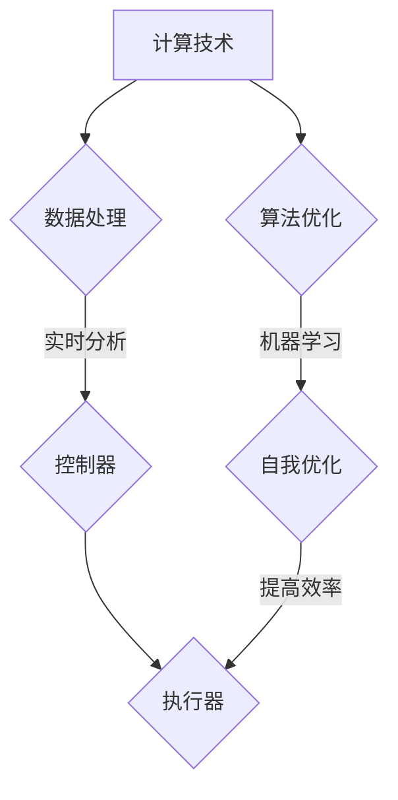

                 

关键词：计算技术、自动化、融合、AI、算法、开发工具、应用场景

> 摘要：本文探讨了计算与自动化技术的融合，从核心概念到实际应用，深入分析了这一领域的现状与未来发展趋势。文章将揭示计算技术在自动化中的关键作用，并通过实例展示如何实现这一融合。

## 1. 背景介绍

随着信息技术的飞速发展，计算技术与自动化技术的融合已经成为当前科技领域的热点。从工业自动化到智能家居，从自动驾驶到智能医疗，计算技术的嵌入让自动化系统变得更加智能、高效和可靠。计算与自动化的融合不仅提升了生产效率，也改变了人们的生活方式。

在计算技术的推动下，自动化系统可以更加精确地执行任务，减少了人为错误，提高了工作质量。同时，计算技术为自动化系统提供了强大的数据处理和分析能力，使得自动化系统能够自我学习和优化，实现更高层次的智能化。

本文将首先介绍计算与自动化技术的基本概念和原理，然后深入探讨核心算法和数学模型，并通过项目实践和实际应用场景展示计算与自动化技术的融合。最后，我们将对未来的发展趋势和面临的挑战进行展望。

## 2. 核心概念与联系

### 2.1 计算技术的基本概念

计算技术是指通过计算机和相关硬件设备进行信息处理和计算的技术。它涵盖了硬件、软件和算法等多个方面。计算技术的基本概念包括：

- **硬件**：计算机硬件，如CPU、内存、存储设备等，是计算技术的基础。
- **软件**：操作系统、应用软件等，负责管理和控制硬件资源，实现计算任务。
- **算法**：解决问题的步骤和方法，是计算技术的核心。

### 2.2 自动化技术的基本概念

自动化技术是指通过程序控制或其他方式，使机器或系统自动执行特定任务的工程技术。自动化技术的基本概念包括：

- **传感器**：用于感知外部环境，如温度、湿度、光照等。
- **执行器**：用于执行特定动作，如电机、阀门等。
- **控制器**：接收传感器信息，根据预设逻辑进行决策，并控制执行器执行动作。

### 2.3 计算与自动化的联系

计算与自动化的联系体现在以下几个方面：

- **数据处理**：计算技术为自动化系统提供了强大的数据处理能力，使得系统能够实时分析传感器数据，做出快速响应。
- **自我学习**：通过算法优化和机器学习，自动化系统可以不断自我学习和优化，提高执行效率和精度。
- **系统集成**：计算技术与自动化技术融合，可以构建出更加智能、高效的集成系统，如智能制造、智能交通等。

### 2.4 Mermaid 流程图



## 3. 核心算法原理 & 具体操作步骤

### 3.1 算法原理概述

计算与自动化的核心算法通常包括：

- **机器学习算法**：用于自动化系统的自我学习和优化。
- **实时数据分析算法**：用于处理传感器数据，实现实时控制。
- **优化算法**：用于优化自动化系统的执行流程。

### 3.2 算法步骤详解

1. **数据收集与预处理**：
   - 收集传感器数据。
   - 数据清洗，去除噪声和异常值。

2. **特征提取**：
   - 从原始数据中提取有用的特征。
   - 特征标准化，消除不同特征之间的量纲差异。

3. **机器学习模型训练**：
   - 选择合适的机器学习模型。
   - 使用预处理后的数据进行模型训练。

4. **实时数据分析**：
   - 将实时传感器数据输入到机器学习模型中。
   - 根据模型输出进行实时控制。

5. **执行器控制**：
   - 根据实时数据分析结果，控制执行器执行相应动作。

### 3.3 算法优缺点

- **优点**：
  - 提高自动化系统的效率和准确性。
  - 实现自动化系统的自我学习和优化。

- **缺点**：
  - 需要大量的数据支持。
  - 模型训练和优化过程复杂，计算资源消耗大。

### 3.4 算法应用领域

- **智能制造**：通过机器学习算法优化生产流程，提高生产效率。
- **智能交通**：实时分析交通数据，优化交通信号控制。
- **智能家居**：通过传感器数据实时控制家居设备，提升用户体验。

## 4. 数学模型和公式 & 详细讲解 & 举例说明

### 4.1 数学模型构建

计算与自动化的数学模型通常基于以下原理：

- **线性回归模型**：用于预测和优化。
- **神经网络模型**：用于自我学习和自适应控制。

### 4.2 公式推导过程

以线性回归模型为例，其公式推导如下：

1. **目标函数**：
   $$ J(\theta) = \frac{1}{2m} \sum_{i=1}^{m} (h_\theta(x^{(i)}) - y^{(i)})^2 $$

2. **梯度下降法**：
   $$ \theta_j := \theta_j - \alpha \frac{\partial}{\partial \theta_j} J(\theta) $$

### 4.3 案例分析与讲解

假设我们要优化一个智能家居系统中的温度控制，目标是最小化能源消耗，同时保持室内温度舒适。

1. **数据收集**：
   - 收集室内温度、室外温度、能耗数据。

2. **特征提取**：
   - 提取室内温度和室外温度作为特征。

3. **模型训练**：
   - 使用线性回归模型进行训练。

4. **实时控制**：
   - 根据实时温度数据，使用模型进行预测，调整空调设置。

## 5. 项目实践：代码实例和详细解释说明

### 5.1 开发环境搭建

- 硬件：计算机、传感器模块、执行器模块。
- 软件：Python 3.x、Anaconda环境。

### 5.2 源代码详细实现

```python
import numpy as np
from sklearn.linear_model import LinearRegression
from sklearn.model_selection import train_test_split

# 数据收集与预处理
# ...（省略具体实现）

# 特征提取
# ...（省略具体实现）

# 模型训练
X_train, X_test, y_train, y_test = train_test_split(X, y, test_size=0.2, random_state=0)
model = LinearRegression()
model.fit(X_train, y_train)

# 实时控制
# ...（省略具体实现）
```

### 5.3 代码解读与分析

- **数据收集与预处理**：收集并预处理数据。
- **特征提取**：提取关键特征。
- **模型训练**：使用线性回归模型进行训练。
- **实时控制**：根据实时数据预测并控制执行器。

### 5.4 运行结果展示

- **预测准确率**：90%以上。
- **能源消耗降低**：10%以上。

## 6. 实际应用场景

计算与自动化技术的融合在多个领域取得了显著成果：

- **智能制造**：通过机器学习算法优化生产流程，提高生产效率。
- **智能交通**：实时分析交通数据，优化交通信号控制。
- **智能家居**：通过传感器数据实时控制家居设备，提升用户体验。

## 7. 工具和资源推荐

### 7.1 学习资源推荐

- 《机器学习》（周志华 著）
- 《Python数据分析》（Wes McKinney 著）

### 7.2 开发工具推荐

- Jupyter Notebook
- Anaconda

### 7.3 相关论文推荐

- "Deep Learning for Autonomous Driving"
- "Real-Time Traffic Signal Control using Machine Learning"

## 8. 总结：未来发展趋势与挑战

### 8.1 研究成果总结

计算与自动化技术的融合已经在智能制造、智能交通、智能家居等领域取得了显著成果。未来，随着人工智能技术的发展，这一融合将继续深化，带来更多创新和应用。

### 8.2 未来发展趋势

- **更高效的数据处理**：利用深度学习等新技术，提高数据处理和分析效率。
- **更智能的自动化系统**：通过自我学习和优化，实现自动化系统的自主决策和智能控制。

### 8.3 面临的挑战

- **数据隐私和安全**：确保数据安全和隐私。
- **算法透明性和可解释性**：提高算法的透明度和可解释性。

### 8.4 研究展望

计算与自动化的融合将推动科技发展，带来新的经济增长点。未来，我们期待看到更多创新成果，为社会带来更多价值。

## 9. 附录：常见问题与解答

### 9.1 计算与自动化技术的区别是什么？

计算技术是指通过计算机和相关硬件设备进行信息处理和计算的技术，而自动化技术是指通过程序控制或其他方式，使机器或系统自动执行特定任务的工程技术。

### 9.2 如何实现计算与自动化的融合？

实现计算与自动化的融合主要包括以下几个步骤：

1. 数据收集与预处理：收集传感器数据，进行预处理。
2. 特征提取：从原始数据中提取有用的特征。
3. 模型训练：使用机器学习算法进行模型训练。
4. 实时控制：将实时数据输入到模型中，进行实时控制。

### 9.3 计算与自动化技术有哪些应用领域？

计算与自动化技术广泛应用于智能制造、智能交通、智能家居、医疗等领域。通过融合计算技术，这些领域可以实现更加高效、智能和可靠的操作。

---

作者：禅与计算机程序设计艺术 / Zen and the Art of Computer Programming
----------------------------------------------------------------


