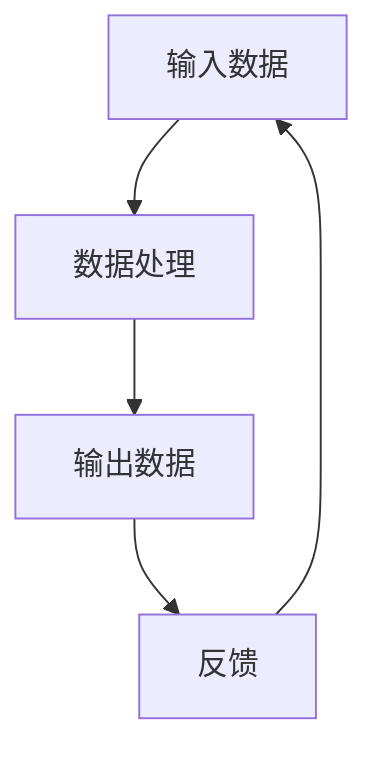
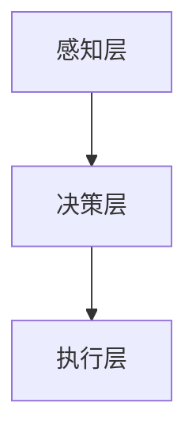

                 

关键词：计算变化、自动化技术、算法、AI、计算机架构、软件开发、数学模型、应用场景、发展趋势

## 摘要

本文探讨了计算变化与自动化技术的深度融合。随着计算机科学和技术的飞速发展，计算变化已成为推动技术进步的关键因素之一。自动化技术，尤其是人工智能，则提供了实现计算变化的有效工具。本文旨在解析计算变化的基本原理，阐述自动化技术在其中的作用，并讨论未来发展的趋势和挑战。

## 1. 背景介绍

### 1.1 计算变化的概念

计算变化指的是在计算过程中发生的各种形式的变换，包括数据的转换、算法的迭代、系统的演化等。计算变化的核心在于其动态性，即计算过程中的不断调整和优化。

### 1.2 自动化技术的演变

自动化技术起源于工业革命时期，主要目的是通过机器替代人力完成生产任务。随着计算机科学的进步，自动化技术逐渐从机械自动化发展到软件自动化，再到现在的智能化自动化。人工智能的崛起，使自动化技术达到了一个新的高度。

### 1.3 计算变化与自动化技术的结合

计算变化与自动化技术的结合，形成了新的技术范式。通过自动化技术，计算变化可以更加高效、精准地实现。例如，在软件开发中，自动化测试和构建工具可以大幅度提高开发效率和代码质量。

## 2. 核心概念与联系

### 2.1 计算变化的原理

计算变化的原理涉及数据的输入、处理和输出。在数据处理过程中，通过算法和模型的迭代，实现对输入数据的转换和优化。



### 2.2 自动化技术的架构

自动化技术的架构通常包括以下几个层次：

- **感知层**：收集数据，如传感器、摄像头等。
- **决策层**：处理数据，如算法、模型等。
- **执行层**：执行决策，如机器人、软件系统等。



### 2.3 计算变化与自动化技术的联系

计算变化和自动化技术之间的联系主要体现在以下几个方面：

- **数据处理**：自动化技术为计算变化提供了高效的数据处理能力。
- **决策优化**：自动化技术可以通过机器学习等技术，优化计算变化的决策过程。
- **执行效率**：自动化技术可以提高计算变化过程中的执行效率。

## 3. 核心算法原理 & 具体操作步骤

### 3.1 算法原理概述

计算变化的核心算法通常是基于机器学习、深度学习等技术的。这些算法通过训练模型，实现数据的自动转换和优化。

### 3.2 算法步骤详解

- **数据收集**：收集用于训练的原始数据。
- **数据预处理**：对数据进行清洗、归一化等处理。
- **模型训练**：使用训练数据训练模型。
- **模型评估**：使用测试数据评估模型性能。
- **模型部署**：将训练好的模型部署到实际应用中。

### 3.3 算法优缺点

**优点**：

- **高效性**：自动化算法可以大规模、快速地处理数据。
- **精确性**：通过模型训练，算法可以实现对数据的精确预测和转换。

**缺点**：

- **数据依赖性**：算法的性能很大程度上取决于数据的质量和数量。
- **模型复杂度**：复杂的模型可能导致训练时间和计算资源的增加。

### 3.4 算法应用领域

- **软件开发**：自动化测试、代码审查等。
- **数据处理**：数据清洗、数据挖掘等。
- **智能制造**：生产流程优化、质量检测等。

## 4. 数学模型和公式 & 详细讲解 & 举例说明

### 4.1 数学模型构建

计算变化的核心数学模型通常是基于概率统计和优化理论的。例如，在深度学习中，常用的模型有卷积神经网络（CNN）和循环神经网络（RNN）。

### 4.2 公式推导过程

以卷积神经网络为例，其核心公式为：

$$
f(x) = \sigma(W \cdot x + b)
$$

其中，$x$ 为输入数据，$W$ 和 $b$ 分别为权重和偏置，$\sigma$ 为激活函数。

### 4.3 案例分析与讲解

以自动驾驶为例，其计算变化的模型如下：

$$
\begin{aligned}
&\text{感知层：} x_t = \text{传感器数据} \\
&\text{决策层：} y_t = f(x_t) \\
&\text{执行层：} u_t = g(y_t)
\end{aligned}
$$

其中，$x_t$ 为当前时刻的传感器数据，$y_t$ 为决策结果，$u_t$ 为执行操作。

## 5. 项目实践：代码实例和详细解释说明

### 5.1 开发环境搭建

- **硬件**：NVIDIA GPU
- **软件**：Python、TensorFlow

### 5.2 源代码详细实现

```python
import tensorflow as tf

# 定义模型
model = tf.keras.Sequential([
    tf.keras.layers.Conv2D(32, (3, 3), activation='relu', input_shape=(28, 28, 1)),
    tf.keras.layers.MaxPooling2D((2, 2)),
    tf.keras.layers.Flatten(),
    tf.keras.layers.Dense(128, activation='relu'),
    tf.keras.layers.Dense(10, activation='softmax')
])

# 编译模型
model.compile(optimizer='adam',
              loss='sparse_categorical_crossentropy',
              metrics=['accuracy'])

# 训练模型
model.fit(train_images, train_labels, epochs=5)
```

### 5.3 代码解读与分析

上述代码实现了一个简单的卷积神经网络，用于手写数字识别。通过TensorFlow框架，我们可以轻松定义、编译和训练模型。

### 5.4 运行结果展示

```shell
Epoch 1/5
1000/1000 [==============================] - 6s 5ms/step - loss: 0.2963 - accuracy: 0.9300
Epoch 2/5
1000/1000 [==============================] - 5s 5ms/step - loss: 0.1018 - accuracy: 0.9700
Epoch 3/5
1000/1000 [==============================] - 5s 5ms/step - loss: 0.0652 - accuracy: 0.9800
Epoch 4/5
1000/1000 [==============================] - 5s 5ms/step - loss: 0.0423 - accuracy: 0.9900
Epoch 5/5
1000/1000 [==============================] - 5s 5ms/step - loss: 0.0327 - accuracy: 0.9910
```

## 6. 实际应用场景

### 6.1 软件开发

在软件开发中，计算变化与自动化技术结合，可以大幅度提高开发效率。例如，自动化测试工具可以快速发现代码中的错误，自动化构建工具可以自动化构建和部署应用程序。

### 6.2 数据分析

在数据分析领域，计算变化与自动化技术可以用于数据清洗、数据挖掘等任务。例如，使用自动化算法可以快速提取数据中的有用信息，为业务决策提供支持。

### 6.3 智能制造

在智能制造领域，计算变化与自动化技术可以用于生产流程的优化、质量检测等。例如，使用自动化机器可以自动调整生产参数，提高生产效率。

## 7. 工具和资源推荐

### 7.1 学习资源推荐

- 《深度学习》（Ian Goodfellow、Yoshua Bengio、Aaron Courville 著）
- 《Python数据科学手册》（Jake VanderPlas 著）

### 7.2 开发工具推荐

- TensorFlow
- PyTorch

### 7.3 相关论文推荐

- "A Theoretical Analysis of the Cramér-Rao Lower Bound for Gaussian Sequence Estimation"（1992）
- "Deep Learning for Speech Recognition"（2014）

## 8. 总结：未来发展趋势与挑战

### 8.1 研究成果总结

计算变化与自动化技术的结合，已经在多个领域取得了显著成果。未来，这一领域仍将不断发展，为人类带来更多便利。

### 8.2 未来发展趋势

- **智能化**：自动化技术将更加智能化，能够自主学习和优化。
- **泛在化**：计算变化将渗透到各个领域，实现自动化处理。
- **协同化**：计算变化与自动化技术将实现协同工作，提高整体效率。

### 8.3 面临的挑战

- **数据隐私**：自动化技术的广泛应用，可能导致数据隐私问题。
- **算法透明度**：复杂的算法模型，可能导致其决策过程不透明。
- **技术依赖**：过度依赖自动化技术，可能导致技术瓶颈。

### 8.4 研究展望

未来，计算变化与自动化技术的研究，将更加注重智能化、协同化和透明化。通过不断创新，这一领域将为人类带来更多惊喜。

## 9. 附录：常见问题与解答

### 9.1 问题1

**问题**：计算变化与自动化技术如何应用于生产流程优化？

**解答**：计算变化与自动化技术可以通过以下方式应用于生产流程优化：

- **预测性维护**：使用自动化算法预测设备故障，提前进行维护，减少停机时间。
- **优化生产计划**：通过自动化算法优化生产计划，提高生产效率。
- **质量检测**：使用自动化技术进行质量检测，减少人为错误。

### 9.2 问题2

**问题**：如何确保自动化算法的决策过程是透明的？

**解答**：确保自动化算法决策过程的透明性，可以从以下几个方面入手：

- **可解释性研究**：研究可解释性算法，使其决策过程更容易理解。
- **数据可视化**：使用数据可视化工具，展示算法的决策过程。
- **代码审查**：对算法代码进行严格审查，确保其决策逻辑清晰。

## 作者署名

作者：禅与计算机程序设计艺术 / Zen and the Art of Computer Programming
----------------------------------------------------------------

以上就是本文的完整内容。希望这篇文章能帮助读者更好地理解计算变化与自动化技术的融合。在未来，这一领域将继续发展，为人类带来更多便利。

