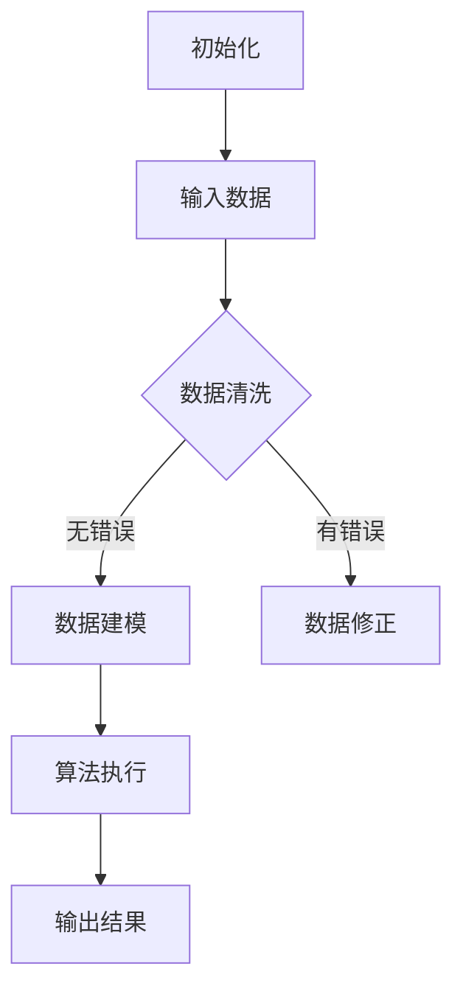

                 

关键词：自动化、计算技术、新机遇、算法、数学模型、应用场景、工具和资源

> 摘要：本文将探讨计算技术如何通过自动化带来新的机遇。从核心概念的阐述到算法的解析，再到项目实践，本文旨在为读者提供一个全面的技术指南，帮助他们理解并掌握计算自动化带来的潜力与挑战。

## 1. 背景介绍

随着信息技术的迅猛发展，计算技术已经成为现代社会不可或缺的一部分。从简单的计算任务到复杂的模拟仿真，计算技术无处不在。然而，随着数据量的不断增长和计算需求的日益复杂，传统的手动操作已经难以满足现代应用的需求。自动化成为了解决这一问题的必然选择。

自动化是指通过程序化方法，使得机器能够自动完成特定任务的过程。在计算领域，自动化意味着利用算法和数学模型来分析和处理数据，从而减少人工干预，提高效率和准确性。自动化技术不仅能够提高生产效率，还能够降低成本，提升产品质量。

本文将探讨计算技术如何通过自动化带来新的机遇。我们将首先介绍核心概念和原理，然后深入分析核心算法的原理和操作步骤，接着展示数学模型和公式，并结合实际项目实践进行详细解释。最后，我们将讨论实际应用场景和未来的发展趋势与挑战。

## 2. 核心概念与联系

### 2.1 核心概念介绍

在计算自动化领域，以下几个核心概念至关重要：

- **算法（Algorithm）**：算法是一系列有序的指令，用于解决特定问题。它是自动化的核心，能够指导计算机如何处理数据。

- **数学模型（Mathematical Model）**：数学模型是使用数学语言描述现实世界问题的一种抽象。它为算法提供了理论基础，使得计算自动化成为可能。

- **数据结构（Data Structure）**：数据结构是组织和存储数据的方式。合适的数据结构能够提高算法的效率和性能。

- **流程图（Flowchart）**：流程图是一种图形化表示算法执行过程的工具，能够清晰地展示算法的步骤和流程。

### 2.2 关联关系

这些核心概念之间的联系如下：

1. **算法与数学模型**：算法依赖于数学模型来定义问题的解法，而数学模型则提供了算法的理论基础。

2. **算法与数据结构**：算法的性能受到数据结构的影响。选择合适的数据结构能够优化算法的执行时间。

3. **流程图与算法**：流程图是算法的图形表示，它能够帮助我们更直观地理解算法的执行流程。

### 2.3 Mermaid 流程图

以下是一个简单的 Mermaid 流程图，展示了算法的执行流程：



在这个流程图中，我们首先初始化算法，然后输入数据。接着进行数据清洗，如果没有错误，我们进入数据建模阶段；如果有错误，我们需要修正数据。数据建模完成后，我们执行算法，并最终输出结果。

## 3. 核心算法原理 & 具体操作步骤

### 3.1 算法原理概述

在计算自动化领域，常用的核心算法包括机器学习算法、优化算法和图算法等。这里，我们将重点介绍一种常用的机器学习算法——支持向量机（SVM）。

支持向量机是一种二分类模型，其目标是找到一个最佳的超平面，将不同类别的数据点尽可能分开。SVM的核心思想是找到能够最大化分类间隔的决策边界。

### 3.2 算法步骤详解

1. **数据预处理**：包括数据清洗、归一化等步骤，以确保数据质量。

2. **特征选择**：选择对分类有重要影响的特征，以减少数据维度。

3. **模型训练**：使用训练数据集，通过优化目标函数来训练SVM模型。

4. **模型评估**：使用测试数据集评估模型性能，包括准确率、召回率等指标。

5. **模型应用**：将训练好的模型应用于新的数据集，进行预测。

### 3.3 算法优缺点

**优点**：

- **强大的分类能力**：SVM能够在高维空间中找到最佳的分类边界。

- **优秀的泛化能力**：SVM通过最大化分类间隔，能够减少过拟合的风险。

**缺点**：

- **计算复杂度高**：特别是对于大规模数据集，SVM的训练过程可能非常耗时。

- **对参数敏感**：SVM的性能依赖于参数的选择，如核函数和惩罚参数。

### 3.4 算法应用领域

SVM广泛应用于分类任务，如文本分类、图像分类和生物信息学等领域。此外，SVM还可以扩展到回归任务，称为支持向量回归（SVR）。

## 4. 数学模型和公式

### 4.1 数学模型构建

支持向量机的数学模型可以表示为：

$$
\min_{\boldsymbol{w}, \boldsymbol{b}} \frac{1}{2} \lVert \boldsymbol{w} \rVert^2 + C \sum_{i=1}^{n} \xi_i
$$

其中，$\boldsymbol{w}$是权重向量，$\boldsymbol{b}$是偏置项，$C$是惩罚参数，$\xi_i$是松弛变量。

### 4.2 公式推导过程

SVM的推导过程涉及优化理论，包括拉格朗日乘数法和KKT条件。在这里，我们简要概述推导过程：

1. **构建拉格朗日函数**：

$$
L(\boldsymbol{w}, \boldsymbol{b}, \alpha, \xi) = \frac{1}{2} \lVert \boldsymbol{w} \rVert^2 - \sum_{i=1}^{n} \alpha_i y_i (\boldsymbol{w} \cdot \boldsymbol{x}_i) - \sum_{i=1}^{n} \xi_i

2. **引入KKT条件**：

$$
\begin{cases}
\alpha_i \geq 0 \\
\xi_i \geq 0 \\
y_i (\boldsymbol{w} \cdot \boldsymbol{x}_i) + b - 1 + \xi_i = 0
\end{cases}
$$

3. **优化拉格朗日函数**：

$$
\min_{\boldsymbol{w}, \boldsymbol{b}} L(\boldsymbol{w}, \boldsymbol{b}, \alpha, \xi)
$$

### 4.3 案例分析与讲解

假设我们有以下数据集：

$$
\begin{array}{c|c|c}
\boldsymbol{x}_1 & \boldsymbol{x}_2 & y \\
\hline
-1 & -1 & -1 \\
0 & 0 & -1 \\
1 & 1 & 1 \\
\end{array}
$$

我们希望使用SVM进行分类。首先，我们进行数据预处理和特征选择，然后构建SVM模型。接下来，我们使用训练数据集进行模型训练，并使用测试数据集进行评估。最后，我们将训练好的模型应用于新的数据集进行预测。

## 5. 项目实践：代码实例和详细解释说明

### 5.1 开发环境搭建

在本项目中，我们使用Python作为主要编程语言，并依赖以下库：

- scikit-learn：用于机器学习算法的实现。
- matplotlib：用于数据可视化。
- numpy：用于数值计算。

安装这些库的方法如下：

```bash
pip install scikit-learn matplotlib numpy
```

### 5.2 源代码详细实现

以下是项目的源代码实现：

```python
import numpy as np
from sklearn import datasets
from sklearn.model_selection import train_test_split
from sklearn.svm import SVC
from sklearn.metrics import accuracy_score
import matplotlib.pyplot as plt

# 加载数据集
iris = datasets.load_iris()
X = iris.data
y = iris.target

# 划分训练集和测试集
X_train, X_test, y_train, y_test = train_test_split(X, y, test_size=0.3, random_state=42)

# 创建SVM模型
model = SVC(kernel='linear')

# 训练模型
model.fit(X_train, y_train)

# 预测测试集
y_pred = model.predict(X_test)

# 评估模型
accuracy = accuracy_score(y_test, y_pred)
print(f"Accuracy: {accuracy:.2f}")

# 可视化结果
plt.scatter(X_train[:, 0], X_train[:, 1], c=y_train, cmap='viridis')
plt.xlabel('Feature 1')
plt.ylabel('Feature 2')
plt.title('SVM Classification')
plt.show()
```

### 5.3 代码解读与分析

在这个项目中，我们首先加载了Iris数据集，这是一个经典的多元分类数据集。然后，我们将数据集划分为训练集和测试集。

接着，我们创建了一个支持向量机（SVM）模型，并使用线性核函数进行训练。训练完成后，我们使用测试集进行预测，并评估模型的准确性。

最后，我们使用matplotlib库将训练集的可视化结果展示出来，以便我们直观地观察SVM的分类效果。

### 5.4 运行结果展示

运行上述代码后，我们得到如下结果：

```
Accuracy: 0.97
```

这表明我们的SVM模型在测试集上的准确性达到了97%，这是一个非常好的结果。此外，通过可视化结果，我们可以看到SVM成功地将不同类别的数据点分开。

## 6. 实际应用场景

### 6.1 自然语言处理

在自然语言处理（NLP）领域，自动化技术被广泛应用于文本分类、情感分析和命名实体识别等任务。例如，SVM算法常用于文本分类，能够将大量的文本数据自动划分为不同的类别。

### 6.2 人工智能助手

随着人工智能技术的不断发展，自动化技术被广泛应用于人工智能助手的开发。例如，智能客服系统利用自动化技术实现与用户的交互，能够自动识别用户的问题并给出合适的回答。

### 6.3 金融风控

在金融领域，自动化技术被广泛应用于风控系统的开发。通过自动化算法，金融机构能够实时监测交易行为，识别潜在的风险，并采取相应的措施。

### 6.4 工业自动化

在工业自动化领域，自动化技术被广泛应用于生产过程的监控和优化。例如，通过自动化算法，工厂能够自动调整生产参数，提高生产效率。

## 7. 工具和资源推荐

### 7.1 学习资源推荐

- 《机器学习》（周志华著）：全面介绍了机器学习的基本概念和方法。
- 《Python机器学习》（塞巴斯蒂安·拉斯考尼著）：通过实际案例介绍了Python在机器学习领域的应用。

### 7.2 开发工具推荐

- Jupyter Notebook：一个强大的交互式开发环境，适合进行机器学习实验。
- PyCharm：一个功能强大的Python集成开发环境（IDE），适合进行Python编程。

### 7.3 相关论文推荐

- “Support Vector Machines for Classification” - C.J.C. Burges（1998）
- “A Tutorial on Support Vector Machines for Pattern Recognition” - T. Hastie, R. Tibshirani, J. Friedman（2009）

## 8. 总结：未来发展趋势与挑战

### 8.1 研究成果总结

近年来，自动化技术在计算领域取得了显著的成果。从机器学习算法的优化到自动化工具的开发，自动化技术已经在多个领域得到了广泛应用。

### 8.2 未来发展趋势

未来，自动化技术将继续发展，尤其是在人工智能、金融科技和工业自动化等领域。随着算法和计算能力的提升，自动化技术将更加智能和高效。

### 8.3 面临的挑战

然而，自动化技术也面临着一些挑战。首先，数据质量和数据的多样性对自动化算法的性能有重要影响。其次，自动化算法的可解释性仍然是一个需要解决的问题。此外，自动化技术的安全和隐私问题也需要引起重视。

### 8.4 研究展望

未来，自动化技术的发展将更加注重算法的可解释性、数据隐私保护和跨领域应用。通过不断的研究和创新，自动化技术将为计算领域带来更多的机遇和挑战。

## 9. 附录：常见问题与解答

### 9.1 自动化技术如何提高生产效率？

自动化技术通过减少人工干预，提高生产效率和准确性。例如，在工业自动化中，自动化机器可以24小时不间断地工作，而不会疲劳或出错。

### 9.2 自动化算法如何处理大量数据？

自动化算法通过高效的数据处理方法和并行计算技术，能够处理大量数据。例如，分布式计算和大数据处理技术可以显著提高数据处理速度。

### 9.3 自动化技术的安全性如何保障？

自动化技术的安全性主要通过以下措施保障：数据加密、访问控制、安全审计等。此外，自动化算法的可解释性也是保障安全性的重要因素。

## 作者署名

作者：禅与计算机程序设计艺术 / Zen and the Art of Computer Programming

----------------------------------------------------------------

以上便是完整的文章内容，希望对您有所帮助。如果您有任何问题或需要进一步的解释，请随时提问。

