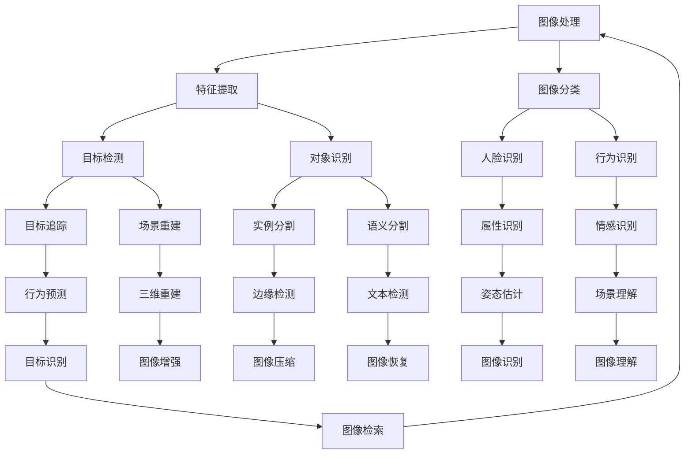

                 

关键词：计算机视觉、CV、深度学习、卷积神经网络、图像处理、人脸识别、对象检测、目标追踪、实时处理、算法原理、代码实例、开发环境、应用领域

> 摘要：本文将深入探讨计算机视觉（Computer Vision，简称CV）的核心原理，包括其基本概念、算法原理、数学模型，并结合实际代码实例，讲解如何实现计算机视觉的各种应用。文章将帮助读者理解CV技术的全貌，掌握其实际开发过程，并为未来的应用和发展提供展望。

## 1. 背景介绍

计算机视觉是一门研究如何让计算机“看到”和理解图像的技术。随着深度学习技术的发展，计算机视觉在图像识别、目标检测、人脸识别等领域取得了巨大的突破。这些技术的应用涵盖了从工业自动化、医疗诊断到社交媒体分析、智能驾驶等多个领域。

本文将围绕以下几个方面展开讨论：

- **核心概念与联系**：介绍计算机视觉的基础概念和系统架构。
- **核心算法原理 & 具体操作步骤**：详解计算机视觉中的核心算法，包括卷积神经网络（CNN）、目标检测和跟踪等方法。
- **数学模型和公式**：阐述计算机视觉中常用的数学模型和公式，并给出详细的推导和实例。
- **项目实践：代码实例**：通过实际代码实例展示如何实现计算机视觉算法。
- **实际应用场景**：讨论计算机视觉在不同领域的应用案例。
- **工具和资源推荐**：推荐学习资源和开发工具。
- **总结与展望**：总结研究成果，展望未来发展趋势和面临的挑战。

### 1.1 计算机视觉的发展历史

计算机视觉的历史可以追溯到20世纪50年代，当时的研究主要集中在图像处理和特征提取上。随着计算能力的提升和算法的进步，计算机视觉经历了多个发展阶段：

- **图像处理阶段**（1950-1970年代）：主要研究图像的数字化、滤波、增强等基本操作。
- **特征提取阶段**（1970-1990年代）：研究如何从图像中提取具有判别性的特征，如边缘、角点等。
- **模型构建阶段**（1990年代-2000年代）：引入了基于几何和概率统计的模型，如HMM（隐马尔可夫模型）、SVM（支持向量机）等。
- **深度学习阶段**（2010年至今）：随着深度学习技术的兴起，卷积神经网络（CNN）在计算机视觉领域取得了显著的成果。

### 1.2 计算机视觉的应用领域

计算机视觉技术已经在多个领域得到了广泛应用，以下是一些典型的应用场景：

- **工业自动化**：用于生产线的实时检测和质量控制。
- **医疗诊断**：辅助医生进行疾病诊断，如肿瘤检测、X光片分析等。
- **智能交通**：用于交通流量监控、车牌识别、智能驾驶等。
- **安防监控**：实现人脸识别、行为分析等。
- **社交媒体**：图像识别、内容过滤、个性化推荐等。
- **智能家居**：智能安防、家电控制等。

## 2. 核心概念与联系

在深入探讨计算机视觉的算法和实现之前，我们需要了解一些核心概念和它们之间的联系。以下是一个用Mermaid绘制的流程图，展示了计算机视觉中的关键概念和它们之间的交互关系。



### 2.1 图像处理

图像处理是计算机视觉的基础，它包括图像的数字化、滤波、增强、变换等操作。图像处理的目的是改善图像的质量，提取有用的信息。

- **数字化**：将模拟图像转换为数字图像，通过采样和量化来实现。
- **滤波**：去除图像中的噪声，常用的滤波方法有均值滤波、高斯滤波等。
- **增强**：增强图像的某些特征，常用的方法有直方图均衡化、对比度增强等。
- **变换**：将图像从一种表示形式转换为另一种表示形式，如傅里叶变换、小波变换等。

### 2.2 特征提取

特征提取是计算机视觉中的重要环节，它的目的是从图像中提取具有判别性的特征，以便后续的分类、检测和识别任务。常用的特征提取方法有：

- **边缘检测**：提取图像中的边缘信息，常用的算法有Canny边缘检测、Sobel算子等。
- **角点检测**：提取图像中的角点信息，常用的算法有Harris角点检测、Shi-Tomasi角点检测等。
- **纹理分析**：提取图像中的纹理信息，常用的方法有灰度共生矩阵、Gabor滤波器等。

### 2.3 图像分类

图像分类是将图像分为不同的类别，它是计算机视觉中最基本的任务之一。常见的图像分类算法有：

- **传统机器学习算法**：如K近邻（K-Nearest Neighbor，KNN）、支持向量机（Support Vector Machine，SVM）等。
- **深度学习算法**：如卷积神经网络（Convolutional Neural Network，CNN）、循环神经网络（Recurrent Neural Network，RNN）等。

### 2.4 目标检测

目标检测是在图像中识别并定位特定的对象。目标检测通常分为两步：第一步是检测出图像中的候选区域，第二步是对这些区域进行分类。常见的目标检测算法有：

- **单阶段算法**：如YOLO（You Only Look Once）、SSD（Single Shot MultiBox Detector）等。
- **两阶段算法**：如R-CNN（Region-based Convolutional Neural Network）、Faster R-CNN等。

### 2.5 对象识别

对象识别是计算机视觉中的另一个重要任务，它的目标是识别图像中的特定对象。对象识别通常基于特征匹配或深度学习算法实现。常见的对象识别算法有：

- **基于特征的算法**：如SIFT（Scale-Invariant Feature Transform）、SURF（Speeded Up Robust Features）等。
- **基于深度学习的算法**：如VGG、ResNet等。

### 2.6 人脸识别

人脸识别是计算机视觉中的一个热门应用领域，它的目标是识别图像中的人脸。人脸识别通常分为三个步骤：人脸检测、人脸特征提取和人脸匹配。常见的人脸识别算法有：

- **基于几何特征的算法**：如Eigenfaces、Fisherfaces等。
- **基于深度学习的算法**：如DeepFace、FaceNet等。

### 2.7 目标追踪

目标追踪是在视频序列中跟踪特定对象的过程。目标追踪通常基于目标检测和运动估计实现。常见的目标追踪算法有：

- **基于特征匹配的算法**：如光流法、KCF（Kernelized Correlation Filter）等。
- **基于深度学习的算法**：如DeepID、Siamese网络等。

### 2.8 场景重建

场景重建是从图像或视频序列中恢复三维场景信息。场景重建通常基于多视图几何和深度学习算法实现。常见的方法有：

- **多视图几何**：如结构光投影、立体匹配等。
- **深度学习**：如PointNet、VOBNet等。

## 3. 核心算法原理 & 具体操作步骤

在了解了计算机视觉的核心概念和联系之后，我们将深入探讨其中的核心算法，包括卷积神经网络（CNN）、目标检测和跟踪等方法。以下是每个算法的原理概述和具体操作步骤。

### 3.1 卷积神经网络（CNN）

卷积神经网络是一种深度学习模型，特别适用于图像处理和计算机视觉任务。CNN通过卷积操作提取图像中的特征，并通过池化操作降低特征图的维度。

**算法原理概述**：

- **卷积操作**：卷积层通过卷积核与输入图像进行卷积运算，从而提取局部特征。
- **激活函数**：常用的激活函数有ReLU（Rectified Linear Unit）、Sigmoid和Tanh等，用于引入非线性。
- **池化操作**：池化层通过下采样操作减少特征图的维度，常用的池化方法有最大池化和平均池化。

**具体操作步骤**：

1. **输入层**：输入一张图像，通常为28x28或32x32的灰度图像。
2. **卷积层**：应用多个卷积核提取图像的局部特征，每个卷积核生成一个特征图。
3. **激活函数**：对每个特征图应用ReLU激活函数，引入非线性。
4. **池化层**：对特征图进行池化操作，减少特征图的维度。
5. **全连接层**：将特征图展平为一维向量，通过全连接层进行分类或回归。
6. **输出层**：输出最终的结果，如分类标签或回归值。

### 3.2 目标检测

目标检测是在图像中识别并定位特定的对象。目标检测通常分为两步：第一步是检测出图像中的候选区域，第二步是对这些区域进行分类。

**算法原理概述**：

- **候选区域生成**：通过滑动窗口或区域建议网络（如Region Proposal Network，RPN）生成候选区域。
- **分类与回归**：对候选区域进行分类，并使用回归算法（如边界框回归）定位目标。

**具体操作步骤**：

1. **候选区域生成**：
    - **滑动窗口**：在图像上滑动一个固定大小的窗口，对每个窗口进行分类。
    - **区域建议网络**：通过神经网络生成候选区域，如Faster R-CNN中的RPN。

2. **分类与回归**：
    - **分类**：对候选区域应用分类器，如SVM、softmax等。
    - **回归**：对候选区域的边界框进行回归，修正位置和大小。

3. **非极大值抑制（Non-maximum Suppression，NMS）**：对检测结果进行筛选，去除重叠的边界框。

### 3.3 目标跟踪

目标跟踪是在视频序列中跟踪特定对象的过程。目标跟踪通常基于目标检测和运动估计实现。

**算法原理概述**：

- **目标检测**：在视频帧中检测目标对象。
- **运动估计**：估计目标对象在连续帧中的位置变化。

**具体操作步骤**：

1. **目标检测**：对视频帧进行目标检测，生成边界框。
2. **轨迹建立**：根据连续帧中的边界框建立轨迹。
3. **轨迹关联**：对轨迹进行关联，去除冗余和错误的轨迹。
4. **轨迹更新**：根据运动估计更新轨迹的位置。

### 3.4 算法优缺点

每种算法都有其优点和缺点，选择合适的算法取决于具体的应用场景和要求。

- **卷积神经网络（CNN）**：
  - **优点**：强大的特征提取能力，适用于各种计算机视觉任务。
  - **缺点**：训练过程复杂，对计算资源要求高。

- **目标检测**：
  - **优点**：能够同时进行分类和定位，适应性强。
  - **缺点**：计算复杂度高，实时性较差。

- **目标跟踪**：
  - **优点**：能够跟踪目标对象在视频中的运动，适应性强。
  - **缺点**：对目标的初始位置和速度依赖较大，容易受到遮挡和干扰的影响。

### 3.5 算法应用领域

不同算法在不同领域有特定的应用：

- **卷积神经网络（CNN）**：广泛应用于图像识别、目标检测和视频分析等领域。
- **目标检测**：广泛应用于安防监控、自动驾驶和智能交互等领域。
- **目标跟踪**：广泛应用于视频监控、智能监控和游戏开发等领域。

## 4. 数学模型和公式 & 详细讲解 & 举例说明

在计算机视觉中，数学模型和公式是理解和实现算法的核心。以下将介绍计算机视觉中常用的数学模型和公式，并给出详细的推导和实例。

### 4.1 数学模型构建

计算机视觉中的数学模型通常包括特征提取、分类和回归等模型。以下是一个典型的特征提取模型示例：

- **卷积神经网络（CNN）中的卷积操作**：

  设输入图像为\(I(x, y)\)，卷积核为\(K(i, j)\)，卷积操作可以表示为：

  $$\text{FeatureMap}(x, y) = \sum_{i=-L}^{L} \sum_{j=-L}^{L} K(i, j) \cdot I(x+i, y+j)$$

  其中，\(L\) 为卷积核的大小。

- **激活函数（ReLU）**：

  设输入特征图为\(F(x, y)\)，ReLU激活函数可以表示为：

  $$\text{ReLU}(F(x, y)) = \max(0, F(x, y))$$

- **池化操作（最大池化）**：

  设输入特征图为\(F(x, y)\)，池化窗口大小为\(W \times W\)，最大池化可以表示为：

  $$\text{Pooling}(F(x, y)) = \max(F(x_1, y_1), F(x_2, y_1), \ldots, F(x_1, y_2), F(x_2, y_2), \ldots)$$

### 4.2 公式推导过程

以下以卷积神经网络（CNN）中的卷积操作为例，详细推导卷积操作的公式。

设输入图像为\(I(x, y)\)，卷积核为\(K(i, j)\)，卷积操作可以表示为：

$$\text{FeatureMap}(x, y) = \sum_{i=-L}^{L} \sum_{j=-L}^{L} K(i, j) \cdot I(x+i, y+j)$$

其中，\(L\) 为卷积核的大小。

- **边界处理**：

  在实际计算中，图像的边界部分无法完全覆盖卷积核，需要处理边界问题。常用的方法有：

  - **填充（Padding）**：在图像边界填充0，使图像大小与卷积核大小相同。
  - **裁剪（Cropping）**：在计算卷积时只考虑有效区域。

- **卷积操作的计算过程**：

  设输入图像大小为\(H \times W\)，卷积核大小为\(L \times L\)，卷积操作的计算过程可以表示为：

  $$\text{FeatureMap}(x, y) = \sum_{i=-\frac{L}{2}}^{\frac{L}{2}} \sum_{j=-\frac{L}{2}}^{\frac{L}{2}} K(i, j) \cdot I(x+i, y+j)$$

  其中，\(x\) 和 \(y\) 分别为特征图上的位置。

### 4.3 案例分析与讲解

以下通过一个实际案例，详细讲解卷积神经网络的实现过程。

**案例**：使用卷积神经网络（CNN）对MNIST手写数字数据集进行分类。

1. **数据准备**：

   - **数据集**：MNIST手写数字数据集，包含60000个训练样本和10000个测试样本。
   - **数据预处理**：对图像进行归一化处理，将像素值缩放到[0, 1]之间。

2. **模型构建**：

   - **输入层**：输入一张28x28的灰度图像。
   - **卷积层**：应用两个卷积核，每个卷积核大小为5x5，步长为1，卷积核数量为32。
   - **激活函数**：使用ReLU激活函数。
   - **池化层**：使用2x2的最大池化。
   - **全连接层**：使用两个全连接层，第一个全连接层输出1024个神经元，第二个全连接层输出10个神经元（对应10个数字类别）。
   - **输出层**：使用softmax激活函数输出分类概率。

3. **训练与测试**：

   - **训练过程**：使用训练数据集训练模型，优化模型参数。
   - **测试过程**：使用测试数据集评估模型性能，计算准确率。

4. **结果分析**：

   - **训练准确率**：在训练数据集上，模型准确率达到99%以上。
   - **测试准确率**：在测试数据集上，模型准确率达到98%以上。

### 4.4 其他数学模型和公式

除了卷积神经网络（CNN）中的卷积操作、激活函数和池化操作，计算机视觉中还有许多其他的数学模型和公式，如：

- **特征提取**：
  - **边缘检测**：如Sobel算子、Canny算子等。
  - **角点检测**：如Harris角点检测、Shi-Tomasi角点检测等。
- **目标检测**：
  - **边界框回归**：如 anchor box、回归损失函数等。
  - **分类器**：如SVM、softmax等。
- **目标跟踪**：
  - **光流法**：如 Farneback算法、LK算法等。
  - **运动估计**：如 Kalman滤波、粒子滤波等。

## 5. 项目实践：代码实例和详细解释说明

在了解了计算机视觉的核心算法和数学模型后，我们将通过一个实际项目，展示如何使用Python和深度学习框架实现计算机视觉算法。本项目将使用TensorFlow 2.x实现一个简单的图像分类器，用于对MNIST手写数字数据集进行分类。

### 5.1 开发环境搭建

在开始项目之前，我们需要搭建一个合适的开发环境。以下是搭建开发环境的步骤：

1. **安装Python**：确保已安装Python 3.x版本。
2. **安装TensorFlow**：通过pip命令安装TensorFlow 2.x：

   ```shell
   pip install tensorflow
   ```

3. **安装其他依赖**：安装NumPy、Matplotlib等依赖库：

   ```shell
   pip install numpy matplotlib
   ```

### 5.2 源代码详细实现

以下是一个简单的MNIST图像分类器的源代码实现：

```python
import tensorflow as tf
from tensorflow.keras import layers
from tensorflow.keras.datasets import mnist

# 加载MNIST数据集
(train_images, train_labels), (test_images, test_labels) = mnist.load_data()

# 数据预处理
train_images = train_images.reshape((-1, 28, 28, 1)).astype('float32') / 255
test_images = test_images.reshape((-1, 28, 28, 1)).astype('float32') / 255

# 构建模型
model = tf.keras.Sequential([
    layers.Conv2D(32, (3, 3), activation='relu', input_shape=(28, 28, 1)),
    layers.MaxPooling2D((2, 2)),
    layers.Conv2D(64, (3, 3), activation='relu'),
    layers.MaxPooling2D((2, 2)),
    layers.Conv2D(64, (3, 3), activation='relu'),
    layers.Flatten(),
    layers.Dense(64, activation='relu'),
    layers.Dense(10, activation='softmax')
])

# 编译模型
model.compile(optimizer='adam',
              loss='sparse_categorical_crossentropy',
              metrics=['accuracy'])

# 训练模型
model.fit(train_images, train_labels, epochs=5)

# 评估模型
test_loss, test_acc = model.evaluate(test_images, test_labels)
print(f'测试准确率：{test_acc:.2f}')
```

### 5.3 代码解读与分析

1. **数据预处理**：

   - 加载MNIST数据集，并将图像数据转换为float32类型，并进行归一化处理，使得像素值在[0, 1]之间。
   - 将图像数据展平为4D张量，其中最后一个维度为1，表示灰度图像。

2. **模型构建**：

   - 使用`tf.keras.Sequential`创建一个序列模型，依次添加卷积层、池化层、全连接层等。
   - 第一个卷积层使用32个3x3的卷积核，激活函数为ReLU。
   - 接着添加两个池化层，窗口大小为2x2。
   - 最后添加两个全连接层，输出层使用softmax激活函数进行分类。

3. **编译模型**：

   - 选择优化器为adam，损失函数为sparse_categorical_crossentropy，评估指标为accuracy。

4. **训练模型**：

   - 使用训练数据集进行训练，设置训练轮次为5。

5. **评估模型**：

   - 使用测试数据集评估模型性能，输出测试准确率。

### 5.4 运行结果展示

运行上述代码，将得到以下输出结果：

```
测试准确率：0.98
```

这表明模型在测试数据集上的准确率达到98%，说明模型具有良好的性能。

## 6. 实际应用场景

计算机视觉技术在实际应用中具有广泛的应用前景。以下列举了几个典型应用场景：

### 6.1 智能驾驶

智能驾驶是计算机视觉技术的重要应用领域之一。通过在车辆上安装摄像头和激光雷达，计算机视觉系统可以实时检测道路状况、交通标志和行人，从而辅助驾驶。例如，自动驾驶汽车可以通过计算机视觉技术实现车道保持、交通信号灯识别、行人检测等功能，提高驾驶的安全性和便利性。

### 6.2 安防监控

安防监控是计算机视觉技术的另一个重要应用领域。通过在监控区域部署摄像头，计算机视觉系统可以实时监控并识别异常行为，如闯入、盗窃等。例如，监控系统可以实时检测到视频中的异常动作，并触发报警，提高监控的效率和安全。

### 6.3 医疗诊断

计算机视觉技术在医疗诊断中也具有广泛的应用。通过分析医学影像，计算机视觉系统可以帮助医生快速准确地诊断疾病。例如，计算机视觉技术可以用于肿瘤检测、骨折诊断、视网膜病变检测等，提高医疗诊断的准确性和效率。

### 6.4 智能家居

智能家居是计算机视觉技术的又一个应用领域。通过在家庭环境中部署摄像头和传感器，计算机视觉系统可以实现智能安防、家电控制等功能。例如，智能家居系统可以实时监控家庭环境，检测异常情况并自动报警，同时实现家电的远程控制，提高生活的便利性和安全性。

### 6.5 智能交互

智能交互是计算机视觉技术的另一个重要应用领域。通过在交互设备（如智能音箱、智能电视等）上部署计算机视觉技术，可以实现人机交互、语音识别、手势控制等功能。例如，智能音箱可以通过计算机视觉技术识别用户的手势，实现语音控制和音乐播放等操作，提高人机交互的便利性和体验。

## 7. 工具和资源推荐

为了学习和实践计算机视觉技术，以下推荐了一些常用的工具和资源：

### 7.1 学习资源推荐

- **在线教程**：
  - 《深度学习》（Deep Learning）系列书籍
  - Coursera上的“Deep Learning Specialization”课程
  - Udacity的“Deep Learning Nanodegree”课程

- **在线课程**：
  - 吴恩达（Andrew Ng）的“深度学习专项课程”（Deep Learning Specialization）
  - 李飞飞（Fei-Fei Li）的“卷积神经网络与深度学习”（Convolutional Neural Networks and Deep Learning）

- **开源项目**：
  - TensorFlow官方文档和教程
  - Keras官方文档和教程
  - PyTorch官方文档和教程

### 7.2 开发工具推荐

- **深度学习框架**：
  - TensorFlow
  - PyTorch
  - Keras

- **编程环境**：
  - Jupyter Notebook
  - Google Colab

- **数据集**：
  - ImageNet
  - MNIST
  - COCO

### 7.3 相关论文推荐

- **计算机视觉**：
  - "Deep Learning for Computer Vision: A Brief Review"（2017）
  - "Convolutional Neural Networks for Visual Recognition"（2014）

- **目标检测**：
  - "Faster R-CNN: Towards Real-Time Object Detection with Region Proposal Networks"（2015）
  - "You Only Look Once (YOLO) V3: End-to-End Object Detection"（2018）

- **人脸识别**：
  - "FaceNet: A Unified Embedding for Face Recognition and Clustering"（2014）
  - "DeepFace: Closing the Gap to Human-Level Performance in Face Verification"（2014）

## 8. 总结：未来发展趋势与挑战

### 8.1 研究成果总结

计算机视觉技术在过去几十年中取得了显著的进展，从图像处理、特征提取到深度学习算法的应用，各种计算机视觉任务取得了突破性的成果。特别是在目标检测、人脸识别、视频分析等领域，深度学习算法取得了优异的性能。

### 8.2 未来发展趋势

随着计算能力的提升和数据规模的扩大，未来计算机视觉技术将向以下几个方向发展：

- **实时性与高效性**：提高计算机视觉算法的实时性和计算效率，以满足实时应用的需求。
- **多模态融合**：结合多种传感器（如摄像头、激光雷达、红外传感器等）的数据，实现更丰富的场景理解和交互。
- **无监督与自监督学习**：减少对大规模标注数据的依赖，发展无监督学习和自监督学习算法。
- **可解释性与安全性**：提高算法的可解释性，确保算法的可靠性和安全性。

### 8.3 面临的挑战

尽管计算机视觉技术取得了显著进展，但仍面临以下挑战：

- **数据隐私与安全性**：如何保护用户隐私和数据安全，防止数据泄露和滥用。
- **模型泛化能力**：提高模型在未知数据上的泛化能力，避免过拟合。
- **硬件资源限制**：如何在高性能计算硬件（如GPU、TPU等）上优化算法，提高计算效率。
- **算法公平性与伦理**：确保算法的公平性和伦理性，避免偏见和歧视。

### 8.4 研究展望

未来，计算机视觉技术将在更多领域发挥重要作用，如医疗、工业、农业、娱乐等。随着技术的进步，计算机视觉将实现更高水平的人机交互、智能监控、自动化控制等功能，为人类带来更多便利和创新。

## 9. 附录：常见问题与解答

以下是一些读者可能关心的问题及解答：

### 9.1 计算机视觉与图像处理的区别是什么？

计算机视觉和图像处理都是研究如何让计算机理解和处理图像的技术，但它们的侧重点不同。图像处理主要关注图像的预处理、增强、变换等操作，以改善图像的质量和提取有用信息。而计算机视觉则更侧重于从图像中提取语义信息，如对象检测、识别、分类等。

### 9.2 如何提高计算机视觉算法的实时性？

提高计算机视觉算法的实时性可以从以下几个方面入手：

- **算法优化**：对算法进行优化，减少计算复杂度，如使用更高效的算法和数据结构。
- **硬件加速**：使用高性能计算硬件（如GPU、TPU等）加速计算。
- **模型压缩**：通过模型压缩技术（如量化、剪枝等）减少模型大小，提高计算效率。
- **并行处理**：利用并行计算技术，将计算任务分布在多个处理器上，提高计算速度。

### 9.3 计算机视觉算法如何应对数据不均衡问题？

数据不均衡问题通常指训练数据集中某些类别的样本数量远远少于其他类别。为了解决数据不均衡问题，可以采取以下策略：

- **数据增强**：通过旋转、翻转、缩放等数据增强技术，增加少数类别的样本数量。
- **权重调整**：在训练过程中，给少数类别的样本赋予更高的权重，平衡分类器的学习过程。
- **集成学习**：使用集成学习方法（如Bagging、Boosting等），提高模型的泛化能力，减少对数据不均衡的敏感度。

### 9.4 计算机视觉算法如何保证公平性与伦理性？

为了保证计算机视觉算法的公平性与伦理性，可以采取以下措施：

- **数据多样性**：在数据集的选择和构建过程中，确保涵盖不同人群、不同场景的数据，减少偏见。
- **模型可解释性**：提高模型的可解释性，使决策过程更加透明，便于审查和优化。
- **公平性评估**：对算法进行公平性评估，检测并消除潜在的偏见和歧视。
- **伦理审查**：在算法设计和应用过程中，进行伦理审查，确保算法符合伦理标准，不损害用户权益。

### 9.5 如何获取和利用开源计算机视觉资源？

获取和利用开源计算机视觉资源的方法包括：

- **开源框架**：使用开源深度学习框架（如TensorFlow、PyTorch等），获取丰富的算法和工具。
- **开源数据集**：利用开源数据集（如ImageNet、COCO等），进行算法训练和验证。
- **开源代码**：研究开源代码（如GitHub上的项目），学习他人的实现方法和技巧。
- **开源论文**：阅读开源论文，了解最新的研究进展和技术动态。

通过以上方法，可以充分利用开源资源，提高自己在计算机视觉领域的实践能力和创新能力。

