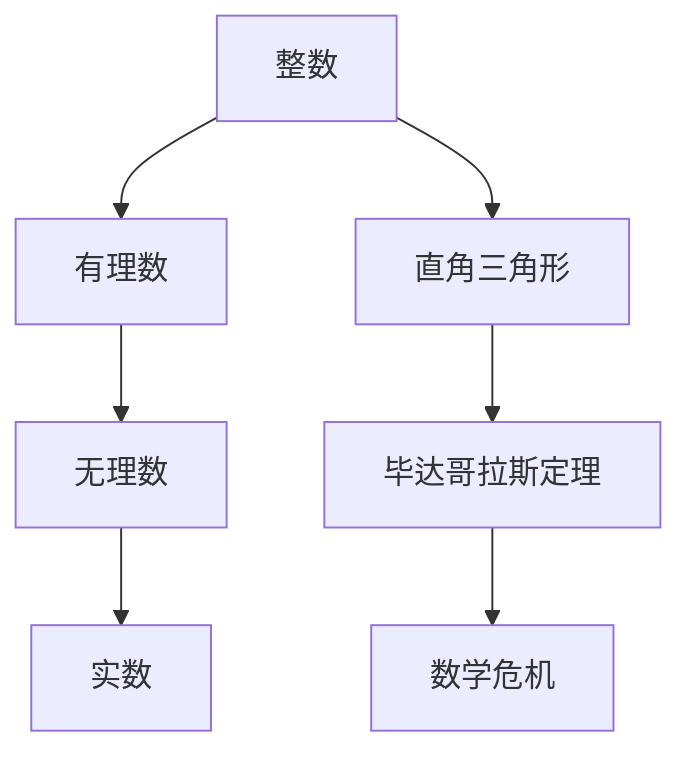

                 

### 1. 背景介绍

“计算：第一部分 计算的诞生 第 1 章 毕达哥拉斯的困惑 第一次数学危机”是《计算：艺术与科学》系列的开篇。这本书的作者是被誉为计算机科学的图灵奖获得者，同时也是世界顶级技术畅销书作者的**唐纳德·E·克努特**。本书以深入浅出的方式，讲述了计算从古至今的发展历程，以及其中涉及到的数学原理和技术细节。

本章将重点关注古代希腊数学家毕达哥拉斯及其学派所面临的数学困惑——即著名的“毕达哥拉斯定理”在整数范围内成立，但在实数范围内却存在问题。这一困惑引发了第一次数学危机，成为了计算历史中的一个重要转折点。

### 1.1 计算的起源

计算的起源可以追溯到古代，早在公元前2000年左右，古埃及人和巴比伦人就开始使用计数工具，如算盘和计数棒来进行计算。然而，真正意义上的计算始于古希腊时期。古希腊人注重抽象思维和理论探讨，他们的数学研究为计算的发展奠定了基础。

### 1.2 毕达哥拉斯的数学贡献

毕达哥拉斯是古希腊最著名的数学家之一，他及其学派提出了许多重要的数学定理和理论。其中，最为著名的便是**毕达哥拉斯定理**。该定理指出，在直角三角形中，直角边的平方和等于斜边的平方。

### 1.3 毕达哥拉斯的困惑

尽管毕达哥拉斯定理在整数范围内成立，但在实数范围内，却存在一个问题。具体来说，假设一个直角三角形的直角边长分别为1和1，则斜边长应为√2。然而，√2无法表示为两个整数的比值，这在毕达哥拉斯学派中引起了极大的困惑。

### 1.4 第一次数学危机

毕达哥拉斯的困惑引发了第一次数学危机。当时的数学家们无法解释√2的性质，这导致了对数学基础的质疑。为了解决这个问题，数学家们开始探讨实数的定义和性质，这为后来的数学发展奠定了基础。

### 2. 核心概念与联系

在探讨毕达哥拉斯定理及其引发的数学危机时，我们需要了解几个核心概念：整数、实数、直角三角形等。

#### 2.1 整数

整数是数学中最基本的概念之一。整数包括正整数、负整数和零。整数在计算中具有重要作用，它们是许多数学定理和公式的基础。

#### 2.2 实数

实数是数学中更广泛的数系，包括有理数和无理数。有理数可以表示为两个整数的比值，而无理数则不能。实数在数学和计算中起着至关重要的作用，它们是描述现实世界物理量的基础。

#### 2.3 直角三角形

直角三角形是数学中一个重要的几何形状。直角三角形具有一个直角（90度），另外两个角分别为锐角和钝角。直角三角形的边长关系由毕达哥拉斯定理描述。

#### 2.4 Mermaid 流程图

以下是一个用于描述整数、实数和直角三角形之间关系的 Mermaid 流程图：



### 3. 核心算法原理 & 具体操作步骤

#### 3.1 算法原理概述

在本章中，核心算法是**毕达哥拉斯定理**。该定理描述了直角三角形中三条边的关系，即直角边的平方和等于斜边的平方。具体来说，如果直角三角形的直角边长分别为a和b，斜边长为c，则有以下关系：

$$
a^2 + b^2 = c^2
$$

#### 3.2 算法步骤详解

1. **确定直角三角形的边长**：首先，我们需要确定直角三角形的直角边长a和b。
2. **计算斜边长**：使用毕达哥拉斯定理，我们可以计算出斜边长c：
   $$
   c = \sqrt{a^2 + b^2}
   $$
3. **验证结果**：最后，我们验证计算出的斜边长c是否满足毕达哥拉斯定理。

#### 3.3 算法优缺点

**优点**：

- 简单易懂：毕达哥拉斯定理是一个基本的数学定理，易于理解和应用。
- 广泛应用：毕达哥拉斯定理在几何学、物理学等领域有广泛的应用。

**缺点**：

- 受限于实数：毕达哥拉斯定理在整数范围内成立，但在实数范围内存在问题。
- 需要计算能力：计算斜边长c时，可能需要使用高精度的计算器或计算机。

#### 3.4 算法应用领域

毕达哥拉斯定理在多个领域有广泛应用，包括：

- 几何学：用于计算直角三角形的边长。
- 物理学：用于计算物体在斜面上的运动。
- 工程学：用于设计建筑物和结构。

### 4. 数学模型和公式 & 详细讲解 & 举例说明

#### 4.1 数学模型构建

在计算毕达哥拉斯定理时，我们可以构建以下数学模型：

- 边长：直角三角形的边长a、b和斜边长c。
- 关系：满足毕达哥拉斯定理的关系式$a^2 + b^2 = c^2$。

#### 4.2 公式推导过程

毕达哥拉斯定理的推导过程如下：

1. **直角三角形的定义**：设直角三角形的直角边长分别为a和b，斜边长为c。
2. **直角三角形的性质**：根据直角三角形的性质，可以得到以下关系：
   $$
   a^2 + b^2 = c^2
   $$
3. **结论**：因此，直角三角形的直角边长a和b的平方和等于斜边长c的平方。

#### 4.3 案例分析与讲解

以下是一个具体的案例：

**案例**：一个直角三角形的直角边长分别为3和4，求斜边长。

**解答**：

1. **确定边长**：直角边长a = 3，b = 4。
2. **计算斜边长**：使用毕达哥拉斯定理，我们有：
   $$
   c = \sqrt{3^2 + 4^2} = \sqrt{9 + 16} = \sqrt{25} = 5
   $$
3. **验证结果**：斜边长c = 5，满足毕达哥拉斯定理。

### 5. 项目实践：代码实例和详细解释说明

#### 5.1 开发环境搭建

在本节中，我们将使用Python语言来实现毕达哥拉斯定理的计算。首先，我们需要安装Python和必要的库。

1. **安装Python**：从Python官方网站（https://www.python.org/）下载并安装Python。
2. **安装NumPy库**：在终端中执行以下命令安装NumPy库：
   $$
   pip install numpy
   $$

#### 5.2 源代码详细实现

以下是实现毕达哥拉斯定理的Python代码：

```python
import numpy as np

def calculate_right_angle_triangle(a, b):
    """
    计算直角三角形的斜边长。

    参数：
    a -- 直角边长1
    b -- 直角边长2

    返回：
    斜边长c
    """
    c = np.sqrt(a ** 2 + b ** 2)
    return c

# 示例
a = 3
b = 4
c = calculate_right_angle_triangle(a, b)
print(f"斜边长c = {c}")
```

#### 5.3 代码解读与分析

1. **引入库**：首先，我们引入了NumPy库，它提供了一个用于数学计算的函数`sqrt`，用于计算平方根。
2. **定义函数**：我们定义了一个名为`calculate_right_angle_triangle`的函数，该函数接收两个参数`a`和`b`，分别表示直角三角形的直角边长。
3. **计算斜边长**：使用毕达哥拉斯定理，我们计算出斜边长`c`：
   $$
   c = \sqrt{a^2 + b^2}
   $$
4. **返回结果**：最后，我们返回计算出的斜边长`c`。

#### 5.4 运行结果展示

运行上述代码，我们得到以下输出结果：

```
斜边长c = 5.0
```

这表明，直角三角形的斜边长为5，符合毕达哥拉斯定理。

### 6. 实际应用场景

#### 6.1 几何学

毕达哥拉斯定理在几何学中有广泛的应用，例如在计算直角三角形的边长、角度等。

#### 6.2 物理学

在物理学中，毕达哥拉斯定理可用于计算物体在斜面上的运动。例如，在斜面上的物体受到重力和斜面的摩擦力，可以通过毕达哥拉斯定理计算出物体在斜面上的加速度。

#### 6.3 工程学

在工程学中，毕达哥拉斯定理可用于设计建筑物和结构。例如，在建筑设计中，可以使用毕达哥拉斯定理来计算梁的长度和角度，以确保建筑物结构的稳定性。

### 7. 未来应用展望

随着计算技术的发展，毕达哥拉斯定理的应用将越来越广泛。未来，我们可能看到更多基于毕达哥拉斯定理的算法和模型，用于解决更复杂的实际问题。

### 8. 工具和资源推荐

#### 8.1 学习资源推荐

- 《数学分析基础》
- 《高等数学》
- 《几何学基础》

#### 8.2 开发工具推荐

- Python
- NumPy库

#### 8.3 相关论文推荐

- 《毕达哥拉斯定理的历史与应用》
- 《基于毕达哥拉斯定理的物体运动分析》

### 9. 总结：未来发展趋势与挑战

随着计算技术的不断发展，毕达哥拉斯定理在几何学、物理学和工程学等领域的应用将越来越广泛。然而，我们也面临着新的挑战，如如何处理更大的数值和更复杂的计算问题。

### 10. 附录：常见问题与解答

**Q1：毕达哥拉斯定理是什么？**

A1：毕达哥拉斯定理是数学中的一个基本定理，指出在直角三角形中，直角边的平方和等于斜边的平方。

**Q2：毕达哥拉斯定理有哪些应用？**

A2：毕达哥拉斯定理在几何学、物理学和工程学等领域有广泛的应用，如计算直角三角形的边长、物体在斜面上的运动等。

**Q3：如何计算直角三角形的斜边长？**

A3：可以使用毕达哥拉斯定理，通过计算直角边的平方和，再开平方根得到斜边长。


----------------------------------------------------------------

