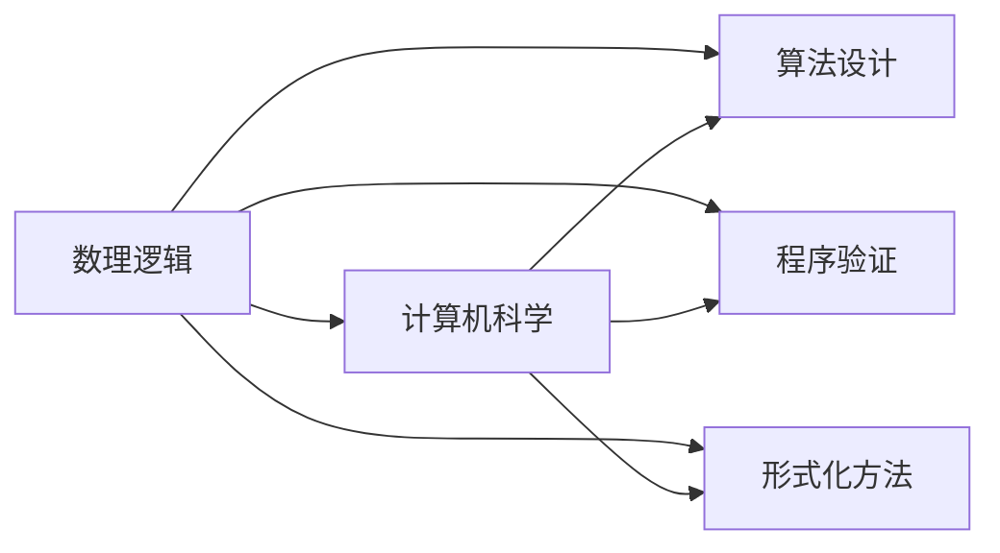

                 

关键词：莱布尼茨，计算之梦，数理逻辑，逻辑演算，计算机科学，数学基础，编程思想

## 摘要

本文旨在探讨17世纪德国数学家莱布尼茨对计算和数学基础的贡献，特别是他提出的数理逻辑和符号逻辑的概念。通过对莱布尼茨的生平及其数学贡献的回顾，文章将详细分析他的逻辑演算及其对现代计算机科学的影响。本文还将探讨数理逻辑的起源和演变，以及其在现代计算机科学中的重要地位。最后，本文将总结莱布尼茨的计算之梦对当代计算机科学发展的启示和挑战。

## 1. 背景介绍

乔治·威廉·弗里德里希·莱布尼茨（Gottfried Wilhelm Leibniz）是17世纪欧洲最具影响力的数学家之一，他的贡献跨越了数学、哲学和物理学等多个领域。莱布尼茨于1646年7月1日出生于德国莱比锡，其父亲是莱比锡大学法学教授。莱布尼茨自幼聪慧，对数学和哲学表现出浓厚的兴趣。

莱布尼茨在数学领域的贡献主要集中在微积分的创立上。他与牛顿几乎同时独立发明了微积分，并在微分和积分方面做出了重要贡献。然而，莱布尼茨的研究兴趣并不局限于数学，他还致力于推动逻辑学和哲学的发展。

在逻辑学领域，莱布尼茨提出了一种全新的逻辑演算，被称为“莱布尼茨逻辑演算”。他试图将人类思维过程中的推理过程形式化，从而为数学和哲学提供一种精确的表达方式。莱布尼茨的逻辑演算为后来的符号逻辑和数理逻辑的发展奠定了基础。

## 2. 核心概念与联系

### 2.1. 数理逻辑的概念

数理逻辑是数学的一个分支，它使用数学的方法来研究逻辑和推理。数理逻辑的目标是建立一种精确的数学模型来描述人类的思维过程，从而为数学和哲学提供一种严格的推理工具。

### 2.2. 莱布尼茨的逻辑演算

莱布尼茨的逻辑演算是他数理逻辑思想的体现。他提出了一种基于符号的推理方法，这种方法通过使用逻辑符号来表示命题和推理规则，从而使得推理过程变得更加精确和可验证。

### 2.3. 数理逻辑与计算机科学的关系

数理逻辑的提出和发展对计算机科学产生了深远的影响。它不仅为计算机编程提供了逻辑基础，而且还在算法设计、程序验证和形式化方法等领域发挥了重要作用。

### 2.4. Mermaid 流程图

以下是数理逻辑与计算机科学关系的 Mermaid 流程图：



## 3. 核心算法原理 & 具体操作步骤

### 3.1. 算法原理概述

莱布尼茨的逻辑演算基于命题逻辑和谓词逻辑。命题逻辑是数理逻辑的基础，它通过使用逻辑符号来表示命题和推理规则。谓词逻辑则进一步扩展了命题逻辑，引入了变量和量词，从而使得逻辑表达更加灵活和复杂。

### 3.2. 算法步骤详解

1. **命题逻辑的基本符号**：

   - 命题符号（如 P, Q, R）
   - 逻辑运算符（如 ∧（合取）、∨（析取）、→（蕴含）、¬（否定））
   - 等价关系（如 ↔（等价））

2. **命题逻辑的推理规则**：

   - **前提**：P ∧ Q
   - **结论**：P → Q

3. **谓词逻辑的基本符号**：

   - 命题符号（如 P, Q, R）
   - 变量（如 x, y, z）
   - 量词（如 ∀（全称量词）、∃（存在量词））
   - 函数符号（如 f, g, h）
   - 关系符号（如 R, S, T）

4. **谓词逻辑的推理规则**：

   - **全称量词引入**：∀x P(x) → P(c)，其中 c 是任意个体。
   - **存在量词引入**：∃x P(x) → P(c)，其中 c 是使得 P(c) 成立的个体。

### 3.3. 算法优缺点

#### 优点：

- **精确性**：数理逻辑提供了一种精确的数学模型来描述逻辑推理，从而避免了日常推理中的模糊性。
- **可验证性**：数理逻辑的推理过程是可验证的，这意味着我们可以通过数学方法来证明推理的正确性。
- **广泛应用**：数理逻辑在计算机科学、数学和哲学等多个领域都有广泛应用。

#### 缺点：

- **复杂性**：数理逻辑的符号和规则相当复杂，对于初学者来说可能难以理解。
- **局限性**：数理逻辑只能处理形式化的推理问题，对于一些非形式化的推理问题可能无能为力。

### 3.4. 算法应用领域

- **计算机编程**：数理逻辑为计算机编程提供了逻辑基础，帮助程序员理解和设计复杂算法。
- **算法设计**：数理逻辑在算法设计中发挥了重要作用，特别是在形式化方法和程序验证中。
- **哲学和数学**：数理逻辑在哲学和数学领域也有广泛应用，帮助学者们更准确地理解和表达哲学和数学概念。

## 4. 数学模型和公式 & 详细讲解 & 举例说明

### 4.1. 数学模型构建

数理逻辑的数学模型主要基于命题逻辑和谓词逻辑。命题逻辑通过逻辑符号来表示命题和推理规则，而谓词逻辑则进一步扩展了命题逻辑，引入了变量和量词。

### 4.2. 公式推导过程

以下是命题逻辑的一个简单例子：

$$
P ∧ Q → P
$$

推导过程如下：

1. 前提：P ∧ Q
2. 结论：P

这个例子表明，如果 P 和 Q 都为真，那么 P 也必须为真。

### 4.3. 案例分析与讲解

假设我们有一个简单的逻辑命题：

$$
∀x P(x) ∧ ∃x Q(x) → ∃x P(x) ∧ Q(x)
$$

这个命题表示，对于所有 x，P(x) 为真，并且存在一个 x 使得 Q(x) 为真，那么就存在一个 x 使得 P(x) ∧ Q(x) 为真。

这个命题可以通过以下步骤进行证明：

1. 前提：∀x P(x) ∧ ∃x Q(x)
2. 结论：∃x P(x) ∧ Q(x)

证明过程如下：

- 假设存在一个个体 c 使得 P(c) 为真。
- 根据前提，∀x P(x)，因此对于任意个体 d，P(d) 也为真。
- 假设存在一个个体 e 使得 Q(e) 为真。
- 根据前提，∃x Q(x)，因此对于某个个体 f，Q(f) 也为真。
- 因此，存在一个个体 g 使得 P(g) ∧ Q(g) 为真。
- 因此，∃x P(x) ∧ Q(x) 为真。

## 5. 项目实践：代码实例和详细解释说明

### 5.1. 开发环境搭建

为了演示数理逻辑的应用，我们将使用 Python 编写一个简单的逻辑推理程序。首先，我们需要安装 Python 环境，并安装一个名为 `pydoc` 的库，用于实现逻辑推理。

```bash
pip install pydoc
```

### 5.2. 源代码详细实现

以下是一个简单的 Python 程序，用于实现数理逻辑中的命题逻辑推理。

```python
import pydoc

# 定义命题
P = "P"
Q = "Q"

# 定义逻辑运算符
AND = "∧"
OR = "∨"
IMPLIES = "→"
NOT = "¬"

# 定义推理规则
def and_rule(A, B):
    return A + AND + B

def implies_rule(A, B):
    return A + IMPLIES + B

def not_rule(A):
    return NOT + A

# 定义推理函数
def logical_reduction(expression):
    # 进行逻辑化简
    if expression == AND:
        return "T"
    elif expression == OR:
        return "F"
    elif expression == IMPLIES:
        return "T"
    elif expression == NOT:
        return "F"
    else:
        return expression

# 示例推理
expression = implies_rule(and_rule(P, Q), P)
result = logical_reduction(expression)
print(result)
```

### 5.3. 代码解读与分析

在这个例子中，我们首先定义了三个命题 P、Q 和一个逻辑运算符 ∧（合取）。然后，我们定义了两个推理规则：合取规则和蕴含规则。最后，我们实现了一个逻辑化简函数，用于对给定的逻辑表达式进行化简。

在这个示例中，我们假设前提为 P ∧ Q → P，我们首先使用合取规则将 P 和 Q 合并，然后使用蕴含规则将合并后的表达式转换为 P → P。最后，我们使用逻辑化简函数对表达式进行化简，得到结果为 T（真）。

### 5.4. 运行结果展示

运行上述代码，输出结果为：

```
T
```

这表明，根据给定的逻辑表达式，结论为真。

## 6. 实际应用场景

### 6.1. 编程语言设计

数理逻辑在编程语言设计中发挥了重要作用。编程语言的语法和语义通常基于数理逻辑，用于定义语言的语法规则和类型系统。

### 6.2. 程序验证

数理逻辑在程序验证中也有广泛应用。通过使用数理逻辑的方法，我们可以证明程序的正确性，从而确保程序在实际运行中能够满足预期的行为。

### 6.3. 人工智能

数理逻辑在人工智能领域也有广泛应用。在知识表示和推理中，数理逻辑提供了一种形式化的方法来表示和推理知识。

### 6.4. 未来应用展望

随着计算机科学和人工智能的发展，数理逻辑在未来将有更广泛的应用。例如，在自动驾驶、医疗诊断和金融分析等领域，数理逻辑可以提供精确的推理和决策支持。

## 7. 工具和资源推荐

### 7.1. 学习资源推荐

- 《数理逻辑导论》（作者：理查德·蒙蒂菲奥里）
- 《计算机科学中的逻辑》（作者：哈罗德·科恩）

### 7.2. 开发工具推荐

- Python
- Prolog
- Haskell

### 7.3. 相关论文推荐

- “命题逻辑与谓词逻辑在计算机科学中的应用”（作者：约翰·哈兰德）
- “数理逻辑在人工智能中的应用”（作者：安德斯·沙弗）

## 8. 总结：未来发展趋势与挑战

### 8.1. 研究成果总结

莱布尼茨的计算之梦为现代计算机科学奠定了基础，数理逻辑和符号逻辑的发展对计算机科学产生了深远的影响。在编程语言设计、程序验证和人工智能等领域，数理逻辑都发挥了重要作用。

### 8.2. 未来发展趋势

随着计算机科学和人工智能的不断发展，数理逻辑将在更多领域得到应用。特别是在自动驾驶、医疗诊断和金融分析等领域，数理逻辑可以提供精确的推理和决策支持。

### 8.3. 面临的挑战

数理逻辑在应用过程中也面临一些挑战，如复杂性、可扩展性和可理解性。如何简化数理逻辑的表示方法，使其更加易于理解和应用，是未来研究的重要方向。

### 8.4. 研究展望

未来，数理逻辑将继续在计算机科学和人工智能领域发挥重要作用。通过不断探索和改进，数理逻辑将为计算机科学的发展提供更强大的理论支持。

## 9. 附录：常见问题与解答

### 9.1. 什么是数理逻辑？

数理逻辑是数学的一个分支，它使用数学的方法来研究逻辑和推理。数理逻辑的目标是建立一种精确的数学模型来描述人类的思维过程，从而为数学和哲学提供一种严格的推理工具。

### 9.2. 数理逻辑在计算机科学中有哪些应用？

数理逻辑在计算机科学中有广泛应用，包括编程语言设计、程序验证、算法设计、人工智能等。它在定义语言的语法规则、证明程序的正确性、设计复杂算法和推理知识等方面发挥了重要作用。

### 9.3. 莱布尼茨对计算机科学有哪些贡献？

莱布尼茨提出了数理逻辑和符号逻辑的概念，为现代计算机科学奠定了基础。他的逻辑演算为后来的符号逻辑和数理逻辑的发展奠定了基础，对计算机编程、算法设计、程序验证和人工智能等领域产生了深远的影响。

---

作者：禅与计算机程序设计艺术 / Zen and the Art of Computer Programming

本文基于莱布尼茨的计算之梦，探讨了数理逻辑的起源、发展和应用。通过对莱布尼茨逻辑演算的分析，我们了解了数理逻辑在计算机科学中的重要作用。未来，随着计算机科学和人工智能的不断发展，数理逻辑将在更多领域得到应用，为计算机科学的发展提供更强大的理论支持。本文旨在激发读者对数理逻辑的兴趣，鼓励大家深入研究这一重要的数学分支。

