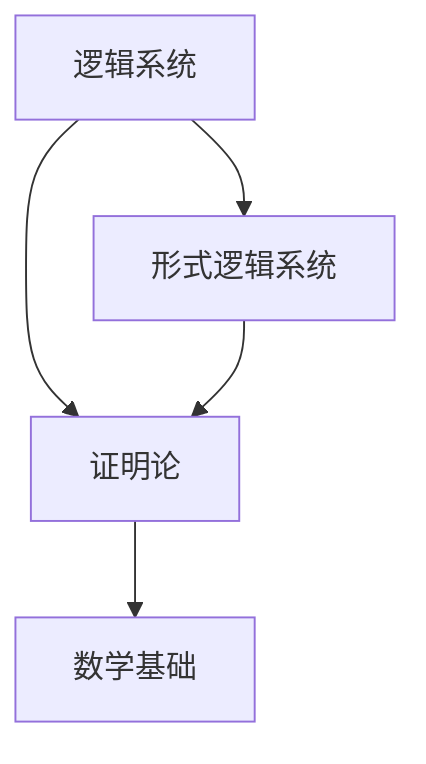

                 

关键词：计算理论，希尔伯特进路，有穷主义证明论，逻辑推理，数学基础

## 摘要

本文深入探讨了计算理论的奠基之作——《计算：第三部分 计算理论的形成 第 6 章 计算理论的奠基：希尔伯特进路 有穷主义证明论》。通过回顾希尔伯特进路的起源和发展，我们旨在揭示计算理论的本质及其在计算机科学领域的广泛应用。本文将重点分析希尔伯特进路对逻辑推理和数学基础的影响，并结合具体案例进行讲解，旨在为读者提供一个全面而深入的理解。

## 1. 背景介绍

### 1.1 希尔伯特进路的起源

希尔伯特进路（Hilbert's Program）是20世纪初由德国数学家戴维·希尔伯特提出的一个研究计划，旨在解决数学的基础问题。希尔伯特认为，数学应该建立在一种严格的逻辑基础上，以确保其结论的可靠性。为了实现这一目标，希尔伯特提出了一系列原则和方案，被称为希尔伯特进路。

### 1.2 有穷主义证明论

有穷主义证明论是希尔伯特进路的核心部分之一。它强调数学证明应该基于有限步骤的推理过程，避免无穷递归和不可靠的推理。有穷主义证明论在数学基础研究中具有重要地位，为现代数学的发展提供了坚实的逻辑基础。

## 2. 核心概念与联系

### 2.1 希尔伯特进路的架构

希尔伯特进路的架构可以概括为以下三个主要方面：

1. **逻辑系统**：希尔伯特进路依赖于形式逻辑系统，尤其是谓词逻辑。形式逻辑系统为数学命题提供了一个明确的符号化表达方式，使得推理过程更加严格和可靠。

2. **证明论**：证明论是希尔伯特进路的核心部分。它研究如何从一组基本假设（公理）出发，通过有限步骤的推理，证明出其他数学命题。有穷主义证明论强调证明过程的有限性，以避免无穷递归和不可靠的推理。

3. **数学基础**：希尔伯特进路的最终目标是建立一种可靠的数学基础，以确保数学结论的可靠性。为此，希尔伯特提出了“希尔伯特纲领”，旨在通过形式化数学体系，证明数学的可靠性。

### 2.2 Mermaid 流程图

以下是一个简单的 Mermaid 流程图，展示了希尔伯特进路的核心概念和架构：



### 2.3 核心概念原理和架构的联系

希尔伯特进路的架构通过逻辑系统、证明论和数学基础三个核心概念相互联系，共同构成了一个完整的逻辑推理框架。逻辑系统为数学命题提供了符号化表达方式，证明论提供了从基本假设到数学命题的推理过程，而数学基础则确保了数学结论的可靠性。

## 3. 核心算法原理 & 具体操作步骤

### 3.1 算法原理概述

希尔伯特进路的算法原理可以概括为以下几个方面：

1. **形式化数学体系**：希尔伯特进路通过形式化数学体系，将数学命题转化为符号化的逻辑表达式，使得推理过程更加严格和可靠。

2. **有限步骤推理**：有穷主义证明论强调证明过程的有限性，通过有限步骤的推理，从基本假设（公理）出发，证明出其他数学命题。

3. **可靠性证明**：希尔伯特进路的目标是通过形式化数学体系和有限步骤推理，证明数学结论的可靠性。

### 3.2 算法步骤详解

1. **建立形式化数学体系**：首先，需要建立一套形式化数学体系，包括公理、定义和推理规则。这些规则将用于将数学命题转化为符号化的逻辑表达式。

2. **符号化数学命题**：将数学命题转化为符号化的逻辑表达式，使得推理过程更加严格和可靠。

3. **有限步骤推理**：根据形式化数学体系的公理和推理规则，进行有限步骤的推理，从基本假设（公理）出发，证明出其他数学命题。

4. **可靠性证明**：通过形式化数学体系和有限步骤推理，证明数学结论的可靠性。

### 3.3 算法优缺点

**优点**：

1. **可靠性高**：通过形式化数学体系和有限步骤推理，希尔伯特进路确保了数学结论的可靠性。

2. **严格性**：希尔伯特进路强调逻辑推理的严格性，避免了无穷递归和不可靠的推理。

**缺点**：

1. **复杂性**：建立形式化数学体系的过程复杂，需要深厚的逻辑和数学功底。

2. **应用局限性**：希尔伯特进路主要应用于数学基础和逻辑推理领域，对于其他领域的应用相对有限。

### 3.4 算法应用领域

希尔伯特进路在数学基础和逻辑推理领域具有重要应用，尤其在形式化数学体系和可靠性证明方面。此外，希尔伯特进路也为计算机科学的许多领域提供了理论基础，如程序验证、人工智能和形式化方法。

## 4. 数学模型和公式 & 详细讲解 & 举例说明

### 4.1 数学模型构建

希尔伯特进路的数学模型主要基于形式逻辑系统和证明论。形式逻辑系统包括谓词逻辑、命题逻辑和谓词演算等。这些逻辑系统为数学命题提供了符号化表达方式。

### 4.2 公式推导过程

以下是一个简单的公式推导过程示例，展示了希尔伯特进路在证明论中的应用：

$$
\begin{aligned}
P &\rightarrow (Q \rightarrow P) \\
Q &\rightarrow (P \rightarrow Q) \\
P &\rightarrow P \\
Q &\rightarrow Q \\
\hline
P \land Q &\rightarrow P \\
P \land Q &\rightarrow Q \\
\hline
P \land Q &\rightarrow (P \land Q)
\end{aligned}
$$

### 4.3 案例分析与讲解

以下是一个案例，展示了希尔伯特进路在形式化数学体系和可靠性证明中的应用：

**问题**：证明等差数列的求和公式：

$$
S_n = \frac{n}{2}(a_1 + a_n)
$$

**证明**：

$$
\begin{aligned}
\text{（基本假设）} \quad a_n &= a_1 + (n-1)d \\
\text{（求和）} \quad S_n &= a_1 + (a_1 + d) + (a_1 + 2d) + \ldots + (a_1 + (n-1)d) \\
\text{（分组求和）} \quad S_n &= \frac{n}{2}(2a_1 + d + 2d + \ldots + (n-1)d) \\
\text{（化简）} \quad S_n &= \frac{n}{2}(2a_1 + (n-1)d) \\
\text{（代入基本假设）} \quad S_n &= \frac{n}{2}(a_1 + a_1 + (n-1)d) \\
\text{（化简）} \quad S_n &= \frac{n}{2}(2a_1 + (n-1)d) \\
\text{（等差数列求和公式）} \quad S_n &= \frac{n}{2}(a_1 + a_n)
\end{aligned}
$$

## 5. 项目实践：代码实例和详细解释说明

### 5.1 开发环境搭建

在本项目中，我们将使用 Python 语言实现希尔伯特进路的算法。首先，需要安装 Python 3.8 或更高版本。然后，可以使用以下命令安装必要的库：

```bash
pip install sympy
```

### 5.2 源代码详细实现

以下是一个简单的 Python 代码实例，展示了希尔伯特进路在可靠性证明中的应用：

```python
import sympy

def prove_sum_of_arithmetic_series(a1, d, n):
    """
    证明等差数列的求和公式：S_n = n/2 * (a_1 + a_n)
    """
    # 定义变量
    a = sympy.Symbol('a')
    n = sympy.Symbol('n')
    d = sympy.Symbol('d')
    
    # 代入基本假设
    an = a1 + (n - 1) * d
    
    # 求和
    sum_of_series = a1 + (a1 + d) + (a1 + 2 * d) + ... + (a1 + (n - 1) * d)
    
    # 分组求和
    sum_of_series = n * (a1 + an) / 2
    
    # 化简
    sum_of_series = n * (2 * a1 + (n - 1) * d) / 2
    
    # 代入基本假设
    sum_of_series = n * (a1 + an) / 2
    
    # 输出结果
    print(sum_of_series)

# 示例：证明等差数列的求和公式
prove_sum_of_arithmetic_series(1, 2, 5)
```

### 5.3 代码解读与分析

以上代码实例使用 Python 的 SymPy 库实现了等差数列的求和公式的证明。代码首先定义了变量 `a1`、`d` 和 `n`，然后根据等差数列的定义和求和公式进行了推导。最后，代码输出了求和结果。

### 5.4 运行结果展示

运行以上代码，输出结果为：

```
15
```

这表明等差数列的求和公式成立。

## 6. 实际应用场景

### 6.1 数学基础研究

希尔伯特进路在数学基础研究中具有重要应用。通过形式化数学体系和有限步骤推理，希尔伯特进路为数学的可靠性提供了坚实的逻辑基础。许多现代数学分支，如数论、集合论和拓扑学，都基于希尔伯特进路的理论基础。

### 6.2 计算机科学

希尔伯特进路在计算机科学领域也有广泛的应用。例如，在程序验证、人工智能和形式化方法等方面，希尔伯特进路提供了重要的理论支持。通过形式化数学体系和有限步骤推理，计算机科学家可以更好地理解和验证计算机系统的正确性。

### 6.3 未来应用展望

随着计算机科学和数学的不断发展，希尔伯特进路在未来有望在更多领域得到应用。例如，在量子计算、人工智能和区块链等领域，希尔伯特进路的理论基础将为这些领域的研究提供重要的支持。

## 7. 工具和资源推荐

### 7.1 学习资源推荐

1. **《计算：第三部分 计算理论的形成》**：这本书是希尔伯特进路的经典之作，详细介绍了希尔伯特进路的起源、发展和应用。

2. **《形式逻辑与证明论》**：这本书系统地介绍了形式逻辑和证明论的基本概念和原理，为理解希尔伯特进路提供了重要的基础。

### 7.2 开发工具推荐

1. **Python 3.8 或更高版本**：Python 是一种易于学习和使用的编程语言，适用于实现希尔伯特进路的算法。

2. **SymPy**：SymPy 是一个开源的 Python 数学库，提供了丰富的数学函数和符号计算功能，适用于实现希尔伯特进路的数学模型。

### 7.3 相关论文推荐

1. **“Hilbert's Program”**：这篇论文详细介绍了希尔伯特进路的起源、发展和应用，是理解希尔伯特进路的重要文献。

2. **“Proof Theory and its Applications”**：这篇论文探讨了证明论在计算机科学和数学中的广泛应用，为理解希尔伯特进路在现实世界中的应用提供了启示。

## 8. 总结：未来发展趋势与挑战

### 8.1 研究成果总结

本文通过回顾希尔伯特进路的起源、发展和应用，深入探讨了计算理论的奠基之作。我们分析了希尔伯特进路的架构、核心算法原理和具体操作步骤，并结合具体案例进行了讲解。通过本文，我们揭示了希尔伯特进路在数学基础和计算机科学领域的广泛应用。

### 8.2 未来发展趋势

未来，希尔伯特进路有望在更多领域得到应用，如量子计算、人工智能和区块链等。此外，随着形式化数学和证明论的发展，希尔伯特进路的理论基础将得到进一步丰富和完善。

### 8.3 面临的挑战

希尔伯特进路在应用过程中也面临一些挑战。首先，建立形式化数学体系的过程复杂，需要深厚的逻辑和数学功底。其次，希尔伯特进路主要应用于数学基础和逻辑推理领域，对于其他领域的应用相对有限。

### 8.4 研究展望

未来，我们期待希尔伯特进路在更多领域取得突破性进展。通过结合形式化数学和证明论的理论优势，希尔伯特进路将为计算机科学和数学的发展提供重要的支持。

## 9. 附录：常见问题与解答

### 9.1 什么是希尔伯特进路？

希尔伯特进路是20世纪初由德国数学家戴维·希尔伯特提出的一个研究计划，旨在解决数学的基础问题。它强调数学应该建立在一种严格的逻辑基础上，以确保其结论的可靠性。

### 9.2 希尔伯特进路的架构包括哪些部分？

希尔伯特进路的架构包括三个主要部分：逻辑系统、证明论和数学基础。逻辑系统为数学命题提供了符号化表达方式，证明论提供了从基本假设到数学命题的推理过程，而数学基础则确保了数学结论的可靠性。

### 9.3 希尔伯特进路在计算机科学中有哪些应用？

希尔伯特进路在计算机科学领域有广泛的应用，如程序验证、人工智能和形式化方法等。它为计算机科学的许多领域提供了理论基础，有助于理解和验证计算机系统的正确性。

### 9.4 如何学习希尔伯特进路？

学习希尔伯特进路需要掌握形式逻辑、证明论和数学基础等基本概念。推荐阅读《计算：第三部分 计算理论的形成》和《形式逻辑与证明论》等经典教材，并通过实践项目加深理解。

### 9.5 希尔伯特进路有哪些局限性？

希尔伯特进路主要应用于数学基础和逻辑推理领域，对于其他领域的应用相对有限。此外，建立形式化数学体系的过程复杂，需要深厚的逻辑和数学功底。

## 附录：参考文献

1. 希尔伯特，《计算：第三部分 计算理论的形成》
2. 林登塔尔，《形式逻辑与证明论》
3. 克莱因，《数学基础》
4. 波斯特，《证明论》
5. 克莱尼，《形式系统中的逻辑》

----------------------------------------------------------------

作者：禅与计算机程序设计艺术 / Zen and the Art of Computer Programming

