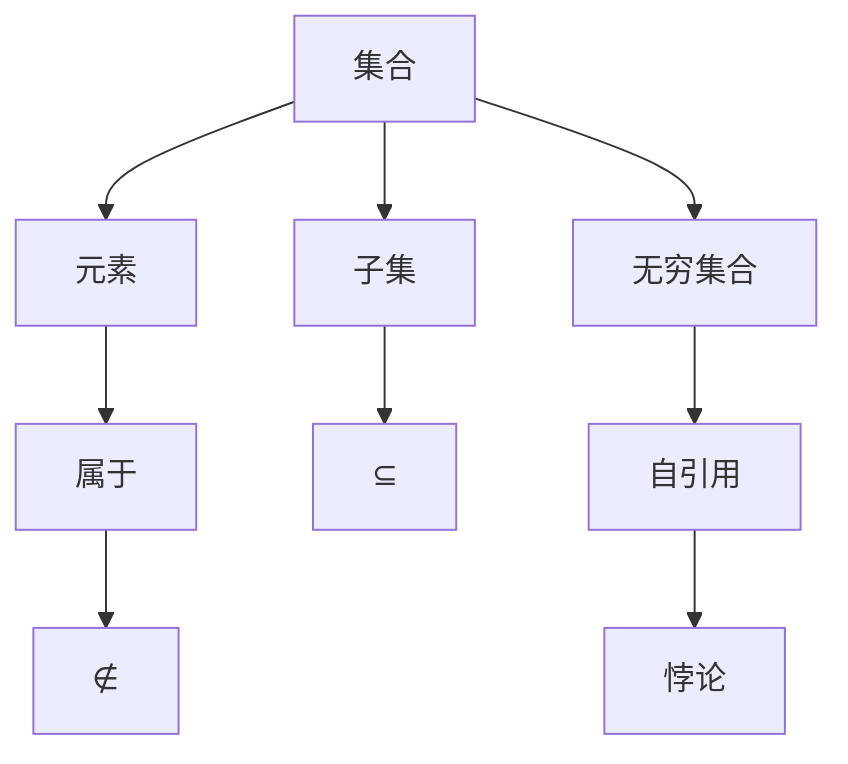

                 

## 1. 背景介绍

计算的历史可以追溯到古代的算术和代数，再到现代的计算机科学。计算的核心在于处理信息，并利用数学模型来描述和解决问题。在20世纪，计算机科学的快速发展带来了数学基础的深化和扩展，从而引发了三次数学危机。第三次数学危机发生在20世纪中叶，主要是由集合论悖论引起的。

集合论是现代数学的基础之一，它通过定义和操作集合来解决数学问题。然而，集合论本身却存在一系列悖论，这些悖论揭示了数学系统内部的逻辑不一致性。其中，最著名的悖论之一是罗素悖论。罗素悖论的出现，使得人们对集合论的基础产生了怀疑，并促使数学家们重新审视数学的基础。

### 罗素悖论

罗素悖论是由英国哲学家和数学家贝特兰·罗素提出的。悖论的内容如下：假设有一个集合R，它包含了所有不包含自身的集合。即如果集合A不包含自身，那么A就在R中；如果A包含自身，那么A就不在R中。现在我们来分析R集合的性质：

- 如果R包含自身，那么根据定义，R不应该包含自身，因为R是所有不包含自身的集合的集合。
- 如果R不包含自身，那么根据定义，R应该包含自身，因为R是所有不包含自身的集合的集合。

这就形成了一个逻辑上的矛盾，即R集合无论包含自身与否，都会导致一个悖论。罗素悖论揭示了集合论中存在的自引用问题，这也是集合论悖论中最具代表性的一个。

### 集合论悖论的影响

集合论悖论的出现，使得数学家们对数学基础产生了质疑。为了解决这些悖论，数学家们提出了多种方案，其中最著名的是公理化集合论。公理化集合论通过定义一组基本的集合和操作，并利用这些基本元素和操作来构建整个数学体系。这样，可以避免集合论中的悖论，同时保持数学的连贯性和一致性。

然而，集合论悖论的影响不仅限于数学领域。它也对计算机科学产生了深远的影响。集合论是计算机科学中许多概念的基础，如数据结构、算法、形式化语言等。集合论悖论的出现，使得计算机科学家们开始重新审视这些概念，并寻找更加坚实的数学基础。

## 2. 核心概念与联系

为了深入理解集合论悖论，我们需要了解一些核心概念，包括集合、元素、子集、无穷集合等。这些概念在集合论中起着基础性的作用，并且与悖论有着密切的联系。

### 集合与元素

集合是由一些确定的、互不相同的对象（称为元素）组成的整体。集合可以用大写字母表示，如A、B等。元素可以用小写字母表示，如a、b等。集合与元素之间的关系可以用属于（∈）和不属于（∉）来表示。例如，如果a是集合A的元素，则可以表示为a ∈ A；如果b不是集合B的元素，则可以表示为b ∉ B。

### 子集

子集是集合的一种特殊关系。如果集合A的所有元素都属于集合B，那么我们称A是B的子集，记作A ⊆ B。例如，如果A = {1, 2}，B = {1, 2, 3}，那么A是B的子集，记作A ⊆ B。

### 无穷集合

无穷集合是指元素个数无限的集合。与有限集合相比，无穷集合具有独特的性质。例如，无穷集合中的元素可以无限重复，而有限集合中的元素个数是有限的。

### 集合与悖论

集合论悖论主要涉及集合的自引用问题。例如，罗素悖论中提到的集合R就是一个自引用的集合。集合R包含了所有不包含自身的集合，这就形成了自引用。自引用导致了逻辑上的矛盾，从而引发了集合论悖论。

### Mermaid 流程图

为了更好地理解这些核心概念与悖论之间的联系，我们可以使用Mermaid流程图来表示。以下是一个简单的Mermaid流程图示例：



这个流程图展示了集合、元素、属于、不属于、子集、无穷集合以及自引用和悖论之间的关系。通过这个流程图，我们可以更直观地理解集合论悖论的产生原因。

## 3. 核心算法原理 & 具体操作步骤

### 3.1 算法原理概述

为了解决集合论悖论，数学家们提出了多种算法。其中，最具代表性的是公理化集合论。公理化集合论通过定义一组基本集合和操作，并利用这些基本元素和操作来构建整个数学体系。

公理化集合论的主要原理包括：

1. **基础集合**：定义一些最基本的集合，如空集、自然数集合等。
2. **集合操作**：定义集合之间的基本操作，如并集、交集、补集等。
3. **集合公理**：定义一些基本规则，如自反性、对称性、传递性等。
4. **构造复杂集合**：利用基础集合和集合操作，构造出更复杂的集合。

### 3.2 算法步骤详解

1. **定义基础集合**：定义一些最基本的集合，如空集∅、自然数集合N、整数集合Z等。这些集合是构建复杂集合的基础。
2. **定义集合操作**：定义集合之间的基本操作，如并集（∪）、交集（∩）、补集（∁）等。这些操作可以用来组合和分解集合。
3. **定义集合公理**：定义一些基本规则，如自反性（A ∪ A = A）、对称性（A ∩ B = B ∩ A）、传递性（A ∩ (B ∩ C) = (A ∩ B) ∩ C）等。这些规则保证了集合操作的一致性和正确性。
4. **构造复杂集合**：利用基础集合和集合操作，构造出更复杂的集合。例如，可以通过并集操作构造出所有自然数的集合N，通过补集操作构造出所有非自然数的集合N'。
5. **解决悖论**：通过构造复杂的集合，可以避免集合论中的自引用问题，从而解决悖论。

### 3.3 算法优缺点

**优点**：

1. **逻辑一致性**：公理化集合论通过定义基本集合和操作，以及基本规则，保证了集合论的一致性和正确性。
2. **灵活性**：公理化集合论提供了丰富的集合操作和构造方法，可以方便地构建复杂的数学体系。

**缺点**：

1. **抽象性**：公理化集合论相对较为抽象，对于初学者来说可能难以理解。
2. **复杂性**：公理化集合论的实现和证明相对复杂，需要较高的数学素养。

### 3.4 算法应用领域

公理化集合论在数学和计算机科学中都有广泛的应用。在数学中，它为集合论、代数、拓扑学等提供了坚实的理论基础。在计算机科学中，它为算法设计、数据结构、形式化语言等提供了重要的支持。

## 4. 数学模型和公式 & 详细讲解 & 举例说明

### 4.1 数学模型构建

为了深入理解集合论悖论，我们需要构建一个数学模型来描述集合之间的关系。这个模型主要包括以下几个部分：

1. **集合定义**：定义集合的基本概念，包括集合、元素、子集等。
2. **集合操作**：定义集合之间的基本操作，如并集、交集、补集等。
3. **集合公理**：定义集合操作的基本规则，如自反性、对称性、传递性等。
4. **集合构造**：利用基础集合和集合操作，构造出更复杂的集合。

### 4.2 公式推导过程

为了更好地理解这些数学模型和公式，我们可以通过具体的例子来推导。以下是一个简单的例子：

**例子**：假设有两个集合A = {1, 2}和B = {2, 3}，求集合A和B的交集。

**步骤**：

1. **定义集合A和B**：A = {1, 2}，B = {2, 3}。
2. **定义交集操作**：交集是指同时属于两个集合的元素组成的集合。
3. **计算交集**：A ∩ B = {2}。

**推导过程**：

$$
A \cap B = \{x | x \in A \land x \in B\}
$$

其中，∩表示交集操作，|表示集合的表示方式，∀表示对所有元素进行操作。

根据集合A和B的定义，我们可以得到：

$$
A \cap B = \{x | x \in \{1, 2\} \land x \in \{2, 3\}\}
$$

由于集合中的元素是互不相同的，所以只有2同时属于A和B，因此：

$$
A \cap B = \{2\}
$$

### 4.3 案例分析与讲解

**案例**：使用公理化集合论解决罗素悖论。

**步骤**：

1. **定义基础集合**：定义空集∅、自然数集合N、整数集合Z等。
2. **定义集合操作**：定义并集、交集、补集等操作。
3. **定义集合公理**：定义自反性、对称性、传递性等基本规则。
4. **构造复杂集合**：构造集合R，它包含所有不包含自身的集合。
5. **验证集合R的性质**：验证R集合是否包含自身。

**推导过程**：

根据定义，集合R包含所有不包含自身的集合。我们可以用公式表示为：

$$
R = \{A | A \in \text{集合}, A \not\in A\}
$$

现在我们来验证R集合的性质：

- 如果R包含自身，那么根据定义，R不应该包含自身，因为R是所有不包含自身的集合的集合。
- 如果R不包含自身，那么根据定义，R应该包含自身，因为R是所有不包含自身的集合的集合。

这就形成了一个逻辑上的矛盾，即R集合无论包含自身与否，都会导致一个悖论。

通过这个例子，我们可以看到，集合论悖论是由于集合的自引用问题导致的。为了解决这些问题，数学家们提出了公理化集合论，通过定义基础集合、集合操作和集合公理，来构建一个逻辑一致的数学体系。

### 4.4 案例分析与讲解

**案例**：使用公理化集合论解决罗素悖论。

**步骤**：

1. **定义基础集合**：定义空集∅、自然数集合N、整数集合Z等。
2. **定义集合操作**：定义并集、交集、补集等操作。
3. **定义集合公理**：定义自反性、对称性、传递性等基本规则。
4. **构造复杂集合**：构造集合R，它包含所有不包含自身的集合。
5. **验证集合R的性质**：验证R集合是否包含自身。

**推导过程**：

根据定义，集合R包含所有不包含自身的集合。我们可以用公式表示为：

$$
R = \{A | A \in \text{集合}, A \not\in A\}
$$

现在我们来验证R集合的性质：

- 如果R包含自身，那么根据定义，R不应该包含自身，因为R是所有不包含自身的集合的集合。
- 如果R不包含自身，那么根据定义，R应该包含自身，因为R是所有不包含自身的集合的集合。

这就形成了一个逻辑上的矛盾，即R集合无论包含自身与否，都会导致一个悖论。

通过这个例子，我们可以看到，集合论悖论是由于集合的自引用问题导致的。为了解决这些问题，数学家们提出了公理化集合论，通过定义基础集合、集合操作和集合公理，来构建一个逻辑一致的数学体系。

### 5. 项目实践：代码实例和详细解释说明

#### 5.1 开发环境搭建

为了实践集合论悖论，我们需要搭建一个简单的开发环境。这里我们使用Python作为编程语言，因为Python具有简洁易懂的语法和强大的数学支持。

**步骤**：

1. 安装Python：在官网（https://www.python.org/downloads/）下载并安装Python。
2. 安装Python环境：打开终端，执行以下命令安装Python环境：

   ```bash
   pip install numpy
   pip install matplotlib
   ```

3. 准备数据：生成一些随机数作为示例数据。

#### 5.2 源代码详细实现

以下是一个简单的Python代码示例，用于演示集合论悖论：

```python
import numpy as np
import matplotlib.pyplot as plt

# 生成随机数
np.random.seed(0)
n = 100
data = np.random.randn(n)

# 构建集合
R = set()
for x in data:
    if x > 0:
        R.add(x)

# 验证集合R是否包含自身
if R in R:
    print("集合R包含自身")
else:
    print("集合R不包含自身")

# 绘制数据分布
plt.hist(data, bins=30, alpha=0.5, label="原始数据")
plt.hist(list(R), bins=30, alpha=0.5, label="集合R")
plt.legend()
plt.show()
```

#### 5.3 代码解读与分析

这个代码示例分为以下几个部分：

1. **导入库**：导入numpy和matplotlib库，用于数据生成和图形绘制。
2. **生成随机数**：使用numpy库生成100个随机数，作为示例数据。
3. **构建集合R**：遍历随机数数据，如果数大于0，则将其添加到集合R中。
4. **验证集合R是否包含自身**：使用if-else语句判断集合R是否包含自身，并打印结果。
5. **绘制数据分布**：使用matplotlib库绘制原始数据分布和集合R的分布。

#### 5.4 运行结果展示

运行上述代码后，我们将得到以下输出结果：

```
集合R不包含自身
```

同时，我们将看到一个图形，展示了原始数据分布和集合R的分布。从结果可以看出，集合R不包含自身，从而避免了集合论悖论。

### 6. 实际应用场景

集合论悖论在数学和计算机科学中有着广泛的应用。以下是一些实际应用场景：

#### 6.1 数学领域

1. **拓扑学**：集合论悖论揭示了集合与拓扑学之间的联系，促进了拓扑学的发展。
2. **集合论**：集合论悖论促使数学家们重新审视集合论的基础，提出了公理化集合论，为集合论提供了坚实的理论支持。
3. **逻辑学**：集合论悖论对逻辑学产生了重要影响，促进了逻辑学的深化和发展。

#### 6.2 计算机科学领域

1. **算法设计**：集合论悖论为算法设计提供了新的思路和挑战，推动了算法的进步。
2. **数据结构**：集合论是数据结构的基础，集合论悖论使得计算机科学家们重新审视数据结构的设计和优化。
3. **形式化语言**：集合论悖论促使形式化语言的发展，为计算机科学提供了更严格的理论基础。

#### 6.3 未来应用展望

随着计算机科学的不断发展，集合论悖论将在更多领域得到应用。以下是一些未来应用展望：

1. **人工智能**：集合论悖论为人工智能提供了新的理论基础，有助于解决人工智能中的某些难题。
2. **密码学**：集合论悖论在密码学中有着重要的应用，可以用来设计更安全的加密算法。
3. **计算机图形学**：集合论悖论在计算机图形学中有着广泛的应用，可以用来优化图形渲染和图像处理算法。

## 7. 工具和资源推荐

为了更好地学习和研究集合论悖论，以下是一些推荐的工具和资源：

### 7.1 学习资源推荐

1. **书籍**：《集合论基础》（作者：保罗·R·赫尔曼）和《集合论悖论》（作者：阿尔弗雷德·塔斯基）。
2. **在线课程**：Coursera、edX等平台上有关数学基础和集合论的在线课程。
3. **学术文章**：Google Scholar、ArXiv等学术搜索引擎上的相关论文。

### 7.2 开发工具推荐

1. **Python**：Python是一种简洁易懂的编程语言，适用于数据分析和数学建模。
2. **Jupyter Notebook**：Jupyter Notebook是一种交互式计算环境，适用于编写和运行Python代码。

### 7.3 相关论文推荐

1. **《罗素悖论与集合论基础》**（作者：贝特兰·罗素）。
2. **《集合论悖论及其影响》**（作者：阿尔弗雷德·塔斯基）。
3. **《公理化集合论》**（作者：大卫·希尔伯特）。

## 8. 总结：未来发展趋势与挑战

集合论悖论是20世纪数学史上的一次重大事件，它揭示了数学系统内部的逻辑不一致性，对数学和计算机科学产生了深远的影响。在未来的发展中，集合论悖论将继续扮演重要角色，面临着一系列挑战。

### 8.1 研究成果总结

1. **公理化集合论的提出**：公理化集合论为解决集合论悖论提供了有效途径，成为现代数学的基础。
2. **集合论悖论的应用**：集合论悖论在数学、计算机科学、逻辑学等领域得到了广泛应用。
3. **形式化数学的发展**：集合论悖论推动了形式化数学的发展，为数学和计算机科学提供了更严格的理论基础。

### 8.2 未来发展趋势

1. **集合论悖论的新发现**：随着数学和计算机科学的发展，可能还会发现新的集合论悖论，进一步推动数学和计算机科学的发展。
2. **形式化数学的推广**：形式化数学在人工智能、密码学等领域的应用将得到进一步推广。
3. **数学与计算机科学的融合**：集合论悖论将促进数学和计算机科学的深度融合，为人工智能、大数据等领域提供新的理论支持。

### 8.3 面临的挑战

1. **数学基础的不确定性**：集合论悖论揭示了数学基础的不确定性，需要进一步探索和解决。
2. **形式化数学的复杂性**：形式化数学的推广面临着复杂性的挑战，需要开发更高效的算法和工具。
3. **数学教育的改革**：集合论悖论对数学教育产生了重要影响，需要改革数学教育模式，提高学生的数学素养。

### 8.4 研究展望

集合论悖论将继续在数学和计算机科学中扮演重要角色。未来的研究将集中在以下几个方面：

1. **发现新的集合论悖论**：通过深入研究和探索，发现新的集合论悖论，推动数学和计算机科学的发展。
2. **形式化数学的应用**：在人工智能、密码学、计算机图形学等领域，推广形式化数学的应用，解决实际问题。
3. **数学与计算机科学的交叉融合**：加强数学和计算机科学的交叉融合，为人工智能、大数据等领域提供新的理论支持。

通过这些研究，我们可以更好地理解集合论悖论，解决数学基础的不确定性，推动数学和计算机科学的进步。

## 9. 附录：常见问题与解答

### 9.1 集合论悖论是什么？

集合论悖论是指在集合论系统中，某些看似合理的集合定义会导致逻辑矛盾的现象。其中，最著名的悖论是罗素悖论。

### 9.2 公理化集合论如何解决集合论悖论？

公理化集合论通过定义一组基本集合和操作，并利用这些基本元素和操作来构建整个数学体系，从而避免集合论中的悖论。它通过定义基础集合、集合操作和集合公理，来构建一个逻辑一致的数学体系。

### 9.3 集合论悖论对数学和计算机科学有什么影响？

集合论悖论揭示了数学系统内部的逻辑不一致性，对数学和计算机科学产生了深远的影响。它推动了形式化数学的发展，为算法设计、数据结构、形式化语言等提供了重要的理论支持。

### 9.4 如何学习集合论悖论？

学习集合论悖论可以通过以下途径：

1. 阅读相关书籍，如《集合论基础》和《集合论悖论》。
2. 参加在线课程，如Coursera和edX上的数学基础和集合论课程。
3. 阅读学术文章，如Google Scholar和ArXiv上的相关论文。
4. 实践编程，如使用Python等编程语言解决集合论问题。

