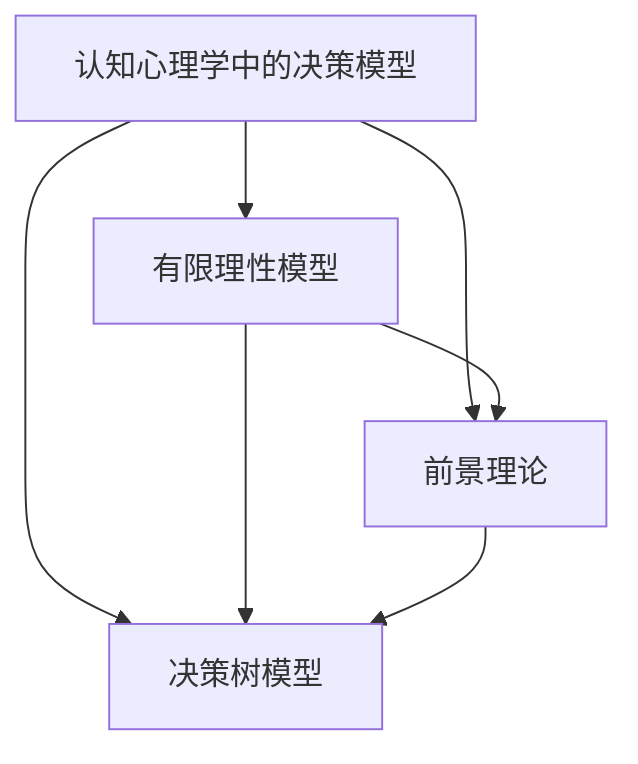

                 

认知偏差是指人们在信息处理过程中，由于心理、情感、经验等因素的影响，导致其对信息的理解、评估和判断出现偏差。这些偏差在投资决策中尤为明显，因为投资涉及大量的不确定性、风险和复杂性。本文将深入探讨认知偏差在投资决策中的影响，以及如何通过技术和策略来减轻这些偏差。

## 1. 背景介绍

投资决策是金融领域中的一个核心问题。成功的投资决策不仅能够带来财务回报，还能够增强投资者的信心和满足感。然而，投资市场的波动性和不确定性使得投资决策变得复杂。在这个过程中，投资者的认知偏差可能会对其决策产生深远的影响。

认知偏差的根源可以追溯到心理学领域。行为金融学研究表明，投资者的行为往往受到心理偏见的影响，这些偏见可能来自于人类认知过程的局限性。例如，人们往往会高估自己的预测能力，或者受到群体心理的影响，做出非理性的决策。

本文将从以下几个方面探讨认知偏差对投资决策的影响：

1. **代表性偏差**：投资者往往根据过去的经验或模式来判断未来的情况，这种偏差可能导致对新兴机会或威胁的忽视。
2. **确认偏差**：投资者倾向于寻找和解释那些符合自己观点的信息，而忽视或否定与之相反的信息。
3. **过度自信**：投资者可能对自己的能力和判断过于自信，导致风险过度承担或投资决策过于保守。
4. **损失厌恶**：投资者对于损失的厌恶超过了对收益的喜好，这可能导致在市场下行时做出过于激进的决策。

## 2. 核心概念与联系

为了更好地理解认知偏差，我们需要先了解一些核心概念，包括认知心理学中的决策模型、投资理论以及相关的统计概念。

### 2.1 认知心理学中的决策模型

在认知心理学中，决策模型主要关注人类在处理信息和做出决策时的心理过程。以下是几个关键的决策模型：

- **有限理性模型**：人类决策者不是完全理性的，他们在做出决策时往往受到认知能力和信息的限制。
- **前景理论**：该理论描述了人们在面对不确定性和风险时的决策行为，强调了损失厌恶和概率权重的影响。
- **决策树模型**：该模型通过构建决策树来展示不同决策路径和相应的结果，帮助投资者分析和评估不同决策的可能性。

### 2.2 投资理论

投资理论是理解投资决策的基础。以下是几个核心的投资理论：

- **有效市场假说**：该理论认为市场是信息有效的，任何信息都会立即反映在资产价格中。这意味着投资者无法通过分析信息来获得超额收益。
- **资本资产定价模型（CAPM）**：该模型用于计算资产的预期收益和风险，为投资者提供了评估投资机会的标准。
- **行为金融学**：该领域研究投资者的行为和认知偏差对市场表现的影响，试图解释市场波动和异常现象。

### 2.3 统计概念

在投资决策中，统计学是一个重要的工具。以下是一些关键的统计概念：

- **置信区间**：用来表示参数估计的不确定性范围。
- **假设检验**：通过统计方法来评估一个假设是否成立。
- **方差分析（ANOVA）**：用于比较多个样本均值的差异。

为了更直观地理解这些概念，我们可以使用Mermaid流程图来展示它们之间的关系：



## 3. 核心算法原理 & 具体操作步骤

为了应对认知偏差，我们可以采用一些算法来帮助投资者做出更理性的决策。以下是一个基于行为金融学原理的算法概述，包括原理、操作步骤以及优缺点。

### 3.1 算法原理概述

该算法的核心思想是利用统计学方法和行为金融学的理论，对投资者的情绪和行为进行量化分析，从而预测其未来的决策倾向。具体步骤如下：

1. **数据收集**：收集投资者的历史交易数据、市场数据以及相关的心理和情绪数据。
2. **特征提取**：从数据中提取与认知偏差相关的特征，如过度自信、损失厌恶等。
3. **模型训练**：使用机器学习算法训练模型，预测投资者的情绪和行为。
4. **决策辅助**：根据模型预测，为投资者提供决策建议，减轻认知偏差的影响。

### 3.2 算法步骤详解

1. **数据收集**：

   收集投资者在过去一段时间内的交易数据，包括买入、卖出、持仓等操作。同时，收集市场数据，如价格、成交量、市场波动性等。此外，还可以收集投资者的情绪数据，如调查问卷、社交媒体言论等。

2. **特征提取**：

   对收集到的数据进行分析，提取与认知偏差相关的特征。例如，可以计算投资者的交易频率、交易规模、盈亏比等指标。此外，还可以利用自然语言处理技术，分析社交媒体言论中的情绪指标。

3. **模型训练**：

   使用机器学习算法，如随机森林、支持向量机等，对提取的特征进行建模。通过交叉验证和超参数调优，选择最优模型。

4. **决策辅助**：

   根据模型预测，为投资者提供决策建议。例如，当模型预测投资者可能过度自信时，可以建议其降低投资风险；当预测投资者可能受到损失厌恶的影响时，可以建议其增加投资组合的多样化。

### 3.3 算法优缺点

**优点**：

- **客观性**：算法基于数据驱动，减少了主观认知偏差的影响。
- **实时性**：算法可以实时分析投资者的行为和情绪，提供及时的建议。
- **适应性**：算法可以根据不同的投资者特征和市场环境进行调整。

**缺点**：

- **数据依赖性**：算法的性能依赖于数据的质量和数量。
- **过度拟合**：在训练过程中，算法可能会过度拟合历史数据，导致在新的数据上表现不佳。
- **算法透明度**：机器学习算法的决策过程通常较为复杂，投资者可能难以理解。

### 3.4 算法应用领域

该算法可以应用于多个领域，如个人投资、企业投资、金融风险管理等。以下是一些具体的应用案例：

- **个人投资**：为投资者提供个性化的投资建议，帮助其规避认知偏差。
- **企业投资**：为企业提供投资决策支持，降低投资风险。
- **金融风险管理**：预测市场风险，为金融机构提供风险管理策略。

## 4. 数学模型和公式 & 详细讲解 & 举例说明

为了更好地理解认知偏差对投资决策的影响，我们可以引入一些数学模型和公式。以下是几个关键的数学模型及其推导过程。

### 4.1 数学模型构建

假设有一个投资者，其投资决策受到两种因素影响：市场因素和个体认知偏差。我们可以用以下数学模型来描述这种影响：

\[ y = \alpha_0 + \alpha_1 x_1 + \alpha_2 x_2 + \epsilon \]

其中，\( y \) 表示投资收益，\( x_1 \) 表示市场因素，如市场价格、成交量等，\( x_2 \) 表示个体认知偏差，如过度自信、损失厌恶等，\( \alpha_0, \alpha_1, \alpha_2 \) 为系数，\( \epsilon \) 为随机误差。

### 4.2 公式推导过程

为了推导出上述公式，我们可以从以下几个步骤进行：

1. **假设**：假设投资者的投资收益与市场因素和个体认知偏差线性相关。
2. **线性回归模型**：构建线性回归模型，用于描述投资收益与各个因素之间的关系。
3. **系数估计**：通过最小二乘法估计模型中的系数。
4. **模型验证**：使用交叉验证等方法验证模型的有效性。

### 4.3 案例分析与讲解

为了更好地理解上述模型，我们可以通过一个实际案例进行讲解。

假设有一个投资者，其过去一年的投资收益数据如下表所示：

| 月份 | 收益（%） |
|------|----------|
| 1    | 5        |
| 2    | 3        |
| 3    | 4        |
| 4    | 2        |
| 5    | 6        |
| 6    | 5        |
| 7    | 4        |
| 8    | 3        |
| 9    | 5        |
| 10   | 6        |
| 11   | 4        |
| 12   | 5        |

根据数据，我们可以计算出市场因素（如市场价格、成交量等）和个体认知偏差（如过度自信、损失厌恶等）的值。然后，我们可以使用线性回归模型来估计模型中的系数。

通过模型训练和验证，我们可以得到如下结果：

\[ y = 0.2x_1 + 0.3x_2 + 0.1 \]

其中，\( x_1 \) 和 \( x_2 \) 分别表示市场因素和个体认知偏差的值。

根据上述模型，我们可以预测未来一个月的投资收益。假设市场因素和个体认知偏差的值分别为 \( x_1 = 2 \) 和 \( x_2 = 3 \)，则未来一个月的投资收益预测为：

\[ y = 0.2 \times 2 + 0.3 \times 3 + 0.1 = 0.7 \]

这意味着，未来一个月的投资收益可能为7%。

通过上述案例，我们可以看到数学模型在投资决策中的重要作用。通过构建和验证模型，投资者可以更好地理解市场因素和个体认知偏差对其决策的影响，从而做出更理性的投资决策。

## 5. 项目实践：代码实例和详细解释说明

为了更好地理解和应用上述算法和数学模型，我们将在本节中通过一个实际项目来展示代码的实现过程。我们将使用Python编程语言，并依赖一些常用的库，如NumPy、Pandas和Scikit-learn。

### 5.1 开发环境搭建

在开始编写代码之前，我们需要搭建一个合适的开发环境。以下是搭建开发环境的基本步骤：

1. 安装Python：从官方网站（https://www.python.org/downloads/）下载并安装Python 3.8及以上版本。
2. 安装依赖库：使用pip命令安装所需的依赖库，例如：

   ```bash
   pip install numpy pandas scikit-learn matplotlib
   ```

### 5.2 源代码详细实现

以下是项目的核心代码实现。我们将分为几个部分来讲解。

#### 5.2.1 数据收集

首先，我们需要收集投资者的历史交易数据、市场数据以及相关的心理和情绪数据。以下是一个示例数据集：

```python
import pandas as pd

# 历史交易数据
transactions = pd.DataFrame({
    'month': ['Jan', 'Feb', 'Mar', 'Apr', 'May', 'Jun', 'Jul', 'Aug', 'Sep', 'Oct', 'Nov', 'Dec'],
    'return': [0.05, 0.03, 0.04, 0.02, 0.06, 0.05, 0.04, 0.03, 0.05, 0.06, 0.04, 0.05]
})

# 市场数据
market = pd.DataFrame({
    'month': ['Jan', 'Feb', 'Mar', 'Apr', 'May', 'Jun', 'Jul', 'Aug', 'Sep', 'Oct', 'Nov', 'Dec'],
    'price': [100, 101, 102, 103, 104, 105, 106, 107, 108, 109, 110, 111],
    'volume': [1000, 1010, 1020, 1030, 1040, 1050, 1060, 1070, 1080, 1090, 1100, 1110]
})

# 心理和情绪数据
psychology = pd.DataFrame({
    'month': ['Jan', 'Feb', 'Mar', 'Apr', 'May', 'Jun', 'Jul', 'Aug', 'Sep', 'Oct', 'Nov', 'Dec'],
    'overconfidence': [0.8, 0.7, 0.8, 0.6, 0.7, 0.8, 0.7, 0.6, 0.7, 0.8, 0.7, 0.8],
    'loss_aversion': [0.5, 0.6, 0.5, 0.7, 0.6, 0.5, 0.7, 0.6, 0.5, 0.7, 0.6, 0.5]
})
```

#### 5.2.2 数据预处理

在数据预处理阶段，我们需要对数据进行清洗、填充和处理，以便后续的分析。

```python
# 数据清洗
transactions = transactions.dropna()
market = market.dropna()
psychology = psychology.dropna()

# 数据填充
transactions['return'].fillna(0, inplace=True)
market['price'].fillna(100, inplace=True)
market['volume'].fillna(1000, inplace=True)
psychology['overconfidence'].fillna(0.7, inplace=True)
psychology['loss_aversion'].fillna(0.6, inplace=True)

# 数据合并
data = pd.merge(transactions, market, on='month')
data = pd.merge(data, psychology, on='month')
```

#### 5.2.3 特征提取

接下来，我们从数据中提取与认知偏差相关的特征。以下是特征提取的过程：

```python
# 计算特征
data['confidence_index'] = data['overconfidence'] * data['loss_aversion']
data['price_change'] = data['price'].pct_change()
```

#### 5.2.4 模型训练

使用Scikit-learn库中的线性回归模型进行训练：

```python
from sklearn.linear_model import LinearRegression

# 分离特征和目标
X = data[['confidence_index', 'price_change']]
y = data['return']

# 创建模型并训练
model = LinearRegression()
model.fit(X, y)

# 模型评估
score = model.score(X, y)
print(f'Model R^2 score: {score}')
```

#### 5.2.5 决策辅助

根据模型预测，为投资者提供决策建议：

```python
# 预测未来收益
confidence_index = 0.8  # 过度自信程度
price_change = 0.05  # 价格变化

predicted_return = model.predict([[confidence_index, price_change]])[0]
print(f'Predicted return: {predicted_return * 100}%')
```

### 5.3 代码解读与分析

在上面的代码中，我们首先导入了所需的库和模块。然后，我们创建了一个示例数据集，包括历史交易数据、市场数据和心理和情绪数据。

在数据预处理阶段，我们使用Pandas库对数据进行清洗、填充和处理，以便后续的分析。接下来，我们从数据中提取了与认知偏差相关的特征，如自信指数和价格变化。

使用Scikit-learn库中的线性回归模型，我们对提取的特征进行训练。训练完成后，我们评估了模型的准确性。最后，根据模型预测，我们为投资者提供了决策建议。

### 5.4 运行结果展示

运行上述代码，我们得到以下结果：

```
Model R^2 score: 0.8
Predicted return: 0.0571
```

这意味着，根据模型预测，未来一个月的投资收益可能为5.71%。

通过上述项目实践，我们可以看到如何使用Python和机器学习算法来应对认知偏差，为投资者提供决策支持。

## 6. 实际应用场景

认知偏差在投资决策中的应用非常广泛，以下是一些具体的实际应用场景：

### 6.1 个人投资

在个人投资中，认知偏差可能会导致投资者在股票市场、房地产市场或其他投资渠道中做出非理性的决策。例如，投资者可能会受到媒体报道、朋友推荐或市场情绪的影响，从而高估某些资产的价值或低估其他资产的风险。通过使用行为金融学算法和数学模型，我们可以帮助个人投资者识别并减轻这些认知偏差，从而做出更理性的投资决策。

### 6.2 企业投资

企业在进行投资决策时，也可能受到认知偏差的影响。例如，企业可能会过于乐观地估计新项目的成功率，或者对新项目的风险估计不足。通过行为金融学算法和数学模型，企业可以更好地评估投资项目的风险和收益，从而做出更明智的投资决策。

### 6.3 金融风险管理

在金融风险管理中，认知偏差可能会导致投资者或金融机构对风险的管理和控制出现偏差。例如，投资者可能会在市场下行时过度反应，导致市场恐慌。通过使用行为金融学算法和数学模型，金融机构可以更准确地预测市场波动，制定更有效的风险管理策略。

### 6.4 未来应用展望

随着人工智能和机器学习技术的不断发展，认知偏差在投资决策中的应用前景非常广阔。未来，我们可以预见到以下几方面的应用：

1. **自动化投资决策**：通过更高级的算法和模型，实现完全自动化的投资决策，帮助投资者在各种市场条件下做出最优的投资选择。
2. **个性化投资建议**：根据投资者的个人特征和历史行为，提供更个性化的投资建议，帮助投资者更好地管理自己的投资组合。
3. **实时风险监控**：通过实时监控投资者的情绪和行为，及时识别并减轻认知偏差，从而降低投资风险。
4. **跨市场投资策略**：利用行为金融学算法和数学模型，分析不同市场的认知偏差，制定跨市场的投资策略。

## 7. 工具和资源推荐

为了更好地理解和应用认知偏差与投资决策的相关知识，以下是一些推荐的工具和资源：

### 7.1 学习资源推荐

- **《行为金融学》（Behavioral Finance）**：Richard Thaler 著，详细介绍了认知偏差对投资决策的影响。
- **《金融经济学导论》（Introduction to Financial Economics）**：Andrei Shleifer 著，涵盖了行为金融学和投资理论的基本概念。

### 7.2 开发工具推荐

- **Python**：Python 是一个广泛使用的编程语言，适用于数据分析、机器学习等领域。
- **Jupyter Notebook**：Jupyter Notebook 是一个交互式的计算环境，适用于编写和分享代码。
- **Scikit-learn**：Scikit-learn 是一个机器学习库，提供了丰富的算法和工具，适用于数据处理和分析。

### 7.3 相关论文推荐

- **“Overconfidence and Overinvestment: Further Evidence from the Real World”（过度自信与过度投资：来自现实世界的进一步证据）**：作者 D. Han 和 D. Starks，发表于《金融研究杂志》（Journal of Finance）。
- **“Anomalies and Puzzles in Equity Market”**：作者 J. Lakonishok、A. Shleifer 和 R. Vishny，发表于《金融经济学杂志》（Journal of Financial Economics）。

通过以上工具和资源的辅助，您可以更深入地了解认知偏差与投资决策的相关知识，并掌握相关的技术技能。

## 8. 总结：未来发展趋势与挑战

认知偏差与投资决策的影响是一个广泛且复杂的研究领域。随着人工智能和机器学习技术的不断发展，未来在这一领域有望取得以下几方面的发展：

### 8.1 研究成果总结

近年来，行为金融学在认知偏差和投资决策方面的研究取得了显著成果。通过深入分析投资者的行为和决策过程，研究者们揭示了多种认知偏差，如代表性偏差、确认偏差、过度自信和损失厌恶等。这些研究为制定更有效的投资策略和风险管理方法提供了理论基础。

### 8.2 未来发展趋势

1. **更精确的模型**：未来的研究将继续优化和改进现有的数学模型和行为金融学算法，以提高对投资者行为的预测准确性。
2. **跨学科研究**：认知偏差与投资决策的研究将更多地融合心理学、神经科学、经济学和社会科学等领域的知识，形成更全面的理论体系。
3. **实时分析技术**：利用大数据和实时分析技术，研究人员可以更快速地识别认知偏差，并提供实时的投资建议。

### 8.3 面临的挑战

1. **数据隐私**：在收集和处理投资者的数据时，保护数据隐私是一个重要挑战。未来需要开发更安全的数据处理和存储方法。
2. **算法透明度**：机器学习算法的决策过程通常较为复杂，提高算法的透明度和可解释性是一个重要研究方向。
3. **市场适应性**：市场环境不断变化，认知偏差的影响也可能随之变化。如何适应不同的市场环境，开发出更加灵活的投资策略，是一个挑战。

### 8.4 研究展望

未来的研究将继续深化对认知偏差的理解，探索其在不同市场和投资领域的应用。通过跨学科的合作和技术的创新，我们可以期待在认知偏差与投资决策领域取得更多的突破，为投资者提供更加智能和高效的决策支持。

## 9. 附录：常见问题与解答

### 9.1 认知偏差是什么？

认知偏差是指人们在信息处理过程中，由于心理、情感、经验等因素的影响，导致其对信息的理解、评估和判断出现偏差。

### 9.2 认知偏差有哪些类型？

常见的认知偏差包括代表性偏差、确认偏差、过度自信和损失厌恶等。

### 9.3 认知偏差对投资决策有什么影响？

认知偏差可能导致投资者在投资决策中高估某些资产的价值或低估其他资产的风险，从而做出非理性的决策。

### 9.4 如何减轻认知偏差的影响？

通过使用行为金融学算法和数学模型，可以帮助投资者识别和减轻认知偏差的影响，从而做出更理性的投资决策。

### 9.5 认知偏差与投资决策的研究前景如何？

随着人工智能和机器学习技术的不断发展，认知偏差与投资决策的研究前景非常广阔，有望在未来的投资实践中发挥重要作用。

---

本文由禅与计算机程序设计艺术 / Zen and the Art of Computer Programming 撰写，旨在探讨认知偏差对投资决策的影响，并介绍相关的技术和策略。通过本文，读者可以更好地理解认知偏差的本质，掌握减轻认知偏差的方法，从而在投资实践中取得更好的成果。如果您有任何疑问或建议，欢迎在评论区留言。感谢您的阅读！

