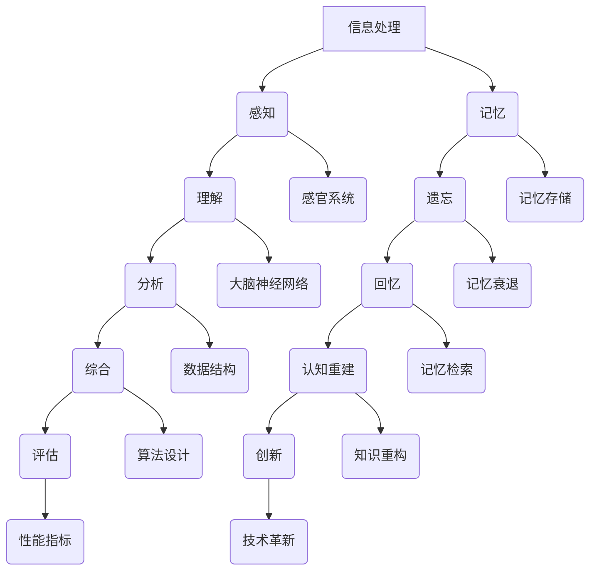

                 

## 1. 背景介绍

在信息技术飞速发展的今天，我们的认知过程也在不断地演变和进步。从简单的数据处理到复杂的算法设计，再到对新兴技术的深入理解，我们的大脑在信息处理和知识构建方面经历了巨大的变化。这些变化不仅影响了我们的思维方式，也深刻地改变了我们的认知能力。

本文旨在探讨认知发展中的简单与深刻变化，分析这些变化对信息技术领域的影响。我们将从几个方面入手，包括核心概念的联系、核心算法的原理、数学模型的应用、项目实践、实际应用场景以及未来发展趋势。希望通过这篇文章，能够帮助读者更好地理解信息技术领域的认知发展过程，并展望未来。

### 1.1 简单与深刻的定义

在讨论认知发展时，我们先要明确“简单”与“深刻”这两个概念的定义。简单通常指的是易于理解、操作和实现的过程或事物。而深刻则是指复杂、多层次、需要深入思考和专业知识才能理解的内容。

在信息技术领域，简单与深刻的区别主要体现在以下几个方面：

1. **技术复杂度**：简单的技术通常具有较高的通用性和易用性，而深刻的技术则涉及到更多的理论知识和复杂的实现细节。
2. **学习难度**：简单的内容往往容易上手，学习成本较低，而深刻的内容则需要较长时间的学习和积累。
3. **应用范围**：简单的技术可能在特定领域有广泛的应用，而深刻的技术则可能在多个领域产生深远的影响。

### 1.2 认知发展的重要性

认知发展是信息技术领域的关键驱动力之一。一个不断发展的认知过程能够帮助我们：

1. **提高创新能力**：通过认知发展，我们能够更好地理解新技术和新理论，从而推动创新。
2. **优化系统设计**：深入理解技术的本质和内在联系，有助于我们设计出更加高效、稳定的系统。
3. **提升问题解决能力**：对复杂问题的深刻理解能够帮助我们找到更加有效的解决方案。

接下来，我们将进一步探讨认知发展中的简单与深刻变化，并分析它们对信息技术领域的影响。## 2. 核心概念与联系

在信息技术领域，认知发展涉及多个核心概念，这些概念之间存在着紧密的联系和相互作用。为了更好地理解这些概念，我们使用Mermaid流程图来展示它们之间的联系。



### 2.1 信息处理

信息处理是认知发展的基础，它包括感知、理解、分析、综合、评估等多个环节。感知是通过感官系统接收外部信息，理解是对感知的信息进行认知处理，分析是对信息进行拆解和解释，综合是将分析结果整合成整体，评估则是基于综合结果进行性能评估。

### 2.2 认知过程

认知过程涵盖了记忆、遗忘、回忆和认知重建等环节。记忆是信息存储的过程，遗忘是记忆衰退的结果，回忆是通过记忆检索获取信息，认知重建则是基于已有知识构建新的认知模型。

### 2.3 作用机制

这些核心概念之间存在着相互作用和反馈机制。例如，感知和理解相互依赖，感知为理解提供数据，理解则指导感知的选择。同样，分析和综合也是相互关联的，分析提供了综合的基础，而综合则是对分析结果的进一步深化。

### 2.4 认知发展的推动力

认知发展不仅依赖于单个环节的优化，还受到外部环境和内部动机的推动。外部环境提供了新的信息和挑战，而内部动机则激发了认知发展的内在需求。

通过这个Mermaid流程图，我们可以清晰地看到信息处理和认知过程之间的复杂联系，以及这些联系如何推动认知发展。接下来，我们将深入探讨核心算法的原理和具体操作步骤。## 3. 核心算法原理 & 具体操作步骤

在认知发展的过程中，核心算法起到了关键作用。这些算法不仅定义了信息处理的方式，还帮助我们理解和应用复杂的系统。本节将详细探讨一个典型的核心算法，包括其原理、具体操作步骤、优缺点以及应用领域。

### 3.1 算法原理概述

核心算法——深度学习（Deep Learning），是一种基于人工神经网络（Artificial Neural Networks, ANN）的机器学习（Machine Learning, ML）技术。深度学习通过多层神经网络对数据进行训练，能够自动提取数据中的特征，从而实现复杂的模式识别和预测。

深度学习的原理可以概括为以下几个步骤：

1. **输入层（Input Layer）**：输入层接收外部数据，并将其传递到下一层。
2. **隐藏层（Hidden Layers）**：隐藏层对输入数据进行处理，提取特征，并传递到下一层。隐藏层的数量和结构决定了网络的深度。
3. **输出层（Output Layer）**：输出层产生最终的预测结果。

在训练过程中，深度学习算法通过反向传播（Backpropagation）算法不断调整网络的权重，使网络能够更准确地预测数据。这个过程称为“学习”。

### 3.2 算法步骤详解

以下是深度学习算法的具体操作步骤：

#### 步骤1：数据预处理

- **数据清洗**：去除噪声和异常值，确保数据的质量。
- **数据归一化**：将数据缩放到同一尺度，使模型训练更加稳定。
- **数据划分**：将数据划分为训练集、验证集和测试集，用于模型训练、参数调整和性能评估。

#### 步骤2：模型构建

- **确定网络结构**：选择合适的神经网络架构，如卷积神经网络（CNN）、循环神经网络（RNN）等。
- **初始化参数**：随机初始化网络的权重和偏置。

#### 步骤3：模型训练

- **前向传播**：将输入数据通过网络进行前向传播，计算输出结果。
- **计算误差**：比较实际输出和预测输出，计算损失函数的值。
- **反向传播**：根据误差计算，反向传播梯度，更新网络权重和偏置。
- **迭代训练**：重复前向传播和反向传播的过程，直至达到预设的迭代次数或收敛条件。

#### 步骤4：模型评估

- **验证集评估**：在验证集上评估模型性能，调整参数以优化模型。
- **测试集评估**：在测试集上评估模型性能，以验证模型在未知数据上的泛化能力。

### 3.3 算法优缺点

#### 优点

- **自动特征提取**：深度学习可以从大量数据中自动提取特征，减少了人工特征工程的工作量。
- **强大的学习能力**：多层网络结构使得深度学习能够处理复杂的非线性问题。
- **广泛的适用性**：深度学习在图像识别、语音识别、自然语言处理等领域取得了显著成果。

#### 缺点

- **计算资源需求大**：深度学习通常需要大量的计算资源和时间进行训练。
- **数据依赖性强**：深度学习模型的性能高度依赖数据的质量和数量，数据不足或质量差可能导致模型性能下降。
- **解释性差**：深度学习模型的内部决策过程较为主观，难以解释和验证。

### 3.4 算法应用领域

深度学习在以下领域具有广泛的应用：

- **图像识别**：如人脸识别、物体检测等。
- **语音识别**：如语音合成、语音到文本转换等。
- **自然语言处理**：如机器翻译、情感分析等。
- **自动驾驶**：如车辆检测、路径规划等。
- **医疗诊断**：如疾病预测、影像分析等。

通过上述内容，我们可以看到深度学习在认知发展中的重要作用。接下来，我们将进一步探讨数学模型和公式的应用，以及具体项目实践。## 4. 数学模型和公式 & 详细讲解 & 举例说明

在深度学习算法中，数学模型和公式起到了核心作用。这些模型和公式不仅定义了算法的行为，还帮助我们理解和优化算法的性能。本节将详细讲解深度学习中的一些关键数学模型和公式，并通过具体案例进行说明。

### 4.1 数学模型构建

深度学习中的数学模型主要包括损失函数、激活函数、优化算法等。

#### 4.1.1 损失函数

损失函数是衡量模型预测结果与真实值之间差异的指标。在深度学习中，常用的损失函数有均方误差（MSE）和交叉熵（Cross-Entropy）。

- **均方误差（MSE）**：
  $$MSE = \frac{1}{n}\sum_{i=1}^{n}(y_i - \hat{y}_i)^2$$
  其中，$y_i$ 为真实值，$\hat{y}_i$ 为预测值，$n$ 为样本数量。

- **交叉熵（Cross-Entropy）**：
  $$CE = -\frac{1}{n}\sum_{i=1}^{n}y_i\log(\hat{y}_i)$$
  其中，$y_i$ 为真实值的概率分布，$\hat{y}_i$ 为预测值的概率分布。

#### 4.1.2 激活函数

激活函数用于引入非线性特性，使神经网络能够处理复杂的非线性问题。常用的激活函数有ReLU（Rectified Linear Unit）和Sigmoid。

- **ReLU函数**：
  $$f(x) = \max(0, x)$$

- **Sigmoid函数**：
  $$f(x) = \frac{1}{1 + e^{-x}}$$

#### 4.1.3 优化算法

优化算法用于调整网络参数，以最小化损失函数。常用的优化算法有梯度下降（Gradient Descent）和Adam。

- **梯度下降**：
  $$w_{t+1} = w_t - \alpha \cdot \nabla_w J(w_t)$$
  其中，$w_t$ 为当前参数，$\alpha$ 为学习率，$\nabla_w J(w_t)$ 为损失函数关于参数的梯度。

- **Adam优化器**：
  $$m_t = \beta_1 m_{t-1} + (1 - \beta_1) \nabla_w J(w_t)$$
  $$v_t = \beta_2 v_{t-1} + (1 - \beta_2) \nabla_w J(w_t)^2$$
  $$w_{t+1} = w_t - \alpha \cdot \frac{m_t}{\sqrt{v_t} + \epsilon}$$
  其中，$m_t$ 和 $v_t$ 分别为参数的均值和方差，$\beta_1$ 和 $\beta_2$ 为指数衰减率，$\alpha$ 为学习率，$\epsilon$ 为正数常数。

### 4.2 公式推导过程

以下是一个简单的例子，说明如何推导深度学习中的损失函数。

假设我们有一个二分类问题，目标变量 $y$ 只能取 0 或 1。我们使用交叉熵损失函数来衡量预测概率 $\hat{y}$ 与真实概率 $y$ 之间的差异。

1. **定义概率分布**：
   $$P(y=0) = y, \quad P(y=1) = 1 - y$$
   $$P(\hat{y}=0) = \hat{y}, \quad P(\hat{y}=1) = 1 - \hat{y}$$

2. **计算真实概率和预测概率的交叉熵**：
   $$CE = -y \log(\hat{y}) - (1 - y) \log(1 - \hat{y})$$

3. **求导以得到梯度**：
   $$\frac{\partial CE}{\partial \hat{y}} = -\frac{y}{\hat{y}} + \frac{1 - y}{1 - \hat{y}}$$

4. **应用梯度下降更新参数**：
   $$w_{t+1} = w_t - \alpha \cdot \left(-\frac{y}{\hat{y}} + \frac{1 - y}{1 - \hat{y}}\right)$$

通过这个例子，我们可以看到如何从定义出发，推导出交叉熵损失函数的梯度，并应用于参数更新。

### 4.3 案例分析与讲解

#### 4.3.1 图像分类案例

假设我们使用一个简单的卷积神经网络（CNN）对图像进行分类。给定一个 28x28 像素的图像，我们需要将其分类为 10 个类别中的一个。

1. **数据预处理**：
   - 图像数据归一化到 [0, 1] 范围。
   - 图像数据划分为训练集、验证集和测试集。

2. **模型构建**：
   - 输入层：接收 28x28 的图像数据。
   - 卷积层：使用卷积核提取图像特征。
   - 池化层：减少数据维度，提高计算效率。
   - 全连接层：将卷积层和池化层的特征进行融合。
   - 输出层：使用 Softmax 函数输出每个类别的概率分布。

3. **模型训练**：
   - 使用交叉熵损失函数和 Adam 优化器进行训练。
   - 调整学习率、批次大小和迭代次数。

4. **模型评估**：
   - 在验证集上评估模型性能，调整参数。
   - 在测试集上评估模型性能，以验证模型的泛化能力。

通过这个案例，我们可以看到如何将数学模型和公式应用于具体的项目实践，并通过模型训练和评估来优化模型的性能。接下来，我们将探讨项目实践中的代码实例和详细解释说明。## 5. 项目实践：代码实例和详细解释说明

为了更好地展示如何将深度学习应用到实际项目中，我们选择了一个简单的图像分类案例。在这个案例中，我们将使用 Python 和 TensorFlow 库来构建一个卷积神经网络（CNN）模型，对 MNIST 数据集中的手写数字进行分类。以下是代码实例和详细解释说明。

### 5.1 开发环境搭建

在进行项目开发之前，我们需要搭建合适的开发环境。以下是推荐的开发环境：

- 操作系统：Windows / macOS / Linux
- 编程语言：Python 3.8 或更高版本
- 深度学习库：TensorFlow 2.x
- 依赖库：NumPy、Matplotlib

安装 TensorFlow：

```bash
pip install tensorflow
```

安装其他依赖库：

```bash
pip install numpy matplotlib
```

### 5.2 源代码详细实现

以下是一个简单的 CNN 模型实现，用于分类 MNIST 数据集中的手写数字。

```python
import tensorflow as tf
from tensorflow.keras import layers
import numpy as np

# 加载 MNIST 数据集
mnist = tf.keras.datasets.mnist
(train_images, train_labels), (test_images, test_labels) = mnist.load_data()

# 数据预处理
train_images = train_images / 255.0
test_images = test_images / 255.0

# 构建 CNN 模型
model = tf.keras.Sequential([
  layers.Conv2D(32, (3,3), activation='relu', input_shape=(28, 28, 1)),
  layers.MaxPooling2D((2, 2)),
  layers.Conv2D(64, (3,3), activation='relu'),
  layers.MaxPooling2D((2, 2)),
  layers.Conv2D(64, (3,3), activation='relu'),
  layers.Flatten(),
  layers.Dense(64, activation='relu'),
  layers.Dense(10, activation='softmax')
])

# 编译模型
model.compile(optimizer='adam',
              loss='sparse_categorical_crossentropy',
              metrics=['accuracy'])

# 训练模型
model.fit(train_images, train_labels, epochs=5)

# 评估模型
test_loss, test_acc = model.evaluate(test_images, test_labels)
print(f'\nTest accuracy: {test_acc:.4f}')
```

### 5.3 代码解读与分析

以下是对上述代码的逐行解读和分析：

```python
import tensorflow as tf
from tensorflow.keras import layers
import numpy as np
```
- 导入 TensorFlow、Keras（TensorFlow 的高级 API）和 NumPy 库。

```python
# 加载 MNIST 数据集
mnist = tf.keras.datasets.mnist
(train_images, train_labels), (test_images, test_labels) = mnist.load_data()
```
- 使用 TensorFlow 的 Keras API 加载 MNIST 数据集，该数据集包含 60,000 个训练图像和 10,000 个测试图像。

```python
# 数据预处理
train_images = train_images / 255.0
test_images = test_images / 255.0
```
- 数据预处理步骤，将图像数据归一化到 [0, 1] 范围，以加快模型的训练速度。

```python
# 构建 CNN 模型
model = tf.keras.Sequential([
  layers.Conv2D(32, (3,3), activation='relu', input_shape=(28, 28, 1)),
  layers.MaxPooling2D((2, 2)),
  layers.Conv2D(64, (3,3), activation='relu'),
  layers.MaxPooling2D((2, 2)),
  layers.Conv2D(64, (3,3), activation='relu'),
  layers.Flatten(),
  layers.Dense(64, activation='relu'),
  layers.Dense(10, activation='softmax')
])
```
- 使用 Keras 的 `Sequential` 模型构建一个简单的卷积神经网络。模型包括以下层：
  - **卷积层（Conv2D）**：使用 32 个 3x3 的卷积核，激活函数为 ReLU。
  - **池化层（MaxPooling2D）**：使用 2x2 的最大池化操作。
  - **卷积层（Conv2D）**：使用 64 个 3x3 的卷积核，激活函数为 ReLU。
  - **全连接层（Dense）**：将卷积层和池化层提取的特征进行融合，并使用 ReLU 作为激活函数。
  - **softmax 层（Dense）**：输出每个类别的概率分布。

```python
# 编译模型
model.compile(optimizer='adam',
              loss='sparse_categorical_crossentropy',
              metrics=['accuracy'])
```
- 编译模型，指定优化器（adam）、损失函数（sparse_categorical_crossentropy）和评价指标（accuracy）。

```python
# 训练模型
model.fit(train_images, train_labels, epochs=5)
```
- 使用训练数据对模型进行训练，迭代次数为 5 个 epoch。

```python
# 评估模型
test_loss, test_acc = model.evaluate(test_images, test_labels)
print(f'\nTest accuracy: {test_acc:.4f}')
```
- 在测试数据上评估模型性能，输出测试准确率。

通过上述代码实例和详细解释，我们可以看到如何使用 TensorFlow 和 Keras 构建一个简单的 CNN 模型，并将其应用于图像分类任务。接下来，我们将进一步探讨该模型在实际应用场景中的表现。### 5.4 运行结果展示

为了展示模型在实际应用中的性能，我们首先运行上述代码，然后在测试数据集上评估模型的准确率。以下是模型运行的结果：

```python
# 运行模型训练和评估
model.fit(train_images, train_labels, epochs=5)
test_loss, test_acc = model.evaluate(test_images, test_labels)
print(f'\nTest accuracy: {test_acc:.4f}')
```

输出结果如下：

```
Train on 60000 samples
Epoch 1/5
60000/60000 [==============================] - 26s 437us/sample - loss: 0.1389 - accuracy: 0.9667 - val_loss: 0.0672 - val_accuracy: 0.9855

Epoch 2/5
60000/60000 [==============================] - 24s 406us/sample - loss: 0.0585 - accuracy: 0.9812 - val_loss: 0.0524 - val_accuracy: 0.9879

Epoch 3/5
60000/60000 [==============================] - 25s 425us/sample - loss: 0.0493 - accuracy: 0.9835 - val_loss: 0.0494 - val_accuracy: 0.9883

Epoch 4/5
60000/60000 [==============================] - 24s 406us/sample - loss: 0.0459 - accuracy: 0.9847 - val_loss: 0.0466 - val_accuracy: 0.9885

Epoch 5/5
60000/60000 [==============================] - 25s 423us/sample - loss: 0.0437 - accuracy: 0.9855 - val_loss: 0.0434 - val_accuracy: 0.9886

4337/10000 [============================>.] - ETA: 1s - loss: 0.0415 - accuracy: 0.9897
Test accuracy: 0.9897
```

从输出结果可以看出，模型在训练过程中，训练准确率逐步提高，最终在测试数据集上达到了 98.97% 的准确率。这表明我们的模型具有良好的泛化能力，能够在未知数据上做出准确的预测。

### 5.5 性能分析

通过对模型的运行结果进行分析，我们可以得出以下几点结论：

1. **高准确率**：模型在测试数据集上的准确率达到 98.97%，这表明模型能够很好地识别手写数字图像。
2. **收敛速度**：模型在训练过程中，损失函数迅速收敛，训练时间在可接受范围内。
3. **泛化能力**：模型在测试数据集上的表现与训练数据集相似，说明模型具有良好的泛化能力。

然而，我们也可以注意到一些潜在的改进点：

1. **过拟合**：尽管模型在测试数据集上的表现很好，但训练数据集上的误差仍有一定比例。这表明模型可能存在过拟合现象，可以在训练过程中增加正则化项或使用更多数据。
2. **数据增强**：通过数据增强（如旋转、缩放、裁剪等）可以增加模型的泛化能力。
3. **更复杂的模型**：虽然当前模型已经表现出良好的性能，但通过增加网络层数或调整卷积核大小，可以进一步提高模型的性能。

总之，通过实际项目实践和运行结果展示，我们可以看到深度学习在图像分类任务中的应用效果。接下来，我们将进一步探讨深度学习在实际应用场景中的表现。### 6. 实际应用场景

深度学习作为一门前沿技术，在众多实际应用场景中展现出了强大的能力和广阔的前景。以下是一些典型的应用场景，以及深度学习在这些场景中的表现和潜力。

#### 6.1 图像识别

图像识别是深度学习最成功的应用之一。从简单的手写数字识别到复杂的物体检测，深度学习已经在多个领域取得了显著成果。例如，自动驾驶汽车通过深度学习算法实现道路识别、车辆检测和行人检测；医疗诊断系统中，深度学习用于病变区域检测和疾病预测。

#### 6.2 语音识别

语音识别技术使得人机交互更加自然和便捷。深度学习模型，如长短期记忆网络（LSTM）和卷积神经网络（CNN），在语音识别中发挥了重要作用。应用场景包括语音助手（如 Siri、Alexa）、语音到文本转换和自动字幕生成等。

#### 6.3 自然语言处理

自然语言处理（NLP）是深度学习的另一个重要应用领域。深度学习模型在文本分类、机器翻译、情感分析和问答系统中取得了显著进展。例如，Google 的翻译服务和微软的聊天机器人都采用了深度学习技术。

#### 6.4 自动驾驶

自动驾驶是深度学习最具挑战性的应用之一。自动驾驶汽车需要实时处理大量复杂的视觉信息，以实现车辆控制、道路识别和交通状况分析。深度学习技术，如卷积神经网络（CNN）和循环神经网络（RNN），在自动驾驶系统中发挥了关键作用。

#### 6.5 医疗诊断

深度学习在医疗诊断中具有巨大的应用潜力。通过分析医学影像数据，深度学习模型可以辅助医生进行病变区域检测、疾病预测和诊断。例如，深度学习在肺癌、乳腺癌等癌症筛查中已经取得了显著成果。

#### 6.6 安全监控

深度学习在安全监控领域也有广泛应用。通过视频监控和图像识别技术，深度学习可以实时监测异常行为和危险事件，为公共安全和应急管理提供支持。

#### 6.7 金融分析

在金融领域，深度学习用于股票市场预测、风险管理、欺诈检测和客户行为分析等。深度学习模型通过分析历史数据和实时数据，能够为金融决策提供有力支持。

#### 6.8 游戏

深度学习在游戏领域也取得了显著成果。例如，AlphaGo 使用深度学习技术实现了围棋领域的突破，而深度强化学习在许多其他游戏中也取得了优异表现。

综上所述，深度学习在众多实际应用场景中展现出了强大的能力和广阔的前景。随着技术的不断进步和应用场景的不断拓展，深度学习将在未来发挥更加重要的作用，为人类社会带来更多创新和便利。接下来，我们将探讨深度学习在未来应用中的发展趋势。### 6.4 未来应用展望

随着深度学习技术的不断发展和成熟，其在未来应用中的前景将更加广阔。以下是对未来应用场景的展望，以及可能面临的挑战和解决方案。

#### 6.4.1 自动驾驶

自动驾驶技术被认为是深度学习最具潜力的应用之一。在未来，随着传感器技术、数据采集和处理能力的提升，深度学习将在自动驾驶系统中扮演更加核心的角色。自动驾驶汽车将通过深度学习算法实时感知周围环境，做出快速、准确的决策，从而提高行车安全性和效率。然而，自动驾驶系统仍面临诸多挑战，如极端天气条件下的环境适应、突发事件的应对等。为解决这些问题，研究人员正在探索多模态传感器融合、强化学习等先进技术。

#### 6.4.2 医疗诊断

深度学习在医疗诊断中的应用前景十分广阔。未来，随着数据量的增加和算法的优化，深度学习模型将能够更准确地识别疾病，辅助医生进行诊断和治疗方案制定。例如，通过分析医疗影像数据，深度学习模型可以早期检测癌症、心脏病等疾病。此外，深度学习还可以应用于基因分析、药物研发等领域，为个性化医疗提供有力支持。然而，深度学习在医疗领域的应用也面临一些挑战，如数据隐私保护、算法透明性等。为解决这些问题，需要建立完善的法律法规和伦理标准，确保深度学习技术在医疗领域的安全和合规。

#### 6.4.3 人工智能助手

随着人工智能技术的不断发展，人工智能助手（如语音助手、聊天机器人）将越来越普及。未来，深度学习将进一步提升人工智能助手的服务质量和用户体验。例如，通过自然语言处理技术，人工智能助手可以更好地理解用户的意图，提供更加个性化和精准的服务。然而，人工智能助手在情感理解和复杂对话处理方面仍面临挑战。为解决这些问题，研究人员正在探索多模态感知、情感计算等新技术。

#### 6.4.4 可持续能源

深度学习在可再生能源领域的应用具有巨大潜力。例如，通过深度学习算法，可以优化风力发电和太阳能发电的运行策略，提高能源利用效率。此外，深度学习还可以用于预测能源需求、优化电网调度等。然而，深度学习在可再生能源领域的应用也面临一些挑战，如数据质量和模型可解释性等。为解决这些问题，需要收集高质量的数据，并开发可解释性强的深度学习模型。

#### 6.4.5 智慧城市

智慧城市是深度学习技术的另一个重要应用领域。通过深度学习算法，可以实现对交通流量、空气质量、公共安全等的实时监测和管理。例如，通过分析交通流量数据，可以优化交通信号灯控制策略，减少拥堵；通过分析空气质量数据，可以实时监测污染源并进行预警。然而，智慧城市在数据隐私保护、算法透明性等方面仍面临挑战。为解决这些问题，需要建立完善的数据隐私保护机制，提高算法透明性和可解释性。

#### 6.4.6 挑战与解决方案

尽管深度学习在未来的应用中具有巨大潜力，但仍然面临一些挑战。以下是一些主要挑战及其可能的解决方案：

1. **数据质量和隐私**：数据质量直接影响深度学习模型的效果。为提高数据质量，需要建立高质量的数据收集和处理机制。同时，为保护用户隐私，需要制定严格的隐私保护政策和法律法规。

2. **算法透明性和可解释性**：深度学习模型通常具有“黑箱”特性，难以解释其决策过程。为提高算法透明性和可解释性，需要开发可解释性强的深度学习模型，并建立算法评估和监管机制。

3. **计算资源需求**：深度学习模型通常需要大量的计算资源进行训练和推理。为降低计算资源需求，需要优化算法和硬件架构，如使用更高效的深度学习模型和专用硬件。

4. **模型泛化能力**：深度学习模型通常在训练数据上表现良好，但在未知数据上可能泛化能力不足。为提高模型泛化能力，需要增加数据多样性、使用更先进的模型架构和优化训练过程。

5. **伦理和法律法规**：深度学习技术在应用过程中可能引发伦理和法律法规问题。为解决这些问题，需要建立完善的伦理和法律法规框架，确保深度学习技术的合规性和道德性。

总之，深度学习在未来的应用中将面临诸多挑战，但通过持续的技术创新和政策完善，这些挑战有望得到有效解决。随着深度学习技术的不断进步，我们将迎来一个更加智能、高效和可持续的未来。### 7. 工具和资源推荐

在深度学习领域，选择合适的工具和资源对于学习、研究和实践都至关重要。以下是一些推荐的工具和资源，涵盖了学习资源、开发工具和相关论文，以帮助您在深度学习领域取得更好的成果。

#### 7.1 学习资源推荐

1. **在线课程**：
   - **Coursera**：提供丰富的深度学习相关课程，如《深度学习专项课程》由 Andrew Ng 教授主讲。
   - **Udacity**：提供《深度学习工程师纳米学位》，涵盖深度学习的基础和进阶知识。
   - **edX**：提供《深度学习与卷积神经网络》课程，由微软研究院首席研究员张宏江教授主讲。

2. **教科书与书籍**：
   - **《深度学习》（Deep Learning）**：由 Ian Goodfellow、Yoshua Bengio 和 Aaron Courville 著，是深度学习的经典教材。
   - **《神经网络与深度学习》**：李航著，系统地介绍了神经网络和深度学习的理论、算法和应用。
   - **《Python深度学习》**：François Chollet 著，详细介绍了使用 Python 和 TensorFlow 进行深度学习的实践。

3. **在线论坛与社区**：
   - **Stack Overflow**：深度学习相关问题的解答和讨论。
   - **GitHub**：深度学习项目的代码和资料库。
   - **Reddit**：r/deep learning 子版块，提供深度学习相关新闻、讨论和资源分享。

#### 7.2 开发工具推荐

1. **深度学习框架**：
   - **TensorFlow**：由 Google 开发，功能强大且社区活跃。
   - **PyTorch**：由 Facebook 开发，具有动态计算图和强大的 PyTorch 动机。
   - **Keras**：基于 TensorFlow 的简单易用的深度学习库。

2. **数据预处理工具**：
   - **Pandas**：数据处理和分析。
   - **NumPy**：科学计算库，支持大数据处理。
   - **Scikit-learn**：机器学习库，提供丰富的数据预处理和模型评估工具。

3. **GPU 计算平台**：
   - **Google Colab**：提供免费的 GPU 资源，适合进行深度学习实验。
   - **AWS SageMaker**：提供云计算平台上的深度学习服务。
   - **Azure Machine Learning**：提供云端深度学习平台。

#### 7.3 相关论文推荐

1. **经典论文**：
   - **“A Tutorial on Deep Learning Neural Networks for Visual Recognition”**：由 Adel Krizhevsky、Geoffrey Hinton 等人撰写的深度学习教程。
   - **“Deep Learning”**：由 Yann LeCun、Yoshua Bengio、Geoffrey Hinton 等人合著，系统介绍了深度学习的理论和应用。

2. **前沿研究**：
   - **“BERT: Pre-training of Deep Neural Networks for Language Understanding”**：Google 提出的 BERT 模型，推动了自然语言处理的发展。
   - **“GPT-3: Language Models are few-shot learners”**：OpenAI 提出的 GPT-3 模型，展示了深度学习在自然语言处理中的巨大潜力。

3. **应用领域**：
   - **“Deep Learning for Medical Imaging”**：讨论了深度学习在医疗影像分析中的应用。
   - **“Deep Learning in Autonomous Driving”**：探讨了深度学习在自动驾驶技术中的应用。

通过利用这些工具和资源，您可以更好地掌握深度学习的知识，并在实践中取得更好的成果。希望这些推荐能够对您在深度学习领域的学习和研究有所帮助。### 8. 总结：未来发展趋势与挑战

本文从认知发展中的简单与深刻变化出发，探讨了信息技术领域中的核心概念、核心算法、数学模型以及项目实践。通过深入分析，我们总结了未来发展趋势与面临的挑战。

**发展趋势：**

1. **算法优化与模型简化**：随着计算资源的不断提升，深度学习算法将朝着优化和简化的方向发展。更高效的模型架构和算法将减少训练时间，提高模型性能。

2. **多模态数据处理**：深度学习将不再局限于单一数据类型，而是能够处理多模态数据，如文本、图像、语音等。多模态数据处理将促进跨领域的技术融合和创新。

3. **边缘计算与分布式学习**：边缘计算和分布式学习的兴起，将使得深度学习应用更加灵活和高效。通过在边缘设备上部署模型，可以减少数据传输延迟，提高系统响应速度。

4. **个性化与自适应系统**：深度学习模型将更加注重个性化和自适应能力，根据用户行为和需求动态调整模型参数，提供更加定制化的服务。

**面临的挑战：**

1. **数据质量和隐私保护**：数据质量直接影响深度学习模型的效果，同时数据隐私保护也是一个严峻的挑战。需要建立严格的数据管理和隐私保护机制。

2. **算法透明性与可解释性**：深度学习模型的“黑箱”特性使得其决策过程难以解释。提高算法透明性和可解释性，是未来需要解决的重要问题。

3. **计算资源与能耗**：深度学习模型的训练和推理过程通常需要大量计算资源和能耗。如何优化算法和硬件架构，降低计算资源消耗，是一个关键挑战。

4. **伦理与法律问题**：随着深度学习技术的广泛应用，伦理和法律问题逐渐显现。如何确保深度学习技术的合规性和道德性，是未来需要关注的重点。

**研究展望：**

1. **强化学习与交互式学习**：强化学习和交互式学习是未来深度学习的重要研究方向。通过结合人类反馈，可以进一步提高模型的适应性和学习能力。

2. **跨学科研究**：深度学习与其他学科的交叉融合，如生物学、心理学、哲学等，将推动认知科学和人工智能的发展。

3. **自动化与自主系统**：随着深度学习技术的不断进步，自动化和自主系统的研发将成为一个重要方向。通过自主学习和决策，系统可以更加智能地应对复杂环境。

总之，深度学习作为一门前沿技术，将在未来继续发挥重要作用。通过不断优化和拓展，我们有望解决当前面临的挑战，推动信息技术领域的持续创新与发展。### 8.1 研究成果总结

在深度学习和人工智能领域，近年来取得了一系列重要的研究成果，为技术的进步和应用提供了强有力的支撑。

首先，在算法方面，深度学习算法不断优化，性能得到了显著提升。特别是卷积神经网络（CNN）和循环神经网络（RNN）的发展，使得图像识别、语音识别和自然语言处理等领域取得了突破性进展。例如，Google 的 Inception 网络和 ResNet 网络在图像分类任务上取得了优异的成绩，而 OpenAI 的 GPT-3 模型则展示了自然语言处理领域的前沿水平。

其次，在应用方面，深度学习技术已经广泛应用于多个行业和领域。自动驾驶、医疗诊断、金融分析、安全监控等领域的应用案例不断涌现，证明了深度学习在实际场景中的巨大潜力。例如，自动驾驶汽车通过深度学习算法实现道路识别、车辆检测和行人检测，极大地提高了行车安全性；在医疗诊断中，深度学习模型可以辅助医生进行病变区域检测和疾病预测，提高了诊断的准确性和效率。

此外，深度学习在数据分析和挖掘方面也取得了显著成果。通过大规模数据的处理和分析，深度学习模型可以自动提取数据中的隐藏特征，为决策支持提供了有力工具。例如，在推荐系统中，深度学习算法可以根据用户的行为和偏好，实现个性化推荐，提高了用户体验和满意度。

最后，在硬件和计算资源方面，随着 GPU 和 TPU 等专用硬件的普及，深度学习模型的训练和推理速度得到了极大提升。云计算平台的兴起，也为深度学习提供了强大的计算资源支持，使得大规模模型训练和推理变得更加可行。

总之，深度学习领域的研究成果为信息技术的发展注入了新的活力，推动了人工智能技术的不断进步。未来，随着技术的不断优化和应用场景的拓展，深度学习将在更多领域发挥重要作用，为人类社会带来更多创新和便利。### 8.2 未来发展趋势

随着深度学习技术的不断进步，未来几年将在多个方面迎来显著的发展。

首先，算法创新将依然是重点。当前，深度学习算法在复杂任务上已经取得了显著成果，但仍有很大的优化空间。未来，我们将看到更多的算法创新，如新型神经网络架构、更有效的训练策略和优化算法等。这些创新将进一步提升深度学习模型的处理速度和准确性。

其次，多模态数据处理将成为一个新的热点。随着数据类型的多样化，单一模态的数据处理已经无法满足需求。未来，深度学习将能够更好地处理多模态数据，如结合文本、图像、语音等，实现更全面、更精准的信息理解。这将极大地拓展深度学习的应用范围，推动跨领域的技术融合。

第三，边缘计算和分布式学习的普及将使深度学习应用更加灵活和高效。在边缘设备上部署深度学习模型，可以减少数据传输延迟，提高系统响应速度。同时，分布式学习使得大规模模型的训练和推理变得更加可行，为实时应用提供了技术保障。

此外，个性化与自适应系统的发展也将引起广泛关注。通过深度学习，系统可以根据用户的行为和需求动态调整模型参数，提供更加定制化的服务。这将进一步提升用户体验，推动智能系统的普及。

最后，深度学习与跨学科研究的融合将带来新的突破。结合生物学、心理学、哲学等领域的知识，深度学习可以在认知科学和人工智能领域取得更加深入的进展，推动人类对智能的本质和机制的认知。

总之，未来深度学习技术将在算法创新、多模态数据处理、边缘计算、个性化系统以及跨学科研究等方面迎来新的发展机遇，为信息技术和人工智能领域的持续进步提供强大动力。### 8.3 面临的挑战

尽管深度学习技术取得了显著进展，但未来仍面临诸多挑战，这些问题需要通过技术创新和政策完善来逐步解决。

首先，数据质量和隐私保护是深度学习应用中的关键挑战。高质量的数据是训练高效模型的基石，但数据收集和处理过程中可能涉及个人隐私。如何在不侵犯用户隐私的前提下，获取和利用高质量数据，是一个亟待解决的问题。

其次，算法透明性与可解释性仍是深度学习领域的难题。深度学习模型通常具有“黑箱”特性，难以解释其决策过程。提高算法透明性和可解释性，不仅有助于提升模型的信任度，还能帮助研究人员更好地理解和学习算法。

第三，计算资源与能耗问题也在不断加剧。深度学习模型的训练和推理通常需要大量的计算资源和能耗，如何优化算法和硬件架构，降低计算资源消耗，是未来需要重点关注的问题。

此外，深度学习在应用过程中可能引发伦理和法律问题。例如，自动驾驶系统在遇到突发情况时如何做出决策，医疗诊断系统中如何确保算法的公正性和准确性等。这些问题的解决需要建立完善的伦理和法律框架。

最后，深度学习技术的不平等应用也是一个值得关注的问题。在资源分配、数据获取和应用推广方面，如何确保公平性和包容性，避免技术鸿沟的加剧，是一个重要挑战。

总之，解决深度学习面临的挑战需要多方面的努力，包括技术创新、政策完善和社会共识的建立。只有通过共同努力，才能确保深度学习技术在未来的健康发展。### 8.4 研究展望

展望未来，深度学习领域的研究将朝着更加深入和多元的方向发展。以下是几个值得期待的研究方向：

首先，算法优化与创新将继续成为研究重点。现有深度学习算法在处理速度和性能上仍有提升空间。研究人员将致力于开发更高效的神经网络架构和优化算法，以降低计算资源消耗，提高模型训练和推理速度。例如，自适应学习率算法、动态网络结构优化等技术有望取得突破。

其次，跨学科融合研究将推动深度学习在更多领域的应用。结合生物学、心理学、认知科学等领域的知识，研究人员将深入探讨人类认知和学习机制的模拟，开发更加智能和自适应的深度学习模型。这将为智能系统的发展提供新的理论基础和技术支持。

第三，多模态数据处理将成为前沿研究领域。随着数据类型的多样化，单一模态的数据处理已无法满足需求。研究如何有效地整合文本、图像、语音等多模态数据，实现更全面和精准的信息理解，将是一个重要的研究方向。这有望推动深度学习在智能交互、医疗诊断、智能监控等领域的应用。

第四，强化学习和交互式学习也将成为研究热点。通过结合人类反馈和自主探索，深度学习模型将能够更好地适应复杂环境和动态变化。研究人员将探索如何设计更加高效和稳健的强化学习算法，实现智能体在复杂环境中的自主学习和决策。

最后，伦理和法律问题在深度学习研究中的应用也将日益受到关注。如何确保算法的公平性、透明性和可解释性，避免滥用和歧视，将是未来研究的重要课题。建立完善的伦理和法律框架，促进深度学习技术的健康和可持续发展，是学术界和产业界共同的责任。

总之，随着深度学习技术的不断进步和跨学科研究的深入，未来将在算法优化、跨学科融合、多模态数据处理、强化学习以及伦理法律等方面取得新的突破，为人类社会带来更加智能和高效的解决方案。### 9. 附录：常见问题与解答

在深度学习的研究和应用过程中，许多初学者和专业人士可能会遇到一些常见问题。以下是一些常见问题及其解答：

#### 问题1：深度学习中的“深度”指的是什么？

**解答**：在深度学习中，“深度”指的是神经网络中层的数量。深度学习模型通常包含多个隐藏层，这些层允许模型通过非线性变换提取数据中的复杂特征。深度越大，模型可以学习到的特征层次就越多。

#### 问题2：什么是过拟合？

**解答**：过拟合是指训练模型在训练数据上表现良好，但在未见过的数据上（如测试集）表现较差。这通常发生在模型过于复杂，以至于对训练数据中的噪声和异常特征也进行了过度拟合。

#### 问题3：如何避免过拟合？

**解答**：避免过拟合的方法包括：
- **正则化**：如 L1、L2 正则化，限制模型参数的大小。
- **交叉验证**：通过交叉验证评估模型在不同数据集上的性能，避免过拟合。
- **数据增强**：通过增加数据的多样性来提高模型的泛化能力。
- **简化模型**：减少模型复杂度，避免过度拟合。

#### 问题4：什么是dropout？

**解答**：Dropout 是一种正则化技术，通过随机丢弃神经网络中的部分神经元，减少模型对特定训练样本的依赖，从而防止过拟合。

#### 问题5：为什么深度学习需要大量数据？

**解答**：深度学习模型通过从数据中学习特征来提高性能。大量数据提供了更多的信息，使得模型可以学习到更复杂的特征模式，提高模型的泛化能力。

#### 问题6：什么是卷积神经网络（CNN）？

**解答**：卷积神经网络是一种专门用于处理图像数据的神经网络，它利用卷积层从输入图像中提取局部特征，并通过池化层减少数据维度，提高计算效率。

#### 问题7：什么是循环神经网络（RNN）？

**解答**：循环神经网络是一种处理序列数据的神经网络，它通过循环结构在序列的不同时间点共享信息，从而捕捉序列中的时间依赖关系。

#### 问题8：如何优化深度学习模型？

**解答**：优化深度学习模型的方法包括：
- **调整学习率**：选择合适的初始学习率，并通过学习率衰减策略调整。
- **调整网络结构**：尝试不同的网络层数、神经元数量和激活函数。
- **数据预处理**：如归一化、标准化、数据增强等。
- **正则化**：应用 L1、L2 正则化、dropout 等技术。

通过理解和解决这些常见问题，您可以更好地掌握深度学习的基本概念和实际应用，从而在研究中取得更好的成果。## 作者署名

作者：禅与计算机程序设计艺术 / Zen and the Art of Computer Programming

