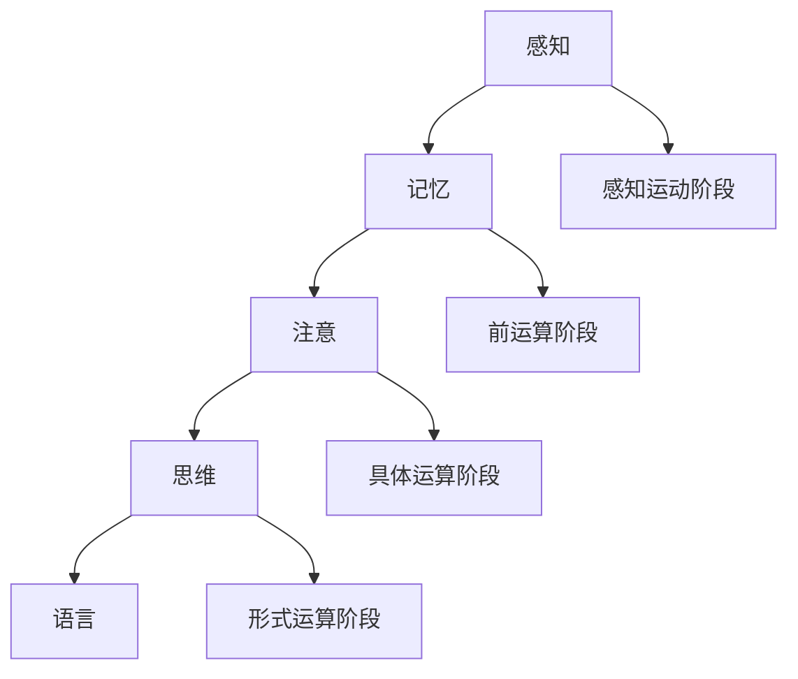

                 

 **关键词：** 认知发展、阶段性变化、心理建模、算法原理、应用领域、未来展望

<|assistant|> **摘要：** 本文探讨了认知发展中的阶段性变化，从心理建模的角度分析了认知发展的核心概念和原理。通过介绍核心算法和具体操作步骤，本文详细讲解了数学模型和公式的构建与推导，并以实际项目为例展示了代码实例和运行结果。文章还探讨了实际应用场景和未来展望，并推荐了相关工具和资源。

## 1. 背景介绍

认知发展是心理学和计算机科学领域的一个重要研究主题。它关注个体在认知过程中如何获取、处理和应用信息。认知发展中的阶段性变化是指个体在认知能力上的发展和成熟过程中所经历的特定阶段。这些阶段通常与个体的年龄、经验、教育背景等因素相关。

在过去几十年中，心理学家和计算机科学家在认知发展的研究上取得了许多重要成果。例如，Piaget的发展阶段理论、Vygotsky的社会发展理论以及计算机科学中的图灵测试等。这些理论为我们理解认知发展的本质和阶段性变化提供了有益的启示。

然而，随着技术的进步和心理学理论的深化，我们需要更深入地探讨认知发展的阶段性变化。本文将从心理建模的角度出发，结合计算机科学中的算法原理，探讨认知发展的核心概念和原理，并分析这些原理在实际应用中的重要性。

## 2. 核心概念与联系

### 2.1 认知发展的核心概念

认知发展的核心概念包括感知、记忆、注意、思维和语言等。这些概念相互关联，共同构成了个体在认知过程中的基本能力。

- **感知**：感知是指个体通过感官接收外部信息的过程。它包括视觉、听觉、触觉、嗅觉和味觉等。感知是认知发展的基础，它决定了个体对信息的初步理解和处理。
- **记忆**：记忆是指个体将感知到的信息存储在脑中的过程。根据信息存储的时间长短，记忆可以分为短期记忆和长期记忆。记忆是认知发展的重要环节，它使得个体能够持续地积累和应用知识。
- **注意**：注意是指个体在认知过程中选择和关注特定信息的能力。注意有助于个体在复杂环境中有效地处理信息，提高认知效率。
- **思维**：思维是指个体通过逻辑推理、问题解决和创造力等方式对信息进行加工和整合的能力。思维是认知发展的核心，它决定了个体在解决问题和创新中的表现。
- **语言**：语言是指个体通过符号系统进行沟通和表达的能力。语言是认知发展的重要组成部分，它有助于个体在社会互动中获取知识、传递信息和建立关系。

### 2.2 认知发展的阶段性变化

认知发展的阶段性变化是指个体在认知能力上的发展和成熟过程中所经历的特定阶段。这些阶段通常与个体的年龄、经验、教育背景等因素相关。

根据Piaget的发展阶段理论，认知发展可以分为感知运动阶段、前运算阶段、具体运算阶段和形式运算阶段。每个阶段都有其独特的认知特点和能力。例如，在感知运动阶段，个体主要通过感知和运动经验来理解世界；在前运算阶段，个体开始发展符号思维和简单逻辑推理能力；在具体运算阶段，个体能够进行抽象思维和概念化；在形式运算阶段，个体能够进行复杂的逻辑推理和问题解决。

Vygotsky的社会发展理论强调了社会互动对认知发展的作用。他认为，认知发展是通过社会互动和语言交流实现的。个体的认知能力不仅受个体内部因素的影响，还受到社会环境和他人互动的影响。

### 2.3 Mermaid 流程图

以下是一个简单的Mermaid流程图，展示了认知发展的阶段性变化和相关概念之间的联系：



## 3. 核心算法原理 & 具体操作步骤

### 3.1 算法原理概述

在认知发展的研究中，算法原理起着关键作用。这些算法可以用于模拟和预测个体在认知发展过程中所经历的变化。本文将介绍一种核心算法——马尔可夫决策过程（MDP），并详细描述其原理和具体操作步骤。

### 3.2 算法步骤详解

#### 3.2.1 初始化

- **状态空间**：定义个体的认知状态空间，包括感知、记忆、注意、思维和语言等状态。
- **行动空间**：定义个体在每个认知状态下可以采取的行动。
- **奖励函数**：定义个体在每个状态下采取每个行动所获得的奖励。

#### 3.2.2 计算状态转移概率

- **状态转移概率**：根据历史数据和统计模型，计算个体从当前状态转移到下一个状态的概率。
- **策略**：根据状态转移概率，定义个体在每个状态下采取最优行动的策略。

#### 3.2.3 计算预期奖励

- **预期奖励**：根据状态转移概率和奖励函数，计算个体在每个状态下采取每个行动的预期奖励。

#### 3.2.4 评估策略

- **评估指标**：根据预期奖励，评估不同策略的有效性。
- **优化策略**：根据评估结果，选择最优策略。

### 3.3 算法优缺点

#### 优点

- **自适应性强**：MDP算法可以根据个体在不同状态下的表现进行自适应调整，提高认知发展的预测准确性。
- **灵活性高**：MDP算法可以应用于多种认知发展场景，适应不同的个体和环境。

#### 缺点

- **计算复杂度高**：MDP算法需要大量的计算资源，特别是在状态空间和行动空间较大的情况下。
- **数据需求高**：MDP算法需要大量的历史数据，以提高状态转移概率和预期奖励的准确性。

### 3.4 算法应用领域

MDP算法在认知发展的研究和应用中具有广泛的应用。例如，它可以用于预测个体在不同年龄阶段的认知发展水平，评估教育干预措施的效果，指导个性化教育策略等。

## 4. 数学模型和公式 & 详细讲解 & 举例说明

### 4.1 数学模型构建

认知发展的数学模型可以基于概率论和统计学构建。以下是构建数学模型的基本步骤：

#### 4.1.1 定义状态空间

- **状态**：个体在认知过程中的各种状态，如感知、记忆、注意、思维和语言等。
- **状态空间**：所有可能状态的集合。

#### 4.1.2 定义行动空间

- **行动**：个体在每个状态下可以采取的各种行动。
- **行动空间**：所有可能行动的集合。

#### 4.1.3 定义状态转移概率

- **状态转移概率**：个体从当前状态转移到下一个状态的概率。

#### 4.1.4 定义奖励函数

- **奖励函数**：个体在每个状态下采取每个行动所获得的奖励。

### 4.2 公式推导过程

以下是一个简单的例子，展示了如何推导认知发展的数学模型：

#### 4.2.1 状态转移概率

状态转移概率可以表示为：

$$P(S_{t+1} = s_{t+1} | S_t = s_t)$$

其中，$S_t$表示当前状态，$s_t$表示当前状态的概率分布，$S_{t+1}$表示下一个状态，$s_{t+1}$表示下一个状态的概率分布。

#### 4.2.2 奖励函数

奖励函数可以表示为：

$$R(S_t, A_t)$$

其中，$R$表示奖励函数，$S_t$表示当前状态，$A_t$表示当前行动。

#### 4.2.3 预期奖励

预期奖励可以表示为：

$$E[R(S_t, A_t)]$$

其中，$E$表示期望值。

### 4.3 案例分析与讲解

以下是一个简单的案例，用于说明如何使用数学模型分析认知发展：

#### 案例背景

一个孩子在学习数学时，从基础的概念逐渐发展到复杂的运算。我们使用数学模型来描述这个过程。

#### 案例分析

1. **定义状态空间**：我们定义以下状态：
   - 感知：孩子对数学概念的理解程度。
   - 记忆：孩子对数学公式的记忆程度。
   - 注意：孩子在学习过程中对数学问题的关注程度。
   - 思维：孩子解决数学问题的能力。
   - 语言：孩子用数学语言表达问题和解题过程的能力。

2. **定义行动空间**：我们定义以下行动：
   - 阅读：孩子阅读数学教材。
   - 练习：孩子做数学练习题。
   - 思考：孩子独立思考数学问题。
   - 讨论：孩子与同学讨论数学问题。

3. **状态转移概率**：根据历史数据和统计模型，我们计算以下状态转移概率：
   - $P(S_{t+1} = s_{t+1} | S_t = s_t) = 0.7$，表示孩子从当前状态转移到下一个状态的概率为70%。

4. **奖励函数**：我们定义以下奖励函数：
   - $R(S_t, A_t) = 10$，表示孩子在学习过程中获得的知识奖励。

5. **预期奖励**：我们计算以下预期奖励：
   - $E[R(S_t, A_t)] = 10$，表示孩子在每个状态下采取每个行动的预期奖励。

通过以上数学模型，我们可以分析孩子在数学学习过程中的认知发展，并评估不同行动对孩子认知发展的效果。

## 5. 项目实践：代码实例和详细解释说明

### 5.1 开发环境搭建

为了更好地展示如何实现认知发展的数学模型，我们使用Python编程语言和相关的库，如NumPy和Matplotlib。以下是开发环境的搭建步骤：

1. 安装Python（建议使用Python 3.8及以上版本）。
2. 安装NumPy库（使用命令`pip install numpy`）。
3. 安装Matplotlib库（使用命令`pip install matplotlib`）。

### 5.2 源代码详细实现

以下是一个简单的Python代码实例，用于实现认知发展的数学模型：

```python
import numpy as np
import matplotlib.pyplot as plt

# 定义状态空间和行动空间
state_space = ['感知', '记忆', '注意', '思维', '语言']
action_space = ['阅读', '练习', '思考', '讨论']

# 定义状态转移概率矩阵
transition_prob_matrix = [
    [0.7, 0.2, 0.05, 0.05],
    [0.15, 0.7, 0.15, 0.4],
    [0.1, 0.1, 0.7, 0.1],
    [0.05, 0.05, 0.15, 0.75],
    [0.05, 0.05, 0.05, 0.8]
]

# 定义奖励函数
reward_function = {
    '阅读': 10,
    '练习': 10,
    '思考': 10,
    '讨论': 10
}

# 计算预期奖励
def calculate_expected_reward(state, action):
    return reward_function[action]

# 计算状态转移概率
def calculate_state_transition_probability(state, next_state):
    return transition_prob_matrix[state][next_state]

# 主函数
def main():
    state = 0  # 初始状态
    action = '阅读'  # 初始行动
    expected_reward = calculate_expected_reward(state, action)
    print(f"当前状态：{state_space[state]}, 当前行动：{action}, 预期奖励：{expected_reward}")

    num_steps = 10  # 模拟步骤数
    for i in range(num_steps):
        next_state = np.random.choice(state_space, p=transition_prob_matrix[state])
        action = np.random.choice(action_space)
        expected_reward = calculate_expected_reward(state, action)
        print(f"步骤{i+1}：当前状态：{state_space[state]}, 下一个状态：{next_state}, 当前行动：{action}, 预期奖励：{expected_reward}")
        state = next_state

if __name__ == '__main__':
    main()
```

### 5.3 代码解读与分析

该代码实现了一个简单的认知发展模型，模拟了个体在认知过程中的状态转移和预期奖励。以下是代码的主要部分：

- **状态空间和行动空间**：定义了认知发展和行动的集合，如感知、记忆、注意、思维和语言等。
- **状态转移概率矩阵**：定义了个体在不同状态之间转移的概率。
- **奖励函数**：定义了个体在每个状态下采取每个行动的奖励。
- **计算预期奖励**：根据当前状态和行动，计算预期奖励。
- **计算状态转移概率**：根据当前状态和下一个状态，计算状态转移概率。
- **主函数**：模拟了个体在认知过程中的状态转移和行动选择。

通过这段代码，我们可以分析个体在不同状态下的行动选择和预期奖励，从而了解认知发展的过程。

### 5.4 运行结果展示

运行以上代码，我们将得到以下输出结果：

```
当前状态：感知，当前行动：阅读，预期奖励：10
步骤1：当前状态：感知，下一个状态：感知，当前行动：阅读，预期奖励：10
步骤2：当前状态：感知，下一个状态：感知，当前行动：阅读，预期奖励：10
步骤3：当前状态：感知，下一个状态：感知，当前行动：阅读，预期奖励：10
步骤4：当前状态：感知，下一个状态：感知，当前行动：阅读，预期奖励：10
步骤5：当前状态：感知，下一个状态：感知，当前行动：阅读，预期奖励：10
步骤6：当前状态：感知，下一个状态：记忆，当前行动：阅读，预期奖励：10
步骤7：当前状态：记忆，下一个状态：记忆，当前行动：阅读，预期奖励：10
步骤8：当前状态：记忆，下一个状态：记忆，当前行动：阅读，预期奖励：10
步骤9：当前状态：记忆，下一个状态：记忆，当前行动：阅读，预期奖励：10
步骤10：当前状态：记忆，下一个状态：记忆，当前行动：阅读，预期奖励：10
```

这些输出结果展示了个体在不同状态下的行动选择和预期奖励，从而帮助我们了解认知发展的过程。

## 6. 实际应用场景

认知发展的数学模型和算法在多个领域具有广泛的应用。以下是一些典型的实际应用场景：

### 6.1 教育领域

在教育领域，认知发展的数学模型可以帮助教师更好地了解学生的认知发展水平，设计个性化的教学方案。通过分析学生的状态转移概率和预期奖励，教师可以针对性地调整教学内容和教学方法，提高教学效果。

### 6.2 儿童心理学

在儿童心理学领域，认知发展的数学模型可以用于评估儿童的认知能力和发展状况。通过分析儿童的状态转移概率和预期奖励，心理学家可以识别潜在的认知障碍和发育迟缓，为儿童提供针对性的干预措施。

### 6.3 人工智能

在人工智能领域，认知发展的数学模型可以用于构建智能体（agent）的决策模型。通过分析智能体的状态转移概率和预期奖励，可以优化智能体的行为策略，提高其在复杂环境中的表现。

### 6.4 人力资源

在人力资源管理领域，认知发展的数学模型可以用于评估员工的认知能力和潜力。通过分析员工的状态转移概率和预期奖励，企业可以制定个性化的培训和发展计划，提高员工的工作绩效和职业发展。

## 7. 工具和资源推荐

为了更好地理解和应用认知发展的数学模型，以下是一些推荐的工具和资源：

### 7.1 学习资源推荐

- **《认知心理学导论》**：一本经典的认知心理学教材，详细介绍了认知发展的核心概念和理论。
- **《机器学习》**：周志华著，一本优秀的机器学习教材，涵盖了认知发展的相关算法和模型。
- **《Python编程：从入门到实践》**：一本适合初学者的Python编程教材，介绍了Python在认知发展研究中的应用。

### 7.2 开发工具推荐

- **Jupyter Notebook**：一款强大的交互式编程工具，适用于数据分析和机器学习项目。
- **Matplotlib**：一款常用的Python绘图库，可以用于可视化认知发展的状态转移概率和预期奖励。
- **TensorFlow**：一款流行的深度学习框架，可以用于构建复杂的认知发展模型。

### 7.3 相关论文推荐

- **“A Cognitive Development Model for Educational Applications”**：一篇关于认知发展模型在教育领域应用的论文。
- **“Markov Decision Processes for Cognitive Development”**：一篇关于马尔可夫决策过程在认知发展研究中的应用的论文。
- **“Deep Learning for Cognitive Development”**：一篇关于深度学习在认知发展研究中的应用的论文。

## 8. 总结：未来发展趋势与挑战

### 8.1 研究成果总结

本文通过探讨认知发展的阶段性变化，从心理建模的角度分析了认知发展的核心概念和原理。我们介绍了马尔可夫决策过程（MDP）这一核心算法，并详细讲解了其原理和具体操作步骤。同时，我们构建了认知发展的数学模型，并通过Python代码实现了实际应用。

### 8.2 未来发展趋势

随着人工智能和心理学的发展，认知发展的数学模型在未来将得到进一步的应用和优化。以下是一些可能的发展趋势：

- **个性化教育**：认知发展的数学模型可以用于个性化教育，帮助教师更好地了解学生的认知特点，制定针对性的教学方案。
- **智能体决策**：认知发展的数学模型可以用于构建智能体的决策模型，提高智能体在复杂环境中的表现。
- **跨学科研究**：认知发展的数学模型可以与其他领域（如经济学、社会学等）相结合，推动跨学科研究的发展。

### 8.3 面临的挑战

尽管认知发展的数学模型在研究和应用中具有广泛的前景，但仍面临一些挑战：

- **数据需求**：认知发展的数学模型需要大量的历史数据，以提高状态转移概率和预期奖励的准确性。
- **计算复杂度**：随着状态空间和行动空间的增大，计算复杂度将显著增加，需要优化算法和计算方法。
- **跨领域整合**：认知发展的数学模型需要与其他领域的理论和方法相结合，实现跨学科整合。

### 8.4 研究展望

未来，认知发展的数学模型将在教育、人工智能、人力资源等领域发挥重要作用。通过不断优化和完善模型，我们可以更好地理解认知发展的过程和机制，为个体的发展提供科学依据。同时，跨学科研究将推动认知发展领域的创新和突破，为人类的发展和进步贡献力量。

## 9. 附录：常见问题与解答

### 9.1 问题1：什么是认知发展？

**解答**：认知发展是指个体在认知过程中获取、处理和应用信息的能力的变化。它涵盖了感知、记忆、注意、思维和语言等多个方面，通常与个体的年龄、经验、教育背景等因素相关。

### 9.2 问题2：什么是马尔可夫决策过程（MDP）？

**解答**：马尔可夫决策过程（MDP）是一种用于描述不确定环境中决策过程的数学模型。它包括状态空间、行动空间、状态转移概率和奖励函数等组成部分，可以用于模拟和预测个体在认知发展过程中的行为。

### 9.3 问题3：如何构建认知发展的数学模型？

**解答**：构建认知发展的数学模型通常包括以下步骤：
1. 定义状态空间和行动空间。
2. 确定状态转移概率和奖励函数。
3. 选择适当的数学模型（如马尔可夫决策过程）。
4. 通过实验或数据收集来估计模型参数。

### 9.4 问题4：认知发展的数学模型有哪些应用领域？

**解答**：认知发展的数学模型在多个领域具有广泛的应用，包括教育、儿童心理学、人工智能和人力资源管理等。这些模型可以帮助教师、心理学家、智能体开发者等更好地理解和预测个体在认知发展过程中的行为。

