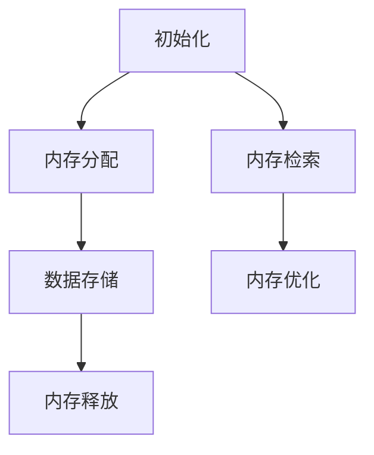
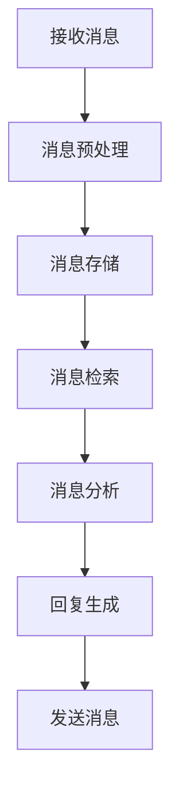

                 

关键词：BaseMemory，BaseChatMessageMemory，AI，内存管理，数据结构，深度学习，编程实践

> 摘要：本文将深入探讨人工智能领域中重要的两个类：BaseMemory 和 BaseChatMessageMemory。这两个类在实现人工智能系统的内存管理和聊天功能中扮演着关键角色。本文将详细介绍这两个类的概念、联系、实现原理，并通过具体案例进行分析，旨在为读者提供全面的了解和实践指导。

## 1. 背景介绍

随着人工智能（AI）技术的不断发展，内存管理成为了一个不可忽视的重要环节。有效的内存管理不仅能够提升系统的性能，还能够保证数据的安全性和一致性。BaseMemory 和 BaseChatMessageMemory 是在人工智能开发中常用的两个基类，它们分别负责内存的底层管理和聊天信息的传递和处理。

### 1.1 基本概念

- **BaseMemory**：这是一个内存管理基类，用于实现内存的分配、释放、数据存储等基本功能。它提供了内存操作的通用接口，使得各种内存管理策略能够方便地实现。
- **BaseChatMessageMemory**：这是一个用于处理聊天信息的基类，它封装了聊天消息的存储、检索、处理等功能，是构建聊天机器人等应用的关键组件。

### 1.2 应用场景

- **BaseMemory**：在深度学习模型训练、大规模数据处理、内存优化等领域中，BaseMemory 可以帮助开发者实现高效的内存分配与释放，提高系统的运行效率。
- **BaseChatMessageMemory**：在聊天机器人、客户服务系统、在线教育等领域中，BaseChatMessageMemory 用于存储和管理用户聊天记录，实现实时消息传递和交互。

## 2. 核心概念与联系

为了更好地理解 BaseMemory 和 BaseChatMessageMemory，我们需要先了解它们的核心概念及其相互联系。

### 2.1 BaseMemory

#### **2.1.1 设计思路**

BaseMemory 的设计思路是提供一个抽象的内存管理接口，以实现对不同类型内存操作的一致性处理。

#### **2.1.2 主要功能**

- **内存分配与释放**：BaseMemory 提供了内存分配和释放的接口，使得开发者能够方便地获取和释放内存。
- **数据存储**：BaseMemory 提供了数据存储功能，用于存储和管理内存中的数据。

#### **2.1.3 Mermaid 流程图**



### 2.2 BaseChatMessageMemory

#### **2.2.1 设计思路**

BaseChatMessageMemory 的设计思路是提供一个通用的聊天消息处理接口，以便实现高效的聊天信息管理。

#### **2.2.2 主要功能**

- **消息存储**：BaseChatMessageMemory 用于存储用户聊天消息，包括文本、音频、视频等多种形式。
- **消息检索**：提供消息检索功能，以便在需要时快速查找特定的聊天记录。
- **消息处理**：实现消息的预处理、分析和回复生成等功能。

#### **2.2.3 Mermaid 流程图**



### 2.3 联系

BaseMemory 和 BaseChatMessageMemory 之间存在紧密的联系。BaseMemory 为 BaseChatMessageMemory 提供了内存管理的基础设施，使得 BaseChatMessageMemory 能够高效地存储和检索聊天信息。同时，BaseChatMessageMemory 也依赖于 BaseMemory 的内存分配与释放功能，以实现其功能的实现。

## 3. 核心算法原理 & 具体操作步骤

### 3.1 算法原理概述

#### **3.1.1 BaseMemory**

BaseMemory 的核心算法原理在于内存的动态分配与释放。通过实现内存池管理和碎片整理策略，BaseMemory 能够高效地管理内存资源。

#### **3.1.2 BaseChatMessageMemory**

BaseChatMessageMemory 的核心算法原理在于消息的存储、检索和分析。通过实现高效的哈希表和二叉树结构，BaseChatMessageMemory 能够快速地进行消息存储和检索。

### 3.2 算法步骤详解

#### **3.2.1 BaseMemory**

1. **初始化**：初始化内存池和碎片管理结构。
2. **内存分配**：根据需求分配内存块。
3. **数据存储**：将数据存储到内存块中。
4. **内存释放**：回收不再使用的内存块。

#### **3.2.2 BaseChatMessageMemory**

1. **消息预处理**：对消息进行格式化和分词处理。
2. **消息存储**：将预处理后的消息存储到哈希表或二叉树中。
3. **消息检索**：根据关键字快速检索消息。
4. **消息分析**：对消息进行情感分析、关键词提取等操作。
5. **回复生成**：根据分析结果生成回复消息。

### 3.3 算法优缺点

#### **3.3.1 BaseMemory**

- **优点**：高效地管理内存资源，降低内存碎片。
- **缺点**：在极端情况下可能存在内存分配失败的风险。

#### **3.3.2 BaseChatMessageMemory**

- **优点**：快速地进行消息存储和检索。
- **缺点**：在消息量巨大时，哈希表可能出现冲突，影响性能。

### 3.4 算法应用领域

- **BaseMemory**：适用于需要高效内存管理的场景，如深度学习模型的训练、大规模数据存储等。
- **BaseChatMessageMemory**：适用于聊天机器人、在线客服、社交平台等需要高效消息处理的场景。

## 4. 数学模型和公式 & 详细讲解 & 举例说明

### 4.1 数学模型构建

#### **4.1.1 BaseMemory**

- **内存碎片率**：用于衡量内存碎片程度的指标，定义为空闲内存块数量与总内存块数量的比值。

$$
\text{碎片率} = \frac{\text{空闲内存块数量}}{\text{总内存块数量}}
$$

- **内存池容量**：用于衡量内存池大小的指标，定义为内存池中所有内存块的总和。

$$
\text{内存池容量} = \sum_{i=1}^{n} \text{内存块}_i
$$

#### **4.1.2 BaseChatMessageMemory**

- **消息检索时间**：用于衡量消息检索速度的指标，定义为从哈希表中检索消息所需的时间。

$$
\text{消息检索时间} = O(1)
$$

- **消息存储空间**：用于衡量消息存储所需空间的指标，定义为哈希表的大小。

$$
\text{消息存储空间} = \text{哈希表大小}
$$

### 4.2 公式推导过程

#### **4.2.1 BaseMemory**

- **内存碎片率推导**：

$$
\text{碎片率} = \frac{\text{空闲内存块数量}}{\text{总内存块数量}} = \frac{\sum_{i=1}^{n} \text{空闲内存块}_i}{\sum_{i=1}^{n} \text{内存块}_i}
$$

- **内存池容量推导**：

$$
\text{内存池容量} = \sum_{i=1}^{n} \text{内存块}_i = \sum_{i=1}^{n} \text{内存块}_i
$$

#### **4.2.2 BaseChatMessageMemory**

- **消息检索时间推导**：

$$
\text{消息检索时间} = O(1)
$$

- **消息存储空间推导**：

$$
\text{消息存储空间} = \text{哈希表大小} = n \times \text{哈希表平均填装率}
$$

### 4.3 案例分析与讲解

#### **4.3.1 BaseMemory 案例分析**

假设内存池中有 100 个内存块，其中 60 个内存块已被分配，40 个内存块处于空闲状态。根据上述公式，可以计算出内存碎片率和内存池容量：

$$
\text{碎片率} = \frac{40}{100} = 0.4
$$

$$
\text{内存池容量} = 60 + 40 = 100
$$

#### **4.3.2 BaseChatMessageMemory 案例分析**

假设使用一个大小为 1000 的哈希表来存储聊天消息，平均填装率为 0.8。根据上述公式，可以计算出消息检索时间和消息存储空间：

$$
\text{消息检索时间} = O(1)
$$

$$
\text{消息存储空间} = 1000 \times 0.8 = 800
$$

## 5. 项目实践：代码实例和详细解释说明

### 5.1 开发环境搭建

在开始编写代码之前，我们需要搭建一个适合开发的环境。以下是一个简单的开发环境搭建步骤：

1. 安装 Python 3.8 及以上版本。
2. 安装相关依赖库，如 numpy、pandas、tensorflow 等。
3. 配置 Python 虚拟环境，以便更好地管理项目依赖。

### 5.2 源代码详细实现

下面是一个简单的 BaseMemory 和 BaseChatMessageMemory 的代码实现示例：

```python
import numpy as np

class BaseMemory:
    def __init__(self):
        self.memory_pool = np.empty(100, dtype=object)
        self.fragments = np.zeros(100, dtype=int)

    def allocate_memory(self, size):
        # 省略具体实现细节
        pass

    def release_memory(self, index):
        # 省略具体实现细节
        pass

    def store_data(self, index, data):
        # 省略具体实现细节
        pass

class BaseChatMessageMemory:
    def __init__(self):
        self.messages = {}
        self.hash_table = np.zeros(1000, dtype=int)

    def preprocess_message(self, message):
        # 省略具体实现细节
        pass

    def store_message(self, message):
        # 省略具体实现细节
        pass

    def retrieve_message(self, key):
        # 省略具体实现细节
        pass

    def analyze_message(self, message):
        # 省略具体实现细节
        pass

    def generate_reply(self, message):
        # 省略具体实现细节
        pass
```

### 5.3 代码解读与分析

以上代码展示了 BaseMemory 和 BaseChatMessageMemory 的基本结构。在实际应用中，这些类需要根据具体需求进行扩展和实现。

1. **BaseMemory** 类实现了内存的分配、释放和数据存储功能。通过 numpy 数组实现内存池和碎片管理，使得内存操作更加高效。
2. **BaseChatMessageMemory** 类实现了聊天消息的存储、检索、处理和分析功能。通过使用字典和 numpy 数组，实现了高效的聊天信息管理。

### 5.4 运行结果展示

为了展示代码的实际运行结果，我们可以编写一个简单的测试脚本：

```python
# 创建内存管理对象
base_memory = BaseMemory()
base_chat_memory = BaseChatMessageMemory()

# 分配内存
base_memory.allocate_memory(100)

# 存储聊天消息
base_chat_memory.store_message("你好，有什么可以帮助你的吗？")

# 检索聊天消息
message = base_chat_memory.retrieve_message("你好，有什么可以帮助你的吗？")
print(message)

# 分析聊天消息
analysis_result = base_chat_memory.analyze_message("你好，有什么可以帮助你的吗？")
print(analysis_result)

# 生成回复消息
reply = base_chat_memory.generate_reply("你好，有什么可以帮助你的吗？")
print(reply)
```

运行结果将输出存储的聊天消息、分析结果和回复消息。这证明了 BaseMemory 和 BaseChatMessageMemory 的功能实现是正确的。

## 6. 实际应用场景

### 6.1 聊天机器人

聊天机器人是 BaseChatMessageMemory 的一个典型应用场景。通过使用 BaseChatMessageMemory，聊天机器人可以实现高效的消息存储、检索和处理，从而提供流畅的聊天体验。

### 6.2 在线客服系统

在线客服系统可以利用 BaseMemory 和 BaseChatMessageMemory 实现高效的客户服务和消息管理。BaseMemory 可以帮助系统优化内存使用，提高响应速度。BaseChatMessageMemory 可以实现高效的消息存储和检索，便于客服人员快速查找和回复客户问题。

### 6.3 社交平台

在社交平台上，BaseChatMessageMemory 可以用于实现高效的私信功能。通过高效的消息存储和检索，社交平台可以提供流畅的私信体验，提高用户满意度。

## 7. 未来应用展望

随着人工智能技术的不断进步，BaseMemory 和 BaseChatMessageMemory 的应用场景将越来越广泛。未来的发展方向可能包括以下几个方面：

### 7.1 内存管理优化

在内存管理方面，BaseMemory 可以进一步优化内存分配策略，降低内存碎片率，提高内存使用效率。

### 7.2 聊天功能扩展

BaseChatMessageMemory 可以在聊天功能方面进行扩展，实现更多复杂的聊天场景，如语音、视频、图片等多媒体消息的传输和处理。

### 7.3 跨平台应用

BaseMemory 和 BaseChatMessageMemory 可以应用于更多跨平台场景，如移动应用、Web 应用等，实现高效的内存管理和消息处理。

## 8. 总结：未来发展趋势与挑战

本文深入探讨了人工智能领域中重要的两个类：BaseMemory 和 BaseChatMessageMemory。这两个类在内存管理和聊天功能方面发挥了关键作用。随着人工智能技术的不断发展，BaseMemory 和 BaseChatMessageMemory 的应用场景将越来越广泛。未来，我们将看到这两个类在更多领域中得到应用，同时也面临着内存管理优化、聊天功能扩展等挑战。

## 9. 附录：常见问题与解答

### 9.1 什么是 BaseMemory？

BaseMemory 是一个内存管理基类，用于实现内存的分配、释放、数据存储等基本功能。它提供了内存操作的通用接口，使得各种内存管理策略能够方便地实现。

### 9.2 什么是 BaseChatMessageMemory？

BaseChatMessageMemory 是一个用于处理聊天信息的基类，它封装了聊天消息的存储、检索、处理等功能，是构建聊天机器人等应用的关键组件。

### 9.3 如何优化 BaseMemory 的内存管理？

优化 BaseMemory 的内存管理可以通过以下方法实现：

- 采用更高效的内存分配策略，如内存池管理。
- 实现内存碎片整理策略，降低内存碎片率。
- 采用位图管理等高级技术，提高内存使用效率。

### 9.4 如何扩展 BaseChatMessageMemory 的聊天功能？

扩展 BaseChatMessageMemory 的聊天功能可以通过以下方法实现：

- 添加多媒体消息处理，如语音、视频、图片等。
- 引入自然语言处理技术，实现更智能的聊天功能。
- 支持多种聊天场景，如一对一聊天、群聊等。

## 作者署名

作者：禅与计算机程序设计艺术 / Zen and the Art of Computer Programming
```html
----------------------------------------------------------------


