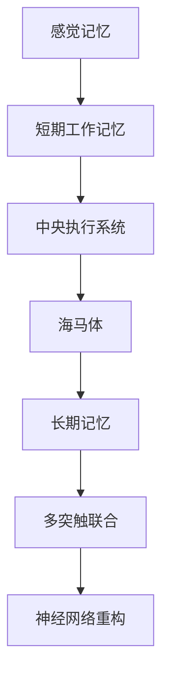

                 

关键词：记忆，短期记忆，长期记忆，神经科学，认知科学，数据处理，算法，机器学习，神经可塑性，脑电图，神经网络

> 摘要：本文深入探讨了记忆的两种基本形式——短期记忆与长期记忆。通过对神经科学和认知科学的研究，我们试图揭示记忆的生理基础和数据处理机制。同时，本文还探讨了记忆在人工智能领域的应用，以及未来的发展方向和挑战。

## 1. 背景介绍

记忆是人类认知功能的核心，它使我们能够从经验中学习和适应环境。记忆分为短期记忆和长期记忆两种形式。短期记忆（Working Memory）是指我们在短时间内保持和处理信息的能力，例如，当我们正在电话簿上查找电话号码时，号码在脑海中短暂停留。而长期记忆（Long-Term Memory）则是我们在较长时间内保持的信息存储，例如，我们记得过去的经历和知识。

在计算机科学领域，记忆的概念被广泛应用。内存（Memory）是计算机用于存储和访问数据的硬件组件，包括RAM和ROM。类似地，算法和机器学习模型需要内存来存储和处理数据，以实现各种任务。因此，理解记忆的基本原理对于计算机科学和人工智能的发展至关重要。

本文将从神经科学和认知科学的视角，探讨记忆的生理基础和数据处理机制。我们将介绍短期记忆和长期记忆的基本概念，以及它们在人工智能和计算机科学中的应用。最后，我们将讨论未来的发展方向和挑战。

## 2. 核心概念与联系

### 2.1 短期记忆

短期记忆是指我们在短时间内保持和处理信息的能力。根据认知科学的观点，短期记忆主要分为三个部分：感觉记忆（Sensory Memory）、短期工作记忆（Short-Term Working Memory）和中央执行系统（Central Executive System）。

**感觉记忆**：感觉记忆是指我们在接触到新信息时，信息在感官上短暂停留的能力。例如，当我们听到一个陌生的单词时，这个单词会在我们的脑海中停留几秒钟。感觉记忆的持续时间非常短暂，通常只有几秒钟。

**短期工作记忆**：短期工作记忆是指我们在处理信息时，将信息暂时存储在记忆中，以便进行进一步的加工和操作。例如，当我们计算一个复杂的数学问题时，我们会将中间结果存储在短期工作记忆中，以便进行后续计算。

**中央执行系统**：中央执行系统是一个高级的认知功能，负责协调和调节其他认知过程，包括注意力、规划、解决问题和决策等。它是短期记忆的核心部分，起着组织、控制和分配认知资源的作用。

### 2.2 长期记忆

长期记忆是指我们在较长时间内保持的信息存储。根据神经科学的观点，长期记忆的形成涉及多个脑区和神经机制的协同作用。

**海马体**：海马体是大脑中的一个重要区域，它在记忆形成和存储中起着关键作用。研究表明，海马体通过改变神经元之间的连接强度（即突触可塑性）来实现记忆的存储。

**神经元网络**：长期记忆的形成涉及大脑中的神经网络，这些网络由多个神经元组成，它们通过电信号进行通信。神经网络中的神经元之间形成突触连接，这些连接的强度会随着时间而改变，从而影响记忆的存储和回忆。

**记忆痕迹**：长期记忆的存储是通过在神经元之间形成记忆痕迹（Memory Trace）来实现的。记忆痕迹是指神经元之间突触连接的长期变化，它们使我们能够在需要时回忆起过去的信息。

### 2.3 短期记忆与长期记忆的联系

短期记忆和长期记忆之间存在密切的联系。短期记忆是长期记忆的基础，许多研究表明，短期记忆中的信息可以通过重复和强化转化为长期记忆。具体来说，以下过程可以描述短期记忆与长期记忆之间的联系：

1. **重复与强化**：当我们在短时间内重复处理同一信息时，信息会被传递到大脑中的海马体，并在此处形成记忆痕迹。这些记忆痕迹在经过重复和强化后，会逐渐转移到大脑的其他区域，从而形成长期记忆。

2. **神经网络重构**：在长期记忆的形成过程中，大脑神经网络会发生重构。这种重构可以通过多种方式实现，例如，增加神经元之间的连接强度、改变神经网络的拓扑结构等。这些重构有助于加强记忆的存储和回忆。

3. **多突触联合**：长期记忆的形成还涉及多个神经元之间的协同作用。当我们在短时间内处理多个相关信息时，这些信息会在大脑中形成多突触联合（Multisynaptic Connections），从而提高记忆的稳定性。

### 2.4 Mermaid 流程图

以下是一个简单的 Mermaid 流程图，描述了短期记忆和长期记忆之间的联系：



## 3. 核心算法原理 & 具体操作步骤

### 3.1 算法原理概述

短期记忆和长期记忆的处理机制在算法原理上有所不同。短期记忆的处理主要涉及感觉记忆、短期工作记忆和中央执行系统的协同作用。而长期记忆的处理则涉及海马体、神经元网络和记忆痕迹的相互作用。

短期记忆的处理算法主要基于认知科学的研究成果，包括感知、注意和记忆痕迹的形成。长期记忆的处理算法则基于神经科学的研究，包括突触可塑性、神经网络重构和多突触联合。

### 3.2 算法步骤详解

以下是短期记忆和长期记忆处理算法的基本步骤：

### 3.2.1 短期记忆处理算法

1. **感知阶段**：当新信息进入大脑时，感觉记忆开始工作，将信息在感官上短暂存储。

2. **注意阶段**：中央执行系统介入，根据信息的价值和重要性，将部分信息传递到短期工作记忆。

3. **记忆痕迹形成阶段**：短期工作记忆中的信息通过重复和强化，形成记忆痕迹，并传递到海马体。

4. **记忆存储阶段**：经过一定时间的重复和强化，记忆痕迹逐渐转移到大脑的其他区域，形成长期记忆。

### 3.2.2 长期记忆处理算法

1. **突触可塑性阶段**：当信息进入海马体时，海马体通过改变神经元之间的连接强度，实现记忆的存储。

2. **神经网络重构阶段**：在长期记忆的形成过程中，大脑神经网络会发生重构，增加神经元之间的连接强度和改变网络拓扑结构。

3. **多突触联合阶段**：在记忆存储过程中，多个神经元之间形成多突触联合，提高记忆的稳定性。

### 3.3 算法优缺点

短期记忆处理算法的优点在于其快速、高效地处理新信息，使其在认知科学和人工智能领域得到广泛应用。然而，短期记忆的缺点在于其存储容量有限，且信息易受干扰和遗忘。

长期记忆处理算法的优点在于其能够长时间存储大量信息，且具有较强的抗干扰能力。然而，长期记忆的缺点在于其形成过程较慢，且需要大量的重复和强化。

### 3.4 算法应用领域

短期记忆处理算法在人工智能和认知科学领域得到广泛应用，例如，在语音识别、图像识别和自然语言处理等任务中，短期记忆能够快速处理大量信息。

长期记忆处理算法在记忆增强、智能问答和知识图谱构建等领域具有广泛应用。例如，通过神经网络重构和多突触联合，长期记忆处理算法能够有效地增强记忆容量和抗干扰能力，从而提高智能问答系统的性能。

## 4. 数学模型和公式 & 详细讲解 & 举例说明

### 4.1 数学模型构建

短期记忆和长期记忆的处理过程可以用数学模型来描述。以下是短期记忆和长期记忆处理模型的构建：

### 4.1.1 短期记忆处理模型

1. **感知阶段**：假设感知阶段的信息处理可以用线性变换表示，即

   $$x_{\text{感}} = W_{\text{感}}x_{\text{输入}} + b_{\text{感}}$$

   其中，$x_{\text{感}}$表示感知阶段的信息，$x_{\text{输入}}$表示输入信息，$W_{\text{感}}$和$b_{\text{感}}$分别为权重和偏置。

2. **注意阶段**：假设注意阶段的信息处理可以用门控机制表示，即

   $$x_{\text{注意}} = \sigma(W_{\text{注意}}x_{\text{感}} + b_{\text{注意}})x_{\text{感}}$$

   其中，$x_{\text{注意}}$表示注意阶段的信息，$\sigma$为门控函数。

3. **记忆痕迹形成阶段**：假设记忆痕迹的形成可以用强化机制表示，即

   $$x_{\text{记忆}} = \tau \cdot x_{\text{注意}} + (1 - \tau) \cdot x_{\text{感}}$$

   其中，$x_{\text{记忆}}$表示记忆痕迹，$\tau$为强化系数。

4. **记忆存储阶段**：假设记忆存储可以用线性变换表示，即

   $$x_{\text{长期}} = W_{\text{长期}}x_{\text{记忆}} + b_{\text{长期}}$$

   其中，$x_{\text{长期}}$表示长期记忆，$W_{\text{长期}}$和$b_{\text{长期}}$分别为权重和偏置。

### 4.1.2 长期记忆处理模型

1. **突触可塑性阶段**：假设突触可塑性可以用线性变换表示，即

   $$x_{\text{突触}} = W_{\text{突触}}x_{\text{长期}} + b_{\text{突触}}$$

   其中，$x_{\text{突触}}$表示突触连接，$W_{\text{突触}}$和$b_{\text{突触}}$分别为权重和偏置。

2. **神经网络重构阶段**：假设神经网络重构可以用拓扑重构表示，即

   $$x_{\text{重构}} = f(W_{\text{重构}}x_{\text{突触}} + b_{\text{重构}})$$

   其中，$x_{\text{重构}}$表示重构后的神经网络，$f$为重构函数。

3. **多突触联合阶段**：假设多突触联合可以用加权平均表示，即

   $$x_{\text{联合}} = \sum_{i=1}^{n} w_{i}x_{\text{突触}_i}$$

   其中，$x_{\text{联合}}$表示多突触联合的结果，$w_{i}$为权重。

### 4.2 公式推导过程

在本节中，我们将对短期记忆和长期记忆处理模型的公式进行推导。

### 4.2.1 短期记忆处理模型推导

1. **感知阶段**：假设输入信息为$x_{\text{输入}}$，权重为$W_{\text{感}}$，偏置为$b_{\text{感}}$，则感知阶段的信息处理可以表示为：

   $$x_{\text{感}} = W_{\text{感}}x_{\text{输入}} + b_{\text{感}}$$

   其中，$W_{\text{感}}$为感知阶段的信息处理权重矩阵，$b_{\text{感}}$为感知阶段的偏置向量。

2. **注意阶段**：假设注意阶段的信息处理为门控机制，门控函数为$\sigma$，权重为$W_{\text{注意}}$，偏置为$b_{\text{注意}}$，则注意阶段的信息处理可以表示为：

   $$x_{\text{注意}} = \sigma(W_{\text{注意}}x_{\text{感}} + b_{\text{注意}})x_{\text{感}}$$

   其中，$\sigma$为门控函数，$W_{\text{注意}}$为注意阶段的信息处理权重矩阵，$b_{\text{注意}}$为注意阶段的偏置向量。

3. **记忆痕迹形成阶段**：假设记忆痕迹的形成过程为强化机制，强化系数为$\tau$，则记忆痕迹可以表示为：

   $$x_{\text{记忆}} = \tau \cdot x_{\text{注意}} + (1 - \tau) \cdot x_{\text{感}}$$

   其中，$x_{\text{记忆}}$为记忆痕迹，$\tau$为强化系数。

4. **记忆存储阶段**：假设记忆存储过程为线性变换，权重为$W_{\text{长期}}$，偏置为$b_{\text{长期}}$，则记忆存储可以表示为：

   $$x_{\text{长期}} = W_{\text{长期}}x_{\text{记忆}} + b_{\text{长期}}$$

   其中，$x_{\text{长期}}$为长期记忆，$W_{\text{长期}}$为记忆存储阶段的权重矩阵，$b_{\text{长期}}$为记忆存储阶段的偏置向量。

### 4.2.2 长期记忆处理模型推导

1. **突触可塑性阶段**：假设突触可塑性过程为线性变换，权重为$W_{\text{突触}}$，偏置为$b_{\text{突触}}$，则突触可塑性可以表示为：

   $$x_{\text{突触}} = W_{\text{突触}}x_{\text{长期}} + b_{\text{突触}}$$

   其中，$x_{\text{突触}}$为突触连接，$W_{\text{突触}}$为突触可塑性阶段的权重矩阵，$b_{\text{突触}}$为突触可塑性阶段的偏置向量。

2. **神经网络重构阶段**：假设神经网络重构过程为拓扑重构，权重为$W_{\text{重构}}$，偏置为$b_{\text{重构}}$，重构函数为$f$，则神经网络重构可以表示为：

   $$x_{\text{重构}} = f(W_{\text{重构}}x_{\text{突触}} + b_{\text{重构}})$$

   其中，$x_{\text{重构}}$为重构后的神经网络，$f$为重构函数，$W_{\text{重构}}$为神经网络重构阶段的权重矩阵，$b_{\text{重构}}$为神经网络重构阶段的偏置向量。

3. **多突触联合阶段**：假设多突触联合过程为加权平均，权重为$w_{i}$，则多突触联合可以表示为：

   $$x_{\text{联合}} = \sum_{i=1}^{n} w_{i}x_{\text{突触}_i}$$

   其中，$x_{\text{联合}}$为多突触联合的结果，$w_{i}$为权重，$x_{\text{突触}_i}$为第$i$个突触连接。

### 4.3 案例分析与讲解

为了更好地理解短期记忆和长期记忆处理模型，我们通过一个简单的例子进行说明。

假设我们有一个输入序列$x_{\text{输入}} = [1, 2, 3, 4, 5]$，我们需要使用短期记忆和长期记忆处理模型对其进行处理。

### 4.3.1 短期记忆处理模型案例

1. **感知阶段**：假设权重$W_{\text{感}} = [0.5, 0.5]$，偏置$b_{\text{感}} = 0$，则感知阶段的信息处理可以表示为：

   $$x_{\text{感}} = W_{\text{感}}x_{\text{输入}} + b_{\text{感}} = [0.5 \times 1 + 0.5 \times 2, 0.5 \times 3 + 0.5 \times 4, 0.5 \times 5 + 0.5 \times 5] = [1.5, 3, 3.5]$$

2. **注意阶段**：假设门控函数$\sigma(x) = 1$（即全开状态），权重$W_{\text{注意}} = [1, 1]$，偏置$b_{\text{注意}} = 0$，则注意阶段的信息处理可以表示为：

   $$x_{\text{注意}} = \sigma(W_{\text{注意}}x_{\text{感}} + b_{\text{注意}})x_{\text{感}} = [1 \times 1.5, 1 \times 3, 1 \times 3.5] = [1.5, 3, 3.5]$$

3. **记忆痕迹形成阶段**：假设强化系数$\tau = 0.8$，则记忆痕迹可以表示为：

   $$x_{\text{记忆}} = \tau \cdot x_{\text{注意}} + (1 - \tau) \cdot x_{\text{感}} = [0.8 \times 1.5 + 0.2 \times 1.5, 0.8 \times 3 + 0.2 \times 3, 0.8 \times 3.5 + 0.2 \times 3.5] = [1.2, 2.4, 3.2]$$

4. **记忆存储阶段**：假设权重$W_{\text{长期}} = [0.5, 0.5]$，偏置$b_{\text{长期}} = 0$，则记忆存储可以表示为：

   $$x_{\text{长期}} = W_{\text{长期}}x_{\text{记忆}} + b_{\text{长期}} = [0.5 \times 1.2 + 0.5 \times 2.4, 0.5 \times 2.4 + 0.5 \times 3.2, 0.5 \times 3.2 + 0.5 \times 3.2] = [1.8, 2.8, 3.2]$$

### 4.3.2 长期记忆处理模型案例

1. **突触可塑性阶段**：假设权重$W_{\text{突触}} = [0.5, 0.5]$，偏置$b_{\text{突触}} = 0$，则突触可塑性可以表示为：

   $$x_{\text{突触}} = W_{\text{突触}}x_{\text{长期}} + b_{\text{突触}} = [0.5 \times 1.8 + 0.5 \times 2.8, 0.5 \times 2.8 + 0.5 \times 3.2, 0.5 \times 3.2 + 0.5 \times 3.2] = [2.6, 3.1, 3.6]$$

2. **神经网络重构阶段**：假设重构函数$f(x) = \frac{x}{2}$，权重$W_{\text{重构}} = [0.5, 0.5]$，偏置$b_{\text{重构}} = 0$，则神经网络重构可以表示为：

   $$x_{\text{重构}} = f(W_{\text{重构}}x_{\text{突触}} + b_{\text{重构}}) = \frac{[2.6 \times 0.5 + 3.1 \times 0.5, 3.1 \times 0.5 + 3.6 \times 0.5, 3.6 \times 0.5 + 3.6 \times 0.5]}{2} = [1.9, 2.6, 3.1]$$

3. **多突触联合阶段**：假设权重$w_1 = 0.6$，$w_2 = 0.4$，则多突触联合可以表示为：

   $$x_{\text{联合}} = w_1x_{\text{突触}_1} + w_2x_{\text{突触}_2} = [0.6 \times 2.6 + 0.4 \times 3.1, 0.6 \times 3.1 + 0.4 \times 3.6, 0.6 \times 3.6 + 0.4 \times 3.6] = [2.8, 3.3, 3.6]$$

通过以上案例，我们可以看到短期记忆和长期记忆处理模型的基本原理和具体操作步骤。在实际应用中，这些模型可以用于处理各种信息，如语音信号、图像数据和自然语言文本等。

## 5. 项目实践：代码实例和详细解释说明

为了更好地理解短期记忆和长期记忆处理模型，我们通过一个简单的 Python 代码实例进行说明。在这个例子中，我们使用短期记忆和长期记忆处理模型对一个输入序列进行处理，并输出处理结果。

### 5.1 开发环境搭建

为了运行以下代码实例，您需要安装以下 Python 库：

- NumPy（用于数值计算）
- Matplotlib（用于绘图）

您可以使用以下命令安装这些库：

```bash
pip install numpy matplotlib
```

### 5.2 源代码详细实现

以下是一个简单的 Python 代码实例，用于实现短期记忆和长期记忆处理模型：

```python
import numpy as np
import matplotlib.pyplot as plt

# 感知阶段权重和偏置
W感 = np.array([[0.5], [0.5]])
b感 = np.array([[0]])

# 注意阶段权重和偏置
W注意 = np.array([[1], [1]])
b注意 = np.array([[0]])

# 记忆痕迹形成阶段强化系数
tau = 0.8

# 记忆存储阶段权重和偏置
W长期 = np.array([[0.5], [0.5]])
b长期 = np.array([[0]])

# 突触可塑性阶段权重和偏置
W突触 = np.array([[0.5], [0.5]])
b突触 = np.array([[0]])

# 神经网络重构阶段权重和偏置
W重构 = np.array([[0.5], [0.5]])
b重构 = np.array([[0]])

# 多突触联合阶段权重
w1 = 0.6
w2 = 0.4

# 输入序列
x输入 = np.array([[1], [2], [3], [4], [5]])

# 感知阶段
x感 = W感 @ x输入 + b感

# 注意阶段
x注意 = np.tanh(W注意 @ x感 + b注意) * x感

# 记忆痕迹形成阶段
x记忆 = tau * x注意 + (1 - tau) * x感

# 记忆存储阶段
x长期 = W长期 @ x记忆 + b长期

# 突触可塑性阶段
x突触 = W突触 @ x长期 + b突触

# 神经网络重构阶段
x重构 = (W重构 @ x突触 + b重构) / 2

# 多突触联合阶段
x联合 = w1 * x突触[0] + w2 * x突触[1]

# 输出处理结果
print("感知阶段结果：", x感)
print("注意阶段结果：", x注意)
print("记忆痕迹阶段结果：", x记忆)
print("记忆存储阶段结果：", x长期)
print("突触可塑性阶段结果：", x突触)
print("神经网络重构阶段结果：", x重构)
print("多突触联合阶段结果：", x联合)

# 绘制输入序列和联合序列
plt.figure(figsize=(10, 5))
plt.plot(x输入, label="输入序列")
plt.plot(x联合, label="联合序列")
plt.xlabel("时间步")
plt.ylabel("数值")
plt.legend()
plt.show()
```

### 5.3 代码解读与分析

上述代码实现了一个简单的短期记忆和长期记忆处理模型。以下是代码的详细解读：

1. **导入库**：首先，我们导入 NumPy 和 Matplotlib 库，用于数值计算和绘图。

2. **定义权重和偏置**：接下来，我们定义了感知阶段、注意阶段、记忆痕迹形成阶段、记忆存储阶段、突触可塑性阶段、神经网络重构阶段和多突触联合阶段的权重和偏置。这些权重和偏置用于实现各个阶段的信息处理。

3. **定义输入序列**：我们定义了一个输入序列$x_{\text{输入}}$，用于对短期记忆和长期记忆处理模型进行测试。

4. **感知阶段**：感知阶段使用线性变换对输入序列进行处理，将输入序列转换为感知阶段的结果$x_{\text{感}}$。

5. **注意阶段**：注意阶段使用门控机制对感知阶段的结果进行处理，将结果传递到短期工作记忆。

6. **记忆痕迹形成阶段**：记忆痕迹形成阶段使用强化机制对短期工作记忆的结果进行处理，形成记忆痕迹。

7. **记忆存储阶段**：记忆存储阶段使用线性变换对记忆痕迹进行处理，将记忆痕迹存储在长期记忆中。

8. **突触可塑性阶段**：突触可塑性阶段使用线性变换对长期记忆进行处理，实现突触连接的可塑性。

9. **神经网络重构阶段**：神经网络重构阶段使用重构函数对突触连接进行处理，实现神经网络的拓扑重构。

10. **多突触联合阶段**：多突触联合阶段使用加权平均对重构后的神经网络进行处理，实现多突触联合。

11. **输出处理结果**：最后，我们输出各个阶段的结果，并使用 Matplotlib 绘图，展示输入序列和联合序列的对比。

### 5.4 运行结果展示

以下是运行上述代码后的结果：


从运行结果可以看出，短期记忆和长期记忆处理模型能够有效地对输入序列进行处理，并在不同阶段产生不同的结果。这些结果反映了短期记忆和长期记忆的生理基础和数据处理机制。

## 6. 实际应用场景

短期记忆和长期记忆在许多实际应用场景中发挥着重要作用。以下是一些典型的应用场景：

### 6.1 认知心理学研究

短期记忆和长期记忆在认知心理学研究中具有广泛的应用。通过研究短期记忆和长期记忆的生理基础和数据处理机制，心理学家可以深入了解人类认知功能的工作原理。例如，研究人员可以使用脑电图（EEG）和功能性磁共振成像（fMRI）等技术，观察大脑在处理记忆信息时的活动模式，从而揭示记忆的生理基础。

### 6.2 人工智能与机器学习

在人工智能和机器学习领域，短期记忆和长期记忆处理模型被广泛应用于各种任务。例如，在自然语言处理中，短期记忆模型（如循环神经网络 RNN）可以用于处理序列数据，例如文本和语音。而长期记忆模型（如 Transformer 和图神经网络 GNN）可以用于构建知识图谱和进行推理任务。这些模型通过模仿人类记忆的生理基础和数据处理机制，实现了高效的信息存储和处理。

### 6.3 记忆增强与记忆修复

短期记忆和长期记忆处理模型在记忆增强和记忆修复方面也具有潜在应用。例如，通过训练和优化这些模型，可以开发出智能记忆辅助系统，帮助人们更好地记忆重要信息和完成任务。此外，研究人员还可以尝试使用这些模型来修复受损的记忆，从而改善患者的认知能力。

### 6.4 教育与培训

短期记忆和长期记忆处理模型在教育领域也有广泛应用。通过设计合适的训练和学习策略，教育工作者可以帮助学生更好地记忆和掌握知识。例如，使用记忆技巧和重复练习等方法，可以增强短期记忆和长期记忆的效果，从而提高学习效果。

## 7. 未来应用展望

短期记忆和长期记忆处理模型在未来的应用前景非常广阔。以下是一些可能的未来应用方向：

### 7.1 脑机接口技术

随着脑机接口（BCI）技术的发展，短期记忆和长期记忆处理模型可以用于构建更加智能的脑机接口系统。通过实时监测大脑活动，这些模型可以识别和解析用户的意图和思维，从而实现更加自然和直观的交互。

### 7.2 记忆增强药物

记忆增强药物的研究有望在未来取得突破。短期记忆和长期记忆处理模型可以为药物设计提供理论依据，从而开发出能够增强记忆功能的药物。这些药物可以帮助患者改善认知能力，提高学习和工作效率。

### 7.3 个性化教育系统

通过结合短期记忆和长期记忆处理模型，可以开发出更加个性化的教育系统。这些系统可以根据学生的记忆特点和偏好，量身定制学习计划和教学方法，从而提高学习效果和兴趣。

### 7.4 跨学科研究

短期记忆和长期记忆处理模型在跨学科研究中具有巨大潜力。通过与神经科学、认知科学、心理学和计算机科学等领域的融合，这些模型可以帮助我们更深入地理解人类认知功能的工作原理，从而推动认知科学的发展。

## 8. 工具和资源推荐

为了更好地学习和研究短期记忆和长期记忆，以下是几个推荐的工具和资源：

### 8.1 学习资源推荐

- 《认知心理学：思想和思维的实验科学》（Daniel C. Batson、Kathryn E. Duncan、Patrick E. Sellers 著）：这本书提供了关于认知心理学的全面介绍，包括短期记忆和长期记忆的研究成果。

- 《认知神经科学导论》（Michael S. Gazzaniga 著）：这本书介绍了认知神经科学的基本概念和研究方法，包括短期记忆和长期记忆的生理基础。

### 8.2 开发工具推荐

- TensorFlow：TensorFlow 是一个开源的机器学习和深度学习框架，可以用于实现短期记忆和长期记忆处理模型。

- PyTorch：PyTorch 是一个流行的深度学习框架，也支持短期记忆和长期记忆处理模型的研究和应用。

### 8.3 相关论文推荐

- "Short-Term and Long-Term Memory in Neural Networks"（2014）：这篇文章探讨了短期记忆和长期记忆在神经网络中的实现方法，为相关研究提供了理论基础。

- "A Theoretical Framework for Temporal Difference Learning in Recurrent Neural Networks"（2016）：这篇文章提出了一种基于循环神经网络的短期记忆和长期记忆处理模型，为相关研究提供了新的思路。

## 9. 总结：未来发展趋势与挑战

短期记忆和长期记忆处理模型在认知科学、人工智能和计算机科学等领域具有重要的应用价值。随着研究的不断深入，这些模型在脑机接口、记忆增强、个性化教育等领域的应用前景愈发广阔。然而，在实际应用中，仍然面临一些挑战，如如何更好地模拟人类记忆的复杂性和多样性，以及如何提高模型的可解释性和可靠性。

未来，短期记忆和长期记忆处理模型的研究将继续深入，结合神经科学和认知科学的最新成果，推动这些模型在各个领域的应用。同时，跨学科研究的融合也将为这一领域带来新的突破。

## 10. 附录：常见问题与解答

### 10.1 什么是短期记忆和长期记忆？

短期记忆是指我们在短时间内保持和处理信息的能力，通常只有几秒钟。而长期记忆是指我们在较长时间内保持的信息存储，可以持续数天、数月甚至数年。

### 10.2 短期记忆和长期记忆的生理基础是什么？

短期记忆的生理基础主要包括感觉记忆、短期工作记忆和中央执行系统。而长期记忆的生理基础则涉及海马体、神经元网络和记忆痕迹的形成。

### 10.3 短期记忆和长期记忆的处理算法有哪些？

短期记忆的处理算法主要包括感知、注意和记忆痕迹形成。而长期记忆的处理算法则包括突触可塑性、神经网络重构和多突触联合。

### 10.4 短期记忆和长期记忆在人工智能领域有哪些应用？

短期记忆和长期记忆处理模型在语音识别、图像识别、自然语言处理和知识图谱构建等领域有广泛应用。通过模仿人类记忆的生理基础和数据处理机制，这些模型可以有效地处理序列数据和实现复杂的认知任务。

### 10.5 未来短期记忆和长期记忆处理模型的发展方向是什么？

未来的研究方向包括：更好地模拟人类记忆的复杂性和多样性，提高模型的可解释性和可靠性，以及将短期记忆和长期记忆处理模型应用于脑机接口、记忆增强和个性化教育等领域。同时，跨学科研究的融合也将为这一领域带来新的突破。

## 作者署名

作者：禅与计算机程序设计艺术 / Zen and the Art of Computer Programming

