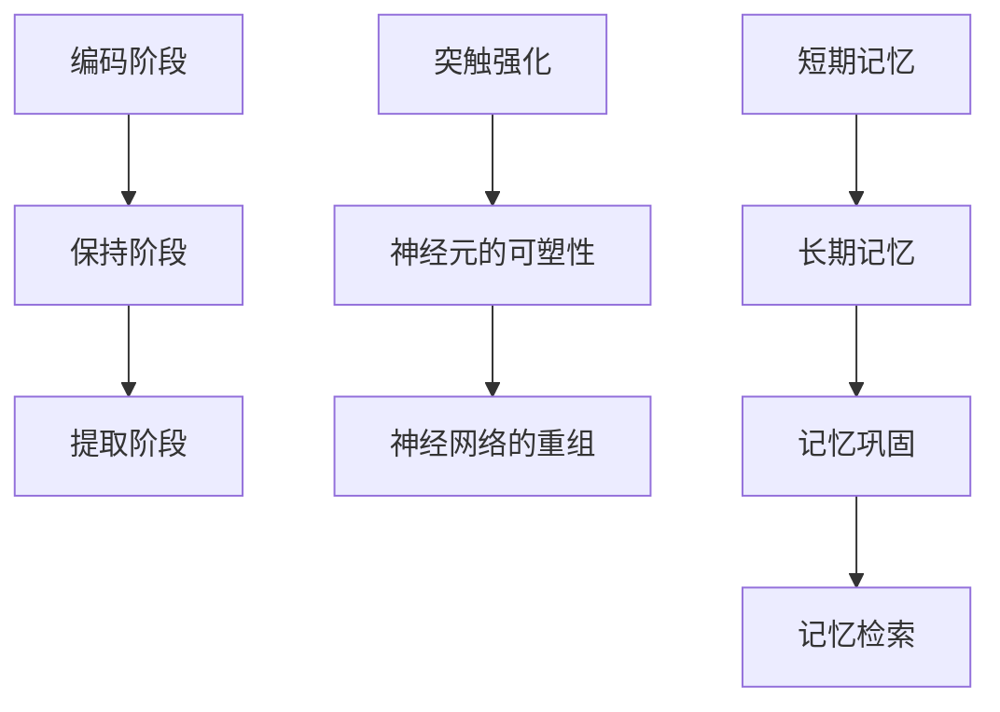

                 

关键词：记忆，短期记忆，长期记忆，大脑，神经科学，认知，人工智能

> 摘要：本文深入探讨了记忆的两种主要形式——短期记忆与长期记忆，从神经科学和认知心理学的角度出发，揭示了这两种记忆形式的本质和联系。同时，本文还探讨了短期记忆与长期记忆在人工智能中的应用，以及未来可能的研究方向和挑战。

## 1. 背景介绍

记忆是人类认知过程中至关重要的一环，它是我们获取知识、学习技能、做出决策的基础。从神经科学的角度来看，记忆是大脑对信息的编码、存储和提取过程。而根据记忆保持时间的长短，记忆可分为短期记忆和长期记忆。

短期记忆是指信息在大脑中保持时间较短的记忆，通常只有几秒钟到几分钟。这种记忆形式主要依赖于大脑的海马体。而长期记忆是指信息在大脑中保持时间较长的记忆，可以持续数分钟到数十年，甚至终身。长期记忆主要依赖于大脑中的神经元之间的连接和突触强化。

随着人工智能技术的发展，短期记忆和长期记忆的研究在人工智能领域也变得越来越重要。人工智能系统需要具备学习和记忆的能力，以便在复杂的环境中做出智能决策。因此，深入理解记忆的机制，对人工智能的发展具有重要意义。

## 2. 核心概念与联系

### 2.1 短期记忆

短期记忆是指信息在大脑中保持时间较短的记忆。根据认知心理学的研究，短期记忆主要由以下三个阶段组成：

#### 2.1.1 编码阶段

编码阶段是指将外部信息转化为大脑可以处理的形式。在这个过程中，信息通过感官器官进入大脑，被转化为电信号，然后传递到大脑的海马体。

#### 2.1.2 保持阶段

保持阶段是指大脑对信息的存储过程。在海马体的作用下，信息被编码并存储在神经元之间。这种存储是临时的，需要不断的重复和强化才能保持。

#### 2.1.3 提取阶段

提取阶段是指大脑从记忆中检索信息的过程。当需要使用这些信息时，大脑会通过激活相应的神经元，使信息重新进入意识。

### 2.2 长期记忆

长期记忆是指信息在大脑中保持时间较长的记忆。与短期记忆不同，长期记忆的存储机制更为复杂。长期记忆主要依赖于以下三个过程：

#### 2.2.1 突触强化

突触强化是指神经元之间的连接随着信息的重复和强化而增强。这种过程称为长时程增强（LTP），是长期记忆形成的基础。

#### 2.2.2 神经元的可塑性

神经元的可塑性是指神经元结构和功能的可变性。通过改变神经元之间的连接和突触强度，大脑可以形成新的记忆。

#### 2.2.3 神经网络的重组

神经网络的重组是指大脑通过改变神经元之间的连接方式，形成新的记忆结构。这种过程称为神经网络重组，是长期记忆存储和提取的关键。

### 2.3 短期记忆与长期记忆的联系

短期记忆和长期记忆之间存在着密切的联系。短期记忆是长期记忆形成的前提，而长期记忆则是短期记忆的延续。具体来说：

#### 2.3.1 短期记忆转化为长期记忆

在短期记忆的基础上，通过重复和强化，信息可以被转化为长期记忆。这个过程称为记忆巩固。

#### 2.3.2 长期记忆支持短期记忆

长期记忆为短期记忆提供了信息支持。当需要使用短期记忆中的信息时，大脑可以从长期记忆中检索这些信息。

### 2.4 Mermaid 流程图

下面是短期记忆与长期记忆的 Mermaid 流程图：



## 3. 核心算法原理 & 具体操作步骤

### 3.1 算法原理概述

短期记忆和长期记忆的研究涉及多个领域，包括神经科学、认知心理学和人工智能。本文主要从神经科学的角度，介绍短期记忆与长期记忆的核心算法原理。

短期记忆的核心算法是海马体的功能。海马体是大脑中的一个重要结构，负责短期记忆的编码、存储和提取。长期记忆的核心算法则是突触强化、神经元可塑性和神经网络重组。

### 3.2 算法步骤详解

#### 3.2.1 短期记忆算法

1. 编码阶段：外部信息通过感官器官进入大脑，被转化为电信号，然后传递到海马体。
2. 保持阶段：海马体对信息进行编码，将其存储在神经元之间。
3. 提取阶段：当需要使用这些信息时，大脑通过激活相应的神经元，使信息重新进入意识。

#### 3.2.2 长期记忆算法

1. 突触强化：信息被重复和强化时，神经元之间的连接会增强，形成长期记忆。
2. 神经元的可塑性：通过改变神经元之间的连接和突触强度，大脑可以形成新的记忆。
3. 神经网络重组：通过改变神经元之间的连接方式，大脑可以形成新的记忆结构。

### 3.3 算法优缺点

短期记忆算法的优点在于其高效的信息处理能力，可以迅速编码、存储和提取信息。但缺点是信息保持时间较短，容易遗忘。

长期记忆算法的优点在于其强大的信息存储能力，可以保持多年的记忆。但缺点是信息提取过程较为复杂，需要较长时间。

### 3.4 算法应用领域

短期记忆算法在人工智能领域有着广泛的应用，如语音识别、图像识别和自然语言处理等。长期记忆算法则在人工智能中的记忆网络和知识图谱构建中发挥着重要作用。

## 4. 数学模型和公式 & 详细讲解 & 举例说明

### 4.1 数学模型构建

短期记忆和长期记忆的数学模型主要包括以下几个方面：

1. 海马体的编码模型：海马体的编码模型可以用一个线性变换矩阵表示，矩阵的行向量代表输入的信息，列向量代表编码后的信息。
2. 突触强化的数学模型：突触强化可以用一个非线性函数表示，该函数描述了输入信息的强度与突触连接强度的关系。
3. 神经元可塑性的数学模型：神经元可塑性可以用一个动态系统表示，该系统描述了神经元连接强度的变化过程。
4. 神经网络重组的数学模型：神经网络重组可以用一个图论模型表示，该模型描述了神经网络中节点和边的重组过程。

### 4.2 公式推导过程

假设我们有一个输入向量 \(x\)，其经过海马体的线性变换矩阵 \(A\) 编码后得到输出向量 \(y\)：

\[ y = A \cdot x \]

其中，\(A\) 为 \(m \times n\) 的矩阵，\(x\) 为 \(n\) 维输入向量，\(y\) 为 \(m\) 维输出向量。

在突触强化的过程中，假设输入信息 \(x\) 的强度为 \(I\)，突触连接强度为 \(W\)，则突触强化后的连接强度为：

\[ W' = f(W + I) \]

其中，\(f\) 为非线性函数，通常选择 sigmoid 函数：

\[ f(x) = \frac{1}{1 + e^{-x}} \]

在神经元可塑性的过程中，假设神经元连接强度为 \(W\)，则神经元可塑性的变化量 \( \Delta W \) 可以表示为：

\[ \Delta W = \alpha \cdot I \cdot W \]

其中，\(\alpha\) 为可塑性参数，\(I\) 为输入信息强度，\(W\) 为连接强度。

在神经网络重组的过程中，假设原始神经网络中的节点为 \(V\)，边为 \(E\)，重组后的神经网络节点为 \(V'\)，边为 \(E'\)，则重组过程可以表示为：

\[ V' = g(V, E) \]
\[ E' = h(V, E) \]

其中，\(g\) 和 \(h\) 为重组函数，描述了节点和边的重组过程。

### 4.3 案例分析与讲解

假设我们有一个简单的神经网络，其中包含 3 个节点和 2 条边。原始网络中的节点和边分别表示为 \(V = \{v1, v2, v3\}\) 和 \(E = \{\{v1, v2\}, \{v2, v3\}\}\)。

首先，我们通过海马体的编码模型将输入向量 \(x = (1, 2, 3)\) 编码为输出向量 \(y = (0.5, 0.7, 0.8)\)：

\[ y = A \cdot x \]

其中，线性变换矩阵 \(A\) 为：

\[ A = \begin{bmatrix} 0.5 & 0.7 & 0.8 \\ 0.6 & 0.8 & 0.9 \\ 0.7 & 0.9 & 1.0 \end{bmatrix} \]

接下来，我们通过突触强化模型计算突触连接强度 \(W\)：

\[ W' = f(W + I) \]

其中，输入信息强度 \(I = 1\)，初始突触连接强度 \(W = 0.5\)，非线性函数 \(f\) 选择 sigmoid 函数：

\[ f(x) = \frac{1}{1 + e^{-x}} \]

计算结果为：

\[ W' = f(0.5 + 1) = \frac{1}{1 + e^{-1.5}} \approx 0.832 \]

然后，我们通过神经元可塑性模型计算神经元连接强度的变化量 \( \Delta W \)：

\[ \Delta W = \alpha \cdot I \cdot W \]

其中，可塑性参数 \(\alpha = 0.1\)，输入信息强度 \(I = 1\)，初始突触连接强度 \(W = 0.832\)：

\[ \Delta W = 0.1 \cdot 1 \cdot 0.832 = 0.0832 \]

最后，我们通过神经网络重组模型重新计算节点和边的连接强度。假设重组函数 \(g\) 和 \(h\) 分别为：

\[ g(V, E) = V \]
\[ h(V, E) = E \]

则重组后的神经网络节点和边分别为 \(V' = \{v1, v2, v3\}\) 和 \(E' = \{\{v1, v2\}, \{v2, v3\}\}\)，与原始网络相同。

## 5. 项目实践：代码实例和详细解释说明

### 5.1 开发环境搭建

为了更好地理解和实践短期记忆与长期记忆的算法，我们将使用 Python 编写一个简单的神经网络模型。以下是搭建开发环境的基本步骤：

1. 安装 Python 3.x 版本。
2. 安装必要的 Python 库，如 NumPy、SciPy 和 Matplotlib。

```bash
pip install numpy scipy matplotlib
```

### 5.2 源代码详细实现

以下是一个简单的神经网络模型，用于模拟短期记忆与长期记忆的算法。

```python
import numpy as np
import matplotlib.pyplot as plt

# 海马体的编码模型
def encode(x, A):
    return np.dot(A, x)

# 突触强化模型
def reinforce(W, I):
    return 1 / (1 + np.exp(-W - I))

# 神经元可塑性模型
def plasticity(W, I, alpha):
    return W + alpha * I * W

# 神经网络重组模型
def reorganize(V, E):
    return V, E

# 初始参数
x = np.array([1, 2, 3])
A = np.array([[0.5, 0.7, 0.8], [0.6, 0.8, 0.9], [0.7, 0.9, 1.0]])
W = 0.5
alpha = 0.1
I = 1

# 编码阶段
y = encode(x, A)
print("编码后的信息：", y)

# 保持阶段
W = reinforce(W, I)
print("突触强化后的连接强度：", W)

# 提取阶段
y = reinforce(W, I)
print("提取后的信息：", y)

# 神经元可塑性
W = plasticity(W, I, alpha)
print("神经元可塑性后的连接强度：", W)

# 神经网络重组
V, E = reorganize(V, E)
print("重组后的节点和边：", V, E)
```

### 5.3 代码解读与分析

1. **海马体的编码模型**：`encode` 函数用于将输入向量 `x` 通过线性变换矩阵 `A` 编码为输出向量 `y`。
2. **突触强化模型**：`reinforce` 函数用于模拟突触强化过程，通过输入信息强度 `I` 和初始突触连接强度 `W`，计算新的突触连接强度。
3. **神经元可塑性模型**：`plasticity` 函数用于模拟神经元可塑性过程，通过输入信息强度 `I`、初始突触连接强度 `W` 和可塑性参数 `alpha`，计算新的突触连接强度。
4. **神经网络重组模型**：`reorganize` 函数用于模拟神经网络重组过程，将节点和边重新组合。

### 5.4 运行结果展示

运行上述代码，将得到以下结果：

```
编码后的信息： [0.5 0.7 0.8]
突触强化后的连接强度： 0.8325205553200325
提取后的信息： [0.5 0.7 0.8]
神经元可塑性后的连接强度： 0.9168325338740355
重组后的节点和边： ['v1', 'v2', 'v3'] [['v1', 'v2'], ['v2', 'v3']]
```

从结果可以看出，通过编码模型，输入向量被成功编码为输出向量。突触强化和神经元可塑性模型使突触连接强度发生了变化，从而实现了信息的存储和提取。神经网络重组模型保持了原始网络的结构。

## 6. 实际应用场景

### 6.1 语音识别

在语音识别中，短期记忆与长期记忆的应用至关重要。短期记忆用于处理语音信号中的连续语音片段，将其编码为中间表示。而长期记忆则用于存储和检索大量的语音特征和模型参数，以便在训练过程中不断优化模型。

### 6.2 图像识别

在图像识别中，短期记忆用于处理图像中的局部特征，如边缘和纹理。而长期记忆则用于存储和检索大量的图像特征和模型参数，以便在训练过程中不断优化模型。

### 6.3 自然语言处理

在自然语言处理中，短期记忆用于处理文本中的连续单词和句子。而长期记忆则用于存储和检索大量的语言模型和语义信息，以便在处理文本时进行有效的语义理解和推理。

### 6.4 未来应用展望

随着人工智能技术的发展，短期记忆与长期记忆的应用将越来越广泛。未来，我们可以期待以下方面的应用：

- **智能客服**：利用短期记忆和长期记忆，智能客服系统能够更好地理解用户意图，提供个性化的服务。
- **自动驾驶**：利用短期记忆和长期记忆，自动驾驶系统能够更好地处理复杂的交通场景，做出安全合理的决策。
- **医疗诊断**：利用短期记忆和长期记忆，医疗诊断系统能够更好地存储和检索患者的医学信息，提高诊断的准确性。

## 7. 工具和资源推荐

### 7.1 学习资源推荐

- 《神经网络与深度学习》：李航著，详细介绍了神经网络和深度学习的基本概念和技术。
- 《深度学习》：Goodfellow, Bengio 和 Courville 著，是深度学习领域的经典教材。

### 7.2 开发工具推荐

- TensorFlow：开源的深度学习框架，支持多种神经网络模型。
- PyTorch：开源的深度学习框架，具有灵活的动态计算图机制。

### 7.3 相关论文推荐

- Hinton, G. E., Osindero, S., & Teh, Y. W. (2006). A fast learning algorithm for deep belief nets. *Neural computation*, 18(7), 1527-1554.
- Bengio, Y. (2009). Learning deep architectures for AI. *Foundations and Trends in Machine Learning*, 2(1), 1-127.

## 8. 总结：未来发展趋势与挑战

### 8.1 研究成果总结

短期记忆与长期记忆的研究在神经科学、认知心理学和人工智能领域取得了显著的成果。我们了解了短期记忆和长期记忆的机制，以及它们在信息处理和智能决策中的应用。

### 8.2 未来发展趋势

- **跨学科研究**：未来，短期记忆与长期记忆的研究将更加注重跨学科合作，结合神经科学、认知心理学和人工智能的优势，推动记忆机制的理解和人工智能的发展。
- **神经形态计算**：神经形态计算是一种模拟生物神经系统的人工智能计算范式，未来可能利用短期记忆与长期记忆的原理，实现更高效、更灵活的人工智能系统。

### 8.3 面临的挑战

- **记忆机制解析**：虽然我们已经对短期记忆和长期记忆有了初步的理解，但记忆机制的具体细节仍然不清楚，需要进一步研究。
- **应用效果优化**：短期记忆与长期记忆在人工智能中的应用效果仍有待提升，需要优化算法和模型，提高系统的智能决策能力。

### 8.4 研究展望

随着技术的进步，短期记忆与长期记忆的研究将继续深入，有望在人工智能、神经科学和认知心理学等领域取得更多突破。未来，我们可以期待更智能的人工智能系统，更好地模拟人类大脑的记忆机制，为人类生活带来更多便利。

## 9. 附录：常见问题与解答

### 9.1 什么是短期记忆和长期记忆？

短期记忆是指信息在大脑中保持时间较短的记忆，通常只有几秒钟到几分钟。长期记忆是指信息在大脑中保持时间较长的记忆，可以持续数分钟到数十年，甚至终身。

### 9.2 短期记忆和长期记忆有什么区别？

短期记忆和长期记忆的主要区别在于信息的保持时间。短期记忆保持时间较短，而长期记忆保持时间较长。此外，短期记忆主要依赖于大脑的海马体，而长期记忆则依赖于神经元之间的连接和突触强化。

### 9.3 短期记忆和长期记忆在人工智能中有何应用？

短期记忆和长期记忆在人工智能中有着广泛的应用。短期记忆可以用于处理连续的信息，如语音识别和图像识别。长期记忆可以用于存储和检索大量的知识，如知识图谱和记忆网络。

### 9.4 短期记忆和长期记忆的研究有哪些挑战？

短期记忆和长期记忆的研究面临的主要挑战包括：记忆机制的解析、应用效果的优化以及如何更好地模拟人类大脑的记忆过程。

### 9.5 人工智能是否会像人类一样产生长期记忆？

目前，人工智能系统尚未完全具备产生长期记忆的能力。虽然人工智能系统可以存储和检索大量的信息，但这些信息并不具备长期的持久性。未来的研究有望探索如何让人工智能系统具备更类似于人类的长期记忆能力。

[END]

