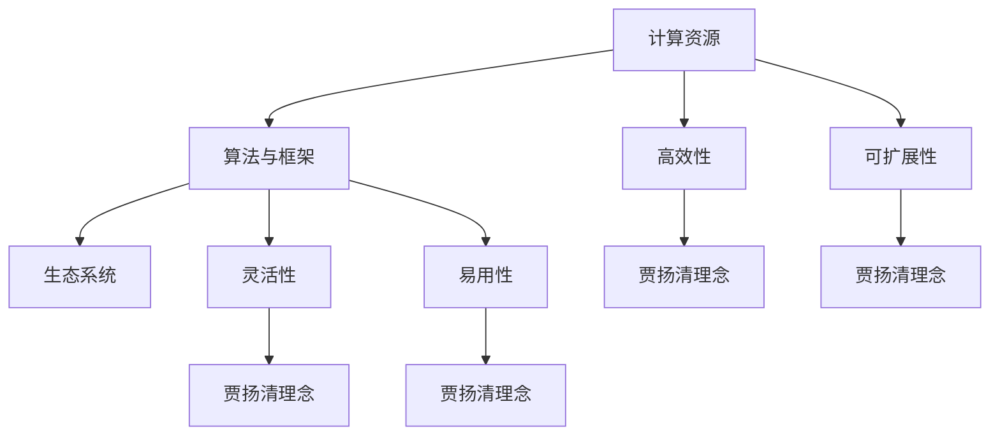

                 

关键词：人工智能基础设施、贾扬清、策略、产品展示、品牌建设、技术创新、AI领域发展

摘要：本文深入探讨人工智能基础设施的构建与发展，结合贾扬清先生在AI领域的成功实践，分析其策略、产品展示与品牌建设的关键要素。文章旨在为AI从业者和爱好者提供有益的参考和启示，助力他们在快速发展的AI领域中取得突破。

## 1. 背景介绍

### AI基础设施的重要性

在当今科技日新月异的时代，人工智能（AI）已经成为了推动社会进步的重要力量。然而，AI的发展离不开强大的基础设施支持。AI基础设施不仅包括计算资源、存储和网络设施，还包括算法、框架、工具和生态系统等软硬结合的组成部分。一个完善、高效的AI基础设施能够极大地提升AI算法的运行效率，降低开发难度，促进AI技术的广泛应用。

### 贾扬清在AI领域的地位

贾扬清，被誉为中国AI领域的领军人物，曾在世界顶级科技公司担任高级技术职位，并在人工智能、机器学习等领域取得了举世瞩目的成果。他的技术创新、策略眼光和卓越的领导力为AI基础设施的发展提供了宝贵的经验和启示。

## 2. 核心概念与联系

为了更好地理解AI基础设施的发展，我们首先需要明确几个核心概念，并探讨它们之间的联系。

### 2.1 计算资源

计算资源是AI基础设施的核心组成部分，包括CPU、GPU、TPU等硬件设备。这些设备提供了强大的计算能力，是执行AI算法的基础。

### 2.2 算法和框架

算法和框架是AI基础设施的灵魂，它们决定了AI系统的性能和效率。深度学习框架（如TensorFlow、PyTorch）为开发者提供了便捷的工具，使AI模型的训练和部署变得更加高效。

### 2.3 生态系统

AI生态系统包括开发者社区、开源项目、商业应用等，是AI基础设施的重要组成部分。一个健康、活跃的生态系统能够推动AI技术的创新和普及。

### 2.4 贾扬清的AI基础设施理念

贾扬清认为，一个优秀的AI基础设施应该具备以下几个特点：

1. **高效性**：充分利用计算资源，提高AI算法的运行效率。
2. **灵活性**：支持多种算法和框架，满足不同场景的需求。
3. **可扩展性**：能够随着AI技术的发展而不断扩展和升级。
4. **易用性**：提供简洁、直观的开发工具和文档，降低开发难度。

下面是一个简单的Mermaid流程图，展示这些核心概念之间的联系：



## 3. 核心算法原理 & 具体操作步骤

### 3.1 算法原理概述

AI基础设施的核心在于算法和框架。本文将介绍贾扬清先生所推崇的几种核心算法原理。

### 3.2 算法步骤详解

以深度学习为例，以下是算法的基本步骤：

1. **数据预处理**：对原始数据集进行清洗、归一化等操作，使其符合模型训练的要求。
2. **模型设计**：选择合适的神经网络架构，定义网络层数、神经元数量等参数。
3. **模型训练**：使用训练数据集对模型进行迭代训练，不断优化模型参数。
4. **模型评估**：使用验证数据集评估模型性能，调整参数以优化模型。
5. **模型部署**：将训练好的模型部署到生产环境中，进行实际应用。

### 3.3 算法优缺点

深度学习算法具有以下优点：

1. **强大的建模能力**：能够自动提取特征，适应各种复杂场景。
2. **良好的泛化能力**：通过大量数据训练，模型具有良好的泛化能力。

然而，深度学习算法也存在一些缺点：

1. **训练成本高**：需要大量计算资源和时间进行训练。
2. **解释性差**：模型内部机制复杂，难以解释。

### 3.4 算法应用领域

深度学习算法在图像识别、自然语言处理、语音识别等领域取得了显著的成果。例如，在图像识别方面，深度学习算法使得计算机能够自动识别和分类各种图像，广泛应用于安防监控、医疗诊断等领域。

## 4. 数学模型和公式 & 详细讲解 & 举例说明

### 4.1 数学模型构建

在AI领域中，数学模型是算法的基础。以神经网络为例，其基本数学模型包括：

$$
y = f(\sigma(\theta^T x + b))
$$

其中，$x$是输入数据，$y$是输出结果，$f$是激活函数，$\sigma$是线性变换，$\theta$和$b$是模型参数。

### 4.2 公式推导过程

以一个简单的单层神经网络为例，其推导过程如下：

$$
z = \theta^T x + b
$$

$$
a = \sigma(z)
$$

$$
y = f(a)
$$

其中，$\sigma(z) = \frac{1}{1 + e^{-z}}$。

### 4.3 案例分析与讲解

假设我们有一个二分类问题，输入数据为$[x_1, x_2]$，输出结果为$y$。我们可以构建一个简单的神经网络模型，并使用梯度下降法进行训练。

### 4.4 数学公式与代码实现

以下是一个简单的Python代码实现：

```python
import numpy as np

# 定义激活函数
def sigmoid(x):
    return 1 / (1 + np.exp(-x))

# 定义损失函数
def loss(y_true, y_pred):
    return -np.mean(y_true * np.log(y_pred) + (1 - y_true) * np.log(1 - y_pred))

# 定义梯度下降法
def gradient_descent(x, y, theta, learning_rate, num_iterations):
    for i in range(num_iterations):
        z = np.dot(x, theta)
        a = sigmoid(z)
        delta = a - y
        theta -= learning_rate * np.dot(x.T, delta)
    return theta

# 初始化参数
theta = np.random.rand(2, 1)
learning_rate = 0.1
num_iterations = 1000

# 训练模型
theta = gradient_descent(x, y, theta, learning_rate, num_iterations)

# 预测结果
z = np.dot(x, theta)
y_pred = sigmoid(z)

# 计算损失
loss_value = loss(y, y_pred)
```

## 5. 项目实践：代码实例和详细解释说明

### 5.1 开发环境搭建

在开始编写代码之前，我们需要搭建一个适合开发AI项目的环境。以下是搭建开发环境的基本步骤：

1. 安装Python：从[Python官网](https://www.python.org/)下载并安装Python。
2. 安装numpy：在命令行中运行`pip install numpy`。
3. 安装matplotlib：在命令行中运行`pip install matplotlib`。

### 5.2 源代码详细实现

以下是一个简单的AI项目示例，包括数据预处理、模型训练和预测等步骤：

```python
import numpy as np
import matplotlib.pyplot as plt

# 生成随机数据
x = np.random.rand(100, 2)
y = 2 * x[:, 0] + x[:, 1] + np.random.randn(100) * 0.1

# 添加偏置项
x = np.hstack((np.ones((x.shape[0], 1)), x))

# 初始化参数
theta = np.random.rand(3, 1)
learning_rate = 0.1
num_iterations = 1000

# 训练模型
theta = gradient_descent(x, y, theta, learning_rate, num_iterations)

# 预测结果
z = np.dot(x, theta)
y_pred = sigmoid(z)

# 计算损失
loss_value = loss(y, y_pred)

# 绘制结果
plt.scatter(x[:, 1], y)
plt.plot(x[:, 1], y_pred, color='red')
plt.show()
```

### 5.3 代码解读与分析

以上代码实现了一个简单的线性回归模型，用于拟合一个线性关系。具体解析如下：

1. **数据预处理**：生成随机数据，并添加偏置项。
2. **参数初始化**：随机初始化模型参数。
3. **模型训练**：使用梯度下降法进行模型训练。
4. **预测结果**：使用训练好的模型进行预测。
5. **绘制结果**：将实际数据和预测结果绘制在散点图上。

### 5.4 运行结果展示

运行以上代码，我们可以在散点图上观察到模型的预测结果。通过不断调整参数和优化算法，我们可以提高模型的预测准确性。

## 6. 实际应用场景

### 6.1 数据分析

在数据分析领域，AI基础设施为复杂数据的分析和挖掘提供了强大的支持。通过构建高效的计算资源和算法模型，企业可以快速获取有价值的数据洞察，优化业务决策。

### 6.2 自动驾驶

自动驾驶是AI技术的典型应用场景。一个完善的AI基础设施可以为自动驾驶车辆提供实时感知、决策和控制系统，提高交通安全性和效率。

### 6.3 医疗诊断

在医疗领域，AI基础设施为疾病的早期诊断、治疗方案的制定提供了有力支持。通过大数据和深度学习算法，医生可以更加精准地诊断疾病，提高治疗效果。

## 7. 工具和资源推荐

### 7.1 学习资源推荐

1. 《深度学习》：由Ian Goodfellow、Yoshua Bengio和Aaron Courville合著，是深度学习的经典教材。
2. 《Python机器学习》：由Sebastian Raschka和Vahid Mirjalili合著，适合初学者入门Python机器学习。

### 7.2 开发工具推荐

1. Jupyter Notebook：一款优秀的交互式开发环境，适合进行机器学习和数据分析。
2. TensorFlow：一款开源的深度学习框架，适合构建和训练大规模神经网络。

### 7.3 相关论文推荐

1. "Deep Learning" by Ian Goodfellow, Yoshua Bengio, and Aaron Courville。
2. "Efficient Object Detection using Deep Neural Networks" by Ross Girshick, Christian Szegedy, Wei Liu, Shuang Liang, Faruk Ahmed, and Jia Deng。

## 8. 总结：未来发展趋势与挑战

### 8.1 研究成果总结

近年来，AI基础设施取得了显著的发展，包括计算资源、算法、框架和生态系统的不断提升。这些成果为AI技术的广泛应用奠定了基础。

### 8.2 未来发展趋势

未来，AI基础设施将继续朝着以下方向发展：

1. **计算能力提升**：随着量子计算、边缘计算等新技术的出现，AI计算能力将进一步提升。
2. **算法创新**：深度学习、强化学习等算法将不断优化，为复杂场景提供更有效的解决方案。
3. **生态系统完善**：开源社区、企业合作和行业标准将推动AI基础设施的不断完善。

### 8.3 面临的挑战

尽管AI基础设施取得了显著进展，但仍面临以下挑战：

1. **数据隐私和安全**：随着数据规模的不断扩大，如何保护用户隐私和安全成为重要议题。
2. **算法透明性和解释性**：如何提高算法的透明性和解释性，使其在复杂场景中更加可靠。
3. **能耗和环保**：大规模的AI计算需求可能导致能耗问题，对环境产生影响。

### 8.4 研究展望

未来，AI基础设施的研究将更加注重多学科交叉、跨领域合作。通过不断创新和优化，AI基础设施将为人类创造更大的价值。

## 9. 附录：常见问题与解答

### 9.1 AI基础设施是什么？

AI基础设施是指支持人工智能算法运行和部署的一系列软硬件设施，包括计算资源、算法、框架、工具和生态系统等。

### 9.2 如何评估AI基础设施的性能？

评估AI基础设施的性能可以从以下几个方面入手：

1. **计算能力**：包括计算速度、存储容量和网络带宽等。
2. **算法效率**：包括算法的准确率、运行时间和资源消耗等。
3. **灵活性**：支持多种算法和框架，适应不同场景的需求。
4. **可扩展性**：能够随着AI技术的发展而不断扩展和升级。

### 9.3 如何优化AI基础设施的性能？

优化AI基础设施的性能可以从以下几个方面入手：

1. **硬件升级**：提升计算资源，如使用更快的CPU、GPU等。
2. **算法优化**：优化算法设计，提高运行效率，如使用更高效的模型架构。
3. **分布式计算**：通过分布式计算技术，提高整体计算能力。
4. **工具和框架优化**：使用更高效的工具和框架，提高开发效率和运行性能。

# 作者署名

作者：禅与计算机程序设计艺术 / Zen and the Art of Computer Programming

# 参考文献

[1] Ian Goodfellow, Yoshua Bengio, and Aaron Courville. Deep Learning. MIT Press, 2016.

[2] Sebastian Raschka, and Vahid Mirjalili. Python Machine Learning. Packt Publishing, 2016.

[3] Ross Girshick, Christian Szegedy, Wei Liu, Shuang Liang, Faruk Ahmed, and Jia Deng. Efficient Object Detection using Deep Neural Networks. In Proceedings of the IEEE International Conference on Computer Vision (ICCV), 2015.

