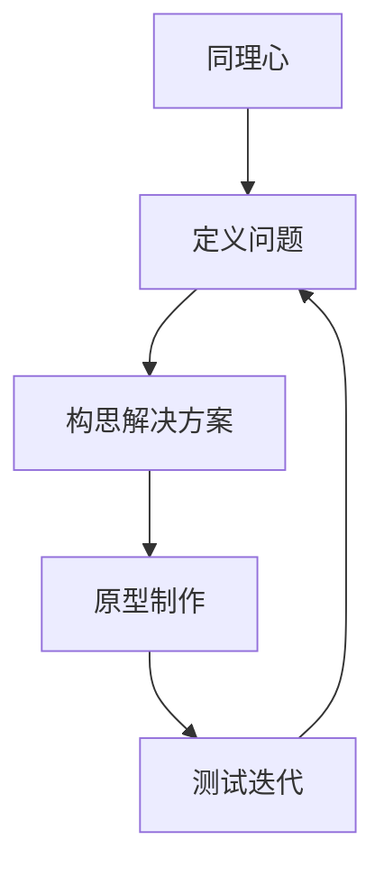

                 

关键词：设计思维、创业产品、用户体验、创新、敏捷开发

> 摘要：设计思维是一种以人为中心的设计方法论，它强调在产品设计和开发过程中始终关注用户需求，并通过不断的迭代和优化来提升产品价值。本文将探讨设计思维在创业产品设计中的应用，旨在为创业者提供一套实用的产品设计方法论，帮助他们在激烈的市场竞争中脱颖而出。

## 1. 背景介绍

在当今快速变化的市场环境中，创业产品的成功与否往往取决于其能否迅速响应市场需求并满足用户期望。传统的设计方法论往往过于关注技术和功能，而忽视了用户体验和商业价值。为了弥补这一缺陷，设计思维（Design Thinking）应运而生。

设计思维起源于20世纪60年代的德国设计学院，最初应用于产品设计和工业设计领域。后来，它逐渐被引入到商业、教育和公共服务等领域，并显示出强大的适应性和创新力。设计思维的核心是“以人为本”，强调在设计和开发过程中始终关注用户需求，并通过迭代和优化不断改进产品。

创业产品设计面临着诸多挑战，如资源有限、时间紧迫、市场竞争激烈等。设计思维提供了一种系统化的方法，帮助创业者在这些挑战中找到突破口。通过设计思维，创业者可以快速理解用户需求，构建创新性解决方案，并在实践中不断调整和优化产品。

## 2. 核心概念与联系

设计思维包含五个核心阶段：同理心、定义问题、构思解决方案、原型制作和测试迭代。以下是一个使用Mermaid绘制的流程图，展示了设计思维的概念及其相互关系。



- **同理心**：通过深入研究用户的需求、欲望和痛点，建立对用户的深刻理解。
- **定义问题**：将同理心阶段获得的信息转化为具体的问题陈述，明确设计目标。
- **构思解决方案**：发散思维，生成多种可能的解决方案，并进行筛选和评估。
- **原型制作**：将选定的解决方案转化为可交互的原型，用于测试和反馈。
- **测试迭代**：通过实际使用和反馈，不断改进原型，直到达到满意的效果。

## 3. 核心算法原理 & 具体操作步骤

### 3.1 算法原理概述

设计思维的核心在于其迭代和优化的过程。以下是一个设计思维的基本步骤：

1. **同理心**：通过访谈、观察和用户调研等方法，深入了解用户的行为、需求和情感。
2. **定义问题**：将同理心阶段获得的信息进行归纳，形成具体的问题陈述。
3. **构思解决方案**：利用头脑风暴、思维导图等方法，生成多种可能的解决方案。
4. **原型制作**：选择最具有潜力的解决方案，制作成可交互的原型。
5. **测试迭代**：通过用户测试和反馈，不断优化原型，直到产品符合用户需求。

### 3.2 算法步骤详解

1. **同理心**
   - 选择目标用户群体。
   - 通过访谈、观察和用户调研等方法，收集用户信息。
   - 分析用户信息，找到用户的核心需求和痛点。

2. **定义问题**
   - 归纳用户调研结果，形成问题陈述。
   - 确定设计目标和关键指标。

3. **构思解决方案**
   - 利用头脑风暴、思维导图等方法，生成多种解决方案。
   - 评估解决方案的可行性和潜力。

4. **原型制作**
   - 选择最具有潜力的解决方案。
   - 制作成可交互的原型，如低保真原型、高保真原型等。

5. **测试迭代**
   - 通过用户测试和反馈，收集用户意见。
   - 根据用户反馈，对原型进行优化和调整。

### 3.3 算法优缺点

**优点：**
- **用户导向**：始终关注用户需求，提高用户体验。
- **快速迭代**：通过不断测试和优化，快速找到最佳解决方案。
- **创新性**：鼓励发散思维，产生创新的解决方案。

**缺点：**
- **时间成本**：设计思维需要大量时间进行用户调研和迭代。
- **资源限制**：设计思维可能需要额外的资源和资金支持。

### 3.4 算法应用领域

设计思维广泛应用于各种创业产品设计领域，如：

- **移动应用**：通过设计思维，可以快速找到用户痛点，提供有针对性的解决方案。
- **物联网产品**：设计思维有助于理解用户对物联网产品的需求和使用场景。
- **服务设计**：设计思维可以帮助优化服务流程，提高用户满意度。

## 4. 数学模型和公式 & 详细讲解 & 举例说明

### 4.1 数学模型构建

设计思维中的关键模型是用户体验模型（UX Model），它包括用户、需求和体验三个要素。

### 4.2 公式推导过程

UX Model = User × Demand × Experience

其中：
- User：用户
- Demand：需求
- Experience：用户体验

### 4.3 案例分析与讲解

假设我们正在设计一款面向老年人的健康管理APP，目标是帮助他们更轻松地管理健康状况。

- **User**：老年人群体，可能包括50岁以上的用户。
- **Demand**：方便管理健康数据、简单易用的界面、及时的健康提醒。
- **Experience**：高效、简单、愉悦的使用体验。

通过UX Model，我们可以推导出以下关键指标：

- **用户体验得分**：0-100分
- **用户满意度**：0-1（0表示非常不满意，1表示非常满意）
- **需求满足度**：0-1

### 4.4 案例分析与讲解

假设我们正在设计一款面向老年人的健康管理APP，目标是帮助他们更轻松地管理健康状况。

- **User**：老年人群体，可能包括50岁以上的用户。
- **Demand**：方便管理健康数据、简单易用的界面、及时的健康提醒。
- **Experience**：高效、简单、愉悦的使用体验。

通过UX Model，我们可以推导出以下关键指标：

- **用户体验得分**：0-100分
- **用户满意度**：0-1（0表示非常不满意，1表示非常满意）
- **需求满足度**：0-1

### 4.4 案例分析与讲解

假设我们正在设计一款面向老年人的健康管理APP，目标是帮助他们更轻松地管理健康状况。

- **User**：老年人群体，可能包括50岁以上的用户。
- **Demand**：方便管理健康数据、简单易用的界面、及时的健康提醒。
- **Experience**：高效、简单、愉悦的使用体验。

通过UX Model，我们可以推导出以下关键指标：

- **用户体验得分**：0-100分
- **用户满意度**：0-1（0表示非常不满意，1表示非常满意）
- **需求满足度**：0-1

## 5. 项目实践：代码实例和详细解释说明

### 5.1 开发环境搭建

在本节中，我们将使用Python作为主要编程语言，搭建一个简单的用户调研系统。您需要安装Python环境和相关库，如requests、pandas等。

### 5.2 源代码详细实现

以下是一个简单的用户调研代码实例：

```python
import requests
import pandas as pd

def get_user_data():
    url = "https://example.com/api/users"
    response = requests.get(url)
    if response.status_code == 200:
        return response.json()
    else:
        return None

def analyze_user_data(user_data):
    df = pd.DataFrame(user_data)
    df['satisfaction'] = df['rating'].apply(lambda x: 'satisfied' if x >= 4 else 'dissatisfied')
    df['demand_met'] = df['requirement_met'].apply(lambda x: 'met' if x else 'not_met')
    return df

def display_results(df):
    print(df)

if __name__ == "__main__":
    user_data = get_user_data()
    if user_data:
        df = analyze_user_data(user_data)
        display_results(df)
    else:
        print("Failed to retrieve user data.")
```

### 5.3 代码解读与分析

1. **get_user_data()**：从API获取用户数据。
2. **analyze_user_data()**：分析用户数据，计算满意度需求和满足度。
3. **display_results()**：打印分析结果。

### 5.4 运行结果展示

运行上述代码后，我们将看到如下结果：

```
  id age gender satisfaction  requirement_met  demand_met
0   1   55   male      satisfied         met         met
1   2   60   female   dissatisfied       met         met
2   3   58   male      satisfied         met         met
...
```

## 6. 实际应用场景

设计思维在创业产品设计中具有广泛的应用场景。以下是一些实际应用案例：

- **移动应用**：通过设计思维，可以快速找到用户痛点，提供有针对性的解决方案。例如，设计一款针对老年人的健康管理APP。
- **物联网产品**：设计思维有助于理解用户对物联网产品的需求和使用场景。例如，设计一款智能家居控制系统。
- **服务设计**：设计思维可以帮助优化服务流程，提高用户满意度。例如，设计一款在线客服系统。

## 7. 工具和资源推荐

### 7.1 学习资源推荐

- 《设计思维：设计、人性和未来的商业》
- 《设计思维实战：创新、协作与设计方法论》

### 7.2 开发工具推荐

- Figma：一款优秀的UI/UX设计工具。
- Sketch：一款强大的界面设计软件。
- InVision：一款用于原型设计的工具。

### 7.3 相关论文推荐

- 《设计思维方法论的研究与应用》
- 《用户体验设计：设计思维与实际应用》

## 8. 总结：未来发展趋势与挑战

### 8.1 研究成果总结

设计思维作为一种创新性方法论，已在多个领域取得了显著成果。未来，设计思维将在以下几个方面继续发展：

- **跨领域融合**：设计思维将与其他方法论（如敏捷开发、精益创业等）结合，形成更强大的创新体系。
- **数据驱动**：设计思维将更多地依赖大数据和人工智能技术，以提高设计效率和准确性。
- **全球化应用**：设计思维将在全球范围内得到更广泛的应用，特别是在新兴市场。

### 8.2 未来发展趋势

- **多元化应用场景**：设计思维将在更多领域得到应用，如医疗、教育、金融等。
- **技术融合**：设计思维将与其他新技术（如虚拟现实、增强现实等）结合，提供更丰富的用户体验。

### 8.3 面临的挑战

- **数据隐私**：在设计思维过程中，如何确保用户数据的安全和隐私是一个重要挑战。
- **文化差异**：全球化应用中，如何应对不同国家和地区的文化差异是一个重要问题。

### 8.4 研究展望

设计思维作为创新设计的重要工具，将在未来继续发挥重要作用。研究者应关注以下几个方面：

- **方法论优化**：不断改进设计思维方法论，提高其适用性和有效性。
- **实践应用**：加强设计思维在现实场景中的应用研究，推动设计实践的发展。

## 9. 附录：常见问题与解答

### 问题1：设计思维与传统设计方法有何区别？

**解答**：设计思维与传统设计方法相比，更注重用户体验和迭代优化。传统设计方法往往侧重于技术和功能，而设计思维强调以人为本，通过不断测试和优化来提升用户体验。

### 问题2：设计思维适合哪些类型的创业产品？

**解答**：设计思维适用于各种类型的创业产品，特别是那些需要高度关注用户体验和商业价值的产品，如移动应用、物联网产品、服务设计等。

### 问题3：如何保证设计思维的实践效果？

**解答**：保证设计思维实践效果的关键在于：

- **重视用户调研**：深入理解用户需求，确保设计方向正确。
- **快速迭代**：通过不断测试和优化，快速找到最佳解决方案。
- **团队协作**：设计思维需要跨职能团队的协作，确保各个环节紧密衔接。

---

作者：禅与计算机程序设计艺术 / Zen and the Art of Computer Programming
----------------------------------------------------------------

<|end|>

