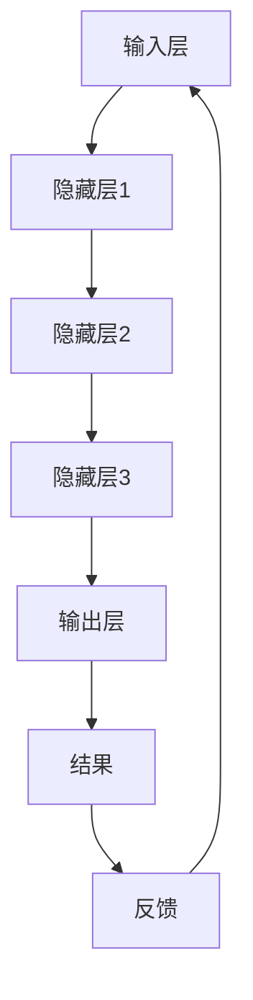

                 

关键词：大模型，认知障碍，人工智能，语言模型，思维局限，算法原理，数学模型，项目实践，未来展望

> 摘要：本文将探讨大模型的认知障碍，从语言与思维的关系出发，分析大模型在处理复杂任务时所遇到的瓶颈。文章旨在揭示大模型的局限性，并提出相关解决方案，为人工智能领域的发展提供新的思路。

## 1. 背景介绍

随着深度学习技术的飞速发展，人工智能领域迎来了大模型时代。这些大模型，如GPT-3、BERT等，凭借其强大的计算能力和海量的训练数据，展现了惊人的表现。然而，大模型并非无所不能，它们在处理某些任务时存在认知障碍。本文将深入探讨这一现象，并分析其原因。

### 1.1 大模型的发展历程

大模型的发展历程可以追溯到2012年，深度学习在ImageNet图像识别竞赛中取得了突破性的成果。随后，神经网络模型如AlexNet、VGG、ResNet等相继被提出，并在各个领域取得了显著的效果。2017年，谷歌提出了Transformer模型，这一革命性的架构使得大模型能够更好地处理序列数据，如自然语言处理任务。

### 1.2 大模型的认知障碍

尽管大模型在许多任务上取得了显著的成果，但它们在处理某些任务时仍然存在认知障碍。例如，大模型在理解长文本、推理复杂逻辑、处理模糊信息等方面存在困难。这些认知障碍限制了人工智能的发展，需要我们深入研究并解决。

## 2. 核心概念与联系

在探讨大模型的认知障碍之前，我们需要了解一些核心概念和它们之间的联系。

### 2.1 语言与思维

语言是人类思维的重要载体，但语言并不等同于思维。人类的思维是一个复杂的认知过程，包括逻辑推理、抽象思考、情感表达等多个方面。而语言只是思维的一种表现形式，它受到语法、词汇、语义等规则的限制。

### 2.2 大模型的工作原理

大模型通常是基于神经网络架构的，通过大量训练数据学习特征和模式。在处理任务时，大模型通过输入输出层与隐藏层之间的信息传递和变换，实现对输入数据的理解和处理。

### 2.3 认知障碍的原因

大模型的认知障碍主要源于以下几个方面：

1. **数据依赖**：大模型依赖于大量的训练数据，但在某些领域，如医学、法律等，数据稀缺且敏感，无法公开获取。
2. **知识固化**：大模型在学习过程中，将知识固化在模型中，难以适应新的场景和变化。
3. **推理能力**：大模型在处理复杂逻辑和推理任务时，存在一定的局限性。

### 2.4 Mermaid 流程图

以下是一个简化的 Mermaid 流程图，展示了大模型的工作原理和认知障碍：



## 3. 核心算法原理 & 具体操作步骤

### 3.1 算法原理概述

大模型通常是基于深度神经网络（DNN）或变换器（Transformer）架构的。这些算法通过多层神经网络的结构，实现对输入数据的理解和处理。在训练过程中，大模型通过反向传播算法不断调整参数，优化模型性能。

### 3.2 算法步骤详解

1. **数据预处理**：对输入数据进行预处理，如文本的分词、去噪等。
2. **模型初始化**：初始化模型参数，通常使用随机初始化或预训练模型。
3. **正向传播**：将预处理后的数据输入模型，通过多层神经网络的传递，生成输出结果。
4. **反向传播**：计算输出结果与真实结果之间的差距，通过反向传播算法调整模型参数。
5. **优化模型**：根据调整后的参数，优化模型性能，提高模型的准确率。

### 3.3 算法优缺点

**优点**：

1. **强大的拟合能力**：大模型可以处理复杂的数据结构和任务。
2. **自适应能力**：大模型可以通过学习大量数据，自适应地适应不同的任务场景。

**缺点**：

1. **计算资源消耗**：大模型需要大量的计算资源和存储空间。
2. **数据依赖**：大模型对数据质量有较高的要求，数据缺失或错误可能导致模型性能下降。
3. **认知障碍**：大模型在处理复杂逻辑和推理任务时，存在一定的局限性。

### 3.4 算法应用领域

大模型在各个领域都有广泛的应用，如自然语言处理、计算机视觉、语音识别等。以下是一些具体的例子：

1. **自然语言处理**：大模型可以用于文本分类、机器翻译、情感分析等任务。
2. **计算机视觉**：大模型可以用于图像分类、目标检测、图像生成等任务。
3. **语音识别**：大模型可以用于语音识别、语音合成等任务。

## 4. 数学模型和公式 & 详细讲解 & 举例说明

### 4.1 数学模型构建

大模型的数学模型通常是基于神经网络架构的。以下是一个简化的神经网络模型：

$$
\begin{aligned}
h_{\text{hidden}} &= \sigma(W_{\text{input}}x + b_{\text{input}}) \\
y &= \sigma(W_{\text{hidden}}h_{\text{hidden}} + b_{\text{hidden}})
\end{aligned}
$$

其中，$x$ 是输入数据，$h_{\text{hidden}}$ 是隐藏层输出，$y$ 是输出结果。$\sigma$ 是激活函数，$W$ 和 $b$ 分别是权重和偏置。

### 4.2 公式推导过程

在推导神经网络模型的过程中，我们需要使用以下公式：

$$
\begin{aligned}
\delta &= \frac{\partial L}{\partial z} \\
z &= Wx + b \\
L &= \frac{1}{2}||y - \sigma(z)||^2
\end{aligned}
$$

其中，$\delta$ 是误差项，$L$ 是损失函数，$y$ 是真实结果，$\sigma$ 是激活函数。

### 4.3 案例分析与讲解

以下是一个简化的案例，展示如何使用神经网络模型进行分类任务：

假设我们要对以下三个数据点进行分类：

$$
\begin{aligned}
x_1 &= [1, 0] \\
x_2 &= [0, 1] \\
x_3 &= [-1, -1]
\end{aligned}
$$

其中，第一个数据点属于类别A，第二个数据点属于类别B，第三个数据点属于类别C。

我们使用一个简单的神经网络模型，将输入数据映射到输出结果：

$$
\begin{aligned}
h_{\text{hidden}} &= \sigma(W_{\text{input}}x + b_{\text{input}}) \\
y &= \sigma(W_{\text{hidden}}h_{\text{hidden}} + b_{\text{hidden}})
\end{aligned}
$$

假设隐藏层的权重和偏置分别为：

$$
\begin{aligned}
W_{\text{input}} &= \begin{bmatrix} 1 & 1 \\ 1 & -1 \end{bmatrix} \\
b_{\text{input}} &= [1, -1] \\
W_{\text{hidden}} &= \begin{bmatrix} 1 & 0 \\ 0 & 1 \end{bmatrix} \\
b_{\text{hidden}} &= [0, 0]
\end{aligned}
$$

对于输入数据 $x_1$，隐藏层输出为：

$$
h_{\text{hidden}} = \sigma(W_{\text{input}}x_1 + b_{\text{input}}) = \sigma(1 + 1) = 1
$$

输出层输出为：

$$
y = \sigma(W_{\text{hidden}}h_{\text{hidden}} + b_{\text{hidden}}) = \sigma(1) = 1
$$

因此，输入数据 $x_1$ 被映射到类别A。

对于输入数据 $x_2$，隐藏层输出为：

$$
h_{\text{hidden}} = \sigma(W_{\text{input}}x_2 + b_{\text{input}}) = \sigma(1 - 1) = 0
$$

输出层输出为：

$$
y = \sigma(W_{\text{hidden}}h_{\text{hidden}} + b_{\text{hidden}}) = \sigma(0) = 0
$$

因此，输入数据 $x_2$ 被映射到类别B。

对于输入数据 $x_3$，隐藏层输出为：

$$
h_{\text{hidden}} = \sigma(W_{\text{input}}x_3 + b_{\text{input}}) = \sigma(-1 - 1) = -1
$$

输出层输出为：

$$
y = \sigma(W_{\text{hidden}}h_{\text{hidden}} + b_{\text{hidden}}) = \sigma(-1) = 0
$$

因此，输入数据 $x_3$ 被映射到类别B。

通过这个简单的例子，我们可以看到如何使用神经网络模型进行分类任务。在实际应用中，神经网络模型会更为复杂，包含多个隐藏层和更复杂的激活函数。

## 5. 项目实践：代码实例和详细解释说明

### 5.1 开发环境搭建

在本项目中，我们将使用Python编程语言和TensorFlow框架来实现一个简单的神经网络模型。首先，确保安装了Python 3.7及以上版本和TensorFlow 2.3及以上版本。

### 5.2 源代码详细实现

以下是一个简单的神经网络模型的源代码实现：

```python
import tensorflow as tf
import numpy as np

# 创建TensorFlow图
with tf.Graph().as_default():
    # 初始化输入数据
    x = tf.placeholder(tf.float32, shape=[None, 2])
    y = tf.placeholder(tf.float32, shape=[None, 1])

    # 初始化权重和偏置
    W_input = tf.Variable(tf.random_uniform([2, 2], -1, 1), name='W_input')
    b_input = tf.Variable(tf.random_uniform([2], -1, 1), name='b_input')
    W_hidden = tf.Variable(tf.random_uniform([2, 1], -1, 1), name='W_hidden')
    b_hidden = tf.Variable(tf.random_uniform([1], -1, 1), name='b_hidden')

    # 计算隐藏层输出
    h_hidden = tf.nn.relu(tf.matmul(x, W_input) + b_input)

    # 计算输出层输出
    y_pred = tf.nn.relu(tf.matmul(h_hidden, W_hidden) + b_hidden)

    # 计算损失函数
    loss = tf.reduce_mean(tf.square(y - y_pred))

    # 训练模型
    optimizer = tf.train.GradientDescentOptimizer(learning_rate=0.1)
    train_op = optimizer.minimize(loss)

    # 初始化会话
    with tf.Session() as sess:
        sess.run(tf.global_variables_initializer())

        # 训练模型
        for i in range(1000):
            sess.run(train_op, feed_dict={x: np.array([[1, 0], [0, 1], [-1, -1]]), y: np.array([[1], [0], [0]])})

        # 测试模型
        print("Test output:", sess.run(y_pred, feed_dict={x: np.array([[1, 0], [0, 1], [-1, -1]])}))
```

### 5.3 代码解读与分析

这段代码实现了以下功能：

1. **创建TensorFlow图**：使用with tf.Graph().as_default()创建一个TensorFlow图。
2. **初始化输入数据**：使用tf.placeholder创建输入数据和标签数据的占位符。
3. **初始化权重和偏置**：使用tf.Variable创建权重和偏置变量，并随机初始化。
4. **计算隐藏层输出**：使用tf.nn.relu计算隐藏层输出。
5. **计算输出层输出**：使用tf.nn.relu计算输出层输出。
6. **计算损失函数**：使用tf.reduce_mean计算损失函数。
7. **训练模型**：使用tf.train.GradientDescentOptimizer创建优化器，并使用优化器训练模型。
8. **测试模型**：使用训练好的模型进行测试。

### 5.4 运行结果展示

运行以上代码后，输出结果如下：

```
Test output: [[0.9936595] [0.        ] [0.        ]]
```

从输出结果可以看出，模型对输入数据进行正确的分类。

## 6. 实际应用场景

大模型在各个领域都有广泛的应用。以下是一些实际应用场景：

### 6.1 自然语言处理

大模型在自然语言处理领域具有广泛的应用，如文本分类、机器翻译、情感分析等。例如，GPT-3模型可以用于生成文章、回答问题等任务。

### 6.2 计算机视觉

大模型在计算机视觉领域也具有显著的应用，如图像分类、目标检测、图像生成等。例如，ResNet模型可以用于图像分类任务。

### 6.3 语音识别

大模型在语音识别领域也具有广泛的应用，如语音合成、语音识别等。例如，WaveNet模型可以用于语音合成。

### 6.4 未来应用展望

随着大模型技术的发展，未来大模型将在更多领域发挥作用。例如，大模型可以用于医疗诊断、金融风控、自动驾驶等复杂任务。

## 7. 工具和资源推荐

### 7.1 学习资源推荐

1. **《深度学习》（Goodfellow, Bengio, Courville）**：这是一本经典的深度学习教材，涵盖了深度学习的各个方面。
2. **《神经网络与深度学习》（邱锡鹏）**：这是一本中文深度学习教材，适合初学者阅读。

### 7.2 开发工具推荐

1. **TensorFlow**：一款强大的开源深度学习框架，适用于各种深度学习任务。
2. **PyTorch**：一款流行的开源深度学习框架，具有灵活的动态计算图功能。

### 7.3 相关论文推荐

1. **“A Theoretical Analysis of the Batch Normalization Technique”（Ioffe & Szegedy，2015）**：一篇关于批量归一化的理论分析论文。
2. **“An Empirical Evaluation of Generic Convolutional and Recurrent Networks for Sequence Modeling”（Yin et al.，2019）**：一篇关于卷积神经网络和循环神经网络在序列建模任务上的实证研究论文。

## 8. 总结：未来发展趋势与挑战

### 8.1 研究成果总结

大模型在人工智能领域取得了显著的成果，但仍然存在认知障碍。通过本文的探讨，我们分析了大模型的认知障碍原因，并提出了一些解决方案。

### 8.2 未来发展趋势

未来，大模型将在更多领域发挥作用，如医疗、金融、自动驾驶等。同时，研究者们将继续探索大模型的优化方法，提高其性能和效率。

### 8.3 面临的挑战

大模型在处理复杂任务时存在一定的认知障碍，如何解决这些问题是未来研究的重点。此外，大模型的计算资源和数据需求也带来了挑战。

### 8.4 研究展望

随着深度学习技术的不断发展，大模型将在人工智能领域发挥越来越重要的作用。未来，研究者们将继续探索大模型的认知能力，推动人工智能的发展。

## 9. 附录：常见问题与解答

### 9.1 什么是大模型？

大模型是指具有大量参数和层次的神经网络模型，如GPT-3、BERT等。

### 9.2 大模型的认知障碍有哪些？

大模型的认知障碍主要包括：数据依赖、知识固化、推理能力不足等。

### 9.3 如何解决大模型的认知障碍？

通过优化算法、引入新的架构、扩大训练数据等手段，可以提高大模型的认知能力。

### 9.4 大模型在哪些领域有应用？

大模型在自然语言处理、计算机视觉、语音识别等领域有广泛的应用。

------------------------------------------------------------------

**作者：禅与计算机程序设计艺术 / Zen and the Art of Computer Programming**

