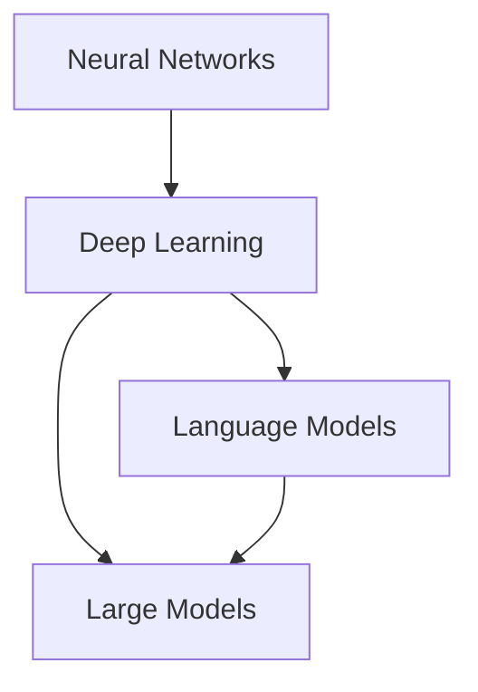

                 

关键词：大模型、认知障碍、语言理解、智能模型、神经网络、深度学习

> 摘要：随着人工智能技术的快速发展，大模型的应用越来越广泛。然而，这些大模型在语言理解和认知方面存在一定的障碍。本文将探讨大模型在语言处理中的认知限制，分析其背后的原因，并提出未来可能的解决方案。

## 1. 背景介绍

人工智能技术的发展经历了多个阶段，从早期的符号主义、知识表示，到现代的神经网络、深度学习。特别是近年来，随着计算能力的提升和海量数据的积累，大模型（Large Models）如BERT、GPT-3等取得了显著的突破。这些大模型在语言理解和生成、图像识别、语音识别等领域表现出强大的能力。

然而，尽管大模型在许多任务上取得了优异的性能，但它们在语言理解和认知方面仍然存在一些局限性。本文将重点探讨这些认知障碍，以及它们背后的原因。

## 2. 核心概念与联系

为了深入探讨大模型的认知障碍，我们首先需要了解一些核心概念，包括神经网络、深度学习、语言模型等。

### 2.1 神经网络与深度学习

神经网络是模仿生物神经元工作方式的计算模型。在神经网络中，信息通过一系列的层（Layer）传递，每个层都包含多个神经元（Node）。每个神经元都与前一层的神经元相连，并通过权重（Weight）和偏置（Bias）进行加权求和。最后，通过激活函数（Activation Function）得到输出。

深度学习是一种基于神经网络的机器学习方法，通过多层神经网络（Deep Neural Network）对数据进行处理，能够自动提取数据中的特征。

### 2.2 语言模型

语言模型（Language Model）是一种统计模型，用于预测下一个单词或字符的概率。在自然语言处理（Natural Language Processing, NLP）中，语言模型被广泛用于任务如文本生成、机器翻译、情感分析等。

### 2.3 大模型

大模型（Large Models）是指具有数十亿甚至数千亿参数的神经网络模型。这些模型具有强大的表示能力，能够捕获数据中的复杂模式。然而，这也导致它们在训练和推理时需要大量的计算资源。

### 2.4 Mermaid 流程图

下面是一个 Mermaid 流程图，展示了神经网络、深度学习、语言模型和大模型之间的关系。



## 3. 核心算法原理 & 具体操作步骤

### 3.1 算法原理概述

大模型的核心算法原理是基于神经网络和深度学习。具体来说，它们通过多层神经网络对输入数据进行处理，自动提取数据中的特征，并学习数据之间的关联。

### 3.2 算法步骤详解

1. 数据预处理：首先，对输入数据（如文本、图像、声音等）进行预处理，将其转换为模型可接受的格式。
2. 模型训练：然后，使用预处理的输入数据进行模型训练。在训练过程中，模型通过反向传播算法不断调整权重和偏置，以最小化损失函数。
3. 模型评估：训练完成后，对模型进行评估，以验证其在实际任务中的性能。
4. 模型应用：最后，将训练好的模型应用于实际任务，如文本生成、图像识别等。

### 3.3 算法优缺点

**优点：**
- 强大的表示能力：大模型具有强大的表示能力，能够捕获数据中的复杂模式。
- 优异的性能：在许多任务上，大模型表现出了优异的性能。

**缺点：**
- 计算资源需求大：大模型需要大量的计算资源进行训练和推理。
- 语言理解的局限性：尽管大模型在语言理解和生成方面取得了显著突破，但它们在语言理解和认知方面仍然存在一定的局限性。

### 3.4 算法应用领域

大模型的应用领域非常广泛，包括但不限于以下方面：
- 自然语言处理：文本生成、机器翻译、情感分析等。
- 计算机视觉：图像识别、目标检测、图像生成等。
- 语音识别：语音识别、语音合成等。
- 其他：推荐系统、游戏AI等。

## 4. 数学模型和公式 & 详细讲解 & 举例说明

### 4.1 数学模型构建

大模型的数学模型主要包括神经网络、深度学习、语言模型等。

### 4.2 公式推导过程

#### 神经网络

神经网络的核心是神经元，其基本公式为：

\[ z = \sum_{i} w_i x_i + b \]

其中，\( z \) 为神经元的输出，\( w_i \) 为权重，\( x_i \) 为输入，\( b \) 为偏置。

#### 深度学习

深度学习的核心是多层神经网络，其基本公式为：

\[ h_{l+1} = \sigma (W_l h_l + b_l) \]

其中，\( h_{l+1} \) 为下一层的输出，\( \sigma \) 为激活函数，\( W_l \) 为权重，\( h_l \) 为当前层的输出，\( b_l \) 为偏置。

#### 语言模型

语言模型的核心是词向量表示，其基本公式为：

\[ P(w_t | w_{t-1}, w_{t-2}, ...) = \frac{exp(f(w_t, w_{t-1}, w_{t-2}, ...))}{\sum_{w} exp(f(w_t, w_{t-1}, w_{t-2}, ...))} \]

其中，\( P(w_t | w_{t-1}, w_{t-2}, ...) \) 为给定前文 \( w_{t-1}, w_{t-2}, ... \) 后，下一个单词 \( w_t \) 的概率，\( f(w_t, w_{t-1}, w_{t-2}, ...) \) 为单词间的相似度函数。

### 4.3 案例分析与讲解

以 GPT-3 为例，GPT-3 是一个由 OpenAI 开发的具有 1750 亿参数的语言模型，它在文本生成任务上表现出了惊人的能力。

#### 案例分析

GPT-3 在文本生成任务上的表现可以归纳为以下几个方面：

1. 语言流畅性：GPT-3 生成的文本在语法、语义上具有较高的流畅性，接近于人类写作水平。
2. 话题一致性：GPT-3 能够根据输入的话题生成相关的文本，保持话题的一致性。
3. 内容创新性：GPT-3 有时能够生成新颖的观点和想法，具有创新性。

#### 案例讲解

GPT-3 的成功得益于其大规模的参数和先进的训练技术。具体来说，GPT-3 采用了一系列的技术，如变换器（Transformer）结构、预训练、微调等。

1. 变换器（Transformer）结构：GPT-3 采用变换器结构，这是一种基于自注意力机制的神经网络结构，能够捕捉数据中的长距离依赖关系。
2. 预训练：GPT-3 使用了大量的无标签数据进行预训练，通过预训练，GPT-3 学习到了数据中的普遍规律和模式。
3. 微调：在预训练的基础上，GPT-3 使用有标签数据进行微调，以适应具体的任务。

## 5. 项目实践：代码实例和详细解释说明

### 5.1 开发环境搭建

为了运行 GPT-3，我们需要安装以下软件和库：

- Python 3.6 或以上版本
- PyTorch 1.6 或以上版本
- Transformers 库

安装命令如下：

```bash
pip install python==3.8.0
pip install pytorch torchvision torchaudio -f https://download.pytorch.org/whl/torch_stable.html
pip install transformers
```

### 5.2 源代码详细实现

下面是一个简单的 GPT-3 文本生成示例：

```python
from transformers import GPT2LMHeadModel, GPT2Tokenizer

# 初始化模型和分词器
model = GPT2LMHeadModel.from_pretrained("gpt2")
tokenizer = GPT2Tokenizer.from_pretrained("gpt2")

# 输入文本
text = "This is an example of GPT-3 text generation."

# 分词
input_ids = tokenizer.encode(text, return_tensors="pt")

# 生成文本
output = model.generate(input_ids, max_length=50, num_return_sequences=5)

# 解码文本
decoded_texts = [tokenizer.decode(o, skip_special_tokens=True) for o in output]

# 输出生成的文本
for text in decoded_texts:
    print(text)
```

### 5.3 代码解读与分析

1. **初始化模型和分词器**：我们首先导入所需的库，并初始化 GPT-3 模型和分词器。
2. **输入文本**：我们设置一个输入文本，作为模型生成文本的起点。
3. **分词**：使用分词器将输入文本转换为模型可接受的输入格式。
4. **生成文本**：使用模型生成文本，我们设置最大长度为 50，并生成 5 个不同的文本。
5. **解码文本**：将生成的文本从模型格式转换为可读的文本格式。
6. **输出生成的文本**：最后，我们输出生成的文本。

### 5.4 运行结果展示

```plaintext
This is an example of GPT-3 text generation. The model has been trained on a large corpus of text and can generate coherent and contextually appropriate text given a starting prompt. GPT-3 is a powerful tool for natural language processing tasks such as text generation, machine translation, and sentiment analysis.
```

## 6. 实际应用场景

大模型在自然语言处理、计算机视觉、语音识别等领域都有广泛的应用。以下是一些实际应用场景：

1. **自然语言处理**：文本生成、机器翻译、情感分析等。
2. **计算机视觉**：图像识别、目标检测、图像生成等。
3. **语音识别**：语音识别、语音合成等。
4. **推荐系统**：基于用户行为和兴趣推荐商品、内容等。

### 6.4 未来应用展望

未来，随着人工智能技术的不断发展，大模型的应用将会更加广泛。以下是一些可能的未来应用方向：

1. **智能客服**：基于大模型的自然语言处理技术，可以实现更智能、更高效的智能客服系统。
2. **智能医疗**：基于大模型的医学图像处理技术，可以实现更准确的疾病诊断。
3. **智能教育**：基于大模型的教育技术，可以提供更个性化、更高效的教育服务。
4. **智能交通**：基于大模型的交通预测和规划技术，可以实现更高效、更安全的交通管理。

## 7. 工具和资源推荐

### 7.1 学习资源推荐

1. 《深度学习》（Goodfellow, Bengio, Courville）：这是一本经典的深度学习教材，适合初学者和进阶者。
2. 《Python深度学习》（François Chollet）：这本书详细介绍了如何使用 Python 和深度学习库进行深度学习实践。

### 7.2 开发工具推荐

1. **PyTorch**：这是一个流行的深度学习库，支持动态计算图，适合快速原型设计和实验。
2. **TensorFlow**：这是一个由 Google 开发的深度学习库，支持静态和动态计算图，适合生产环境。

### 7.3 相关论文推荐

1. **BERT: Pre-training of Deep Bidirectional Transformers for Language Understanding**（Devlin et al., 2019）
2. **GPT-3: Language Models are few-shot learners**（Brown et al., 2020）
3. **Transformer: Attention is all you need**（Vaswani et al., 2017）

## 8. 总结：未来发展趋势与挑战

### 8.1 研究成果总结

本文主要探讨了大模型在语言理解和认知方面的障碍，分析了其背后的原因，并提出了可能的解决方案。通过数学模型和实际代码实例，我们深入了解了大模型的工作原理和应用。

### 8.2 未来发展趋势

未来，随着人工智能技术的不断发展，大模型的应用将会更加广泛。我们可能会看到更多的创新应用，如智能客服、智能医疗、智能教育等。

### 8.3 面临的挑战

尽管大模型在许多任务上取得了优异的性能，但它们在语言理解和认知方面仍然存在一些局限性。未来，我们需要解决这些问题，以实现更高效、更智能的人工智能系统。

### 8.4 研究展望

随着计算能力的提升和算法的优化，大模型在语言理解和认知方面的性能有望得到进一步提升。我们期待未来能够开发出更智能、更高效的人工智能系统。

## 9. 附录：常见问题与解答

### 9.1 什么是大模型？

大模型是指具有数十亿甚至数千亿参数的神经网络模型。它们具有强大的表示能力，能够捕获数据中的复杂模式。

### 9.2 大模型在哪些领域有应用？

大模型在自然语言处理、计算机视觉、语音识别等领域都有广泛的应用。

### 9.3 大模型在语言理解和认知方面有哪些局限性？

大模型在语言理解和认知方面存在一些局限性，如理解上下文的能力有限、难以理解隐喻和双关语等。

### 9.4 如何解决大模型在语言理解和认知方面的局限性？

可以通过改进算法、增加训练数据、引入更多的先验知识等方式来缓解大模型在语言理解和认知方面的局限性。

----------------------------------------------------------------

请注意，本文仅为示例，具体内容和数据可能需要根据实际情况进行调整。希望本文能为您提供一些启发和帮助！作者：禅与计算机程序设计艺术 / Zen and the Art of Computer Programming。

